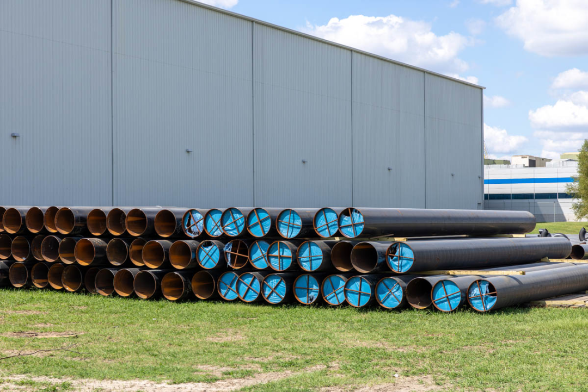

# 122 天打造的奇迹：深入探访 xAI 的 10 万块 GPU 超级 AI 计算机集群
[122 天打造的奇迹：深入探访 xAI 的 10 万块 GPU 超级 AI 计算机集群](https://mp.weixin.qq.com/s/zYuWlY7uTgFH9YuVMr6pCg) 

 作者丨 Patrick Kennedy

译者丨明知山

策划丨褚杏娟

xAI Colossus 数据中心计算大厅

今天，我们将分享 xAI Colossus 超级计算机集群的参观之旅。应该有人听说过马斯克的 xAI 公司在孟菲斯建造了一个巨大的人工智能超级计算机集群，而这就是那个集群。拥有 10 万块 NVIDIA H100 GPU，这个价值数十亿美元的人工智能集群不仅因其庞大的规模而闻名，更因其惊人的建设速度而备受瞩目。建造团队仅用 122 天就建成了这个巨大的集群。今天，我们将带着大家一睹其内部的风采。

当然，我们也为此制作了一个视频，大家可以在推特或 YouTube 上找到：_https://www.youtube.com/embed/Jf8EPSBZU7Y_

我们通常会独立地开展活动，但这次不同，超微电脑（Supermicro）赞助了这次活动，因为这是今年我们涉及的最昂贵项目之一。此外，考虑到构建全球最大人工智能集群的敏感性，部分内容将进行模糊处理，或者我会故意保持一定的模糊性。我们在马斯克及其团队的特殊授权下才能展示这些内容。

超微液冷机架

Colossus 的基本构建模块是超微液冷机架，每个机架配备八台 4U 服务器，每台服务器搭载八块 NVIDIA H100 GPU，这样每个机架总共有 64 块 GPU。八台这样的 GPU 服务器与一个超微冷却剂分配单元（CDU）及其相关硬件构成了一个 GPU 机架。

xAI Colossus 数据中心超微液冷节点

这些机架按每八个机架一组，每组 512 块 GPU，并配备网络设施，以便在更大规模的系统中实现小型集群的部署。

xAI Colossus 数据中心超微 4U 通用 GPU 液冷服务器

xAI 采用的是超微 4U 通用 GPU 系统，这些系统代表了市场上最先进的人工智能服务器。之所以领先，有几个关键因素。首先是它们的液冷技术，其次是其出众的可维护性。

xAI Colossus 数据中心超微 4U 通用 GPU 液冷服务器近景

大约一年前，在丹佛举行的 2023 年超级计算大会（SC23）上，我们首次目睹了这些系统的原型。然而，在孟菲斯，我们未能亲自操作这些系统，因为当时它们正忙于执行训练任务。其中一个特性是系统安装在无需从机架中移除即可进行维护的托盘上。1U 机架的歧管设计有助于引入冷却液和排出热液。快速断开装置使得液冷系统可以迅速移除，我们去年展示了这些部件可以单手轻松拆卸和安装。在这些部件被移除后，托盘便可以轻松拉出进行维护。

超微 4U 通用 GPU 系统，适用于液冷 NVIDIA HGX H100 和 HGX 200

幸运的是，我们有这台服务器原型的图片，可以展示这些系统的内部构造。除了配备定制的超微液冷块的 8 个 GPU NVIDIA HGX 托盘外，CPU 托盘更是彰显了这些系统为何能成为行业领先的下一代设计。

超微 4U 通用 GPU 系统，适用于液冷 NVIDIA HGX H100 和 HGX 200

在 SC23 展示的原型中，有两个 x86 CPU 液冷块的设计相当常见，真正独特的地方在右侧部分：超微的主板集成了几乎所有 HGX AI 服务器目前使用的四个 Broadcom PCIe 交换机，而不是将它们单独放在单独的板上。此外，超微还定制了一个液冷块，专门用于冷却这四个 PCIe 交换机。行业内的其他 AI 服务器通常是在建造完成后才将液冷系统添加到原有的空气冷却设计中，而超微从一开始就考虑到了液冷设计，并且全部组件均来自一个供应商。

超微 SYS-821GE-TNHR NVIDIA H100 和 NVSwitch 液冷模块

就像汽车一样，有些车型最初是为汽油动力设计的，后来才在底盘上加装了电动动力系统，而另一些则从设计之初就以电动为出发点。这个超微系统属于后者，而其他 HGX H100 系统则属于前者。自这些系统发布以来，我们已经亲自体验了大多数公开的 HGX H100/H200 平台，以及一些超大规模的设计。这个超微系统与其他系统之间存在显著差异，包括我们之前评测过的超微的一些既可以液冷也可以空气冷却的系统。

在机架的背面，我们看到了用于 GPU 和 CPU 复合体的 400GbE 连接光纤，以及用于管理网络的铜缆。这些网络接口卡（NIC）安装在它们自己的托盘上，可以轻松更换而不需要移除机架，尽管它们位于机架的后部。每个服务器配备了四个电源，这些电源支持热插拔，并通过三相 PDU 进行供电。

xAI Colossus 数据中心超微 4U 通用 GPU 液冷服务器后视图 1

机架底部有 CDU，即冷却剂分配单元。这些 CDU 就像是大型的热交换器。每个机架内都设有一个流体循环系统，为所有 GPU 服务器提供冷却服务。这里提到的是专门的冷却液，而非普通水，因为这些循环系统通常需要使用针对液冷块、管道、歧管等材料进行特殊调整的冷却液。

xAI Colossus 数据中心超微 CDU 位于机架底部

每个 CDU 都配备了冗余的泵和电源，如果任何一个部件发生故障，都可以在不关闭整个机架的情况下进行现场更换。

移除一个超微 CDU 泵

你可以看到设施水和机架歧管内的液体的流动情况，还可以看到每个 CDU 都配备了热插拔的冗余电源。

超微 CDU 后置视图

这是隐藏在众多管道和电缆之中的 Colossus 机架内的 CDU。

xAI Colossus 数据中心超微 CDU 后视图

Colossus 机架的两侧有三相 PDU 和机架歧管。每个前置的 1U 歧管为 4U 通用 GPU 系统提供服务，而这些系统又由连接至 CDU 的机架歧管提供服务。这些组件分别用红色和蓝色进行标识。这是一种我们都熟悉的颜色编码方案，红色代表较暖的部分，而蓝色代表较冷的部分。

xAI Colossus 数据中心超微机架歧管

你可能还从这些照片中看到了风扇。这些风扇用于冷却服务器内部的多个组件，包括 DIMM、电源、低功耗的基板管理控制器（BMC）以及网络接口卡等。每个机架都需要与数据中心进行冷却中和，避免安装大型的空气处理器。服务器中的风扇从前部吸入较冷的空气，并在服务器后部排出热空气。随后，这些热空气会经过后门热交换器。

后门热交换器

后门热交换器听起来似乎很高级，但实际上它们与汽车散热器非常相似。它们从机架中抽取废热，并通过鳍状的热交换器 / 散热器进行散热。热交换器内部有液体流动，类似于服务器的液冷系统，热量可以与设施水循环交换。空气通过装置背面的风扇被抽过。与大多数汽车散热器不同的是，这些热交换器有一个巧妙的设计：在正常运行时，它们会发出蓝光。如果需要维修，它们也可以发出其他颜色的光，比如红光。

后门热交换器

这些后门热交换器在数据中心的设计中还扮演着另一个关键角色。它们不仅能够从超微的液冷 GPU 服务器中排除多余的热量，还能够从存储设备、CPU 计算集群以及网络组件中抽取热量。

超微存储系统

在存储方面也非常有趣。在人工智能集群中，我们经常会看到大型的存储阵列。值得注意的是，尽管这些系统运行着来自不同供应商的存储软件，但几乎所有存储服务器都采用了超微的产品。这并不令人感到意外，因为超微是众多存储供应商的 OEM 合作伙伴。

xAI Colossus 数据中心超微 1U NVMe 存储节点

在参观过程中，有一个非常有趣的点是部分存储服务器看起来与 CPU 计算服务器非常相似。

xAI Colossus 数据中心超微 1U NVMe 存储节点

在我们的影像资料中，你会看到很多 2.5 英寸 NVMe 存储托架的身影。正如我们在 Substack 上所讨论的，大型人工智能集群已经从传统的磁盘存储转向了闪存技术，因为这样不仅大幅降低了能耗，还带来了更高的性能和存储密度。虽然闪存的每 PB 成本可能更高，但从大规模集群的总体拥有成本来看，闪存往往具有更优的经济效益。

超微 CPU 计算

在这些集群中，你会看到有相当一部分传统的 CPU 计算节点。对于处理任务和数据操作任务，CPU 依然比 GPU 更为高效。

xAI Colossus 数据中心 CPU 计算机架

我们看到了 1U 服务器的机架。每台服务器都经过精心设计，以实现计算密度与散热需求之间的平衡。一个明显的例子是，我们可以看到前面板上有橙色的 NVMe 存储托架标签，但大约三分之一的面积用于吸入冷空气。

xAI Colossus 数据中心 CPU 计算机架

这些 1U 计算服务器可以通过风扇进行冷却，同时，后门热交换器能够有效地移除热量，并与数据中心的设施水进行热交换。

网    络

网络也是非常有趣的一个部分。这里采用的网络技术与普通计算机的以太网电缆技术是一样的，只不过这里使用的是 400GbE，速度是普通 1GbE 网络的 400 倍。每个系统都有九条这样的链接，因此，每个 GPU 计算服务器能够提供大约 3.6Tbps 的带宽。

xAI Colossus 数据中心 NIC

GPU 的 RDMA 网络占据了带宽的绝大部分。每个 GPU 都有自己的网络接口卡。这里使用的是 NVIDIA 的 BlueField-3 SuperNIC 和 Spectrum-X 网络技术。NVIDIA 的网络技术栈中集成了一些先进的技术，这些技术能够确保数据准确无误地传输到目的地，并有效规避集群中的潜在瓶颈。

xAI Colossus 数据中心交换机光纤

许多超级计算机网络使用 InfiniBand 或其他技术，而这里采用的是以太网。以太网的优势在于可扩展性。以太网构成了互联网的骨干，因此它是一项极具扩展性的技术。这些庞大的人工智能集群正在扩展到一些尚未被更奇特技术触及的规模，xAI 团队的这一举措无疑是非常大胆的。

除了 GPU RDMA 网络之外，CPU 也有一个 400GbE 连接，它采用的是一种完全不同的交换架构。xAI 为 GPU 独立运行一个网络，为集群的其他部分运行另一个网络，这种设计在高性能计算集群中非常常见。

xAI Colossus 数据中心单模和多模光纤

400GbE 的速度有多快？它的连接能力超过了 2021 年初顶级英特尔至强服务器处理器在其所有 PCIe 通道上能处理的数据总和。而这里的每台服务器实际上拥有九倍于那种能力的网络带宽。

xAI Colossus 数据中心交换机堆叠

部署这些网络涉及了大量的光纤布线工作。每根光纤都被精确切割到合适的长度，并进行标记。

xAI Colossus 数据中心光纤布线

我在八月份有幸见到了一些从事这项工作的人。结构化布线是一件有趣的事情。

xAI Colossus 数据中心顶部布线

除了高速集群网络之外，这里还有低速网络，用于各种管理接口和环境设备，这些东西是大规模集群不可或缺的组成部分。

Colossus 的设施

这里的服务器配备了先进的液冷机架，因此电力和供水设施就变得至关重要。这里有巨大的水管，里面流着冷却水和温水。冷水被引入设施，并在每个机架中通过 CDU 进行循环。热量从 GPU 和后门热交换器循环传递到 CDU 处的设施水循环。随后，较暖的水被输送至设施外的冷却塔。当然，这里的冷却塔并不是那种用于制作冰块的冷却塔，而是用于降低水温，使其降至足够低，以便通过设施进行循环。

xAI Colossus 数据中心设施水管

在电力方面也非常有趣。孟菲斯系统建造期间的场景颇为壮观，我们目睹了团队正在安装巨大的电缆。

xAI Colossus 数据中心部分电气基础设施

在设施外部，我们看到了装有特斯拉 Megapack 的集装箱。AI 服务器并不总是全天候以 100% 的额定功率运行，相反，它们的能耗呈现出明显的高峰和低谷。由于现场部署了大量 GPU，工作负载会在 GPU 间转移，因此能耗会出现波动。团队发现，毫秒级的功率峰值和下降幅度相当大，因此在系统中引入特斯拉 Megapack 来缓冲这些功率波动有助于确保整个设施的稳定性和可靠性。

准备在 xAI Colossus 安装的特斯拉 Megapack

当然，这个设施才刚刚开始。在我们参观时，首批四个数据大厅的集群已经部署了大约 10 万块 GPU，但集群的扩展工作正在以惊人的速度推进。

xAI Colossus 数据中心外部扩建

结束语

通过参观，我深刻感受到 xAI 团队需要很多时间来处理供应商之间的差异。这个项目能够得以实现，完全依赖于一群专家共同怀揣着以空前速度建造庞大 AI 集群的宏伟愿景。如果我只是在拍摄视频的那天匆匆一瞥，可能无法真正理解有多少人在共同努力实现这一规模浩大的工程。

如果你对了解大型 AI 设施的建造感兴趣，请留意 xAI 和超微电脑的招聘信息。我注意到 AI 社区正在讨论 LLM 如何随着计算能力的提升而不断发展，以及它们如何超越聊天机器人的范畴，展现出更广泛的应用潜力。在参观 Colossus 时，我意识到，只有当人们预见到巨大的价值时，才会建造这种规模的项目。Grok 和 xAI 团队未来的工作似乎不局限于简单的聊天机器人。许多极具智慧的人才正在投入巨额资金和时间，以尽可能快的速度实现这一宏伟目标。

**原文链接：** 

https://www.servethehome.com/inside-100000-nvidia-gpu-xai-colossus-cluster-supermicro-helped-build-for-elon-musk/

**_声明：本文由 InfoQ 翻译，未经许可禁止转载。_**

今日好文推荐

[“前端”架构真的有必要存在吗？](http://mp.weixin.qq.com/s?__biz=MjM5MDE0Mjc4MA==&mid=2651224148&idx=1&sn=7d85ffd1bc5ea0cd592fdc9fffcb3820&chksm=bdbb80078acc09114a284198fce1edc08a4de83bcb965db633fd178ad2447476a199ceb53ecc&scene=21#wechat_redirect)

[C/C++ 大限将至？美政府给出最强硬要求：2026 年前关键软件必须开始全面去 C](http://mp.weixin.qq.com/s?__biz=MjM5MDE0Mjc4MA==&mid=2651224121&idx=1&sn=bb77e1bef17c7e661484a264e52b8091&chksm=bdbb806a8acc097c133020e400e84a1913b6ffdc58ff3ea9298413931386cbe4c996ee089ea4&scene=21#wechat_redirect)

[受软件拖累，大众血亏155亿元：直接把奥迪、宾利、杜卡迪和兰博基尼等豪车利润抹平了](http://mp.weixin.qq.com/s?__biz=MjM5MDE0Mjc4MA==&mid=2651224003&idx=1&sn=60584ed13237366db608b2199dda8c81&chksm=bdbb8f908acc0686f79c9f6ece9ea7c7a3bb745eeaad53a459bad28f88a960510fa8034f328e&scene=21#wechat_redirect)

[低级失误导致 Elasticsearch 仓库 404，7万多 star 一夜清空，网友：只是手滑了？！](http://mp.weixin.qq.com/s?__biz=MjM5MDE0Mjc4MA==&mid=2651223941&idx=1&sn=3fb04ce65f6e2640acbf082ec7d49af1&chksm=bdbb8fd68acc06c0d5bef54da4164c62f3a3d1d5ae0faaabaa5b54bde2ee000af56cfc0fab23&scene=21#wechat_redirect)

活动推荐

2024 年收官之作：12 月 13 日 -14 日，AICon 全球人工智能开发与应用大会将在北京举办。从 RAG、Agent、多模态模型、AI Native 开发、具身智能，到 AI 智驾、性能优化与资源统筹等大热的 AI 大模型话题，60+ 资深专家共聚一堂，深度剖析相关落地实践案例，共话前沿技术趋势。大会火热报名中，详情可联系票务经理 13269078023 咨询。

