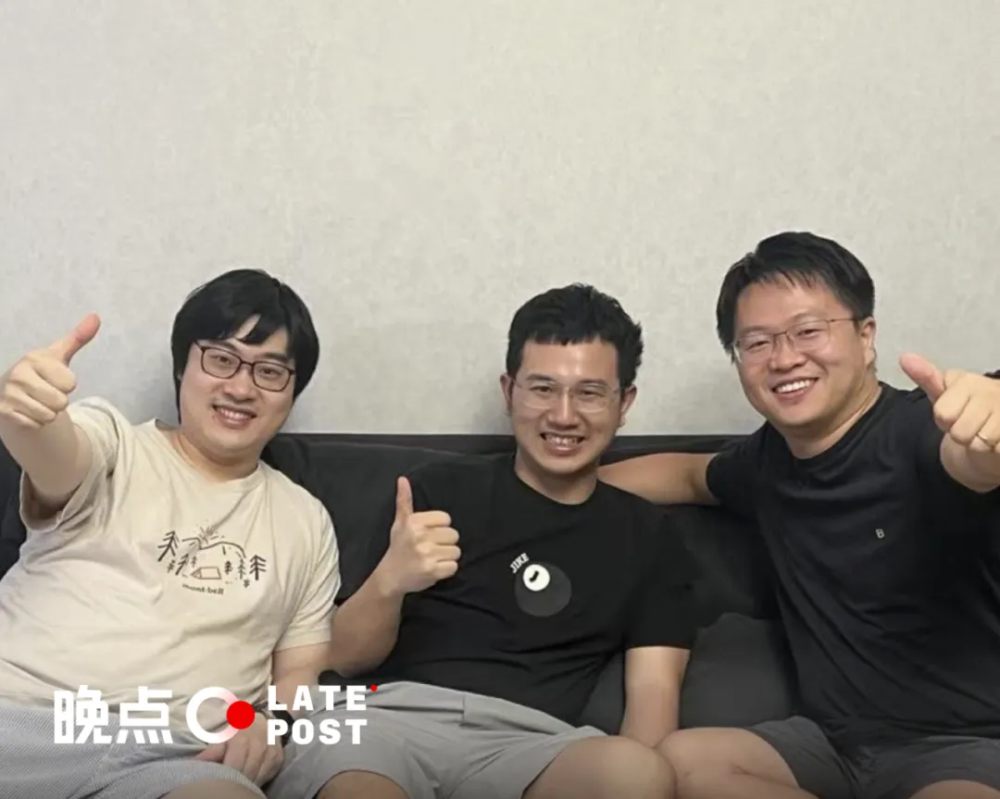
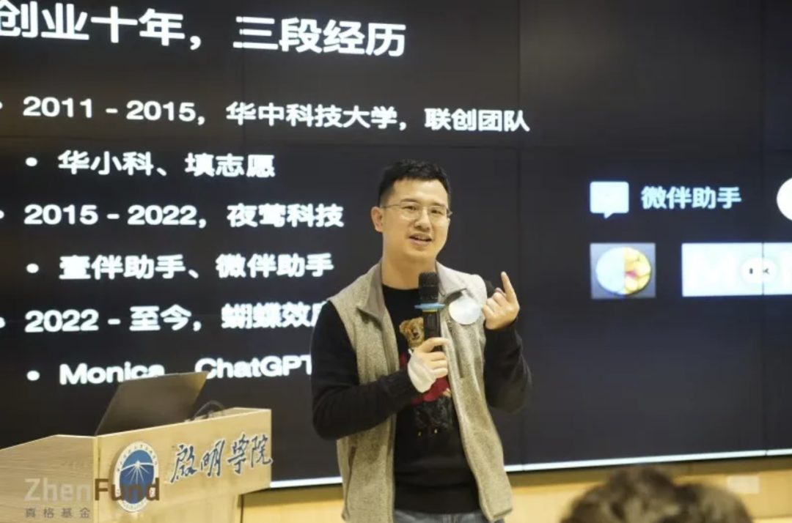
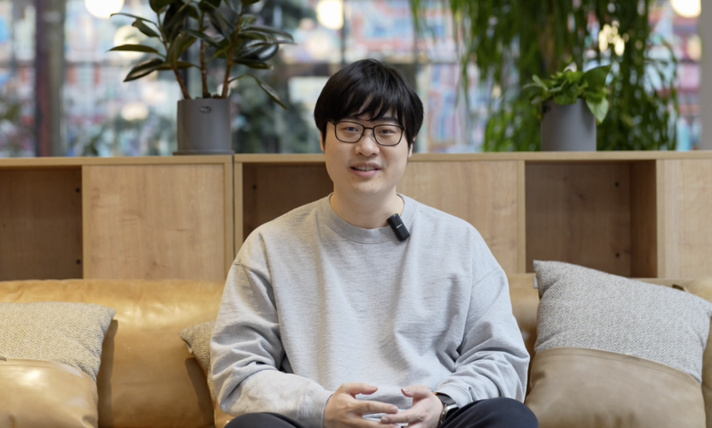
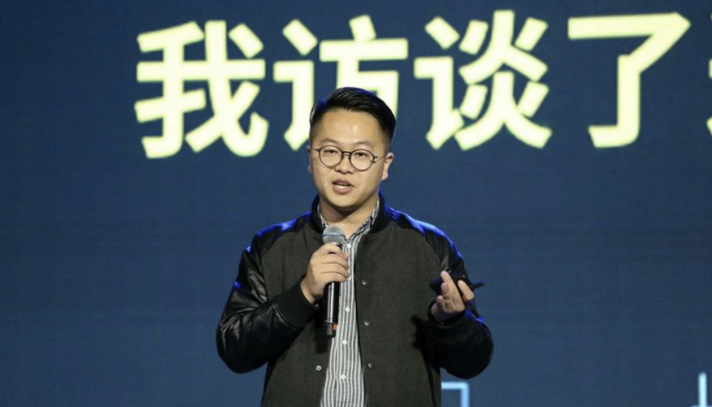
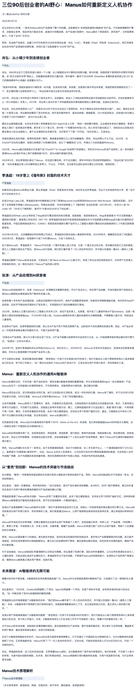
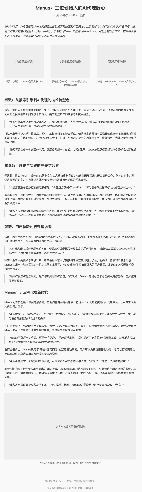
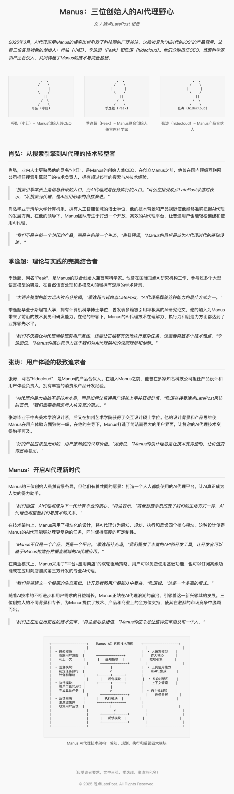

3 位连续创业者打造 Manus，应用潮里有更多 “underdog” 的机会（文末附 Manus、Open Manus 实测）
===============
                                                                          

             

  

3 位连续创业者打造 Manus，应用潮里有更多 “underdog” 的机会（文末附 Manus、Open Manus 实测）
================================================================

Original 晚点团队 [晚点LatePost](javascript:void(0);)

晚点LatePost

北京晚达科技有限公司

晚一点，好一点

1218篇原创内容

_2025年03月08日 12:33_

边缘崛起、风暴来临。

**文丨****贺乾明**

**编辑丨程曼祺**

3 月 6 日，AI 产品 Manus 引发关注。开发 Manus 的三位关键人物是：创始人、CEO 肖弘（小红）；联合创始人、首席科学家季逸超（Peak）；以及产品合伙人张涛（hidecloud）——两位 90 后连续创业者和一位 15 年换了 10 家公司的 85 后产品老兵。

一个边缘地带的 “underdog” 小团队，以车库创业的开发方式，出乎意料地搅起了一场小风暴。

“硬科技创业者基本都是名门正派，光谱另一端的消费级产品创始人则几乎都是畎亩之中。” 真格基金投资人刘元说。他也是 Manus 的天使投资人。

毕业于华中科技大学的肖弘是江西吉安人，创业起点在武汉，曾开发过两款微信生态的插件：微信公众号排版工具壹伴和企业微信客户关系管理工具微伴，卖给一家独角兽公司。

高中阶段就开始创业的季逸超是北京人，他在苹果 App Store 上线不久，就开发出猛犸浏览器，后来做了 Magi 知识搜索引擎。季逸超曾告诉我们，那时有投资人 “诱惑” 他：我给你一笔钱，敢不敢做个 Google？他拒绝了，不是觉得做不到，而是他觉得只有 “抛开利益” 才有可能。

重庆人张涛则先后在烽火国际、腾讯、豌豆荚、猪八戒网、AcFun、映客、神策数据、字节、光年之外这些业务不同、风格迥异，横跨 to B、to C 市场的公司里做过产品。

肖弘和季逸超都拿过真格基金的投资，两人的第一家公司后来都被收购；张涛工作过的光年之外也拿过真格的投资。我们了解到，三人在 2024 年组队完毕，有真格在其中介绍撮合。

我们了解到，一年前，肖弘团队开发的产品 Monica 刚开始高速增长时，国内一家大厂的创始人曾与肖弘在香港单独会面，后来有消息称对方有意收购肖弘的公司。到现在为止，肖弘的公司依然保持独立运营。

作为一款 Agent 产品，Manus 解决复杂问题时会需要调度不同的工具。三人不同的工作经历和专长，也从不同的角度为 Manus 的诞生贡献了力量。Manus 还只是一个初步产品，需要迭代，需要更多算力支持，才能放开给更多人使用，才能真正有更多用户的真实验证和反馈。超越产品阶段的巨大关注，使团队一时措手不及。

2025，确实是 AI 应用元年，让我们期待更多的风暴来临。

**肖弘：“请你一定相信，壳也有壳的用处！”**

肖弘在华中科技大学分享创业经历。图片来自真格基金。

肖弘创业理念和他开发的工具产品一样，充满实用主义。这首先给他带来的是痛苦，而不是收获。

肖弘是微信时代成长起来的创业者。他 2011 年到 2015 年读大学期间，微信一步步成为一个全民应用，从一个通讯软件向社交平台扩张，机会更大的移动互联网创业红利消散。

大学即将毕业时，肖弘选择做微信公众号编辑、排版工具 “壹伴”。大二时，他就基于华科官方的微信公众号开发过校内漂流瓶和微信上墙等工具，收获了积蓄和开发经验。

创业一年，肖弘和团队自筹的资金枯竭，在民房中靠接软件外包工作赚钱，就要准备解散团队去找公司上班。

随后转机出现：肖弘和团队参加一场黑客松竞赛拿到第一名，获得了投资人的青睐。

真格基金投资人刘元说，肖弘上台时穿的平克·弗洛伊德（Pink Floyd）衣服吸引了他的注意力，而且 “他做出来的产品拿了第一名，产品想法有意思，做出来的速度很快，台风又很有幽默感”。刘元决定力推。

真格的 100 万元投资让肖弘迈过创业的第一道坎，也得到了第一个充满危机感的教训：“做产品的时候，就应该同时思考怎么去做商业化。”

之后三年的商业化探索中，他扩写了上述的教训：要找到最符合用户需求的商业模式——对于微信排版工具来说，商业模式应该是做 SaaS、直接卖工具软件，而不是用免费工具获客，然后靠广告平台变现。他说，这是打败竞争对手的核心原因。

2019 年前后，壹伴已经在行业中站稳脚跟，获得千万人民币级别的现金流。肖弘开始寻找新的机会，寻找更大的创业方向，他们开发过亲子相册、直播答题、书店等微信小程序，但反响平平。当年 11 月，企业微信团队在武汉招募服务商，提到 “未来会打通微信”。肖弘意识到这是一个机会。

“电子邮件上，曾经长出来了 Salesforce 这样伟大的企业。我们相信，在企业微信和微信上也能长出类似伟大的企业。” 肖弘后来在一篇文章中写。

2019 年 12 月，企业微信 3.0 版本上线，打通微信通讯录、朋友圈、群聊等，肖弘团队立即推出管理客户关系的企业微信插件 “微伴” 。又过半年，微信封杀直接在微信中管理群聊的辅助软件，给 “微伴” 送来了迅速增长机会，也让更多人看到了肖弘团队的潜力。

新的选择摆在面前：接受 VC 的投资，亲手实现 Salesforce 梦；还是接受收购 Offer，把梦想交给别人？

他选择了后者。2020 年底，肖弘把公司的控股权以数亿元人民币的价格出售。据我们了解，他在这次交易中得到千万元级别回报。他在社交平台即刻上写下告别：“我对自己做了四年的一个产品，一直有这样那样的不满 ...... 但我永远失去了让它更好的机会了。”

在微信生态中创业的经历，塑造了 AI 时代创业者的肖弘。2022 年再创业时，肖弘同样选择做工具型产品。

他变得更大胆，团队要研发的产品还没有上线，因为 ChatGPT 发布，他们先花数百万买下华科学长开发的插件 ChatGPT for Google，让它独立运作的同时，给团队开发的插件产品 Monica 引流，缩短冷启动时间。

“他不是那种 ego 很强的人。” 一位接触过肖弘的人士说，“他定下了比较高的目标，但用接地气的创业打法实现。”

那时行业里更看好开发大模型的公司做产品，肖弘选择在大模型基础上开发插件，被指为 “套壳”。但 Monica 是中国大模型行业少有的盈利产品。

一年过去，模型变成一个插件，产品层的重要程度拔高。Cursor、Devin 等调用大模型解决复杂任务的产品让模型具备了更强的能力。它们也成了肖弘等人开发 Manus 的灵感来源。

在社交媒体上介绍 Manus 上线时，肖弘在结尾写道：请你一定要相信，壳也有壳的用处！

**季逸超：“做能想到最野的事”**

季逸超。图片来自 Manus。

和肖弘不同，季逸超的创业生涯，没有激烈的竞争，没有危机感，也没有参加黑客松拉投资——投资人是主动找上门的。

季逸超是 App Store 生态中成长起来的创业者。他家庭环境优渥，初中就已经钻研操作系统。2008 年，苹果推出 App Store 后，16 岁的季逸超一连写了 7 款 App，还因为用了 “Monopoly”（大富翁）这个词收到跨国而来的律师函。

第八款 App 猛犸浏览器是他的成名作，凭借占用内存少（当时的手机才 128M 内存）、滑动交互便捷等特征，定价 1.99 美元，3 天内下载量达到 12 万。

“赚得贼开心，美国、德国、日本人都在买。” 季逸超曾在 2022  年告诉我们，现在 “我们都已经快忘了付费的软件是什么感觉”。

猛犸浏览器也帮季逸超吸引到了真格基金创始人徐小平的关注。他们带着季逸超去美国看了扎克伯格创办 Facebook 的办公室。徐小平认为，季逸超是 “中国的扎克伯格”。

2012 年，季逸超接受真格基金投资，创办 Peak Labs，登上《福布斯》杂志封面，上面写道 “互联网新人类” 和 “天使投资人让他做 ‘能想到最野的事’”。

Peak Labs 的核心产品是一个名为 Magi 的知识搜索引擎。它可以从不同的网页中抽取出知识点，回答用户的问题——产品实现逻辑与当前的 AI 搜索应用类似。不同的是，季逸超用的是知识图谱技术，而不是大语言模型。

2019 年 Magi 的公众版上线后迅速引发关注，用户量 10 天破百万、一个月内达到 300 万，一度挤崩服务器。这次走红超出了季逸超的预期：他们只想做一个简单的 Demo，用来吸引企业客户订单。

Magi 原本的目标达到了，但个人用户也在尝鲜后离开。“任何产品面对对普通用户只有一次机会，” 季逸超后来复盘这段经历时说，“哪怕我们再更新，他们第一次使用没能留下来，还是会觉得这个东西好像不太好用，不会再来了。”

2020 年，OpenAI 发布 GPT-3，大模型开始展现出惊人的通用文本理解能力，也意味着季逸超基于知识图谱的信息提取模型即将被颠覆。

他继续改进 Magi，服务企业客户——给创业伙伴、客户、投资人一个交代。2021 年，他把 Magi 的数据集开放给了国内外 40 多家研究机构。2022 年，他卖掉了 Magi。

2022 年初，我们在 Peak Labs 位于郎园三层红砖楼的办公室见到季逸超。他说，“只要不愁吃穿，有 Wi-Fi、空调，然后健康一点，大部分技术问题一个人都能搞定。”

那时的他，还想重新做一个搜索引擎，然后开源。这无关创业成败，更像是他的兴趣所在。现在的 Manus，正在以一种新的方法、新的交互方式，实现他的目标。

据我们了解，季逸超在去年 10 月，已经开源了一款推理模型，介绍了如何用强化学习做 “long horizon thinking” 和 “step-by-step execution”——这也是 Manus 用到的部分技术。

“希望 Manus 是我这辈子做的最后一个产品。” 季逸超说，“因为未来再有奇思妙想的话，‘Leave it to Manus’！”

**张涛：这是他的第十段职业生涯**

张涛。图片来自三节课。

张涛，一个经历过不同风口、不同行业、不同公司的产品经理，一个有着充沛分享欲的人。

2009 年从重庆邮电大学毕业到成为 Manus 的产品合伙人，张涛历时 15 年，在烽火国际、腾讯、豌豆荚、猪八戒网、AcFun、映客、神策数据、字节、光年之外等 9 家不同的公司从事产品工作。

张涛曾在 2016 年 5 月在介绍自己是什么样的文章中写道：“喜欢看看在新的规则中，各项事物是怎么运转的。”

他职业生涯中跨度最大的跳槽是 2018 年加入神策数据担任副总裁，从 ToC 行业转向 ToB。“做了快十年产品，看着行业的浮躁，一些有确定性的方法论，并没有被沉淀和推广开来”，张涛后来说，他原本想去做咨询，但可能一年接触不到几个客户。

他认为，去神策能把数据驱动产品设计及运营方面的方法论推广开，而且对神策也有价值。他说，每一段职业生涯，自己到底能给组织提供什么价值，都想得很清楚，“这是安全感的重要来源”。

2021  年从神策离职后，张涛回到重庆，做了一年产品咨询。

张涛常说的一句话是：“学习，是一个 PM（产品经理）永远不该停下的生存技巧。”

2017 年，基于计算机视觉技术的 AI 浪潮兴起，正在映客担任高级产品总监的张涛，看到 Twitch 开发的 ClipMine 模型，可以识别守望先锋、炉石传说中玩家正在玩的英雄和段位。他认为，这样的需求在国内直播行业同样存在，就用周末时间安装 TensorFlow 和 OpenCV 自己训练了一个识别王者荣耀中 “英雄” 的模型。

“如果理解机器学习，很多以往被认为不可能的事，都将成为产品逻辑的一部分。” 张涛当时写道，“能否建立这种新的认知，运用好新的工具，将在未来某些领域里区分出产品经理的高下。”

2024 年初，他分享产品经理如何学习 AI，从 Stable Diffusion 的技术原理开始讲。2025 年，他也写了一篇万字 DeepSeek-R1 论文的赏析。

Manus 是张涛第十段职业生涯，身份也从刚入行时的产品经理、变成产品总监、到现在的产品合伙人。

Manus 发布前，他在社交媒体上分享，他们定义了一个名叫 “PPD 指标（PM to Prompt Distance）”，即产品经理改 Prompt（提示词）要经过几个人之手。他认为，PPD 大于 2，“这个组织多半做不好 AI 产品”，PPD 等于 2，“及格线但很危险”，只有 PPD 为 1 和 0，“才有战斗力”。

**实测：Manus vs. Open Manus +Claude 3.7**

3 月 7 日晚，我们收到 Manus 团队发来的邀请码，测试这款 Agent 的写稿能力。我们也在本地部署了开源的 Open Manus，作为对比参考。

我们准备的提示词是：

开发 Agent 应用 Manus 的有三位关键人物：创始人、CEO 肖弘（小红），联合创始人、首席科学家季逸超（Peak），产品合伙人张涛（hidecloud），请你帮我搜索他们的信息，用《晚点 LatePost》的风格撰写一篇稿件介绍他们，然后把文章做成一个网页，用他们的照片当作插图，照片要处理成华尔街日报专栏配图风格的素描图。在文章的末尾，请你附上向普通人解释 Manus 技术原理的解析图。

发给 Manus，我们等了约 60 分钟后，得到如下回复：

Manus 完成了收集资料、撰写文章的任务，但存在幻觉，比如三位创始人，只有两位 90  后。稿件质量并没有达到《晚点 LatePost》的要求（作者松了一口气）。

最后部署成网页时，Manus 出现了一个故障，无法显示图片，因此我们无法确定它是否按照要求处理了图片。从过程文件来看，它完成了最后一个技术解析的框架工作，最后没能做成图。

我们明确提出该故障后，Manus 又处理了约 10 分钟，也没有解决。Manus 方面称，这个是已知的问题，正在修复。

已关注

Follow

Replay Share Like

Close

**观看更多**

更多

_退出全屏_

视频加载失败，请刷新页面再试

 [ Refresh](javascript:void(0);)

[Video Details](javascript:;)

Manus 制作的网页：

https://pages.manus.im/?sId=2mG73dSNoqU6zettnIJ0u1&filename=manus\_article.mdx

Manus 解决问题的过程回放链接：

https://manus.im/share/2mG73dSNoqU6zettnIJ0u1?replay=1

发给 Open Manus （调用 Claude 3.7 模型），等待 7 分钟，消耗 25.7 万 token（花费 10 元人民币），得到如下两版回复（左右滑动查看）：

左右滑动查看

Open Manus 也能像 Manus 那样完成资料收集、稿件撰写任务，但内容丰富度、模型幻觉处理上比 Manus 差。比如它把肖弘、季逸超、张涛处理成了化名。

Open Manus 也无法处理图片，但最后反馈了两个版本，一个无法显示图片，另一个用 ASCII 符给他们三人画了一样的肖像，并生成了技术解析图。

Open Manus 执行任务的过程：

已关注

Follow

Replay Share Like

Close

**观看更多**

更多

_退出全屏_

视频加载失败，请刷新页面再试

 [ Refresh](javascript:void(0);)

[Video Details](javascript:;)

黄帧昕对本文亦有贡献。

题图：从左到右依次为季逸超、肖弘、张涛。拍摄于 2024 年 7 月。来源：Manus 团队成员。

**\-** **FIN \-**

[

预览时标签不可点

Close

更多

Name cleared

**微信扫一扫赞赏作者**

Like the Author[Other Amount](javascript:;)

Articles

No articles

Like the Author

Other Amount

¥

最低赞赏 ¥0

OK

Back

**Other Amount**

更多

赞赏金额

¥

最低赞赏 ¥0

1

2

3

4

5

6

7

8

9

0

.

修改于2025年03月08日

Close

更多

搜索「」网络结果

修改于2025Year03Month08Day

​

暂无留言

已无更多数据

[Send Message](javascript:;)

  写留言:

Close

**Comment**

Submit更多

[表情](javascript:;)

Scan to Follow

继续滑动看下一个

轻触阅读原文

晚点LatePost

向上滑动看下一个

当前内容可能存在未经审核的第三方商业营销信息，请确认是否继续访问。

[继续访问](javascript:)[Cancel](javascript:)

[微信公众平台广告规范指引](javacript:;)

[Got It](javascript:;)

 

 Scan with Weixin to  
use this Mini Program

[Cancel](javascript:void(0);) [Allow](javascript:void(0);)

[Cancel](javascript:void(0);) [Allow](javascript:void(0);)

× 分析

 : ， ， ， ， ， ， ， ， ， ， ， ， .   Video Mini Program Like ，轻点两下取消赞 Wow ，轻点两下取消在看 Share Comment Favorite 听过            

**晚点LatePost**

3 位连续创业者打造 Manus，应用潮里有更多 “underdog” 的机会（文末附 Manus、Open Manus 实测）

,

,

选择留言身份
