# 92页的llama 3.1技术报告，我替你们啃下来了
[92页的llama 3.1技术报告，我替你们啃下来了](https://mp.weixin.qq.com/s/fWu6QtABI9OseygXTr1cJw) 

                             92页的llama 3.1技术报告，我替你们啃下来了                                                                   

92页的llama 3.1技术报告，我替你们啃下来了
==========================

原创 研泽 [阿里云开发者](javascript:void(0);)

阿里云开发者

阿里巴巴(中国)有限公司

阿里巴巴官方技术号，关于阿里的技术创新均呈现于此。

1467篇原创内容

_2024年10月16日 08:31_ _浙江_

阿里妹导读

  

作者花了半个月时间，认真读完了llama 3.1技术报告，并总结成本文，希望能帮到对这个感兴趣的小伙伴们。

背景

几个月前meta开源了llama3.1，405B，又一个号称追平gpt4的选手。还附赠了一份92页的技术报告。

然后第二天就被mixtral打脸，官网针锋相对。最绝的还是那个标题，Large  Enough。

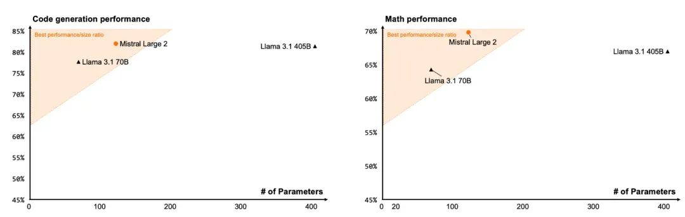
意思是meta的405B大而无用呗，看看这个黄三角形

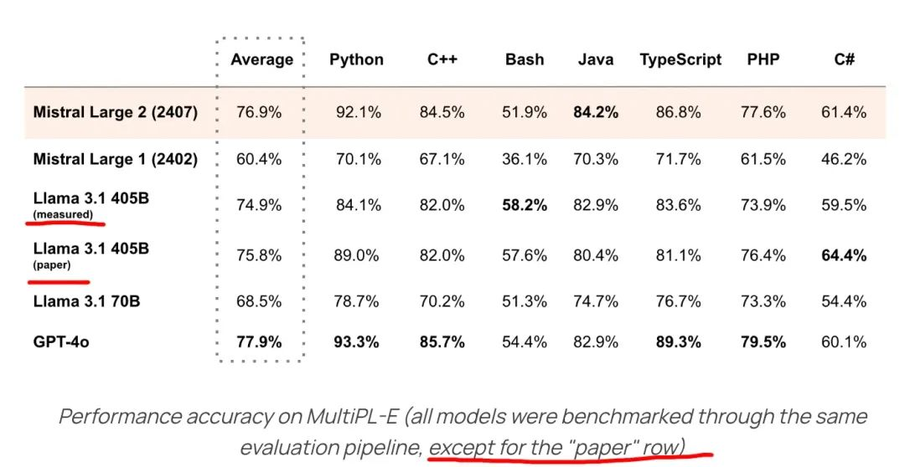


意思是llama3.1的报告也作弊了呗

一般这种大模型的技术报告我是都懒得看的。一方面除了各种技术细节，很少有什么新东西或者思路流程。另一方面也是国内各种二道贩子的解读虽然质量低，但作为中文摘要看还是可以的，可以从中找到技术关键词直接看对应的原文。

当然，根源在于我英语一般，读起来太慢了。相信很多小伙伴和我也差不多。

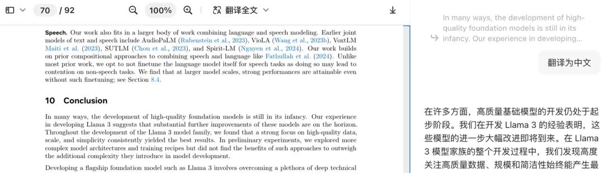


但是，llama3.1 405B不太一样。这个模型的开源，意义重大。就类似Attention is all you need，作为NLP算法怎么都得啃下来。所以我花了半个月时间，认真读完了，并总结为以下内容，希望能帮到对这个感兴趣的小伙伴们。

话不多说，直接进入正题。

报告给我们的启示

  

**数据**

数据很缺。无论是数量上还是质量上。某些细分类特别特别缺。合成数据是大趋势。但目前技术原因，用A大模型合成的数据对A大模型本身没有提高效果。合成数据进行后训练可以一定程度上替代模型蒸馏。不过这个早就是主流操作了。数学推理/代码数据非常有用，得加大力度。

  

**规模化**

从现在看，scaling laws应该可以再指导几年。扩大大模型参数量规模理论上可以继续提高效果，并更好的辅助对小模型的蒸馏。卡点在合成数据。

  

**复杂度管理**

这里是个方法论的选择问题，无关对错，仅供参考。是选择上限更高、波动更大的方案去追求极限，还是选择稳定的路线最大化利用规模效应。

  

**时效性**

报告中引用的参考文献，24年的比例特别高，甚至有不少是一个月内的成果。从中也可以看出大模型发展很快，大厂追的更快。全是最新最强的技术。

为什么llama3.1 405B很重要

为什么这篇报告，92页，我一定要读完。为什么llama3.1 405B很重要。主要有以下几个原因：

1.训练数据不仅拉满了互联网数据，还大量使用了合成数据。

a.虽然没公布互联网数据来源，但从公布的文本、图片、视频数据格式、规模、后处理等情况，我猜是存在大量无版权数据的。既然无版权数据都上了，可以默认meta把互联网能够获取的开放域文本数据都拿到手了。但就是这样还不够，还得上合成数据。  

b.众所周知，互联网文本总数据量是有个上限的。我个人估计全世界估计不超过200T tokens，还存在大量低质量无意义内容。但算力、硬件是可以一直往上堆，按照scaling laws，这里就会有gap，一定需要大量假数据去填补空缺。而这篇技术报告就比较详细的讲解了合成数据的流程思路。

2.405B参数量特别大。

a.除去之前马斯克开源的那个棒槌grok，304B。近几年这已经是参数量最大的开源模型。GPU目前主流最大就是1机8卡，就算是8张H100，显存加起来也就640GB。在开着针对性FP8量化的情况下，单机上限也就是450B左右。也就意味着在硬件没什么产品突破的情况下，短期内超过这个参数量太多的模型，部署效率会低不少。  

b.另一个角度，meta用了24000张H100集群，训了54天。这个成本确实也很夸张。

3.效果足够好，(英文效果)很接近闭源top1。

a.Openness drives innovation 开源驱动创新。这是meta解释为什么要开源的一句话，我很喜欢。  

b.以前因为闭源模型的效果碾压性的好，造成了对很多算法同学来说，SFT一个开源模型甚至不一定比得上直接调用gpt4效果好。这确实挺打击人的，甚至经常让我有点怀疑自己的价值在哪里。但随着开源模型逐渐追上闭源模型的步伐，整个生态才会越发繁荣。  

4.国内外的开源模型，或多或少和llama的全部或部分架构很像。

a.理论上看一篇等于看很多篇技术报告了。  




猜猜这是谁家的代码

大模型技术报告看什么

我个人将技术报告内容总结为 世界观、方法论、技术选型、实现细节四层。

举个例子：

世界观：甜的就是好的

方法论：多吃甜的

技术选型：无糖可乐很甜不胖人，就选它

实现细节：我每周都会去公司7楼的无人售货机买一瓶罐装无糖可乐。

如果是可复现的东西，比如早期的bert类模型，提供了数据，提供了代码。那可以四层都看，经常能发现很多论文的代码技术细节一塌糊涂，反正又不是不能用。

但如果是现在这样，虽然名义上开源，但数据不提供，训练过程不可复现的“黑盒”论文，那实现细节就没必要看了，一扫而过就行。比如meta说“17%的代码语料”效果最好。这个很细节，但没有可参考性。说不定对我的中文语料，是30%的代码语料占比更好呢？终归是结果说话的。学习下他们的方法论，即实验怎么设计的即可。

另一方面，个人建议大家，模型效果、模型安全性这种大篇幅的内容，就不用看了。真没啥意义。要么自己用vllm跑几个case试试，要么就参考主流的几个大模型竞技场。

llama3.1技术报告主线

  

**世界观**

meta的目标是训练出最强的大模型。那么如何达成这个目标呢？这就引入了他们的世界观，或者说信念：

scaling laws，更大的规模会带来更高的大模型效果上限。

这其实包含三个点：

1.更好效果的大模型，是存在稳定的链路创造出来的。

2.在目前还看不到的上限范围内，不断扩大规模就能够一直得到效果更好的大模型的上限。

3.上限，不一定能达到。

  

**方法论**

这个世界观进一步转化为方法论：

在预算范围内，有效地提高规模以得到更好的大模型效果。

预算范围就不细谈了，大老板扎克伯格就给了24k H100，要多也没有。毕竟公司钱就这么多，和nvidia的关系也只能拿到这么多的卡。时间也不能太长，最多2个月时间，不然员工个人就得准备写3d接雨水，而公司可能因为太久没消息，逐渐失去关注，股价下跌。但是，拦着工程师们直接用最大规模的数据，最大的算力梭哈一个大模型的理由是：超大规模的大模型效果不一定好。这里可以点名批评一下马斯克的grok，314B，至今在各大leaderboard上查无此人。

这里的原因其实有很多，咱们抽象为两种：

1.特定超参组合下，炼丹的上限就是这么低。就是超参选错了。

2.超参组合的上限很高，但缘分没到，炼废了。属于是“运气”问题。

注：大模型训练的广义超参，和之前bert模型时代的超参定义不太一样。举个例子，用RLHF还是DPO，数据集多大，有哪些类型，比例如何，比例怎么变的，怎么清洗的，学习率的变化曲线如何等等，都是超参的范畴。  

有问题不怕，能解决就ok。mata将这个问题拆解为两个子问题：

1.保证每一次训练都能达到当前超参组合下的上限（稳定训练）

2.选择能带来最高上限的超参组合（调参）

注：理论上这个拆解是不充要的。放十年前写学术论文一定会被argue。但现在嘛，谁效果好我信谁。

  

**技术选型**

到这里可能就是咱们技术同学比较熟悉的领域了，背景是啥，难点是啥，我选了什么方案去解决。

### 难点或问题

#### 扩大规模

##### 数据量

1.互联网有版权的数据太少了。绝大部分数据都存在版权隐患

2.互联网真人互动产生的数据有上限，且目前文本域快走到头了  

3.互联网数据平均质量太差。之前有研究表明，低质量数据多了会降低大模型效果  

4.互联网上，可以用来训练的长上下文数据非常少  

5.人工标注可以用来训练的长上下文数据非常困难。毕竟不可能真让人读几万字的文章  

##### 模型参数量

1.最大参数量的模型，完整训练一轮成本过高，不能反复试错，只能一步到位。

2.大参数量的模型在单个gpu上放不下，显存不够，一定会涉及到多个维度拆解的并行机制。  

3.大参数量的模型训练需要更多的算力。在总时间不变的情况下就需要更大规模的gpu集群。  

a.大规模的gpu集群会带来各种层面的问题，比如网络通信、监控、自动恢复、冗余容错、并行、硬件等等。  

#### 扩大规模后如何稳定训练

##### 算法稳定性

1.目前业界的最佳实践，pre-train+SFT+RLHF，就是结合了语言模型和强化学习的不稳定性。

2.目前很流行的moe，也充满了不稳定性。  

硬件稳定性  

1.万卡集群要长时间稳定运行难度非常高。因为问题太多了。散热不行，温度高接口掉了；通信出问题了；驱动更新了等等。

2.万卡集群要长时间保持比较高的算力利用率难度也很高。需要巧妙地结合模型结构，设计多维并行，减少通信等待。  

扩大规模后如何调参  

1.调参的前提是能够对参数可控。比如对batch size，learning rate这种参数就比较容易控制，改数字就行。但对数据集大小、数据集各种类数据比例，数据集合成数据比例等等控制起来，就比较复杂，底层会依赖很多其他内容，比如数据分类，数据质检，数据清洗，数据合成等等。

安全性

1.不能在输出中透出用户的个人信息，包括电话、邮箱、住址等。很容易验证，会赔钱。

2.不能直接输出涉及到儿童色情、恐怖主义等信息，会赔大钱。  

3.在之前谷歌的前车之鉴后，可能还得加上怎么去除其他模型的固定pattern，不能被抓包爬了别人的数据。  

方案  

#### 提高训练过程稳定性

##### 算法篇

算法问题我理解是训练过程稳定性。meta将其表述为复杂度控制Managing complexity。本质上做的就是标题中所展示的，让训练能稳定达到上限。

注：这段b站的李沐老师讲解为是meta能力有限，但强行将bug装饰为feature。但我个人理解确实也体现出一种更“工程落地”而不是“学术研究”的方法论，trade off。

提到目标是需要让训练稳定达到上限，那么反向拆解，什么会导致模型达不到上限。目前比较公认的，Moe不稳定，强化学习不稳定，人的偏好标注会带来不稳定，低精度带来不稳定。

注：来自李沐老师的小道消息。meta同步用moe训过，训飞了。假装无事发生。

所以meta选择避开上述所有的不稳定因素，选择最传统最原始的transformer decoder结构；对齐过程选择DPO，大量使用合成数据替代人工数据，增强稳定性；在关键参数通信时使用双精度FP32进行。

注：这里可以理解为是meta主动选择，也可以理解为幸存者偏差，其他尝试都失败了但不说。

最终，meta选择的是传统的dense transformer结构，和llama2一样。然后选择久经考验的：

部分场景高精度传参：在很多数值计算和通信的过程中使用双精度FP32进行。比如反向传播过程用FP32进行梯度累积，比如在DP并行通信reduce-scatter时用FP32，比如在多模态部分，不同模态的编码器结果传递时，也用FP32进行。

训练过程 = 预训练pre-train + 后训练post-training + 平均化

\=（短上下文pre-train + 长上下文pre-train + 退火annealing） +  （(监督微调SFT + 拒绝采样rejection sampling（合成数据用）) + 直接偏好优化DPO）+ 平均化

这样就保证了一次训练基本能达到条件下的模型上限。

###### 短上下文pre-train

没啥好说的。堆数据训呗。动态cos余弦学习率；线性预热；多个阶段seq length和batch size逐步提高。

注1：meta这个batch size和传统的理解不完全一样。可以理解是传统的batch size \* seq length，一个batch所处理的toekns总数。

注2：这个阶段对数据混合比例也做了人工调整，比如提高了非英语语料的比例，对数学数据做上采样，在上述三个阶段的后期添加了更多的近期互联网语料以推进大模型的知识截止点，并在下采样了之前实验确认质量低的语料集。估计也是大量人工实验和干预，需要在大模型上重复进行训练实验以确定在下游任务的效果。也体现出规模公式和训练稳定性的重要性。

这个阶段共计使用了15T tokens。

###### 长上下文pre-train

这段meta没写太细。

目标是让大模型支持128k的上下文。从指标看，一个是在短上下文任务效果不退化，二个是在长上下文探针任务完美解决。

之所以不早早的进行长序列训练，meta那边解释是因为seq length平方倍的算力需求。

注：我个人觉得实际上是因为他们优质的长上下文语料也不多，不如晚点训还能提高效果。

分了6个阶段逐步增加上下文长度，最终达成128k上下文窗口。

这个阶段共计使用了0.5T tokens。

###### 退火annealing

这段没什么好说的。常规操作了。

在对最后的40M tokens进行预训练时，学习率先拉起来再线性降低到0。保持128k上下文长度，调整数据混合比例，对高质量数据（代码、数学）进行上采样。

注1：这段其实会有点不够solid，训练集和下游的评测任务很可能是重合的，导致基座模型最后突击，提升下游任务的指标。

注2：其实这里能引申出来一个点，怎么反“退火”别人发布的base模型，然后接着在自己的数据上预训练。之后退火，之后正常后训练。理论上就能在得不到别人数据的情况下拿到综合两边数据优势的大模型。

这个环节还得出一个实验结论：退火对大参数量模型没用，对小规模模型有大幅提升。

这个阶段共计使用了40M  tokens。

###### 监督微调SFT + 拒绝采样rejection sampling

没什么太夸张的变化，基本都是最流行的实践。6轮后训练，先SFT再DPO算一轮。

流程就是先基于高质量数据，基于base模型调一个奖励模型reward model出来。

注：这里的奖励模型和RLHF的奖励模型完全不一样！！

收集优质prompt，让上一轮的大模型生成一批回答，然后奖励模型打分排序，只保留TOP 1的结果。这就叫拒绝采样。

注1：这里有个meta没太写清楚的细节。训练7B、70B时，SFT数据中合成部分，是405B生成的。某种意义上这也是一种蒸馏学习。

注2：meta还得到一个结论，合成数据对405B大模型没用。本质上和上一个点应该是联动的。即大模型只能由强的教导弱的，目前还不能真正实现自我迭代。

然后这部分数据再用来做SFT。

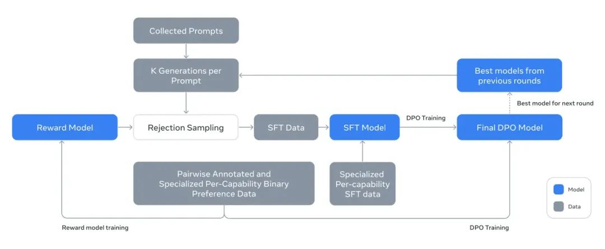


###### 直接偏好优化DPO

更没什么好说的了。人工标数据，训。

这里有个小细节需要提一下。传统的偏好数据是 喜欢 > 不喜欢。

meta还让标注员对答案做修改，变成 修改后答案 > 喜欢的答案 > 不喜欢的答案。

注1：meta那边也试过PPO，据说是计算量大单效果又不行。

注2：笔者在业务域上试过很多次各种对齐手段，dpo，ppo等。有的成本高有的成本低。但唯一共同的结论就是，真的特别特别容易训飞。

meta对dpo做了一些细节改造，比如剃除了部分同时出现在选中和拒绝文本的token。说是在偏好数据中共同的token可能导致大模型训练目标冲突。

###### 模型平均化

meta在最后阶段，将使用不同数据和超参实验得到的奖励模型、SFT和DPO得到的大模型进行了平均。

注：本质上提升训练稳定性的措施。也能说是财大气粗了。

##### 硬件篇

###### 集群长时间稳定运行

这段涉及到硬件、集群的其实我作为算法没太看懂，就抛砖引玉放一下我的总结吧。

算力集群，16K张H100用来跑，8k张H100用来冗余，ssd加起来240PB。

注1：这里这么大的ssd主要用来存checkpoint。因为训练崩溃比例很高，所以需要频繁存。很贵。

注2：1张H100 = 3张A100。超级贵。

通信方面，搭了一套对应的网络通信拓扑结构，对nvidia的NCCL库做了针对性改造。meta还列举了在一个完整54天，llama3.1 405B大模型训练周期中触发意外中断的原因，




一个有意思的结论是，78%的中断都是硬件原因。这也和之前在笔者千卡集群文章开头分享的工程团队角度看千卡集群建设问题基本一致，会遇到了一堆又一堆软件无关的问题导致需要不停地排查问题解决问题。解决思路就是特别强力的监控，自动化维护，冗余，底层改造。此外还提供了一些trick，比如减少checkpoint存储事件，减少训练启动时间。

###### 集群长时间维持高算力利用率

meta分享了在不同超参配置下，16k张H100的算力利用率MFU，基本处于40%左右，相对还是较低的。

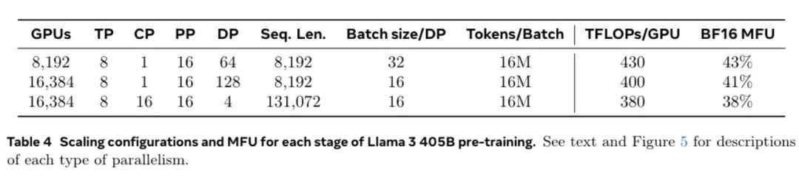


注1：这块我猜是因为meta用的flashattention2（或者完全没用）。2主要优化的是A100，MFU理论上能到75%左右，对H100没优化。前段时间刚出的第三版专门对H100做了优化，利用率能提升到75%左右。

注2：敲重点啊。TP，不能超过8。为什么，一台机器就8张卡。

注3：第二个重点，为什么seq长度拉到128k以后，才能有cp并行。因为短序列显存占用没那么夸张。

并行方面，meta采用了4D并行，就是4个维度上做并行，包括tensor维度、context维度、pipeline维度、data维度。

具体可以参考这张图：

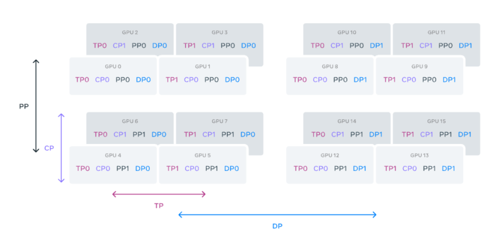
  

这里其他三个都是之前文章写过的。唯一一个特别的是context并行。报告写的是“上下文并行性将输入上下文划分为片段，减少了对于极长序列长度输入的内存瓶颈。”

由于pipeline并行默认实现比较死板，meta还做了一些针对性改造，对微批次做了不少优化。

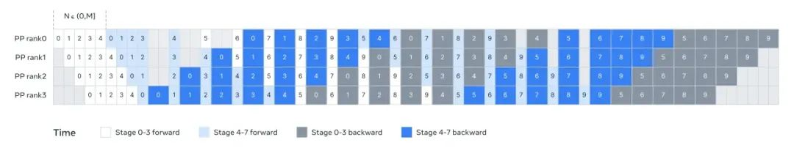


然后是cp并行实现，这里提到了一些实现细节，比如准备2倍于并行数的chunk，然后每个cp对象负责对称的两个块。

注1：这里对称的设计可能有一定的工程思考在里面，比如重叠计算和通信等。但文中没细说。

然后具体实现就是，首先all-gather所有的KV tensor，然后在每个CP对象去计算本地的Q的attention结果。然后文章还说虽然all-gather会占用很大的通信量，但有两个优势，一个是对不同的mask矩阵支持很灵活。二个是毕竟用了GQA技术，KV矩阵大小其实很小，所以影响不大。

注2：感觉和zero实现思路差不多，本质上还是工程设计，更好的设计通信内容，以平衡算力和通信成本。所以实际上不一定会加通信量，可能和原来一致。

基于网络感知的并行配置。其实就是基于不同并行级别通信成本和延时的不同，设计并行顺序。按照TP->CP->PP->DP的顺序选gpu。这个顺序其实没什么争议。

注：这里又可以出一个八股文。为什么是这个顺序。  

#### 找到能带来最高上限的超参组合

这块虽然看着和之前bert时代的调参类似。但实际上完全不一样。现在主要调的是数据集大小组成、学习率learning rate的变化曲线函数，通用域和垂域数据比例等等。

传统的方法就是自动化实验，不断地实验各种组合。但这又带来两个问题：

1.怎么做实验。毕竟算力有限。

2.怎么区分不同参数组合。即参数的可控性。

##### 可实验性

为什么现在不可实验，因为大规模数据+大参数量模型，意味着需要大算力，大量时间。太重了，不可重复。这里就要先搬出scaling laws了。只不过得用它的另一种翻译：放缩公式。

一般理解为：同样的参数配置，小规模实验能达到上限，则大规模实验也能达到上限。这也就意味着理论上可以在小规模模型上大批量实验出最优参数组合，再放到最大规模的模型上投入所有算力梭哈。

注：这个目前没看到特别solid的理论证明。但反正大家都这么用了。

那么就是第一步，也是最重要的参数：数据集大小。毕竟这个如果太大的话，也谈不上小规模实验了。这里又要搬出scaling laws了，原始翻译叫规模公式。即总训练算力、模型参数量、训练集大小，如果能满足公式，就能取得当前模型参数量下最好效果。问题是这个公式怎么搞。首先不同厂家、不同数据集分布，下游任务（打榜），这个公式是不一样的。那就经验公式，实验+拟合呗。能拟合就是好方法好公式，拟合错了就不行。

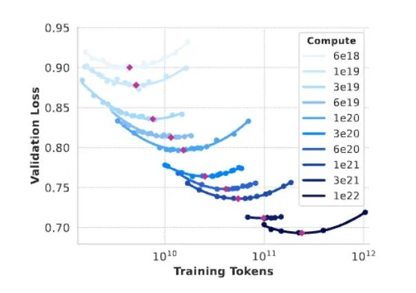


结论：

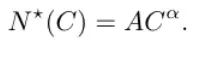


拟合的是α取0.53，系数A取0.29。其中C是预算FLOPs。N\*(C)是训练集token数量。比如他们的预算是3.8e25 FLOPs，代入公式，就是需要10.4T的数据集。然后meta实际上用了16.55T的数据集。

注1：这个误差有点大。但笔者分析不出来原因了。期待懂的小伙伴能分享下原因。

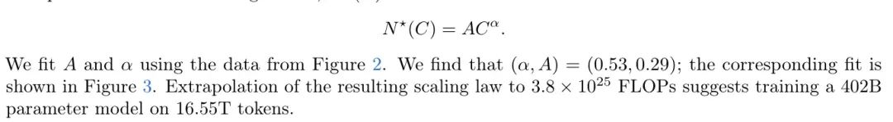


注2：这个算力预算真不算多。也就等于H100，保守估计，480k卡天。按报告里写的16k张H100，也就是30天。后面可能更容易被卡着的会是训练数据的收集。虽然没听说meta强行爬数据。但某些公司在爬虫上可谓是吃相难看，根本不管某些约定俗成的原则，比如看声明文件决定能不能爬，爬的时候不能把对方站点搞崩。

注3：代入笔者之前文章总结的训练算力需求和语料库大小的经验公式退化版本，C = 6TP。得到P是382B。和405B差距也不大。这个差距倒是正常，毕竟模型的超参还得凑整。

但就算这样，用8B模型替代405B模型重复训练，虽然已经优化很多了，但还是很慢，有没有更快的实验方法？答案当然是有的，就是退火阶段。

数据集在退火阶段的表现等价于在完整训练过程的表现。

退火阶段本质上是用高质量模型对模型在下游任务的表现进行突击加强。那么我们可以合理的做出上面这个猜测。

注：是的，这条也是经验结论，没有任何理论依据。但反正能用。

所以meta提出了更优化对数据集效果进行测试的方案：将一个训练了一半的8B模型，用40B的复合数据集进行退火训练，这个过程中学习率会线性降到0。复合数据集的组成是30%的新数据集，和70%的老数据集。重点用退火评估新数据集价值，比用规模法则实验更高效。

然后就是大量在小规模的模型上实验不同的参数组合，比如不同类型的数据怎么搭配效果最好，得到的结论是：需要 50%的一般知识，25%的数学和推理语料，17%的代码语料，8%的多语言。不过这种没什么参考价值的实现细节。

我自己总结为几个结论：

数学和代码语料很重要，能提升大模型效果，得加大力度。llama中文效果不行本质上还是meta自己选择的以英语为绝对核心。多语言只是辅助。中国人得有自己的中文大模型，不能当这里8%的几百分之一。

注：这里其实可以出一道申论题，为什么一定要基于中文语料开发中文的大模型。

得到了明确的参数组合，就可以在最大的算力预算上梭哈了。

##### 参数可控性

可调整可实验的参数主要有以下几类：

数值类，比如batch size、learning rate等等。

基本就是经验公式+插值实验确定最优解。出一个随着训练step数而变化的函数。

数据集，比如短文本pre-train数据集，长文本pre-train数据集，退火数据集，偏好数据集、领域数据集等等。

理论上目标是出一个能让模型效果最好的数据集组合。但这个问题太复杂了，自由度特别夸张。所以拆解下来，贪心一下。目标是在每个阶段，都出一个能让当前阶段效果最好的数据集。

但就算这么也不好解，一个流程的数据集，少则几百万，大则十几T，不可能每一条去测试。所以只能宽泛的控制，比如数据的“质量”水位，各种数据的占比等等。对大批量的数据进行控制，目前只有一种手段，就是，标签化。只控制标签。这块具体细节，可以参考下面数据管理那段。

数据管理

meta在数据部分做了非常多的努力。粗略总结下来，主要包括以下几个方面：

##### 数据收集

###### 无标注数据

meta只写了他们的数据来源比较多样，截止2023年。

注：这块我有理由怀疑，他们抓了非常多的无版权数据，导致说都不能说。

无监督语料主要还是网络内容。具体来说，直接取了完整未截断的html内容，并且构建了一个解析器用于去除样式，只保留内容。重点对数学公式和代码进行了优化。

meta的解析器保留了图片的alt属性，因为很多数学公式是以预渲染图片形式存在的，数字通过alt属性传递。这个我没太懂，期待有前端大佬解释一下。

meta实验了纯文本，和带markdown的文本，发现后者效果差。所以删除了所有markdown格式。

注：这个解析器和整个数据处理流程都是公司核心资产

###### 有标注数据

主要有三部分来源：

下面偏好数据收集到的被拒绝的响应。

对特定域的合成数据。

少量人工整理数据。

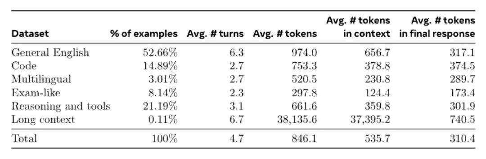


从数据比例看，外文数据还是少。总体比例和预训练差别不算太大。

另外由于这块存在大量大模型合成数据，所以随着后训练轮次迭代，会基于新的大模型重新采样生成+拒绝采样。

注：拒绝采样本质上也是减少随机性影响，提高训练稳定性。

但这里有个小问题，就是让大模型大量输出采样的算力需求还是不小的。所以meta加上了pagedattention来提高显存利用率。

注：pagedattention是不是有点眼熟。没错，VLLM。好用的。

###### 偏好数据

基于不同对齐策略、数据组合训练多个版本的模型（让响应在不同的能力域具备不同优势），然后针对每个用户prompt，随机取两个模型，采样两个响应，让用户标注两个响应接受哪个，拒绝哪个。并标记两个响应之间的分差（4档），然后还鼓励标注员进一步接受的响应（自己改或让大模型改）。这样就得到了排序后的响应组：编辑后的>选中的>拒绝的。

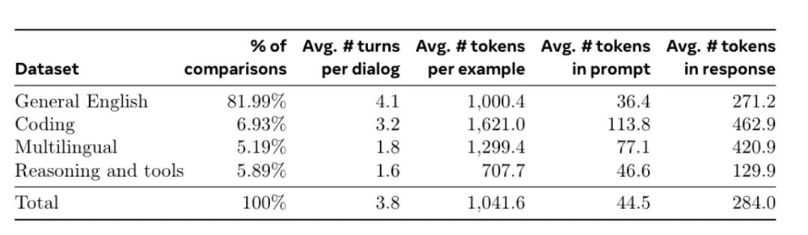


##### 数据清洗

清洗这块主要包括去重、低质数据过滤、个人信息过滤、成人内容过滤。

注：这段虽然理论上也算实现细节，但确实通用性比较高，所以也整理出来给大家做个参考。

###### 去重

分别从url、文档、行级别进行去重。

url级别：维护了一个url到内容的数据集。并只维护最新版本的内容。

注：这个感觉一转手就可以去做搜索引擎了。

文档级别：对整个数据集维护了每篇文档的MinHash值，去除近似重复内容。

MinHash详解

假设我们有两个集合 𝐴 和 𝐵，以及一组哈希函数 {ℎ1,ℎ2,…,ℎ𝑘}，MinHash 的步骤如下：

1.计算每个集合的签名: 对集合 𝐴 和 𝐵，使用每个哈希函数计算集合中每个元素的哈希值，并选择最小的哈希值，构建签名向量 Sign𝐴 和 Sign𝐵。

2.比较签名: 通过比较签名向量的相似度来近似估计集合的Jaccard相似度。Jaccard Similarity(𝐴,𝐵)=∣𝐴∩𝐵∣∣𝐴∪𝐵∣  

行级别：这个过滤比较激进。删除所有每30M份文档组成的一个桶中，出现超过6次的行。  

注：30M 本质是效率的trade off

meta人工分析过，去除的内容，一部分是残留的网站样式内容，比如导航菜单、cookie警告等。但确实也包含了部分高频出现的高质量内容。但实践证明这样激进的去重策略能带来模型效果提升。

注：总结为，增加少量通用高质量数据最多只能锦上添花。但少量的老鼠屎是真的能坏事。

###### 低质数据过滤

基于重复n-gram覆盖率计算长且内部重复度高的行，比如日志或者错误信息。这部分内容因为长+独特性强，很难走之前的行重复情况过滤掉。

有个脏词词典，进行词频过滤。

计算文档的token分布，和整个数据集的token分布，并计算这两个的KL散度，相差过大的也过滤掉。用fasttext去识别文本是否在wiki文档里。大量人力标了干净文档数据集，然后让llama2进行打分，然后训了一个DistilRoberta去对文档库所有内容打分。

注：某种意义上这也是后续agi自我迭代的一种形式了。

对sft数据，用奖励模型或者llama模型对语料进行质量评分，剃除低质量语料。这里之所以要选两种模型，是因为他们的不一致率还是很高的。综合两个模型的评分结果在测试集上效果最好。

注：在业务任务上，我们也很喜欢这种做法。多个模型打分，取交集或并集。

另外meta还为了模型效果，补充了一批高难度语料，还是上面的思路，让大模型直接标。

注：这段后续有细节讲，本质就是基于大模型评分筛语料的思路很容易导致高难度语料被剃掉，造成下游任务效果下降，所以需要特别补充。

###### 去除个人身份信息

没写。估计就是正则一堆东西。

###### 去除了成人内容

对成人内容有个预过滤，将领域相关的网站都拉黑名单了。基于脏词字典取统计脏词出现次数，过滤成人内容。

###### 代码、数学推理专属流程

由于代码和数学相关的网页一般格式会特殊一点，所以他们专门构建了对应的专属处理链路。具体来说，又是llama2标记，训一个DistilRoberta去做质量控制。不同的是，这里做了prompt调优来增强llama2对代码、数学的适配性。

注：某种意义上也能说明meta对llama2是真的自信，都没做微调。

###### 多语言语料专属流程

总体链路和上述在英语上的链路是一样的。多了几个特殊点：

基于fasttext训了一版用于分类不同的语言语料。在每种语言内部进行去重。使用了特定语言的启发式方法和基于模型的过滤器来解决语料质量问题。

注：这里感觉意思是不同语言会有不同的启发式方法，不一定全一样。

最后多语言语料聚合时，用了一个多语言llama2进行文档质量排序，优选合并高质量语料。还通过实验确定了不同语言需要的语料token数量，以平衡不同语言的性能。

###### 图文对数据专属流程

这块主要是服务多模态的。

数据方面，就是图片文本对。做了一个处理链路，包括质量筛选、去重、重采样、OCR。质量筛选，主要是去除低质量和非英文字幕。去重。本质上先向量化表示，然后用类似knn方法聚簇，每个簇保留少量图。

重采样，目标是保留图片的多样性。思路是文本和图片对应，所以保证文本的多样性就能保证图片的多样性。用n-gram来假设文本的多样性。库里存档的数量少于阈值次数的保留。OCR，将图片中的文本添加进文本中，提高可用性。还引入了文档数据用来提高以图片形式做文档解析能力。构建数据就反向将文档转图片。数据安全清洗。用了一些技术手段吧不合规的数据干掉了。不比如涉及到儿童、色情、暴力等。还对所有人脸做了模糊处理。

注：这个，理论上没啥问题，但应该会导致对人脸识别能力大幅下降。

为了退火阶段，还额外基于重采样和额外来源数据（估计就是下游评测任务数据），组了一个高质量数据集。视频数据，用了一堆平均在21秒的短视频-文本对，分辨率在320p和4k之间波动。宽高比也不固定。文本部分还用了ocr等技术。还把非英语内容删了。

后训练的数据集用了目前学术数据集（改写后），和大量人工标注。

因为图片的特殊性，为了保证多样性，还是老规矩，knn。另外还搞了不少合成数据，比如将文本问答对重部分文本替换成对应的图片。或者将结构化文本渲染成图像。还有ocr相关内容。

偏好数据。这里重点提一下合成数据。一个是在数据集将正确的文本直接替换成随机错误内容，类似nlp造数据的思路。另一个是用了拒绝采样中踢掉的数据。

###### 合成数据专属流程

虽然生成数据用起来很爽，但确实存在一些普遍的质量问题，meta这里列举了两种：过度使用标点符号和表情符号；道歉语气过多。他们用了一些基于规则或策略过滤的思路。

注：早期大模型确实明显存在这个问题，用户说它错了，它就道歉，然后一味顺从用户说法。

##### 数据分类

最终如何确定预训练数据集中，各个数据来源的数据量，是通过上述的scaling laws确定的。

第一步先用llama3-8b训了一个分类器，用于确定语料的类型，会到“艺术”、“娱乐”粒度。这个是用于对web语料太高频出现的语料进行降采样。

注：估计还是用的llama2+DistilRoberta

第二部基于scaling laws，在小模型上，多次尝试不同比例的数据组合比例训练的质量，最后确定最优解来训大模型。最终meta选择了预训练数据集混合比例，50%的一般知识，25%的数学和推理语料，17%的代码语料，8%的多语言。

注：他们内部应该还有更细力度的标签和组合比例。另外llama3.1对中文适配不好也是正常，多语言语料就这么点，还得那么多语言分分。肯定支持比较差。就不能学学谷歌，直接爬百度的文心一言直接用嘛。

后训练数据混合，其实就两点值得一说。不同的数据处理链路，导致偏好数据集合和SFT数据集构成比例不一致。这个是个现象，有点概念就行。

对高质量数据源进行上采样，对低质量数据源进行降采样。

其他有点用的支线

  

**多模态**

正常来讲，多模态应该是一个很重要的点，需要着重强调。

但llama3.1的多模态部分看着就有点拉胯，没必要细聊。主要以下两个原因：

a.还在训练中，看不到实际效果（网友评分>论文自测）。

b.技术框架非常原始，还是传统的外挂多个单模态encoder编码器加一个单模态adapter适配器。

注1：虽然理论上比gpt4o说的端到端拉胯了不少。但这种即插即用的外挂组合方式或许对开源社区是更有利的。等后续开源看效果再锐评。

注2：我有理由怀疑，是不是，meta也做了端到端的尝试，但是失败了，所以才转成现在这个不那么优美，但是能训起来的思路。

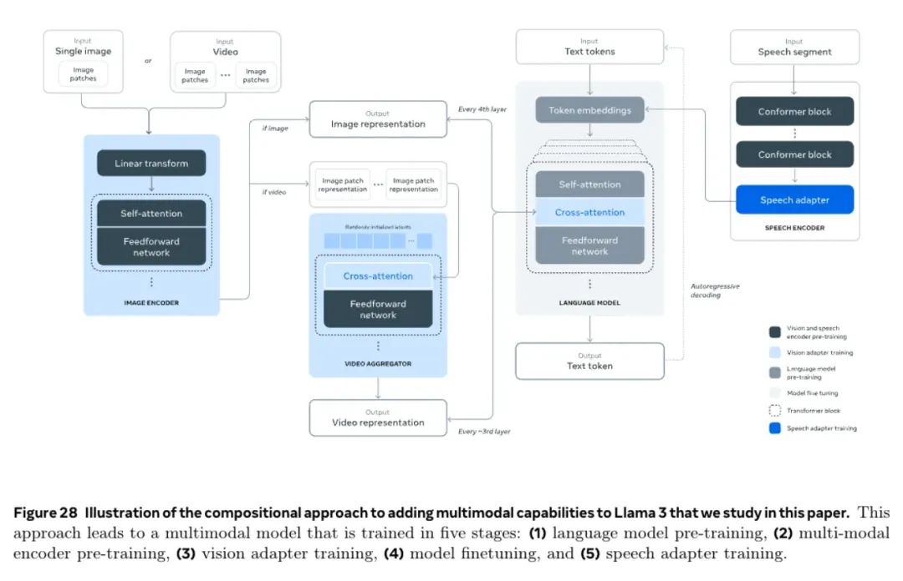


### 视觉

meta列举了外挂图片编码器的优点，比如：

1. 能并行开发大语言模型和视觉编码器；

2\. 避开了联合建模的复杂性；

3\. 保证了大语言模型不会因为引入视觉能力而性能下降；

4\. 外挂结构能保证执行高效，即不用将完整的图片过一遍完整的语言大模型。

注：优点怎么都能编。但感觉还是联合建模没做出来。

模型结构没啥好说的。图片编码器用的Vit变种。上面叠了一个图片适配器和一个视频适配器。适配器输出会直接和大模型做attention。这里需要特别提一下，视频处理会接受从短视频中均匀取的64帧的图片编码结果，再聚合，再和大模型交互。然后做了预训练和后训练。

预训练就是冻结大模型，然后训。用了6B的图文对数据（这里单位是：对）。然后先用低像素图片训（批量调），之后拓展到高像素。这块和长上下文思路比较像。视频那边差不多。

### 语音

结构上和图片基本一样。一个编码器加一个适配器。但有一点差别，适配器的输出可以直接和大模型的拼起来，不用做attention。

包含了两个模块，语音理解和语音生成。

  

**关于llama3.1的一些数学计算**

官方给的数据是：54天，16k张H100，单卡算力是大约700TFLOPs，405B，16.55T数据。

6\*16.55T\*405B/16000/700T

\= 3.6\*10^-3 B

\= 3.6\*10^6 秒

\=1000小时

42天

数据基本能对上。

  

**一些可能被问到的客观信息**

llama3.1模型族，原生支持多语言，代码，推理，工具使用。最大的模型是405B，支持128k的上下文。

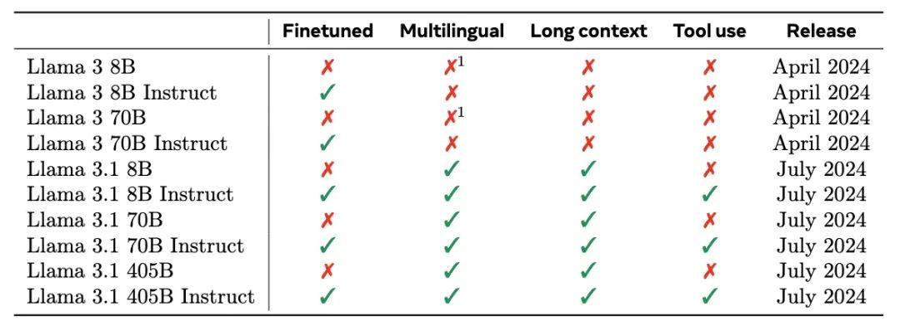


不同参数量的llama3.1，在预训练阶段都是各自独立训练的，后训练阶段以数据为媒介进行蒸馏学习。

模型结构和llama1、2基本一致。用的都是17年的transformer结构，改动很小。性能提升主要靠数据和规模。加上了GQA，这个之前文章有写，不赘述。对比llama3，有一点小变化。针对长序列学习，开发出新的mask逻辑，避免长序列内部不同文档之间的自注意力影响。

注：这个某种意义上也说明所谓的128k长序列补充训练，数据本质上也是硬造出来的，没什么原生的长序列数据。

词典

用了128Ktokens的词典。tiktoken分词器。其中100k英文token，28k的非英文。对分词器做了优化，提高了压缩率。现在每个token平均能表达的字符从3.17-> 3.94。且，那28k的非英文token提高了压缩比，和其他语言性能，但对英语性能没影响。

注：某种意义上压缩比越高，等于能用越少的算力去学习更多的内容。

旋转位置向量的频率。把θ拉到500k。23年的研究表明能让大模型识别出32k长度的上下文。

注：或许这也是qwen2选择32k长度的分界线的原因之一，不过qwen2是拉到了1M。

  

**meta总结开发高质量基座模型的三个关键：** 

**数据、规模化、复杂度管理**

数据：

在预训练和后训练阶段，提升数据的质量和数量。包括，对预训练(无监督)数据，更仔细的数据预处理，和过滤流水线。对后训练有监督数据，执行严格的质量把控和筛选llama2只用了1.5T数据，llama3.1用了15T的多语言数据进行预训练。

附：这里有个点，meta没提它的数据来源。但按照最近一些新闻，估计也是存在版权问题的。

规模化

旗舰款用了3.5e25 FLOPs【作为对比，qwen2-72b用了4.8e24 FLOPs】

405B，15.6T文本tokens（注：这个是scaling laws写的，这个规模的数据集的最优规模）。旗舰模型的效果比同样流程训练的小规模模型要强，也证明了scaling laws。将小模型继续训练更长的时间，效果还是不如旗舰款。在后训练阶段，用旗舰款模型去优化了其他的系列小模型。

复杂度管理

增强大规模模型训练的可控性和可拓展性。为了提高训练稳定性，用的简单transformer结构，而不是moe。用的SFT+拒绝采样RS+DPO。没用更复杂的强化学习对齐策略。

  

**在后训练阶段进行特定能力增强**

### 代码

先训一个代码专家。这个代码专家用来收集高质量人工标注代码数据。

这个是从base模型（怀疑是未退火未长上下文训练版本，但没写），用了1T的数据(85%比例的代码数据)进行继续训练。在继续训练的最后几千步，又进行了长上下文微调，将上下文拓展到16K tokens。然后再走一遍代码数据湖版本的后训练。

注：这个看着就有点让人头大。但谁叫效果确实好呢。

另外还有个问题，合成数据对405b模型没用。所以为了解决这个问题，引入更多的信息。这里引入的代码执行反馈。总体方案大概是，让大模型自己出题或者人来出题，然后大模型回答，然后通过各种静态动态单元测试，执行结果校验等内容，然后微调。

还有个点在于，部分语言的数据有点少，比如PHP，相比于python C++少太多，导致效果一般。那就把对应的代码翻译过去。本质上也是合成数据，只不过可以通过各种测试手段保证结果一致。

注：这部有个点在于，只能保证结果一致。但对语言风格等等信息就没法保证了。另外很多语言的语法糖基本也是直接丢了。

另外编码专家其实也包括了注释、文档书写。这个光靠执行结果校对是无法带来提升的。所以meta用llama3生成了一堆代码的注释文档数据，然后用大模型将其翻译成代码，然后让大模型判断这两个代码的相似度。

注：这个感觉不是特别合理。太fancy了。

### 多语言

老规矩，先起一个多语言专家。

数据收集阶段，meta公布的数据比例大概是：2.4%的人工标注、44.2%来自其他自然语言处理任务的数据、18.8%的拒绝采样数据以及 34.6%的翻译推理数据。拒绝采样数据这块用了一些小trick以提高效果，但本质上还是合成数据。翻译数据没写来源。

注：人工标注还是费钱啊，meta都没多少。得感谢NLP领域数据集的提出者。不然多语言这块就很难搞。

### 数学和推理

注：这段倒是没提训一个“数学推理专家”，可能是因为llama数学推理能力做不到吧。

以始为终，先看大模型推理能力存在哪些gap导致无法让我们满意：

1.prompt很缺。毕竟真靠大模型推理数学的本来就少，导致甚至想使用合成数据构建真实分布数据集都很难。

2.cot很缺。数学推理本身难度都是比较高的，所以需要比较好的思维链过程提高执行效果，但目前的思维连都有点玩具化。很难教会大模型怎么对数学推理问题进行一步一步严谨又唯一的分解方法。

3.cot中间过程无法验证。cot中间过程的错误可能会导致结果错误，但目前大模型没那个能力去做验证。

4.大模型对外部工具的使用能力很差。比如计算器、代码执行器。这点很体现在各种数学题上，明明过程确实对了，但就因为数据计算错误，导致结果错误。

5.训练和推理的一致性。这个说的有点大了，本质上就是基于用户的反馈修正过程的能力。但得用合成数据。

针对这些问题，mata提出了几种解决思路：

1.为了解决prompt不足。将数学文本(比如课本类的陈述文本)转化为问答格式。

2.为了解决cot不足问题。分两个维度，一个是让llama3为prompt产生cot过程，并逐步基于结果去做验证。二个是还会自我验证某步cot是否有助于结果达成。

3.为了判断中间过程的正确性，训了一个奖励模型，判断无效逐步推理数据。感觉这个和上面那步的自我验证差不多思路。

4.外部工具篇，让大模型生成代码，然后执行代码，基于执行结果的反馈生成结果，还能一定程度上解决上面中间过程错误问题，

5.从人类反馈中学习，和上面的也有联动，基于判断为无效的中间过程，让llama3去纠正。并把这个当做人工提示。进行自我反思。

注：从数学推理数据的过程和上面代码、多语言过程的差异，也能看出来为什么现在主流大模型的数学推理能力都不太强的原因了。还是数据太少了，有用的数据更少。当然也正常，一个懂点基本逻辑的标注员和一个懂高等数学的标注员，这个成本和产出效率根本不能比。但另一方面也说明中国在数据标注这块的潜力。毕竟教育建设是真的很不错。又是一轮人口红利。

长上下文  

这里的难点其实还是平衡长短上下文的下游任务表现。即，在长上下文训练的过程中，不能让模型忘掉短上下文的过程。

sft和合成阶段会面临一个反过来的问题，即在短上下文学习的过程中，还是得夹杂长上下文的数据，不然会造成模型在长上下文任务的表现退化。这里还是有个问题，即，超长上下文，没法人工标注。只能搞合成数据，

而合成数据又面临一个问题，长上下文专家大模型只能用来处理短文本。

但问题不大，加trick合呗。问答数据就针对一小段来提问回答，但训练时上下文给全部的。某种意义上也是在做探针训练。然后摘要任务就分层摘要，一块一块摘，然后合起来再摘一轮。微软的graphRAG和这个思路有点像了。代码推理更取巧了，和合成时用的是存在依赖关系的两个文件（import），训练时用整个代码仓库。

最后是做了消融实验，发现0.1%的长下文数据，能带来长短上下文基准测试最优。

另外还有个点。dpo阶段没引入长上下文数据，效果没影响。meta猜是因为dpo步骤少。

### 工具应用

工具其实meta只简单提供了三个，搜索引擎，python解释器，数学计算引擎。

数据方面没啥好说的。人工标，大量人工。

还做了零样本学工具的数据。

毕竟本质上工具就是函数调用。

### 真实性（减少幻觉）

这段又有个理念问题。从技术角度，解决幻觉问题有两种思路：让大模型懂更多，让大模型懂自己不懂。

meta这里其实主要对后者进行发力。自我反思+人工标注，鼓励大模型拒绝回答。

### 可控性

指令微调。大量人工标注数据。人力成本

  

**推理部署**

这块meta核心提到了两个点，流水线并行和FP8量化。

为什么要做流水线并行。本质是一个推导链路：

1.FP16 405B模型在单机8卡H100，放不下。需要大约11张卡才能放下。所以需要跨两台机器。

2.机器内能用NVLink高速通信，节点间就会很慢。

3.怎么更好的协调16张H100高效运行。就是用流水线并行这种对通信要求低的并行方式。

另外为了进一步提高效率，还开了微批次。

使用FP8本质为了提高效率。量化操作没啥好说的，也是通识性的东西。meta针对一些corner case做了优化，比如数字类、日期类的量化问题。

meta这里没有全部参数量化，只量化了矩阵计算参数中，全连接部分。且第一层和最后一层都没量化。

影响方面，测试过能提升预装填速度超过100%，在推理时能降低30%的推理延时，且提高100%的推理速度。

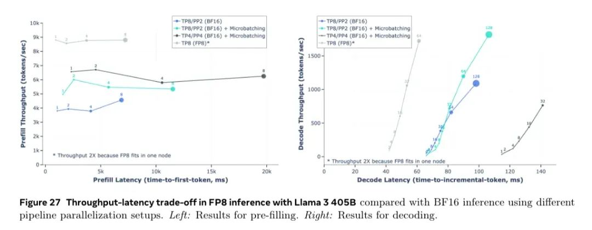


  

**结果分析**

看都不看

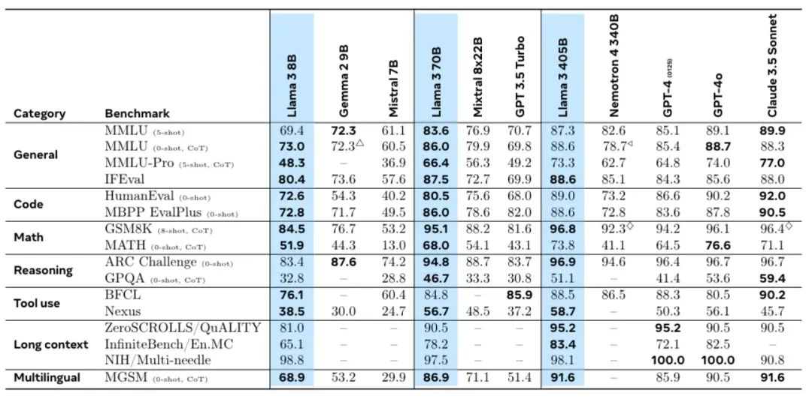


为什么不看。这左边的超参(5-shot，CoT)多到可以水10篇论文了。连不同规格之间的效果对比都不太明确。建议看各种竞技场battle结果之后，自己再部署试试。

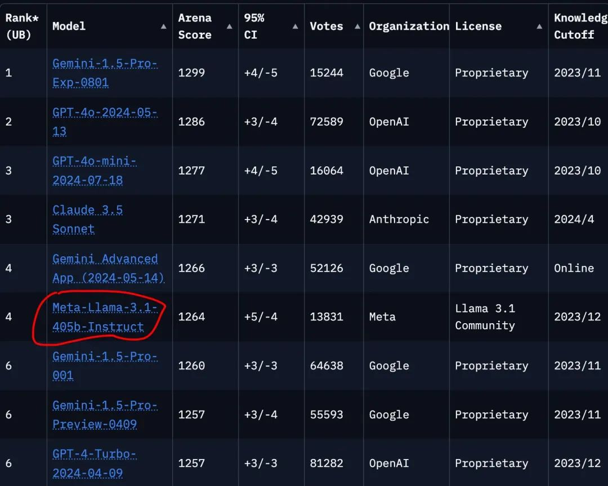


英语学习篇

| 

英文

 | 

翻译

 | 

备注

 |
| 

foundation model

 | 

基座大模型

 |   
 |
| 

a herd of language model

 | 

同一个系列的语言模型

 |   
 |
| 

on a plethora of task

 | 

在很多任务上

 |   
 |
| 

pre-trained and post-trained version

 | 

预训练和后训练版本

 | 

post-training是meta自己编的训练阶段，表示所有非预训练的过程，主要包括后训练=指令微调+对齐

 |
| 

via a compositional approach

 | 

通过一套组合拳

 |   
 |
| 

integrate image,video, and speech capabilities into Llama 3

 | 

将xxxxxx能力集成进xx模型

 |   
 |
| 

curation

 | 

过滤(数据)

 |   
 |
| 

rigorous quality assurance

 | 

严格的质量保障

 |   
 |
| 

lagship

 | 

旗舰款

 |   
 |
| 

discrete

 | 

离散的

 |   
 |
| 

integrate

 | 

融合

 |   
 |
| 

out-of-the-box

 | 

开箱即用

 |   
 |
| 

de-duplication

 | 

去重

 |   
 |
| 

personally identifiable information

 | 

PII，个人身份信息

 |   
 |
| 

annealing data

 | 

退火用数据

 |   
 |
| 

akin to

 | 

和xxx相似

 |   
 |

**参考：** 

https://ai.meta.com/blog/meta-llama-3-1/

https://www.bilibili.com/video/BV1WM4m1y7Uh/

  

预览时标签不可点

修改于2024年10月16日

关闭

更多

小程序

广告

搜索「undefined」网络结果

修改于2024年10月16日

​

暂无留言

已无更多数据

[发消息](javascript:;)

写留言

关闭

**写留言**

提交更多

[表情](javascript:;)

微信扫一扫  
关注该公众号

继续滑动看下一个

轻触阅读原文

  

阿里云开发者

向上滑动看下一个

当前内容可能存在未经审核的第三方商业营销信息，请确认是否继续访问。

[继续访问](javascript:)[取消](javascript:)

[微信公众平台广告规范指引](javacript:;)

[知道了](javascript:;)

 微信扫一扫  
使用小程序

[取消](javascript:void(0);) [允许](javascript:void(0);)

[取消](javascript:void(0);) [允许](javascript:void(0);)

× 分析

： ， 。  视频 小程序 赞 ，轻点两下取消赞 在看 ，轻点两下取消在看 分享 留言 收藏

**阿里云开发者**

92页的llama 3.1技术报告，我替你们啃下来了

,

选择留言身份