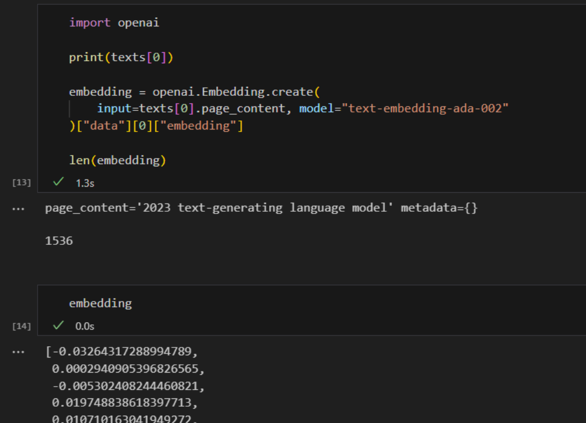

# All You Need to Know to Build Your First LLM App | by Dominik Polzer | Jun, 2023 | Towards Data Science
[All You Need to Know to Build Your First LLM App | by Dominik Polzer | Jun, 2023 | Towards Data Science](https://towardsdatascience.com/all-you-need-to-know-to-build-your-first-llm-app-eb982c78ffac) 

 A Step-by-Step Tutorial to Document Loaders, Embeddings, Vector Stores and Prompt Templates
-------------------------------------------------------------------------------------------

[


](https://dmnkplzr.medium.com/?source=post_page-----eb982c78ffac--------------------------------)[


](https://towardsdatascience.com/?source=post_page-----eb982c78ffac--------------------------------)


Build your own chatbot with context injection — Image by the author

The evolution of language has brought us humans incredibly far to this day. It enables us to efficiently share knowledge and collaborate in the form we know today. Consequently, most of our collective knowledge continues to be preserved and communicated through unorganized written texts.

Initiatives undertaken over the past two decades to digitize information and processes have often focused on accumulating more and more data in relational databases. This approach enables traditional analytical machine learning algorithms to process and understand our data.

However, despite our extensive efforts to store an increasing amount of data in a structured manner, we are still unable to capture and process the entirety of our knowledge.

> **About 80% of all data in companies is unstructured, like work descriptions, resumes, emails, text documents, power point slides, voice recordings, videos and social media**


Distribution of data in companies — Image by the author

The development and advancement leading to GPT3.5 signify a major milestone as it empowers us to effectively interpret and analyze diverse datasets, regardless of their structure or lack thereof. Nowadays, we have models that can comprehend and generate various forms of content, including text, images, and audio files.

> **So how can we leverage their capabilities for our needs and data?**

In general, we have two fundamentally different approaches to enable large language models to answer questions that the LLM cannot know: **Model fine-tuning** and **context injection**

**Fine-Tuning**
---------------

Fine-tuning refers to training an existing language model with additional data to optimise it for a specific task.

Instead of training a language model from scratch, a pre-trained model such as BERT or LLama is used and then adapted to the needs of a specific task by adding use case specific training data.

A team from Stanford University used the LLM Llama and fine-tuned it by using 50,000 examples of how a user/model interaction could look like. The result is a Chat Bot that interacts with a user and answers queries. This fine-tuning step changed the way the model is interacting with the end user.

**→ Misconceptions around fine-tuning**

Fine-tuning of PLLMs (Pre-trained Language Models) is a way to adjust the model for a specific task, but it doesn’t really allow you to inject your own domain knowledge into the model. This is because the model has already been trained on a massive amount of general language data, and your specific domain data is usually not enough to override what the model has already learned.

So, when you fine-tune the model, it might occasionally provide correct answers, but it will often fail because it heavily relies on the information it learned during pre-training, which might not be accurate or relevant to your specific task. In other words, fine-tuning helps the model adapt to HOW it communicates, but not necessarily WHAT it communicates. (Porsche AG, 2023)

This is where context injection comes into play.

**In-context learning / Context Injection**
-------------------------------------------

When using context injection, we are not modifying the LLM, we focus on the prompt itself and inject relevant context into the prompt.

So we need to think about how to provide the prompt with the right information. In the figure below, you can see schematically how the whole thing works. We need a process that is able to identify the most relevant data. To do this, we need to enable our computer to compare text snippets with each other.


Similarity search in our unstructured data — Image by the author

This can be done with embeddings. With embeddings, we translate text into vectors, allowing us to represent text in a multidimensional embedding space. Points that are closer to each other in space are often used in the same context. To prevent this similarity search from taking forever, we store our vectors in a vector database and index them.

> Microsoft is showing us how this could work with Bing Chat. Bing combines the ability of LLMs to understand language and context with the efficiency of traditional web search.

The objective of the article is to demonstrate the process of creating a straightforward solution that allows us to analyse our own texts and documents, and then incorporate the insights gained from them into the answers our solution returns to the user. I will describe all steps and components you need to implement an end-to-end solution.

So how can we use the capabilities of LLMs to meet our needs? Let’s go through it step by step.

Step by Step tutorial — Your first LLM App
------------------------------------------

In the following, we want to utilize LLMs to respond to inquiries about our personal data. To accomplish this, I begin by transferring the content of our personal data into a vector database. This step is crucial as it enables us to efficiently search for relevant sections within the text. We will use this information from our data and the LLMs capabilities to interpret text to answer the user’s question.

We can also guide the chatbot to exclusively answer questions based on the data we provide. This way, we can ensure that the chatbot remains focused on the data at hand and provides accurate and relevant responses.

To implement our use case, we will rely heavily on LangChain.

**“LangChain is a framework for developing applications powered by language models.” (Langchain, 2023)**

Thus, LangChain is a Python framework that was designed to support the creation of various LLM applications such as chatbots, summary tools, and basically any tool you want to create to leverage the power of LLMs. The library combines various components we will need. We can connect these components in so-called chains.

The most important modules of Langchain are (Langchain, 2023):

1.  **Models:** Interfaces to various model types
2.  **Prompts:** Prompt management, prompt optimization, and prompt serialization
3.  **Indexes:** Document loaders, text splitters, vector stores — Enable faster and more efficient access to the data
4.  **Chains:** Chains go beyond a single LLM call, they allow us to set up sequences of calls

In the image below, you can see where these components come into play. We load and process our own unstructured data using the document loaders and text splitters from the indexes module. The prompts module allows us to inject the found content into our prompt template, and finally, we are sending the prompt to our model using the model's module.


Components you need for your LLM app — Image by the author

**5\. Agents:** Agents are entities that use LLMs to make choices regarding which actions to take. After taking an action, they observe the outcome of that action and repeat the process until their task is completed.


Agents decide autonomously how to perform a particular task — Image by the author

We use Langchain in the first step to load documents, analyse them and make them efficiently searchable. After we have indexed the text, it should become much more efficient to recognize text snippets that are relevant for answering the user’s questions.

What we need for our simple application is of course an LLM. We will use GPT3.5 via the OpenAI API. Then we need a vector store that allows us to feed the LLM with our own data. And if we want to perform different actions for different queries, we need an agent that decides what should happen for each query.

Let’s start from the beginning. We first need to import our own documents.

The following section describes what modules are included in LangChain’s Loader Module to load different types of documents from different sources.

LangChain is able to load a number of documents from a wide variety of sources. You can find a list of possible document loaders in the LangChain [documentation](https://python.langchain.com/en/latest/modules/indexes/document_loaders.html). Among them are loaders for HTML pages, S3 buckets, PDFs, Notion, Google Drive and many more.

For our simple example, we use data that was probably not included in the training data of GPT3.5. I use the Wikipedia article about GPT4 because I assume that GPT3.5 has limited knowledge about GPT4.

For this minimal example, I’m not using any of the LangChain loaders, I’m just scraping the text directly from Wikipedia \[License: CC BY-SA 3.0\]  using **_BeautifulSoup._**

> **Please note that scraping websites should only be done in accordance with the website’s terms of use and the copyright/license status of the text and data you wish to use.**

```
import requests  
from bs4 import BeautifulSoup

url = "https://en.wikipedia.org/wiki/GPT-4"  
response = requests.get(url)

soup = BeautifulSoup(response.content, 'html.parser')

  
content_div = soup.find('div', {'class': 'mw-parser-output'})

  
unwanted_tags = \['sup', 'span', 'table', 'ul', 'ol'\]  
for tag in unwanted_tags:  
    for match in content_div.findAll(tag):  
        match.extract()

print(content\_div.get\_text())


```


Next, we must divide the text into smaller sections called text chunks. Each text chunk represents a data point in the embedding space, allowing the computer to determine the similarity between these chunks.

The following text snippet is utilizing the text splitter module from langchain. In this particular case, we specify a chunk size of 100 and a chunk overlap of 20. It’s common to use larger text chunks, but you can experiment a bit to find the optimal size for your use case. You just need to remember that every LLM has a token limit (4000 tokes for GPT 3.5). Since we are inserting the text blocks into our prompt, we need to make sure that the entire prompt is no larger than 4000 tokens.

```
from langchain.text_splitter import RecursiveCharacterTextSplitter

article\_text = content\_div.get_text()

text_splitter = RecursiveCharacterTextSplitter(  
      
    chunk_size = 100,  
    chunk_overlap  = 20,  
    length_function = len,  
)

texts = text\_splitter.create\_documents(\[article_text\])  
print(texts\[0\])  
print(texts\[1\])


```


This splits our entire text as follows:


Langchain text spliter — Image by the author

Now we need to make the textual components understandable and comparable to our algorithms. We must find a way to convert human language into digital form, represented by bits and bytes.

The image provides a simple example that may seem obvious to most humans. However, we need to find a way to make the computer understand that the name “Charles” is associated with men rather than women, and if Charles is a man, he is the king and not the queen.


Making language understandable for our computer — Image by the author

Over the last few years, new methods and models have emerged that do just that. What we want is a way to be able to translate the meaning of words into an n-dimensional space, so we are able to compare text chunks with each other and even calculate a measure for the similarity of them.

Embedding models attempt to learn exactly that by analyzing the context in which words are typically used. Since tea, coffee, and breakfast are often used in the same context, they are closer to each other in the n-dimensional space than, for example, tea and pea. Tea and pea sound similar but are rarely used together. (AssemblyAI, 2022)


Embeddings analyze the context in which words are used, not the word itself — Image by the author

The embedding models provide us with a vector for each word in the embedding space. Finally, by representing them using vectors, we are able to perform mathematical calculations, such as calculating similarities between words as the distance between data points.


Random english words in a two dimensional embeddings space — Image by the author

To convert text into embeddings, there are several ways, e.g. Word2Vec, GloVe, fastText or ELMo.

**Embedding Models**

To capture similarities between words in embeddings, Word2Vec uses a simple neural network. We train this model with large amounts of text data and want to create a model that is able to assign a point in the n-dimensional embedding space to each word and thus describe its meaning in the form of a vector.

For the training, we assign a neuron in the input layer to each unique word in our data set. In the image below, you can see a simple example. In this case, the hidden layer contains only two neurons. Two, because we want to map the words in a two dimensional embedding space. (The existing models are in reality much larger and thus represent the words in higher dimensional spaces — OpenAI’s Ada Embedding Model for example, is using 1536 dimensions) After the training process the individual weights describe the position in the embedding space.

In this example, our dataset consists of a single sentence: “Google is a tech company.” Each word in the sentence serves as an input for the neural network (NN). Consequently, our network has five input neurons, one for each word.

During the training process, we focus on predicting the next word for each input word. When we begin at the start of the sentence, the input neuron corresponding to the word “Google” receives a value of 1, while the remaining neurons receive a value of 0. We aim to train the network to predict the word “is” in this particular scenario.


Word2Vec: Learning word embeddings — Image by the author

In reality, there are multiple approaches to learn embedding models, each with its own unique way of predicting outputs during the training process. Two commonly used methods are CBOW (Continuous Bag of Words) and Skip-gram.

In CBOW, we take the surrounding words as input and aim to predict the middle word. Conversely, in Skip-gram, we take the middle word as input and attempt to predict the words occurring on its left and right sides. However, I won’t delve into the intricacies of these methods. Let’s just say that these approaches provide us with embeddings, which are representations that capture the relationships between words by analysing the context of huge amounts of text data.


CBOW vs. Skip-gram — Image by the author

If you want to know more about embeddings_, there is a wealth of information available on the internet. However, if you prefer a visual and step-by-step guide, you might find it helpful to watch Josh_ [_Starmer’s StatQuest on Word Embedding and Word2Vec_](https://www.youtube.com/watch?v=viZrOnJclY0&t=204s)_._

**Back to embedding models**

What I just tried to explain using a simple example in a 2-dimensional embedding space also applies to larger models. For instance, the standard Word2Vec vectors have 300 dimensions, while OpenAI’s Ada model has 1536 dimensions. These pretrained vectors allow us to capture the relationships between words and their meanings with such precision that we can perform calculations with them. For example, using these vectors, we can find that France + Berlin — Germany = Paris, and also faster + warm — fast = warmer. (Tazzyman, n.d.)


Calculate with embeddings — Image by the author

In the following we want to use the OpenAI API not only to use OpenAI’s LLMs, but also to leverage their Embedding Models.

_Note: The difference between Embedding Models and LLMs is that Embedding Models focus on creating vector representations of words or phrases to capture their meanings and relationships, while LLMs are versatile models trained to generate coherent and contextually relevant text based on provided prompts or queries._

**OpenAI Embedding Models**

Similar to the various LLMs from OpenAI, you can also choose between a variety of embedding models, such as Ada, Davinci, Curie, and Babbage. Among them, Ada-002 is currently the fastest and most cost-effective model, while Davinci generally provides the highest accuracy and performance. However, you need to try them out yourself and find the optimal model for your use case. If you’re interested in a detailed understanding of OpenAI Embeddings, you can refer to the [OpenAI documentation](https://platform.openai.com/docs/guides/embeddings/what-are-embeddings).

Our goal with the Embedding Models is to convert our text chunks into vectors. In the case of the second generation of Ada, these vectors have 1536 output dimensions, which means they represent a specific position or orientation within a 1536-dimensional space.

OpenAI describes these embedding vector in their documentation as follows:

“Embeddings that are numerically similar are also semantically similar. For example, the embedding vector of “canine companions say” will be more similar to the embedding vector of “woof” than that of “meow.” (OpenAI, 2022)

Let’s give it a try. We use OpenAI’s API to translate our text snippets into embeddings as follows:

```
import openai

print(texts\[0\])

embedding = openai.Embedding.create(  
    input=texts\[0\].page_content, model="text-embedding-ada-002"  
)\["data"\]\[0\]\["embedding"\]

len(embedding)


```



We convert our text, such as the first text chunk containing “2023 text-generating language model,” into a vector with 1536 dimensions. By doing this for each text chunk, we can observe in a 1536-dimensional space which text chunks are closer and more similar to each other.

Let’s give it a try. We aim to compare the users’ questions with the text chunks by generating embeddings for the question and then comparing it with other data points in the space.


Which text segment is semantically closer to the user’s question? — Image by the author

When we represent the text chunks and the user’s question as vectors, we gain the ability to explore various mathematical possibilities. In order to determine the similarity between two data points, we need to calculate their proximity in the multidimensional space, which is achieved using distance metrics. There are several methods available to compute the distance between points. [Maarten Grootendorst has summarized nine of them in one of his Medium posts.](https://towardsdatascience.com/9-distance-measures-in-data-science-918109d069fa)

A commonly used distance metric is cosine similarity. So let’s try to calculate the cosine similarity between our question and the text chunks:

```
import numpy as np  
from numpy.linalg import norm

  
users_question = "What is GPT-4?"  
question\_embedding = get\_embedding(text=users_question, model="text-embedding-ada-002")

  
cos_sim = \[\]

for index, row in df.iterrows():  
   A = row.ada_embedding  
   B = question_embedding

     
   cosine = np.dot(A,B)/(norm(A)*norm(B))

   cos_sim.append(cosine)

df\["cos_sim"\] = cos_sim  
df.sort_values(by=\["cos_sim"\], ascending=False)


```


Now we have the option to choose the number of text chunks we want to provide to our LLM in order to answer the question.

The next step is to determine which LLM we would like to use.

Langchain provides a variety of models and integrations, including OpenAI’s GPT and Huggingface, among others. If we decide to use OpenAI’s GPT as our Large Language Model, the first step is to define our API Key. Currently, OpenAI offers some free usage capacity, but once we exceed a certain number of tokens per month, we will need to switch to a paid account.

If we use GPT to answer short questions similar to how we would use Google, the costs remain relatively low. However, if we use GPT to answer questions that require providing extensive context, such as personal data, the query can quickly accumulate thousands of tokens. That increases the cost significantly. But don’t worry, you can set a cost limit.

**What is a token?**

In simpler terms, a token is basically a word or a group of words. However, in English, words can have different forms, such as verb tenses, plurals, or compound words. To handle this, we can use sub-word tokenization, which breaks down a word into smaller parts like its root, prefix, suffix, and other linguistic elements. For example, the word “tiresome” can be split into “tire” and “some,” while “tired” can be divided into “tire” and “d.” By doing this, we can recognize that “tiresome” and “tired” share the same root and have a similar derivation. (Wang, 2023)

OpenAI offers a tokenizer on its website to get a feel for what a token is. According to OpenAI one token generally corresponds to ~4 characters of text for common English text. This translates to roughly ¾ of a word (so 100 tokens ~= 75 words). You can find a [Tokenizer App on OpenAI’s website](https://platform.openai.com/tokenizer) that gives you an idea of what actually counts as a token.

> **Set a usage limit**
> 
> If you are concerned about the cost, you can find an option in your OpenAI user portal to limit the monthly costs.

You can find the API key in your user account at OpenAI. The simplest way is to search in Google for “OpenAI API key”. This brings you directly to the settings page, to create a new key.

To use in Python, you have to save the key as a new environment variable with the name “OPENAI\_API\_KEY”:

```
import os  
os.environment\["OPENAI\_API\_KEY"\] = "testapikey213412"
```

When defining your models, you can set some preferences. The [OpenAI Playground](https://platform.openai.com/playground) gives you the possibility to play around a bit with the different parameters before you decide what settings you want to use:

On the right side in the Playground WebUI, you will find several parameters provided by OpenAI that allow us to influence the output of the LLM. Two parameters worth exploring are the model selection and the temperature.

You have the option to choose from a variety of different models. The Text-davinci-003 model is currently the largest and most powerful. On the other hand, models like Text-ada-001 are smaller, faster, and more cost-effective.

Below, you can see a summary of [OpenAI’s pricing](https://openai.com/pricing) list. Ada is cheaper compared to the most powerful model, Davinci. So if Ada’s performance meets our needs, we can not only save money, but also achieve shorter response times.

You could begin by using Davinci and then evaluate whether we can achieve good enough results with Ada as well.

So let’s try it out in Jupyter Notebook. We are using langchain to connect to GPT.

```
from langchain.llms import OpenAI

llm = OpenAI(temperature=0.7)


```

If you want to see a list with all attributes, use \_\_dict\_\_:

```
llm.\_\_dict\_\_
```


If we don’t specify a particular model, the langchain connector defaults to using “text-davinci-003”.

Now, we can directly invoke the model in Python. Simply call the llm function and provide your prompt as input.


You can now ask GPT anything about common human knowledge.


GPT can only provide limited information on topics that are not included in its training data. This includes specific details that are not publicly available or events that occurred after the training data was last updated.


**So, how can we make sure that the models are able to respond to questions about current events?**

As mentioned before, there’s a way to do this. We need to give the model the necessary information within the prompt.

To answer the question about the current Prime Minister of the UK, I feed the prompt with information from the Wikipedia article “Prime Ministers of the UK”. To summarize the process, we are:

*   Loading the article
*   Split the text into text chunks
*   Calculate the embeddings for the text chunks
*   Calculate the similarity between all text chunks and the user’s question

```
import requests  
from bs4 import BeautifulSoup  
from langchain.text_splitter import RecursiveCharacterTextSplitter  
import numpy as np  
from numpy.linalg import norm

  
  
  
  
url = 'https://en.wikipedia.org/wiki/Prime\_Minister\_of\_the\_United_Kingdom'

  
response = requests.get(url)

  
soup = BeautifulSoup(response.content, 'html.parser')

  
text = soup.get_text()

  
  
  
text_splitter = RecursiveCharacterTextSplitter(  
      
    chunk_size = 100,  
    chunk_overlap  = 20,  
    length_function = len,  
)

texts = text\_splitter.create\_documents(\[text\])

for text in texts:  
    text\_chunks.append(text.page\_content)

  
  
  
df = pd.DataFrame({'text_chunks': text_chunks})

  
text_chunks=\[\]

for text in texts:  
    text\_chunks.append(text.page\_content)

  
def get_embedding(text, model="text-embedding-ada-002"):  
   text = text.replace("\\n", " ")  
   return openai.Embedding.create(input = \[text\], model=model)\['data'\]\[0\]\['embedding'\]

df\['ada_embedding'\] = df.text_chunks.apply(lambda x: get_embedding(x, model='text-embedding-ada-002'))

  
  
  
  
users_question = "Who is the current Prime Minister of the UK?"  
question\_embedding = get\_embedding(text=users_question, model="text-embedding-ada-002")


```

Now we try to find the text chunks with the highest similarity to the user’s question:

```
from langchain import PromptTemplate  
from langchain.llms import OpenAI

  
users_question = "Who is the current Prime Minister of the UK?"  
question\_embedding = get\_embedding(text=users_question, model="text-embedding-ada-002")

  
cos_sim = \[\]

for index, row in df.iterrows():  
   A = row.ada_embedding  
   B = question_embedding

     
   cosine = np.dot(A,B)/(norm(A)*norm(B))

   cos_sim.append(cosine)

df\["cos_sim"\] = cos_sim  
df.sort_values(by=\["cos_sim"\], ascending=False)


```


The text chunks look quite messy, but let’s give it a shot and see if GPT is clever enough to handle it.

Now that we’ve identified the text segments that potentially hold the relevant information, we can test whether our model is capable of answering the question. To achieve this, we must construct our prompt in a way that clearly conveys our desired task to the model.

Now we have the text snippets that contain the information we are looking for, we need to build a prompt. Within the prompt we also specify the desired mode for the model to answer questions. When we define the mode we are specifying the desired behavior style in which we want the LLM to generate answers.

The LLM can be utilized for various tasks, and here are a few examples of the wide range of possibilities:

*   **Summarization:** “Summarize the following text into 3 paragraphs for executives: \[TEXT\]
*   **Knowledge extraction:** “Based on this article: \[TEXT\], what should people consider before purchasing a home?”
*   **Writing content (e.g. mails, messages, code):** Write an email to Jane asking for an update on the document for our project. Use an informal, friendly tone.”
*   **Grammar and style improvements:** “Correct this to standard English and change the tone to a friendlier one: \[TEXT\]
*   **Classification:** “Classify each message as a type of support ticket: \[TEXT\]”

For our example, we want to implement a solution that extracts data from Wikipedia and interacts with the user like a chatbot. We want it to answer questions like a motivated, helpful help desk expert.

To guide the LLM in the right direction, I am adding the following instruction to the prompt:

**“You are a chatbot that loves to help people! Answer the following question using only the context provided. If you’re unsure and the answer isn’t explicitly in the context, say “Sorry, I don’t know how to help you.”**

By doing this, I set a limitation that only allows GPT to utilize the information stored in our database. This restriction enables us to provide the sources our chatbot relied upon to generate the response, which is crucial for traceability and establishing trust. Additionally, it helps us address the issue of generating unreliable information and allows us to provide answers that can be utilized in a corporate setting for decision-making purposes.

As the context, I am simply using the top 50 text chunks with the highest similarity to the question. A larger size of the text chunks would probably have been better since we can usually answer most questions with one or two text passages. But I’ll leave it to you to figure out the best size for your use case.

```
from langchain import PromptTemplate  
from langchain.llms import OpenAI

  
llm = OpenAI(temperature=1)

  
users_question = "Who is the current Prime Minster of the UK?"

question\_embedding = get\_embedding(text=users_question, model="text-embedding-ada-002")

  
cos_sim = \[\]

for index, row in df.iterrows():  
   A = row.ada_embedding  
   B = question_embedding

     
   cosine = np.dot(A,B)/(norm(A)*norm(B))

   cos_sim.append(cosine)

df\["cos_sim"\] = cos_sim  
df.sort_values(by=\["cos_sim"\], ascending=False)

  
context = ""

for index, row in df\[0:50\].iterrows():  
    context = context + " " \+ row.text_chunks

  
template = """  
You are a chat bot who loves to help people! Given the following context sections, answer the  
question using only the given context. If you are unsure and the answer is not  
explicitly writting in the documentation, say "Sorry, I don't know how to help with that."

Context sections:  
{context}

Question:  
{users_question}

Answer:  
"""

prompt = PromptTemplate(template=template, input_variables=\["context", "users_question"\])

  
prompt_text = prompt.format(context = context, question=users_question)  
llm(prompt_text)


```

By using that specific template, I am incorporating both the context and the user’s question into our prompt. The resulting response is as follows:


Surprisingly, even this simple implementation seems to have produced some satisfactory results. Let’s proceed by asking the system a few more questions regarding British prime ministers. I will keep everything unchanged and solely replace the user’s question:

```
users_question = "Who was the first Prime Minister of the UK?"
```


It appears to be functioning to some extent. However, our objective now is to transform this slow process into a robust and efficient one. To achieve this, we introduce an indexing step where we store our embeddings and indexes in a vector store. This will enhance the overall performance and decrease the response time.

A vector store is a type of data store that is optimized for storing and retrieving large quantities of data that can be represented as vectors. These types of databases allow for efficient querying and retrieval of subsets of the data based on various criteria, such as similarity measures or other mathematical operations.

Converting our text data into vectors is the first step, but it is not enough for our needs. If we were to store the vectors in a data frame and search step-by-step the similarities between words every time we get a query, the whole process would be incredibly slow.

In order to efficiently search our embeddings, we need to index them. Indexing is the second important component of a vector database. The index provides a way to map queries to the most relevant documents or items in the vector store without having to compute similarities between every query and every document.

In recent years, a number of vector stores have been released. Especially in the field of LLMs, the attention around vector stores has exploded:


Release Vector Stores in the past years — Image by the author

Now let’s just pick one and try it out for our use case. Similar to what we did in the previous sections, we are again calculating the embeddings and storing them in a vector store. To do this, we are using suitable modules from LangChain and chroma as a vector store.

1.  **Collect data that we want to use to answer the users’ questions:**


Image by the author

```
import requests  
from bs4 import BeautifulSoup  
from langchain.embeddings.openai import OpenAIEmbeddings  
from langchain.text_splitter import CharacterTextSplitter  
from langchain.vectorstores import Chroma  
from langchain.document_loaders import TextLoader

  
url = 'https://en.wikipedia.org/wiki/Prime\_Minister\_of\_the\_United_Kingdom'

  
response = requests.get(url)

  
soup = BeautifulSoup(response.content, 'html.parser')

  
text = soup.get_text()  
text = text.replace('\\n', '')

  
with open('output.txt', 'w', encoding='utf-8') as file:  
      
    file.write(text)


```

**2\. Load the data and define how you want to split the data into text chunks**


Image by the author

```
from langchain.text_splitter import RecursiveCharacterTextSplitter

  
with open('./output.txt', encoding='utf-8') as f:  
    text = f.read()

  
text_splitter = RecursiveCharacterTextSplitter(      
    chunk_size = 500,  
    chunk_overlap  = 100,  
    length_function = len,  
)

texts = text\_splitter.create\_documents(\[text\])


```

**3\. Define the Embeddings Model you want to use to calculate the embeddings for your text chunks and store them in a vector store (here: Chroma)**


Image by the author

```
from langchain.embeddings.openai import OpenAIEmbeddings  
from langchain.vectorstores import Chroma

  
embeddings = OpenAIEmbeddings()

  
db = Chroma.from_documents(texts, embeddings)


```

**4\. Calculate the embeddings for the user’s question, find similar text chunks in our vector store and use them to build our prompt**


Image by the author

```
from langchain.llms import OpenAI  
from langchain import PromptTemplate

users_question = "Who is the current Prime Minister of the UK?"

  
results = db.similarity_search(  
    query=user_question,  
    n_results=5  
)

  
template = """  
You are a chat bot who loves to help people! Given the following context sections, answer the  
question using only the given context. If you are unsure and the answer is not  
explicitly writting in the documentation, say "Sorry, I don't know how to help with that."

Context sections:  
{context}

Question:  
{users_question}

Answer:  
"""

prompt = PromptTemplate(template=template, input_variables=\["context", "users_question"\])

  
prompt_text = prompt.format(context = results, users\_question = users\_question)

  
llm(prompt_text)


```


To enable our LLM to analyze and answer questions about our data, we usually don’t fine-tune the model. Instead, during the fine-tuning process, the objective is to improve the model’s ability to effectively respond to a specific task, rather than teaching it new information.

In the case of Alpaca 7B, the LLM (LLaMA) was fine-tuned to behave and interact like a chatbot. The focus was on refining the model’s responses, rather than teaching it completely new information.

So to be able to answer questions about our own data, we use the Context Injection approach. Creating an LLM app with Context Injection is a relatively simple process. The main challenge lies in organizing and formatting the data to be stored in a vector database. This step is crucial for efficiently retrieving contextually similar information and ensuring reliable results.

The goal of the article was to demonstrate a minimalist approach to using embedding models, vector stores, and LLMs to process user queries. It shows how these technologies can work together to provide relevant and accurate answers, even to constantly changing facts.

> _Enjoyed the story?_

*   [_Subscribe for free_](https://dmnkplzr.medium.com/subscribe) _to get notified when I publish a new story._
*   _Want to read more than 3 free stories a month? — Become a Medium member for 5$/month. You can support me by using my_ [_referral link_](https://dmnkplzr.medium.com/membership) _when you sign up. I’ll receive a commission at no extra cost to you._

> _Feel free to reach out to me on_ [_LinkedIn_](https://www.linkedin.com/in/polzerdo/) _!_