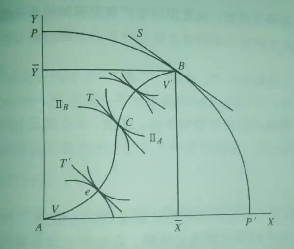
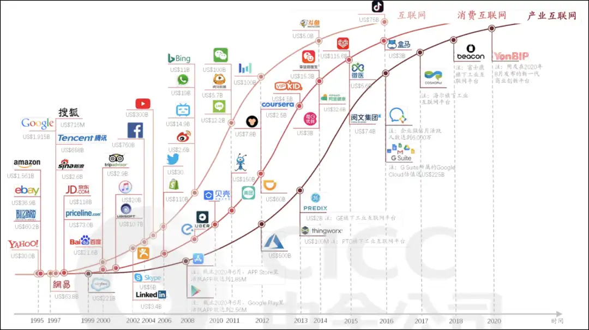
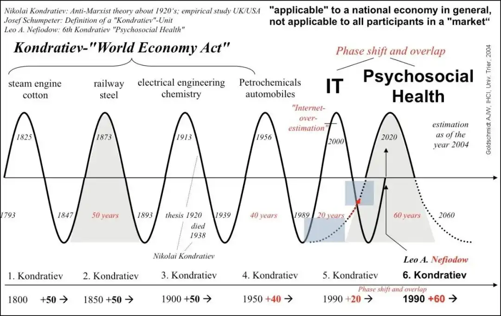
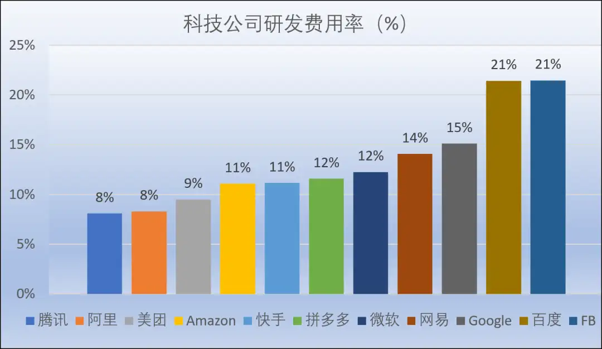
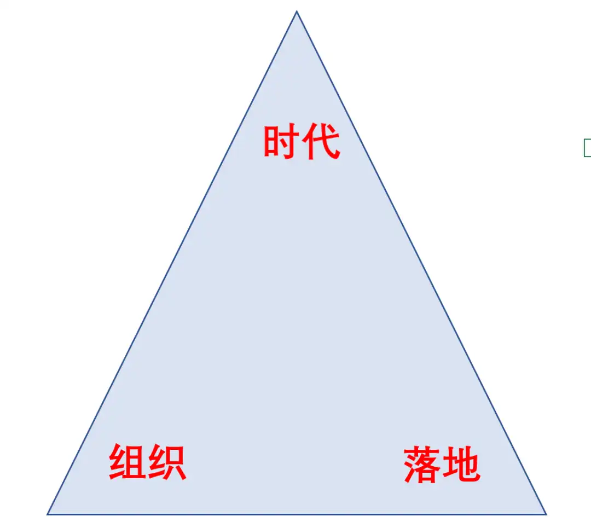
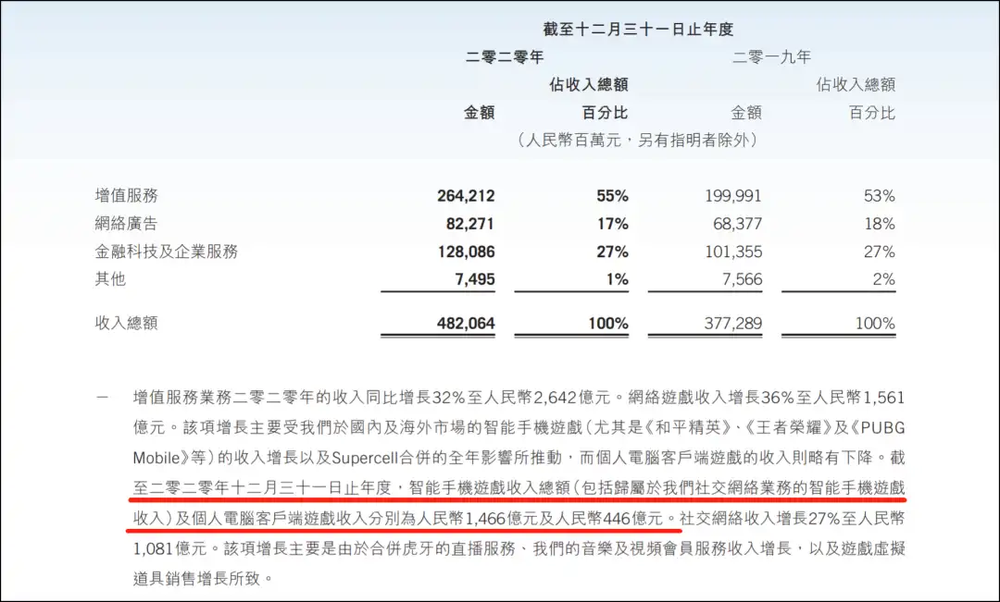
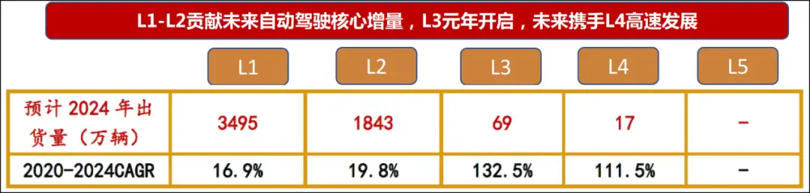

# BAT的“組織新週期”
[BAT的“組織新週期”](https://news.futunn.com/hk/post/9348487?level=2&data_ticket=1704425391812542&seo_redirect=1) 

 來源：錦緞

牛牛敲黑板：  

本質上，組織依附於公司存在，公司依附於特定商業邏輯存在，商業邏輯依附於特定社會經濟的時代特徵存在。

2021年，註定這是一個互聯網科技公司組織文化開始失靈、坍塌以及重啟的原點。「到哪裏去」，是這個時期最核心的一個關鍵詞。

組織行為學是個比較西式的理論框架，過去百年間不斷西學東漸，直到最近二十年第三次產業革命的最強餘波——移動互聯網技術的無遠弗屆，催發出了「FANMG」與「HBAT」 如是彼此輝映的新的全球兩極科技高地，使得「stay foolish，stay hungry」、「Do the right thing」、「狼性」、「996」……這些標誌性的組織文化符號不斷衝擊人們的心智，併為當代商業史烙印下一個特定的時代印記。

但「馮唐易老，李廣難封」的是，所有我們的時代，最終都要被他們的時代所終結。本質上，組織行為學的不斷演化，反映的是市場經濟不斷延展更迭的結果。從時間線上，我們能夠清晰洞悉，不存在一成不變的組織與組織文化，與抗性鈍化原理如出一轍，我們越是推崇的商業倫理，它的保質期越短：

●20世紀初到30年代，以泰羅、法約爾、韋伯為代表的古典管理學派當道。這一時期是大工業快速發展的階段，人們關注的是生產的效率。組織行為學的實踐落腳點是鋼鐵公司。這一階段的管理理論重視對物的研究，而忽視人的因素。

●20世紀20年代到60年代，以梅約、麥格雷戈為代表的人際關係理論風靡。其中最著名的事件是霍桑實驗，研究客體是美國芝加哥西部電器公司。這一階段管理理論的大成在於，首次將生產關係要素引入組織管理。

●20世紀60年代到70年代，以錢德勒、勞倫斯為代表的管理科學學派成為主導。依託於計算機技術的興起，系統論、信息論、控制論等系統科學理論被引入組織管理領域，組織行為進入科學、技術與方法的結構量化時態。

●20世紀70年代到1990年代，以巴納德、法約爾、西蒙等為代表的現代管理學派崛起。這一階段主要特徵是圍繞跨國公司展開，把組織看作一個開放的社會模式，創立了系統工程這一新的管理理論。最有代表性的實踐是前通用電器CEO傑克·韋爾奇提出的「數一數二」與「無邊際公司」理論。

●2000年代至今，即「FANMG」與「HBAT」的時代，移動互聯網的「無邊際數字化」增維與「零成本效應」特質，對跨國公司的「實體無邊際」形成降維打擊，在「矩陣模擬」效應裏表彰狼性成為這一時代的顯著特質。

**可見，所謂組織與組織文化，都是當時當下生產力與生產關係深度博弈的結果。一旦二者失調，便會出現劇烈的新舊汰換，即所謂的「沒有公司的時代，只有時代的公司」。** 

2021年，從組織行為學維度觀察，種種跡象顯示，一場新的變革已經肇始。

最近20年，全球範圍內規模性的公司組織演變與汰換，竹繁不及備載。曾經2000億美金市值的諾基亞和摩托羅拉，80後依舊烙印深刻，00後卻已大為陌生。

從現象維度審閲，我們可以認同這是蘋果與華為崛起帶來的負效應；但從本質維度出發，這一現象與恐龍滅絕如出一轍 ，不是對手太強，而是環境的劇變。

**本質上，組織依附於公司存在，公司依附於特定商業邏輯存在，商業邏輯依附於特定社會經濟的時代特徵存在。** 

因循這一本質，我們回溯當代商業史，那裏有更多的諾基亞與摩托羅拉：《追求卓越》1982年出版數年後，書中提到43家公司中有32家遭遇嚴重財務危機。《基業長青》1994年出版二十多年後，書中18家「高瞻遠矚」的公司半數未實現基業長青，也未明顯跑贏備胎公司……

還原到當前中國互聯網業界，百度有失去的十年，但十年之後當它歸來時，阿里巴巴與騰訊卻正面臨各自「創新者的窘境」：

*   阿里，組織力一度被奉為圭臬競相模仿，花名、政委體系、361……而如今，一篇《致阿里》，讓我們看到了內部生產關係的裂痕；
    

*   騰訊，一家被視為掌握移動互聯網最強戰艦（微信+QQ+內容版權）的榮耀王者，過去10餘年歷經3次主動組織變革，不可謂不居安思危，但在字節的全面跳動攻勢裏，當前的組織建設仍不得不面臨第四次重整——以最近的PCG調整來看，磊石守城之勢仍大於攻略。
    

不止是頭部鉅子，如果你是資深投資者，拉開你的港美股自選序列，陌陌、獵豹、迅雷、搜狗……那些曾經的時代寵兒，正成為時代的棄子。

即使是當下更活躍的新生代，以小米、美團、滴滴和大疆為例，當它們組團湧入造車序列，一個最顯著的啟示就是：時代又處於劇變的loading狀態裏。當過去一年，投資者都在討論特斯拉、蔚來和理想，我們就該知道，新的生產力已經開始牽引生產關係在底層嬗變重構了：**造車不是本質，只是表象；本質是，第三次產業革命創造出的供給與需求已經臨近極值，這倒逼產業鉅子們尋求生產力與生產關係的新邏輯。** 

一言以蔽，如果你的生產力與生產關係的比值追不上時代的「帕累託最優」，那你的組織與組織文化必將過時。此時，那些符合時代特徵的後浪羣——即使它們依然稚嫩如幼童，正為資本與人羣擁上歷史舞臺。

圖2：生產和交換的帕累託最優，來源：網絡

**2021年，註定這是一個互聯網科技公司組織文化開始失靈、坍塌以及重啟的原點。「到哪裏去」，是這個時期最核心的一個關鍵詞。** 

回答到哪裏去，先要知道從哪裏來。這個前置問題預示着，既往20年轟轟烈烈的模式創新已經到了週期性終結的時刻。

共識的問題我們長話短説：催發出蘋果、谷歌、亞馬遜、百度、阿里和騰訊的，是基於「0/1」二進制的計算機與通訊技術，直至移動互聯網的呼嘯而來，它們在倖存者偏差與叢林法則裏存活、壯大，最終成為最近一個商業週期的時代符號。

巨潮造勢，巨頭造局，一葉扁舟終成鉅艦。本質上，這些公司都是福特、洛克菲洛、通用、西門子、愛立信與諾基亞們的近當代商業文明延續。只不過，有人是機械時代守門人，有人是數字時代破局者。

**如是，從哪裏來，不言而喻：歸根到底，當代商業符號，來自於第三次產業革命的最後餘波。** 

具體到中國產業視角，這幅畫面便徐徐打開了：過去一個時期，中國經濟的主流時代特徵，是基於互聯網與移動互聯網這一成熟基礎設施的模式創新。因此誕生了一批順應時代特徵的平臺型科技公司，我們去阿里和京東購物，去騰訊通信與遊戲，去美團解決一日三餐，去滴滴完成通勤出行，去抖音消磨空餘的時光……

圖3：知名互聯網公司，來源：中金

但一個常識是，當這些符號逐漸進入成熟期後，和既往所有不同時代產業鉅子一樣，都將要受到柯布-道格拉斯生產函數與諾威格定理的約束——前者表現為生產效率逐漸下降直到迴歸均值，後者表現為市場份額固化產業進入紅海式的存量競爭時態。

更為具體來説，**導致這種週期現象的本質原因在科技公司自身創新的停滯。** 因為經濟是其技術的表達，當技術集合在一起，由此創造一個組織結構進行決策、生產、銷售、服務，並由此創造了我們稱之為「經濟」的社會活動。一旦創新停滯，生產力與生產關係的平衡瞬間破碎。

這時，反映在組織文化上，就是開始出現失靈的跡象。

基於這樣的基本邏輯，我們必須清醒意識到，**當前中國互聯網科技公司已經進入一個特定的組織文化週期的末尾，將面臨一個較長階段的調整期，能夠洞悉到新的時代特徵，並因循它調整好組織架構並重塑組織文化的科技公司，才能穿越到新的週期之內。** 

我們必須格外重視這一現象及底層邏輯，因為對於中國互聯網科技公司，事態的延展可能比我們預期的更嚴重——相比谷歌、蘋果們，我方陣營的模式創新痕跡與勢能更為頑固。

創新儘管不分優劣，尤其特定時空背景下，模式創新更具效率。但顯而易見的是，歸根結底，模式創新要依附技術創新展開。故而對於多數中國乃至全球科技公司而言，模式創新難以為繼已是既定現實，新一輪的創新必定將圍繞硬核技術創新展開。

基於這樣的框架，我們可以推演：微觀上，最終終結當前國內模式創新最強一浪——字節跳動，大概率將不會是它當前的主要競爭者，而是來自硬核技術創新的未來公司；宏觀上，移動互聯網技術紅利過頂退潮，模式創新將全面讓位技術創新，未來公司與未來組織文化即將因此登上歷史舞臺。

不同的時代屬於不同的公司，同一時代的標誌性公司存在底層邏輯接近的組織力與組織文化。換言之，組織與組織文化都有鮮明的時代特徵，即不同的時代特徵需要同步的組織力相適應。

讀不懂這一點，我們將大概率坐井觀天，限制在一個極窄的刻度裏誤讀當期商業史的演變邏輯。這一過程中，社會的商業意識形態將階段性逡巡於「成王敗寇」式的簡單粗暴之中。

**其中最典型的例子就是「BAT」現象，這是我們透視未來公司與當前中國互聯網科技公司組織新週期可靠視角之一。** 

對於「BAT」，如果僅以中波週期（康波週期中的中週期，一般8-12年）審讀，我們更傾向於AT，而放逐B。但經濟產業的脈絡卻從不是由中波決定，它是一個長波週期（康波週期中的長週期，一般50年）的效應結果。從長波週期審讀，只有掌握核心硬核技術科技樹的公司，才是一個產業時代的最終主導。

圖5：康波週期，來源：網絡

當然這個過程充滿變數，規避變數的有效路徑大約是一種近似量子效應的狀態疊加，即：技術信仰+運氣。前者塑造韌性與領導力，後者解釋叢林法則的殘酷。

**基於如是創新週期框架，我們可以發現，偏見使我們對於BAT誤讀了十年：** 

對於百度，很多人通過既往最顯性的商業現象而如鯁在喉。一些枝枝丫丫已經被解讀成山，這不是我們本文的重點，我們只關注主幹：為何有所謂的「失去的10年」現象。

理解這個問題，組織文化是一個看起來特別卻可以直抵本質的視角。先説結論：歸根結底，百度不是失去了十年，而是它不屬於這個特定的週期。

儘管這些年甚多嘗試——最典型莫如它曾下場的外賣業務，最終歸於寂寥——但事實證明，它的科技樹確實開不出這番花。

造成百度這種「中波短板」的恰是百度的「長波長板」——以技術信仰為底色的組織文化基因，狹義上歸結，這體現的是人的體質極限無法掙脱地球引力效應——無論拉里·佩奇、謝爾蓋·布林還是李彥宏，它們的第一步決定了這家公司的基因，並派發了後續成長勢能：

搜索引擎現在看已經當然性的融入於互聯網基礎設施的最底層，但覆盤這一過程我們可以看到，兩家公司在搜索引擎上收攏到的現金流，都最大化流向了哺育硬核技術創新科技樹的土壤上。這樣的土壤之上，不止是百度，即使是谷歌也沒有內生出任何模式創新花朵。只是相對而言，谷歌的安卓留給了第三次產業革命最後的輝煌——移動互聯網上；而十年前，百度生下的火種——自動駕駛（Apollo ），燃燒於2021年即將開啟的新週期。 

圖6：科技公司研發費用率，來源：網絡

於是過往十年，我們能看到的是，谷歌與百度二者創新的最大效應就是：挫折與沉默，一如谷歌X實驗室的挫折與百度自動駕駛的沉默。所以做不成電商、做不成外賣、做不成IM，並非外界詬病的那些因素，而是B與G的路徑驅動模式不在模式創新上，而是技術創新。

**不要低估技術創新的難度，這個世界進入過無人區的人寥寥無幾，普遍都是鍵盤俠。即使強如谷歌與蘋果，它們的自動駕駛技術補齊也要依靠併購。只是我們對於技術創新的認知經驗還過於粗淺，所以在有更長工業化歷史的西方，人們的包容度相比會更高，而我們則難免在全球化初期一度陷入簡單粗暴的成王敗寇邏輯裏。** 

所謂塞翁失馬，在移動互聯網時代不擅模式創新，但一以貫之的技術信仰組織文化，從不會讓這類公司失去時代的眷顧，成百數千的模式創新者正在陷入時代沼澤，而百度卻得以在新末週期交割之際再起舞就是論據。

進而我們再來對照，一些關乎中國互聯網科技公司整體陣營的蛛絲馬跡相繼出現了：同樣是西學東漸的反壟斷，正成為當下的產業主題詞。在「諾威格定理」約束下，全球模式創新型平臺經濟公司正迎來共同的宿命：

即，當一家公司市場滲透率超過50%後，成長性就已到了盡頭。這個時候，以模式創新為競爭的產業巨頭多選擇以併購維持生命週期。這樣的趨勢，帶來結果將是全產業的資本壟斷化——程度最嚴重的一種「內卷」形態，所到之處，創新屈於既得利益資本主導而大停滯。

**模式創新與技術創新向來不是一個維度，那些模式創新基因極其強大的公司，一旦經歷過模式創新頂峯，從週期維度上看，它們的下個時代將是在新一輪技術創新的成熟期。** 

以此對照BAT中的AT，作為投資者我們難免有些焦慮——當然它們可能更焦慮。雖然不必低估它們的潛能——阿里2017年11月成立了達摩院，預示着它從模式創新向硬核技術創新轉型已見端倪，而近期騰訊主動釋放出的那條「機器狗」，也在昭示着它正試圖擁抱技術創新；但以生物歷史為參照系得以昭示，基因這個「東西」實在太過於強大，它對一家公司的要求來自於最底層操作系統，因此我們難免會「杞人憂天」、有所焦慮。

關於BAT的組織力問題，我們下一章簡單展開下。

**組織力是個動態概念，它不是一紙一文，不是一城一地。組織不能脱離具體時代特徵存在，任何能脱穎而出的新週期組織都要達成「時代、組織、落地「三位一體的「三角效應」。** 

從這三角效應上審閲，BAT從過去十年至今，已經相繼遇到各自瓶頸。 

圖7：組織三角，來源：錦緞

在移動互聯網時期的模式創新時代，騰訊和阿里的「三個角」均在實踐磨礪中穩如磐石。但在技術創新時代，它的具體邏輯面臨着深層更新甚至重構考驗。

**之於騰訊而言，最大的創新窘境在業務有跟不上時代的跡象。最新近的信號來自於大股東的減持：** 

2018年3月，Naspers減持騰訊2%。當時減持市場反響很大，騰訊股價跌的比較厲害，Naspers承諾3年內不再減持。然後3年時間剛過便迫不及待再次減持，2020年4月Naspers要減持2%套現1100億港幣。

資深騰訊投資者應該知道，Naspers第一次減持的時候行業有什麼變化，那時原國家新聞出版廣電總局發佈《遊戲申報審批重要事項通知》，稱由於機構改革，所有遊戲版號的發放全面暫停，且並未通知暫停期限。

遊戲對於騰訊來説是重中之重，10億級流量催生千億級變現的核心板塊。大資金再次用腳投票，促使我們要心裏有數的是：Naspers第一次減持至今兩三年來，騰訊在業務創新（模式創新）領域沒有展現太多增量的東西；至於足夠引發勢能裂變的技術創新，這些年尚未有苗頭——只有買買買。

圖8：騰訊遊戲的體量，來源：騰訊年報

**而阿里本質的難題與騰訊如出一轍，只是在模式創新上更為激進。** 過去一個時期發生的事件一定程度揭示了這一點。因此引發的連鎖反應就包括其關於組織文化的自下而上的反思，此前《致阿里》一文的前因後果已經對此呈現，不再贅述。

最後看百度，它固然迴歸時代「再起舞」，但此前路徑中的短板仍值得重視。百度從2010年開始投入大量研發在AI和自動駕駛，從技術層面講一直是全球領先的硬科技公司；但無論是受制於創新成熟曲線也好，還是過度忠於技術信仰也罷，**一個基本事實是：百度的確不擅於模式創新。** 要知道，模式創新的窗口期，一樣有巨大社會與商業價值。作為當前可能是唯一可與華為相提並論的硬核創新中國公司，百度亟待有意識的彌補模式創新短板。

以上我們可以發現，**從大的趨勢上看，面對組織新週期，中國互聯網科技公司的主體短板是硬核技術創新。** 這裏面的正面參照，一個是華為，一個是百度，它們的路徑需要重視。

對於華為，作為非上市公司，我們能夠穿透的層次有限，不妨繼續蒐集信息與研究，未來開篇深度解讀。對於百度，我們多有追蹤，我們更傾向於從組織維度簡單覆盤下它是如何得以穿越週期再如新的。

貫通這個邏輯，還是要從產業時間線上梳理起：

**工業時代。** 講究高效的批量生產，需要強組織去管理。比如通用汽車、福特汽車等公司從流水線到ROI定量的高強度管理,到最終在通用車型基礎上縫縫補補又三年，打着毫無盡頭的控制成本的存量之戰。

一旦碰到信息時代的對手成長起來結局就已註定。別説特斯拉，就中國造車新勢力未來也在展現出吊打傳統主機廠的潛能。 

**信息時代。** 講究多維連接價值湧現，維繫連接的多寡決定組織管理的強弱。比如騰訊控股，它的主要增長方向仍是社交驅動遊戲等核心消費互聯網場景。比如阿里巴巴，它的主要增長方向仍是電商和消費金融的滲透率。

它們的組織相對工業時代更靈活，但仍有其侷限性，模式>創新帶來騰訊內部的「牆」，帶來阿里的技術人員對「福報」系統的抗拒。

**智能技術融合時代。** 這是正在開啟的以碳中和為時代框架，以AI、生物技術、智能算力為抓手的混合智能新週期，第四次產業革命有較大概率將因此全面啟動。這一週期內，大家需要憑手裏的硬核先發專利説話，模式創新將全面讓位於技術創新。

**技術融合創新週期的核心特徵就是，技術與技術的混合、算力與場景的混合，技術與算力的混合，軟件與硬件的融合，隨之而來即要求互聯網科技公司需要在底層進行組織力與組織文化適配。而這種適配，本質會產生一種文化衝突：技術文化VS模式文化。** 

比如百度，之所以在這個時代價值綻放，很大程度是由技術信仰帶來的路徑牽引，進而構築了符合新週期特質的組織力。對於擅於模式創新的組織來説，百度這種組織力，中短時間內只能遠觀，難以一蹴而就的效仿，因為它是一個長期動態博弈的結果，最終構成了一套硬核系統：

**◆技術信仰。** 這是百度組織文化內核，它的原點是超鏈分析（ESP）這一奠定現代搜索引擎發展趨勢和方向的基礎發明。在李彥宏以此創立百度那一刻，這一基因完成了注入式確認。

**◆混合智能平臺。** ESP技術既是百度技術爆炸的原點，也是技術繁衍的支點，支撐搜索技術自然過渡到AI技術，也繁衍出了百度大腦、Apollo、AI芯片與量子計算等更高維度的科技樹。十年樹木之後，百度完成了從搜索引擎到AI引擎這一混合智能平臺的演進。

**◆遠期偉大目標牽引。** 混合智能平臺雛形的顯現確認了技術信仰是一條光明之路，同時在搜索基本盤穩定貢獻哺育研發的現金流之後，自動駕駛（Apollo）與量子計算等成為百度更為遠大的目標。

技術信仰—混合智能平臺—遠期偉大目標牽引，這是一個不斷動態滾動的正向循環。當時當下，百度最新一期技術原點早已不是ESP，就像基於此更為長遠預期那樣——如果還能有運氣加持（運氣重要性我們前文已經講過），混合智能平臺之後還將有新的平臺，自動駕駛與量子計算之後還將有更偉大的遠期目標。

如果我們去拆解華為的底層邏輯，大致與此大差不差（當然從智能手機實踐看，它的模式創新能力——主要反映在營銷力上，是百度需要追趕的）。

如是，這樣的硬核系統，構成了百度整個組織力的操作系統。基於這一操作系統， 百度現階段用以適配的組織文化可概括為三點：【1】人才密度重於流程。【2】創新高於效率。【3】決策下放多於管控。

關於組織文化，百度內部有一句經典的表述——「簡單可依賴」。其釋義也很「接地氣」，即「做人很簡單，做事很厲害」，強技術屬性的企業文化，在執行和滲透過程中，也會極為簡單和易於落地。

在這樣易於落地的文化氛圍之下，必然會在複雜的模式創新上有所吃力。但如上所述，也同樣得益於此，超長週期的硬核技術創新得以篤定和不變形的執行，這也是穿越產業週期的根本。

對於百度這家技術與組織力暫時領先於時代的公司而言，當期最重要的投資考核已經落定在基於技術融合的場景落地能力上。就是説，科技公司既要有契合時代的技術（增長的基礎），也要能把技術放到具體場景落地變現，這樣才能實現組織和落地的雙螺旋：落地作為結果增加組織的士氣並磨練更強的組織，更強的組織帶來更好的落地結果。

關於落地，過去10年，百度是BAT中被吐槽最多的。你有核心專利，你有技術，你有最大的開發者平臺……OK，那又怎麼樣呢？沒有落地和訂單，研發費用也只是沉沒成本而已。

那麼，百度的「第三角」而今如何？我們來看看百度創新技術的落地項目——

百度港股二次上市的招股書裏，披露了2020年8月與廣州市達成的4.6億元合作項目，用V2X解決方案提高交通效率及安全。不過這已經是好幾個月前的事了，草根調研蒐集信息，梳理百度在非招標旺季的2021年3月份的情況：

*   百度Apollo聯合中標四川成都高新區5G智慧城智能駕駛項目，金額1.05億元。
    
*   百度智能雲中標浦發銀行深度學習環境構建課題二期硬件設備採購招標項目，金額1090萬。
    
*   百度Apollo牽頭中標重慶西部科學城核心區智慧交通體系道路交通信號控制一期，金額2852萬。
    
*   百度中標重慶永川西部自動駕駛開放測試基地（二期）項目，金額3890萬元。
    
*   部分項目未找到金額以及篇幅所限，這裏不一一列出。
    

從整體上看百度創新技術的落地情況：

百度的雲服務2020年營收同比增長44%至91.7億元，20年Q4同比增長67%至33億元（全年維持這個增速就是153億元）。與阿里雲騰訊雲主要提供IaaS算力不同，百度的雲服務主要提供AI、知識圖譜、行業垂直的解決方案（招股書P210）。

單從BAT雲服務的特點和佔比角度看，百度的雲計算落地能力正在釋放，2020Q4：

*   以AI解決方案為主的百度雲佔核心業務營收14.5%左右。
    
*   以IaaS為主的阿里雲佔公司營收不到8%。
    
*   以IaaS為主的騰訊雲佔公司營收3%左右（根據阿里雲營收和阿里雲騰訊雲相對市佔率推測）。
    

百度的自動駕駛接下來會進入快速增長期。李震宇（百度集團資深副總裁、智能駕駛事業羣總經理）在上海車展上透露，2021下半年百度Apollo自動駕駛將迎來量產高峯，每個月都會有一款新車上市。隨着百度、華為的L4技術亮相，L4之前的自動駕駛在近幾年會加速「上車」，西南證券預測到2024年規模會到5424萬輛（大概汽車保有量的12%）。 

圖11：自動駕駛「上車」規模，來源：西南證券

我們對百度自動駕駛的認知（參見系列新能源汽車和自動駕駛的文章），百度Apollo已經在業績爆發的前夕，前文《百度芯事：750億美金的認知差》有過簡單的預測：到2030年Apollo的整體收入預計在30億美元。

以上，智能技術融合新時代的大幕徐徐張開的當下，環顧中國互聯網科技陣營，在組織新週期「三角效應」維度，百度已經在不知不覺裏跑出了第一身位。

此處我們或可以問一句，在智能融合技術商業前景預期上，在引領本土實體經濟對第四次產業革命的突圍中，我們的互聯網科技陣營裏，除了華為，未來誰能成為百度的真正假想敵？

這個問題特別重要——

無論如何，作為產業符號，對於阿里和騰訊相對弱化的技術創新——甚至是百度相對弱化的模式創新——這個命題，我們始終需要在外部為它們施加壓力，最終促使它們從最底層的組織與組織文化維度展現出「基因編輯」式補齊魄力。這不止基於淺薄的投資需求，這是國別科技樹競爭的時代召喚。

編輯/lydia