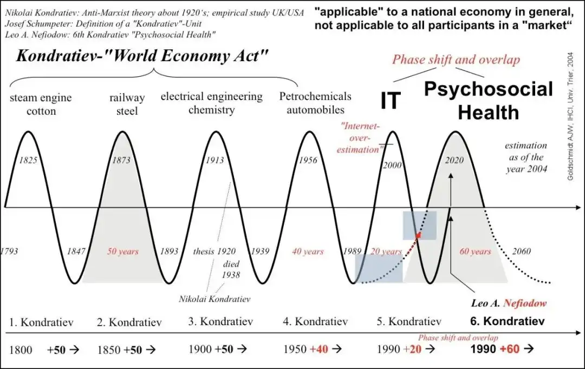
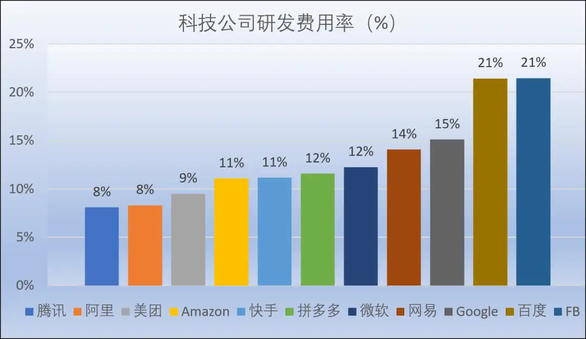
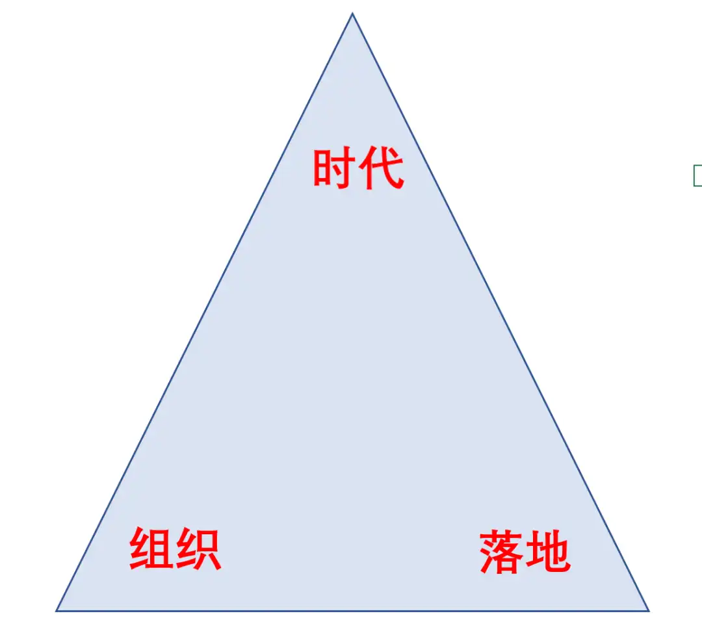
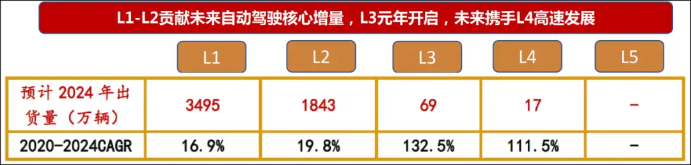

# BAT的“组织新周期”
来源：锦缎

牛牛敲黑板：  

本质上，组织依附于公司存在，公司依附于特定商业逻辑存在，商业逻辑依附于特定社会经济的时代特征存在。

2021年，注定这是一个互联网科技公司组织文化开始失灵、坍塌以及重启的原点。「到哪里去」，是这个时期最核心的一个关键词。

组织行为学是个比较西式的理论框架，过去百年间不断西学东渐，直到最近二十年第三次产业革命的最强余波——移动互联网技术的无远弗届，催发出了「FANMG」与「HBAT」 如是彼此辉映的新的全球两极科技高地，使得「stay foolish，stay hungry」、「Do the right thing」、「狼性」、「996」……这些标志性的组织文化符号不断冲击人们的心智，并为当代商业史烙印下一个特定的时代印记。

但「冯唐易老，李广难封」的是，所有我们的时代，最终都要被他们的时代所终结。本质上，组织行为学的不断演化，反映的是市场经济不断延展更迭的结果。从时间线上，我们能够清晰洞悉，不存在一成不变的组织与组织文化，与抗性钝化原理如出一辙，我们越是推崇的商业伦理，它的保质期越短：

●20世纪初到30年代，以泰罗、法约尔、韦伯为代表的古典管理学派当道。这一时期是大工业快速发展的阶段，人们关注的是生产的效率。组织行为学的实践落脚点是钢铁公司。这一阶段的管理理论重视对物的研究，而忽视人的因素。

●20世纪20年代到60年代，以梅约、麦格雷戈为代表的人际关系理论风靡。其中最著名的事件是霍桑实验，研究客体是美国芝加哥西部电器公司。这一阶段管理理论的大成在于，首次将生产关系要素引入组织管理。

●20世纪60年代到70年代，以钱德勒、劳伦斯为代表的管理科学学派成为主导。依托于计算机技术的兴起，系统论、信息论、控制论等系统科学理论被引入组织管理领域，组织行为进入科学、技术与方法的结构量化时态。

●20世纪70年代到1990年代，以巴纳德、法约尔、西蒙等为代表的现代管理学派崛起。这一阶段主要特征是围绕跨国公司展开，把组织看作一个开放的社会模式，创立了系统工程这一新的管理理论。最有代表性的实践是前通用电器CEO杰克·韦尔奇提出的「数一数二」与「无边际公司」理论。

●2000年代至今，即「FANMG」与「HBAT」的时代，移动互联网的「无边际数字化」增维与「零成本效应」特质，对跨国公司的「实体无边际」形成降维打击，在「矩阵模拟」效应里表彰狼性成为这一时代的显著特质。

**可见，所谓组织与组织文化，都是当时当下生产力与生产关系深度博弈的结果。一旦二者失调，便会出现剧烈的新旧汰换，即所谓的「没有公司的时代，只有时代的公司」。** 

2021年，从组织行为学维度观察，种种迹象显示，一场新的变革已经肇始。

最近20年，全球范围内规模性的公司组织演变与汰换，竹繁不及备载。曾经2000亿美金市值的诺基亚和摩托罗拉，80后依旧烙印深刻，00后却已大为陌生。

从现象维度审阅，我们可以认同这是苹果与华为崛起带来的负效应；但从本质维度出发，这一现象与恐龙灭绝如出一辙 ，不是对手太强，而是环境的剧变。

**本质上，组织依附于公司存在，公司依附于特定商业逻辑存在，商业逻辑依附于特定社会经济的时代特征存在。** 

因循这一本质，我们回溯当代商业史，那里有更多的诺基亚与摩托罗拉：《追求卓越》1982年出版数年后，书中提到43家公司中有32家遭遇严重财务危机。《基业长青》1994年出版二十多年后，书中18家「高瞻远瞩」的公司半数未实现基业长青，也未明显跑赢备胎公司……

还原到当前中国互联网业界，百度有失去的十年，但十年之后当它归来时，阿里巴巴与腾讯却正面临各自「创新者的窘境」：

*   阿里，组织力一度被奉为圭臬竞相模仿，花名、政委体系、361……而如今，一篇《致阿里》，让我们看到了内部生产关系的裂痕；
    

*   腾讯，一家被视为掌握移动互联网最强战舰（微信+QQ+内容版权）的荣耀王者，过去10余年历经3次主动组织变革，不可谓不居安思危，但在字节的全面跳动攻势里，当前的组织建设仍不得不面临第四次重整——以最近的PCG调整来看，磊石守城之势仍大于攻略。
    

不止是头部巨子，如果你是资深投资者，拉开你的港美股自选序列，陌陌、猎豹、迅雷、搜狗……那些曾经的时代宠儿，正成为时代的弃子。

即使是当下更活跃的新生代，以小米、美团、滴滴和大疆为例，当它们组团涌入造车序列，一个最显著的启示就是：时代又处于剧变的loading状态里。当过去一年，投资者都在讨论特斯拉、蔚来和理想，我们就该知道，新的生产力已经开始牵引生产关系在底层嬗变重构了：**造车不是本质，只是表象；本质是，第三次产业革命创造出的供给与需求已经临近极值，这倒逼产业巨子们寻求生产力与生产关系的新逻辑。** 

一言以蔽，如果你的生产力与生产关系的比值追不上时代的「帕累托最优」，那你的组织与组织文化必将过时。此时，那些符合时代特征的后浪群——即使它们依然稚嫩如幼童，正为资本与人群拥上历史舞台。

图2：生产和交换的帕累托最优，来源：网络

**2021年，注定这是一个互联网科技公司组织文化开始失灵、坍塌以及重启的原点。「到哪里去」，是这个时期最核心的一个关键词。** 

回答到哪里去，先要知道从哪里来。这个前置问题预示着，既往20年轰轰烈烈的模式创新已经到了周期性终结的时刻。

共识的问题我们长话短说：催发出苹果、谷歌、亚马逊、百度、阿里和腾讯的，是基于「0/1」二进制的计算机与通讯技术，直至移动互联网的呼啸而来，它们在幸存者偏差与丛林法则里存活、壮大，最终成为最近一个商业周期的时代符号。

巨潮造势，巨头造局，一叶扁舟终成巨舰。本质上，这些公司都是福特、洛克菲洛、通用、西门子、爱立信与诺基亚们的近当代商业文明延续。只不过，有人是机械时代守门人，有人是数字时代破局者。

**如是，从哪里来，不言而喻：归根到底，当代商业符号，来自于第三次产业革命的最后余波。** 

具体到中国产业视角，这幅画面便徐徐打开了：过去一个时期，中国经济的主流时代特征，是基于互联网与移动互联网这一成熟基础设施的模式创新。因此诞生了一批顺应时代特征的平台型科技公司，我们去阿里和京东购物，去腾讯通信与游戏，去美团解决一日三餐，去滴滴完成通勤出行，去抖音消磨空余的时光……

图3：知名互联网公司，来源：中金

但一个常识是，当这些符号逐渐进入成熟期后，和既往所有不同时代产业巨子一样，都将要受到柯布-道格拉斯生产函数与诺威格定理的约束——前者表现为生产效率逐渐下降直到回归均值，后者表现为市场份额固化产业进入红海式的存量竞争时态。

更为具体来说，**导致这种周期现象的本质原因在科技公司自身创新的停滞。** 因为经济是其技术的表达，当技术集合在一起，由此创造一个组织结构进行决策、生产、销售、服务，并由此创造了我们称之为「经济」的社会活动。一旦创新停滞，生产力与生产关系的平衡瞬间破碎。

这时，反映在组织文化上，就是开始出现失灵的迹象。

基于这样的基本逻辑，我们必须清醒意识到，**当前中国互联网科技公司已经进入一个特定的组织文化周期的末尾，将面临一个较长阶段的调整期，能够洞悉到新的时代特征，并因循它调整好组织架构并重塑组织文化的科技公司，才能穿越到新的周期之内。** 

我们必须格外重视这一现象及底层逻辑，因为对于中国互联网科技公司，事态的延展可能比我们预期的更严重——相比谷歌、苹果们，我方阵营的模式创新痕迹与势能更为顽固。

创新尽管不分优劣，尤其特定时空背景下，模式创新更具效率。但显而易见的是，归根结底，模式创新要依附技术创新展开。故而对于多数中国乃至全球科技公司而言，模式创新难以为继已是既定现实，新一轮的创新必定将围绕硬核技术创新展开。

基于这样的框架，我们可以推演：微观上，最终终结当前国内模式创新最强一浪——字节跳动，大概率将不会是它当前的主要竞争者，而是来自硬核技术创新的未来公司；宏观上，移动互联网技术红利过顶退潮，模式创新将全面让位技术创新，未来公司与未来组织文化即将因此登上历史舞台。

不同的时代属于不同的公司，同一时代的标志性公司存在底层逻辑接近的组织力与组织文化。换言之，组织与组织文化都有鲜明的时代特征，即不同的时代特征需要同步的组织力相适应。

读不懂这一点，我们将大概率坐井观天，限制在一个极窄的刻度里误读当期商业史的演变逻辑。这一过程中，社会的商业意识形态将阶段性逡巡于「成王败寇」式的简单粗暴之中。

**其中最典型的例子就是「BAT」现象，这是我们透视未来公司与当前中国互联网科技公司组织新周期可靠视角之一。** 

对于「BAT」，如果仅以中波周期（康波周期中的中周期，一般8-12年）审读，我们更倾向于AT，而放逐B。但经济产业的脉络却从不是由中波决定，它是一个长波周期（康波周期中的长周期，一般50年）的效应结果。从长波周期审读，只有掌握核心硬核技术科技树的公司，才是一个产业时代的最终主导。

图5：康波周期，来源：网络

当然这个过程充满变数，规避变数的有效路径大约是一种近似量子效应的状态叠加，即：技术信仰+运气。前者塑造韧性与领导力，后者解释丛林法则的残酷。

**基于如是创新周期框架，我们可以发现，偏见使我们对于BAT误读了十年：** 

对于百度，很多人通过既往最显性的商业现象而如鲠在喉。一些枝枝丫丫已经被解读成山，这不是我们本文的重点，我们只关注主干：为何有所谓的「失去的10年」现象。

理解这个问题，组织文化是一个看起来特别却可以直抵本质的视角。先说结论：归根结底，百度不是失去了十年，而是它不属于这个特定的周期。

尽管这些年甚多尝试——最典型莫如它曾下场的外卖业务，最终归于寂寥——但事实证明，它的科技树确实开不出这番花。

造成百度这种「中波短板」的恰是百度的「长波长板」——以技术信仰为底色的组织文化基因，狭义上归结，这体现的是人的体质极限无法挣脱地球引力效应——无论拉里·佩奇、谢尔盖·布林还是李彦宏，它们的第一步决定了这家公司的基因，并派发了后续成长势能：

搜索引擎现在看已经当然性的融入于互联网基础设施的最底层，但复盘这一过程我们可以看到，两家公司在搜索引擎上收拢到的现金流，都最大化流向了哺育硬核技术创新科技树的土壤上。这样的土壤之上，不止是百度，即使是谷歌也没有内生出任何模式创新花朵。只是相对而言，谷歌的安卓留给了第三次产业革命最后的辉煌——移动互联网上；而十年前，百度生下的火种——自动驾驶（Apollo ），燃烧于2021年即将开启的新周期。 

图6：科技公司研发费用率，来源：网络

于是过往十年，我们能看到的是，谷歌与百度二者创新的最大效应就是：挫折与沉默，一如谷歌X实验室的挫折与百度自动驾驶的沉默。所以做不成电商、做不成外卖、做不成IM，并非外界诟病的那些因素，而是B与G的路径驱动模式不在模式创新上，而是技术创新。

**不要低估技术创新的难度，这个世界进入过无人区的人寥寥无几，普遍都是键盘侠。即使强如谷歌与苹果，它们的自动驾驶技术补齐也要依靠并购。只是我们对于技术创新的认知经验还过于粗浅，所以在有更长工业化历史的西方，人们的包容度相比会更高，而我们则难免在全球化初期一度陷入简单粗暴的成王败寇逻辑里。** 

所谓塞翁失马，在移动互联网时代不擅模式创新，但一以贯之的技术信仰组织文化，从不会让这类公司失去时代的眷顾，成百数千的模式创新者正在陷入时代沼泽，而百度却得以在新末周期交割之际再起舞就是论据。

进而我们再来对照，一些关乎中国互联网科技公司整体阵营的蛛丝马迹相继出现了：同样是西学东渐的反垄断，正成为当下的产业主题词。在「诺威格定理」约束下，全球模式创新型平台经济公司正迎来共同的宿命：

即，当一家公司市场渗透率超过50%后，成长性就已到了尽头。这个时候，以模式创新为竞争的产业巨头多选择以并购维持生命周期。这样的趋势，带来结果将是全产业的资本垄断化——程度最严重的一种「内卷」形态，所到之处，创新屈于既得利益资本主导而大停滞。

**模式创新与技术创新向来不是一个维度，那些模式创新基因极其强大的公司，一旦经历过模式创新顶峰，从周期维度上看，它们的下个时代将是在新一轮技术创新的成熟期。** 

以此对照BAT中的AT，作为投资者我们难免有些焦虑——当然它们可能更焦虑。虽然不必低估它们的潜能——阿里2017年11月成立了达摩院，预示着它从模式创新向硬核技术创新转型已见端倪，而近期腾讯主动释放出的那条「机器狗」，也在昭示着它正试图拥抱技术创新；但以生物历史为参照系得以昭示，基因这个「东西」实在太过于强大，它对一家公司的要求来自于最底层操作系统，因此我们难免会「杞人忧天」、有所焦虑。

关于BAT的组织力问题，我们下一章简单展开下。

**组织力是个动态概念，它不是一纸一文，不是一城一地。组织不能脱离具体时代特征存在，任何能脱颖而出的新周期组织都要达成「时代、组织、落地「三位一体的「三角效应」。** 

从这三角效应上审阅，BAT从过去十年至今，已经相继遇到各自瓶颈。 

图7：组织三角，来源：锦缎

在移动互联网时期的模式创新时代，腾讯和阿里的「三个角」均在实践磨砺中稳如磐石。但在技术创新时代，它的具体逻辑面临着深层更新甚至重构考验。

**之于腾讯而言，最大的创新窘境在业务有跟不上时代的迹象。最新近的信号来自于大股东的减持：** 

2018年3月，Naspers减持腾讯2%。当时减持市场反响很大，腾讯股价跌的比较厉害，Naspers承诺3年内不再减持。然后3年时间刚过便迫不及待再次减持，2020年4月Naspers要减持2%套现1100亿港币。

资深腾讯投资者应该知道，Naspers第一次减持的时候行业有什么变化，那时原国家新闻出版广电总局发布《游戏申报审批重要事项通知》，称由于机构改革，所有游戏版号的发放全面暂停，且并未通知暂停期限。

游戏对于腾讯来说是重中之重，10亿级流量催生千亿级变现的核心板块。大资金再次用脚投票，促使我们要心里有数的是：Naspers第一次减持至今两三年来，腾讯在业务创新（模式创新）领域没有展现太多增量的东西；至于足够引发势能裂变的技术创新，这些年尚未有苗头——只有买买买。

图8：腾讯游戏的体量，来源：腾讯年报

**而阿里本质的难题与腾讯如出一辙，只是在模式创新上更为激进。** 过去一个时期发生的事件一定程度揭示了这一点。因此引发的连锁反应就包括其关于组织文化的自下而上的反思，此前《致阿里》一文的前因后果已经对此呈现，不再赘述。

最后看百度，它固然回归时代「再起舞」，但此前路径中的短板仍值得重视。百度从2010年开始投入大量研发在AI和自动驾驶，从技术层面讲一直是全球领先的硬科技公司；但无论是受制于创新成熟曲线也好，还是过度忠于技术信仰也罢，**一个基本事实是：百度的确不擅于模式创新。** 要知道，模式创新的窗口期，一样有巨大社会与商业价值。作为当前可能是唯一可与华为相提并论的硬核创新中国公司，百度亟待有意识的弥补模式创新短板。

以上我们可以发现，**从大的趋势上看，面对组织新周期，中国互联网科技公司的主体短板是硬核技术创新。** 这里面的正面参照，一个是华为，一个是百度，它们的路径需要重视。

对于华为，作为非上市公司，我们能够穿透的层次有限，不妨继续搜集信息与研究，未来开篇深度解读。对于百度，我们多有追踪，我们更倾向于从组织维度简单复盘下它是如何得以穿越周期再如新的。

贯通这个逻辑，还是要从产业时间线上梳理起：

**工业时代。** 讲究高效的批量生产，需要强组织去管理。比如通用汽车、福特汽车等公司从流水线到ROI定量的高强度管理,到最终在通用车型基础上缝缝补补又三年，打着毫无尽头的控制成本的存量之战。

一旦碰到信息时代的对手成长起来结局就已注定。别说特斯拉，就中国造车新势力未来也在展现出吊打传统主机厂的潜能。 

**信息时代。** 讲究多维连接价值涌现，维系连接的多寡决定组织管理的强弱。比如腾讯控股，它的主要增长方向仍是社交驱动游戏等核心消费互联网场景。比如阿里巴巴，它的主要增长方向仍是电商和消费金融的渗透率。

它们的组织相对工业时代更灵活，但仍有其局限性，模式>创新带来腾讯内部的「墙」，带来阿里的技术人员对「福报」系统的抗拒。

**智能技术融合时代。** 这是正在开启的以碳中和为时代框架，以AI、生物技术、智能算力为抓手的混合智能新周期，第四次产业革命有较大概率将因此全面启动。这一周期内，大家需要凭手里的硬核先发专利说话，模式创新将全面让位于技术创新。

**技术融合创新周期的核心特征就是，技术与技术的混合、算力与场景的混合，技术与算力的混合，软件与硬件的融合，随之而来即要求互联网科技公司需要在底层进行组织力与组织文化适配。而这种适配，本质会产生一种文化冲突：技术文化VS模式文化。** 

比如百度，之所以在这个时代价值绽放，很大程度是由技术信仰带来的路径牵引，进而构筑了符合新周期特质的组织力。对于擅于模式创新的组织来说，百度这种组织力，中短时间内只能远观，难以一蹴而就的效仿，因为它是一个长期动态博弈的结果，最终构成了一套硬核系统：

**◆技术信仰。** 这是百度组织文化内核，它的原点是超链分析（ESP）这一奠定现代搜索引擎发展趋势和方向的基础发明。在李彦宏以此创立百度那一刻，这一基因完成了注入式确认。

**◆混合智能平台。** ESP技术既是百度技术爆炸的原点，也是技术繁衍的支点，支撑搜索技术自然过渡到AI技术，也繁衍出了百度大脑、Apollo、AI芯片与量子计算等更高维度的科技树。十年树木之后，百度完成了从搜索引擎到AI引擎这一混合智能平台的演进。

**◆远期伟大目标牵引。** 混合智能平台雏形的显现确认了技术信仰是一条光明之路，同时在搜索基本盘稳定贡献哺育研发的现金流之后，自动驾驶（Apollo）与量子计算等成为百度更为远大的目标。

技术信仰—混合智能平台—远期伟大目标牵引，这是一个不断动态滚动的正向循环。当时当下，百度最新一期技术原点早已不是ESP，就像基于此更为长远预期那样——如果还能有运气加持（运气重要性我们前文已经讲过），混合智能平台之后还将有新的平台，自动驾驶与量子计算之后还将有更伟大的远期目标。

如果我们去拆解华为的底层逻辑，大致与此大差不差（当然从智能手机实践看，它的模式创新能力——主要反映在营销力上，是百度需要追赶的）。

如是，这样的硬核系统，构成了百度整个组织力的操作系统。基于这一操作系统， 百度现阶段用以适配的组织文化可概括为三点：【1】人才密度重于流程。【2】创新高于效率。【3】决策下放多于管控。

关于组织文化，百度内部有一句经典的表述——「简单可依赖」。其释义也很「接地气」，即「做人很简单，做事很厉害」，强技术属性的企业文化，在执行和渗透过程中，也会极为简单和易于落地。

在这样易于落地的文化氛围之下，必然会在复杂的模式创新上有所吃力。但如上所述，也同样得益于此，超长周期的硬核技术创新得以笃定和不变形的执行，这也是穿越产业周期的根本。

对于百度这家技术与组织力暂时领先于时代的公司而言，当期最重要的投资考核已经落定在基于技术融合的场景落地能力上。就是说，科技公司既要有契合时代的技术（增长的基础），也要能把技术放到具体场景落地变现，这样才能实现组织和落地的双螺旋：落地作为结果增加组织的士气并磨练更强的组织，更强的组织带来更好的落地结果。

关于落地，过去10年，百度是BAT中被吐槽最多的。你有核心专利，你有技术，你有最大的开发者平台……OK，那又怎么样呢？没有落地和订单，研发费用也只是沉没成本而已。

那么，百度的「第三角」而今如何？我们来看看百度创新技术的落地项目——

百度港股二次上市的招股书里，披露了2020年8月与广州市达成的4.6亿元合作项目，用V2X解决方案提高交通效率及安全。不过这已经是好几个月前的事了，草根调研搜集信息，梳理百度在非招标旺季的2021年3月份的情况：

*   百度Apollo联合中标四川成都高新区5G智慧城智能驾驶项目，金额1.05亿元。
    
*   百度智能云中标浦发银行深度学习环境构建课题二期硬件设备采购招标项目，金额1090万。
    
*   百度Apollo牵头中标重庆西部科学城核心区智慧交通体系道路交通信号控制一期，金额2852万。
    
*   百度中标重庆永川西部自动驾驶开放测试基地（二期）项目，金额3890万元。
    
*   部分项目未找到金额以及篇幅所限，这里不一一列出。
    

从整体上看百度创新技术的落地情况：

百度的云服务2020年营收同比增长44%至91.7亿元，20年Q4同比增长67%至33亿元（全年维持这个增速就是153亿元）。与阿里云腾讯云主要提供IaaS算力不同，百度的云服务主要提供AI、知识图谱、行业垂直的解决方案（招股书P210）。

单从BAT云服务的特点和占比角度看，百度的云计算落地能力正在释放，2020Q4：

*   以AI解决方案为主的百度云占核心业务营收14.5%左右。
    
*   以IaaS为主的阿里云占公司营收不到8%。
    
*   以IaaS为主的腾讯云占公司营收3%左右（根据阿里云营收和阿里云腾讯云相对市占率推测）。
    

百度的自动驾驶接下来会进入快速增长期。李震宇（百度集团资深副总裁、智能驾驶事业群总经理）在上海车展上透露，2021下半年百度Apollo自动驾驶将迎来量产高峰，每个月都会有一款新车上市。随着百度、华为的L4技术亮相，L4之前的自动驾驶在近几年会加速「上车」，西南证券预测到2024年规模会到5424万辆（大概汽车保有量的12%）。 

图11：自动驾驶「上车」规模，来源：西南证券

我们对百度自动驾驶的认知（参见系列新能源汽车和自动驾驶的文章），百度Apollo已经在业绩爆发的前夕，前文《百度芯事：750亿美金的认知差》有过简单的预测：到2030年Apollo的整体收入预计在30亿美元。

以上，智能技术融合新时代的大幕徐徐张开的当下，环顾中国互联网科技阵营，在组织新周期「三角效应」维度，百度已经在不知不觉里跑出了第一身位。

此处我们或可以问一句，在智能融合技术商业前景预期上，在引领本土实体经济对第四次产业革命的突围中，我们的互联网科技阵营里，除了华为，未来谁能成为百度的真正假想敌？

这个问题特别重要——

无论如何，作为产业符号，对于阿里和腾讯相对弱化的技术创新——甚至是百度相对弱化的模式创新——这个命题，我们始终需要在外部为它们施加压力，最终促使它们从最底层的组织与组织文化维度展现出「基因编辑」式补齐魄力。这不止基于浅薄的投资需求，这是国别科技树竞争的时代召唤。

编辑/lydia