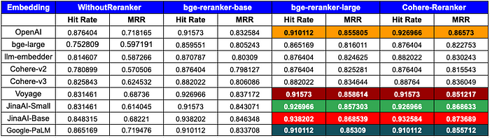

# Boosting RAG: Picking the Best Embedding & Reranker models | by Ravi Theja | LlamaIndex Blog
[Boosting RAG: Picking the Best Embedding & Reranker models | by Ravi Theja | LlamaIndex Blog](https://blog.llamaindex.ai/boosting-rag-picking-the-best-embedding-reranker-models-42d079022e83) 

 [


](https://ravidesetty.medium.com/?source=post_page-----42d079022e83--------------------------------)[


](https://blog.llamaindex.ai/?source=post_page-----42d079022e83--------------------------------)


**UPDATE**: The pooling method for the Jina AI embeddings has been adjusted to use mean pooling, and the results have been updated accordingly. Notably, the `JinaAI-v2-base-en` with `bge-reranker-large`now exhibits a Hit Rate of 0.938202 and an MRR (Mean Reciprocal Rank) of 0.868539 and with`CohereRerank` exhibits a Hit Rate of 0.932584, and an MRR of 0.873689.

When building a Retrieval Augmented Generation (RAG) pipeline, one key component is the Retriever. We have a variety of embedding models to choose from, including OpenAI, CohereAI, and open-source sentence transformers. Additionally, there are several rerankers available from CohereAI and sentence transformers.

But with all these options, how do we determine the best mix for top-notch retrieval performance? How do we know which embedding model fits our data best? Or which reranker boosts our results the most?

In this blog post, we’ll use the `Retrieval Evaluation` module from LlamaIndex to swiftly determine the best combination of embedding and reranker models. Let's dive in!

Let’s first start with understanding the metrics available in `Retrieval Evaluation`

To gauge the efficacy of our retrieval system, we primarily relied on two widely accepted metrics: **Hit Rate** and **Mean Reciprocal Rank (MRR)**. Let’s delve into these metrics to understand their significance and how they operate.

**Hit Rate:**

Hit rate calculates the fraction of queries where the correct answer is found within the top-k retrieved documents. In simpler terms, it’s about how often our system gets it right within the top few guesses.

**Mean Reciprocal Rank (MRR):**

For each query, MRR evaluates the system’s accuracy by looking at the rank of the highest-placed relevant document. Specifically, it’s the average of the reciprocals of these ranks across all the queries. So, if the first relevant document is the top result, the reciprocal rank is 1; if it’s second, the reciprocal rank is 1/2, and so on.

Now that we’ve established the scope and familiarized ourselves with the metrics, it’s time to dive into the experiment. For a hands-on experience, you can also follow along using our [Google Colab Notebook](https://colab.research.google.com/drive/1TxDVA__uimVPOJiMEQgP5fwHiqgKqm4-?usp=sharing)

```
!pip install llama-index sentence-transformers cohere anthropic voyageai protobuf pypdf
```

```
openai\_api\_key = 'YOUR OPENAI API KEY'  
cohere\_api\_key = 'YOUR COHEREAI API KEY'  
anthropic\_api\_key = 'YOUR ANTHROPIC API KEY'  
openai.api\_key = openai\_api_key
```

We will use Llama2 paper for this experiment. Let’s download the paper.

```
!wget --user-agent "Mozilla" "https://arxiv.org/pdf/2307.09288.pdf" -O "llama2.pdf"
```

Let’s load the data. We will use Pages from start to 36 for the experiment which excludes table of contents, references, and appendix.

This data was then parsed by converted to nodes, which represent chunks of data we’d like to retrieve. We did use chunk_size as 512.

```
documents = SimpleDirectoryReader(input_files=\["llama2.pdf"\]).load_data()

node\_parser = SimpleNodeParser.from\_defaults(chunk_size=512)  
nodes = node\_parser.get\_nodes\_from\_documents(documents)


```

For evaluation purposes, we created a dataset of question-context pairs. This dataset can be seen as a set of questions and their corresponding context from our data. To remove bias for the evaluation of embedding(OpenAI/ CohereAI) and Reranker (CohereAI), we use Anthropic LLM to generate Question-Context Pairs.

Let’s initialize a prompt template to generate question-context pairs.

```
  
qa\_generate\_prompt_tmpl = """\  
Context information is below.

\-\-\-\-\-\-\-\-\-\-\-\-\-\-\-\-\-\-\-\-\-  
{context_str}  
\-\-\-\-\-\-\-\-\-\-\-\-\-\-\-\-\-\-\-\-\-

Given the context information and not prior knowledge.  
generate only questions based on the below query.

You are a Professor. Your task is to setup \  
{num\_questions\_per_chunk} questions for an upcoming \  
quiz/examination. The questions should be diverse in nature \  
across the document. The questions should not contain options, not start with Q1/ Q2. \  
Restrict the questions to the context information provided.\  
"""


```

```
llm = Anthropic(api\_key=anthropic\_api_key)  
qa\_dataset = generate\_question\_context\_pairs(  
    nodes, llm=llm, num\_questions\_per_chunk=2  
)
```

Function to filter out sentences such as — `Here are 2 questions based on provided context`

```
  
def filter\_qa\_dataset(qa_dataset):  
    """  
    Filters out queries from the qa_dataset that contain certain phrases and the corresponding  
    entries in the relevant_docs, and creates a new EmbeddingQAFinetuneDataset object with  
    the filtered data.

    :param qa\_dataset: An object that has 'queries', 'corpus', and 'relevant\_docs' attributes.  
    :return: An EmbeddingQAFinetuneDataset object with the filtered queries, corpus and relevant_docs.  
    """

      
    queries\_relevant\_docs\_keys\_to_remove = {  
        k for k, v in qa_dataset.queries.items()  
        if 'Here are 2' in v or 'Here are two' in v  
    }

      
    filtered_queries = {  
        k: v for k, v in qa_dataset.queries.items()  
        if k not in queries\_relevant\_docs\_keys\_to_remove  
    }  
    filtered\_relevant\_docs = {  
        k: v for k, v in qa\_dataset.relevant\_docs.items()  
        if k not in queries\_relevant\_docs\_keys\_to_remove  
    }

      
    return EmbeddingQAFinetuneDataset(  
        queries=filtered_queries,  
        corpus=qa_dataset.corpus,  
        relevant\_docs=filtered\_relevant_docs  
    )

  
qa\_dataset = filter\_qa\_dataset(qa\_dataset)


```

To identify the optimal retriever, we employ a combination of an embedding model and a reranker. Initially, we establish a base `VectorIndexRetriever`. Upon retrieving the nodes, we then introduce a reranker to further refine the results. It’s worth noting that for this particular experiment, we’ve set similarity\_top\_k to 10 and picked top-5 with reranker. However, feel free to adjust this parameter based on the needs of your specific experiment. We are showing the code here with `OpenAIEmbedding`, please refer to the [notebook](https://colab.research.google.com/drive/1TxDVA__uimVPOJiMEQgP5fwHiqgKqm4-?usp=sharing) for code with other embeddings.

```
embed_model = OpenAIEmbedding()  
service\_context = ServiceContext.from\_defaults(llm=None, embed\_model = embed\_model)  
vector\_index = VectorStoreIndex(nodes, service\_context=service_context)  
vector\_retriever = VectorIndexRetriever(index=vector\_index, similarity\_top\_k = 10)
```

```
class CustomRetriever(BaseRetriever):  
    """Custom retriever that performs both Vector search and Knowledge Graph search"""

    def \_\_init\_\_( self,  
        vector_retriever: VectorIndexRetriever, ) -\> None:  
        """Init params."""

        self.\_vector\_retriever = vector_retriever

    def _retrieve(self, query_bundle: QueryBundle) -\> List\[NodeWithScore\]:  
        """Retrieve nodes given query."""

    retrieved\_nodes = self.\_vector\_retriever.retrieve(query\_bundle)

    if reranker != 'None':  
      retrieved\_nodes = reranker.postprocess\_nodes(retrieved\_nodes, query\_bundle)  
       else:  
          retrieved\_nodes = retrieved\_nodes\[:5\]

                return retrieved_nodes

    async def _aretrieve(self, query_bundle: QueryBundle) -\> List\[NodeWithScore\]:  
        """Asynchronously retrieve nodes given query.

        Implemented by the user.

        """

  
        return self.\_retrieve(query\_bundle)

    async def aretrieve(self, str\_or\_query_bundle: QueryType) -\> List\[NodeWithScore\]:  
        if isinstance(str\_or\_query_bundle, str):  
            str\_or\_query\_bundle = QueryBundle(str\_or\_query\_bundle)  
        return await self.\_aretrieve(str\_or\_query\_bundle)

custom\_retriever = CustomRetriever(vector\_retriever)


```

To evaluate our retriever, we computed the Mean Reciprocal Rank (MRR) and Hit Rate metrics:

```
retriever\_evaluator = RetrieverEvaluator.from\_metric_names(  
    \["mrr", "hit_rate"\], retriever=custom_retriever  
)  
eval_results = await retriever\_evaluator.aevaluate\_dataset(qa_dataset)
```

We put various embedding models and rerankers to the test. Here are the models we considered:

**Embedding Models**:

*   [OpenAI Embedding](https://platform.openai.com/docs/guides/embeddings)
*   [Voyage Embedding](https://www.voyageai.com/)
*   [CohereAI Embedding](https://txt.cohere.com/introducing-embed-v3/) (v2.0/ v3.0)
*   [Jina Embeddings](https://huggingface.co/jinaai/jina-embeddings-v2-small-en) (small/ base)
*   [BAAI/bge-large-en](https://huggingface.co/BAAI/bge-large-en)
*   [Google PaLM Embedding](https://developers.generativeai.google/tutorials/embeddings_quickstart)

**Rerankers**:

*   [CohereAI](https://txt.cohere.com/rerank/)
*   [bge-reranker-base](https://huggingface.co/BAAI/bge-reranker-base)
*   [bge-reranker-large](https://huggingface.co/BAAI/bge-reranker-large)

> It’s worth mentioning that these results provide a solid insight into performance for this particular dataset and task. However, actual outcomes may differ based on data characteristics, dataset size, and other variables like chunk\_size, similarity\_top_k, and so on.

The table below showcases the evaluation results based on the metrics of Hit Rate and Mean Reciprocal Rank (MRR):



**Performance by Embedding:**
-----------------------------

*   **OpenAI**: Showcases top-tier performance, especially with the `**CohereRerank**` (0.926966 hit rate, 0.86573 MRR) and `**bge-reranker-large**` (0.910112 hit rate, 0.855805 MRR), indicating strong compatibility with reranking tools.
*   **bge-large**: Experiences significant improvement with rerankers, with the best results from `**CohereRerank**` (0.876404 hit rate, 0.822753 MRR).
*   **llm-embedder**: Benefits greatly from reranking, particularly with `**CohereRerank**` (0.882022 hit rate, 0.830243 MRR), which offers a substantial performance boost.
*   **Cohere**: Cohere’s latest v3.0 embeddings outperform v2.0 and, with the integration of native CohereRerank, significantly improve its metrics, boasting a 0.88764 hit rate and a 0.836049 MRR.
*   **Voyage**: Has strong initial performance that is further amplified by `**CohereRerank**` (0.91573 hit rate, 0.851217 MRR), suggesting high responsiveness to reranking.
*   **JinaAI**: Very strong performance, sees notable gains with `**bge-reranker-large**` (0.938202 hit rate, 0.868539 MRR) and `**CohereRerank**` (0.932584 hit rate, 0.873689), indicating that reranking significantly boosts its performance.
*   **Google-PaLM**: The model demonstrates strong performance, with measurable gains when using the `**CohereRerank**`(0.910112 hit rate, 0.855712 MRR). This indicates that reranking provides a clear boost to its overall results.

**Impact of Rerankers**:
------------------------

*   **WithoutReranker**: This provides the baseline performance for each embedding.
*   **bge-reranker-base**: Generally improves both hit rate and MRR across embeddings.
*   **bge-reranker-large**: This reranker frequently offers the highest or near-highest MRR for embeddings. For several embeddings, its performance rivals or surpasses that of the `**CohereRerank**`.
*   **CohereRerank**: Consistently enhances performance across all embeddings, often providing the best or near-best results.

**Necessity of Rerankers**:
---------------------------

*   The data clearly indicates the significance of rerankers in refining search results. Nearly all embeddings benefit from reranking, showing improved hit rates and MRRs.
*   Rerankers, especially `**CohereRerank**`, have demonstrated their capability to transform any embedding into a competitive one.

**Overall Superiority**:
------------------------

*   When considering both hit rate and MRR, the combinations of `**OpenAI + CohereRerank**` and `**JinaAI-Base + bge-reranker-large/ CohereRerank**` emerge as top contenders.
*   However, the consistent improvement brought by the `**CohereRerank/ bge-reranker-large**` rerankers across various embeddings make them the standout choice for enhancing search quality, regardless of the embedding in use.

In summary, to achieve the peak performance in both hit rate and MRR, the combination of `**OpenAI**` or `**JinaAI-Base**` embeddings with the `**CohereRerank/bge-reranker-large**` reranker stands out.

> Please be aware that our benchmarks are intended to offer a reproducible script for your own data. Nevertheless, treat these figures as estimates and proceed with caution when interpreting them.

In this blog post, we have demonstrated how to evaluate and enhance retriever performance using various embeddings and rerankers. Below are our final conclusions.

*   **Embeddings**: The `**OpenAI**` and `**JinaAI-Base**` embeddings, especially when paired with the `**CohereRerank/bge-reranker-large**` reranker, set the gold standard for both hit rate and MRR.
*   **Rerankers**: The influence of rerankers, particularly `**CohereRerank/bge-reranker-large**`, cannot be overstated. They play a key role in improving the MRR for many embeddings, showing their importance in making search results better.
*   **Foundation is Key**: Choosing the right embedding for the initial search is essential; even the best reranker can’t help much if the basic search results aren’t good.
*   **Working Together:** To get the best out of retrievers, it’s important to find the right mix of embeddings and rerankers. This study shows how important it is to carefully test and find the best pairing.