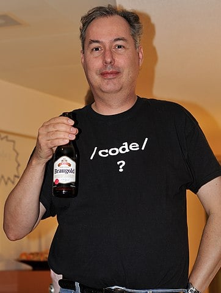

Bram 去世之后 Vim 的维护 ： 来自一位核心维护人员的讲述
===============
                                                                          

             

  

Bram 去世之后 Vim 的维护 ： 来自一位核心维护人员的讲述
=================================

[InfoQ](javascript:void(0);)

InfoQ

极客邦控股(北京)有限公司

为一线互联网公司核心技术人员提供优质内容。科技圈的观察者，前沿技术的传播者。

2785篇原创内容

_2025年03月04日 07:57_

作者 | David Cassel

译者 | 平川

策划 | Tina

_**本文最初发布于 THENEWSTACK 博客。**_

阿尔布开克日落（2022 年 10 月），David Cassel 拍摄

开源文本编辑器 Vim 的创建者 Bram Moolenaar 于 2023 年 8 月去世后，这个项目怎么样了？

为了确保项目得以继续，社区默默地做出了巨大的努力。

2024 年 11 月底，在 VimConf 2024 大会上，Vim 维护者 Christian Brabandt 讲述了这个故事。这是一个真实的鼓舞人心的故事，关于坚韧、毅力和纪念。

在东京，Brabandt 对听众说：”你们可以看到，开发工作并没有停止。“

每天都有新的 pull 请求和问题需要审核，所以“它仍然相当活跃。GitHub 上有很多活动在进行。“

2024 年 1 月，他们发布了 Vim 9.1，并将其献给了 Moolenaar。

开发没有停止

自 2006 年以来，平台顾问 Christian Brabandt 就一直活跃在 Vim 社区，贡献了 Bug 报告、修复和一些新特性。他参与了 Vim 的正则表达式处理和加密支持等工作，还帮助创建每日 Appimage 并“迁移了主页”。2023 年 8 月，“我突然成了 Vim 的主要维护者之一”。

Moolenaar 去世的消息“让我们所有人都非常震惊”，尽管在此之前几周，Vim 的邮件列表已经“非常安静”，“人们已经开始怀疑 Bram 出了什么事？他在哪里？”

“我们必须决定该怎么做。“

Brabandt 首先承认，他们“失去了很多知识”，而不仅仅是 Moolenaar 的测试脚本。

30 年前，Moolenaar 创建了 Vim，他的脑子里“装着很多知识，关于他最初希望 Vim 拥有的所有功能”。不仅如此，Moolenaar 还是项目的领导者。“基本上，是他决定了项目的战略——他希望项目向何处发展，他希望它包含什么，以及他不喜欢什么”。

“我们必须重组，找到延续项目的方法。”

从一开始，我们就遇到了一个很大的问题。Vim 的 GitHub 账户，“Bram 是所有者。这意味着只有他才能做出某些决定——比如做出为其他维护者设置角色和权限的最终决定...... 我们需要有这样的权力才能继续工作，并邀请其他维护者加入项目"。

幸运的是，GitHub 有一项 “已故用户”政策，其中包括“预先指定的继任者”。但遗憾的是，Brabandt 告诉听众，利用这项政策 “并不像听起来那么容易”，因为在填写完相关文件后，GitHub 账户 “基本上就失效了”。这对我们来说不是最好的办法，因为 Bram 的家人可以访问他的账户，我不想让他们失去这项能力“。相反，为了方便邀请其他维护者，Moolenaar 的家人更改了权限。

Brabandt 说，Moolenaar 去世后不久，GitHub 上就累积了“大量的 pull 请求。于是我开始查看并导入它们。当另一位长期贡献者和核心维护者 Charles Campbell 决定退休时，我决定再邀请一些维护者...... 主要是那些长期为 Vim 做出贡献的人。“

但是，除了源代码，他们还必须管理项目的其他基础设施。遗憾的是，那些工作没有一个记录在案的流程，“因此，我不得不自己找出这一切——如何管理——总的来说，困难重重”。

似乎所有可能出错的地方都出错了：

*   处理 Vim 漏洞报告的网站被一家人工智能安全公司收购。Brabandt 说，“这家公司专注于人工智能，而且只专注于人工智能...... 开源漏洞报告几乎立即就被关闭了”。于是，该项目转向了 GitHub 安全咨询。
    
*   Brabandt 了解到，Vim 主页的基础代码过去 20 年从未变过。它仍然包含 PHP 7 代码——尽管对 Php 7 的支持已于 2022 年 11 月终止。
    
*   2023 年 7 月，为 Vim 主页提供托管服务的公司被开源中国收购，很快访问者就开始遇到数据库错误，而技术支持请求无人回复。因此，在重组 Vim 项目的过程中，项目团队也不得不为 Vim 主页寻找新的托管服务，但“遗憾的是，这也意味着我们必须将主页从 PHP 7 至少升级到  PHP 8”。
    
*   Brabandt 说，”FTP 服务器仍由荷兰 Unix 用户组运营。这在上世纪 90 年代或 2000 年代初还可以。但现在，我认为人们通常都是从 GitHub 或主页上下载。” 荷兰 Unix 用户组也不愿意给 Brabrandt 开通访问权限。他说，“没关系...... 因为我们后来决定淘汰旧的 FTP 服务器。如果需要下载，可以通过 Vim 主页完成“。
    

Brabandt 说，自从取消 FTP 访问以来，他还没有听到过任何投诉。

对 ICCF 有什么影响 ？

直到 2024 年底，他们才意识到，帮助页面上的电子邮件地址仍然是转发到 Moolenaar 的邮箱账号。“大概就在两周前，我更改了这些地址，所以现在它们都转发到了我的邮箱“。

众所周知，Vim 鼓励用户向 Moolenaar 最喜欢的慈善机构荷兰国际儿童保育基金（ICCF）捐款。Brabandt 说，Moolenaar 家族仍在维护 Bram 的 Paypal 账户（仍可从 Vim.org 上的链接访问），用于接收捐款。Moolenaar 去世后，很多人向 ICCF 捐款，2024 年又有 9 万欧元的捐款。Brabandt 也致力于确保这些捐款能够按照预期使用，并表示近期内不打算创建任何 Vim 赞助项目。

有一项变化：Bram Moolenaar 曾允许 ICCF 捐赠者对 Vim 的未来功能进行投票，这项功能被关闭了。很难弄清楚哪些 ICCF 捐款应该与 Vim.org 用户挂钩。（ Brabandt 说，我不知道 Bram 过去是怎么做的，ICCF 的其他人也无法告诉我！"）。实际上，大多数新增的增强请求和问题都来自其他渠道，比如 GitHub 和 Vim 自己的待办事项列表。

维护模式

那么未来会发生什么呢？Brabandt 告诉与会者，Vim 计划在即将发布的 Vim 9.2 中做出“更多可能引起争议的改动”。其中包括支持 XDG 规范的基目录规范（“至少有 10 年的时间，社区一直希望这样做”），以及更好地支持 Wayland)。此外，还有一些新的选项和插件，以及一些不可避免的 Bug 修复。

因此，在进行更改的同时，关于 Vim 的未来，Brabandt 悄悄地发表了一份重要的声明。“不过目前，我认为 Vim 或多或少地处于维护模式。我认为，任何维护者都无法全职从事 Vim 或较大功能的维护工作“。举例来说，他知道，Neovim 社区一直在做一些比较大的更改，比如支持解析库 Tree-sitter，但将其添加到 Vim 将需要付出“巨大的努力...... 我不太确定我们能否做到，至少在短期内不能”。

不过，Brabandt 宣布了另一个有价值的目标：确保社区的健康发展。也就是说，要欢迎新的贡献者，让他们能够轻松地开始代码贡献。Brabandt 甚至还引进了一些自动代码格式化工具，因为在此之前，Vim 的源代码使用的是一种在 Brabandt 看来比较“奇怪 ”的特殊格式化风格。基本上，那是 Bram 的工作方式，这没什么问题，但对新用户没有帮助"。

随后的一张幻灯片建议人们开展一些工作，包括：“Tree-Sitter 集成？”、 GTK 版的 Vim GUI 和更高级的终端功能。例如，Vim 的拼写检查代码“已经有好几年没动过了”。

Brabandt 说：“如果未来开发重大的新功能，那么我们确实需要社区的帮助。“但他一直建议，在熟悉代码库之前，新的贡献者要“从小处着手”。

就目前而言，”大部分已合并的变更都是相对独立的小特性集合，很容易进行测试，而且不会对代码的其他部分产生太大的影响。“

测试、重构，或许还要淘汰

Python 2 接口

他们仍在使用兼顾“防御性和安全性”的 C 语言编码。Brabandt 说，现在不可能把所有东西都重构成 Rust 这样的现代编程语言。他对所有变更都进行了全面的测试，他们每天都运行代码分析工具 Coverity。今后，他们将重构部分 “相当冗长、复杂和难以理解 ”的代码。（Vim 真的还需要 Python 2 的外部接口吗？由于 Python 社区早在几年前就转向了 Python 3，Brabandt 认为，这是一个过时接口的例子，“在未来某个时候”可能会退出历史舞台）。

他们有一个重要的政策目标是确保 Vim 的向后兼容性。当然，Brabandt 也吸取了过去的经验教训，在一张标题为“新 Vim 项目——未来”的幻灯片中，他提出了一个关键的“政策”要点：“更好地记录（内部）流程”。

Brabandt 说，他是在查看 Moolenaar 积压的待处理 pull 请求时提出这些政策原则的。

他希望看到的另一项改进是更好地了解 Vim 社区，他甚至在考虑进行一次用户调查。在演讲的最后，Brabandt 向听众讲述了他在 Moolenaar 辞世后了解到的东西：维护 Vim 是一项艰巨的工作，而且是一项全职工作。“那不仅是编写代码的问题，也是管理社区的问题。这就意味着要倾听社区的声音——“倾听他们的要求，修复出现的 Bug，确保我们能够跟上社区的步伐，满足社区的需求”。

“这是一个开源项目——这意味着社区可以做出贡献，也应该做出贡献，同时帮助我们引导项目走向未来“。

Brabandt 说，这个健康的社区已经有了一个明确的信号，那就是 Vim 大会本身。

**原文链接：**

https://thenewstack.io/vim-after-bram-a-core-maintainer-on-how-theyve-kept-it-going/

**_声明：本文为 InfoQ 翻译，未经许可禁止转载。_**

今日好文推荐

[分布式系统编程已停滞？！](https://mp.weixin.qq.com/s?__biz=MjM5MDE0Mjc4MA==&mid=2651237384&idx=1&sn=69c0dc6931b7abc35952ac82045dc9a6&scene=21#wechat_redirect)  

[Curl 之父：我是如何枕着18万行C代码还能安稳入睡的](https://mp.weixin.qq.com/s?__biz=MjM5MDE0Mjc4MA==&mid=2651237325&idx=1&sn=2d6a0dd46a8b288ea0c147e6c354cf28&scene=21#wechat_redirect)  

[刚刚，DeepSeek 突然公布成本利润率高达545%！做 AI Infra 的该慌了？！](https://mp.weixin.qq.com/s?__biz=MjM5MDE0Mjc4MA==&mid=2651237296&idx=1&sn=fe59d778a87be29b9061282ec46026e4&scene=21#wechat_redirect)  

[“前端已死”是危言耸听吗？](https://mp.weixin.qq.com/s?__biz=MjM5MDE0Mjc4MA==&mid=2651237123&idx=2&sn=c62df762c5ed094e5299e19ce3dde70d&scene=21#wechat_redirect)

预览时标签不可点

Close

更多

Name cleared

**微信扫一扫赞赏作者**

Like the Author[Other Amount](javascript:;)

Articles

No articles

Like the Author

Other Amount

¥

最低赞赏 ¥0

OK

Back

**Other Amount**

更多

赞赏金额

¥

最低赞赏 ¥0

1

2

3

4

5

6

7

8

9

0

.

Close

更多

搜索「」网络结果

​

暂无留言

已无更多数据

[Send Message](javascript:;)

  写留言:

Close

**Comment**

Submit更多

[表情](javascript:;)

Scan to Follow

继续滑动看下一个

轻触阅读原文

InfoQ

向上滑动看下一个

当前内容可能存在未经审核的第三方商业营销信息，请确认是否继续访问。

[继续访问](javascript:)[Cancel](javascript:)

[微信公众平台广告规范指引](javacript:;)

[Got It](javascript:;)

 

 Scan with Weixin to  
use this Mini Program

[Cancel](javascript:void(0);) [Allow](javascript:void(0);)

[Cancel](javascript:void(0);) [Allow](javascript:void(0);)

× 分析

 : ， ， ， ， ， ， ， ， ， ， ， ， .   Video Mini Program Like ，轻点两下取消赞 Wow ，轻点两下取消在看 Share Comment Favorite 听过            

**InfoQ**

Bram 去世之后 Vim 的维护 ： 来自一位核心维护人员的讲述

,

,

选择留言身份
