# CV大模型系列之：扩散模型基石DDPM（模型架构篇） - 掘金
大家好，生成式大模型的热度，从今年3月开始已经燃了一个多季度了。在这个季度中，相信大家肯定看过很多AI产生的有趣内容，比如著名的抓捕川普现场与监狱风云 \[现在来看不仅是画得像而已\]，AI换声孙燕姿等。这背后都离不开**文生图大模型**的强大支持。所以，**在这个系列中，我们将从原理到源码，全方面解读文生图CV大模型背后的技术。** 

本系列将围绕以下三个方面展开：

*   **扩散模型**：主要功能为生成尽可能逼真的图片。
    
*   **多模态**：以Transformer架构为基础的文字-图片多模态大模型，主要功能为使用文字，指导模型生成符合文字描述的图片。
    
*   **文生图大模型**：是上述两类模型的综合应用。多模态用文字指导图片生成，扩散模型使得生成的图片尽量逼真。掀起AI绘图热的Midjourney（背后的模型是stable diffusion）就是其中的代表作。
    

本篇将和大家一起解读扩散模型的基石：**DDPM(Denoising Diffusion Probalistic Models)** 。扩散模型的研究并不始于DDPM，但DDPM的成功对扩散模型的发展起到至关重要的作用。在这个系列里我们也会看到，后续一连串效果惊艳的模型，都是在DDPM的框架上迭代改进而来。所以，我把DDPM放在这个系列的第一篇进行讲解。

初读DDPM论文的朋友，可能有以下两个痛点：

*   **论文花极大篇幅讲数学推导，可是我看不懂。** 
    
*   **论文没有给出模型架构图和详细的训练解说，而这是我最关心的部分。** 
    

针对这些痛点，DDPM系列将会出如下三篇文章：

*   DDPM（模型架构篇）：也就是本篇文章。**在阅读源码的基础上，本文绘制了详细的DDPM模型架构图，同时附上关于模型运作流程的详细解说**。本文不涉及数学知识，直观帮助大家了解DDPM怎么用，为什么好用。
    
*   DDPM（人人都能看懂的数学推理篇）：DDPM的数学推理可能是很多读者头疼的部分。我尝试跳出原始论文的推导顺序和思路，**从更符合大家思维模式的角度入手，把整个推理流程串成一条完整的逻辑线**。同样，我也会配上大量的图例，方便大家理解数学公式。如果你不擅长数学推导，这篇文章可以帮助你从直觉上了解DDPM的数学有效性；如果你更关注推导细节，这篇文章中也有详细的推导中间步骤。
    
*   DDPM（源码解读篇）：在前两篇的基础上，我们将配合模型架构图，一起阅读DDPM源码，并实操跑一次，观测训练过程里的中间结果。
    

> CV大模型系列文章导航（持续更新中）：  
> 🌸[CV大模型系列之：扩散模型基石DDPM（模型架构篇）](https://juejin.cn/post/7251391372394053691 "https://juejin.cn/post/7251391372394053691")🌸  
> 🌸[CV大模型系列之：扩散模型基石DDPM（人人都能看懂的数学原理篇）](https://juejin.cn/post/7251399225425494071 "https://juejin.cn/post/7251399225425494071")🌸  
> 🌸[CV大模型系列之：扩散模型基石DDPM（源码解读与实操篇）](https://juejin.cn/post/7258069406961352764 "https://juejin.cn/post/7258069406961352764")🌸  
> 🌸[CV大模型系列之：全面解读VIT，它到底给植树人挖了多少坑](https://juejin.cn/post/7254341178258489404 "https://juejin.cn/post/7254341178258489404")🌸  
> 🌸[CV大模型系列之：多模态经典之作CLIP，探索图文结合的奥秘](https://juejin.cn/post/7264503343996747830 "https://juejin.cn/post/7264503343996747830")🌸  
> 🌸[CV大模型系列之：MAE，实现像素级图像重建](https://juejin.cn/post/7267417057438777399 "https://juejin.cn/post/7267417057438777399")🌸  
> 🌸[CV大模型系列之：MoCo v1，利用对比学习在CV任务上做无监督训练](https://juejin.cn/post/7272735633457659938 "https://juejin.cn/post/7272735633457659938")🌸  
> 🌸[CV大模型系列之：DALLE2，OpenAI文生图代表作解读](https://juejin.cn/post/7275932704533282831 "https://juejin.cn/post/7275932704533282831")🌸

假设你想做一个以文生图的模型，你的目的是给一段文字，再随便给一张图（比如一张噪声），这个模型能帮你产出**符合文字描述**的**逼真**图片，例如：

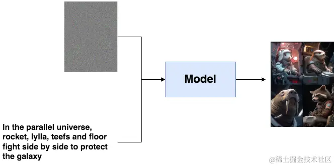

文字描述就像是一个指引(guidance)，帮助模型去产生更符合语义信息的图片。但是，毕竟语义学习是复杂的。**我们能不能先退一步，先让模型拥有产生逼真图片的能力**？

比如说，你给模型喂一堆cyperpunk风格的图片，让模型学会cyperpunk风格的分布信息，然后喂给模型一个随机噪音，就能让模型产生一张逼真的cyperpunk照片。或者给模型喂一堆人脸图片，让模型产生一张逼真的人脸。同样，我们也能选择给训练好的模型喂带点信息的图片，比如一张夹杂噪音的人脸，让模型帮我们去噪。

具备了产出逼真图片的能力，模型才可能在下一步中去学习语义信息(guidance)，进一步产生符合人类意图的图片。**而DDPM的本质作用，就是学习训练数据的分布，产出尽可能符合训练数据分布的真实图片**。所以，它也成为后续文生图类扩散模型框架的基石。

理解DDPM的目的，及其对后续文生图的模型的影响，现在我们可以更好来理解DDPM的训练过程了。总体来说，DDPM的训练过程分为两步：

*   **Diffusion Process (又被称为Forward Process)**
    
*   **Denoise Process（又被称为Reverse Process）**
    

前面说过，DDPM的目的是要去学习训练数据的分布，然后产出和训练数据分布相似的图片。那怎么“迫使”模型去学习呢？

一个简单的想法是，我拿一张干净的图，每一步（timestep）都往上加一点噪音，然后在每一步里，我都让模型去找到加噪前图片的样子，也就是让模型学会**去噪**。这样训练完毕后，我再塞给模型一个纯噪声，它不就能一步步帮我还原出原始图片的分布了吗？

**一步步加噪的过程，就被称为Diffusion Process；一步步去噪的过程，就被称为Denoise Process**。我们来详细看这两步

2.1 Diffusion Process
---------------------

Diffusion Process的命名受到热力学中分子扩散的启发：分子从高浓度区域扩散至低浓度区域，直至整个系统处于平衡。加噪过程也是同理，每次往图片上增加一些噪声，直至图片变为一个纯噪声为止。整个过程如下：

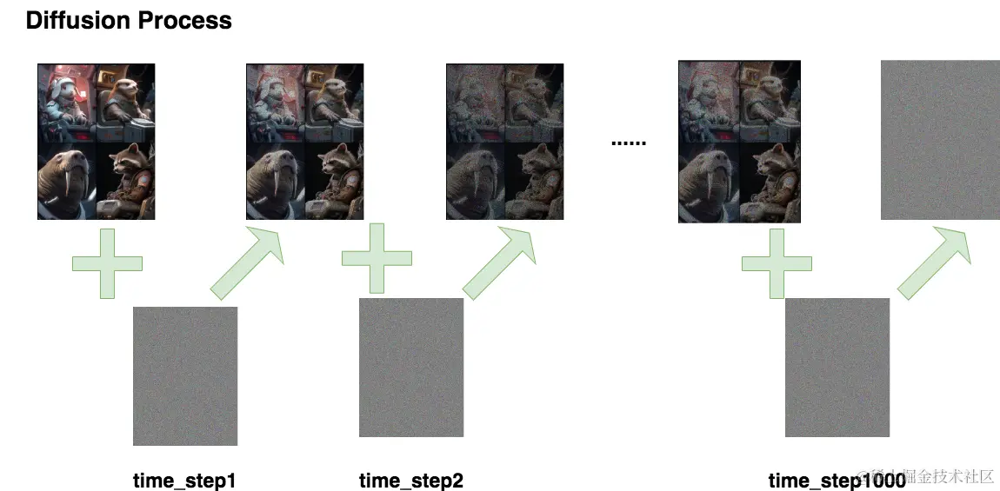

如图所示，我们进行了1000步的加噪，每一步我们都往图片上加入一个高斯分布的噪声，直到图片变为一个纯高斯分布的噪声。

我们记：

*   TT：总步数
    
*   x0,x1,...,xTx\_0, x\_1, ..., x_T：每一步产生的图片。其中x0x_0为原始图片，xTx_T为纯高斯噪声
    
*   ϵ∼N(0,I)\\epsilon \\sim \\mathcal{N}(0, I) ：为每一步添加的高斯噪声
    
*   q(xt∣xt−1)q(x\_t|x\_{t-1})：xtx_{t}在条件x=xt−1x=x_{t-1}下的概率分布。如果你觉得抽象，可以理解成已知xt−1x_{t-1}，求xtx_{t}
    

那么根据以上流程图，我们有：xt=xt−1+ϵ=x0+ϵ0+ϵ1+...+ϵx_{t} = x_{t-1} + \\epsilon = x\_0 + \\epsilon\_{0} + \\epsilon_{1} +... + \\epsilon

根据公式，为了知道xtx_{t}，需要sample好多次噪声，感觉不太方便，能不能更简化一些呢？

### 重参数

我们知道随着步数的增加，图片中原始信息含量越少，噪声越多，我们可以分别给原始图片和噪声一个权重来计算xtx_{t}：

*   αˉ1,αˉ2,...αˉT\\bar{\\alpha}_{1}, \\bar{\\alpha}_{2}, ... \\bar{\\alpha}_{T} **：一系列常数，类似于超参数，随着**TT**的增加越来越小。** 

则此时xtx_t的计算可以设计成：

xt=αˉtx0+1−αˉtϵx\_t = \\sqrt{\\bar\\alpha\_t}x\_0 + \\sqrt{1-\\bar\\alpha\_t}\\epsilon

现在，**我们只需要sample一次噪声，就可以直接从**x0x_0**得到**xtx_t**了**。

接下来，我们再深入一些，其实αˉ1,αˉ2,...αˉT\\bar{\\alpha}_{1}, \\bar{\\alpha}_{2}, ... \\bar{\\alpha}_{T}并不是我们直接设定的超参数，它是根据其它超参数推导而来，这个“其它超参数”指：

*   β1,β2,...βT{\\beta}_{1}, {\\beta}_{2}, ... {\\beta}_{T} **：一系列常数，是我们直接设定的超参数，随着T的增加越来越大**

则αˉ\\bar{\\alpha}和β\\beta的关系为：

αt=1−βt\\alpha\_t = 1 - \\beta\_{t}

αˉt=α1α2...αt\\bar \\alpha\_t = \\alpha\_1\\alpha\_2...\\alpha\_t

这样**从原始加噪到**β，α\\beta，\\alpha**加噪，再到**αˉ\\bar\\alpha**加噪**，**使得**q(xt∣xt−1)q(x\_t|x\_{t-1})**转换成**q(xt∣x0)q(x\_t|x\_{0})**的过程**，就被称为**重参数(Reparameterization)** 。我们会在这个系列的下一篇（数学推导篇）中进一步探索这样做的目的和可行性。在本篇中，大家只需要从直觉上理解它的作用方式即可。

2.2 Denoise Process
-------------------

Denoise Process的过程与Diffusion Process刚好相反：给定xtx_t，让模型能把它还原到xt−1x_{t-1}。在上文中我们曾用q(xt∣xt−1)q(x\_t|x\_{t-1})这个符号来表示加噪过程，这里我们用p(xt−1∣xt)p(x_{t-1}|x_{t})来表示去噪过程。由于加噪过程只是按照设定好的超参数进行前向加噪，本身不经过模型。但去噪过程是真正训练并使用模型的过程。所以更进一步，我们用pθ(xt−1∣xt)p_{\\theta}(x_{t-1}|x_{t})来表示去噪过程，其中θ\\theta表示模型参数，即 **：** 

*   q(xt∣xt−1)q(x\_t|x\_{t-1}) **：**  用来表示Diffusion Process
*   pθ(xt−1∣xt)p_{\\theta}(x_{t-1}|x_{t}) **：**  用来表示Denoise Process。

讲完符号表示，我们来具体看去噪模型做了什么事。如下图所示，从第T个timestep开始，模型的输入为xtx_{t}与当前timestep tt **。**  模型中蕴含一个噪声预测器（UNet），它会根据当前的输入预测出噪声，然后，将当前图片减去预测出来的噪声，就可以得到去噪后的图片。重复这个过程，直到还原出原始图片x0x_{0}为止 **：** 

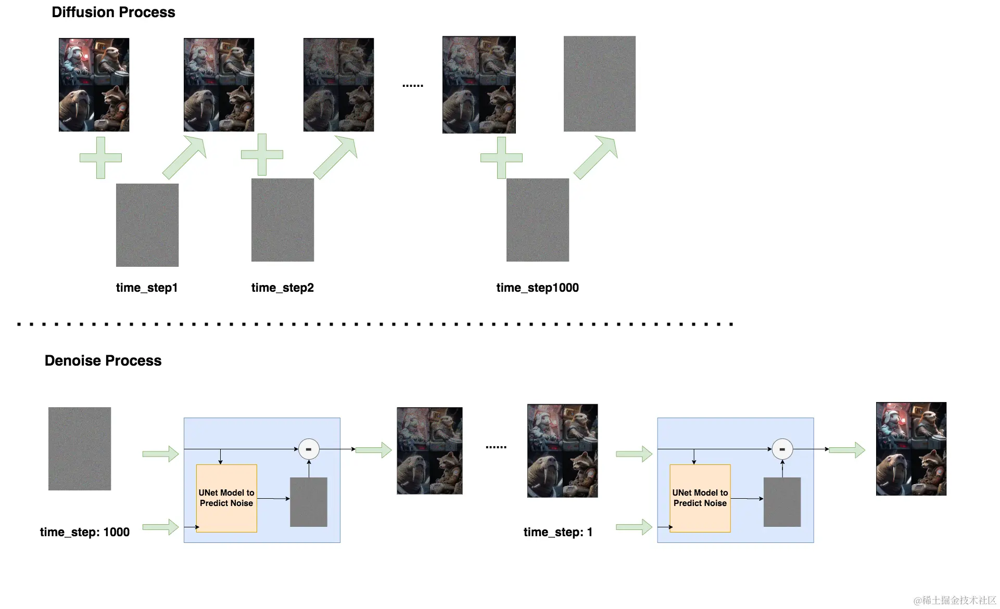

你可能想问：

*   **为什么我们的输入中要包含time_step?**
*   **为什么通过预测噪声的方式，就能让模型学得训练数据的分布，进而产生逼真的图片？**

第二个问题的答案我们同样放在下一篇（数学推理篇）中进行详解。而对于第一个问题，由于模型每一步的去噪都用的是同一个模型，所以我们必须告诉模型，现在进行的是哪一步去噪。因此我们要引入timestep。timestep的表达方法类似于Transformer中的位置编码（可以参考这篇文章），将一个常数转换为一个向量，再和我们的输入图片进行相加。

注意到，UNet模型是DDPM的核心架构，我们将关于它的介绍放在本文的第四部分。

到这里为止，**如果不考虑整个算法在数学上的有效性，我们已经能从直觉上理解扩散模型的运作流程了**。那么，我们就可以对它的训练和推理过程来做进一步总结了。

3.1 DDPM Training
-----------------

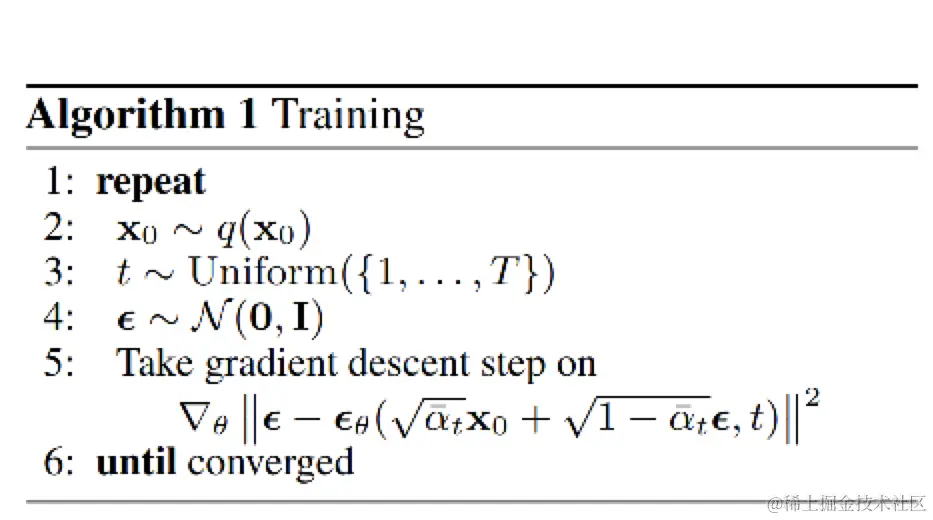

上图给出了DDPM论文中对训练步骤的概述，我们来详细解读它。

前面说过，DDPM模型训练的目的，就是给定time_step和输入图片，结合这两者去预测图片中的噪声。

我们知道，在重参数的表达下，第t个时刻的输入图片可以表示为：

xt=αˉtx0+1−αˉtϵx\_t = \\sqrt{\\bar\\alpha\_t}x\_0 + \\sqrt{1-\\bar\\alpha\_t}\\epsilon

也就是说，第t个时刻sample出的噪声ϵ∼N(0,I)\\epsilon \\sim \\mathcal{N}(0, I) ，就是我们的噪声真值。

而我们预测出来的噪声为：

ϵθ(αˉtx0+1−αˉtϵ,t)\\epsilon_{\\theta}(\\sqrt{\\bar\\alpha\_t}x\_0 + \\sqrt{1-\\bar\\alpha_t}\\epsilon, t)，其中θ\\theta为模型参数，表示预测出的噪声和模型相关。

那么易得出我们的loss为：

loss=ϵ−ϵθ(αˉtx0+1−αˉtϵ,t)loss = \\epsilon - \\epsilon_{\\theta}(\\sqrt{\\bar\\alpha\_t}x\_0 + \\sqrt{1-\\bar\\alpha_t}\\epsilon, t)

我们只需要最小化该loss即可。

**由于不管对任何输入数据，不管对它的任何一步，模型在每一步做的都是去预测一个来自高斯分布的噪声**。因此，整个训练过程可以设置为：

*   从训练数据中，抽样出一条x0x_{0}（即x0∼q(x0)x_{0}\\sim q(x_{0})）
*   随机抽样出一个timestep。（即t∼Uniform(1,...,T)t \\sim Uniform({1,...,T})）
*   随机抽样出一个噪声（即ϵ∼N(0,I)\\epsilon \\sim \\mathcal{N}(0, I) ）
*   计算：loss=ϵ−ϵθ(αˉtx0+1−αˉtϵ,t)loss = \\epsilon - \\epsilon_{\\theta}(\\sqrt{\\bar\\alpha\_t}x\_0 + \\sqrt{1-\\bar\\alpha_t}\\epsilon, t)
*   计算梯度，更新模型，重复上面过程，直至收敛

上面演示的是单条数据计算loss的过程，当然，整个过程也可以在batch范围内做，batch中单条数据计算loss的方法不变。

3.2 DDPM的Sampling
-----------------

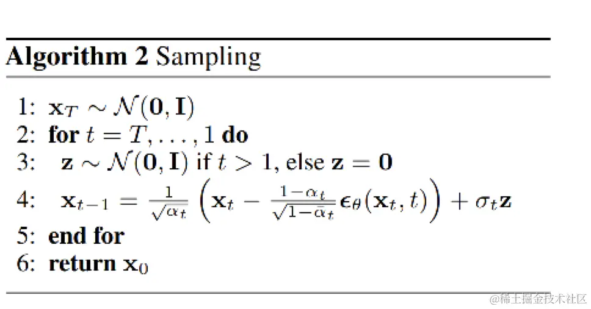

当DDPM训练好之后，我们要怎么用它，怎么评估它的效果呢？

对于训练好的模型，我们从最后一个时刻（T）开始，传入一个纯噪声（或者是一张加了噪声的图片），逐步去噪。根据xt=αˉtx0+1−αˉtϵx\_t = \\sqrt{\\bar\\alpha\_t}x\_0 + \\sqrt{1-\\bar\\alpha\_t}\\epsilon，我们可以进一步推出xtx_t和xt−1x_{t-1}的关系（上图的前半部分）。而图中σtz\\sigma_{t}z一项，则不是直接推导而来的，是我们为了增加推理中的随机性，而额外增添的一项。可以类比于GPT中为了增加回答的多样性，不是选择概率最大的那个token，而是在topN中再引入方法进行随机选择。

关于xtx_t和xt−1x_{t-1}关系的详细推导，我们也放在数学推理篇中做解释。

通过上述方式产生的x0x_0，我们可以计算它和真实图片分布之间的相似度（FID score：Frechet Inception Distance score）来评估图片的逼真性。在DDPM论文中，还做了一些有趣的实验，例如通过“**插值（interpolation）** "方法，先对两张任意的真实图片做Diffusion过程，然后分别给它们的diffusion结果附不同的权重(λ\\lambda)，将两者diffusion结果加权相加后，再做Denoise流程，就可以得到一张很有意思的"混合人脸":

到目前为止，我们已经把整个DDPM的核心运作方法讲完了。接下来，我们来看DDPM用于预测噪声的核心模型：**UNet，到底长成什么样**。我在学习DDPM的过程中，在网上几乎找不到关于DDPM UNet的详细模型解说，或者一张清晰的架构图，这给我在源码阅读过程中增加了难度。所以在读完源码并进行实操训练后，我干脆自己画一张出来，也借此帮助自己更好理解DDPM。

UNet模型最早提出时，是用于解决医疗影响诊断问题的。总体上说，它分成两个部分：

*   Encoder
*   Decoder

**在Encoder部分中，UNet模型会逐步压缩图片的大小；在Decoder部分中，则会逐步还原图片的大小**。同时在Encoder和Deocder间，还会使用“**残差连接**”，确保Decoder部分在推理和还原图片信息时，不会丢失掉之前步骤的信息。整体过程示意图如下，因为压缩再放大的过程形似"U"字，因此被称为UNet：

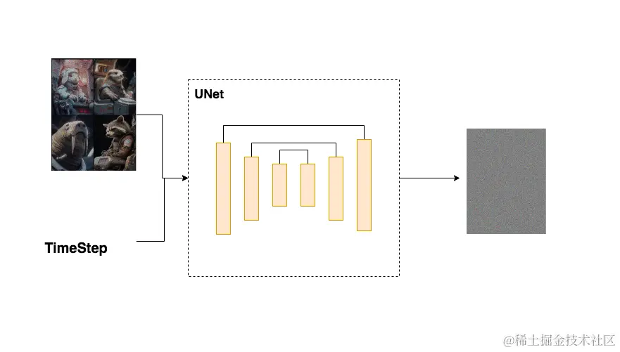

那么DDPM中的UNet，到底长什么样子呢？我们假设输入为一张`32*32*3`大小的图片，来看一下DDPM UNet运作的完整流程：

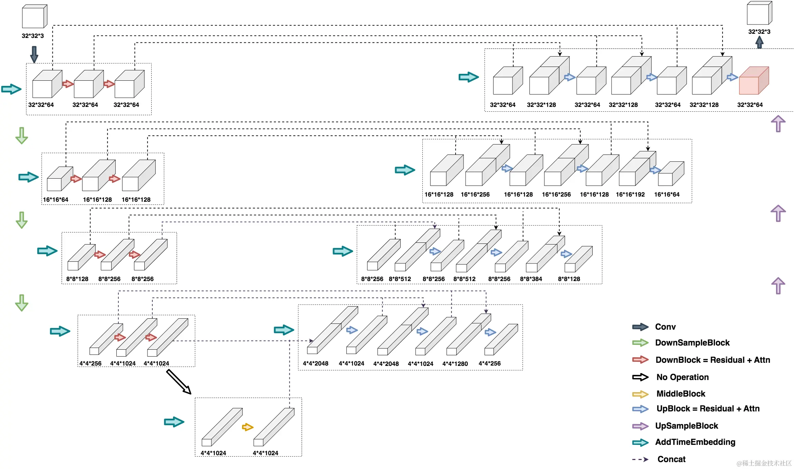

如图，左半边为UNet的Encoder部分，右半边为UNet的Deocder部分，最下面为MiddleBlock。我们以从上往下数第二行来分析UNet的运作流程。

在Encoder部分的第二行，输入是一个`16*16*64`的图片，它是由上一行最右侧`32*32*64`的图片压缩而来(**DownSample)** 。对于这张`16*16*64`大小的图片，在引入time_embedding后，让它们一起过一层**DownBlock，** 得到大小为`16*16*128` 的图片。再引入time_embedding，再过一次DownBlock，得到大小同样为`16*16*128`的图片。对该图片做DowSample，就可以得到第三层的输入，也就是大小为`8*8*128`的图片。由此不难知道，同层间只做channel上的变化，不同层间做图片的压缩处理。至于每一层channel怎么变，层间size如何调整，就取决于实际训练中对模型的设定了。Decoder层也是同理。其余的信息可以参见图片，这里不再赘述。

我们再详细来看右下角箭头所表示的那些模型部分，具体架构长什么样：

4.1 DownBlock和UpBlock
---------------------

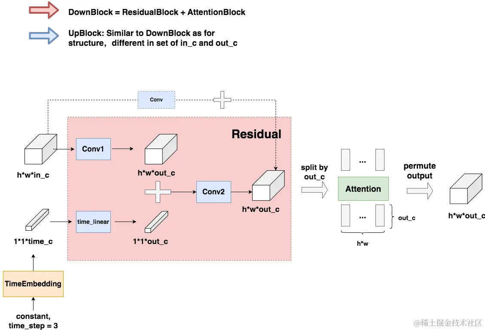

**如果你曾在学习DDPM的过程中，困惑time_embedding要如何与图片相加，Attention要在哪里做，那么这张图可以帮助你解答这些困惑**。TimeEmbedding层采用和Transformer一致的三角函数位置编码，将常数转变为向量。Attention层则是沿着channel维度将图片拆分为token，做完attention后再重新组装成图片（注意Attention层不是必须的，是可选的，可以根据需要选择要不要上attention）。

需要关注的是，**虚线部分即为“残差连接”（Residual Connection）** ，而残差连接之上引入的**虚线框Conv的意思是**，如果in\_c = out\_c，则对in\_c做一次卷积，使得其通道数等于out\_c后，再相加；否则将直接相加。

你可能想问：**一定要沿着channel方向拆分图片为token吗？我可以选择VIT那样以patch维度拆分token，节省计算量吗？** 当然没问题，你可以做各种实验，这只是提供DDPM对图片做attention的一种方法。

4.2 DownSample和UpSample
-----------------------

这个模块很简单，就是**压缩(Conv)** 和**放大(ConvT)** 图片的过程。对ConvT原理不熟悉的朋友们，可以参考[这篇](https://link.juejin.cn/?target=https%3A%2F%2Fblog.csdn.net%2Fsinat_29957455%2Farticle%2Fdetails%2F85558870https%3A%2F%2Fblog.csdn.net%2Fsinat_29957455%2Farticle%2Fdetails%2F85558870 "https://blog.csdn.net/sinat_29957455/article/details/85558870https://blog.csdn.net/sinat_29957455/article/details/85558870")文章。

4.3 MiddleBlock
---------------

和DownBlock与UpBlock的过程相似，不再赘述。

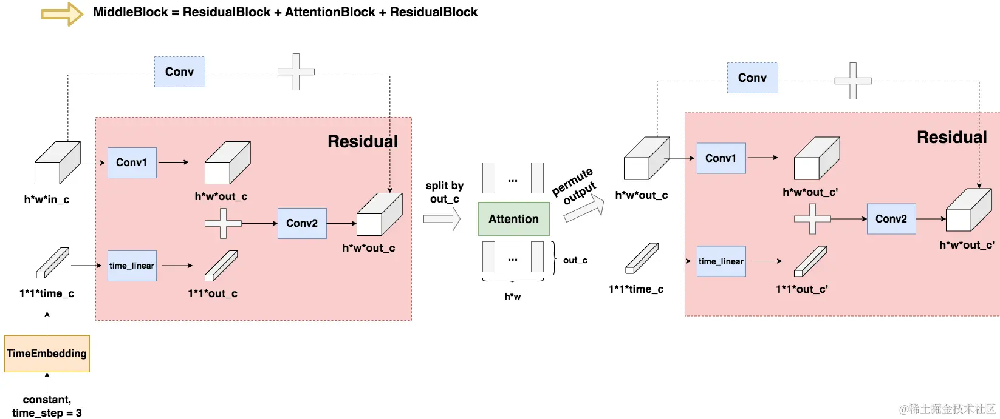

到这一步，我们就把DDPM的模型核心给讲完啦。在第三篇源码解读中，我们会结合这些架构图，来一起阅读DDPM training和sampling代码。

讲完了DDPM，让我们再回到开头，看看最初我们想训练的那个“以文生图”模型吧！

当我们拥有了能够产生逼真图片的模型后，我们现在能进一步用文字信息去引导它产生符合我们意图的模型了。通常来说，文生图模型遵循以下公式（图片来自李宏毅老师课堂PPT）：

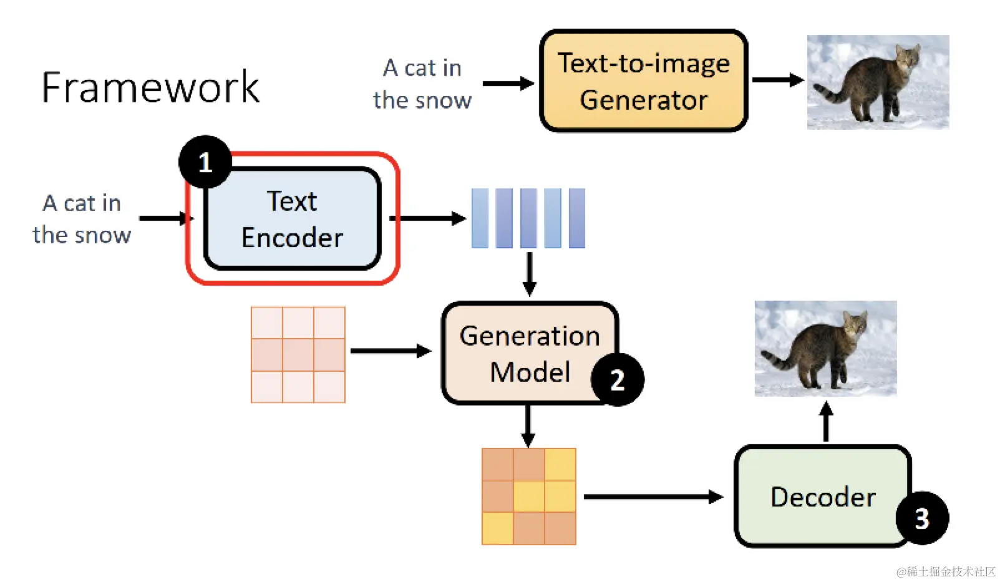

*   **Text Encoder:** 一个能对输入文字做语义解析的Encoder，一般是一个预训练好的模型。在实际应用中，CLIP模型由于在训练过程中采用了图像和文字的对比学习，使得学得的文字特征对图像更加具有鲁棒性，因此它的text encoder常被直接用来做文生图模型的text encoder（比如DALLE2）
    
*   **Generation Model**： 输入为文字token和图片噪声，输出为一个关于图片的压缩产物（latent space）。这里通常指的就是扩散模型，采用文字作为引导（guidance）的扩散模型原理，我们将在这个系列的后文中出讲解。
    
*   **Decoder：**  用图片的中间产物作为输入，产出最终的图片。Decoder的选择也有很多，同样也能用一个扩散模型作为Decoder。
    

5.1 DALLE2
----------

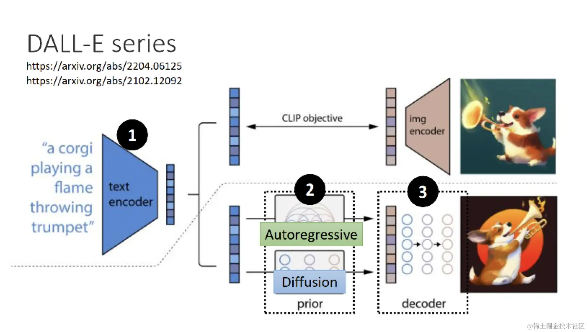

DALLE2就套用了这个公式。它曾尝试用Autoregressive和Diffusion分别来做Generation Model，但实验发现Diffusion的效果更好。所以最后它的2和3都是一个Diffusion Model。

5.2 Stable Diffusion概述
----------------------

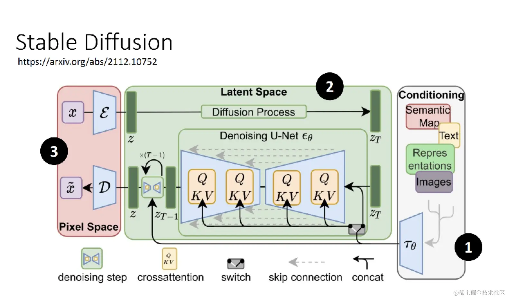

大名鼎鼎Stable Diffsuion也能按这个公式进行拆解。

5.3 Imagen
----------

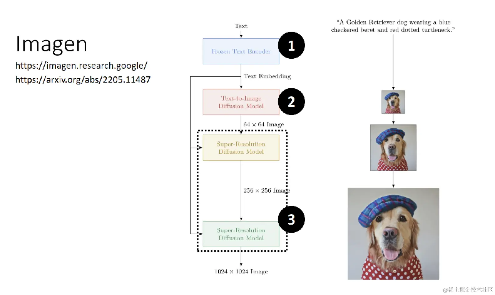

Google的Imagen，小图生大图，遵循的也是这个公式

按这个套路一看，是不是文生图模型，就不难理解了呢？我们在这个系列后续文章中，也会对这些效果惊艳的模型，进行解读。

1、[arxiv.org/abs/2006.11…](https://link.juejin.cn/?target=https%3A%2F%2Farxiv.org%2Fabs%2F2006.11239 "https://arxiv.org/abs/2006.11239")

2、[arxiv.org/abs/2204.06…](https://link.juejin.cn/?target=https%3A%2F%2Farxiv.org%2Fabs%2F2204.06125 "https://arxiv.org/abs/2204.06125")

3、[arxiv.org/abs/2112.10…](https://link.juejin.cn/?target=https%3A%2F%2Farxiv.org%2Fabs%2F2112.10752 "https://arxiv.org/abs/2112.10752")

4、[arxiv.org/abs/2205.11…](https://link.juejin.cn/?target=https%3A%2F%2Farxiv.org%2Fabs%2F2205.11487 "https://arxiv.org/abs/2205.11487")

5、[speech.ee.ntu.edu.tw/~hylee/ml/m…](https://link.juejin.cn/?target=https%3A%2F%2Fspeech.ee.ntu.edu.tw%2F~hylee%2Fml%2Fml2023-course-data%2FStableDiffusion%2520(v2).pdf "https://speech.ee.ntu.edu.tw/~hylee/ml/ml2023-course-data/StableDiffusion%20(v2).pdf")

6、[speech.ee.ntu.edu.tw/~hylee/ml/m…](https://link.juejin.cn/?target=https%3A%2F%2Fspeech.ee.ntu.edu.tw%2F~hylee%2Fml%2Fml2023-course-data%2FStableDiffusion%2520(v2).pdf "https://speech.ee.ntu.edu.tw/~hylee/ml/ml2023-course-data/StableDiffusion%20(v2).pdf")

7、[github.com/labmlai/ann…](https://link.juejin.cn/?target=https%3A%2F%2Fgithub.com%2Flabmlai%2Fannotated_deep_learning_paper_implementations%2Ftree%2Fmaster%2Flabml_nn%2Fdiffusion "https://github.com/labmlai/annotated_deep_learning_paper_implementations/tree/master/labml_nn/diffusion")