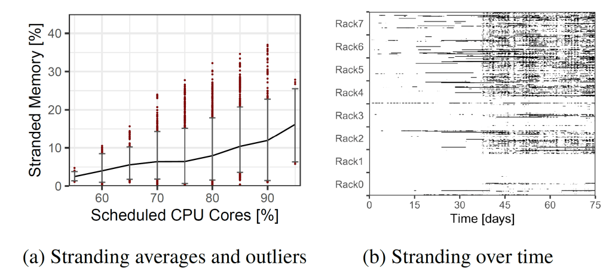

# CXL Enables Microsoft Azure To Cut Server Capital Expenditures By Hundreds Of Millions Of Dollars
[CXL Enables Microsoft Azure To Cut Server Capital Expenditures By Hundreds Of Millions Of Dollars](https://www.semianalysis.com/p/cxl-enables-microsoft-azure-to-cut) 

 CXL (Compute Express Link) is going to be a transformative technology that will redefine how the datacenter is architected and built. This is because CXL provides a standardized protocol for cache coherency across chips, memory expansion, and memory pooling. In this article we are going to focus on what Microsoft has presented they are doing, but you can learn more detail about the topic in this article we wrote on [Marvell’s purchase of Tanzanite Silicon and competition in memory accelerators from Astera Labs and Rambus](https://semianalysis.substack.com/p/marvell-acquires-tanzanite-silicon?s=w). We also did a [podcast](https://open.spotify.com/show/0HTOH7h5iw9ixmBxR6OQVD) with [Fabricated Knowledge](https://www.fabricatedknowledge.com/p/cxl-protocol-for-heterogenous-datacenters) on CXL and Backside Power Delivery Network which is available on [Spotify](https://open.spotify.com/show/0HTOH7h5iw9ixmBxR6OQVD), [Apple](https://podcasts.apple.com/us/podcast/transistor-radio/id1607558815), [Google](https://podcasts.google.com/feed/aHR0cHM6Ly9hbmNob3IuZm0vcy83Yjg2ZTU1NC9wb2RjYXN0L3Jzcw/episode/NDhmZmQxNmUtMzdjNC00ZmI4LWJkOTktMWE3ZWE4MDExZDA0?sa=X&ved=0CAUQkfYCahcKEwjIp-WLkuX4AhUAAAAAHQAAAAAQAQ), and [RSS](https://anchor.fm/s/7b86e554/podcast/rss).

Datacenters are an incredibly expensive affair. Microsoft stated that up to **50% of their server costs is from DRAM alone**. The capital expenditures required are massive, but the servers you build out with are not a homogenous blob. Workloads are not static. They are constantly growing and evolving. The mix of types of computational resources, DRAM, NAND, and networking will shift based on the workloads.

A one size fits all model does not work, which is why you see cloud providers with dozens if not hundreds of different instance types. These are trying to optimize offerings of hardware to differing workloads. Even then, many users end up paying for things they really don’t need.

> Our results show that 50% of all VMs never touch 50% of their rented memory.

Instance choices are not perfect, nor is the matching of those instances to hardware. In comes the issue of platform level memory stranding. Servers are configured for pessimistic instance type scenario.

> At Azure, we find that a major contributor to DRAM inefficiency is platform-level memory stranding. Memory stranding occurs when a server’s cores are fully rented to virtual machines (VMs), but unrented memory remains. With the cores exhausted, the remaining memory is unrentable on its own, and is thus stranded. Surprisingly, we find that up to **25% of DRAM may become stranded at any given moment**.

The solution to this problem is memory pooling. Multiple servers can share a portion of memory and it can be dynamically allocate it to various servers. Instead of pessimistically configuring servers, they can instead be provisioned with closer to average DRAM-to-core ratios, and the excess DRAM requirements of customers can be tackled with a memory pool. This memory pool would communicate over the CXL protocol. In the future, with revisions to the CXL protocol, the servers could even share the same memory to work on the same workload which would further reduce DRAM demand. We detailed hardware solutions from [Marvell, Astera Labs and Rambus](https://semianalysis.substack.com/p/marvell-acquires-tanzanite-silicon?s=w) that enables pooling which will come next year.

A sophisticated operator with large scale applications could deal with this by offering their developers multiple tiers of memory with varying bandwidth and latency. This is not tenable for the public cloud environment that Amazon, Google, Microsoft, and others operate in.

> To achieve the most DRAM savings, public cloud providers would prefer to hide the additional latency from (1) the vast majority of customers who are not expert developers and (2) workloads that do not manage memory placement and performance explicitly.

Microsoft outlined 3 major functional challenges with regards to memory pooling in a public cloud environment. The customer workloads cannot be modified, including the guest OS. The system of pooling memory must also be compatible with virtualization acceleration techniques such as direct I/O device assignment to VMs and SR-IOV. The pooling must also be available with commodity hardware.

Memory pooling has attempted in the past, but it required custom hardware designs, changes to the VM guests, and relied on page faults. The combination made it something that could not be deployed in the cloud. This is where CXL comes in. Intel, AMD, and multiple Arm partners have already joined the standard. CPUs with CXL will start coming out later this year and on. Furthermore, all 3 major DRAM manufacturers, Samsung, Micron, and SKHynix have committed to supporting the standard as well.

Even with broad based support from hardware vendors, there are a lot of questions to be answered. On the hardware side: how should the memory pools be constructed and how do you balance pool size with higher latency of larger pools? On the software side: how are these pools managed and exposed pool to guest OSes, how much additional memory latency can cloud workloads tolerate? On the distribution layer: how should a provider schedule VMs on machine with CXL memory, what items in memory should be stored in the pool versus direct attached memory, could they predict memory behavior and latency sensitivity help produce better performance, if so, how accurate are these predictions?

Microsoft asked these questions and also attempted to answer them. We will give an overview of their findings here. Their 1st generation solution architecture has quite impressive results.

> \[1st generation memory\] disaggregation can achieve a 9 – 10% reduction in overall DRAM, which represents hundreds of millions of dollars in cost savings for a large cloud provider.

These gains could be extended further as future CXL versions come out and latency is driven lower.

First on the hardware layer. Microsoft tested this with multi-ported external memory directly connected to 8 to 32 socket CPUs. The memory expansion is done with a CXL attached external memory controller (EMC) which has four 80-bit ECC DDR5 channels of pool DRAM and multiple CXL links to allow multiple CPU sockets to access the memory. This EMC manages requests and tracks ownership of various regions of memory assigned to various hosts.

The bandwidth of x8 lanes of CXL is approximately that of a DDR5 memory channel. Each CPU has its own faster local memory, but it also has access to the CXL pooled memory which has higher latency, equivalent to a single NUMA hop. The increase in latency breaks out to 67ns to 87ns across a CXL controller and PHY, optional retimer, propagation delay, and the external memory controller.

The following chart shows a fixed percentages of the current local DRAM (10%, 30%, and 50%) is switched over to a pooled resource. The larger the percentage of pooled memory versus local memory, the more DRAM is saved. Increasing the number of sockets asymptotes out in terms of DRAM savings very quickly.

While larger pool sizes and more sockets seems to look like the best option, there are more performance and latency implications here. If the pool size is relegated to 4 to 8 CPU sockets, the retimer would not be required. This brinks latency down from 87ns to 67ns. Additionally, in these smaller socket counts, the EMC can be directly connected to all CPU sockets.

The larger pools of 32 sockets would have EMCs connected to differing subsets of CPUs. This would enable sharing across a larger number of CPU sockets while keeping the number of EMC device to CPU ports fixed. The retimer is required here which contributed to 10ns of latency in each direction.

On the software side, the solution is quite ingenious. Microsoft often deploys multi-socket systems. In most cases, the VMs are small enough that they just fit on a single NUMA node entirely, cores and memory. The hypervisor at Azure attempts to place all core and memory on a single NUMA node, but In some rare cases (2% of the time), a VM has a portion of resources spanning across the socket. This is not exposed to users.

Memory pooling would functionally work the same way. The memory device would be exposed as a zero-core virtual zNUMA node with no cores, only memory. The memory is biased away from this zNUMA memory node, but spillover is allowed. The granularity is per 1GB slice of memory.

The distributed system software layer relies on predictions about a VM’s memory latency sensitivity. Untouched memory is called “frigid memory.” Azure estimates that the 50th percentile of VMs have 50% frigid memory. That number seems quite round. VMs that are predicted to be insensitive to memory latency are backed entirely to the pool DRAM. Memory sensitive VMs are provisioned with a zNUMA node for only their frigid memory. The predictions are done at the deployment time of a VM, but it is asynchronously managed and changes a VMs placement when it detects its prediction was incorrect.

The accuracy of these algorithms is critical to saving on infrastructure cost. If done incorrectly, the performance impact could be huge.

Moving cloud residents’ memory to a pool that is 67ns to 87ns away is quite bad given potential performance impact could be huge.

As such, Microsoft benchmarked 158 workloads under two scenarios. One was the control with only local DRAM. The other was with a emulated CXL memory. It should be stressed that no CXL platforms exist to date despite Intel’s earlier claims that their Sapphire Rapids CXL enabled platform would launch in late 2021. Or the claims that Sapphire Rapids would launch in early 2022. As such Microsoft had to simulate the latency impact. Microsoft used a 2 socket 24C Skylake SP system.

The memory access latency was measured at 78ns when bandwidth exceeded 80GB/s. When a CPU accessed another CPU’s memory across NUMA boundries, that resulted in an additional 64ns of memory latency. This is very close to the 67ns of additional latency that the external memory device (EMC) would have in low socket count systems.

20% of workloads experience no performance impact. An additional 23% of workloads experienced less than 5% slowdowns. 25% of workloads suffered sever slowdowns with a >20% hit to performance of which, 12% even saw >30% performance degradation. This figure changes quite a bit depending on the amount of local versus pool memory depending on the workload.

This further emphasizes the importance of the prediction model. Microsoft’s random forest ML-based prediction model is more accurate and generates fewer false positive slowdowns. The more becomes more important as more memory is pooled.

> Our results showed that a first-generation memory disaggregation can reduce the amount of needed DRAM by 9-10%. This translates into an overall reduction of 4-5% in cloud server cost.

The possibilities of savings from memory pooling could grow to double digit percentages of cloud server cost as the CXL specification improves, latency can be lowered, and the prediction model improves. Check out the [paper](https://arxiv.org/pdf/2203.00241.pdf) as it has more details than we provided here.

[Leave a comment](https://www.semianalysis.com/p/cxl-enables-microsoft-azure-to-cut/comments)

[Share](https://www.semianalysis.com/p/cxl-enables-microsoft-azure-to-cut?utm_source=substack&utm_medium=email&utm_content=share&action=share&token=eyJ1c2VyX2lkIjoxMDcwMTAwNDUsInBvc3RfaWQiOjYyOTkzNDA4LCJpYXQiOjE3MzAyMDIwMjQsImV4cCI6MTczMjc5NDAyNCwiaXNzIjoicHViLTMyOTI0MSIsInN1YiI6InBvc3QtcmVhY3Rpb24ifQ.1f7T-X-5hGGMwAsj28kGWP5SnCZKQ7xl1TaxmkOnVwI)