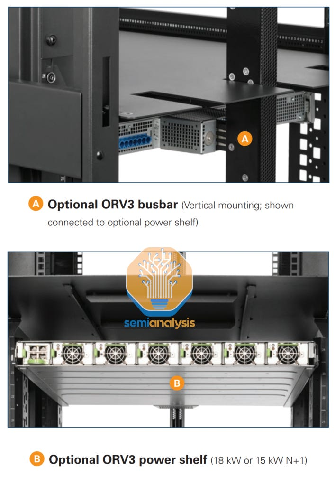

# Datacenter Anatomy Part 1: Electrical Systems
[Datacenter Anatomy Part 1: Electrical Systems](https://substack.com/inbox/post/149247130) 

 The Datacenter industry has been a critical industry for many years, but now it is experiencing unprecedented acceleration due to its important role in national security and future economic growth, all being driven by massive demand for AI training and inference. The surge in power demand triggered by AI has huge macro and micro implications and supply is tight.

Over the past few years, the industry has been inching towards adoption of key systems enabling higher power density that is essential for AI applications in a haphazard fashion. This push was led mainly by smaller players offering their own new designs to accommodate AI without sign on from Nvidia who was slow to adopt liquid cooling versus Google. No industry standards emerged during these years.

This all changes with the upcoming Blackwell ramp. Nvidia’s [GB200 family](https://www.semianalysis.com/p/gb200-hardware-architecture-and-component) requires direct to chip liquid cooling and has up to 130kW rack power density delivering ~9x inference and ~3x training performance improvements over the H100. Any datacenter that is unwilling or unable to deliver on higher density liquid cooling will miss out on the tremendous performance TCO improvements for its customers and will be left behind in the Generative AI arm’s race.

Blackwell has standardized the requirements and now suppliers and system designers have a clear roadmap for AI datacenter development leading to a massive shift in datacenter systems and components winners / losers.

These design shifts have already caused considerable impact. For example, Meta demolished an entire building under construction because it was their old datacenter design with low power density which they have used for many years. Instead they replaced it with their brand new AI-Ready design! Most datacenter designs are not ready for GB200, and Meta in particular has by far the lowest power density in their DCs compared to the other hyperscalers.

In this report, Datacenter Anatomy Part 1 – Electrical Systems, we’ll dig into the electrical system of AI Datacenters and explore how [Gigawatt clusters](https://www.semianalysis.com/p/multi-datacenter-training-openais) will impact traditional supply chains. We’ll discuss key equipment suppliers such as Vertiv, Schneider Electric, and Eaton and the impact of AI on their business. We show our Datacenter Bill-of-Materials estimate and derive a CapEx by component forecast for the industry.

Future reports will explore facility cooling systems, upcoming server cooling technologies such as Immersion, and dig into hyperscaler designs. This report is based on our work tracking 200+ datacenter-related suppliers and modelling market shares per product and a bottom-up TAM for new key technologies, such as liquid cooling. In addition, we have the most detailed top-down estimate of the market via a [semiconductor-based SKU-by-SKU demand forecast and a building-by-building Datacenter capacity forecast up to 2030](https://www.semianalysis.com/p/datacenter-model).

A Datacenter is a purpose-built facility designed to deliver power to IT Equipment in an efficient and safe manner and deliver the lowest possible total cost of ownership over the life of the IT hardware. The IT equipment is generally laid out in racks filled with servers, networking switches and storage devices. Running these devices can require vast amounts of power and generate a lot of heat.

Thirty years ago, these facilities resembled office buildings with beefed-up air conditioning, but the scale has massively increased since with consumers today watching billions of hours of YouTube videos, Netflix shows, and Instagram stories. This triggered deep changes in the way datacenters are built, as modern facilities can require >50x the amount of electricity per square foot compared to a typical office building, and facilitating heat dissipation for these servers calls for fundamentally different cooling infrastructure.

With such scale, any outage caused by a datacenter issue can incur significant revenue losses and harm the operator’s reputation, whether it be a Cloud Service Provider (CSP) such as Azure and AWS, or a Colocation operator (Datacenter Real Estate). Ensuring a high uptime ensures more revenue, and that largely comes down to having a reliable electrical and cooling system inside. Electrical faults, while more common, tend to have a smaller “blast radius” and are typically less disruptive than cooling failures.

A useful framework to evaluate Datacenters based on expected downtime and redundancy is the “[Tier” Classification from the Uptime Institute](https://uptimeinstitute.com/tiers), or the ANSI/TIA-942 standard (based on the Uptime’s Tiers), with the following four rating levels in the diagram below.

“Rated 3” datacenters (and equivalent standards) are the most common globally for large facilities, and always require backup power redundancy for IT equipment. When talking about redundancy, we use terms such as “N”, “N+1” or “2N”. For example, if a datacenter needs ten transformers, N+1 means buying eleven units in total, of which ten are operational and one redundant, while 2N would require purchasing 20 transformers.

Rated 3 facilities must be “concurrently maintainable” and typically call for N+1 redundancy in components like transformers and generators, and 2N on power distribution components – uninterruptible power supply (UPS) and power distribution unit (PDU). Rated 4 datacenters are less common and must be “fault tolerant” - commonly for mission critical or government datacenter facilities.

As a side note, CSPs often talk about “three nines” (99.9%) or “five nines” (99.999%) expected availability – this is part of their Service Level Agreement with clients and covers the service’s uptime, which is broader than just a single datacenter’s expected availability. Multiple Datacenters are covered (“Availability Zones”) and the uptime of components such servers and networking are included.

There are many shapes and sizes of Datacenters, and we usually categorize them based on their Critical IT power capacity (i.e. max power of IT equipment), in Kilowatts. This is because in the colocation business, operators lease empty racks and price it on a “IT kW-per-month” basis. Space in a datacenter is far less costly than the electrical and cooling equipment involved to power a client’s server.

Whereas Critical IT Power refers to the maximum power of the IT equipment, the actual draw from the power grid will include non-IT load such as cooling and lighting, as well as a Utilization rate factor. On average, Power Utilization rate is typically 50-60% for Cloud Computing workloads, and north of 80% for AI training. Enterprises are often even lower than 50%.

We categorize facilities into three major brackets:

**Retail Datacenters** : small facilities with a lower power capacity – at most a few Megawatts, but typically located within cities. They generally have many small tenants who only lease a few racks (i.e. a few kW). The value proposition lies in offering a strong network ecosystem by bringing together many different customers within the same facility. By offering easy interconnection to other customers and networks with low latency, operators of retail datacenters can lower customers’ networking costs. Thus, the business model of a retail datacenter operator is more akin to a traditional real estate play with its “location, location, location” value proposition.

Source: Google Earth ([Here](https://maps.app.goo.gl/1wjdyskh9hbjRvsU6))

**Wholesale Datacenters**: larger facilities in the range of 10-30MW. Customers in these facilities tend to lease larger areas, i.e. a whole row or multiple rows, and with the option to further expand. In contrast to retail datacenters, the value proposition is about deploying larger capacities and having scalability over time. Many wholesale datacenters are built out in phases to attain their ultimate capacity, which means they can expand as customers’ demanded leading capacity grows. Below is an example owned by Digital Reality.

Source: Google Earth ([Here](https://maps.app.goo.gl/QPR9PvL7xTT3g5yk7))

**Hyperscale Datacenters**: These facilities are commonly self-built by hyperscalers for their own exclusive use, typically with individual buildings of 40-100MW each, and part of larger campuses with multiple interconnected buildings. Such campuses are rated in the 100s of MW, such as the below Google site with close to 300MW of power. Big Tech firm can also engage a colocation provider to construct a “build-to-suit” datacenter that will be built to the specifications of the hyperscaler, then leased out to the hyperscaler. Build to suit lease sizes north of 100MW are increasingly common.

We can also segment datacenters based on their operator: **Colocation** or **Self-Build**.

Colocation is simply renting datacenter capacity in units of power ($/kW/mth) from a third-party datacenter operator. A typical small size tenancy is 100-500kW of Critical IT Power, while wholesale sized tenancies would typically range from 1-5 MW. Hyperscale clients usually lease in sizes greater than 5 MW, and sometimes in the 100s of MW when leasing a full campus!

This can help hyperscalers be more efficient with capital by not having to pay the Capex up front and deal with many of the logistics. Hyperscalers also use arrangements in between leasing build-to-suit and self-build – for example they can lease a “warm shell” which has secured a ready connection to utility power, but with the hyperscaler building out their own Mechanical and Electrical infrastructure within the leased shell.

On the other hand, Self-Build datacenters are built privately by companies for their exclusive us. This was historically carried by large companies in sectors with sensitive data such as finance, payments, healthcare, government, energy - for example, JPMorgan or Verizon. The design of these datacenters is very heterogeneous, but power capacity per facility generally falls between that of Retail and Wholesale datacenters. 

But by far the most impactful trend in the datacenter market over the last 10 years has been the rise of Self-Build Hyperscale datacenters, largely driven by the rise of cloud computing and social media platforms running [increasingly powerful recommendation models](https://www.semianalysis.com/i/114314781/the-largest-at-scale-ai-model-architecture-dlrm) and content delivery, among other workloads. As mentioned above, Hyperscalers can also take up colocation capacity. Common reasons to do so are for markets where they do not have the scale or local market knowledge to do self-build or do not have local teams capable of executing complex projects, or as means to grow their total capacity faster. Hyperscalers also have requirements for smaller scale deployments closer to the end customers, for purposes such as network edge, content delivery networks (CDN) where colocation would is more appropriate.

To give a bit of perspective on the power requirements of Hyperscale campuses, an average home in the US can draw up to 10kW of power at a given time, but actual average load is about 9x lower, at 1.214kW. Therefore, the annual electricity consumption of a 300MW Datacenter Campus is easily equivalent to that of ~200,000 households, given higher power utilization rate.

The table from our previous [Datacenter deep dive](https://www.semianalysis.com/p/ai-datacenter-energy-dilemma-race) should also help you relate those capacity numbers to AI deployments: a 20,840 Nvidia H100 cluster requires a datacenter with ~25.9MW of Critical IT Power capacity. This is still set to rise tremendously, as people are now building [100,000 H100 clusters](https://www.semianalysis.com/p/100000-h100-clusters-power-network) and [Gigawatt clusters](https://www.semianalysis.com/p/multi-datacenter-training-openais).

Now that we’ve covered the basic categories, let’s look at how we get power into these facilities.

We’ll start with a very simplified layout to understand how these facilities are designed. The goal is to deliver high amounts of power to racks filled with IT Equipment, placed in rooms called Data Halls. Doing that efficiently and safely while ensuring hardware lifetime requires a lot of equipment.

To minimize power distribution losses, we want to keep voltage as high as possible until being physically close to the end device – higher voltage means lower current, and power loss is proportional to the square of current (Ploss \= I2R).

But high voltage can be dangerous and requires more insulation, which isn’t suitable near a building – therefore Medium Voltage (e.g. 11kV or 25kV or 33kV) is the preferred solution for power delivery into the building. When getting inside the data hall we need to step down that voltage again, to Low Voltage (415V three-phase in the US).

From the outside-in, power follows the following path:

Source: DEAC

*   The utility delivers either High Voltage (>100kV) or Medium Voltage power. In the former case, an on-site substation with power transformers is required to step it down to Medium Voltage (MV).
    
*   MV power will then be safely distributed using MV switchgear into another Transformer, physically near the data hall, stepping down voltage to Low Voltage (415V).
    
*   Paired with a transformer is a Diesel Generator that also outputs at 415V AC. If there is an outage from the electrical utility, an Auto Transfer Switch (ATS) will automatically switch power to the generator.
    

From here - there are then two power paths: one towards the IT Equipment, and the other cooling equipment:

*   The IT Equipment path first flows through a UPS system, which is connected to a bank of batteries: it is common to have 5-10min of battery storage, enough time for the generators to turn on (within a minute) and avoid a temporary outage.
    
*   The “UPS Power” is then supplied directly to IT Equipment, generally via Power Distribution Units (PDUs).
    
*   The last step is delivering electricity to the chip, via Power Supply Units (PSU) and Voltage Regulator Modules (VRM), which we covered [here](https://www.semianalysis.com/p/energizing-ai-power-delivery-competition).
    

This diagram of course can vary dramatically based on the capacity of the Datacenter, but the general idea and power flows remains the same.

Modern Hyperscale datacenters are of course more complex than the diagram shown above. Such campuses typically have an on-site high-voltage electrical substation, such as the Microsoft site shown below, or the above Google complex.

Source: Google Earth, SemiAnalysis

Given the need for >100MW in a dense location, these facilities will typically be placed near High Voltage (HV) transmission lines (138kV or 230kV or 345kV). These lines can carry much more power than distribution lines at Medium Voltage (MV) - in some areas, regulators impose a maximum power draw based on the voltage level of power lines. Therefore, hyperscalers will require an on-site substation to step down voltage from HV to MV. If there is no pre-existing substation with HV Transformers, the datacenter operator either self-builds or funds the utility to build one.

These transformers are rated in MVA: an MVA is roughly equivalent to a MW, but MVA can is “apparent power” (simply voltage \* current), while a MW is the “real” power; and MW is lower because of the [Power factor](https://en.wikipedia.org/wiki/Power_factor), which reflects inefficiencies in an AC power distribution system. A 5% difference is typical, but to have a cushion, datacenter operators often provision for a 10% power factor.

Typical High Voltage Transformers are rated between 50 MVA and 100 MVA: for example, a Datacenter campus requiring 150MW of peak power could use two 80 MVA transformers, or three for N+1 redundancy to cover an eventual failure - each stepping down voltage from 230kV to 33kV and increasing current from ~350 amps to ~2500 amps. In such an N+1 configuration, all three transformers would share the load, but run at 2/3 of their rated capacity to detect any infant mortality (i.e. failure upon initial activation) and avoid deterioration that can occur on completely unused transformers. It is important to note that HV transformers are generally custom-made as each transmission line has its own characteristics, and therefore tend to have long lead times (>12mo). To alleviate the bottleneck, datacenter operators can preorder them as part of their planning process.  

Despite being a core piece of our electrical transmission system, transformers are very simple devices: they change the voltage and current of Alternating Current (AC) power from one level to another. This century-old technology works because electrical current produces a magnetic field – and AC produces a continuously changing magnetic field.

Source: The Engineering Mindset

Two copper coils are placed next to each other – when a portion of a wire is wound closely together, it creates a strong magnetic field. Placing two such coils nearby with AC will transfer power from one to the other via [magnetic induction](https://en.wikipedia.org/wiki/Electromagnetic_induction). In this process, while total power remains the same, we can change voltage and current by changing the characteristics of the wire.

If the secondary coil has less “turns” than the primary coil, power will be transferred at a lower voltage and higher current – this is an example of a step-down transformer.

Source: GeeksforGeeks

The two major components of a transformer are copper for the coils, and steel for the “transformer core” whose role is to facilitate the transfer of energy. When dissecting the shortage of transformers, the issue is generally the latter: a specific type of steel is required, called GOES (Grain Oriented Electrical Steel), for which the number of manufacturers is limited.

Back to Datacenters and our power flow: we now have medium voltage power at one of 11kV, 25kV or 33kV (depending on the cluster configuration and location) and want to send that power to IT racks. Modern datacenters are built in a modular fashion, and the following Microsoft Datacenter is a perfect example.

Source: Google Earth, SemiAnalysis

A building is generally broken down into multiple Data Halls (blue rectangle)– a Data Hall is simply a room in which we place servers. In the above example, we believe that each building (~250k square foot) has a Critical IT capacity of 48MW, and is divided into five data halls per building, meaning 9.6MW per data hall.

Inside a Data Hall are located multiple “Pods”, and each Pod runs off its own dedicated set of Electrical Equipment: generators (orange rectangle), transformers (green rectangle), UPS and switchgear. In the above picture, we can see four generators and transformers per Data Hall. There are also four Pods per hall, which also means four low voltage Switchboards, and eight UPS systems assuming 2N distribution redundancy.

Source: Legrand

Data Halls are typically broken into Pods for two reasons.

*   Modularity: a facility can progressively and quickly scale up to accommodate a higher load.
    
*   Standardization: a Pod’s size is designed to match the most standardized (i.e. cheap and readily available) electrical equipment. In the Microsoft example, we see multiple 3MW generators and 3MVA Transformers – these sizes are widely used across many industries and make procurement a lot easier than larger lower volume more custom ones. The most common pod sizes are 1600kW, 2MW and 2.5MW, though theoretically any pod size is possible.
    

After stepping down from High Voltage (i.e. 115kV or 230kV etc) down to Medium Voltage (MV) (i.e. 33kV, 22kV or 11kV etc) with the help of a HV Transformer, we use Medium Voltage switchgear to distribute this medium voltage power near individual pods. Typical IT equipment like servers and networking switches can’t run on 11kV, so before getting power inside a data hall, we need another set of Medium Voltage (MV) transformers, generally 2.5 MVA or 3 MVA, to step down from MV (11kV/25kV/33kV) to LV (415V a common voltage in the US).

The diagram below helps to illustrate a typical HV and MV distribution: how power is stepped down from HV to MV then distributed by MV Switchgear generally placed either outside or inside the facility and configured such that each data hall can be supplied by two different power sources, leaving no single point of failure.

Source: Schneider Electric

Medium Voltage switchgear is a factory-assembled metal enclosure filled with equipment to distribute, protect and meter power.

Source: Eaton

Inside these enclosures you will find the following devices:

*   [Circuit breakers](https://en.wikipedia.org/wiki/Circuit_breaker): an electrical safety device designed to interrupt current when it is running too high and prevent fire.
    
*   Metering components and relays.
    
*   A current transformer and a voltage transformer: they work in tandem with the breakers and the metering equipment.
    
*   A switch to turn the power on or off.
    
*   Medium voltage cables.
    

Source: Schneider Electric

As discussed above, Medium Voltage (MV) switchgear will route the MV power at 33kV or 22kV or 11kV to MV transformers. At this point, we are now physically very close the actual IT racks: while current is much higher (4000-5000A), power losses from LV cables won’t be very high. Power is then distributed by LV (Low voltage) Switchgear – this is a factory–assembled enclosure very similar to the above MV unit, and again filled with equipment to protect (breakers), meter and distribute electrical power.

Alongside every LV transformer is a generator that matches the power rating of the transformer and will step in in the event of a failure of the transformer or power supply upstream from the transformer. An Automatic Transfer Switch (ATS), usually a component of the LV switchgear, is used to automatically switch to the generators (2-3MW per unit in hyperscale campuses) as the main power source should this happen.

For context, a 3 MW generator has a horsepower north of 4,000, similar to a locomotive engine, and it is common to find 20 or more such units in a hyperscale datacenter! These units generally run on diesel, with natural gas being the main alternative. Datacenters commonly hold 24 to 48 hours of fuel at full load, and diesel’s superior ease of transportation and storage makes it often the preferred option. Diesel is also more energy efficient but pollutes more: due to regulatory constraints, diesel generators tend to be more expensive, as specific equipment is required to reduce environmental pollution.

Source: SemiAnalysis

Source: Data Center Frontier

Directly downstream from the Automatic Transfer Switch (ATS) is a uninterruptible power supply (UPS) system to ensure that the power supply never gets interrupted. These units incorporate power electronics and are connected to a bank of batteries to ensure a constant flow of power: generators generally take ~60 seconds to turn on and reach full capacity, but like your car engine, they occasionally don’t turn on at the first shot. The role of a UPS system is to fill that gap, as their response time is typically lower than 10ms, using the following components:

*   An inverter: generally based on IGBT power semiconductors and converts DC power from the battery to AC, which is used in datacenters.
    
*   A rectifier: this converts AC power to DC and allows the UPS to charge the battery bank – it must be fully charged to ensure the power flow.
    
*   A battery bank, either Lead-Acid or Lithium. Lead-acid batteries are being replaced by Lithium, though the latter does have strict fire codes to comply with.
    
*   A Static Bypass switch: if the UPS has a fault, the load will automatically switch to the main power source. The loan can also be manually switched if the UPS needs to be taken out of service for maintenance.
    

Source: Vertiv

A UPS can be a large source of inefficiency, with 3-5% losses typical, and further exacerbated when the load is low. Modern units can improve efficiency to >99% by operating in standby mode (“VFD” below) and bypassing the AC-DC-AC conversion, but this increases the transfer time by a few milliseconds (ms) and poses a risk of a short power interruption.

Source: Vertiv

Modern systems are modular: instead of having one fixed-size large unit, they are broken down into smaller “cores” that can be stacked together and working as one. In Vertiv’s latest product, cores are either 200kVA or 400kVA – for comparison, a Tesla Model 3 inverter can output 200kW of AC Power. In a modular UPS, up to ten cores can be stacked in one unit – and up to eight units can work in parallel to further improve capacity, at a maximum of 27MW.

Source: Vertiv

A 2N redundancy on UPS systems (i.e. “2N Distribution”) for Rated 3 datacenters is typical. Downstream components such as PDUs will be 2N as well, allowing for a “Concurrently maintainable” facility.

Source: Schneider Electric

But hyperscalers typically use schemes such as 4N3R (four sets of equipment available vs three needed in normal operation) or N+2C also known as “Catcher” to increase UPS load utilization rate (better efficiency) and reduce CapEx per MW.

In Catcher, instead of having two UPS systems each capable of handling the full load (2\*3MW in the below example), we have an N+1 design with multiple smaller UPS (3\*1MW) and a redundant unit. We use Static Transfer Switches (STS) to instantly switch the load from one UPS to another in case of a failure – STS are much faster than ATS as they rely on power electronics instead of mechanical components. In 4N3R, we use four independent power systems from distribution to the backplane (i.e. from the power whips all the way to the generator and transformer), of which only three are needed for operation.

2N distribution, however, is the simplest to understand and it is commonly used by retail and wholesale colocation operators that operated Rated 3 datacenters. In 2N distribution, the two independent power distribution systems (from the UPS down to the whips) are known as A side and B side, with the IT racks able to use one side if power supply is interrupted on the other side due to any component failures.  

Source: SOCOMEC

We now have UPS power entering inside the Data Hall, and there are still a few other pieces of equipment before delivering electricity to our CPUs, GPUs and other IT components. We’ll now explore the typical layout of IT racks to better understand how it all works.

Racks are generally placed next to each other and form a row. In the picture below, each room has six rows with 26 racks each, but this can of course vary widely.

Source: Schneider Electric

Power is distributed by either an overhead busway - a solid bar of conducting metal, usually copper – or using flexible power cables. In the example above, a main “room” busway distributes power to smaller “row” busways, of which there are three per row.

When using busway, a power distribution unit (PDU) in addition to a remote power panel (RPP) is used to manage, monitor and distribute power to individual rows and racks using the busway. Tap-off units attached to the busway above each rack provide power to the rack using whips, flexible cables that run from the tap-off box to an in-rack power supply or to power shelves in the rack.

Source: Vertiv

When using flexible power cables, a power distribution unit (PDU) outside of the rack is used, which also manages distribution and contains circuit breakers for the individual racks. These flexible power cables are then routed directly into each of the racks.

Source: Vertiv

Those are two different solutions to accomplish the same goal: safely distribute low voltage power to the servers. Both PDUs and Busways integrate another set of circuit breakers and metering devices.

Legacy datacenters tend to use flexible cables and PDUs, but when dealing with large amounts of power and high density, busway is often the preferred solution and has been widely adopted by hyperscalers for numerous years. To achieve redundancy, busways are used in pairs, powered by independent UPS systems and there are typically two busbar tap-off units for each rack – one for A side and one for B side, representing the two independent power distribution sides in a 2N distribution redundancy scheme.

Source: Datacenterknowledge

Inside the rack, we often use vertical PDUs, shown in the below diagram. We have them on the two sides of the rack, one for A side and one for B side, to achieve 2N distribution redundancy, and thus no single point of failure.

Source: Vertiv

The above describes a typical power flow in a datacenter, but in their quest for efficiency, hyperscalers often deviate from typical deployments. A great example is the Open Compute Project (OCP) rack introduced by Meta a decade ago.

In the OCP architecture, instead of vertical in-rack PDUs delivering AC power to each server (with each server having its own rectifier to convert AC to DC), central Power Shelves take care of that step, converting AC to DC for the entire rack and supplying servers with DC power via a busbar. Power shelves are typically modular - in the below example, we can see six 3kW modules per unit. The OCP design requires custom server design that includes a bar clip for connecting to the DC busbar and that does not have a rectifier inside.

Source: StorageReview

Power Shelves can also incorporate a Battery Backup Unit (BBU), with Li-Ion batteries supporting a few minutes of load, acting as an “in-rack UPS” thus obviating the need for any central UPS. By bypassing the central UPS, efficiency is improved as the battery’s DC power can directly supply the IT Equipment.

This also has the benefit of cutting in half the total battery capacity needed for the datacenter as there is no longer a need for both an A-side and a B-side UPS with only a single in-rack battery used for backup. The downside of this approach is that placing Lithium batteries inside the rack requires advanced fire suppression solutions to meet fire codes, whereas in a central UPS system, all the batteries can be isolated in a fire-resistant room.

Source: Schneider Electric

To further improve efficiency, Google introduced the 48V busbar, as explained in detail in [our report on VRMs for AI Accelerators](https://www.semianalysis.com/p/energizing-ai-power-delivery-competition).

Source: Google

Let’s now explore how the rise of AI Datacenters will impact the equipment supplier landscape and datacenter design. We’ll also explain why Meta was in such a rush and decided to demolish facilities under construction.

Generative AI brings new computing requirements on a very large scale which significantly changes Datacenter design and planning. The first big change is power: as explained in our [Datacenter energy](https://www.semianalysis.com/p/ai-datacenter-energy-dilemma-race), [100k H100](https://www.semianalysis.com/p/100000-h100-clusters-power-network) and [Gigawatt scale multi-datacenter training](https://www.semianalysis.com/p/multi-datacenter-training-openais) reports, the electricity requirements of AI are rising extremely fast, and 50MW+ per facility won’t be enough next year.

The second major change is computing density. As we’ve discussed in depth for many years, networking is a key piece to increase cluster sizes. This is a significant cost item in terms of CapEx, but even more importantly, a poorly designed network can significantly reduce the utilization rate of your expensive GPUs.

Generally, in a large cluster, [we want to use as much copper as possible, both for the scale-up network and the scale-out network](https://www.semianalysis.com/p/nvidias-optical-boogeyman-nvl72-infiniband). Using copper electrical cables for communications avoids the use of fiber optic transceivers, which are costly, consume power and introduce latency. But copper’s reach is typically limited to just a couple meters at most when transmitting at very high speed – therefore, GPUs must be kept as close together as possible in order to run communication over copper.

The prime example of AI’s impact on computing density is the latest rack-scale GPU server from Nvidia shown below: the GB200 family. We published a comprehensive analysis of its architecture [here](https://www.semianalysis.com/p/gb200-hardware-architecture-and-component). The NVL72 version is a rack composed of 72 GPUs totaling 130kW+ of power. All GPUs are interconnected by the ultra-fast scale-up network NVLink, [allowing a 9x increase in inference performance throughput for the largest language models vs an H100](https://www.semianalysis.com/p/ai-cloud-tco-model).

Back to Datacenter Power: the key item here is 130 kW+ per rack. How different is that from the past? Let’s just look at the below chart: average rack densities used to be below 10kW, and Omdia projects a rise to 14.8kW by 2030. Omdia’s numbers are wrong even on a historical basis, and going forward this number will be much higher in the future.

Source: Vertiv & OMDIA

Hyperscalers tend to have very varying rack densities that also differ across building type. Generally, Meta has the lowest density, in the 10s of kW, while Google has the highest density racks, usually above 40 kW.

Referring back to the intro, Meta demolished an entire building under construction because it was it's old datacenter design with low power density which they have used for many years. Instead they replaced it a brand new AI-Ready design.

Power density, alongside cooling which we’ll explore in Part two, are the key reasons that led Meta to such a sharp turn. Meta’s reference design i.e. the “H” building has a much lower power density compared to competitors. While hyperscalers don’t publish the precise MW capacity of their buildings, we can estimate it using permitting data, utility filings and other data sources.

Source: SemiAnalysis Datacenter Model

Our [Datacenter Model subscribers](https://www.semianalysis.com/p/datacenter-model) have the full detail, but as an oversimplified rule of thumb, we can simply count generators. A Meta “H” has up to 36 generator units, compared to Google’s 34. But Google uses larger generators, and each of its buildings are >2x smaller than an “H”. When comparing power density, Google is >3x denser than Meta in terms of kW per square foot. In addition, given its size and complex structure, an “H” building takes a long time to build – around two years from start to completion, compared to 6-7 months for Google’s buildings.

While the “H” has merits, of which the most notable is energy efficiency (more on that in Part Two on cooling), it was a key competitive disadvantage compared to other hyperscalers in the GenAI arms race.

Next let’s discuss the winners and losers on the datacenter scale and show our capex per component breakdown for a Datacenter.