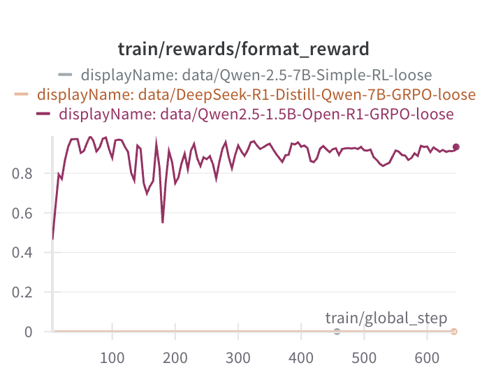
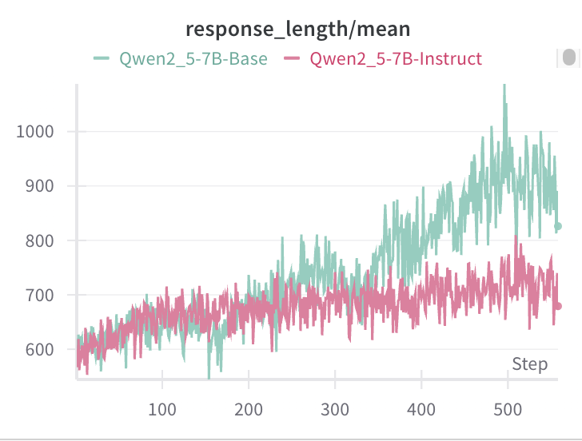

Title: DeepSeek R1范式复现笔记

URL Source: https://mp.weixin.qq.com/s/BYPKP5oXg1V4C_vg0VFGhw

Markdown Content:
作者：yulei

丨 导语自DeepSeek R1技术报告🐳开放以来，开源社区涌现了多种「复现」工作。本R1复现笔记旨在以多个开源项目的再复现以及交叉验证为目标，探索R1/R1-zero中强化学习步骤带来的模型效果提升，并尝试展望R1技术在未来模型训练与业务落地上的前景

1\. R1 开源项目梳理
-------------

目前主流的 R1 系列复现工作如表 1 所示。综合考虑数据领域（数学题、逻辑题等）及框架，我们选取了 SimpleRL、OpenR1、LogitRL、TinyZero 这四个项目开展类 R1 训练范式的实验。

表 1 主流开源 R1 复现工作

| Github | 训练集 | 测试集 | 模型 | RL 框架 | 优点 | 缺点 | 易上手评级 |
| --- | --- | --- | --- | --- | --- | --- | --- |
| [simpleRL-reason](https://github.com/hkust-nlp/simpleRL-reason) | MATH 8K(level 3-5) | AIME 2024  
MATH 500  
AMCMinerva Math
OlympiadBench

 | Qwen2.5-7B | OpenRLHF | 1）实现简单  
2）系统工作支持 PRM/ORM/R1 等  
3）RL 框架支持多机多卡 | 1）RL 算法暂不支持 GRPO | ⭐️⭐️⭐️ |
| [open-r1](https://github.com/huggingface/open-r1) | DigitalLearningGmbH/MATH-lighteval  
AI-MO/NuminaMath-TIR | AIME 2024  
MATH-500  
GPQA Diamond | DeepSeek-R1-Distill-Qwen-7B  
Qwen2.5-Math-7B  
Qwen2.5-1.5B-Instruct | TRL | 1）实现简单  
2）全流程支持 R1 系列工作（sft/rl/sft+rl） | 1）多机训练暂不支持 | ⭐️⭐️ |
| [unsloth](https://github.com/unsloth) | GSM8K | GSM8K\[test\] | LLAMA 3.1(8B)  
Phi4  
Qwen2.5-1.5B | TRL | 1）官方声称最接近 R1 的复现方式  
2）接口简单 | 1）多卡需付费 | ⭐️ |
| [logit-RL](https://github.com/Unakar/Logic-RL) | KK 老实人与骗子 lv3&5 | KK 老实人与骗子 | Qwen2.5-7B-Instruct | veRL | 1）RL 框架支持多种算法  
2）复现率较高 | 1）多机训练暂不支持 | ⭐️⭐️⭐️ |
| [tinyzero](https://github.com/Jiayi-Pan/TinyZero) | Countdown | Countdown | Qwen2.5-3B | veRL | 1）RL 框架支持多种算法  
2）复现率较高 | 1）多机训练暂不支持 | ⭐️⭐️⭐️ |
| [oatzero](https://github.com/oatzero) | 8K MATH | MATH 500 | Qwen2.5-Math-7B/1.5B  
Qwen2.5-7B/3B  
Microsoft-Rho-Math-7B  
DeepSeek-Math-7B-Base | OAT | 1）统一集成了 tinyzero 等代码 | 1）多机训练暂不支持 | ⭐️⭐️ |
| [demystify](https://github.com/eddycmu/demystify-long-cot) | MATH | WebInstruct  
MATH-500  
TheoremQA  
MMLU-Pro-1k | Llama3.1-8B  
Qwen2.5-Math-7B | OpenRLHF | 1）实现简单  
2）论文本身较扎实（训练 & 验证充分） | 1）实验 setting 与 R1 稍有区别 | ⭐️⭐️ |

2\. 实验设置
--------

### 2.1 训练数据

**数学题**

*   **SimpleRL**
    

*   数据集：MATH8K [simpleRL-reason/train/data/math\_level3to5\_data\_processed\_with\_qwen\_prompt.json at main · hkust-nlp/simpleRL-reason · GitHub](https://github.com/hkust-nlp/simpleRL-reason/blob/main/train/data/math_level3to5_data_processed_with_qwen_prompt.json)
    
*   数据量：8.5K
    
*   来源：MATH 数据集中难度在 3-5 等级的题目
    

*   **OpenR1**
    

*   数据集：MATH-lighteval [https://huggingface.co/datasets/DigitalLearningGmbH/MATH-lighteval](https://huggingface.co/datasets/DigitalLearningGmbH/MATH-lighteval)
    
*   数据量：7.5K
    
*   来源：以 lighteval 形式重组的 MATH 数据集，包含分步骤的题解
    
*   数据集：MATH-numina [https://huggingface.co/datasets/AI-MO/NuminaMath-TIR](https://huggingface.co/datasets/AI-MO/NuminaMath-TIR)
    
*   数据量：72.4K
    
*   来源：NuminaMath-CoT 中的题目，使用 tool-integrated reasoning 方式获得 GPT4o 的推理链路（包含 python 解法、代码执行过程等多轮交互）
    

*   **TinyZero**
    

*   数据集：Countdown（加减乘除至目标数字）[https://huggingface.co/datasets/Jiayi-Pan/Countdown-Tasks-3to4](https://huggingface.co/datasets/Jiayi-Pan/Countdown-Tasks-3to4)
    
*   数据量：490K
    
*   来源：经典游戏，使用运算符将给定的 3 位数字、4 位数字计算得到目标值
    

**逻辑题**

*   **LogicRL**
    

*   数据集：Knights and Knaves（老实人与骗子）[https://huggingface.co/datasets/K-and-K/knights-and-knaves](https://huggingface.co/datasets/K-and-K/knights-and-knaves)
    
*   数据量：3PPL（三人）1K；5PPL（五人）1K
    
*   来源：逻辑题，老实人只说真话；骗子总说假话。找出所有的老实人与骗子。
    

### 2.2 基座模型选取

考虑到可复现性（对齐开源项目），我们采用了以下基座模型：

*   Qwen2.5-7B-Math（Base）：SimpleRL、OpenR1
    
*   Qwen2.5-1.5B-Instruct：OpenR1
    
*   Deepseek-R1-Distill-Qwen-7B（Instruct）：OpenR1
    
*   Qwen2.5-3B（Base）：TinyZero
    
*   Qwen2.5-7B（Base）：LogicRL、TinyZero
    
*   Qwen2.5-7B-Instruct：LogicRL
    

Qwen-Math 系列的基座模型在 RL 前就已经具备了解决多种难度数学题的能力，这为后续激发模型慢思考的 long CoT 能力打下了坚实的基础。

受到计算资源的影响以及现在开源的各类 RL 框架的限制，大部分开源工作都将模型尺寸限制在了 1.5B 至 7B 的量级。一方面，小模型能够方便我们快速上手 R1 的复现工作；但另一方面，小模型本身的逻辑推理能力有限，这限制了更全面、实用级别（而非 toy-study）类 R1 工作的复现。因此，在后续的工作中，针对 RL 框架的优化（多机多卡训练、减少训练中 rollout 等步骤导致的气泡等）是通往大规模训练类 R1 模型之路上必须要解决的问题。

### 2.3 RL 基本设置

#### 2.3.1 Reward 函数定义

**Format Reward**

RL 训练时设置严格的格式约束，通常以 system prompt 的形式出现在训练数据中。

*   **SimpleRL**
    

*   system prompt
    
    ```
    Please reason step by step, and put your final answer within \boxed{}.  
    ```
    
*   reward 函数[定义](https://github.com/hkust-nlp/simpleRL-reason/blob/main/train/openrlhf/trainer/ppo_utils/experience_maker.py#L617) (snippet）
    
    ```
    if "boxed" not in model_output:  
    box_match = -1.0  
    ```
    

*   **OpenR1**
    

*   system prompt
    
    ```
    A conversation between User and Assistant. The user asks a question, and the Assistant solves it. The assistant first thinks about the reasoning process in the mind and then provides the user with the answer. The reasoning process and answer are enclosed within <think> </think> and <answer> </answer> tags, respectively, i.e., <think> reasoning process here </think><answer> answer here </answer>  
    ```
    
*   reward 函数[定义](https://github.com/huggingface/open-r1/blob/main/src/open_r1/rewards.py#L52)(snippet)
    
    ```
    def format_reward(completions, **kwargs):  
        """Reward function that checks if the completion has a specific format."""  
        pattern = r"^<think>.*?</think>\s*<answer>.*?</answer>$"  
        completion_contents = [completion[0]["content"] for completion in completions]  
        matches = [re.match(pattern, content, re.DOTALL | re.MULTILINE) for content in completion_contents]  
        return [1.0 if match else 0.0 for match in matches]  
    ```
    

*   **LogicRL**
    

*   system prompt（Base）
    
    ```
    The user asks a question, and the Assistant solves it.The assistant first thinks about the reasoning process in the mind and then provides the user with the final answer. The reasoning process and answer are enclosed within <think> </think> and <answer> </answer> tags, respectively, i.e., <think> reasoning process here </think><answer> answer here </answer>. Now the user asks you to solve a logical reasoning problem. After thinking, when you finally reach a conclusion, clearly state the identity of each character within <answer> </answer> tags. List the identity of each person one by one, for example, <answer> (1) Zoey is a knight\n(2) Oliver is a knight\n(3)... </answer>.  
    ```
    
*   system prompt（Instruct）
    
    ```
    You are a helpful assistant. The assistant first thinks about the reasoning process in the mind and then provides the user with the answer. The reasoning process and answer are enclosed within <think> </think> and<answer> </answer> tags, respectively, i.e., <think> reasoning process here </think><answer> answer here </answer>.  Now the user asks you to solve a logical reasoning problem. After thinking, when you finally reach a conclusion, clearly state the identity of each character within <answer> </answer> tags. i.e., <answer> (1) Zoey is a knight  
    (2) ... </answer>.  
    ```
    
*   reward 函数[定义](https://github.com/Unakar/Logic-RL/blob/086373176ac198c97277ff50f4b6e7e1bfe669d3/verl/utils/reward_score/kk.py#L23)(snippet)
    
    ```
    answer_score = 0  
    if format_correct and answer_text:  
      pred_status = parse_model_answer(answer_text, expected_names)  
        if pred_status:  
            if pred_status == gt_status:  
                answer_score = 2  
                print("  Content validation: FULL MATCH")  
            else:  
                answer_score = -1.5  
                print("  Content validation: MISMATCH")  
        else:  
            answer_score = -2  
            print( "Fail to parse answer")  
    else:  
        answer_score = -2  
        print("\n[Content Validation] Skipped due to format errors or missing answer")  
    ```
    

*   **TinyZero**
    

*   system prompt（snippet）
    
    ```
    Show your work in <think> </think> tags. And return the final answer in <answer> </answer> tags, for example <answer> (1 + 2) / 3 </answer>.  
    ```
    
*   reward 函数[定义](https://github.com/Jiayi-Pan/TinyZero/blob/8a623926012ff785f2dc6f3639a821465eed07c4/verl/utils/reward_score/countdown.py#L18)(snippet)
    
    ```
    answer_pattern = r'<answer>(.*?)</answer>'  
    match = re.finditer(answer_pattern, solution_str)  
    matches = list(match)  
    if matches:  
        final_answer = matches[-1].group(1).strip()  
    else:  
        final_answer = None  
    return final_answer  
    ```
    

**Accuracy Reward**

考虑到答案校验存在不同的类型（字符串通常使用 exact\_match，浮点数允许给定精度下的误差），不同开源项目也使用了适应于训练集的答案校验函数。

*   **SimpleRL**
    

*   accuracy reward [定义](https://github.com/hkust-nlp/simpleRL-reason/blob/main/train/openrlhf/trainer/ppo_utils/experience_maker.py#L551)(snippet)
    
    ```
    if qwen_math_equal_subprocess(prediction=extract_answer, reference=answer):  
        box_match = 1.0  
    else:  
        box_match = -0.5  
    ```
    

*   **OpenR1**
    

*   accuracy reward [定义](https://github.com/huggingface/open-r1/blob/main/src/open_r1/rewards.py#L10)(snippet)
    
    ```
    # Reward 1 if the content is the same as the ground truth, 0 otherwise  
    reward = float(verify(answer_parsed, gold_parsed))  
    ```
    

*   **LogicRL**
    

*   accuracy reward [定义](https://github.com/Unakar/Logic-RL/blob/086373176ac198c97277ff50f4b6e7e1bfe669d3/verl/utils/reward_score/kk.py#L141)(snippet)
    
    ```
    answer_score = 0  
    if format_correct and answer_text:  
        pred_status = parse_model_answer(answer_text, expected_names)  
        if pred_status:  
            if pred_status == gt_status:  
                answer_score = 2  
                print("  Content validation: FULL MATCH")  
            else:  
                answer_score = -1.5  
                print("  Content validation: MISMATCH")  
        else:  
            answer_score = -2  
            print( "Fail to parse answer")  
    else:  
        answer_score = -2  
        print("\n[Content Validation] Skipped due to format errors or missing answer")  
    ```
    

*   **TinyZero**
    

*   accuracy reward [定义](https://github.com/Jiayi-Pan/TinyZero/blob/8a623926012ff785f2dc6f3639a821465eed07c4/verl/utils/reward_score/countdown.py#L59)(snippet)
    
    ```
    # Evaluate equation  
    try:  
        result = evaluate_equation(equation)  
        if result is None:  
            if do_print:  
                print(f"Could not evaluate equation")  
            return format_score  
        if abs(result - target) < 1e-5:  # Account for floating point precision  
            if do_print:  
                print(f"Correct equation: {equation} = {result}")  
            return score  
        else:  
            if do_print:  
                print(f"Wrong result: equation = {result}, target = {target}")  
            return format_score  
    ......  
    ```
    

**小结** ：DeepSeek R1 的 format 约束主要以 "{think process}{answer}" 的形式实现，而开源方案大多采用了 "{think process}{answer}" 的形式。从优化角度而言两者的差异不大。在构建基于正则表达式来判断模型输出是否存在规范格式时，往往采用的是较为严格的 r"^._?\\s_.\*?$" 来约束开头与结尾。针对部分数学类问题，format reward 考虑答案是否出现了 \\box{} 框。

至于 accuracy reward，各个工作的实现方式基本沿用了过往强化学习算法中 ORM 里的代码。此处的难点有两个：1）需要编写大量的后处理代码，从模型的输出结果中能够成功解析出最终的结果；2）需要考虑判断相等的条件（数值、字符串等），并针对不同的领域数据设计不同的 reward 方式。对于前者而言，对于某些要求格式化输出类问题，需要正确匹配出目标 kv 对。对于后者而言，判断 prediction 和 gt 是否相等并返回 reward 的定义也有所讲究。最严格的完全一致匹配只会区分正确 - 错误两种情况，在某些任务上可能会影响训练收敛的速度。

#### 2.3.2 Penalty 函数定义 (Optional)

大多数开源项目中并没有强调 penalty 及其实现，但目前的最新文章指出了重复 penalty 与长度 penalty 的重要性。施加基于 repetition 的 penalty 函数可以减少 CoT 中车轱辘话的内容。具体地，repetition penalty 是基于 n-gram 实现的，维护一个已经访问过的 n-gram 集合，并以 n 为滑动窗口的大小。从前到后滑动判断是否多次出现了相同的 n-gram，并以此为惩罚。实现[参考](https://github.com/eddycmu/demystify-long-cot/blob/release/openrlhf/openrlhf/reward/repetition.py#L10)(snippet)：

```
ngrams = set()  
total = 0  
for ng in zipngram(generation, ngram_size):  
    ngrams.add(ng)  
    total += 1  
scaling = 1 - len(ngrams) / total  
return scaling * max_penalty  
```

针对两个正确的答案 A 与答案 B，如果答案 A 的长度小于答案 B 的长度，那么通常会给予答案 A 更高的 reward 以精简思维链；而针对两个错误的答案 A 与答案 B，如果 A 的长度小于 B 的长度，则会惩罚 A，以鼓励模型进一步探索解法来提升思维链中的反思、分叉等。实际训练时，上述的 penalty 设计仍然可能存在意想不到的 hacking 情况。比如，鼓励长度更短的正确回答可能破坏了模型原本的 branching 思考（alternatively...）。实际复刻 R1 时，还需要考虑不同难度的数据混合比例，防止简单题目回答均正确情况下的思维链退化。

#### 2.3.3 优化方式

开源项目大部分都支持 PPO 算法。目前 TRL 和 VeRL 库均已支持 GRPO 算法。

*   SimpleRL（OpenRLHF）-\> PPO
    
*   OpenRL（TRL）-\> GRPO
    
*   LogitRL（VeRL）-\> GRPO
    
*   TinyZero（VeRL）-\> PPO & GRPO
    

#### 2.3.4 训练平台

复现工作均在 TIONE 平台上使用 1 台 ~ 4 台  GPUs 进行。上述几个开源复现工作中，只有 OpenRLHF 支持多机多卡训练。其余的仅支持单机多卡训练，且往往存在 GPU 数目的限制。在训练 TinyZero 和 LogitRL 时，我们就遇到了扩展 GPUs 后训练卡在初始化的问题。

大部分项目使用 4 卡、8 卡、32 卡（SimpleRL）复现耗时在 2~3 天左右。

3\. 实验结果与分析
-----------

### 3.1 开放训练过程

*   SimpleRL [SimpleRL-复现结果](https://api.wandb.ai/links/yuleiqin-tencent/97xftizo)
    
*   OpenR1[OpenR1复现结果](https://api.wandb.ai/links/yuleiqin-tencent/h10ms0jr)
    
*   LogitRL
    

*   Stage1 [LogicRL-stage1(3ppl)复现结果](https://api.wandb.ai/links/yuleiqin-tencent/h2gp644r)
    
*   Stage2 [LogicRL-Stage2(5ppl)复现结果](https://api.wandb.ai/links/yuleiqin-tencent/svgtxoij)
    
*   Stage3 [LogicRL-Stage3(5ppl)复现结果](https://api.wandb.ai/links/yuleiqin-tencent/wl14j4f5)
    

*   TinyZero
    

*   PPO [TinyZero-R1复现结果](https://api.wandb.ai/links/yuleiqin-tencent/crea6kem)
    
*   GRPO [TinyZero-R1(GRPO)复现结果](https://api.wandb.ai/links/yuleiqin-tencent/3d2dk0bp)
    

### 3.2 结果详述

#### 3.2.1 SimpleRL

我们使用多机 32 卡跑完了训练过程（总步数为 160 步）；同时使用单机 8 卡训练了一半作为对比。核心的训练过程示意图如下：

| reward | 回复长度 |
| --- | --- |
|  |  |

图 3.2.1(1) SimpleRL 训练过程中训练集 reward（左）与回复长度（右）的变化

**相比于 SimpleRL 博客中汇报的最终回复长度而言，我们最终收敛的长度偏短。**SimpleRL 汇报的最终长度大约在 700 左右，但我们在 580 左右。这里的可能原因有两个：1）训练的超参未完全对齐其设置，后续待进一步优化超参。2）需要改进目前的 format 约束，强制区分 CoT 思考链路部分与答案部分。

**单机多卡（8 GPUs）与多机多卡（32 GPUs）训练的效果基本一致，多机训练速度是单机的 3.2 倍。**RL 训练时需消耗大量的时间（\>80%）在对模型进行采样（make experience），vllm 使用更多的 GPU 并行可以大幅减少训练时间。

表 3.2.1(1) SimpleRL 训练过程中测试集指标变化

| 模型名称 | GSM8K | MATH500 | Minerva\_MATH | OlympiadBench | AIME24 | AMC23 | 平均 |
| --- | --- | --- | --- | --- | --- | --- | --- |
| Qwen2.5-Math-7B-Base | 59.1 | 53.4 | 14.0 | 15.1 | 13.3 | 47.5 | 33.7 |
| PPO-step4 | 77.4 | 67.0 | 19.9 | 27.7 | 13.3 | 60.0 | 44.2 |
| **PPO-step12** | 80.4 | 66.2 | 16.5 | 26.1 | 10.0 | 42.5 | **40.3** |
| PPO-step20 | 84.8 | 67.2 | 20.2 | 29.6 | 23.3 | 50.0 | 45.9 |
| PPO-step40 | 88.3 | 76.8 | 29.0 | 35.1 | 23.3 | 55.0 | 51.2 |
| PPO-step60 | 90.5 | 77.2 | 32.0 | 38.4 | 20.0 | 57.5 | 52.6 |
| PPO-step80 | 89.6 | 77.0 | 33.1 | 38.5 | 20.0 | 57.5 | 52.6 |
| PPO-step100 | 89.8 | 76.0 | 31.2 | 37.2 | 40.0 | 60.0 | 55.7 |
| PPO-step120 | 90.1 | 78.6 | 29.0 | 35.1 | 23.3 | 57.5 | 52.3 |
| PPO-step140 | 90.1 | 76.6 | 29.8 | 38.2 | 23.3 | 55.0 | 52.2 |
| PPO-step160 | 89.4 | 76.6 | 31.6 | 37.6 | 26.7 | 57.5 | 53.2 |

**模型在各大数学测试集上的表现大致是稳步提升的**。尽管训练在前期（step=12）发生输出长度骤降的时候，模型在测试集上的表现也出现了波动。但随着训练的稳步推进，模型的输出长度稳步回升。

**随着输出长度大致稳定，测试集的性能也基本不变**。在 step=60 以后，输出长度基本稳定在一个平均值附近，而此时的各个测试集平均指标也维持在 53 左右。

**仅基于 format 与 accuracy 的 RL 训练能够带来一定的泛化性**。尽管训练集是从 MATH500 中选取的部分难度数据，但模型在多个数据集上均表现出一致提升的现象。

| 分步骤思考 | 反思 |
| --- | --- |
|  |  |

图 3.2.1(2) SimpleRL 训练过程中模型在测试集上的分步骤思考（左）与反思（右）变化

**Math Base 模型在起始阶段就展现出分步骤思考能力**。我们统计分析了分步骤思考的关键词出现的频数，发现基础模型已展现出较强的目标分解，分步骤解题能力。随着训练的进行，模型首先经历了来自 format 奖励的优化（step12），在输出分布上出现了较大变化。继续训练后模型能够重新掌握分解步骤进行推理的能力。

```
Step 1, Step2, ...1., 2., ...

First, Second, Next, Finally

```

**Math Base 反思能力变化较小，没有明显的多次自我反思；但可观察到微弱的 aha moment**。对模型在最后 step=160 的输出进行分析，模型仍然倾向于在输出中使用代码校验的方式进行 check，而不是使用纯文本的反思方式。我们认为这是千问的 Math Base 模型本身倾向于使用代码来校验的预训练方式有关系（step=0）。考虑到最终模型输出长度没有特别明显的增长，这一点和自我反思能力的变化情况是吻合的。以 MATH500 测试集中的一个示例说明，如图 3.2.1(3) 所示，模型一开始就已经具备了基本的分步推理思维链。但受到预训练阶段数据偏好的影响，模型校验时使用的是 PoT，并通过 LLM 模拟编译器输出了运行结果（output）。这样的校验方式有利于借助编译器等外部工具来验证，但不利于生成纯文本的思维链。**这也解释了模型为什么一开始输出长度十分冗余（编写代码校验）**。随着训练的进一步进行，模型在 step=4 和 step=12 的时候输出长度急剧下降，开始减少代码校验。但在 step=100 的时候，模型又倾向于输出代码校验。**这说明了该数学基座模型对代码工具的执念很深**。最终，模型在 step=160 展现出了 aha moment 中的反思步骤（re - evaluate）。


图 3.2.1(3) SimpleRL 训练过程中模型在测试集上的输出变化

**Math Base 模型能同时针对文本推理结果或代码校验结果给出反思**。如图图 3.2.1(4) 所示，尽管模型表现出使用代码校验的倾向，但是能够根据模拟编译结果来进行反思，进行打磨。


img

图 3.2.1(4) SimpleRL 测试集上展现出反思特点的回答示例

#### 3.2.2 OpenR1

训练中的核心指标如下图 3.2.2(1) 所示。注：这里 Qwen2.5-1.5B 指的是 Instruct 模型。

| 格式奖励 | 准确度奖励 |
| --- | --- |
|  |  |

图 3.2.2(1) OpenR1 训练过程中测试集格式奖励（左）与准确度奖励（右）的变化。

**DeepSeek 官方蒸馏的 Qwen7B 模型指令遵循能力较差，始终无法很好输出指定的思维链与答案格式**。这里图 3.2.2(1) 左边可以看到，除了 Qwen2.5-7B 只需要输出 boxed 框结果（无需等约束），Qwen2.5-1.5B-Instruct 与 Deepseek-Distill-Qwen2.5-7B 表现出了截然不同的曲线。Deepseek-Distill-Qwen2.5-7B 几乎没有办法学到指定的格式。1.5B 量级的模型受限于体量，虽然能够遵循格式指令，但未显著提升准确率。

**Qwen2.5-Math-7B-Base 的复现结果与 SimpleRL 基本一致**。虽然训练数据是从 MATH 源选取的，但除 MATH 外的其余测试集（如 GSM8K 等）也有略微提升。**DeepSeek-Distill-Qwen-7B 的 GRPO 训练存在波动**，我们认为当前超参设置并不是最优的，还需仔细微调。

表 3.2.2(1) OpenR1 训练过程中 Qwen2.5-Math-7B-Base 在测试集上的变化

| 模型名称 | GSM8K | MATH500 | Minerva\_MATH | OlympiadBench | AIME24 | AMC23 | 平均 |
| --- | --- | --- | --- | --- | --- | --- | --- |
| Qwen2.5-Math-7B-Base | 59.1 | 53.4 | 14.0 | 15.1 | 13.3 | 47.5 | 33.7 |
| GRPO-step100 | 84.2 | 74.4 | 29.0 | 35.6 | 26.7 | 57.5 | 51.2 |
| GRPO-step200 | 85.2 | 71.6 | 26.1 | 35.7 | 30.0 | 60.0 | 51.4 |
| GRPO-step300 | 86.4 | 74.2 | 36.4 | 32.7 | 26.7 | 55.0 | 51.9 |
| GRPO-step400 | 84.4 | 72.0 | 32.0 | 33.0 | 10.0 | 57.5 | 48.2 |

表 3.2.2(2) OpenR1 训练过程中 DeepSeek-Distill-Qwen-7B-Base 在测试集上的变化

| 模型名称 | GSM8K | MATH500 | Minerva\_MATH | OlympiadBench | AIME24 | AMC23 | 平均 |
| --- | --- | --- | --- | --- | --- | --- | --- |
| DeepSeek-Distill-Qwen-7B-Instruct | 89.6 | 89.6 | 36.4 | 51.1 | 26.7 | 87.5 | 63.5 |
| GRPO-step100 | 89.1 | 85.6 | 41.5 | 46.2 | 46.7 | 82.5 | 65.3 |
| GRPO-step200 | 82.8 | 75.8 | 35.3 | 37.9 | 6.7 | 50.0 | 48.1 |
| GRPO-step300 | 82.2 | 78.8 | 32.7 | 39.3 | 40.0 | 62.5 | 55.9 |
| GRPO-step400 | 87.9 | 81.4 | 38.2 | 40.9 | 30.0 | 72.5 | 58.5 |

#### 3.2.3 LogicRL

**Stage1 优化**

该阶段使用 PPL=3（即三个人的 KK 问题）对模型进行预热，仅训练 1ep。考虑到 GRPO 训练时相比于 PPO 一般会比较不稳定，且受到 rollout 数量、batch size 等影响较大，选择从简单的题目入手可以让模型先具备解决 KK 问题的初步推理方式。

**指令对齐能力对于解决 KK 问题有明显收益**。我们从图 3.2.3(1) 可知，经过对齐后的 Qwen2.5-7B-Instruct 模型一开始便取得了 0.45 左右的准确率。

**一阶段 RL 训练略微提升了模型平均的回复长度**。模型在初始阶段利用预训练的能力即可生成 400 字左右长度的合理思维链，尽管此时并没有出现明显的反思能力。

| 测试集指标 | 回复长度 |
| --- | --- |
|  |  |

图 3.2.3(1) LogicRL 一阶段训练过程中测试集指标（左）与回复长度（右）的变化

| 答案错误占比 | 格式错误占比 |
| --- | --- |
|  |  |

图 3.2.3(2) LogicRL 一阶段训练过程中答案错误占比（左）与格式错误占比（右）的变化

**格式错误占比下降速度很快，但答案错误占比仍居高不下**。千问 Base 模型仅需迭代若干步即可将格式错误占比收敛到 5%以下。而指令对齐后的 Instruct 版本起始阶段就具备良好的格式遵循能力，能够输出正确的格式。另一方面，由于此时模型并未展现出反思能力，答案错误的占比一直稳定在 60%~70% 左右。

**Stage2 优化**

该阶段使用 PPL=5 对模型进行进一步的优化。我们加载来自一阶段末尾的 ckpt 来初始化 actor 模型。此阶段需要调整采样的温度超参，同时增加 rollout 的样本数量。通过增加采样结果的多样性来允许带有思维链解法的回答出现，进一步来鼓励模型生产这样的思维链答案。

**二阶段训练中受到温度系数与采样 rollout 数量超参影响较大**。官方项目中提及的温度系数 temperature=1.2~1.5 对于 Qwen 7B 量级的模型来说仍然有些大，比较容易训崩。参考图 3.2.3(2)，我们给出了一组超参设置（temperature=1.2，rollout.n=32）下训练崩溃的实验曲线。考虑到五个人的 KK 问题在难度上就会远高于三个人的 KK 问题，我们在优化第二阶段时需要确保模型是稳健而不是激进训练的。如果模型在训练过程中一直没有得到有效的奖励来鼓舞带有 self-reflection 答案的输出，训练一段时间后模型没有任何本质提升，极其容易导致坍塌。以图 3.2.3(2) 中回复长度的变化曲线来看，在 step=140 时，模型直接无法停止，instruct 模型不吐出 "<|im\_end|\>"、base 模型不吐出 "<|end\_of\_text|\>"，反复说没有意义的内容直到超出预设回答的长度上限。在 step=140 时，模型不仅出现了大量的错误答案，也出现了格式错误暴涨的问题。这些现象与其测试集指标暴跌相互佐证，说明了模型正在坍塌。

|  |  |
| --- | --- |
|  |  |

图 3.2.3(2) LogicRL 二阶段训练过程中不合适的超参设置导致的训练崩溃问题

**GRPO 训练过程中的抖动较大。**即使通过合理调整超参能够避免了模型坍塌的问题，但整个训练过程中我们发现模型的输出长度变化、错误答案占比等变化较剧烈（如图 3.2.3(3) 所示）。这意味着模型解决 PPL=5 时的挑战较大，很难找到容易的解法套路，性能提升十分坎坷。

**相比于 Qwen-Instruct，Qwen-Base 表现出更详细缜密的推理链过程。**为了探究在训练结束时 Qwen2.5-7B-Base 与 Instruct 在长度上的差异，我们随机选取了一个示例进行分析。如图 3.2.3(4) 所示，这两个模型都做对了这道题目，但 Base 模型展示出了更为缜密的思维链。具体地，Base 模型从 "Samuel" 是 knight 还是 knave 进行分情况讨论，然后再在每个条件下依次分析剩下来的 "Charelott, Mia, Daniel, Jackson" 这几个人的话能否同时成立。通过交叉验证可以先排除 "Samuel 是 knight" 这一个前提情况；再继续分析第二种前提。相反地，Instruct 模型倾向于优先把每个人的话进行总结性分析，并同时给出每个人是 knight 或者是 knave 时的声明成立情况，一步到位给出统筹性的分析结论。Instruct 模型在推理链上倾向于省略小步骤，通过省略部分推导过程来压缩推理链，可解释性下降。这可能是因为 **Instruct 模型经过了大量非 long CoT 表示的 SFT 数据、DPO 优化等偏好对齐后，倾向于省略推理内容给出直接的、简明扼要的回答**。Base 模型更多地是激活预训练语料中内在的推论表达方式，通过缜密的一步步推导来逐渐导向最终结论。如果后续要基于 SFT/Instruct 模型进行继续类 R1 的训练时，需要保证 SFT 阶段已经存在了大量的 long CoT 形式的数据来引导模型给出带详细推理链的答案。

|  |  |
| --- | --- |
|  |  |

图 3.2.3(3) LogicRL 二阶段训练过程中合理的超参调整避免模型崩塌


img

图 3.2.3(4) LogicRL 二阶段结束时 Qwen2.5-7B-Base 与 Instruct 在训练集上的推理示例

**Stage3 优化**

第三阶段进行漫长的退火阶段来进一步提升模型思维链的质量。由于开源项目并没有具体给出每个阶段的具体参数设置，我们根据已有经验在这一阶段继续降低学习率，调低温度系数，让模型平稳地收敛。第三阶段使用的训练数据与第二阶段一致，学习率都遵循 cosine 衰减策略。

**相同步长下 Base 模型与 Instruct 模型收敛的最终准确率接近，但 Base 稍好**。观察到图 3.2.3(5) 左边的曲线，两个模型最终收敛的水平相当。第三阶段 step=0 时，Instruct 模型起始的准确率更低，因此这一阶段 Instruct 模型的相对增益更大。图 3.2.3(5) 右边输出长度的变化情况也可以佐证 **Instruct 模型经历了更为明显的长度递增阶段**，输出长度快速地从 700 左右拉升到 1200，形成了完整的长思维链。起步阶段 Instruct 模型慢一些，需要**「先破后立」**来摆脱既有的 response 倾向性。假以时日，Instruct 模型能突然开窍，掌握思维链的输出范式。

**Base 和 Instruct 模型的错误率稳步下降，格式遵循错误率维持在低点。**以图 3.2.3(6) 所示，通过第三阶段合理设置了退火的超参，我们能够实现平稳的训练过程。

| 测试集指标 | 回复长度 |
| --- | --- |
|  |  |

图 3.2.3(5) LogicRL 三阶段训练过程中测试集指标（左）与回复长度（右）的变化

| 答案错误占比 | 格式错误占比 |
| --- | --- |
|  |  |

图 3.2.3(6) LogicRL 三阶段训练过程中答案错误占比（左）与格式错误占比（右）的变化

**Base 与 Instruct 模型均能见证 aha moment，展现出带分步骤、branching 推理、自我反思与校验的特性**。训练结束时随机挑选了一个训练集中样本，如图 3.2.3(7) 所示，两个模型都出现了多个分情况讨论前提下，step-by-step 推理的思维链，并在每种大前提讨论后进行 "re - evaluate"/"re - check"，总结性地给出最后的判断结果。

**Base 与 Instruct 模型输出的回答 token 数量基本不变，回复长度增长均来自于思考链的增加**。我们选取代表性的 ckpt 来推理了训练集和测试集，进一步拆解了模型训练过程中的回复内容。如图 3.2.3(8) 所示，随着训练步数的增加，模型思考链的长度在不断增加，而回答的答案长度基本保持不变，这说明了该阶段的确是在显著提升思考链。

**Base 与 Instruct 模型在分步骤推理上的能力快速提升后进入平台期，自我反思能力先上升然后略有下降。**如图 3.2.3(9) 所示，我们使用了正则表达式匹配关键词的方式来仔细地分析了模型思维链（即...之间的内容）。对于分步骤推理能力，由于模型的输出长度在不断边长，其 long CoT 内容中出现了越来越多的分步骤、分点解题的关键词。但对于自我反思能力而言，随着模型过拟合该数据集，自我反思的能力在抵达最高值后略有下降。这说明了模型倾向于在比较有自信的题目（拟合完备）上不反思。后续进行相关类 R1 实验时，需要充分保证训练集中有不同难度的数据，并利用困难数据来维持模型自我反思的模式不退化。


img

图 3.2.3(7) LogicRL 三阶段结束时 Qwen2.5-7B-Base 与 Qwen2.5-7B-Instruct 在训练集上的推理示例

| 训练集 | 测试集 |
| --- | --- |
|  |  |

图 3.2.3(8) LogicRL 三阶段过程中训练集（左）与测试集（右）上思考与回答长度的变化

| 分步推理 | 反思 |
| --- | --- |
|  |  |

图 3.2.3(9) LogicRL 三阶段过程中模型 CoT 分步推理与反思 pattern 变化

#### 3.2.4 TinyZero

**PPO 优化**

我们同时选用了千问 2.5-3B-Base 以及千问 2.5-7B-Base 作为基础，基本复现了该开源项目中的指标。核心的训练过程示意图如下。

| 测试集指标 | 回复长度 |
| --- | --- |
|  |  |

图 3.2.4(1) TinyZero 训练过程中测试集指标（左）与回复长度（右）的变化

**相同效果下，3B 量级模型需要更长时间才能收敛**。3B 模型在起始阶段就比 7B 模型低了 7% 左右；在迭代了接近 500 步后，3B 模型勉强与 7B 模型迭代 200 步的效果接近。

**3B 量级模型与 7B 量级初始回复长度基本接近，但 3B 模型最终达到的回复长度大于 7B 模型**。训练足够长时间（step \> 200）后，3B 模型生成解题过程时需要依靠更多输出 token。这也反映了尺寸更小的模型由于推理能力有限，往往需要更长的思维链过程表示中间过程。

| 训练集 | 测试集 |
| --- | --- |
|  |  |

图 3.2.4(2) TinyZero 训练过程中训练集（左）与测试集（右）上思考与回答长度的变化

为了分析在几个关键转折点上模型的具体输出内容，我们还选取了起始阶段（step=0，即 Base 模型）、长度骤降阶段（step=24）、长度回升阶段（step=72）、平台期阶段（step=120）、缓慢下降阶段（step=300）这几个步骤的模型 checkpoints，并分别推理得到了对应训练集、测试集的模型输出。使用、、、关键 token 抽取了对应输出中的所有内容进行统计分析。

**3B 模型与 7B 模型在训练过程中的表现类似，但 3B 模型消耗了更多的思考 token**。这一点与上面整体回复长度变化的结果一致，小尺寸的模型往往需要更多 CoT tokens。

**模型的输出长度变化主要是由 CoT 的变化带来的**。模型输出的答案 tokens 几乎不变（在 8~16 tokens 之间）。思维链的长短显著变化直接影响了最终输出的长度变化。

**在相同难度类型的任务下持续训练时，随着模型性能的不断上升，模型解题 CoT 中犯错的步骤在减少，整体 CoT 的长度在缓慢下降**。以 7B 模型上的训练为例，当抵达平台期（step=120）后，模型的输出长度不断在变短，一直缓慢下降（step=300）。我们认为这是因为在相同难度的任务（countdown）下，7B 模型逐渐过拟合到该任务上（测试集性能不断上升）。因此，模型逐渐掌握了正确的思维链而提升了推理能力，相应地减少了错误的推理链 token。如图 3.2.4(3)）为示意，当迭代步数从 step=24 开始递增时，推理链路开始边长，模型在 Step=72 展现出多种表达式计算的探索路径。同时，在每个表达式计算完毕后，模型会根据当前计算指标与目标值之间的差异反思是否满足要求，并在下一次探索中逐步调整。随着进一步训练（step=72 至 step300），模型试错的次数在减少，只需若干次尝试即获得了正确答案。


img

图 3.2.4(3) TinyZero 训练过程中模型推理链变化

**Base 模型本身即展现出了相当的推理能力，拥有思维链的基础结构**。在 Step=0 时直接推理 Qwen2.5-7B-Base 模型，模型输出的思维链中已经包含了分步骤思考的几个标志性关键词（First, Next, Finally）。我们认为千问的预训练语料中应该也具备大量的含有 branching、self-reflection 等特点的数据。这意味着模型在预训练阶段已经掌握了 long CoT 的基本结构是激发反思能力的一个必要条件。一个可行的理解是，RL 本身更多地是激发正确的思维链过程，惩罚肤浅的、错误的思维方式。

为了统计模型在 RL 训练过程中的推理链是否得到增强，需分析：1）推理链是否出现了结构化的分步解题，即 Reasoning 能力；2）推理链是否表现出了反思，即 Self - Reflection 能力。这里依旧采用正则表达式去统计思维链中相应关键词的频数。

对于前者（分步解题），我们考虑以下关键词：

```
- Step 1, Step2, ...  
- 1., 2., ...  
- First, Second, Next, Finally  
```

对于后者（反思与探索），我们考虑以下关键词：

```
rethink, recheck, try again, let's correct it and verify the steps again, recheck, re - evaluate, check again, try again, let's try again, let's think again, too high, too low, close but, try another approach, try different  
```

| 分步推理 | 反思 |
| --- | --- |
|  |  |

图 3.2.4(4) TinyZero 训练过程中模型 CoT 分步推理与反思 pattern 变化

如上述图 3.2.4(4) 所示，无论是 3B 还是 7B 的千问 Base 模型在 step=0 时就已经展现出了一定的分步思考以及反思能力。因此，类 R1 的 RL 训练方式并不是「凭空创造」了 LLM 的 CoT 能力，而是在一定程度上引导 LLM 偏好正确的、合适的推理链路。在这样的推理链路中，branching/self - reflection 等特性是通过 reward function 来鼓励习得的。

**相比于分步解题能力，模型的反思能力在训练过程中发生更显著的变化**。在 Step=0 时，基座模型就已经展现出了比较强的分步骤解题的能力，能够对输入 prompt 中 "think step by step" 给出较好的响应。但此时模型并不具备较特别强的反思能力，做错的时候模型倾向于重复前序的解法而不去探索新的解法（可能受限于指令理解能力）。虽然使用了分步思考，但出现错误后的反思是无效的，陷入了重复输出的坍塌状态（如图 3.2.5(5) 所示）。而且，此时模型似乎忘记了最终的目标是利用这三个数字计算得到目标值（55），探索的解题步骤局限在凑满某个子目标值（19）上，**无法跳出次优的路径**。


img

图 3.2.4(5) TinyZero 训练过程中 Step=0 时基座模型展现的无效反思

随着训练过程的继续，度过输出长度最短（step=24）时刻后，模型逐渐开始具备真正的反思能力。以 step=72 时刻为例（图 3.2.4(6)），模型输出的推理链路中出现了「Wait, I made a mistake」这样的有效反思状态，针对之前的错误回答进行了有效批判，并继续探索可能的解法，该「高光时刻」预示着模型正经历 aha moment。


img

图 3.2.4(6) TinyZero 训练过程递进时反思能力的进化

**GRPO 优化**

TinyZero 项目默认使用了 PPO 优化算法，我们同时也尝试了替换成 GRPO 进行训练。时间有限，我们对于 GRPO 的超参没有做过多的调优。在 8  GPUs 的算力下设置了 rollout 数量为 24，并减少 train batch size 至 8 来避免 OOM 问题。我们使用了默认的采样温度系数，训练了约 5ep。核心的训练指标如下图 3.2.4(7) 所示。

**相比于 PPO 训练来说，GRPO 的训练更加不稳定**。这一点在其他的开源项目复现时也遇到了。无论是千问 3B 模型还是 7B Base 模型，GRPO 版本的优化呈现出极大的不稳定性，输出长度上的变化幅度比较大。后续优化方向：1）超参的设置得进一步调优；2）GRPO 强依赖采样 rollout 的质量，这意味着我们必须尽可能提高 rollout 的数量来保证基于组（group）的优势（advantage）估计准确，但是这又会造成单机训练时 OOM 问题。后续依赖稳健的多机 RL 框架来对超参进行精调，减少训练不稳定的问题。

| 测试集指标 | 回复长度 |
| --- | --- |
|  |  |

图 3.2.4(7) TinyZero (GRPO)训练过程中测试集指标（左）与回复长度（右）的变化

4\. 总结
------

我们目前基于 DeepSeek R1/R1-zero 的大量开源工作从原理上大致还原了 DeepSeek 的训练过程，但是需要指出的是，这些尝试大多属于 toy dataset 验证性实验，离真正的 R1 复现仍有较大的差距。我们认为未来的工作需亟待解决：

*   支持大规模 RL 训练（PPO、GRPO 等）的开源基础框架
    
*   用于稳定训练的 GRPO 训练超参的自动化调优
    
*   RL 训练数据的配比（难度、领域、任务等）
    
*   基于 Instruct 模型训练 R1 时，高质量 long CoT 的数据获取
    
*   合适的惩罚函数设计以保证 CoT 思考链质量不退化
    

应用在业务落地时，我们需要考虑：

1）模型在给定的 prompt 下，结合预训练的基本知识能否正确给出正确的推理结果。任何业务中的「潜规则」都需要显式地定义在 prompt 中，并尽可能避免与预训练知识的冲突。

2）混合通用数据、业务数据与数学、代码类领域任务下的 long CoT SFT 数据来给模型先打下一个坚实的思维链范式基础，这有利于提升 RL 训练时的稳定性。

希望更多开源社区工作的发布能够促使长思考模型推理能力进一步提升。

5\. 公开参考资料
----------

*   [simpleRL-reason](https://github.com/hkust-nlp/simpleRL-reason)：GitHub - hkust - nlp/simpleRL - reason: This is a replicate of DeepSeek - R1 - Zero and DeepSeek - R1 training on small models with limited data
    
*   [open-r1](https://github.com/huggingface/open-r1)：GitHub - huggingface/open - r1: Fully open reproduction of DeepSeek - R1
    
*   \[logit - RL\](https://github.com/Unakar/Logic - RL)：GitHub - Unakar/Logic - RL: Reproduce R1 Zero on Logic Puzzle
    
*   \[tinyzero\](https://github.com/Jiayi - Pan/TinyZero)：GitHub - Jiayi - Pan/TinyZero: Clean, minimal, accessible reproduction of DeepSeek R1 - Zero
    
*   \[demystify long CoT\](https://github.com/eddycmu/demystify - long - cot)：GitHub - eddycmu/demystify - long - cot
    
*   [deepscaleR](https://www.notion.so/)：Notion – The all - in - one workspace for your notes, tasks, wikis, and databases.
