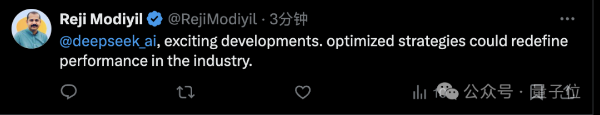
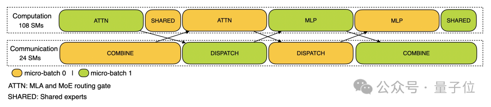

Title: DeepSeek今日连开3源！针对优化的并行策略，梁文锋本人参与开发

URL Source: https://mp.weixin.qq.com/s/GXIvj1omweDu3_DZjo6sVg

Markdown Content:
##### 衡宇 梦晨 发自 凹非寺  
量子位 | 公众号 QbitAI

按时整活！

DeepSeek开源周第四天，直接痛快「**1日3连发**」，且全都围绕一个主题：

**优化并行策略**。

*   **DualPipe：**一种创新的双向流水线并行算法，能够完全重叠前向和后向计算-通信阶段，并减少“流水线气泡”。它通过对称的微批次调度，优化了并行计算效率。
    
*   **Expert Parallelism Load Balancer** (EPLB)：用于MoE的负载均衡算法，通过复制高负载专家并智能地分配专家到不同GPU上，确保计算资源的均衡利用。它包含两种政策：层次化负载均衡和全局负载均衡。
    
*   **Profiling Data：**训练和推理框架的性能分析数据，展示了通信-计算重叠策略和底层实现细节。
    

这三者中，DualPipe从时间上优化了计算与通信的调度，EPLB从空间上平衡利用计算资源，Profiling Data则提供了前两者在实际应用中效果的可视化证据。

且**DualPipe的开发团队中包括梁文锋本人**。

发布后10分钟不到，3者在GitHub上的星标已经破300了，且其中DualPipe的星标飙升最快。

而DeepSeek一发推，网友的留言也排山倒海一般扑面而来，几乎都是不吝溢美之词：

> 好活！令人兴奋！  
> 优化策略可以重新定义行业的性能。

Day 4，直接1日3连发
-------------

#### DualPipe

**DualPipe是在DeepSeek-V3中首次出现双向流水线并行算法，现在代码完全开源。**

它实现了前向与后向计算-通信阶段的完全重叠，还减少了流水线气泡（即某些设备在某些时刻空闲等待）。

DualPipe采用了双向微批次调度策略，其核心特点是：

*   **对称设计**：反向方向的微批次与前向方向对称排列，形成一种几何平衡的调度结构
    
*   **计算-通信重叠**：两个共享黑色边框的单元格表示相互重叠的计算和通信过程
    
*   **双向并行**：同时在两个方向上推进微批次，最大化硬件利用率
    

传统流水线并行方法如1F1B（one-forward-one-backward）在处理多GPU场景时会产生大量气泡。

DualPipe通过重新安排微批次执行顺序，和对称结构缓解这个问题。

#### EPLB

**EPLB适用于V3/R1的专家并行负载均衡器，解决MoE模型在分布式训练和推理中的负载不平衡问题。**

在MoE架构中，不同的输入会激活不同的专家，可能导致某些专家过载，进一步造成不同GPU的利用率不平衡。

EPLB**采用“redundant experts”**（冗余专家）**策略**：

识别高负载专家→复制多个副本分配到不同GPU→在推理时动态分配输入到负载较轻的专家副本。

并带有两种普通的策略：

*   **分层负载平衡**，专家并行较小的预填充阶段使用。
    
*   **全局负载平衡**，在专家并行规模较大的解码阶段采用。
    

#### V3/R1中的计算通信重叠分析数据

开源第四弹的part 3，DeepSeek**公开分享了来自训练和推理框架的分析数据，以帮助社区更好地了解通信计算重叠策略和低级实现细节**。

GitHub上注明，分析数据是使用PyTorch Profiler捕获的。

下载后，开发者可以通过导航到Chrome浏览器中的chrome://tracing（或Edge浏览器中的edge://tracing）将它进行可视化。

Attention please——DeepSeek模拟了一个绝对平衡的MoE路由策略进行分析。

**首先，训练阶段。**

训练配置文件数据演示了DeepSeek在DualPipe中，对一对单独的向前和向后数据块的重叠策略。

每个数据块包含4个MoE 层。

并行配置与DeepSeek-V3预训练设置一致EP64、TP1具有4K序列长度。

为简单起见，在profilng期间不包括PP通信。

**其次，推理阶段。**

**1）预填充。**

**对于预填充，配置文件使用EP32和TP1**（与DeepSeek V3/R1的实际在线部署一致）**，提示长度设置为4K，每个GPU的批量大小为16Ktokens。**

在预填充阶段，DeepSeek利用两个微批次来重叠计算和多对多通信，同时确保注意力计算负载在两个微批次之间平衡

——这意味着相同的提示可以在它们之间分配。

**2）解码。**

（注：相关数据尚未准备就绪，将于稍后发布）

**解码方面，该配置文件采用了EP128、TP1和4K的提示长度**（与实际在线部署配置非常匹配）**，每个GPU的批量大小为128个请求。**

与预填充类似，解码还利用两个微批处理进行重叠计算和多对多通信。

但与预填充不同的是，解码期间的all-to-all通信不会占用GPU SM：

发出RDMA消息后，所有GPU SM都会被释放，系统在计算完成后等待all-to-all通信完成。

有关all-to-all实现的更多信息，请参考开源周第二弹DeepEP。

One More Thing
--------------

**“大放异彩！”**

对于第四弹的开源内容，网友是这么感慨的。

目前看来，DeepSeek开源周的前4天，都挺令追更群众们满意。

尤其是这次开源周全部瞄准大模型的Infra层。

追更看客们表示：

> 更好的团队合作不仅是团队管理优化的一部分，更是实现顶级AI性能的秘诀。  
> **DeepSeek正在创建新的标准，大规模训练的未来就在咱们眼前！**

好了，DeepSeek开源周，明天就是最后一天了，不知道会有什么压轴登场？

**扫码备注「DeepSeek-职业/姓名」加入群聊，一起第一时间直击DeepSeek开源周最后一弹！**

参考链接：  
https://x.com/deepseek\_ai/status/1894931931554558199

Github：  
\[1\]https://github.com/deepseek-ai/DualPipe  
\[2\]https://github.com/deepseek-ai/eplb  
\[3\]https://github.com/deepseek-ai/profile-data

— **完** —

**评选报名**｜**2025年值得关注的****AIGC企业&产品**

下一个AI“国产之光”将会是谁？

本次评选结果将于4月中国AIGC产业峰会上公布，欢迎参与！

**一键关注 👇 点亮星标**

**科技前沿进展每日见**

**一键三连****「点赞」「转发」「小心心」**

**欢迎在评论区留下你的想法！**
