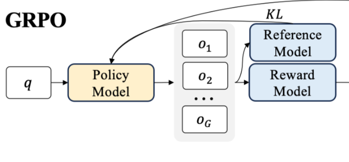

Title: DeepSeek用的GRPO占用大量内存？有人给出了些破解方法

URL Source: https://mp.weixin.qq.com/s/28GRpZwqv4gMnrmItMQchQ

Markdown Content:
选自oxen.ai

**作者：Greg Schoeninger**

**编译：陈陈、泽南**

> RTX 3080 移动版能训练哪种大模型？本文为那些 GPU 资源有限时使用 GRPO 训练的开发者提供了宝贵的指导。

自 DeepSeek-R1 发布以来，群组相对策略优化（GRPO）因其有效性和易于训练而成为大型语言模型强化学习的热门话题。R1 论文展示了如何使用 GRPO 从遵循 LLM（DeepSeek-v3）的基本指令转变为推理模型（DeepSeek-R1）。

GRPO 是一种在线学习算法（online learning algorithm），它通过使用训练过程中由训练模型自身生成的数据来进行迭代改进。GRPO 的目标是最大化生成补全（completions）的优势函数（advantage），同时确保模型保持在参考策略（reference policy）附近。

本文的目的是帮你节省一些时间，让你根据硬件预算选择合适的模型大小。在开始微调时，你必须做出的重要决定是选择模型大小，以及你是执行完全微调还是参数高效微调（PEFT）。

文章作者来自 AI 公司 Oxen.ai 的 CEO Greg Schoeninger。

原文链接：https://www.oxen.ai/blog/grpo-vram-requirements-for-the-gpu-poor

作者表示，他发现 trl 库中已经有一个易于使用的 GRPO 实现，便立刻开始了训练，使用的硬件是配备了 16GB 显存的 Nvidia GeForce RTX 3080 的小型笔记本电脑。正如大家可能遇到的问题，作者发现示例代码中的参数设置导致了一个巨大的显存不足（OOM，out of memory ）错误。

1.  `torch.OutOfMemoryError: CUDA out of memory.`
    
2.  `Tried to allocate 1.90GiB. GPU 0 has a total capacity of 15.73GiB of which 1.28GiBis free.`
    
3.  `Including non-PyTorch memory,this process has 14.43GiB memory inuse.Of the allocated memory 11.82GiBis allocated byPyTorch,and2.41GiBis reserved byPyTorch but unallocated.If reserved but unallocated memory is large try setting PYTORCH_CUDA_ALLOC_CONF=expandable_segments:True to avoid fragmentation.See documentation forMemoryManagement(https://pytorch.org/docs/stable/notes/cuda.html#environment-variables)`
    

**实际使用情况**

作者表示，他们进行了一系列实验，以确定训练各种大小的模型所需的显存（VRAM）要求。参数数量从 5 亿到 140 亿不等，他们比较了权重的完全微调与参数高效微调（使用 LoRA），所有训练运行都在英伟达 H100 上完成，因此这里的 OOM 意味着 \>80GB 的 VRAM。

在表格中，你可以找到 GSM8K 数据集上训练的前 100 步中的峰值内存使用情况。用于实验的模型是：

所有实验均使用 Shadeform 的 GPU 市场完成，因此每次实验只需要花费几美元 H100。

实验结果表明，内存需求随着模型大小和训练方式的不同而显著变化。例如，全参数微调比 PEFT 需要更多的内存。

**为什么 GRPO 对内存需求较高**

这要从 GRPO 的原理说起，这是它的流程图。

GRPO 对内存需求较高的原因在于，其内部涉及多个模型，并且在训练数据中每个查询会产生多个输出。上图中的策略模型、参考模型和奖励模型各自都是一个需要进行推理的 LLM。（尽管从技术上讲，奖励模型可能不需要参数化，可以只是一个 Python 函数或正则表达式，但不影响 GRPO 对内存的高需求。）

**为什么 8-Bit 优化和梯度检查点有助于减少内存占用？**

通常来讲，训练一个大型语言模型需要在内存中存储三种主要类型的信息：模型参数、模型学习所需的梯度、优化器的跟踪数据。

对上述内容我们可以这样理解：如果模型的参数占用了 X 的空间，那么梯度也会占用大约相同的空间。然后，像 AdamW 这样的优化器需要更多的空间，因为它们就像一个记录员，跟踪最近的更新历史，以便更好地决定未来的优化。

为了减轻这种内存负担，通常采用两种技术：

*   首先，可以使用像 AdamW 这样的 8-bit 优化器版本，它们能更高效地存储跟踪数据，同时仍保持良好的性能 —— 类似于压缩照片可以节省空间，同时保留大部分图像质量；
    
*   其次，使用梯度检查点技术，这就像在训练过程中拍摄快照，而不是记录所有内容。虽然这会使训练速度减慢约 20-30%，但它显著减少了内存使用。
    

结合这些技术，即使对 GPU 资源有限的人来说，也能够训练更大的模型。

**代码示例**

像 trl 这样的库已经开始支持 GRPO，使得微调由 transformers 构成的 LLM 变得非常简单。代码也非常简洁，只需将训练器替换为 GRPOTrainer 并定义一些奖励即可。GRPO 的最小代码量大约只有 99 行，如果你使用的是像 meta-llama/Llama-3.2-1B-Instruct 这样的小型模型和像 openai/GSM8K 这样的数据集，可以非常快速地启动。

trl 项目地址：https://github.com/huggingface/trl?ref=ghost.oxen.ai

1.  `import torch`
    
2.  `from datasets import load_dataset,Dataset`
    
3.  `from transformers importAutoTokenizer,AutoModelForCausalLM`
    
4.  `from trl importGRPOConfig,GRPOTrainer`
    
5.  `import re`
    

7.  `SYSTEM_PROMPT ="""`
    
8.  `Respond in the following format:`
    
9.  `<reasoning>`
    
10.  `...`
    
11.  `</reasoning>`
    
12.  `<answer>`
    
13.  `...`
    
14.  `</answer>`
    
15.  `"""`
    

17.  `def extract_hash_answer(text: str)-> str |None:`
    
18.  `if"####"notin text:`
    
19.  `returnNone`
    
20.  `return text.split("####")[1].strip()`
    

22.  `def get_gsm8k_questions(split ="train")->Dataset:`
    
23.  `    data = load_dataset('openai/gsm8k','main')[split]`
    
24.  `    data = data.map(lambda x:{`
    
25.  `'prompt':[`
    
26.  `{'role':'system','content': SYSTEM_PROMPT},`
    
27.  `{'role':'user','content': x['question']}`
    
28.  `],`
    
29.  `'answer': extract_hash_answer(x['answer'])`
    
30.  `})`
    
31.  `return data`
    

33.  `def extract_xml_answer(text: str)-> str:`
    
34.  `    answer = text.split("<answer>")[-1]`
    
35.  `    answer = answer.split("</answer>")[0]`
    
36.  `return answer.strip()`
    

38.  `def format_reward_func(completions,**kwargs)-> list[float]:`
    
39.  `"""Reward function that checks if the completion has a specific format."""`
    
40.  `    pattern = r"^<reasoning>\n.*?\n</reasoning>\n<answer>\n.*?\n</answer>\n$"`
    
41.  `    responses =[completion[0]["content"]for completion in completions]`
    
42.  `    matches =[re.match(pattern, r)for r in responses]`
    
43.  `return[0.5if match else0.0for match in matches]`
    

45.  `def accuracy_reward_func(prompts, completions, answer,**kwargs)-> list[float]:`
    
46.  `"""Reward function that extracts the answer from the xml tags and compares it to the correct answer."""`
    
47.  `    responses =[completion[0]['content']for completion in completions]`
    
48.  `    extracted_responses =[extract_xml_answer(r)for r in responses]`
    
49.  `return[2.0if r == a else0.0for r, a in zip(extracted_responses, answer)]`
    

51.  `def main():`
    
52.  `    dataset = get_gsm8k_questions()`
    

54.  `    model_name ="meta-llama/Llama-3.2-1B-Instruct"`
    
55.  `    model =AutoModelForCausalLM.from_pretrained(`
    
56.  `        model_name,`
    
57.  `        torch_dtype=torch.bfloat16,`
    
58.  `        attn_implementation="flash_attention_2",`
    
59.  `        device_map=None`
    
60.  `).to("cuda")`
    
61.  `    tokenizer =AutoTokenizer.from_pretrained(model_name)`
    
62.  `    tokenizer.pad_token = tokenizer.eos_token`
    

64.  `    training_args =GRPOConfig(`
    
65.  `        output_dir="output",`
    
66.  `        learning_rate=5e-6,`
    
67.  `        adam_beta1=0.9,`
    
68.  `        adam_beta2=0.99,`
    
69.  `        weight_decay=0.1,`
    
70.  `        warmup_ratio=0.1,`
    
71.  `        lr_scheduler_type='cosine',`
    
72.  `        logging_steps=1,`
    
73.  `        bf16=True,`
    
74.  `        per_device_train_batch_size=1,`
    
75.  `        gradient_accumulation_steps=4,`
    
76.  `        num_generations=4,`
    
77.  `        max_prompt_length=256,`
    
78.  `        max_completion_length=786,`
    
79.  `        num_train_epochs=1,`
    
80.  `        save_steps=100,`
    
81.  `        save_total_limit=1,`
    
82.  `        max_grad_norm=0.1,`
    
83.  `        log_on_each_node=False,`
    
84.  `)`
    

86.  `    trainer =GRPOTrainer(`
    
87.  `        model=model,`
    
88.  `        processing_class=tokenizer,`
    
89.  `        reward_funcs=[`
    
90.  `            format_reward_func,`
    
91.  `            accuracy_reward_func`
    
92.  `],`
    
93.  `        args=training_args,`
    
94.  `        train_dataset=dataset,`
    
95.  `)`
    
96.  `    trainer.train()`
    

98.  `if __name__ =="__main__":`
    
99.  `    main()`
    

**Num Generations 有什么用**

Num Generations 是一个超参数，它决定了我们将在训练数据中对每个查询采样多少个补全。然而，这会显著增加 VRAM 的消耗。

目前有一个开放的 GitHub 问题，可能会帮助解决内存瓶颈问题，可以参考如下链接

地址：https://github.com/huggingface/trl/issues/2709?ref=ghost.oxen.ai

对于 num\_completions=8,16,64 (DeepSeekMath 论文使用的 64)，作者表示，不用再次计算上述所有值，而是使用了 1B 参数模型进行了测试，以显示内存增长。不过，作者还是建议大家在内存瓶颈得到修复之前使用 num\_generations=4，也能获得不错的性能。

**影响 VRAM 的一些因素**

要对所有影响显存（VRAM）使用的因素进行全面的超参数验证，需要进行大量的实验。简单起见，这里只指出了需要注意的设置，以及实验中使用的具体数值。

*   batch\_size=1，由于 GRPO 为每个查询生成多个响应，batch size 会迅速失控。
    
*   gradient\_accumulation\_steps=4，优化器是另一个占用大量 VRAM 的地方。此参数决定了我们将存储的梯度以帮助优化器进行其「爬山」过程。
    
*   num\_completions=4，DeepSeekMath 论文中使用了 64。这完全超出了有些人的计算预算。
    
*   max\_prompt\_length=256，如果你想训练模型拥有更大上下文的推理能力，将不得不增加 VRAM。GSM8K 的提示相对较小，适合此测试。
    
*   max\_completion\_length=786，同样，由于计算注意力的内存有限，推理链在这里受到限制。上下文或生成的 token 越多，需要的内存就越大。
    
*   LoRA target\_modules=\["q\_proj", "k\_proj", "o\_proj", "up\_proj", "down\_proj"\] 在这方面可以尝试几种不同的迭代。target\_modules="all-linear" 是一种流行的方式，可以从你的 LoRA 中挤出最多的性能（就准确性而言）。
    

**对 VRAM 使用的粗略估算**

如果你正在使用 FP16 精度进行训练，以下是一些简单的估算方法，可以帮助你了解内存主要用在了哪些地方：

*   模型参数：每个参数占用 2 字节。
    
*   参考模型参数：每个参数占用 2 字节。
    
*   梯度：每个参数占用 2 字节。
    
*   优化器状态：每个参数占用 8 字节。
    
*   8 位优化器：每个参数占用 4 字节。
    
*   PEFT：有助于减少梯度的显存占用。
    

最后是关于准确率的。作者完成了一个 10 亿参数的 Llama 3.2 模型的完整训练。在应用 GRPO 之前，该模型在保留测试集上达到了约 19% 的准确率，而在经过一个训练周期后，模型的准确率飙升至约 40.5%。虽然这离 SOTA 水平还差得很远，但这展示了 GRPO 的强大潜力。

© THE END 

转载请联系本公众号获得授权

投稿或寻求报道：liyazhou@jiqizhixin.com
