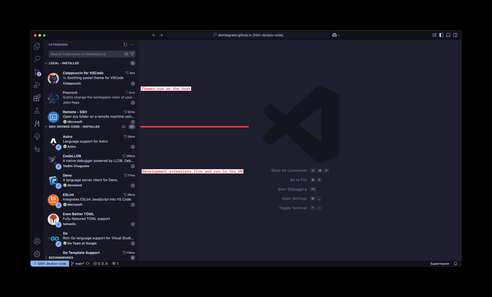
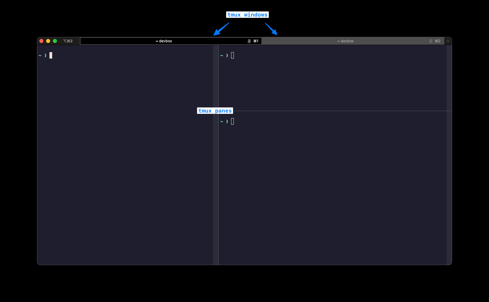
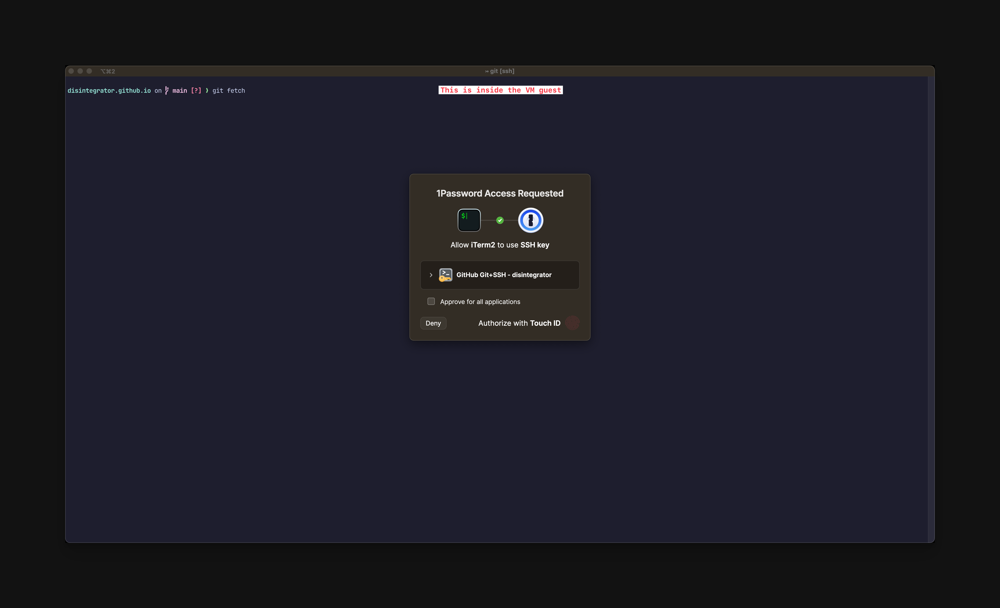

Title: Developing inside a virtual machine

URL Source: https://blog.disintegrator.dev/posts/dev-virtual-machine/

Markdown Content:
Last year, I started a new job at [Speakeasy](https://speakeasy.com/) and with every new job and fresh laptop is an opportunity to revise my workflow. In the past, I experienced first hand how much a development machine can get bogged down when it’s riddled with hundreds of services and homebrew packages and dependencies. All of it contributing to multiple possible attack vectors too.

At Speakeasy, we build code generation for SDKs in multiple languages. At the outset, I knew I needed to install multiple language toolchains and different versions of each as well as countless dependencies. This gave me the necessary nudge to try a new approach for managing my development.

For some time, I had known about Mitchell Hashimoto’s setup in which he works in a VM on his MacBook. I have been working with a similar setup for over a year now and it’s been a fantastic experience.

> I switched my primary dev environment to a graphical NixOS VM on a macOS host. It has been wonderful. I can keep the great GUI ecosystem of macOS, but all dev tools are in a full screen VM. One person said “it basically replaced your terminal app” which is exactly how it feels.
> 
> — Mitchell Hashimoto (@mitchellh) [January 4, 2021](https://twitter.com/mitchellh/status/1346136404682625024?ref_src=twsrc%5Etfw)

My physical machine is a 2023 MacBook Pro with M2 Pro CPU and 32GB of RAM. I wish I went higher on RAM because it would let me run more powerful LLMs locally.

For my virtual machine runner, I’m using VMWare Fusion Pro. It’s practically invisible technology which is the highest praise I can give a piece of software. I don’t know if I’m paying a VM performance tax. It really never feels like it’s the case and I’ve compared build times with colleagues on the same spec machine.

I use Ubuntu 24.04 (arm64 build) as my guest operating system. Quite often I’ve found developers frowning up Ubuntu and preaching for folks to use NixOS, Arch, Debian or other distros. The reality for me was Ubuntu was the fastest way to get set up and now, in the steady state, it’s fallen into the background much like VMWare. I don’t think about it at all.

On the host (macOS), I do not use homebrew or have any other package managers. I simply use iTerm2 to SSH into the development VM and Visual Studio Code for my editor. The remote development extension for VS Code in particular is an incredible feature. **All my editor extensions are installed inside the VM** instead of the host machine. The exceptions being the color scheme I use and the remote extension itself which live on the host alongside the editor.

 

Going back to iTerm2, I use the tmux integration which maps windows and panes to the native GUI. It’s such a smooth experience to working with tmux using keyboard shortcuts I’m familiar with (⌘T for new tabs and ⌘D / ⌘⇧D for horizontal / vertical splits).

 

I think it’s also worth talking about my Git / GitHub workflow. I use an SSH key to authenticate with GitHub and to sign my commits. My private key does not live directly on my host or my guest OS. Instead, it lives in 1Password and is only accessible using my master password or TouchID. What’s super convenient is that I can access the key from within the VM using 1Password’s SSH agent. So any time I `git fetch` or `git commit` I get the native 1Password GUI to unlock and grant access to the key.

 

When I want to access TCP services in the VM, such as development servers and databases, I use Tailscale which creates a nice DNS name for my guest VM that I can access from my host machine (see [MagicDNS](https://tailscale.com/kb/1081/magicdns)). Again, Tailscale is invisible software and I rarely pay attention to it except for when there’s an update.

The positives
-------------

[Section titled The positives](https://blog.disintegrator.dev/posts/dev-virtual-machine/#the-positives)

The experience in macOS day-to-day is flawless. Nothing inside the VM can affect the performance of my overall system. I do not have any command-line tools installed on the host machine and no transitive dependencies of those to worry about cluttering the host. Having most of tools inside the VM has additional security benefits but you can go well beyond what I’ve done and put everything, editor included, inside the VM. I do still use [Little Snitch](https://www.obdev.at/products/littlesnitch/index.html) pedantically to manage network access from various programs inside and outside the VM.

So much of this setup is largely transparent. I minimise the VMWare window and never think about it running in the background. As I mentioned, I don’t experience a performance hit inside the VM and if anything my overall system is very responsive even when heavy builds are running in the VM.

### More on security

[Section titled More on security](https://blog.disintegrator.dev/posts/dev-virtual-machine/#more-on-security)

My current setup wasn’t intended to be a fully isolated sandbox. Running VS Code on macOS and the extensions inside the VM does still present an attack vector through the extension system. An extension can break out to my macOS host through VS Code and the Microsoft team behind the editor has not actually made any explicit claims that remote development over SSH improves security posture. A fellow Hacker News reader/commenter, retsl, has written [a great article](https://lets.re/blog/vscode-remote-dev/) diving deeper into this topic which I would encourage you to read.

VS Code, (neo)vim and any other extensible text editor are an attractive target for attackers because they can hide malicious code in extensions that appear to be useful and trustworthy. It might be a good idea to either disable automatic updates and opt-in to manually for extensions after reviewing or uninstall the ones you don’t use frequently regardless of their apparent trustworthiness. My general recommendation to developers is to always be extra careful about what plugins/extensions you add to your favourite editor.

I am fine with this setup given my requirements and running VS Code on macOS means I get a snappy UI with the native font rendering and retina display support that I love. It’s still worth noting that there is a net positive since I have a lot of tools and code running inside the VM that is going to have a harder time breaking out of the VM boundary and taking over my system.

The negatives
-------------

[Section titled The negatives](https://blog.disintegrator.dev/posts/dev-virtual-machine/#the-negatives)

There are two conveniences I traded away for this setup:

1.  `pbcopy` and `pbpaste` are not available between guest and host. I used to rely on these utilities often but I’ve learned to live without them as most of the time I am working in VS Code and it’s not an issue. In the terminal, I will select text with my mouse and copy it - a minor inconvenience but not a deal breaker.
2.  I don’t use any disk sharing so I rely on [Mountain Duck](https://mountainduck.io/) to mount my VM over SFTP if I need to move files easily within macOS Finder although a lot of the time I can drag and drop files in VS Code.

Overall, I’ve adjusted to these trade-offs since they pop up rarely.

Smooth sailing
--------------

[Section titled Smooth sailing](https://blog.disintegrator.dev/posts/dev-virtual-machine/#smooth-sailing)

I think I’ve struck a very nice balance with my latest setup. Developing in a VM has security and stability benefits that are easy to appreciate when you’re a year or two into using a machine and it’s just humming along free from the mess of development tools and services that have been accumulating. In my case, some of this mess is necessary to develop and test code generation for multiple languages and so containing it was well worth the investment. I’m sure there are more areas I can improve but I’m happy with how it’s turned out.
