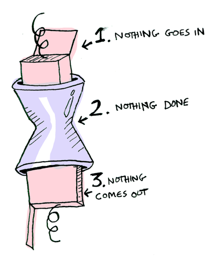

# Functors, Applicatives, And Monads In Pictures - adit.io
[Functors, Applicatives, And Monads In Pictures - adit.io](https://www.adit.io/posts/2013-04-17-functors,_applicatives,_and_monads_in_pictures.html?utm_source=pocket_shared) 

 Contents
--------

*   [Functors](#functors)
*   [Just What Is A Functor, Really?](#just-what-is-a-functor,-really?)
*   [Applicatives](#applicatives)
*   [Monads](#monads)
*   [Conclusion](#conclusion)
*   [Translations](#translations)

Written April 17, 2013

updated: May 20, 2013

Here's a simple value: 

And we know how to apply a function to this value: 

Simple enough. Lets extend this by saying that any value can be in a context. For now you can think of a context as a box that you can put a value in:


Now when you apply a function to this value, you'll get different results **depending on the context**. This is the idea that Functors, Applicatives, Monads, Arrows etc are all based on. The `Maybe` data type defines two related contexts:


```
data Maybe a = Nothing | Just a 
```

In a second we'll see how function application is different when something is a `Just a` versus a `Nothing`. First let's talk about Functors!

Functors
--------

When a value is wrapped in a context, you can't apply a normal function to it:


This is where `fmap` comes in. `fmap` is from the street, `fmap` is hip to contexts. `fmap` knows how to apply functions to values that are wrapped in a context. For example, suppose you want to apply `(+3)` to `Just 2`. Use `fmap`:

```
> fmap (+3) (Just 2)
Just 5 
```


**Bam!** `fmap` shows us how it's done! But how does `fmap` know how to apply the function?

Just what is a Functor, really?
-------------------------------

`Functor` is a [typeclass](http://learnyouahaskell.com/types-and-typeclasses#typeclasses-101). Here's the definition:


A `Functor` is any data type that defines how `fmap` applies to it. Here's how `fmap` works:


So we can do this:

```
> fmap (+3) (Just 2)
Just 5 
```

And `fmap` magically applies this function, because `Maybe` is a Functor. It specifies how `fmap` applies to `Just`s and `Nothing`s:

```
instance Functor Maybe where
    fmap func (Just val) = Just (func val)
    fmap func Nothing = Nothing 
```

Here's what is happening behind the scenes when we write `fmap (+3) (Just 2)`:


So then you're like, alright `fmap`, please apply `(+3)` to a `Nothing`?


```
> fmap (+3) Nothing
Nothing 
```


Like Morpheus in the Matrix, `fmap` knows just what to do; you start with `Nothing`, and you end up with `Nothing`! `fmap` is zen. Now it makes sense why the `Maybe` data type exists. For example, here's how you work with a database record in a language without `Maybe`:

```
post = Post.find_by_id(1)
if post
  return post.title
else
  return nil
end 
```

But in Haskell:

```
fmap (getPostTitle) (findPost 1) 
```

If `findPost` returns a post, we will get the title with `getPostTitle`. If it returns `Nothing`, we will return `Nothing`! Pretty neat, huh? `<$>` is the infix version of `fmap`, so you will often see this instead:

```
getPostTitle <$> (findPost 1) 
```

Here's another example: what happens when you apply a function to a list?


Lists are functors too! Here's the definition:

```
instance Functor [] where
    fmap = map 
```

Okay, okay, one last example: what happens when you apply a function to another function?

Here's a function:


Here's a function applied to another function:


The result is just another function!

```
> import Control.Applicative
> let foo = fmap (+3) (+2)
> foo 10
15 
```

So functions are Functors too!

```
instance Functor ((->) r) where
    fmap f g = f . g 
```

When you use fmap on a function, you're just doing function composition!

Applicatives
------------

Applicatives take it to the next level. With an applicative, our values are wrapped in a context, just like Functors:


But our functions are wrapped in a context too!


Yeah. Let that sink in. Applicatives don't kid around. `Control.Applicative` defines `<*>`, which knows how to apply a function _wrapped in a context_ to a value _wrapped in a context_:


i.e:

```
Just (+3) <*> Just 2 == Just 5 
```

Using `<*>` can lead to some interesting situations. For example:

```
> [(*2), (+3)] <*> [1, 2, 3]
[2, 4, 6, 4, 5, 6] 
```


Here's something you can do with Applicatives that you can't do with Functors. How do you apply a function that takes two arguments to two wrapped values?

```
> (+) <$> (Just 5)
Just (+5)
> Just (+5) <$> (Just 4)
ERROR ??? WHAT DOES THIS EVEN MEAN WHY IS THE FUNCTION WRAPPED IN A JUST 
```

Applicatives:

```
> (+) <$> (Just 5)
Just (+5)
> Just (+5) <*> (Just 3)
Just 8 
```

`Applicative` pushes `Functor` aside. "Big boys can use functions with any number of arguments," it says. "Armed `<$>` and `<*>`, I can take any function that expects any number of unwrapped values. Then I pass it all wrapped values, and I get a wrapped value out! AHAHAHAHAH!"

```
> (*) <$> Just 5 <*> Just 3
Just 15 
```

And hey! There's a function called `liftA2` that does the same thing:

```
> liftA2 (*) (Just 5) (Just 3)
Just 15 
```

Monads
------

How to learn about Monads:

1.  Get a PhD in computer science.
2.  Throw it away because you don't need it for this section!

Monads add a new twist.

Functors apply a function to a wrapped value:


Applicatives apply a wrapped function to a wrapped value:


Monads apply a function **that returns a wrapped value** to a wrapped value. Monads have a function `>>=` (pronounced "bind") to do this.

Let's see an example. Good ol' `Maybe` is a monad:


Suppose `half` is a function that only works on even numbers:

```
half x = if even x
           then Just (x `div` 2)
           else Nothing 
```


What if we feed it a wrapped value?


We need to use `>>=` to shove our wrapped value into the function. Here's a photo of `>>=`:


Here's how it works:

```
> Just 3 >>= half
Nothing
> Just 4 >>= half
Just 2
> Nothing >>= half
Nothing 
```

What's happening inside? `Monad` is another typeclass. Here's a partial definition:

```
class Monad m where
    (>>=) :: m a -> (a -> m b) -> m b 
```

Where `>>=` is:


So `Maybe` is a Monad:

```
instance Monad Maybe where
    Nothing >>= func = Nothing
    Just val >>= func  = func val 
```

Here it is in action with a `Just 3`!


And if you pass in a `Nothing` it's even simpler:



You can also chain these calls:

```
> Just 20 >>= half >>= half >>= half
Nothing 
```


Cool stuff! So now we know that `Maybe` is a `Functor`, an `Applicative`, and a `Monad`.

Now let's mosey on over to another example: the `IO` monad:


Specifically three functions. `getLine` takes no arguments and gets user input:


`readFile` takes a string (a filename) and returns that file's contents:


```
readFile :: FilePath -> IO String 
```

`putStrLn` takes a string and prints it:


```
putStrLn :: String -> IO () 
```

All three functions take a regular value (or no value) and return a wrapped value. We can chain all of these using `>>=`!


```
getLine >>= readFile >>= putStrLn 
```

Aw yeah! Front row seats to the monad show!

Haskell also provides us with some syntactical sugar for monads, called `do` notation:

```
foo = do
    filename <- getLine
    contents <- readFile filename
    putStrLn contents 
```

Conclusion
----------

1.  A functor is a data type that implements the `Functor` typeclass.
2.  An applicative is a data type that implements the `Applicative` typeclass.
3.  A monad is a data type that implements the `Monad` typeclass.
4.  A `Maybe` implements all three, so it is a functor, an applicative, _and_ a monad.

What is the difference between the three?


*   **functors:** you apply a function to a wrapped value using `fmap` or `<$>`
*   **applicatives:** you apply a wrapped function to a wrapped value using `<*>` or `liftA`
*   **monads:** you apply a function that returns a wrapped value, to a wrapped value using `>>=` or `liftM`

So, dear friend (I think we are friends by this point), I think we both agree that monads are easy and a SMART IDEA(tm). Now that you've wet your whistle on this guide, why not pull a Mel Gibson and grab the whole bottle. Check out LYAH's [section on Monads](http://learnyouahaskell.com/a-fistful-of-monads). There's a lot of things I've glossed over because Miran does a great job going in-depth with this stuff.

Translations
------------

This post has been translated into:

Human languages:

*   [Chinese](https://sxyz.blog/functors-applicatives-and-monads-in-pictures/)
*   [Another Chinese translation](http://blog.forec.cn/2017/03/02/translation-adit-faamip/)
*   [Chinese, Kotlin](https://hltj.me/kotlin/2017/08/25/kotlin-functor-applicative-monad-cn.html)
*   [German](https://github.com/madnight/monad-in-pictures-german)
*   [Japanese](http://qiita.com/suin/items/0255f0637921dcdfe83b)
*   [Korean](http://lazyswamp.tistory.com/entry/functorsapplicativesandmonadsinpictures)
*   [Portuguese](https://medium.com/@julianoalves/functors-applicatives-e-monads-explicados-com-desenhos-2c45d5db7d25#.oxtev31qu)
*   [Russian](http://habrahabr.ru/post/183150/)
*   [Spanish](https://medium.com/@miguelsaddress/funtores-aplicativos-y-m%C3%B3nadas-en-im%C3%A1genes-21ab0e60fe23#.azxc90mox)
*   [Turkish](http://rimbi.github.io/functors-applicatives-monads-in-pictures.html)
*   [Vietnamese](http://zinh.github.io/haskell/2015/09/16/functors-applicatives-monads-in-pictures.html)
*   [Italian](https://norangeb.it/posts/functors-applicatives-and-monads-in-pictures/)

Programming languages:

*   [Javascript](https://medium.com/@tzehsiang/javascript-functor-applicative-monads-in-pictures-b567c6415221#.rdwll124i)
*   [Python](https://github.com/dbrattli/OSlash/wiki/Functors,-Applicatives,-And-Monads-In-Pictures)
*   [Swift](http://www.mokacoding.com/blog/functor-applicative-monads-in-pictures)
*   [Kotlin](https://hltj.me/kotlin/2017/08/25/kotlin-functor-applicative-monad.html). This author also translated this Kotlin version into [Chinese](https://hltj.me/kotlin/2017/08/25/kotlin-functor-applicative-monad-cn.html).
*   [Kotlin (translated from the Swift translation)](https://medium.com/@aballano/kotlin-functors-applicatives-and-monads-in-pictures-part-1-3-c47a1b1ce251)
*   [Elm](https://medium.com/@l.mugnaini/functors-applicatives-and-monads-in-pictures-784c2b5786f7)
*   [TypeScript](https://adueck.github.io/blog/functors-applicatives-and-monads-with-pictures-in-typescript/)
*   [Java](https://skopylov58.github.io/monads-in-pictures-in-java/)

If you translate this post, [send me an email](http://www.adit.io/) and I'll add it to this list!

For more monads and pictures, check out [three useful monads](https://www.adit.io/posts/2013-06-10-three-useful-monads.html).