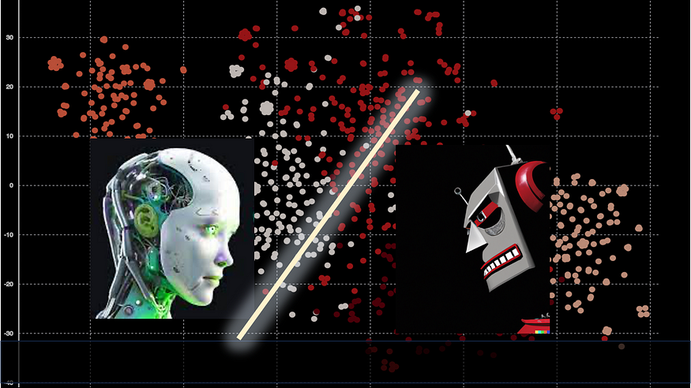
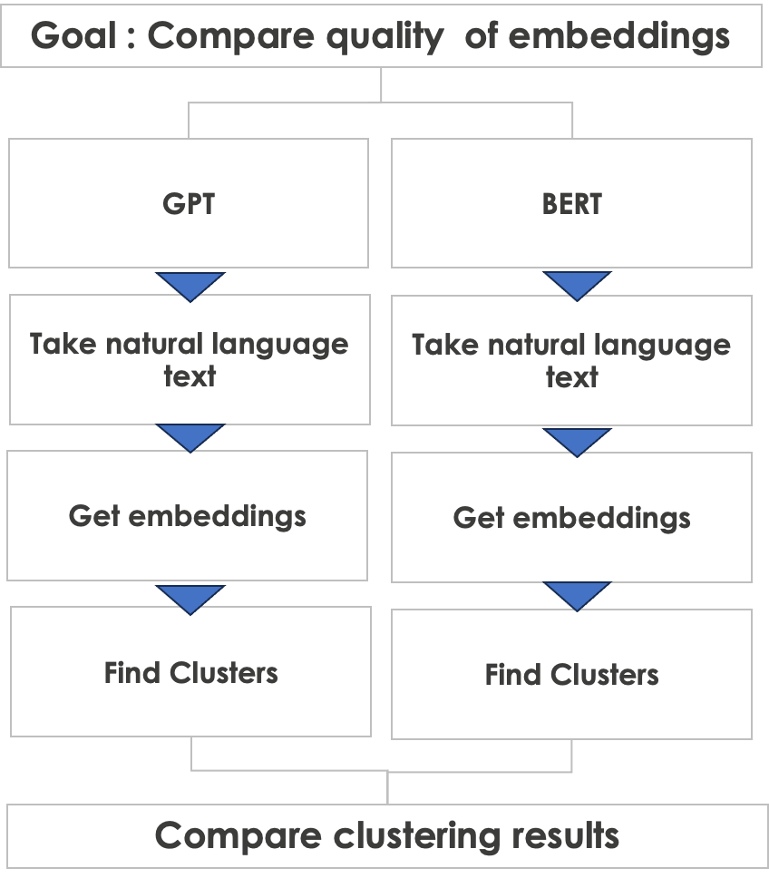
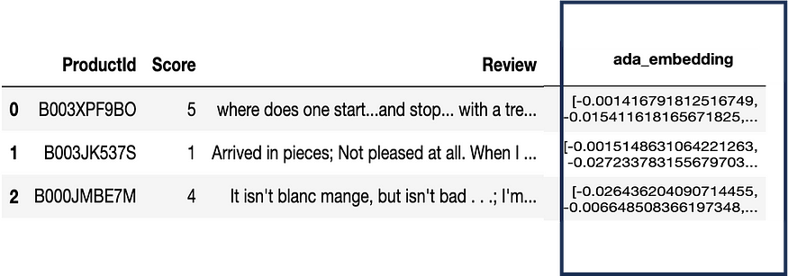
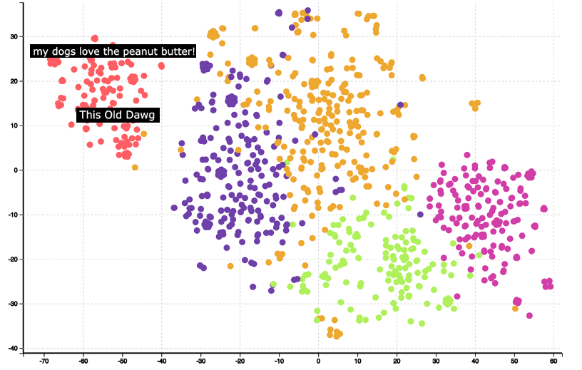
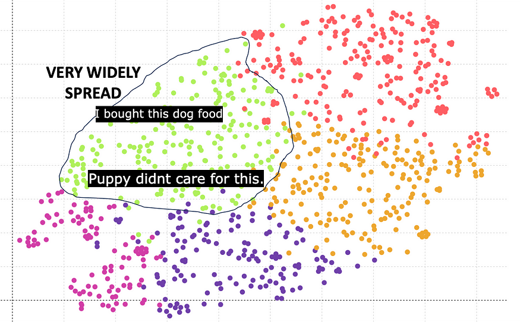
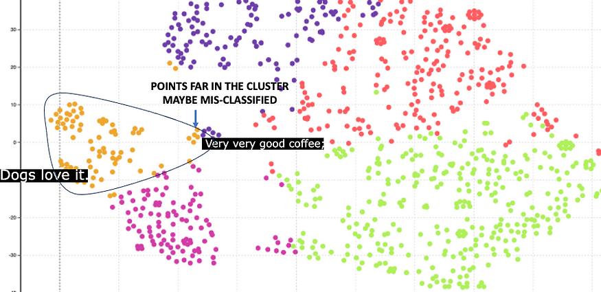
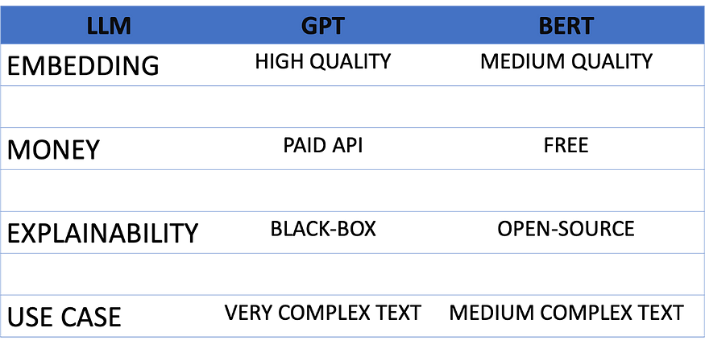

# GPT vs BERT: Which is Better?. Comparing two large-language models… | by Pranay Dave | Jun, 2023 | Towards Data Science --- GPT vs 伯特：哪个更好？比较两个大语言模型... |作者：普拉奈·戴夫 |6月， 2023 |迈向数据科学
Comparing two large-language models: Approach and example  
比较两种大语言模型：方法和示例
---------------------------------------------------------------------------

[


](https://pranay-dave9.medium.com/?source=post_page-----2f1cf92af21a--------------------------------)[


](https://towardsdatascience.com/?source=post_page-----2f1cf92af21a--------------------------------)



Image created by DALLE and PPT by author ([https://labs.openai.com/s/qQgpAQbLi0srYlZHOHQjGKWh](https://labs.openai.com/s/qQgpAQbLi0srYlZHOHQjGKWh))  
图片由DALLE和PPT由作者创建（https://labs.openai.com/s/qQgpAQbLi0srYlZHOHQjGKWh）

The rise in popularity of generative AI has also led to an increase in the number of large language models. In this story, I will make a comparison between two of them: GPT and BERT. GPT (Generative Pre-trained Transformer) is developed by OpenAI and is based on decoder-only architecture. On the other hand, BERT (Bidirectional Encoder Representations from Transformers) is developed by Google and is an encoder-only pre-trained model  
生成式人工智能的普及也导致了大型语言模型数量的增加。在这个故事中，我将对其中两个进行比较：GPT 和 BERT。GPT（生成预训练转换器）由OpenAI开发，基于仅解码器架构。另一方面，BERT（来自变压器的双向编码器表示）由Google开发，是一个仅编码器预训练模型。

Both are technically different, but, they have a similar objective — to perform natural language processing tasks. Many articles compare the two from a technical point of view. However, in this story, I would compare them based on the quality of their objective, which is natural language processing.  
两者在技术上是不同的，但它们有一个相似的目标——执行自然语言处理任务。许多文章从技术角度比较了两者。但是，在这个故事中，我会根据它们的目标（即自然语言处理）的质量来比较它们。

How to compare two completely different technical architectures? GPT is decoder-only architecture and BERT is encoder-only architecture. So a technical comparison of a decoder-only vs encoder-only architecture is like comparing Ferrari vs Lamborgini — both are great but with completely different technology under the chassis.  
如何比较两种完全不同的技术架构？GPT 是仅解码器的架构，而 BERT 是仅编码器的架构。因此，仅解码器与仅编码器架构的技术比较就像比较法拉利与兰博吉尼一样——两者都很棒，但底盘下的技术完全不同。

However, we can make a comparison based on the quality of a common natural language task that both can do — which is the generation of embeddings. The embeddings are vector representations of a text. The embeddings form the basis of any natural language processing task. So if we can compare the quality of embeddings, then it can help us judge the quality of natural language tasks, as embeddings are foundational for natural language processing by transformer architecture.  
但是，我们可以根据双方都可以执行的共同自然语言任务的质量进行比较，即嵌入的生成。嵌入是文本的向量表示。嵌入构成了任何自然语言处理任务的基础。因此，如果我们能够比较嵌入的质量，那么它可以帮助我们判断自然语言任务的质量，因为嵌入是转换器架构自然语言处理的基础。

Shown below is the comparison approach which I will take.  
下面显示的是我将采取的比较方法。



Comparison approach (image by author)  
比较方法（图片来自作者）

I made a toss of a coin, and GPT won the toss! So let us start with GPT first. I will take text from Amazon's fine food reviews dataset. Reviews are a good way to test both models, as reviews are expressed in natural language and are very spontaneous. They encompass the feeling of customers, and can contain all types of languages — good, bad, the ugly! In addition, they can have many misspelled words, emojis as well as commonly used slang.  
我掷硬币，GPT赢了！因此，让我们先从 GPT 开始。我将从亚马逊的美食评论数据集中获取文本。评论是测试这两种模型的好方法，因为评论是用自然语言表达的，并且非常自发。它们包含了客户的感觉，可以包含所有类型的语言——好的、坏的、丑陋的！此外，它们可能有许多拼写错误的单词、表情符号以及常用的俚语。

Here is an example of the review text.  
下面是评论文本的示例。


Example of a customer review (image by author)  
买家评论示例（图片来源：作者）

In order to get the embeddings of the text using GPT, we need to make an API call to OpenAI. The result is embedding or vector of size of 1540 for each text. Here is a sample data which includes the embeddings.  
为了使用 GPT 获取文本的嵌入，我们需要对 OpenAI 进行 API 调用。结果是每个文本的嵌入或大小为 1540 的向量。下面是包含嵌入的示例数据。



Embeddings obtained from model (image by author)  
从模型获得的嵌入（图片来自作者）

The next step is clustering and visualization. One can use KMeans to cluster the embedding vector and use TSNE to reduce the 1540 dimensions to 2 dimensions. Shown below are the results after clustering and dimensionality reduction.  
下一步是聚类和可视化。可以使用 KMean 对嵌入向量进行聚类，并使用 TSNE 将 1540 维减少到 2 维。下面显示了聚类和降维后的结果。



GPT embedding clustering (image by author)  
GPT 嵌入聚类分析（图片来自作者）

One can observe that the clusters are very well formed. Hovering over some of the clusters can help understand the meaning of the clusters. For example, the red cluster is related to dog food. Further analysis also shows that GPT embeddings have correctly identified that the word ‘Dog’ and ‘Dawg’ are similar and placed them in the same cluster.  
可以观察到集群的形成非常好。将鼠标悬停在某些聚类上有助于理解聚类的含义。例如，红色聚类与狗粮有关。进一步的分析还表明，GPT 嵌入已经正确识别出单词“Dog”和“Dawg”是相似的，并将它们放在同一个集群中。

Overall, GPT embeddings give good results as indicated by the quality of clustering.  
总体而言，GPT 嵌入提供了良好的结果，如聚类质量所示。

Can BERT perform better? Let us find out. There are multiple versions of the BERT model such as bert-base-case, bert-base-uncased, etc.. Essentially they have different embedding vector sizes. Here is the result based on Bert base which has an embedding size of 768.  
伯特能表现得更好吗？让我们来了解一下。BERT模型有多个版本，例如bert-base-case，bert-base-uncased等。本质上，它们具有不同的嵌入向量大小。这是基于 Bert 基础的结果，其嵌入大小为 768。



BERT embedding (768) clustering (image by author)  
BERT嵌入（768）聚类（图片来自作者）

The green cluster corresponds to dog food. However one can observe that the clusters are widely spread and not very compact compared to GPT. The main reason is that the embedding vector length of 768 is inferior compared to the embedding vector length of 1540 of GPT.  
绿色簇对应于狗粮。然而，人们可以观察到，与GPT相比，集群分布广泛，不是很紧凑。主要原因是 768 的嵌入向量长度不如 GPT 的嵌入向量长度 1540。

Fortunately, BERT also offers a higher embedding size of 1024. Here are the results.  
幸运的是，BERT还提供了更高的嵌入大小1024。以下是结果。



BERT embedding (1024) clustering (image by author)  
BERT嵌入（1024）聚类（图片来自作者）

Here the orange cluster corresponds to dog food. The cluster is relatively compact, which is a better result compared to the embedding of 768. However, there are some points which are far away from the center. These points are incorrectly classified. For example, there is a review for coffee, but it has got incorrectly classified as dog food because it has got a word Dog in it.  
这里的橙色簇对应于狗粮。集群相对紧凑，与 768 的嵌入相比，这是一个更好的结果。但是，有些点远离中心。这些点被错误地分类。例如，有一个关于咖啡的评论，但它被错误地归类为狗粮，因为它里面有一个单词狗。

Clearly, GPT does a better job and provides higher-quality embeddings compared to BERT. However, I would not like to give all credit to GPT as there are other aspects to the comparison. Here is a summary table  
显然，与 BERT 相比，GPT 做得更好，并且提供了更高质量的嵌入。但是，我不想将所有功劳都归功于 GPT，因为比较还有其他方面。下面是一个汇总表



GPT wins over BERT for the embedding quality provided by the higher embedding size. However, GPT required a paid API, while BERT is free. In addition, the BERT model is open-source, and not black-box so you can make further analysis to understand it better. The GPT models from OpenAI are black-box.  
GPT 赢得了 BERT 的更高嵌入大小提供的嵌入质量。但是，GPT 需要一个付费的 API，而 BERT 是免费的。此外，BERT模型是开源的，而不是黑盒，因此您可以进行进一步的分析以更好地理解它。OpenAI的GPT模型是黑盒。

In conclusion, I would recommend using BERT for medium complex text such as web pages or books which have curated text. GPT can be used for very complex text such as customer reviews which are completely in natural language and not curated.  
总之，我建议将BERT用于中等复杂的文本，例如具有精选文本的网页或书籍。GPT 可用于非常复杂的文本，例如完全使用自然语言且未经策划的客户评论。

Here is a Python code snippet that implements the process described in the story. For illustration, I have given GPT example. The BERT one is similar.  
下面是一个 Python 代码片段，它实现了故事中描述的过程。为了说明，我给出了 GPT 示例。BERT是类似的。

```
  
  
import openai  
import pandas as pd  
import re  
import contextlib  
import io  
import tiktoken  
from openai.embeddings_utils import get_embedding  
from sklearn.cluster import KMeans  
from sklearn.manifold import TSNE

  
file_name = 'path\_to\_file'  
df = pd.read\_csv(file\_name)

  
embedding_model = "text-embedding-ada-002"  
embedding_encoding = "cl100k_base"    
max_tokens = 8000    
top_n = 1000  
encoding = tiktoken.get\_encoding(embedding\_encoding)  
col_embedding = 'embedding'  
n_tsne=2  
n_iter = 1000

  
def get_embedding(text, model):  
  openai.api_key = "YOUR\_OPENAPI\_KEY"  
  text = text.replace("\\n", " ")  
  return openai.Embedding.create(input = \[text\], model=model)\['data'\]\[0\]\['embedding'\]

col_txt = 'Review'  
df\["n_tokens"\] = df\[col_txt\].apply(lambda x: len(encoding.encode(x)))  
df = df\[df.n\_tokens <= max\_tokens\].tail(top_n)  
df = df\[df.n_tokens > 0\].reset_index(drop=True)   
df\[col\_embedding\] = df\[col\_txt\].apply(lambda x: get_embedding(x, model='text-embedding-ada-002'))  
matrix = np.array(df\[col\_embedding\].to\_list())

  
kmeans\_model = KMeans(n\_clusters=n\_clusters,random\_state=0)  
kmeans = kmeans_model.fit(matrix)  
kmeans_clusters = kmeans.predict(matrix)

  
tsne\_model = TSNE(n\_components=n_tsne, verbose=0, random_state=42, n\_iter=n\_iter,init='random')  
tsne\_out = tsne\_model.fit_transform(matrix)


```

The dataset is available here with license CC0 Public domain. [**Both commercial and non-commercial use of it is permitted**](https://www.ibm.com/community/terms-of-use/download/)**.**  
数据集可在此处获得许可证 CC0 公共域。允许将其用于商业和非商业用途。

Please **subscribe** to stay informed whenever I release a new story.  
请订阅，以便在我发布新故事时随时了解情况。

You can also **join Medium** with my referral link  
您也可以通过我的推荐链接加入Medium

You can visit my website to make analytics with zero coding. [**https://experiencedatascience.com**](https://experiencedatascience.com/)  
您可以访问我的网站，以零编码进行分析。https://experiencedatascience.com

Please visit my YouTube channel to learn data science and AI use cases using demos  
请访问我的 YouTube 频道，使用演示学习数据科学和 AI 用例