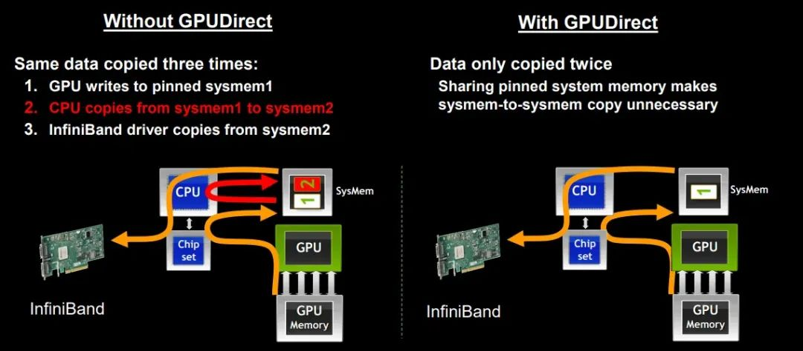
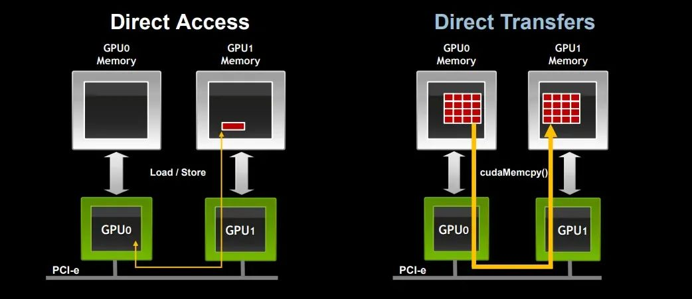
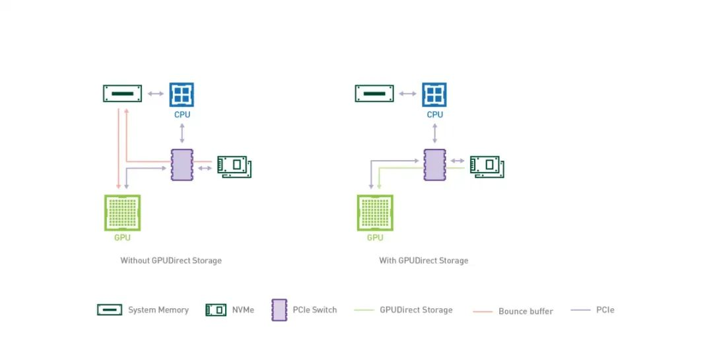
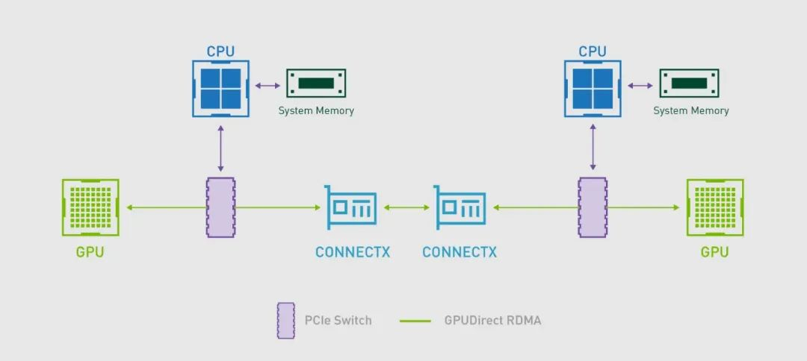
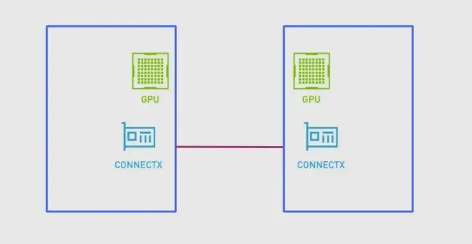
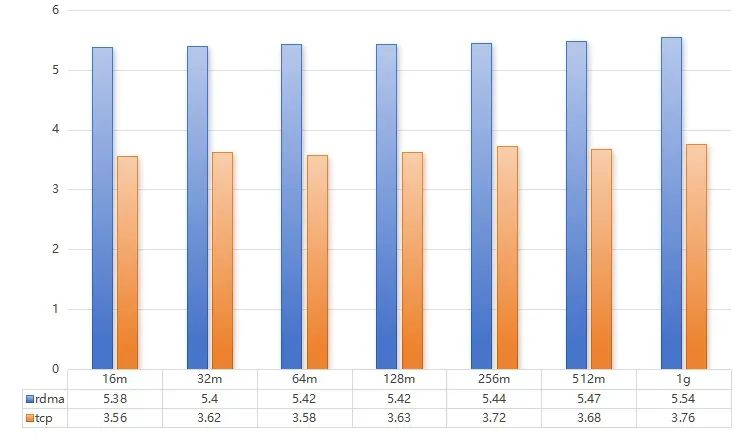

GPU Direct RDMA 技术解析与实践
===============
                                                                          

             

  


GPU Direct RDMA 技术解析与实践
=======================

Original Explorer [SDNLAB](javascript:void(0);)


SDNLAB

江苏致网科技有限公司

SDNLAB是专注网络创新技术的先锋媒体社区和实践应用平台，涵盖AI 网络、DPU/智能网卡、SD-WAN/SASE、Web3.0、零信任、云网融合等相关领域，提供新闻资讯、技术交流、在线实验、行业分析、求职招聘、教育培训等多元服务。

1241篇原创内容

_2025年02月27日 07:31_


**作者简介：**Explorer，专注于高性能网络、虚拟化网络及网卡的测试方案研究。熟悉DPDK，RDMA，SDN等技术的应用与解决方案。

  

**引言**

最近Deepseek火爆全球，在大模型技术快速推进的当下，千亿级参数模型对算力系统提出了前所未有的挑战。这类模型的训练与推理已远非单点算力所能承载，其背后是数以万计GPU集群的协同计算，每一次迭代都涉及TB级张量数据的传输与同步。然而，当算力规模呈指数级膨胀时GPU间的通信效率至关重要。

以DeepSeek MoE架构为例，其动态路由机制需在毫秒级完成数百GPU的梯度同步，而传统通信模式下，CPU中转与主机内存带宽限制使得显存资源陷入受限闲置。当模型规模向万亿参数扩展时，通信延迟甚至可能成为制约算力扩展的瓶颈。

GPU Direct RDMA技术的出现，正是为了解决超大规模AI模型在分布式训练中面临的数据传输瓶颈问题。通过允许GPU显存与高速网络设备（如InfiniBand/RoCE网卡）直接交互，它消除了传统通信路径中CPU和主机内存的中转开销，实现了跨节点GPU间的零拷贝数据传输。这种底层架构的革新，使得分布式训练中的梯度同步、参数更新等关键操作能够以接近硬件理论带宽的速率完成，从而将通信延迟对整体计算效率的影响降至最低。

  

**1、常见的GPU互联技术概述**

**1.1 PCIe**

PCIe是一种高速串行计算机扩展总线标准，用于连接计算机内部的各种硬件设备，如显卡、网卡、存储设备等。PCIe 取代了早期的 PCI、PCI-X 和 AGP 总线标准，提供了更高的带宽和更低的延迟。

PCIe 提供高带宽、低延迟、灵活的通道配置和广泛的兼容性，使其成为多 GPU 互联的理想选择。但是PCIe 在多 GPU 系统中可能面临带宽瓶颈、通道限制、额外延迟、功耗增加以及兼容性问题。

**1.2 NVLink**

NVLink 是 NVIDIA 开发的一种高速互联技术，专门用于连接多个 GPU 或 GPU 与 CPU 之间的高速数据传输。与传统的 PCIe 技术相比，NVLink 提供了更高的带宽和更低的延迟，尤其适用于高性能计算（HPC）、AI 训练和多 GPU 系统。

NVLink 在 GPU 互联技术中提供了超高带宽和低延迟的优势，如Figure1所示，第五代NVLink支持高到1800GB/s的带宽，支持高效的多 GPU 协作，但成本高昂，作为NVIDIA的私有协议，生态封闭，兼容性有限、硬件要求高且功耗较大。


Figure 1 NVlink

**1.3 NVSwitch**

NVSwitch 也是 NVIDIA 开发的一种高速互联技术，专门用于大规模多 GPU 系统。它基于 NVLink 技术，但通过交换机（Switch）将多个 GPU 连接在一起，形成一个高性能的 GPU 网络。NVSwitch 的出现是为了解决 NVLink 在大规模多 GPU 系统中的局限性，尤其是在需要极高带宽和低延迟的场景。

Figure 2是多GPU并行计算时，分别使用点对点方式和使用NVswitch方式的组网图。


Figure 2 NVSwitch组网

在点对点设计中，虽然不需要4个switch的成本投入，但每个GPU必须将900GB/s的总连接带宽拆分为7个专用的128 GB/s点对点连接，和系统中其他的GPU进行连接，GPU之间的带宽如Figure3。


Figure 3

NVSwitch的成本极其高昂，硬件要求苛刻，功耗较大，且仅限于 NVIDIA 的高端系统，主要适用于 AI 训练、HPC 和数据中心等专业领域，普通用户或中小型企业难以负担。

**1.4 Infinity Fabric (AMD)**

Infinity Fabric是AMD开发的一种高带宽、低延迟的互连技术，最初用于连接CPU内部的多个核心模块（如Ryzen处理器中的CCX），后来扩展到GPU和加速器领域，成为AMD多芯片协同设计的核心技术。AMD推出支持CDNA架构（计算专用架构）的MI系列加速卡（如MI100、MI210）支持Infinity Fabric互联，提供比PCIe更高的带宽，Infinity Fabric链路峰值带宽达100GB/S，减少多卡通信延迟，适用于AI训练和科学计算。

与NVIDIA NVLink类似，但AMD更强调与自家CPU（如EPYC）的协同，形成CPU-GPU统一架构。

**1.5 GPU Direct**

2011年Nvidia发布的CUDA 4.0首次引入GPU Direct技术，其核心思想为以下两点：绕过CPU中转，允许GPU与其他设备（GPU/网卡/存储）直接交换数据，减少拷贝次数；统一虚拟地址空间，GPU可直接访问其他设备的物理内存，简化编程模型。

如Figure 4所示，GPU Direct通过共享内存的方式实现多 GPU 之间的高效数据交换。减少了数据传输中的复制次数，从原本需要三次数据复制减少到仅需要两次复制，从而有效提高了数据传输效率，降低了延迟并减轻了 CPU 负担。



Figure 4

**1.5.1 GPU Direct P2P**

GPU Direct P2P（Peer-to-Peer）技术是一种允许GPU之间直接通信的技术，无需通过CPU或系统内存中转数据。Direct Access 和 Direct Transfers 是其实现的两种重要的通信机制。Direct Access 允许一个 GPU 直接访问另一个 GPU 的内存，而无需经过 CPU 或主机内存。Direct Transfers 指的是在 GPU 之间直接传输数据，数据不需要先经过 CPU 或主机内存。与 Direct Access 类似，这也是一种减少中间步骤、提高数据传输效率的机制。



Figure 5

**1.5.2 GPU Direct Storage**

随着人工智能（AI）、高性能计算（HPC）以及数据分析领域的数据集规模持续扩大，数据加载时间逐渐成为影响应用性能的关键瓶颈。GPU的应用越来越被缓慢的IO（将数据从存储加载到GPU内存进行处理的过程）所影响。

GPUDirect Storage 为本地或远程存储（如NVMe或基于网络的NVMe-oF）与GPU显存之间建立了一条直接数据通路。它避免了通过CPU内存中的临时缓冲区进行额外拷贝，通过网卡或存储设备的直接内存访问（DMA）引擎，将数据沿直达路径移入或移出GPU显存，整个过程完全无需消耗CPU资源。



Figure 6 GPU Direct Storage

如Figure 6所示，GPU 内存和 NVMe 驱动器之间的标准路径使用系统内存中挂起的反弹缓冲区 CPU 。通过完全跳过 CPU ，来自存储器的直接数据路径获得了更高的带宽。

**1.5.3 GPU Direct RDMA**

如Figure 7所示，GPU Direct RDMA 允许 GPU 直接访问 RDMA 网络设备中的数据，无需通过主机内存或 CPU 。这意味着，GPU 可以直接与网络设备进行数据交换，避免了数据在主机内存中的复制，提高了数据传输的带宽利用率。此外，GPU Direct RDMA 还支持零拷贝（zero-copy）功能，这对于需要高性能通信的应用程序，如分布式训练和高性能计算，具有重要意义。通过减少数据复制次数，GPU Direct RDMA 能够进一步降低通信延迟，提升整体性能。



Figure 7 GPU Direct RDMA

需要注意的是，要想使用GPU Direct RDMA，需要确保GPU卡和RDMA网卡在同一个RC（root complex）下。此外，使用GPU Direct RDMA需要相应的硬件支持和驱动程序支持。

总之，GPU Direct RDMA通过直接在GPU和RDMA网络设备之间进行数据传输，绕过了主机内存和CPU，从而显著降低了通信延迟，提升了数据传输速度，对于高性能计算和分布式训练等应用具有重要意义。

  

**2、GPU Direct RDMA的应用场景**

**2.1 分布式深度学习训练**

在大规模深度学习训练中，特别是像 BERT、GPT 以及Deepseek等模型训练时，通常需要多机多卡协同工作。这时，GPU之间需要频繁交换梯度信息、更新参数等。

数据需要在多个GPU或多个节点间频繁交换。传统的数据传输方式通常依赖CPU或内存进行中转，这会导致传输延迟、带宽不足，严重影响训练效率。GPU Direct RDMA通过避免CPU参与数据传输，直接通过RDMA网络设备进行数据传输，极大减少了延迟和带宽瓶颈，提升了深度学习训练的效率，尤其是在大规模数据并行训练时。

**2.2 大规模并行计算和高性能计算**

在高性能计算中，多个GPU需要协同工作进行复杂的科学计算、模拟、建模等任务。例如，天气模拟、分子动力学模拟、量子力学模拟等，这些任务都依赖于大量的并行计算，并需要高效的数据交换和协调。

这些计算任务需要大规模的数据交换和高带宽的数据传输。如果使用传统的CPU 协调和内存传输，会带来瓶颈，导致计算效率降低。GPU Direct RDMA通过直接在GPU之间和网络设备间传输数据，避免了系统内存和CPU的参与，显著提高了数据传输的速度和计算的并行性，优化了HPC应用的性能。

**2.3 云计算和大规模数据中心**

在云计算环境和大规模数据中心中，多租户系统通常会利用大量的GPU资源来提供计算服务，尤其是机器学习、深度学习推理和训练的需求越来越高。在这种环境下，多个节点上的GPU必须高效地共享资源并交换数据。

随着GPU数量的增加，节点之间的数据传输变得更加频繁和复杂，传统的数据传输方式无法满足低延迟、高带宽的要求。GPU Direct RDMA能够通过RDMA网络适配器直接在不同节点的GPU之间传输数据，减少了系统内存的占用，并且支持零拷贝，提升了云计算平台的计算性能和资源利用率。

  

**3、GPU Direct RDMA测试实验**

**硬件环境**

<table><tbody><tr><td width="96.33333333333333" valign="top" style="word-break: break-all;"><span style="font-size: 15px;letter-spacing: 0.578px;">类型</span></td><td width="382.3333333333333" valign="top" style="word-break: break-all;"><span style="font-size: 15px;letter-spacing: 0.578px;">型号</span></td></tr><tr><td width="76.33333333333333" valign="top" style="word-break: break-all;"><span style="font-size: 15px;letter-spacing: 0.578px;">GPU</span></td><td width="382.3333333333333" valign="top" style="word-break: break-all;"><span style="font-size: 15px;letter-spacing: 0.578px;">Nvidia RTX A5000&#160;</span></td></tr><tr><td width="96.33333333333333" valign="top" style="word-break: break-all;"><span style="font-size: 15px;letter-spacing: 0.578px;">网卡</span></td><td width="382.3333333333333" valign="top" style="word-break: break-all;"><span style="font-size: 15px;letter-spacing: 0.578px;">Mellanox CX-5</span></td></tr><tr><td width="96.33333333333333" valign="top" style="word-break: break-all;"><span style="font-size: 15px;letter-spacing: 0.578px;">CPU&#160;</span></td><td width="382.3333333333333" valign="top" style="word-break: break-all;"><span style="font-size: 15px;letter-spacing: 0.578px;">Intel(R) Xeon(R) Silver 4210 CPU @ 2.20GHz</span></td></tr></tbody></table>

**软件环境**

<table><tbody><tr><td width="268.33333333333337" valign="top" style="word-break: break-all;"><span style="font-size: 15px;letter-spacing: 0.578px;">类型</span></td><td width="230.33333333333331" valign="top" style="word-break: break-all;"><span style="font-size: 15px;letter-spacing: 0.578px;">版本</span></td></tr><tr><td width="268.33333333333337" valign="top" style="word-break: break-all;"><span style="font-size: 15px;letter-spacing: 0.578px;">OS</span></td><td width="230.33333333333331" valign="top" style="word-break: break-all;"><span style="font-size: 15px;letter-spacing: 0.578px;">Ubuntu22.04</span></td></tr><tr><td width="268.33333333333337" valign="top" style="word-break: break-all;"><span style="font-size: 15px;letter-spacing: 0.578px;">Kernel</span></td><td width="230.33333333333331" valign="top" style="word-break: break-all;"><span style="font-size: 15px;letter-spacing: 0.578px;">5.15</span></td></tr><tr><td width="268.33333333333337" valign="top" style="word-break: break-all;"><span style="font-size: 15px;letter-spacing: 0.578px;">Nvidia驱动</span></td><td width="230.33333333333331" valign="top" style="word-break: break-all;"><span style="font-size: 15px;letter-spacing: 0.578px;">550.120</span></td></tr><tr><td width="248.33333333333334" valign="top" style="word-break: break-all;"><span style="font-size: 15px;letter-spacing: 0.578px;">CUDA</span></td><td width="230.33333333333331" valign="top" style="word-break: break-all;"><span style="font-size: 15px;letter-spacing: 0.578px;">12.2.2</span></td></tr><tr><td width="268.33333333333337" valign="top" style="word-break: break-all;"><span style="font-size: 15px;letter-spacing: 0.578px;">NCCL</span></td><td width="230.33333333333331" valign="top" style="word-break: break-all;"><span style="font-size: 15px;letter-spacing: 0.578px;">2.21.5</span></td></tr><tr><td width="268.33333333333337" valign="top" style="word-break: break-all;"><span style="font-size: 15px;letter-spacing: 0.578px;">OpenMPI&#160;</span></td><td width="230.33333333333331" valign="top" style="word-break: break-all;"><span style="font-size: 15px;letter-spacing: 0.578px;">4.16</span></td></tr><tr><td width="269" valign="top" style="word-break: break-all;"><span style="font-size: 15px;letter-spacing: 0.578px;">NCCL-Test</span></td><td width="269" valign="top" style="word-break: break-all;"><span style="font-size: 15px;letter-spacing: 0.578px;">2.13.10</span></td></tr></tbody></table>

**实验拓扑**

拓扑如Figure 8，两台服务器各搭载一张Nvidia RTX A5000（GPU）和一张CX-5（RDMA NIC），实际的生产环境测试中应引入多层的网络拓扑和流控机制结合测试。



Figure 8实验拓扑

**环境安装**

Nvidia驱动：支持 GPU 工作的基础驱动。

```
[root@localhost ~]# nvidia-smi
```

CUDA：并行计算的编程模型和平台。

```
[root@localhost ~]# nvcc --version
```

OpenMPI：用于高性能计算的消息传递框架。

```
[root@localhost ~]# mpiexec --version
```

NCCL：是专为多 GPU 和分布式系统设计的集体通信库，主要用于深度学习和高性能计算应用中的数据传输。

All-Reduce：所有参与的设备（GPU）将各自的数据发送到其他设备，并对接收到的数据进行归约操作（如求和、求最大值等），最终每个设备都将获得相同的结果。


Broadcast：将一个设备的数据广播到所有其他参与设备。只有一个设备提供数据，其它设备接收该数据的副本。


Reduce：将所有参与设备的数据按照指定的操作（例如求和）聚合到一个指定的设备上。其他设备的数据将被丢弃。


AllGather：所有参与设备的数据都被收集到每个设备上，每个设备最终会得到所有其他设备的数据副本。


ReduceScatter：将所有参与设备的数据聚合到一个设备上后，再将结果分散到每个设备。每个参与设备将获得聚合结果的一部分。


NCCL-Test：NVIDIA Collective Communications Library (NCCL) 的一个测试工具，用于验证 NCCL 在多GPU和分布式系统上的性能和功能。NCCL 是 NVIDIA 开发的一个库，专门用于加速多GPU之间的集合通信操作。

```
git clone https://github.com/NVIDIA/nccl-tests
```

**测试运行**

使用RDMA网络运行NCCL

```
  mpirun -x NCCL_IB_HCA=mlx5_1 -x NCCL_IB_DISABLE=0 -x NCCL_SOCKET_IFNAME=enp179s0f1 -x NCCL_IB_GID_INDEX=5   -x  NCCL_DEBUG=INFO -x  NCCL_NET_GDR_LEVEL=5 --allow-run-as-root -np 2 -pernode --hostfile /root/hostfile -mca coll_hcoll_enable 0   --bind-to none -x NCCL_SOCKET_NTHREADS=4 -x NCCL_NSOCKS_PERTHREAD=4  -x NCCL_IB_QPS_PER_CONNECTION=4 -prefix  /usr/local/openmpi/ ./build/all_reduce_perf -b 16M -e 1G -f 2 -g 1
```

参数说明：

*   NCCL\_IB\_HCA：指定的RDMA设备。
    
*   NCCL\_IB\_DISABLE：是否禁用RDMA通信，0为使用RDMA，1为使用TCP。
    
*   NCCL\_IB\_GID\_INDEX: NCCL指定通信的GID索引。
    
*   NCCL\_DEBUG: 控制NCCL输入日志级别。
    
*   NCCL\_NET\_GDR\_LEVEL: 设置在何种情况下使用GDR，设置大于4会变解释为SYS，都会启用GDR。
    
*   NCCL\_SOCKET\_NTHREADS：SOCKET通信线程数，会额外使用CPU。
    
*   NCCL\_IB\_QPS\_PER\_CONNECTION：每对QP的连接数。
    

all\_reduce\_perf：测试运行的集合操作。

```
#       size         count      type   redop    root     time   algbw   busbw #wrong     time   algbw   busbw #wrong
```

使用内核网络运行NCCL

```
mpirun -x NCCL_IB_HCA=mlx5_1 -x NCCL_IB_DISABLE=1 -x NCCL_SOCKET_IFNAME=enp179s0f1 -x NCCL_IB_GID_INDEX=5   -x  NCCL_DEBUG=INFO -x  NCCL_NET_GDR_LEVEL=5 --allow-run-as-root -np 2 -pernode --hostfile /root/hostfile -mca coll_hcoll_enable 0   --bind-to none -x NCCL_SOCKET_NTHREADS=4 -x NCCL_NSOCKS_PERTHREAD=4  -x NCCL_IB_QPS_PER_CONNECTION=4 -prefix  /usr/local/openmpi/ ./build/all_reduce_perf -b 16M -e 1G -f 2 -g 1
```

为了提供一个能反映硬件使用优化程度的指标，NCCL测试引入了"总线带宽"的概念（测试输出中的"busbw"列）。该数值是通过对算法带宽应用特定公式计算得出的，用于反映GPU间通信的实际速度。通过这个总线带宽值，我们可以直接将其与硬件理论峰值带宽进行对比，且该对比结果不受节点数量的影响。



Figure 9

从Figure 9看，采用GPU Direct RDMA技术进行数据传输时，其性能相比传统的TCP传输方式提升了50%。这一显著的性能优势主要得益于RDMA绕过CPU直接访问内存的能力，同时结合GPU Direct技术实现了对远程GPU显存的直接读写，避免了额外的数据拷贝和主机内存的中转开销。这种端到端的直接通信机制不仅大幅降低了通信延迟，还显著提高了吞吐量，充分展现了其在GPU间高效通信中的巨大潜力。在生产环境中，这种性能提升更加重要，尤其是在大规模分布式训练或高性能计算场景中，GPU Direct RDMA能够有效减少通信瓶颈，提升整体系统的扩展性和稳定性，从而为实际应用带来更高的效率和更低的成本。

参考文献：

https://docs.nvidia.com/deeplearning/nccl/user-guide/docs/usage/collectives.html

https://developer.download.nvidia.cn/devzone/devcenter/cuda/docs/GPUDirect\_Technology\_Overview.pdf

https://docs.nvidia.cn/cuda/gpudirect-rdma/index.html

https://github.com/NVIDIA/nccl-tests/blob/master/doc/PERFORMANCE.md

https://docs.nvidia.com/deeplearning/nccl/user-guide/docs/env.html

* * *

【投稿】：[**SDNLAB原创文章奖励计划**](https://mp.weixin.qq.com/s?__biz=Mzg5NzY3NDUyMw==&mid=2247535856&idx=1&sn=62cc3fa2d19887c749c278fe55136ad8&scene=21#wechat_redirect)

【有奖】：[**常读文章有奖活动进行中**](https://mp.weixin.qq.com/s?__biz=Mzg5NzY3NDUyMw==&mid=2247536415&idx=1&sn=fcf766a4e7cd6f7f7a8ffeed1acd250e&scene=21#wechat_redirect)

预览时标签不可点

Close

更多

Name cleared

**微信扫一扫赞赏作者**

Like the Author[Other Amount](javascript:;)

Articles

No articles

Like the Author

Other Amount

¥

最低赞赏 ¥0

OK

Back

**Other Amount**

更多

赞赏金额

¥

最低赞赏 ¥0

1

2

3

4

5

6

7

8

9

0

.

大模型16

AI 网络82

大模型 · 目录

上一篇DeepSeek开源第四弹：DualPipe、EPLB、profile-data三管齐发下一篇DeepSeek开源周收官之作：并行文件系统 3FS

Close

更多

搜索「」网络结果

​

暂无留言

已无更多数据

[Send Message](javascript:;)

  写留言:

[](javascript:; "轻点两下打开表情键盘")

Close

**Comment**

Submit更多

[表情](javascript:;)

Scan to Follow

继续滑动看下一个

轻触阅读原文


SDNLAB

向上滑动看下一个

当前内容可能存在未经审核的第三方商业营销信息，请确认是否继续访问。

[继续访问](javascript:)[Cancel](javascript:)

[微信公众平台广告规范指引](javacript:;)

[Got It](javascript:;)

 

 Scan with Weixin to  
use this Mini Program

[Cancel](javascript:void(0);) [Allow](javascript:void(0);)

[Cancel](javascript:void(0);) [Allow](javascript:void(0);)

× 分析

 : ， ， ， ， ， ， ， ， ， ， ， ， .   Video Mini Program Like ，轻点两下取消赞 Wow ，轻点两下取消在看 Share Comment Favorite 听过            


**SDNLAB**

GPU Direct RDMA 技术解析与实践

,

,

选择留言身份
