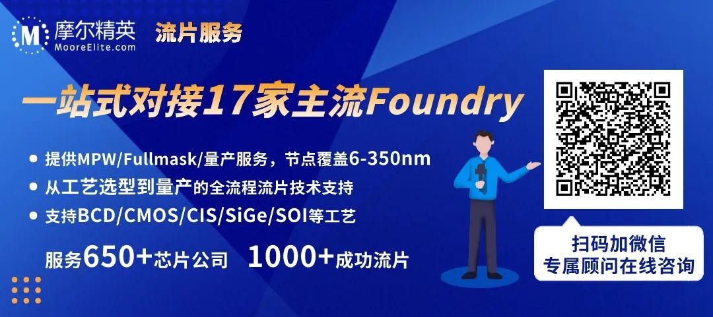
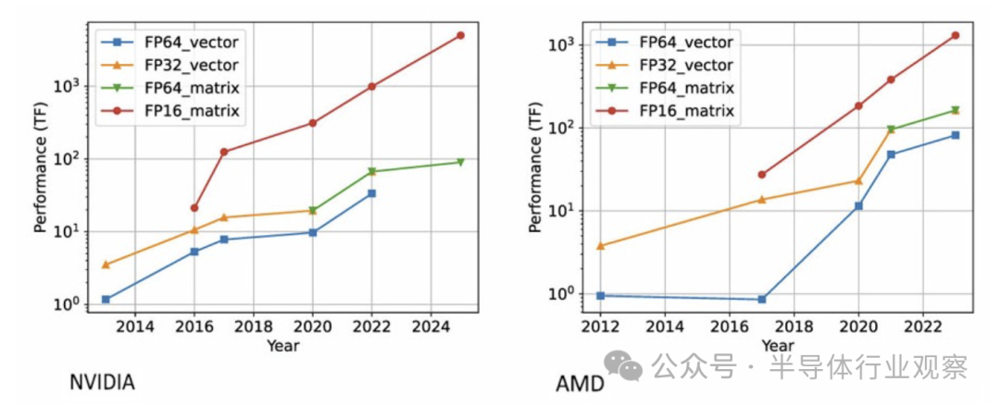
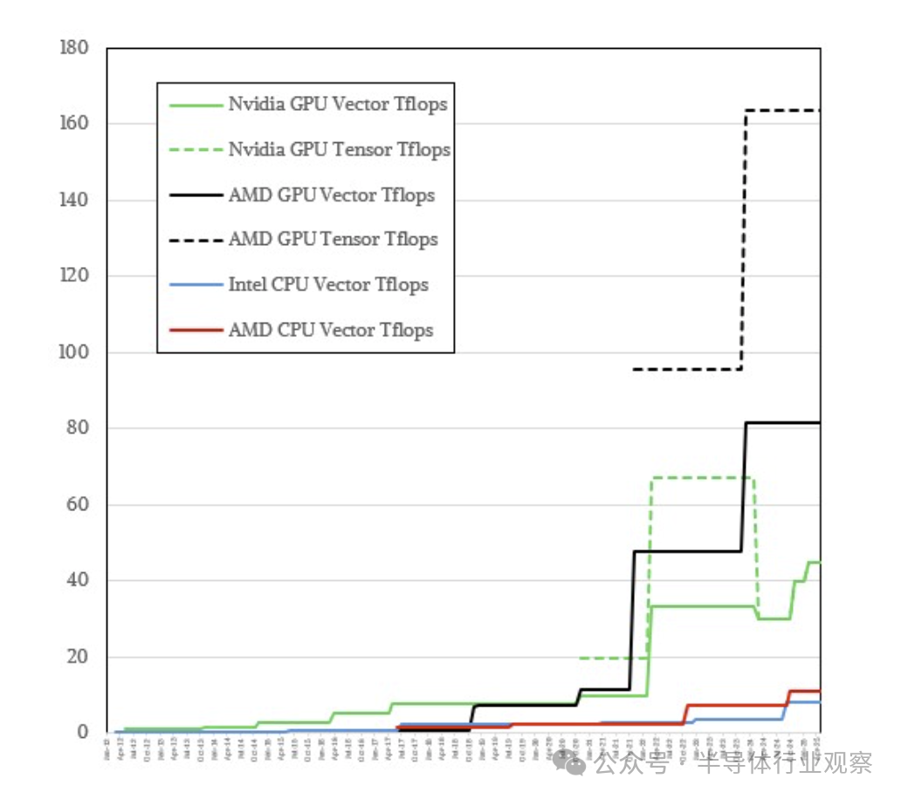
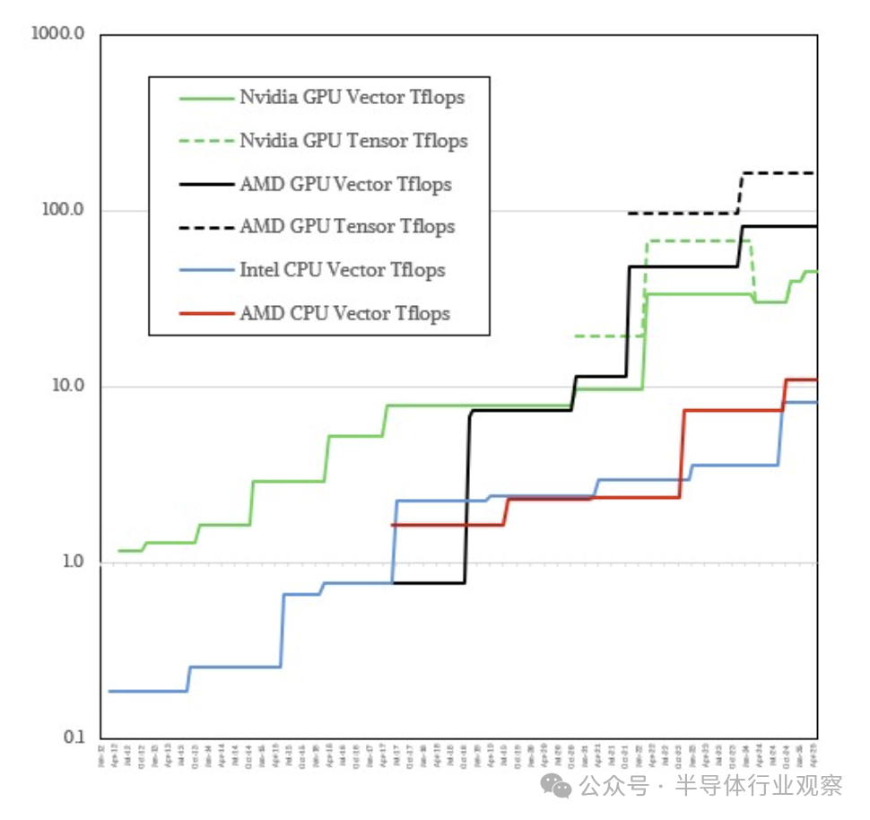
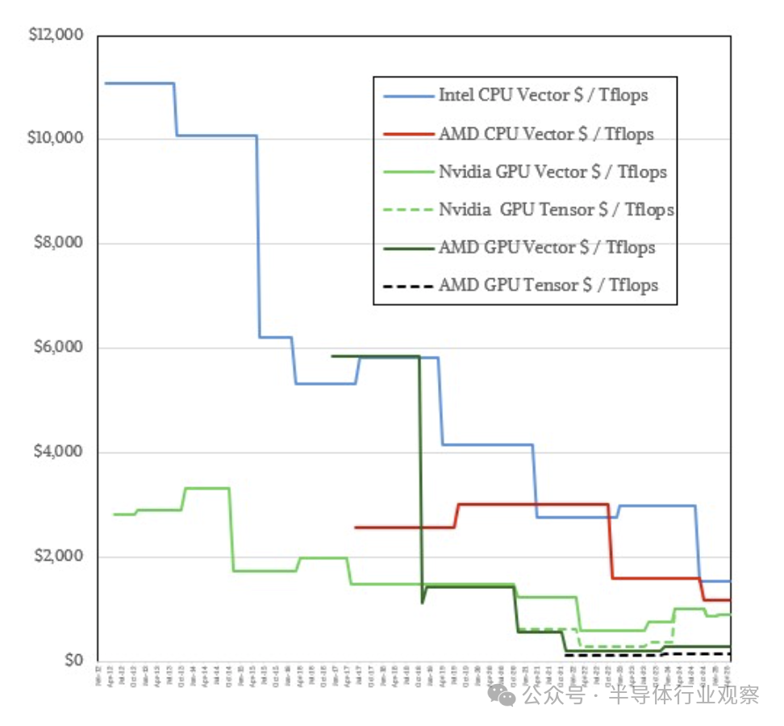
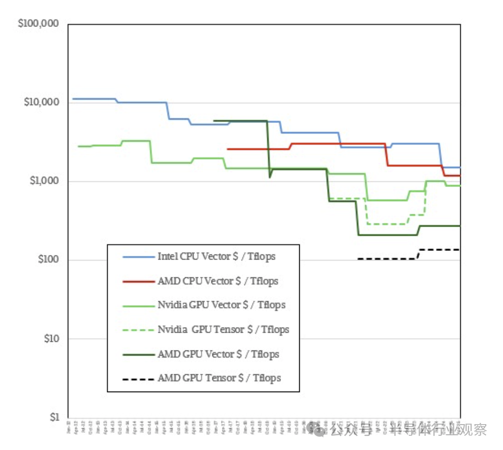
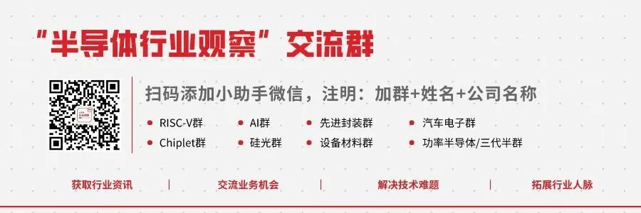

Title: GPU，走上了“邪路”？

URL Source: https://mp.weixin.qq.com/s/51YpOxbG7sM--FmzJIkCog

Markdown Content:

👆如果您希望可以时常见面，欢迎标星🌟收藏哦~

来源：内容编译自nextplatform，谢谢。

如果你想要一个具有 GPU 浮点性能的 CPU，你只需等待六年左右，CPU 路线图就会赶上。这似乎是一个漫长的等待，这就是为什么这么多 HPC 中心从十五年前开始从 CPU 转向 GPU，为 GPU 计算引擎上 AI 的大规模扩展奠定了基础——尽管是无意的。

在许多方面，X86 CPU 变成了具有一些并行趋势的通用串行计算引擎，具有整数和矢量数学功能的健康组合，现在，至少在某些英特尔和 AMD CPU 中，还具有用于加密和散列等特定功能的加速器以及矩阵数学引擎，至少在过去三代 Xeon 处理器中是如此（我们现在称之为“Sapphire Rapids”Xeon 4、“Emarald Rapids”Xeon 5 和“Granite Rapids”Xeon 6）。预计 AMD 会在某个时候将矩阵引擎添加到 Epyc 处理器中，但迄今为止一直拒绝这样做。Arm CPU 设计师最终可能会效仿。

在某种程度上，GPU 是一种大规模并行通用浮点引擎，偶尔也会出现整数倾向，它已成为 AI 训练和某些 HPC 工作负载的首选引擎。这在很大程度上归功于其高带宽和不断降低的浮点精度，这使得越来越低分辨率的数据可用于 AI 训练所依赖的统计算法，从而提高其有效性能。

一切都很好，但正如我们过去指出的那样，我们希望许多类型的计算具有更高的精度，而不是更低的精度，以提高我们从模拟和模型中获得的答案的保真度。虽然人工智能允许我们眯起眼睛，仍然可以通过睫毛看到一些东西并将其识别为“猫”，但许多应用程序确实需要双精度 FP64 处理。如果它是免费的，我们可能会谈论 128 位或 256 位的 FP128 或 FP256 处理。（听起来很疯狂，对吧？）

我们长期以来一直认为，GPU 加速器更注重低精度数学，而许多 HPC 中心并不这么认为。

**精度：差距越来越大**

橡树岭国家实验室最近的一项研究表明，虽然混合精度技术在特定场景下可以实现高达 8 倍的性能提升，但对于需要只有 FP64 计算才能提供的精度的工作负载而言，它们远远不够。他们的研究表明，对于依赖高精度和准确度的应用程序来说，FP64 的稳定性和可重复性具有重要价值。

这一挑战不仅仅局限于性能指标。正如行业专家Earl Dodd 所指出的，流行的“精度越低可靠性越低”这一误解导致了对精度要求的决策过于简单化。现实情况则更加微妙：不同的应用程序需要不同的精度水平，而一刀切地降低精度的方法可能会对科学应用产生严重后果。虽然人工智能工作负载可能会容忍精度降低，但科学计算通常需要只有双精度浮点计算才能提供的坚定不移的准确性。

然而，尽管对高精度格式的需求持续存在，但人工智能加速器几乎在芯片制造商的硬件路线图中占据主导地位。该行业正在以牺牲传统科学计算需求为代价，大力转向人工智能优先架构。这种转变不仅仅是一种暂时的趋势——它代表了计算格局的根本性调整，具有深远的影响。正如科学组织正在寻找在研究中结合人工智能和高性能计算方法的强大方法一样，硬件开发正在迫使这些互补方法之间人为分离。这种分歧可能会限制科学计算和人工智能的潜力，因为它们无法协同工作。

这种转变在最新的 GPU 架构中尤为明显，其中性能格式之间的差距随着每一代的出现而不断扩大。最近的 ORNL 研究清楚地说明了这种不断扩大的性能差距。他们对 Nvidia 和 AMD GPU 架构的分析表明，FP16 矩阵运算性能快速提升，而 FP64 性能则以较为温和的速度增长。这些数据清楚地说明了这一点：计算行业对人工智能的关注正在造成低精度和高精度计算能力之间的差距越来越大。结果就是计算生态系统正在分裂。

这种转变的后果无疑对科学计算产生了影响。正如 Dodd 所强调的，科学计算的精度直接影响人类生命、环境保护和技术进步。性能和精度之间的权衡不仅仅是技术考虑，它们代表了我们对科学模拟的可靠性和可信度的基本选择。当我们在精度上妥协时，我们冒的风险不仅仅是计算准确性，我们还会冒科学发现本身的完整性的风险。

科学用户被迫适应并非为他们的需求而构建的架构。软件框架、开发工具甚至更好的硬件接口主要都是为 AI 工作负载而设计的，这创造了一种环境，让科学计算越来越感觉像是事后才想到的。这种转变提出了一个严肃的问题：在争相占领 AI 主导地位的过程中，行业是否会将婴儿和洗澡水一起倒掉？

**GPU，走上了“邪路”？**

与此同同时，最新一代的 Nvidia GPU 也正在推动一个新趋势。GPU 价格上涨速度快于 FP64 性能，因为“Hopper”H100 和 H200 以及“Blackwell”B100 和 B200 加速器专注于将数据分辨率和计算降低到 FP8 和 FP4 格式，以提高 AI 训练和推理吞吐量。Nvidia 一直小心翼翼地在其 GPU 计算引擎上保留矢量和张量单元，并在其上保持合理的 FP64 和 FP32 性能，但 FP64 的性价比并不理想。

我们对 FP64 非常看重，我们希望那些运行世界上最密集的天气和气候建模模拟、材料模拟、湍流气流模拟以及其他几十种绝对需要 FP64 浮点的关键 HPC 工作负载的人能够从他们购买的计算引擎中获得良好的价值。

在我们了解核心计算引擎上的矢量和张量单元编译和绘制的数字之前，我们有一些观察结果。

首先，过去我们经常将矩阵数学视为一个通用术语，但实际上矩阵是一种特殊的低维二维张量，而向量是维度更低的一维张量。因此，我们将向量单元和张量单元的性能进行对比，这两个单元在这些计算引擎中是独一无二的。并非所有代码都已移植到张量单元，有些代码必须在向量单元上运行。

其次，从普遍意义上讲，我们可以说，在 GenAI 革命的这个阶段，Nvidia 正在设计可以进行一些 HPC 的 AI 训练和推理 GPU，而 AMD 正在制造可以进行一些 AI 训练和推理的 HPC GPU。

2012 年至 2020 年间，Nvidia GPU 内部矢量单元的 FP64 峰值理论性能提高了 8.3 倍。（这是 2012 年的“Kepler” K20 和 2020 年的“Ampere” A100。对于“Hopper” H100 和 H200，它们是相同的 GPU，但具有不同的内存带宽，峰值理论矢量性能提高了 3.5 倍，达到 33.5 万亿次浮点运算。没有稀疏性（即在密集矩阵上），Nvidia GPU 中张量核心的性能是 A100 和 H100 的两倍，分别为 19.5 万亿次浮点运算和 67 万亿次浮点运算。

去年发布并目前正在加速的“Blackwell”B100 的峰值矢量 FP64 性能仅为 30 teraflops，比 Hopper GPU 的峰值 FP64 性能下降了 10.5%。而在张量核心上，FP64 的额定值为 30 petaflops，与 Hopper 张量核心的峰值 FP64 性能相比下降了 55.2%。可以肯定的是，Blackwell B200 的矢量和张量单元的 FP64 额定值为 40 teraflops，而 GB200 与“Grace”CG100 CPU 搭配使用时，Nvidia 将其矢量和张量的峰值 FP64 提升至 45 teraflops。重要的是，使用 Blackwell 时，张量 FP64 并不是矢量 FP64 的两倍，而且在很多情况下，转向 Blackwell 的客户将为比 Hopper GPU 更少的 FP64 性能付出更多代价。

如果您能找到二手 H100，这听起来像是一个购买的好理由，因为对于需要最高精度计算的 HPC 工作负载来说，二手 H100 是必不可少的。

近年来，GPU 市场的一个好消息是，有两家供应商，AMD 进入该领域并具有绝对竞争力——尤其是自 2020 年底推出“Arcturus”MI100 以来，以及 2021 年 11 月推出“Aldebaran”MI250X 以来。AMD 的 MI250X 用于橡树岭国家实验室的“Frontier”超级计算机，其矢量单元的峰值 FP64 为 47.9 万亿次浮点运算，张量单元的峰值 FP64 为 95.7 万亿次浮点运算。MI100 在矢量性能上比 Hopper H100/H200 高出 19%，但没有张量单元。MI250X 同时具有矢量和张量单元，在峰值 FP64 性能方面比 Hopper GPU 高出近 43%。借助 MI300X，AMD 的矢量运算速度达到 81.7 万亿次浮点运算，张量运算速度达到 163.4 万亿次浮点运算，而 GB200 封装中使用的 Blackwell GPU 的矢量和张量运算速度最高仅为 45 万亿次浮点运算。在峰值吞吐量下，FP64 矢量性能提高了 1.8 倍，FP64 张量性能提高了 3.6 倍。

AMD 设备也更便宜。我们猜测 GB200 套件中使用的单个 Blackwell B200 售价约为 40,000 美元，但 MI300X 售价约为 22,500 美元。与 B100、B200 以及与 Grace 搭配的 B200 相比，AMD 在 FP64 工作中的性价比优势是 3.2 倍到 7.3 倍。

是的，Nvidia 拥有用于 HPC 和 AI 的庞大 CUDA 软件堆栈，并且在低精度浮点和运行基础模型的其他技巧方面具有优势。但我们在这里讨论的是 HPC 工作负载。毕竟，我们既是下一个 AI 平台，也是下一个 HPC平台。

只是为了好玩，我们绘制了英特尔至强和 AMD Epyc 处理器随时间变化的 FP64 性能，并计算了这些设备的性价比，并将它们与 2012 年以来的 Nvidia 和 AMD GPU 进行了比较。

请记住，以下图表是 FP64 数学在矢量和张量单元上的峰值理论性能。这不是最大可实现性能，它考虑到任何给定计算引擎的架构的偏心性，使其无法达到峰值；当然也不是一套 HPC 应用程序上的最大持续性能。我们使用的是基本时钟速度，而不是超频速度。

我们希望描述 FP64 计算市场的形态以及经济状况随时间的变化。这为 上述常见厂商的下一代 GPU 和 CPU 以及任何自主研发的 Arm 或未来的 RISC-V CPU 奠定了基础。

这是针对当时具有最多内核的顶级部件，无需像英特尔几次对非标准 Xeon AP 封装所做的那样采用双重封装插槽。

有些东西在正态图上很容易看到，而其他东西则需要对数图才能更好地看到增量。所以我们两者都做了。让我们来看看：

在图表底部，你几乎看不到英特尔和 AMD CPU 的性能，但你可以看到 Nvidia 如何降低其 GPU 的张量 FP64 性能，以及 AMD GPU 如何超越它。（无论你的眼镜有多好，你都看不到 X 轴上的月度数据，这没关系。图表从 2012 年 1 月持续到 2025 年 5 月。）

如果我们切换到日志视图，就会出现一些有趣的东西：

AMD GPU 直到 MI250X 才有张量单元。在此之前，Intel Xeon 和 AMD Epyc CPU 在矢量 FP64 吞吐量上的速度都只比 GPU 慢三倍左右。2020 年末，Nvidia 和 AMD 真正提高了其 GPU 矢量，而 Nvidia 增加了张量核心，CPU 和 GPU 在 FP64 性能方面的差距真正拉大了。

另一件有趣的事情是，2016 年，当 AMD 推出基于“Vega”架构的 MI25 时，英特尔推出了“Broadwell”Xeon E5-2699 v4 CPU，它们的 FP64 性能相同。这更多地说明了 Vega 架构比 Broadwell 架构更出色。这也表明 AMD 在过去几年中在 GPU 方面取得了多大的进步。您还可以看到“Naples”Epyc 6001 处理器也击败了 MI25，同时推出的“Haswell”Xeon 也是如此。

这是 CPU 和 GPU 之间唯一一次性能重叠，你可以看到 AMD 已经迅速赶上了 Nvidia，并且在 GPU 的 FP64 吞吐量上一直领先于它。此外，你可以在对数图中看到，AMD 在 CPU 的 FP64 矢量吞吐量上也通常一直击败英特尔。

性能是一回事，但成本很高。那么这些设备在 FP64 计算方面的性价比如何呢？让我们来看看：

有趣的是，英特尔的性价比提升非常快，这无疑是由于 GPU 计算的影响，它提供了更好的性价比。英特尔曲线比 Nvidia 曲线陡峭得多，部分原因是 Nvidia 选择了架构来降低 FP64 性能提升，而 AMD 和英特尔则在不断提升 FP64 性能。英特尔还大幅降低了“Granite Rapids”Xeon 6 处理器的价格，使其更接近 AMD Turin Zen 5 核心处理器，但 AMD 在 CPU 方面的性价比仍然比英特尔略高，适用于 FP64 矢量计算。

（注意：我们没有考虑过去三代 Xeon 中的英特尔 AMX 张量单元。我们不知道有谁将 HPC 功能卸载到这些张量单元。但显然有人可以。）

转到对数刻度可以更容易地显示 Nvidia 和 AMD 在 FP64 计算 GPU 上的竞争地位：

假设我们的定价正确，AMD 显然是 GPU 的价值领导者。

让我们以 2022 年的 Nvidia H100 为基准，其矢量每万亿次浮点运算成本为 582 美元，张量每万亿次浮点运算成本为 291 美元。AMD MI250X GPU 的矢量每万亿次浮点运算成本为 209 美元，张量每万亿次浮点运算成本为 104 美元。MI300X 的 GPU 价格上涨了一倍多，达到约 22,500 美元，但 FP64 性能仅提高了 1.7 倍，因此每美元的价值为矢量每万亿次浮点运算 275 美元，张量每万亿次浮点运算 138 美元。在峰值性能相同的情况下，Nvidia H200 的成本高于 H100，而 B100 的成本更高，但峰值性能更低，而且 FP64 张量单元的成本要低得多。因此，B100 上的矢量或张量单元每万亿次浮点运算的成本高达 1,000 美元。B200 增加了一些 FP64 性能（33%，达到 40 万亿次浮点运算），但价格约为 35,000 美元，即矢量或张量每万亿次浮点运算 875 美元。GB200 配有 Blackwell，在 FP64 精度下可运行 45 万亿次浮点运算，价格为 40,000 美元，即每万亿次浮点运算 889 美元。

AMD 应该能够向 HPC 社区销售如此多的 MI300X，这让我们感到头晕目眩。这就是为什么我们认为它无法像许多人想象的那样生产出这么多产品。

有趣的是，具有 128 个内核的 Granite Rapids Xeon 6 6980P 的额定速度为 8.2 万亿次浮点运算，其矢量执行 FP64 工作的成本为每万亿次浮点运算 1,521 美元。（几周前降价前的价格为 2,173 美元。）具有 128 个内核、运行频率为 2.7 GHz 的 AMD Epyc 9755 的 FP64 性能略高于 11 万亿次浮点运算，每万亿次浮点运算的成本为 1,174 美元。这是 2018 年 AMD GPU 和 2021 年 Nvidia GPU 矢量单元每万亿次浮点运算的成本。

参考链接

https://www.nextplatform.com/2025/02/20/sizing-up-compute-engines-for-hpc-work-at-64-bit-precision/

_**END**_

**👇半导体精品公众号推荐👇**

▲点击上方名片即可关注

专注半导体领域更多原创内容

▲点击上方名片即可关注

关注全球半导体产业动向与趋势

\*免责声明：本文由作者原创。文章内容系作者个人观点，半导体行业观察转载仅为了传达一种不同的观点，不代表半导体行业观察对该观点赞同或支持，如果有任何异议，欢迎联系半导体行业观察。

**今天是《半导体行业观察》为您分享的第4042期内容，欢迎关注。**

**推荐阅读**

★[一颗改变了世界的芯片](https://mp.weixin.qq.com/s?__biz=Mzg2NDgzNTQ4MA==&mid=2247732748&idx=1&sn=2ba19055f90ac8ab5512098d039ef391&chksm=ce6e4cfbf919c5eddc8b3af5a147990afc3c7227f59c332d15ed5f8b8a100a4dcb97f59d05d1&scene=21#wechat_redirect)

★[美国商务部长：华为的芯片没那么先进](https://mp.weixin.qq.com/s?__biz=Mzg2NDgzNTQ4MA==&mid=2247735441&idx=6&sn=786b62b5f4edbac37b66f91ff36d0f49&chksm=ce6e5a66f919d37052778a97f49442c77529699f08f3dcf599c99347dcf35da064528aab5222&scene=21#wechat_redirect)

★[“ASML新光刻机，太贵了！”](https://mp.weixin.qq.com/s?__biz=Mzg2NDgzNTQ4MA==&mid=2247738477&idx=1&sn=636a6387c4e83b7e47e6377aba07f8d4&chksm=ce6e269af919af8cc2bfddf1dff60566bfd0169eb1c31d97413c6f97abe8d307cda0b58cc795&scene=21#wechat_redirect)

★[悄然崛起的英伟达新对手](https://mp.weixin.qq.com/s?__biz=Mzg2NDgzNTQ4MA==&mid=2247741738&idx=1&sn=860c31832b6c6e03b152300b991be5f9&scene=21#wechat_redirect)

★[芯片暴跌，全怪特朗普](https://mp.weixin.qq.com/s?__biz=Mzg2NDgzNTQ4MA==&mid=2247746259&idx=1&sn=f9a5a82f84e598d0f2d8b8d2cb1d371e&chksm=ce6e0024f919893285b3069f01821e6bd47cb772c890cacf88874707e1576ecc3d7673290afb&scene=21#wechat_redirect)

[★](https://mp.weixin.qq.com/s?__biz=Mzg2NDgzNTQ4MA==&mid=2247709689&idx=2&sn=d77e02ac93f0b0e490744945d550f269&chksm=ce6eb10ef919381813abb86c6dee73b999b8c8ccbdeb9af8b47b7dde46b05e15e13be81cb704&token=1171908126&lang=zh_CN&scene=21#wechat_redirect)[替代EUV光刻，新方案公布！](https://mp.weixin.qq.com/s?__biz=Mzg2NDgzNTQ4MA==&mid=2247741646&idx=1&sn=aa71a43b134a613453f29ddc8cfdb32c&chksm=ce6e3239f919bb2f75efc5a7b90c48944655808f6fc901dd146eec31f73340cf1f663b31cced&scene=21#wechat_redirect)

★[半导体设备巨头，工资暴涨40%](https://mp.weixin.qq.com/s?__biz=Mzg2NDgzNTQ4MA==&mid=2247723271&idx=7&sn=1e4f5124fa7d3f029e4c212823633e1e&scene=21#wechat_redirect)

★[外媒：美国将提议禁止中国制造的汽车软件和硬件](https://mp.weixin.qq.com/s?__biz=Mzg2NDgzNTQ4MA==&mid=2247756729&idx=8&sn=7763455e2146a96c6c5945c7092c9c90&scene=21#wechat_redirect)

『半导体第一垂直媒体』

**实时 专业 原创 深度**

公众号ID：icbank

喜欢我们的内容就点**“在看”**分享给小伙伴哦

