Title: Gaussians

URL Source: https://gestalt.ink/gaussians

Markdown Content:
Understanding Gaussians
-----------------------

The **Gaussian distribution**, or **normal distribution** is a key subject in statistics, machine learning, physics, and pretty much any other field that deals with data and probability. It’s one of those subjects, like π or Bayes’ rule, that is so fundamental that people treat it like an icon.

*   [Understanding Gaussians](https://gestalt.ink/gaussians#understanding-gaussians)
    *   [Building a geometric intuition for Gaussians](https://gestalt.ink/gaussians#building-a-geometric-intuition-for-gaussians)
        *   [The standard Gaussians](https://gestalt.ink/gaussians#the-standard-gaussians)
        *   [A family of Gaussians](https://gestalt.ink/gaussians#a-family-of-gaussians)
        *   [Spherical, diagonal and degenerate Gaussians](https://gestalt.ink/gaussians#spherical-diagonal-and-degenerate-gaussians)
        *   [Means](https://gestalt.ink/gaussians#means)
        *   [(Co)variances](https://gestalt.ink/gaussians#covariances)
            *   [The variance of N1s](https://gestalt.ink/gaussians#the-variance-of-n1_s)
            *   [The covariance](https://gestalt.ink/gaussians#the-covariance)
            *   [Of spherical, diagonal and degenerate Gaussians](https://gestalt.ink/gaussians#of-spherical-diagonal-and-degenerate-gaussians)
    *   [Fundamental properties of Gaussians](https://gestalt.ink/gaussians#fundamental-properties-of-gaussians)
        *   [Linear transformations](https://gestalt.ink/gaussians#linear-transformations)
        *   [If you can linearly transform it to a Gaussian, it’s a Gaussian](https://gestalt.ink/gaussians#if-you-can-linearly-transform-it-to-a-gaussian-its-a-gaussian)
        *   [There is always an _invertible_ transformation](https://gestalt.ink/gaussians#there-is-always-an-invertible-transformation)
        *   [The sum of two Gaussians is a Gaussian](https://gestalt.ink/gaussians#the-sum-of-two-gaussians-is-a-gaussian)
        *   [Chaining Gaussians](https://gestalt.ink/gaussians#chaining-gaussians)
        *   [Conditioning Gaussians](https://gestalt.ink/gaussians#conditioning-gaussians)
    *   [Deriving the density](https://gestalt.ink/gaussians#deriving-the-density)
    *   [Sources and other materials](https://gestalt.ink/gaussians#sources-and-other-materials)
    *   [References](https://gestalt.ink/gaussians#references)

To start at the beginning: the normal distribution is a _probability distribution_: a mathematical object that describes a process by which you can _sample data_. Here is an example. If I measure the height of about 2000 female soldiers in the US army, and plot the results in a histogram, here is what that might look like.

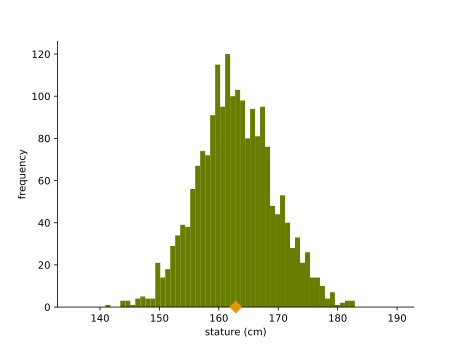

The _stature_ (height) of 1986 female soldiers in the US Army. From the ANSUR II dataset \[[1](https://gestalt.ink/gaussians#references)\].

You can see that the data is clustered around the _mean value_. Another way of saying this is that the distribution has a definite _scale_. That is, even though people can have all sorts of heights, there are clear limits. You might see somebody who is 1 meter taller than the mean, and it might theoretically be possible to be 2 meters taller than the mean, but that’s it. People will never be 3 or 4 meters taller than the mean, no matter how many people you see.

The definite scale of the height distribution is why we can have doors. We know that heights will fall in a certain range, so we can build for that. There are a few distributions like this with a definite scale, but the Gaussian is the most famous one. You can see in the plot above that it has a kind of “bell” shape—it’s also called _the bell curve_—which trails off smoothly as we get further from the mean, first slowly and then dropping rapidly, and then flattening out quickly. If we make the bins in our histogram smaller, and increase the sample size so they are still filled up, we can see the shape appear more clearly.

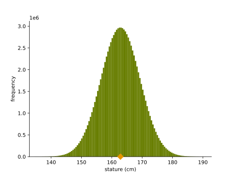

Synthetic data for 100 million imagined soldiers from the same distribution as the figure above.

If you measure more than one thing about your subject, you get _multivariate_ data, and the resulting distribution is called a _multivariate distribution_. For example, if we take our soldiers, and measure their height and their weight, the data looks like this.

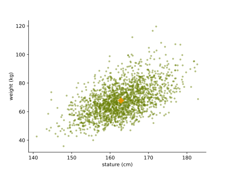

A scatter plot of the height and weight of our sample of soldiers.

This is called _a multivariate normal distribution_. Like the one-dimensional (_uni_variate) version, the data is clustered around a central value.

Most descriptions you will read of the Gaussian distribution will focus on the way it is used to describe or approximate the real world: its use as _a model_. This is a typical statistics approach, and it comes with a lot of baggage that we will not discuss here.

In this article, we want to focus more on the way Gaussians are used in _machine learning_. There, we also aim to build a model of our data, but we are often less concerned with the fact of capturing our data in a single Gaussian. Instead, we use Gaussians as a _building block_, a small part of a more complex model. For instance, we might add noise from a Gaussian to our data at some point in our algorithm, or we could have a neural network produce the parameters of a Gaussian as part of its prediction. We could combine multiple Gaussians together, in order to create a distribution with multiple peaks. We could even take a sample from a Gaussian and feed it to a neural net, so that the neural net effectively twists and folds the relatively simple shape of the Gaussian into something much more complex.

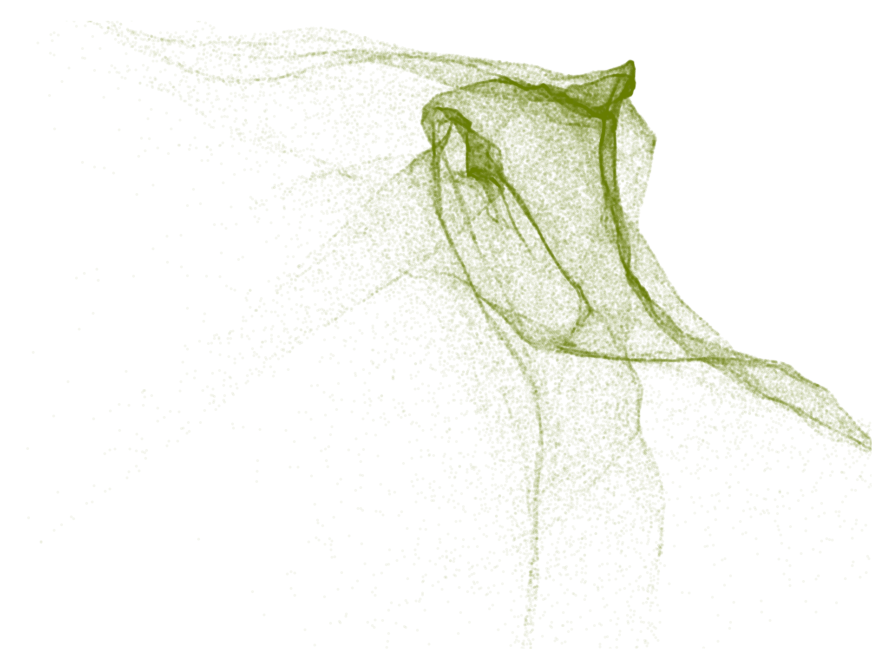

100 000 points drawn from a Gaussian distribution and passed through a randomly initialized neural network.

To use Gaussians in this way requires a solid intuition for how they behave. The best way to do that, I think, is to do away entirely with the symbolic and mathematical foundations, and to derive what Gaussians are, and all their fundamental properties from purely geometric and visual principles. That’s what we’ll do in this article.

Building a geometric intuition for Gaussians
--------------------------------------------

If you’re not intimately familiar with Gaussians, you would be forgiven for thinking of them as one of the most monstrously complicated probability distributions around. After all, when we learn about them, pretty much the first thing we see is their probability density function.

N(𝐱∣μ,𝚺)\=1(2π)k|𝚺|−−−−−−√exp(−12(𝐱−μ)T𝚺−1(𝐱−μ))

It’s a beast of a formula, especially if you’re not used to reading such things. Why then, do people like this distribution so much? Why use it as a building block when it is already so complex? Shouldn’t we look for simple building blocks—perhaps something like a uniform distribution, which has a much simpler formula?

Partly, we like the Gaussian because it has nice properties, but partly, we like it because once you get to know it, it’s not so complicated. You just have to let yourself forget about the complicated formula. So we’ll put it out of our minds, and start elsewhere.

The plan is as follows. We will first derive a _standard_ Gaussian. Just one distribution, in one dimension. This makes the formula much simpler. From this, we will define a standard Gaussian in n dimensions, in a straightforward way, which doesn’t require us to extend the formula very much. Then, we will use _affine transformations_—multiplication by a matrix, and addition of a vector—to define a whole _family_ of Gaussians. Implicitly, this will lead to the formula we use above, but practically, all we need to understand are the basic rules of linear algebra.

We will use this view to derive a bunch of useful properties about Gaussians, and then finally wrap up by showing that the above formula is indeed correct.

### The standard Gaussians

The first thing we need is the standard Gaussian in one dimension. This is a probability distribution on the real number line: if we sample from it, we can get any real number. The function that describes it is a _probability density function_: it maps each real number to a probability density. Numbers with higher density are in some sense more likely than numbers with low density.

To come up with the density function, remember the aim we started with: we want the distribution to have a definite scale, some area where almost all of the probability mass is concentrated. We'll put that region around zero on the number line (it seems as good a point as any). This is where the density should peak, and as we move away from zero the density should drop very quickly, so that pretty soon, it's almost zero. One way of achieving this is to have _exponential decay_. Just like an exponential function ex blows up very quickly, the negative exponential function e−x drops to zero extremely quickly.

We could use the exponential function, but if we add a square in there, to give us e−x2 we get some nice properties on top of the exponential decay.

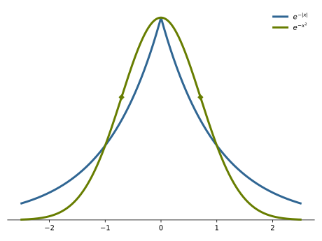

First of all, the decay far out from zero is even faster, since we’re adding in a square. Second, close to zero, we get a little more probability density on all numbers in that region. The exponential decay really favors only 0, while the squared exponential favours all numbers _near zero_. Finally, the quared exponential has two _inflection points_, highlighted in the image with diamonds. These are the points where the decay moves from dropping faster and faster to dropping slower and slower. These inflection points form a nice, natural marking for the _scale_ of the distribution: we can take the interval between the inflection points as the “typical” range of outcomes that we might get if we sample from the distribution. The numbers outside this range are possible, but they’re less likely.

So that’s where the basic bell shape of the distribution comes from: the choice to have the probability density decay squared exponentially. Next, we’ll make a small adjustment to make the function a little more well-behaved. Remember that the inflection points give a us a nice interval to consider the “typical points”. This interval is now a little arbitrary. If we scale the function a bit, we can put the inflection points at −1 and 1, so that the interval containing the bulk of the probaility mass is contained in (−1,1). This seems like a nice property to have, and as it turns out, it doesn’t make the function much more complex.

First, we need to figure out where the inflection points are. We defined them as the point where the function moves from dropping faster and faster to dropping slower and slower. This behavior, how fast the change in the function changes, is given by the second derivative of the function. Where that is equal to zero, we find an inflection point. The first derivative of e−x2 is (using the chain rule) −2xe−x2, and the second derivative is (using the product rule) −2e−x2+4x2e−x2\=(4x2−2)e−x2. Setting that equal to zero, we get x2\=1/2, so the inflection points are at

x\=−12−−√andx\=12−−√.

If we want to stretch a function f(x) vertically by a factor of y, we should multiply its input by 1/y: f(1yx). That means that if we want to stretch it so that the point x ends up at 1—a stretch of 1/x—we should multiply the input by x

In our case, that means we multiply the input by 12−−√:

e−(12√x)2\=e−12x

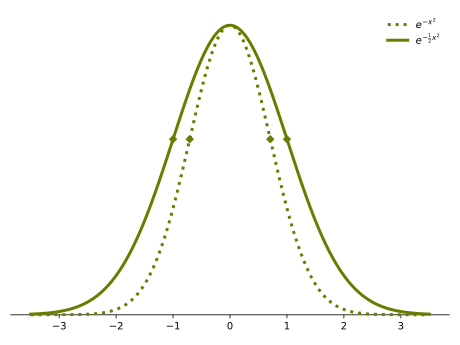

So, our function is now e−12x2. The extra multiplier of 12 is a small price to pay to put the inflection points at −1 and 1.

With that, we almost have a probability density function. The only problem left is that the rules of probability density functions state that the whole area under the curve should integrate to 1. Put simply, the probability of sampling any number in (−∞,∞) should be 1.

We could check whether it does, and if it doesn’t, we could stretch or squeeze the function vertically until it does. This would require some complicated analysis, which, while fun, is exactly the kind of thing we are trying to avoid. To keep things simple, we will simply assume that the area under the whole curve, from negative to positive infinity, is some finite value.

Whatever the area under the curve e−12x2 is, we will call that z. By the rules of integration, multiplying our function by 1/z will then yield a function that integrates to 1. Since z is a constant, we can say that the scaled function, which we will call Ns, is _proportional to_ the unscaled function:

Ns(x)∝e−12x2.

That is, Ns, which is a proper probability density, is a bit more complicated than e−12x2 but all that complexity is in some multiplicative constant. One other trick we can use to simplify things is to focus on the logarithm of the probability density. In our case, we get:

ln Ns(x)\=+−12x2

where the symbol \=+ means that both sides are equal except for some term (−lnz in this case) that doesn’t depend on x.

With that, we have defined our _standard Gaussian_ in one dimension as precisely as we need. We don’t have the complete functional form of the density,but we don’t need it. We know the function exists, and we know what it looks like. We can now derive the full family of Gaussians.

First, to make the leap to _multivariate_ Gaussians, we define a single multivariate _standard_ Gaussian. In n dimensions, we will call this distribution Nns. It’s a distribution over vectors 𝐱 of n elements.

We define Nns by a _sampling process_. To sample from the multivariate Gaussian in n dimensions, we sample n separate values x1 though xn from the standard one-dimensional Gaussian Ns (which we’ve just defined) and we concatenate them into a vector 𝐱. To say that the random vector 𝐱 is _distributed according to the standard Gaussian_ Nns in n dimensions, we write 𝐱∼Nns. This means that

⎛⎝⎜x1⋮xn⎞⎠⎟withxi∼Ns.

If 𝐱 is distributed according to Nns, then each individual element of 𝐱 is distributed according to Ns.

This is a complete definition of the standard Gaussian. We haven’t defined a density function for Nns, but we’ve defined how to sample from it, which is all we need for a definition. The density function exists _implicitly_.

We can now ask ourselves what this density function looks like. We can derive the general form very easily from one basic property: that of _independence_. Since we sample the elements of 𝐱 independently—how we sample one does not depend on how we sample the others—the probability density of the whole vector is the probability density of the elements multiplied together:

Nns(𝐱)\=p(x1)⋅p(x2)⋅…⋅p(xn)

Now, switching to log-probability densities, we can get a sense of the shape of the function. Remember that \=+ means equal up to some constant term, so we can remove any terms that don’t depend on elements of 𝐱.

ln Nn(𝐱)\=ln p(x1)+…+ln p(x)\=ln Ns(x1)+…+ln Nsp(x)\=+−12x12−…−12xn2\=−12(x12+…+xn2)\=−12‖𝐱‖2

The last line follows from recognizing that the right hand side has become equal to the vector norm without the square root. That is, the square of the norm: ‖𝐱‖2\=x12+…+xn2. Taking the logarithm away again, we get

Nns(𝐱)∝e−12‖𝐱‖2.

That is, the probability density at any point 𝐱 depends only on the norm of 𝐱—how far away from 𝟎 we are. Imagining this in two dimensions to start with, this tells us that all points with the same distance to 𝟎, any set of points that forms a _circle_, have the same density. The function also tells us that as the norms (and thus the circles) get bigger, the probability density of the points in that circle decays in the same way as the density decays in Ns: according to a negative squared exponential.

With that, we have a pretty clear picture of what the standard multivariate Gaussian looks like. It’s rotationally symmetric, since all circles have the same density, and it decays in the same way as the bell shape of Ns. Putting this together, tells us that it should look, in two dimensions, like the function of Ns rotated about the origin.

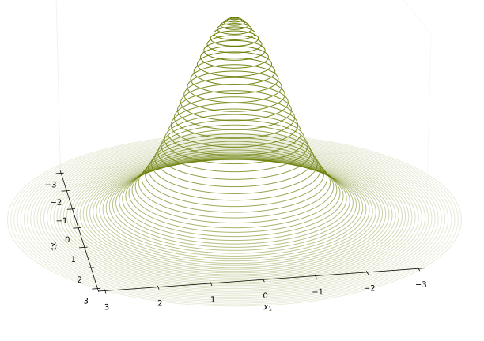

In two dimensions, the set of all points that have the same density—like one of the the circles in the picture above—is called a _contour line_. The standard Gaussian is called a _spherical_ distribution because all its contour lines are circles (two-dimensional spheres). In higher dimensions, where things are more difficult to visualize, the same principle holds: the density of 𝐱 under Nns depens only on the norm of 𝐱, so the set of all points with the same density is the set of all points with the same norm, a (hyper)-sphere. These spheres are called the _contour surfaces_ of Nns. The principle of contour surfaces will be very helpful going forward, in building up an intuition for what general Gaussians look like.

Moving forward, we will drop the superscript from Nns when the dimensionality is clear from context. Likewise, we will use N1s to emphasize that we are talking about the one-dimensional Gaussian if necessary.

### A family of Gaussians

Next, let’s build the rest of the family. We do this by taking the standard Gaussian Ns in n dimensions, and _transforming_ it linearly. We will start, again, with a sampling process.

We sample an n\-dimensional vector 𝐬 from Ns and apply any linear operation 𝐱\=𝐀𝐬+𝐭 with a matrix 𝐀∈ℝm×n and 𝐭∈ℝm. This results in a random vector 𝐱, since part of this process (the sampling of 𝐬) is random.

Now, we _define_ a Gaussian to be any distribution that results from this process, for some choice of 𝐀 and 𝐭. We will, refer to such a Gaussian as N(𝐀,𝐭).

We have defined how to sample a point from N(𝐀,𝐭), so we have fully defined this Gaussian. Obviously, it would be interesting to know what the resulting density function looks like, but that doesn’t need to be _its definition_. We can work that out from how we defined the sampling process. We’ll try to do that, and to work out some properties of the distribution we have now defined, without getting into the complicated formula for the density function.

For the time being, assume that 𝐀 is square and invertible, so that no two points are mapped to the same point by 𝐀.

To help us understand the shape of the density function, we can think back to the contour circles we defined for Ns, let's say the one for ‖𝐱‖\=1. Each of the points 𝐱 in this circle could be sampled from Ns and transformed by 𝐀 and 𝐭. What happens to a circle when all its points are transformed by a matrix? It becomes an _ellipse_. What's more, the relative lengths of vectors are maintained under matrix multiplication—if ‖𝐚‖<‖𝐛‖ then ‖𝐀𝐚‖<‖𝐀𝐛‖—so any point inside the circle (any point with ‖𝐱‖<1) before the transformation is inside the _ellipse_ after the transformation. Any point outside the circle before, is outside the ellipse after.

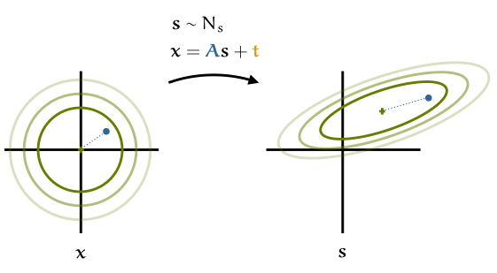

Transforming the standard Gaussian by an affine transformation turns the contour circles into contour ellipses. Any point inside one of the circles before the transformation will be inside the corresponding ellipse after.

This means that the amount of probability mass captured inside the unit circle before the transformation, is captured inside the corresponding ellipse after the transformation. After all, when we are sampling, these are the same points: if p is the probability of sampling some 𝐬 inside the circle before the transformation, then that is the probability of sampling some 𝐱 inside the corresponding ellipse.

For higher dimensions, the circles becomes hyper-spheres and the ellipses become ellipsoids, but the basic intuition stays the same.

If 𝐀 is not square and invertible, the picture is a little more complex. If, for example 𝐬 is three-dimensional and 𝐱 is two-dimensional, then we are taking all points 𝐬 on a sphere, and projecting them down to two dimensions. The result is still an ellipse in two dimensions, but not all points are on the edge of the ellipse anymore. Some are in the interior. This means we no longer have the property that if ‖𝐚‖<‖b‖ then ‖𝐀𝐚‖<‖𝐀𝐛‖. However, we will be able to show in a bit that this distribution is equivalent to one defined with a two-dimensional 𝐬 and a square, invertible 𝐀. Thus, this messiness isn't really any cause for concern. We can still call this a Gaussian, and think of it as being mapped from Ns in a neat way that maps contour circles to contour ellipses.

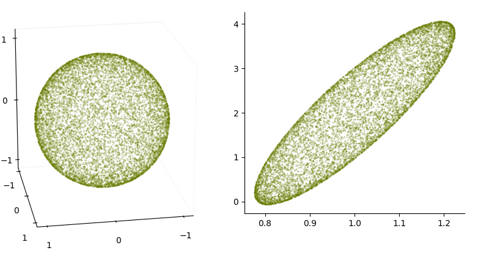

If the transformation is from three to two dimensions, points on the sphere (left) may end up inside the corresponding ellipse (right).

### Spherical, diagonal and degenerate Gaussians

Before we move on, it pays to investigate what kind of family members this family of ours has. We’ll look at three special types of Gaussians: spherical, diagonal and degenerate.

The simplest type of Gaussian is the **spherical Gaussian**, also known as an _isotropic_ Gaussian. This is the special case when the contour surfaces, which are spheres before the transformation, are still spheres after the transformation.

This happens only when we expand 𝐬 uniformly in all directions. Or, in other words, when we multiply it by a scalar. That is, if

𝐱\=σ𝐬+𝐭

for some scalar σ, then the distribution on 𝐱 is a sperical Gaussian. To fit this into the standard affine transformation framework, we can insert an identity matrix and get:

𝐱\=σ𝐈𝐬+𝐭.

This shows that the matrix σ𝐈—a diagonal matrix with σ at every point on the diagonal—is the matrix we should multiply by to get a spherical Gaussian.

The spherical Gaussians are particularly simple, and using them will simplify many aspects of the use of Gaussians. In machine learning, you will see them used in, for example, diffusion models.

A class that allows for a bit more variation is the **diagonal Gaussian**. Here, we again use a diagonal matrix in our affine transformation, but we let the diagonal values vary. That is, we define some _vector_ σ, and we [place these values along the diagonal of a matrix](https://gestalt.ink/diagonal-matrix). That matrix then becomes our transformation matrix.

A diagonal 𝐃 matrix represents a particularly simple transformation. The dimension i is simply multiplied by the value Dii, ignoring whatever happens elsewhere in the matrix.

Visually, the result is that the circles or spheres in the standard normal distribution are stretched into ellipses, but _only along the axes_. Any ellipse is allowed, but the major axis of the ellipse (the line from tip to tip) has to point along one of the axes of our coordinate system.

Practically, this means that the distribution has zero _correlation_ between the elements of 𝐱. If I tell you the value of x1, it carries no information about the value of x2. Study the example of the heights and widths of the soldiers above to see the opposite case: the points are roughly on a diagonal line, so if I tell you that a particular soldier has a certain height, you can make an informed guess about what their weight is likely to be. For that sort of reasoning, you need more than a diagonal Gaussian. You get this by playing non-zero values on the off-diagonal elements of your transformation matrix.

The final special case we will discuss is the **degenerate Gaussian**. This is what happens when, for example, we map a one-dimensional 𝐬 to a two-dimensional 𝐱.

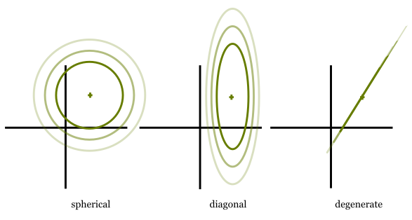

Since all points 𝐬 lie on a line, the resulting points 𝐱 can only lie on a line, even though they’re in a two-dimensional space. We’ve decided to call this a Gaussian, and along the line, you will see the familiar bell shape, but it’s fundamentally different from a true two-dimensional Gaussian like N2s, that fills all of ℝ2.

We call this a degenerate Gaussian. If 𝐱 has d dimensions, the _support_ of the Gaussian, the set of all points that have non-zero density isn’t the whole of ℝd, in fact, it’s a linear subset of it (a hyperplane).

Within the support, the distribution looks like a normal Gaussian: a bell shape and non-zero probability density everywhere, decaying squared-exponentiallyas we move away from the mean. We call a Gaussian that does have a non-zero density everywhere a _non-degenerate_ Gaussian, or a _Gaussian with full support_.

### Means

Next, let’s look at the properties of these Gaussians. First, the mean 𝐱¯. If we average a bunch of samples from Ns and let the number of samples go to infinity, where do we end up? This is called the [expected value](https://gestalt.ink/expectation): 𝐱¯\=E𝐱∼Ns𝐱

The definition of the expected value for continuous functions like these involves an integral, but happily, we don’t need to open it up. We just need to remember some key properties:

*   Expectation distributes over (vector) sums. That is E𝐱(f(𝐱)+g(𝐱))\=E𝐱f(𝐱)+E𝐱g(𝐱).
*   If we have (matrix) multiplication or (vector) addition inside the expectation, we can move it outside. That is E𝐱𝐭+𝐀𝐱\=𝐭+𝐀E𝐱𝐱.

Let’s start with the mean of the standard Gaussian. You may be able to guess what this should come out to. The density peaks at 𝟎, and the function is radially symmetric around 𝟎. If we think of the mean as the center of mass of the density function, there isn’t really any other point that could qualify.

It’s relatively simple to show that this guess is correct, because the components of 𝐱 are independently drawn. If we ask for the i\-th element of the mean, we need only look at the i\-th elements of our samples. These are all samples from N1s, so the mean for that component is the mean of N1s. N1s is symmetric around 0, so its mean must be 0. In short, the mean for the standard Gaussian is the zero vector.

What about the mean of our transformed Gaussian N(𝐀,𝐭)? If we use the basic poperty that the expectation is a linear function–that is, we can move additions and multiplications outside the expectation)—we can show very simply that the mean is equal to the translation vector in our transformation, 𝐭:

E𝐱∼N(𝐀,𝐭)𝐱\=E𝐬∼Ns𝐭+𝐀𝐬\=𝐭+𝐀E𝐬𝐱\=𝐭+𝟎.

### (Co)variances

#### The variance of N1s

The variance is a measure of how widely the sampled points are spread about the mean. We’ll need to work out the variance of N1s first. It is defined as the expected value of the squared distance to the mean: E(x−x¯)2. Since the mean is 0, we are just looking for the expected value of x2.

We could solve this by unpacking this expectation into its integral definition and working it out, but that requires a lot of heavy math. Happily, there’s a nifty trick that allows us to minimize the amount of time we need to spend in integral-land. First, let’s see what the integral is that we’re looking for. To make things easier to follow, I’ll give away that the answer is 1, and we’ll work towards that.

First, we’ll call the unscaled density function f. That is

f(x)\=e−12x and p(x)\=1zf(x).

Then, the variance is

Ex2\=∫∞−∞p(x)x2dx\=1z∫∞−∞x2f(x)dx.(var)

To show that the variance of the standard normal distribution is 1, we need to show that the integral marked in green at the end is equal to z (which is the name we gave to the area under the curve of f). This is where we can use a trick.

The trick requires us to take the second derivative of f. We have

f′(x)f″(x)\=−xe−12x2\=(x2−1)e−12x2\=x2f(x)−f(x).

Note that the function we’re taking the integral for x2f(x) has popped up on the right-hand-side. If we re-arrange this last line, we see

x2f(x)\=f″(x)+f(x).

Filling this into the integral, we get

∫∞−∞x2f(x)dx\=∫∞−∞f″(x)+f(x)dx\=∫∞−∞f″(x)dx+∫∞−∞f(x)dx.

Now, the first term, ∫∞−∞f″(x), is equal to 0. We solve it by taking the antiderivative f′(x) and working out f′(∞)−f′(−∞). The derivative of f is 0 at both ends, since the function flattens out towards infinity, so the answer is 0−0\=0.

That leaves us with the second term, ∫∞−∞f(x)dx, which is exactly the definition of z. So we have worked out that

∫∞−∞x2f(x)dx\=z

which, if we fill it in above—in equation (var)— shows that the variance of N1s is 1.

Now that we know what the variance of the standard, one-dimensional Gaussian is, the hard work is done. The parameters of the rest of the Gaussians follow straightforwardly.

#### The covariance

For a multivariate distribution on a vector 𝐱 there are many variances to capture. There is first the variance along each dimension xi, but also the _co_variance of every element xi with every other element xj.

The [covariance matrix](https://gestalt.ink/covariance-matrix) 𝚺 captures all of this. For a random vector 𝐱 this is defined as the expected outer product of the deviation from the mean E(𝐱¯−𝐱)(𝐱¯−𝐱)T. This is a square matrix. It contains all the variances of the individual elements xi of 𝐱 along its diagonal, and it contains all the covariances between elements xi and xj on its off-diagonal elements.

Let’s start with the covariance matrix of the standard Gaussian Ns. We know that in 𝚺, the diagonal elements are the variances of xi. These are 1, because we sampled them independently from N1, which has variance 1. The off-diagonal elements are the co-variances between any two of the elements xi and xj. We know these are 0, because we sampled each xi independently. So, in a phrase, the covariance matrix of Ns is the identity matrix 𝐈.

Now for the rest of the Gaussians. The covariance matrix of 𝐱\=𝐀𝐬+𝐭 is defined as the expected outer product of the vector 𝐱−𝐱¯, where 𝐱¯ is the mean of 𝐱. We already know that 𝐱¯\=𝐭, so we are looking for the expected outer product of 𝐱−𝐱¯\=𝐀𝐬+𝐭−𝐭. This gives us.

E𝐱∼N(𝐀,𝐭)(𝐱−𝐱¯)(𝐱−𝐱¯)T\=E𝐬∼Ns(𝐀𝐬)(𝐀𝐬)T\=E𝐀𝐬𝐬T𝐀T\=𝐀(E𝐬𝐬T)𝐀T\=𝐀𝐈𝐀T\=𝐀𝐀T.

Note that in the second line we are again using the fact that the expectation is a linear function, so we can take matrix multiplications outside of the expectation (on the left and on the right).

So, to summarize, if we build our Gaussian by transforming Ns with a transformation matrix 𝐀 and a translation vector 𝐭, we end up with a distribution with mean 𝐭 and covariance matrix 𝚺\=𝐀𝐀T.

We can now make the leap from _properties_ to _parameters_. Instead of identifying a particular Gaussian by the transformation 𝐀,𝐭 we used to create it, we can identify it by the covariance 𝚺 and mean 𝐭 of the resulting distribution.

The Gaussian we get from the transformation 𝐀𝐱+𝐭 on the standard normal distribution is called N(μ,𝚺), with μ\=𝐭 and 𝚺\=𝐀𝐀T.

This also means that Ns\=N(𝟎,𝐈), which is how we’ll refer to it from now on.

#### Of spherical, diagonal and degenerate Gaussians

It’s worth thinking briefly about what the covariance matrix looks like for the three special categories of Gaussian that we discussed earlier: spherical, diagonal and degenerate.

For the spherical and the diagonal Gaussian, remember that 𝐀 is a diagonal matrix. This means that the covariance matrix 𝐀𝐀T is equal to 𝐀𝐀, since 𝐀 is symmetric, so 𝐀T\=𝐀. The product of two diagonal matrices is very simple: it is another diagonal matrix, with at each point along the diagonal, the product of the corresponding elements of the two matrices.

The result is that for a spherical Gaussian with standard deviation σ, while 𝐀 is a diagonal matrix with σ along the diagonal, the covariance matrix is a diagonal matrix with σ2 along the diagonal. This is of course, the variance.

Likewise for the diagonal Gaussian, we have the standard deviations along the diagonal of 𝐀, and their squares, the variances, along the diagonal of the covariance 𝐀𝐀T.

In both cases, the covariances (the off-diagonal elements of 𝐀T𝐀) are zero. This shows that there is no correlation between the axes: if our Gaussian is diagonal, we cannot predict the value of one dimension from one of the other dimensions.

Finally, let’s look at the degenerate Gaussians. We get a degenerate Gaussian if 𝐀’s _[rank](https://gestalt.ink/rank)_ is less than the output dimension. Or, put differently, for 𝐱∈ℝd, if it has fewer than d linearly independent columns. If this happens—say there are k linearly independent columns in 𝐀 and the rest can be expressed as a linear combination of these k columns—then any 𝐬 multiplied by 𝐀 is mapped to a space of dimension k, since the multiplication is a linear combination of k vectors.

We can get some insight into the consequences by looking at the [singular value decomposition](https://gestalt.ink/svd) (SVD) of 𝐀.

Let 𝐀\=𝐔𝚺𝐕T be the full SVD of 𝐀. If 𝐀 maps its input into an output of dimension k, then the diagonal of 𝚺, containing the singular values, has k non-zero elements.

To see the effect on the covariance matrix, we can fill in the SVD. You may have seen this before: filling in the SVD of 𝐀 in the Gram matrix, and simplifying, gives us the eigendecomposition of the Gram matrix.

𝐀𝐀T\=𝐔𝚺𝐕T(𝐔𝚺𝐕T)T\=𝐔𝚺𝐕T𝐕𝚺T𝐔T\=𝐔𝚺𝚺T𝐔T\=𝐔𝚺2𝐔T.

Note that the square of a diagonal matrix like 𝚺 just consists of a diagonal matrix with the squares of the original matrix on the diagonal. That means that 𝚺2 also has k non-zero values.

What does this tell us? Since this last line is the eigendecomposition, the diagonal values of 𝚺2 are the [eigenvalues](https://gestalt.ink/eigenvalues) of the covariance matrix. They tell us how much the matrix 𝐀𝐀T stretches space along the eigenvectors. If any of the eigenvalues are zero, as they are here, then along those directions, 𝐀𝐀T _collapses_ space. By multiplying with zero, a whole dimension is collapsed into a single point. The result is that 𝐀𝐀T is _singular_—the opposite of invertible.

So with that slight detour into singular value decompositions, we can characterize the covariance matrices of degenerate Gaussians. A covariance matrix is singular [if and only if](https://gestalt.ink/iff) the Gaussian is degenerate. If the Gaussian has full support, its covariance matrix is invertible.

Fundamental properties of Gaussians
-----------------------------------

Now that we have built up a geometric view of Gaussians, we can work out pretty much any property we need. Let’s look at some examples. First, we know that linear transformations turn the standard Gaussian into another Gaussian. What happens if we linearly transform other Gaussians?

### Linear transformations

**Linear transformation of Gaussians** Let 𝐱 be a random variable with any Gaussian distribution 𝐱∼N(μ,𝚺). Apply to 𝐱 any linear operation 𝐲\=𝐀𝐱+𝐭 with a matrix 𝐀 and vector 𝐭. Then 𝐲 has a Gaussian distribution. Specifically,

𝐲∼N(𝐀μ+𝐭,𝐀𝚺𝐀T).

Proof. We know, from our construction of the Gaussians, that there is some 𝐁 and 𝐪 so that 𝐱\=𝐁𝐬+𝐪 with 𝐬\=N(𝟎,𝐈) gives us 𝐱∼N(μ\=𝐪,𝚺\=𝐁𝐁T). Filling in this operation into the one from the theorem, we get

𝐲\=𝐀(𝐁𝐬+𝐪)+𝐭\=𝐀𝐁𝐬+𝐀𝐪+𝐭.

This expresses 𝐲 as a linear transformation of 𝐬∼N(𝟎,𝐈) with transformation matrix 𝐀𝐁 and translation vector 𝐀𝐪+𝐭, so 𝐲 has a Gaussian distribution. Moreover, we know that its parameters are

μ𝐲\=𝐀𝐪+𝐭\=𝐀μ+𝐭

and

𝚺𝐲\=𝐀𝐁(𝐀𝐁)T\=𝐀𝐁𝐁T𝐀T\=𝐀𝚺𝐀T.

Note, again, that this result holds, **even if 𝐀 is not a square matrix**. This leads directly to some very useful corollaries.

**Subvectors of a Gaussian vector are Gaussian.** If we sample 𝐱 from any Gaussian, and select one or more of its elements, the resulting vector 𝐱′ is also distributed according to a Gaussian.

Proof. Selecting elements of a vector can be done by a matrix multiplication. For instance, the matrix (0,1,0) selects the middle element of a three-dimensional vector.

**question:** What does this look like if I select two elements? What are the parameters of the resulting distribution. What should I expect the resulting distribution to be if I select _all elements_? Can you show that this expectation is correct?

One consequence is that if you project a Gaussian onto one of the axes, the result is a univariate Gaussian along that axis. In terms of probability, this corresponds to _taking a marginal_. For example, if I measure the height and weight in a population of female soldiers, I get a bivariate distribution which is highly correlated (you can predict one measurement from the other pretty well) as we saw above. The above result shows that if I know the combined measurement is Gaussian, then dropping one of the two dimensions automatically results in a Gaussian as well.

With the example in the proof, we sample 𝐱 from some Gaussian, and then only look at the distribution on x2, disregarding the rest of the vector. If you followed the definition of marginalization, you would end up with a formula like

p(x2)\=∫x1,x3N(x1,x2,x3∣μ,𝚺)dx1x2

for which you would then have to fill in that horrible formula for N and work out the integral. Ultimately, you would end up with the result that p(x2) is a Gaussian, with some particular parameters, but it would be a lot of work.

This shows the benefit of our geometric construction of the Gaussians. With a little thinking we can almost always leave N be and never open up the box. We just assume that it’s some affine transformation of the standard Gaussian and build up from there.

### If you can linearly transform it to a Gaussian, it’s a Gaussian

We showed above that if you linearly transform a Gaussian, the result is another Gaussian. Next, it’s useful to show that, under some mild assumptions, this also works the other way around. If we are given a distribution p and we can apply a linear transformation to turn it into a Gaussian, then p is also a Gaussian.

**Linear transformation _to_ Gaussians** Let 𝐱∼p. If there exists a linear transformation 𝐲\=𝐀𝐱+𝐭 so that 𝐲 is a Gaussian, then so long as the columns of 𝐀 are linearly independent, p is Gaussian.

Proof. Since 𝐲 is Gaussian, there is a transformation 𝐲\=𝐁𝐬+𝐪 with 𝐬∼N(𝟎,𝐈). This gives us

𝐀𝐱+𝐭𝐀𝐱𝐀T𝐀𝐱\=𝐁𝐬+𝐪\=𝐁𝐬+𝐪−𝐭\=𝐀T𝐁𝐬+𝐀T(𝐪−𝐭)

The matrix 𝐀T𝐀 on the left is called the [Gram matrix](https://gestalt.ink/gram-matrix) of 𝐀. If 𝐀’s columns are linearly independent, then the Gram matrix is invertible. This means we can multiply both sides by the inverse of the Gram matrix and get

𝐱\=𝐀†𝐁𝐬+𝐀†(𝐪−𝐭) with 𝐀†\=(𝐀T𝐀)−1𝐀.

The right-hand-side, while complicated, is an affine transformation of a standard normally distributed vector 𝐬, so 𝐱 is Gaussian.

### There is always an _invertible_ transformation

We have defined a Gaussian as a distribution resulting from _any_ affine transformation 𝐱\=𝐀𝐬+𝐭 of standard-normal noise 𝐬. Even if a 𝐀 is low-rank, so that the resulting Gaussian only covers a subspace of the space that 𝐱 is embedded in.

Let’s focus on those Gaussians that are not degenerate in this way: assume, for an n\-dimensional vector 𝐱, that the Gaussian 𝐱\=𝐀𝐬+𝐭 assigns every point in ℝn a non-zero probability density.

𝐬 might still be of a higher dimensionality than 𝐱, and 𝐀 may thus still not be invertible. In such a case, we can always find a different parametrization of the same Gaussian using an invertible matrix and an 𝐬 with the same dimension as 𝐱.

**Invertible parametrization** Let 𝐱\=𝐀𝐬+𝐭 be any non-degenerate Gaussian. Then, there are parameters 𝐁, 𝐮 such that 𝐁 is square and invertible and 𝐱\=𝐁𝐬′+𝐮 with 𝐬′∼N(𝟎,𝐈) describes the same Gaussian.

Proof. Let k be the dimensionality of 𝐱. If 𝐀 is taller than wide, it can not provide full support, so we may dismiss this case. If 𝐀 is square and provides full support, then it must be invertible, so we can set 𝐀\=𝐁.

We are left with the case that 𝐀 is rectangular and wider than tall. Let 𝐀\=𝐔𝚺𝐕T be the full singular value decomposition of 𝐀. This gives us

𝐱\=𝐔𝚺𝐕T𝐬+𝐭.

We can rename 𝐬′\=𝐕T𝐬. Since 𝐕 is an orthogonal transformation (a combination of rotations and flips), 𝐬′ is still standard-normally distributed.

This gives us

𝐱\=𝐔𝚺𝐬′+𝐭.

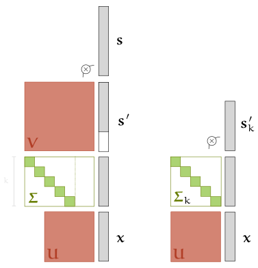

(left) A multiplication diagram for the operation above (with the +𝐭 term omitted). (right) The reduced version we will derive below.

From the multiplication diagram, we see that 𝚺 contains a number of zero columns which essentially ignore the corrsponding dimensions of 𝐬′. Call 𝐬′k the vector 𝐬′ with these dimensions removed, and call 𝚺k the matrix 𝚺 with the corresponding columns removed. This gives us

𝐱\=𝐔𝚺k𝐬′k+𝐭.

We set 𝐁\=𝐔𝚺k to obtain the required result. Note that the diagonal of 𝚺 must contain all non-zero elements, or we would not have full support, so that it must be invertible. 𝐔 is also invertible, since it is orthogonal, and multiplying two invertible matrices together results in another invertible matrix.

If all that seems a bit technical, the key idea is that an affine transformation that results in full support on ℝk must map k dimensions in the input to k dimensions in the output. The rest are dimensions that are ignored (they are in the _null space_ of 𝐀). The trick is then to isolate just those k dimensions, and to ignore the rest.

The singular value decomposition is just a handy tool to isolate the right dimensions.

### The sum of two Gaussians is a Gaussian

Let 𝐚 be a vector sampled from one Gaussian and 𝐛 be a vector sampled from another Gaussian. Sum them together and return the result 𝐜\=𝐚+𝐛. What is the distribution on 𝐜?

It may not surprise you to learn that the result is another Gaussian.

It pays to be careful here. If I give you the probability density functions of two Gaussians, and you create a new probability density function by making a weighted sum of these two densities for a given value 𝐱, then the result of that is a mixture-of-Gaussians, which is usually, decidedly _not_ Gaussian. What we are talking about here is _sampling_ from two different Gaussians, and then summing the sampled values.

**question**: I am a teacher and my class has students from two different schools in equal proportion, with different mean grades. The probability over the whole class of someone scoring a grade of 6 is the average of the probability that someone from school 1 scores a 6 and the probability that someone from school 2 scores a 6. Is the result necessarily a Gaussian? Consider what the distribution looks like if the mean grades for the two schools are very far apart.

**question**: I pair up each student from school 1 with a student from school 2. For one such pair, I test both, and average their grades. What is the distribution on the average I get? Is it Gaussian?

We can prove this property using our geometric construction, but we have to be a little bit more inventive than before. The key is to realize that the _concatenation_ of 𝐚 and 𝐛 has a Gaussian distribution and that given this concatenation, the sum is just an affine operation.

We’ll first show that the concatenation of two Gaussians yields a Gaussian. This is a very intuitive result, that you may well be willing to accept without proof, but it doesn’t hurt to be rigorous.

**Lemma. Concatenation of Gaussian variables** Let 𝐚 and 𝐛 be vectors

𝐚𝐛𝐜∼N(μ,𝚺), ∼N(ν,𝐓) and \=(𝐚𝐛).

That is, 𝐜 is the concatenation of 𝐚 and 𝐛. Then p(𝐜) is Gaussian with mean (μν) and covariance (𝚺𝟎𝟎𝐓).

Proof. First, we rewrite 𝐚 and 𝐛 as affine transformations of standard normal noise:

𝐚𝐛\=𝐀𝐬+μ\=𝐁𝐭+ν.

Where 𝐬 and 𝐭 are standard normal and 𝚺\=𝐀𝐀T and 𝐓\=𝐁𝐁T. Then, 𝐜 can be written as

𝐜\=(𝐚𝐛)\=(𝐀𝐬+μ𝐁𝐭+ν)\=𝐂(𝐬𝐭)+(μν)

where

𝐂\=(𝐀𝟎𝟎𝐁).

Now, note that the vector (𝐬𝐭) consists only of univariate, standard-normal elements. In other words, this vector is a standard-normal sample itself. This means that 𝐜 has a Gaussian distribution. From the affine transformation above, we see that its mean is the concatenation of μ and ν as required. Its covariance is 𝐂𝐂T, which the following diagram shows is equal to the covariance in the proof statement.

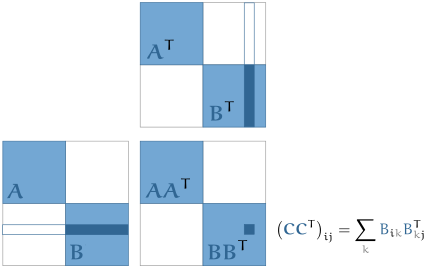

Using this lemma, the result for summing Gaussians follows almost directly.

**Theorem. Sum of Gaussian variables** Let

𝐚𝐛𝐜∼N(μ,𝚺), ∼N(ν,𝐓) and \=𝐚+𝐛.

Then p(𝐜)\=N(𝐜∣μ+ν,𝚺+𝐓).

Proof. Let k be the dimensionality of 𝐚 and 𝐛.

Let 𝐝 be the concatenation of 𝐚 and 𝐛. By the lemma above, 𝐝 follows a Gaussian distribution.

To turn two concatenated vectors into the sum of two vectors, we can multiply by the matrix (𝐈𝐈)—that is, two identity matrices side by side. If we have 𝐜\=(𝐈𝐈)𝐝, then

ci\=∑k(𝐈𝐈)ikdi\=ai+bi.

This shows that 𝐝 is Gaussian.

To work out the parameters, we write out the full operation: concatenation and summation:

𝐜\=(𝐈𝐈)(𝐀𝟎𝟎𝐁)(𝐬𝐭)+(𝐈𝐈)(μν)\=(𝐀𝐁)𝐬′+μ+ν.

Which tells us that the mean is μ+ν and the covariance matrix is (𝐀𝐁)(𝐀𝐁)T\=𝐀𝐀T+𝐁𝐁T.

### Chaining Gaussians

Here’s a situation that comes up occasionally. We sample a vector 𝐚 from one Gaussian, and then make this the mean of another Gaussian. We then sample 𝐛 from the second Gaussian. What’s the distribution on 𝐛? If we are given the values of 𝐚, it’s a Gaussian, that’s how we defined it. But what about p(𝐛). That is, what if someone told us only they had followed this process, but they didn’t tell us what the value of 𝐚 was? What probabilities would we assign to a given value of 𝐛?

An example is trying to saw one plank to the length of another. You measure one plank and then saw the other to the length of your measurement. Both steps have some error: there is some error in how accurately you measure, and some error in how accurately you saw. Both processes are probably Gaussian: if you repeat the measurement or the sawing and plot the results, a bell shape will appear.

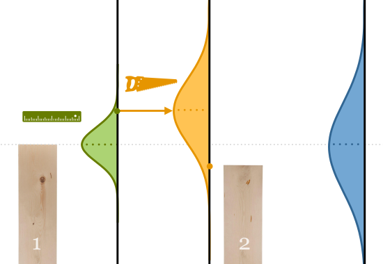

We measure plank 1, and then saw plank 2 to the measured length. Both actions have some inaccuracy in the form of Gaussian noise. Can we show that the distribution on the end result (a) is Gaussian and (b) has the length of the first plank as its mean?

The question now is what distribution we get if we don’t know the measurement. Or, if you like, if we repeat the whole experiment many times. What will the distribution be on the length of plank we saw, combining both the uncertainty in the measuring and in the cutting.

It turns out that this distribution is Gaussian as well. One way to think of this distribution is as a _convolution_ of the two Gaussians we used for sampling. At every point 𝐱 in space we place a Gaussian. The probability density is a mixture of all these Gaussians, weighted by how likely we are to put a Gaussian at 𝐱. Put differently, the probability p(𝐲) assigned to some point is a weighted “sum”—or more precisely an integral—of all the Gaussians we could sample in the first step, all weighted by how likely they are to be sampled.

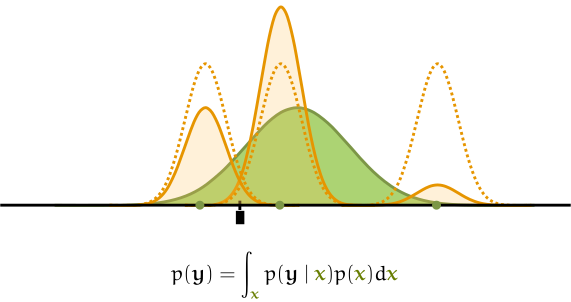

Imagine placing copies of one Gaussian along the number line at various points. We then take a weighted sum of these Gaussians, where the weight is the density of the point according to a second Gaussian. The result, as the number of points goes to infinity, is the _convolution_ of the two Gaussians.

We could use this integral to work out the shape of p(𝐲), but that would require lots of calculus. Instead, we will use our geometric perspective to take a shortcut.

**Theorem. Gaussian convolution.** Let

𝐚𝐛∼N(μ,𝚺) and ∼N(𝐚,𝐓).

Then,

p(𝐛)\=N(μ,𝚺+𝐓).

Proof. From our geometric definition, we can rewrite 𝐚 as 𝐚\=𝐀𝐬+μ with 𝐬 a standard-normally distributed vector, and 𝚺\=𝐀𝐀T. Likewise we can write, 𝐛\=𝐁𝐭+𝐚 with 𝐭 a _separate_ standard normally distributed vector and 𝐓\=𝐁𝐁T. Note that 𝐚 takes the roles of the translation vector in the definition of 𝐛.

In this view, we sample 𝐬 and 𝐭, and then compute 𝐚 and 𝐛 from them as regular vectors. That means we can plug the definition of 𝐚 into that of 𝐛 and get

𝐛\=𝐁𝐭+𝐀𝐬+μ.

The first two terms, 𝐁𝐭+𝐀𝐬 form the sum of two zero centered Gaussians. By the result of the previous section, this is equal to a single Gaussian with covariance 𝚺+𝐓.

In the geometric view, we can say that 𝐛\=𝐘𝐮+μ, with 𝐮 standard normally distributed and 𝐘𝐘T\=𝐀𝐀T+𝐁𝐁T

We’ll work out the spherical case specifically as a corollary, since it’s so central to diffusion models.

**Corollary. Spherical Gaussian convolution** Define 𝐚 and 𝐛 as before, but with the constraint that they are spherical Gaussians with scalar standard deviations σ and τ respectively. Then

𝐛𝐛∼N(μ,σ2+τ2)and\=σ2+τ2−−−−−−√𝐬+μ

Proof. Take the result from the proof and let 𝚺 be diagonal matrix with every Σii\=σ and likewise for 𝐓. Then 𝚺𝚺T is a diagonal matrix with all diagonal elements equal to σ2 and likewise for 𝐓𝐓T so that

N(μ,𝚺𝚺T+𝐓𝐓T)\=N(μ,σ2+τ2).

For the geometric definition of 𝐛, note that the transformation matrix 𝐀 should have the property that 𝚺\=𝐀𝐀T. Since 𝚺 is the diagonal matrix (σ2+τ2)𝐈, we can derive 𝐀 simply by taking the square root of these diagonal elements

𝐀\=σ2+τ2−−−−−−√𝐈.

### Conditioning Gaussians

What if we want to _condition_ 𝐱 on one or more of its values? For instance, we are interested in the distribution p(𝐱∣x2\=3) where 𝐱 is drawn from a Gaussian. We can show that the result is, again, a Gaussian.

For a real-world example, we can look at our population of female soldiers again. If the combination of their heights and the weights is normally distributed, then what happens if we slice out only those soldiers that are 192cm tall? Do we get a Gaussian distribution on the weights in this subpopulation?

This one is a little more complex to prove. We will start with a lemma showing a single, specific, case. If 𝐱 is drawn from the standard normal distribution N(𝟎,𝐈), and we condition on one of the elements having a particular value c, then the resulting distribution p(𝐱∣xi\=c) is standard normal on the remaining elements of 𝐱. This result will require us to open the box and to look at the formula for N(𝟎,𝐈), but as we saw earlier, this formula is relatively straightforward.

With that lemma in place, we can then show our main result: that for _any_ variable y with a Gaussian distribution, conditioning on one of the elements of 𝐲 results in another Gaussian. This, we can do entirely by the affine operation trick.

**Lemma. Gaussian conditioning** Let 𝐱∼Nn(𝟎,𝐈). Then for any element xi, and value c,

p(𝐱∣xi\=c)

is a standard Gaussian Nn−1(𝟎,𝐈) on the remaining elements of 𝐱.

Proof. To start with, consider how this conditional distribution is defined. In two dimensions, the situation looks like this.

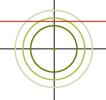

The constraint xi\=c tells us that we assume that 𝐱 is on the red line. The probability density for points that are not on the line becomes zero. The density for points on the line stays the same, but should be rescaled uniformly so that the probability density, if we integrate over the whole line becomes 1.

Extending this to n dimensions, if we condition on one element xi of 𝐱, the result is that the line becomes an n−1 dimensional hyperplane orthogonal to the i\-th axis. For any point in this hyperplane, we take the probability density under Nn(𝟎,𝐈) and rescale it, so that the whole hyperplane integrates to 1.

This integral sounds like a tricky one to work out. Luckily, we don’t have to. We just assume it exists, and work around it with the “proportional to” trick we saw earlier.

To make the notation simpler, we will assume, [without loss of generality](https://gestalt.ink/wlog), that xi is the last element of 𝐱, that is xn. We call the vector 𝐱 with the n\-th element removed 𝐱∖n

Then if 𝐱 has xn\=c, we have

p(𝐱∣xn\=c)∝Nn(𝟎,𝐈)\=exp−12‖𝐱‖2\=exp−12(x12+…+xn−12+xn)\=exp−12(x12+…+xn−12+c)\=exp−12(x12+…+xn−12)⋅exp−12c∝exp−12(x12+…+xn−12)\=exp−12‖𝐱∖n‖2\=Nn−1(𝐱∖n∣𝟎,𝐈).

We see that the probability density that p(𝐱∣xn\=c) assigns to the vector 𝐱, if xn\=c, is proportional to the density that Nn−1(𝐱∖n) assigns to the first n−1 elements of 𝐱. Normally, to turn this into a fully determined probability function, we need to figure out what this integrates to and divide by that to turn the ∝ into a \=. However, in this case, we know what the right-hand side integrates to, because Nn−1 is already a proper probability density function, and we are allowing all possible values for 𝐱∖n. It integrates to 1, so we can simply say that

p(𝐱∣xn\=c)\=Nn−1(𝟎,𝐈).

Why doesn’t this argument hold for Gaussians in general? It’s the “orthogonal” structure of the standard Gaussian. This allows us to remove one dimension, after which we are left simply with a standard Gaussian of one dimension fewer.

However, we can build on this result to show that conditioning in general produces a Gaussian. All we need to do is to show that a conditioned Gaussian can be transformed _to_ a conditioned standard normal Gaussian. Since anything that can be transformed to a Gaussian is itself Gaussian (so long as the transformation has linearly independent columns), this proves the result.

**Theorem. Gaussian conditioning.** If we sample 𝐱 from any Gaussian with full support, and condition on one of its elements, the resulting distribution, p(𝐱∣xi\=c), is Gaussian.

Proof.

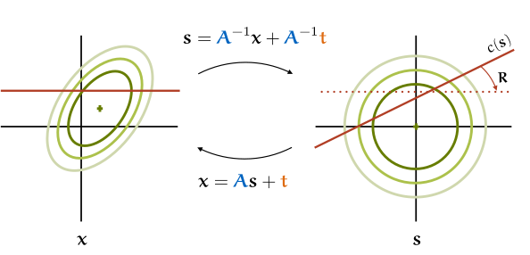

The key idea of the proof. The 𝐬’s that result in samples 𝐱 that satisfy xi\=c form a hyperplane constraint on the standard Gaussian on 𝐬. With a simple rotation, which doesn’t affect the density, we translate to the situation of the lemma. We can now say that we can transform _from_ p(𝐱∣xi\=c) to p(𝐬∣sj\=c′) by an invertible, affine operation. As we showed earlier, this means that p(𝐱∣xi\=c) must be Gaussian.

Since p(𝐱) is Gaussian, there is some invertible 𝐀 and 𝐭 so that 𝐱\=𝐀𝐬+𝐭 with 𝐬∼N(𝟎,𝐈). This means that xi\=𝐚i𝐬+ti, where 𝐚i is the i\-th row of 𝐀.

Our conditioning xi\=c, gives us 𝐚i𝐬+ti\=c, a linear constraint on the values of 𝐬. Since it’s an extra constraint in one variable, it essentially means that if we know all values of 𝐬 except one, say s1, then we can work out what s1 must be. We can show this with some simple re-arranging:

yi\=cs1\=Ai1s1+…+Ainsn+ti\=−1Ai1(Ai2s2+…+Ainsn+ti−c).

The last line represents a constraint on 𝐬. We’ll refer to this constraint as c(𝐬), a boolean function which is true if the constraint holds for 𝐬.

Now, since c(𝐬) linearly expresses one element of 𝐬 in terms of the other n−1, the 𝐬’s that satisfy it form an n−1 dimensional hyperplane. It’s not axis-aligned, as it was in the lemma before, but that can be fixed with a simple rotation. Let 𝐑 be an orthogonal matrix such that the transformation

𝐳\=𝐑𝐬

when applied to the hyperplane c(𝐬) yields a hyperplane orthogonal to the n\-th axis.

Since N(𝟎,I) is rotationally symmetric, the density of any point 𝐬 remains unaffected when it is mapped to 𝐳. This tells us that p(𝐬∣c(𝐬))\=p(𝐳∣zn\=c′) for some value c′.

And with that, we can apply our lemma. p(𝐳∣zn\=c′) is a standard Gaussian, by the lemma. p(𝐱∣c(𝐱)) is an orthogonal transformation of it, so also a standard Gaussian, and p(𝐱∣xk\=c) is an affine transformation of that (with an invertible matrix), so also Gaussian.

Finally, if we want to condition on more than one element of 𝐱, we could repeat the same proof structure any dimension of hyperplane, but it’s simpler to just apply the theorem multiple times.

**Corollary. Gaussian conditioning on multiple elements.** If we sample 𝐲 from any Gaussian, and condition on m of its elements, the resulting distribution is Gaussian.

Proof. Assume we have a Gaussian p(x1,…,xn). Conditioning on x1 gives us, by the theorem, a Gaussian p(x2…,xn∣x1). Since the latter is a Gaussian, we can condition on one of its elements and, by the theorem get another Gaussian p(x3,…xn∣x1,x2). We can do this for any number of elements, and in any order we like.

**question:** What if you want to know not just whether the conditional a Gaussian is, but _which_ Gaussian? I.e. what are its parameters? How would you proceed? Which elements of the proof would you need to work out in greater detail?

Deriving the density
--------------------

To finish, we will see where that gargantuan formula comes from. With the picture we have built up, of Gaussians as affine transformations of a single standard Gaussian, it’s not so complex to derive. We just need one small trick.

To build our intuition, let’s look at a very simple 2D Gaussian, as defined by the transformation

𝐱\=𝐈𝐬+(11).

That is, we don’t squish or stretch the standard-normal distribution, we just shift it around a bit, _translate_ it.

To figure out what the density of a particular point 𝐱 is, all we need to do is shift it back. For example, if 𝐱\=(21), a point one unit above the mean, we can work out the density by shifting this point back to (10), the point one unit above the mean of the standard Gaussian. Since the two distributions are just translations of each other, these points will have the same density under their respective distributions.

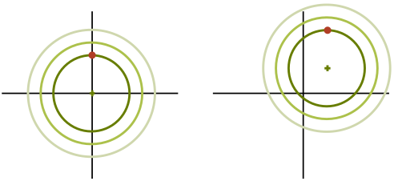

This tells us that we can express the density of our new function in terms of the density function we already have for the standard Gaussian.

N(𝐱∣𝐈,𝐭)\=N(𝐬−𝐭|𝐈,𝟎)

Now, we know the density function of the standard Gaussian, that’s

N(𝐬∣𝐈,𝟎)\=1zexp −12‖𝐬‖2.

So, if we fill in 𝐬\=𝐱−𝐭 we get

N(𝐱∣𝐈,𝐭)\=1zexp −12‖𝐱−𝐭‖2.

The idea is simple: for a given Gaussian expressed as a transformation of the standard Gaussian, we transform 𝐱 back to the standard Gaussian, by inverting the transformation, and then we just read off the density.

Can we apply the same idea to the transformation matrix 𝐀? Here we have to be a bit more careful. As we transform by 𝐀, it may stretch or shrink space. It’s easiest to see what might go wrong in the 1D case:

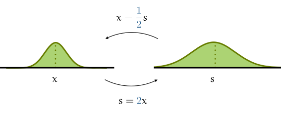

As you can see, if we have σ\=1/2, then after we multiply by 1/σ\=2, the whole function blows up as a result. This means that the area under the curve will no longer sum to 1. Luckily, the increase is simply a factor of σ, so if we apply the change of variables naively, all we have to do is divide the result by 1/σ to correct the error.

If you’re not convinced, imagine approximating the bell curve by a series of boxes. Multiplying by σ stretches each box horizontally but not vertically, so the area goes from height times width to height × width ×σ. When we sum over all boxes, we can take σ out of the sum to see that the total area is multiplied once by σ. Now let the width of the boxes shrink to get a better and better approximation.

The same reasoning applies in higher dimensions. Assume we have our Gaussian described in terms of an invertible transformation matrix 𝐀—which, as we showed before, is always possible.

We can carve up the plane of a 2D Gaussian into squares, and approximate the _volume_ under the surface with a series of rectangular columns on top of these.

The result of transforming the Gaussian by 𝐀 is that the squares are stretched into parallelograms. Happily, because it’s a linear transformation, every square is stretched into a parallelogram of the same size. We know much the surface area shrinks or increases, because that’s simply the determinant of 𝐀.

With that, we can establish our formula for the density. We know that 𝐱\=𝐀𝐬+𝐭 defines our Gaussian. To work out the density of 𝐱, all we need to do is invert our function to find the corresponding 𝐬, take its density, and then correct for the amount by which 𝐀 inflates space by multiplying with 1/|𝐀|.

N(𝐱∣𝐀,𝐭)\=N(𝐬\=𝐀−1(𝐱−t)∣𝐈,𝟎)\=1|𝐀|×1zexp −‖𝐀−1(𝐱−t)‖2\=1z|𝐀|exp −(𝐀−1(𝐱−t))T(𝐀−1(𝐱−t))\=1z|𝐀|exp −(𝐱−t)T(𝐀T𝐀)−1(𝐱−t)

In the last two lines, we've used the properties that ‖z‖2\=𝐳T𝐳, that 𝐀−1𝐁−1\=(𝐁𝐀)−1 and that (𝐀−1)T\=(𝐀T)−1.

This is the density function of a Gaussian expressed in the geometric parameters. If we want to translate this to the more common parametrization in terms of the covariance matrix 𝚺\=𝐀T𝐀, we just need to note that the determinant has the properties that |𝐀𝐁|\=|𝐀|×|𝐁| and |𝐀T|\=|𝐀|, so that

|𝐀|\=|𝐀T𝐀|12\=|𝚺|12.

Filling this in, we get

1z|𝚺|12exp −(𝐱−t)T𝚺−1(𝐱−t).

This is exactly the formula we started with at the top of the article, except that we haven’t bothered to work out z\=∫∞−∞exp −12|𝐱|2. This is called the [Gaussian integral](https://gestalt.ink/gaussian-integral), and as you can tell from the completed formula, it works out to (2π)−12d, where d is our dimension. We will leave this working out to another article.

You may ask what happens if 𝐀 is not invertible. Well, then 𝚺 isn’t either, and the traditional parametrization breaks down. However, in the geometric parametrization, we have some hope left. We know that we still have a Gaussian on our hands, with a bell shape and everything. It’s just that it only covers a linear subset of space.

Sources and other materials
---------------------------

*   We discuss these same topics in our [lecture on Diffusion models](https://dlvu.github.io/diffusion/) in the [deep learning course at the Vrije Universiteit Amsterdam](https://dlvu.github.io/). This lecture is a little more compact than this article, which may help you to get the general overview. It comes with videos (or will do soon).

References
----------

\[1\] Paquette, S. (2009). [Anthropometric survey (ANSUR) II pilot study](https://www.openlab.psu.edu/ansur2/): methods and summary statistics. Anthrotch, US Army Natick Soldier Research, Development and Engineering Center.
