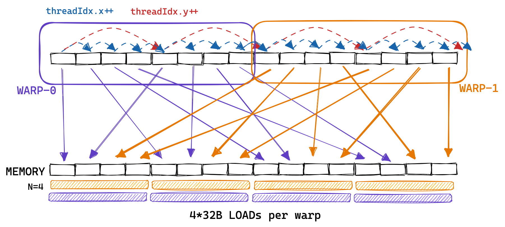

# How to Optimize a CUDA Matmul Kernel for cuBLAS-like Performance: a Worklog
[How to Optimize a CUDA Matmul Kernel for cuBLAS-like Performance: a Worklog](https://siboehm.com/articles/22/CUDA-MMM) 

 In this post, I’ll iteratively optimize an implementation of matrix multiplication written in CUDA. My goal is not to build a cuBLAS replacement, but to deeply understand the most important performance characteristics of the GPUs that are used for modern deep learning. This includes coalescing global memory accesses, shared memory caching and occupancy optimizations, among others.You can download the code for all kernels from [Github](https://github.com/siboehm/SGEMM_CUDA). Also checkout [wangzyon’s repo](https://github.com/wangzyon/NVIDIA_SGEMM_PRACTICE) from which I copied the benchmarking setup. This post is less polished than my normal uploads, and includes many more sidenotes. I used it as notepad for ideas and scribbles while writing the kernels. That’s why I called it a worklog :)

Matrix multiplication on GPUs may currently be the most important algorithm that exists, considering it makes up almost all the FLOPs during the training and inference of large deep-learning models. So how much work is it to write a performant CUDA SGEMMSGEMM performs `C=αAB+βC` at single (=32b) precision. from scratch? I’ll start with a naive kernel and step-by-step apply optimizations until we get within 95% (on a good day) of the performance of cuBLAS (NVIDIA’s official matrix library):cuBLAS at FP32 that is. In my setting, doing the matmul using TF32 or BF16 precision allows cuBLAS to use the tensor cores, which increases FLOPS by 2.5x or 3.5x. I may look into tensor cores / warp matrix functions in a future post.

| Kernel | GFLOPs/s | Performance relative to cuBLAS |
| --- | --- | --- |
| 1: Naive | `309.0` | `1.3%` |
| 2: GMEM Coalescing | `1986.5` | `8.5%` |
| 3: SMEM Caching | `2980.3` | `12.8%` |
| 4: 1D Blocktiling | `8474.7` | `36.5%` |
| 5: 2D Blocktiling | `15971.7` | `68.7%` |
| 6: Vectorized Mem Access | `18237.3` | `78.4%` |
| 9: Autotuning | `19721.0` | `84.8%` |
| 10: Warptiling | `21779.3` | `93.7%` |
| 0: cuBLAS | `23249.6` | `100.0%` |

Kernel 1: Naive Implementation
------------------------------

In the CUDA programming model, computation is ordered in a three-level hierarchy. Each invocation of a CUDA kernel creates a new grid, which consists of multiple blocks. Each block consists of up to 1024 individual threads.These constants can be looked-up in the [CUDA Programming guide](https://docs.nvidia.com/cuda/cuda-c-programming-guide/index.html#compute-capabilities). Threads that are in the same block have access to the same shared memory region (SMEM).

The number of threads in a block can be configured using a variable normally called `blockDim`, which is a vector consisting of three ints. The entries of that vector specify the sizes of `blockDim.x`, `blockDim.y` and `blockDim.z`, as visualized below:


Similarly, the number of blocks in a grid is configurable using the `gridDim` variable. When we launch a new kernel from the hostIn accelerator lingo, _host_ refers to the CPU and _device_ is the accelerator, here the GPU., it creates a single grid, containing the blocks and threads as specified.From here on I’ll only be talking about 2D grids and blocks, partly because the 3D-structure is seldom used and because drawing in 3D is too hard. It’s important to keep in mind that the thread hierarchy we just talked about mostly concerns program correctness. For program performance, as we’ll see later, it’s not a good idea to treat all threads in the same block as equals.

For our first kernel, we’ll use the grid, block and thread hierarchy to assign each thread a unique entry in the result matrix C. Then that thread will compute the dot product of the corresponding row of A and column of B, and write the result to C. Due to each location of C being written to by only one thread, we have to do no synchronization. We’ll launch the kernel like so:

```
// create as many blocks as necessary to map all of C
dim3 gridDim(CEIL_DIV(M, 32), CEIL_DIV(N, 32), 1);
// 32 * 32 = 1024 thread per block
dim3 blockDim(32, 32, 1);
// launch the asynchronous execution of the kernel on the device
// The function call returns immediately on the host
sgemm_naive<<<gridDim, blockDim>>>(M, N, K, alpha, A, B, beta, C); 
```

CUDA code is written from a single-thread perspective. In the code of the kernel, we access the `blockIdx` and `threadIdx` built-in variables. These will contain return different values based on the thread that’s accessing them.In our example, `threadIdx.x` and `threadIdx.y` will vary from 0 to 31 based on the position of the thread in the grid. Same for `blockIdx.x` and `blockIdx.y`, which will vary from 0 to `CEIL_DIV(N, 32)` or `CEIL_DIV(M, 32)` based on the position of the thread’s block in the grid. We’ll do a lot of indexing into strided in-memory representations of matrices. Edward Yang’s post on [PyTorch Internals](http://blog.ezyang.com/2019/05/pytorch-internals/) contains a good explanation of strided tensors.

```
__global__ void sgemm_naive(int M, int N, int K, float alpha, const float *A,
                            const float *B, float beta, float *C) {
  // compute position in C that this thread is responsible for
  const uint x = blockIdx.x * blockDim.x + threadIdx.x;
  const uint y = blockIdx.y * blockDim.y + threadIdx.y;

  // `if` condition is necessary for when M or N aren't multiples of 32.
  if (x < M && y < N) {
    float tmp = 0.0;
    for (int i = 0; i < K; ++i) {
      tmp += A[x * K + i] * B[i * N + y];
    }
    // C = α*(A@B)+β*C
    C[x * N + y] = alpha * tmp + beta * C[x * N + y];
  }
} 
```

To visualize this simple kernel:If the size of the matrix is not divisible by the size of the block, we’ll have to launch extra blocks to process the remainder. For example, in the picture below, we’ll create 9 blocks of equal threadsize, but only 4 of those fully utilize their 1024 threads. This artifact is called [tile quantization](https://docs.nvidia.com/deeplearning/performance/dl-performance-matrix-multiplication/index.html#tile-quant), and appears whenever we try to map a fixed-sized volume across a variable-sized input.


This kernel takes about 0.5s to process three 4092² fp32 matrices on my A6000 GPU. Let’s do some non-implementation-specific calculations:

### Lower Bounding the Fastest Possible Runtime

For a matrix multiplication of two 4092² matrices, followed by an addition of a 4092² matrix (to make the [GEMM](https://en.wikipedia.org/wiki/Basic_Linear_Algebra_Subprograms#Level_3)):

1.  Total FLOPS:For each of the 4092² entries of C, we have to perform a dot product of two vectors of size 4092, involving a multiply and an add at each step. “Multiply then add” is often mapped to a single assembly instruction called FMA (fused multiply-add), but still counts as two FLOPs. `2*4092³ + 4092² = 137 GFLOPS`
2.  Total data to read (minimum!): `3 * 4092² * 4B = 201MB`
3.  Total data to store: `4092² * 4B = 67MB`

So 268MB is the absolute minimum of memory that any implementation would have to transfer from/to global GPU memory,Global memory is the GPU’s main memory region. If Nvidia sells you a GPU advertised with 80GB of memory and 1TB/s of bandwidth, they’re talking about the capacity and bandwidth of global memory. Later we’ll talk about other memory regions on the GPU, like the shared memory, which is physically distinct and has very different performance characteristics. assuming it has a big enough cache.The cuBLAS kernel loads a total of 500MB of GMEM during the whole calculation. We’ll see later how increasing arithmetic intensity allows us to achieve an access volume that low. Let’s calculate some upper bounds on kernel performance. The GPU is advertised with 30TFLOPs/s of fp32 compute throughput and 768GB/s of global memory bandwidth. If we achieved those numbers,Reminder that peak FLOPs is a reductionist metric, since it depends on the instruction mix. There’s no way you’d reach those 30TFLOPs/s if your FLOP of choice is DIV. However, since matmul uses mainly FMA instructions, which tends to be the fastest FLOPs, we have a good chance of actually getting close to that peak FLOP value. Similar story for the bandwidth: Peak bandwidth can only be reach if the access pattern suits the hardware. we’d need 4.5ms for the calculation and 0.34ms for the memory transfers. So in our napkin math, the calculation takes ~10x more time than the memory accesses. This means our final optimized kernel will be compute-bound, as long as we end up having to transfer <10x the absolute minimum memory volume of 278MB.The A6000 is advertised with 309TFLOPs/s of tensor core performance. If we could use tensor cores for our fp32 matmul, the calculation would only take 0.44ms, and an optimized kernel doing 4092^2 matrix mul would almost surely still be memory bound. This puts into perspective just how fast the tensor cores are.

Now that we’ve calculated some lower bounds for our fp32 GEMM calculation, let’s get back to the kernel on hand, to figure out why it’s so much slower than it could be.

### Memory Access Pattern of the Naive Kernel

In our kernel, two threads in the same block with ThreadIds (0, 0) and (0, 1) will load the same column of B but different rows of A. If we assume the worst case of zero caching, then each thread has to load `2*4092+1` floats from global memory. As we have 4092² threads total, this would result in 548GB of memory traffic.

Below is a visualization of the memory access pattern of our naive kernel, taking two threads A (red) and B (green) as an example:


So to recap, when I run this kernel on an A6000 GPU it achieves ~300GFLOPs when multiplying two 4092x4092 float32 matrices. Pretty bad, considering that the A6000 is advertised as being able to achieve almost 30 TFLOPs.Just for comparison, 300 GFLOPs is also roughly the performance achieved by the optimized BLAS library on the 2015 Haswell CPU that I used in my [earlier post](https://siboehm.com/articles/22/Fast-MMM-on-CPU) on CPU matmul. So how can we start to make this faster? One way is to optimize the memory access pattern of our kernel such that global memory accesses can be coalesced (=combined) into fewer accesses.

Kernel 2: Global Memory Coalescing
----------------------------------

Before we get into global memory coalescing, we need to learn about the concept of a warp. For execution, the threads of a block are grouped into so-called warps, consisting of 32 threads. A warp is then assigned to a warp scheduler, which is the physical core that executes the instructions.Before the Volta architecture, it used to be the case that all threads of a warp were fed from the same instruction stream. On a branch, the threads that didn’t take the branch were inactived using the so-called active mask. However, since Volta, it’s no longer a good idea to rely on this ‘warp-synchronous’ behaviour, as instructions from different branches may be interleaved even for the same threads within a warp. There are four warp schedulers per multiprocessor. The grouping into warps happens based on a consecutive `threadId`. If we set the `blockDim` to be multi-dimension, then the threadId is calculated like so:

```
threadId = threadIdx.x+blockDim.x*(threadIdx.y+blockDim.y*threadIdx.z) 
```

Then, threads with neighbouring `threadId` become part of the same warp. Below I tried to illustrate this, using a smaller “warpsize” of 8 threads (real warps always contain 32 threads):I like to think of the three dimensions `x,y,z` of `threadId` as being “column-major”, due to the first dimension `x` being the one that’s continuous in “warpspace”. I don’t know if others use that term, but it makes the concept more clear to me.


The concept of a warp is relevant for this second kernel, as sequential memory accesses by threads that are part of the same warp can be grouped and executed as one. This is referred to as **global memory coalescing**. It’s the most important thing to keep in mind when optimizing a kernel’s GMEM memory accesses toward achieving the peak bandwidth.

Below is an example, where consecutive memory accesses by threads in the same warp are grouped, allowing each warp to execute 8 memory accesses using only 2 32B loads:


In reality, the GPU supports 32B, 64B and 128B memory accesses. So, if each thread is loading a 32bit float from global memory, the warp scheduler (probably the MIO) can coalesce this `32*4B=128B` load into a single transaction. This is only possible if the floats loaded are consecutive in memory, and if access is aligned.In that way, optimizing for global memory coalescing on GPU has a lot of similarities to optimizing for cache line utilization on CPU. Interestingly, to allow coalescing the threads within a warp have to access consecutive addresses, but the accesses don’t have to be consecutive within-warp. Illustrated below: 
 If they aren’t, or if access cannot be coalesced for some other reason, then the GPU will execute as many 32B loads as necessary to fetch all floats, leading to a lot of wasted bandwidth. Profiling our naive kernel, we can observe the detrimental effect of non-coalesced access as we achieve only 15GB/s of GMEM throughput.

Looking back at the previous kernel, we assigned threads their entry of C like so:

```
const uint x = blockIdx.x * blockDim.x + threadIdx.x;
const uint y = blockIdx.y * blockDim.y + threadIdx.y; 
```

Hence, threads of the same warp (those with consecutive `threadIdx.x`) were loading the rows of A non-consecutively from memory. The naive kernel’s pattern of accessing the memory of A looked more like so:



To enable coalescing, we can change how we assign positions of the result matrix C to threads. This change in the global memory access pattern is illustrated below:


To implement this, we only need to change the first two lines:

```
const int x = blockIdx.x * BLOCKSIZE + (threadIdx.x / BLOCKSIZE);
const int y = blockIdx.y * BLOCKSIZE + (threadIdx.x % BLOCKSIZE);

if (x < M && y < N) {
  float tmp = 0.0;
  for (int i = 0; i < K; ++i) {
    tmp += A[x * K + i] * B[i * N + y];
  }
  C[x * N + y] = alpha * tmp + beta * C[x * N + y];
} 
```

And we call it like so:This wasn’t immediately obvious to me, but enabling GMEM coalescing changes nothing in the assembly, see the SASS output on [Godbolt](https://godbolt.org/#z:OYLghAFBqd5TKALEBjA9gEwKYFFMCWALugE4A0BIEAZgQDbYB2AhgLbYgDkAjF%2BTXRMiAZVQtGIHgBYBQogFUAztgAKAD24AGfgCsp5eiyahUAV0wtyKxqiIEh1ZpgDC6embZMQAJnLOAGQImbAA5TwAjbFJfWQAHdCViByY3Dy9fcgSk%2ByEgkPC2KJifWRtsOxSRIhZSIjTPbz9yyqFq2qJ8sMjo2OsauoaM5oHO4O6i3tKASmt0M1JUTi4AUh8AZjjSFmA2FgBqISWVrQBBE/ON4NQPHH2V9ZdxJRU6h9wLtfXr2%2Bx7x9QSiIhHQ70%2BVyYNwsfweTyBmHoBAiYLOXx%2B0P%2BTzMESMSgA%2BgA3HwAOiQKMu30hv0x5kseNIZmEBA4pPJFzxeOA9HQEQkHP2BPQBEw%2ByUwGwbDYnO5vPoeI4UowEmwSiWEGCRH2AFlyPsNftQrr9QBpXU0bksTUSOJIKwXfYOx1O50u11ul0YJhA/bm9CW/YAKlOus93t9/oDACFyPb3XH4/Hw5qojUzRbNQGXNN7gB2SOx/WRgIAeRcxpEAEkAFofdYAEXWPge%2BbODtDmv1qAASugAO7/Ov7HHoVAAawrmHUxPUgf2RdL5eruHuPkj%2BwgRCQpGwLEwE6nM4A9HOS2XKzXps3Y%2B29cJ9qg0gOh9yx/viQBPWfzs9Lldrjdbjue6TtOK4AKwngu564Je6wtucrb7Iex4EDQoo1EQErMB2Sj7CESwvLUn4kPseyjn8m7BMAuG9mQo77IyOCkPs9iMPsACOZjGPYABelopAWaEQN2faYtqK4AGxrBJ96PrCBrZiseaxg6SYsWwcRPloxJaFeiGqWQ676gQWnNnqYnGmZaz5quBCKcp%2BmOkQGl/g8g7nGBkYif2Ab7Maf56isYGDr5%2BaeSZvmhAFD7uEFdZ6acTpKfFjkuEFXk9j5BrRWkcVPtatqzs5mnWUO2A1LOaWed5s5RaVMX0HFCUOslnw5nWXCzPQ3Bgfw3hcDo5DoNwLgKHWiVpaupVKPMiwwhsfDkEQ2idbMSBAb0ECzKOsTEgAnAdh1HUdEmGNw0h9StQ3cPwSggFoS0rbMcCwCgGAaQw0SUNQ71xJ9MRMASqCoDwPA5uQOAEgQSwAGoENgvbFnEzBXXQ9CYaQd0QBEV0RMERHcIt70cMIxZMPQ75XTgewmJIA38IQ26VASKpXdg6gVGYmGE/wGrYN19OGEi2ykO%2Bbg4FdRCkMyPOzOaOxKHDCNIyjvD8IIwhiMqUiyBrigqBoV36DwhjGKYFhWIiER3ZAszoHEuRetwAC0xbrPszt1qEda4JGCgAOIe874ohNsmHOxgOBubUqBkvWv1c9geIABynZH2BuelCeYSnp1KFKqd5c7zsO%2BoLBKM79uO0obnOwSHvwm5qDWdZYO3fzFSO04TCuO4jQGIE4yFMUBjZMkQhDN4Jtj47XTD70JstI77SDH3GSLx3rRMCvYwFD0MSL6Mk8GECHRz/vUizDNCxLL4XU9ZdgvDVwBowy4Lj7KDxI5jp674MQhkvg%2BGmPwZa9NphrQ2jELa5AdqlH2sdRBB1ToCwuuQfqg1n63Xuo9cB5AXrIDQFgPAhASAUCoLQT6rAOA8zkJrcQkgZB0P1moTQgt9B%2BCMCYNAFtrCby7hAZwx8/CDz3pMEo8REjj1SGvJoWQpGzyHhfUofDbDLyPrIzIS8qijHPuIvop9V7pDkYY3eEwR4zDmDfZYXwtg7D2IcSEGdUSoghFCO4sJnivCIGyNx1JPHwgcL4yk7iYQAnhFbYJ6IPEAmxLiQkJI44fFcSE/xsS6QMiZCyJJnwzgci5DyPkeIBRChFGKCUUoCmynlBKPEjIlSMFVNgTA6o7w6lvJqQ0HS/Jpj9FaegNo7SOQTCMkZN41JBhDEIMM6ZAzRhUqMxZcY1IpisD6WZmZ7LwQdIWU8i4axuUbM1e80yOx3hqm5Z8I5xwgRnKFPZ0EAoAW3LuN8M41gQW/PsmCxybydjkvWK5r4QKfnuVBX8pVnlATeUhSCP4LwJVjMhPUaFT6YRJjhPCFQVRKCIixdApEWDkRYkgKiNE6IMR7tEFin0OJcSZHxR2gl1wXMeOJaS0lZLuDEqELZCy1LFS0jpY5BlmKtI7KZOC5l5KWSlS3WyfLhnqRKlNQFHkMqiV8v5UqBA8qhXShFbK9VcrBRFbmFKiVHRVQ1VlOqq4uWNWCvlAZhVfKCtKqsyqWdMq1RyrFU1cFYytVRO1TqZ0uC9XQVdZ%2Bo1xr7EmjZNc185orkbKAp6kDdybW2rtJBSCUHnX4GwEA6wf5gSjU/G61gcFgJ0M9RAEA3roA%2BowchP1m1/VbSAQGwNQbg0htDbAStEbIwwerBgGMsY40FnjVgotaHE2wmTCmVMJRmzpoNRmncCAszuoLdmnNuZq0oMIfmV0rYizFsQyW0ti1qzlkYaiw6Vb9UWnrLWjDdbyGUKwo2mQuHm0sELa28A7YOxSHu127tPbe19gHIOIdoiWmwBHYh0dFhxzrNnJOqdyDp0ztVDtidc7WALlJJ1xdS7l0ruB6Ztd67O0bvHeVkY26qO3Y4QRPdj4m1EeYhe8icgpB44J6ReiR4bzUTojoIntFtF0Uo/Rh8ZOaOU3UcTC8r6zVvjwe%2BEbH6YO4K/d%2Bn8eDf1/hAf%2BZDU26fTeAzNTFqA5vgXmxBBauBoLHddLg2CHq1tWuGnwRaQBgW0snHge0JI5h8DwdYoNpA5jAuWrzWDcF1vwQ2htKAB1LG%2BsJDt/1QjsGWKEN%2BH8v4/0Gs0gB0tMAGHfQwzgTC9Y/sNuwrR/CUjd17sYgePcNMH1E47ETM8UgDZPp1%2BTKneuSY49vBTYiJP9Gm/3NTZj54H1mFLbA2BhT3T05GlL3A6zYChksfYw7qWlZMxVizVnAELV1G4Ft1KgEgLSwF9aWboE5ukBJYkElwtA54MDoH4a0HFp4FoB6R2fPVr809DL8BG0gBy9gPLv1CvFe4Nd8rZnKv8Gq2QvbfgGva2a9%2Bg2bDBrG3Y1vbrIm%2BMbdHgo4TqmhtjcU0tuT82Vvrzp%2Bos%2BXOBOmNkwt/jm2lrbl23VrQB2DP8Gfids7fxLvMVx6Z8zWg/6kIe42J7BXW02fe/5iB5AvuOZgTtMC6xiRxdByDx3ydOGFvIJD6HFbDNw7ugj%2BzgXgvSD2sSEHWhGw5lTsnZOYFSgSVOrDuzdac1Q4egLdYCvvMJ4CyzTGXXpBAA%3D%3D). Access coalescing is done at kernel runtime by the hardware. This makes sense since coalescing requires aligned access, which cannot be guaranteed at compile time as we pass the matrix pointers as function arguments. Also: the assembly features partial unrolling of our inner loop even though the loop count `K` is not known at compile time. Exciting!

```
// gridDim stays the same
dim3 gridDim(CEIL_DIV(M, 32), CEIL_DIV(N, 32));
// make blockDim 1-dimensional, but don't change number of threads
dim3 blockDim(32 * 32);
sgemm_coalescing<<<gridDim, blockDim>>>(M, N, K, alpha, A, B, beta, C); 
```

Global memory coalescing increases memory throughput from 15GB/s to 110GB/s. Performance reaches 2000 GFLOPS, a big improvement compared to the 300 GFLOPS of the first, naive kernel. For the next kernel, we’ll use the GPU’s fast on-chip memory, called shared memory, to cache data that will be re-used.

Next to the large global memory, a GPU has a much smaller region of memory that is physically located on the chip, called shared memory (SMEM). Physically, there’s one shared memory per SM.Here’s a helpful illustration of the memory hierarchy on an A100 GPU ([source](https://developer.nvidia.com/blog/cuda-refresher-cuda-programming-model/)):
 Logically, this shared memory is partitioned among the blocks. This means that a thread can communicate with the other threads in its block via the shared memory chunk. On my A6000 GPU, each block has access to a maximum of 48KB of shared memory.The amount of SMEM is configurable, by trading off a larger shared memory for a smaller L1 cache. For specifics, see the [compute capability documentation](https://docs.nvidia.com/cuda/cuda-c-programming-guide/index.html#compute-capability-8-x). Also, it’s possible to use more than 48KB of SMEM per thread by utilizing dynamic shared memory.

As the shared memory is located on-chip, it has a much lower latency and higher bandwidth than global memory. I couldn’t find good benchmark results for the Ampere architecture but for Volta (released in 2017) the benchmarks performed in [this paper](https://arxiv.org/abs/1804.06826) report 750GiB/s of global memory bandwidth, and 12,080GiB/s of shared memory bandwidth.It doesn’t look like these numbers have changed much since Volta. Nvidia reports ~750GB of max GMEM bandwidth for my A6000 (Ampere).

So for this next kernel, we’ll load a chunk of A and a chunk of B from global memory into shared memory. Then we’ll perform as much work as possible on the two chunks, with each thread still being assigned one entry of C. We’ll move the chunks along the columns of A and the rows of B performing partial sums on C until the result is computed.

This is illustrated below:


The important parts of the code are below, with variable names corresponding to the plot above:In general, I didn’t write the code to work for arbitrary sizes of M, N and K, as the condition checking introduces a lot of clutter and isn’t very interesting. To make sure the kernel works correctly, I test it with random data and a few different matrix sizes by comparing to cuBLAS.

```
// advance pointers to the starting positions
A += cRow * BLOCKSIZE * K;                    // row=cRow, col=0
B += cCol * BLOCKSIZE;                        // row=0, col=cCol
C += cRow * BLOCKSIZE * N + cCol * BLOCKSIZE; // row=cRow, col=cCol

float tmp = 0.0;
// the outer loop advances A along the columns and B along
// the rows until we have fully calculated the result in C.
for (int bkIdx = 0; bkIdx < K; bkIdx += BLOCKSIZE) {
  // Have each thread load one of the elements in A & B from
  // global memory into shared memory.
  // Make the threadCol (=threadIdx.x) the consecutive index
  // to allow global memory access coalescing
  As[threadRow * BLOCKSIZE + threadCol] = A[threadRow * K + threadCol];
  Bs[threadRow * BLOCKSIZE + threadCol] = B[threadRow * N + threadCol];

  // block threads in this block until cache is fully populated
  __syncthreads();

  // advance pointers onto next chunk
  A += BLOCKSIZE;
  B += BLOCKSIZE * N;

  // execute the dotproduct on the currently cached block
  for (int dotIdx = 0; dotIdx < BLOCKSIZE; ++dotIdx) {
    tmp += As[threadRow * BLOCKSIZE + dotIdx] *
            Bs[dotIdx * BLOCKSIZE + threadCol];
  }
  // need to sync again at the end, to avoid faster threads
  // fetching the next block into the cache before slower threads are done
  __syncthreads();
}
C[threadRow * N + threadCol] =
    alpha * tmp + beta * C[threadRow * N + threadCol]; 
```

This kernel achieves ~2200 GFLOPS, a 50% improvement over the previous version.There’s only a 50% improvement partly because our previous kernel already had pretty good L1 cache hit rates. We’re still far away from hitting the ~30 TFLOPs that the GPU can provide. This is obvious from the roofline plot below:Notice how we’re achieving a higher memory bandwidth than cuBLAS. But because we’re doing much less work per byte loaded from memory (=lower arithmetic intensity), overall performance is worse.


At a CHUNKSIZE of 32, this uses `2*32*32*4B=8KB` of shared memory space.This info can also be obtained by compiling with `--ptxas-options=-v`, which outputs: `Used 37 registers, 8192 bytes smem, 400 bytes cmem[0]`. My A6000 GPU has a maximum of 48KB of shared memory space available for each block, so we’re far away from hitting that limit. This is not necessarily a problem, as there are downsides to increasing per-block shared-memory usage. Each multiprocessor (SM) has a maximum of 100KB of SMEM available. This means that if we’d modify our kernel to use the full 48KB of SMEM available, each SM could only keep two blocks loaded at the same time. In CUDA parlance, increasing per-block SMEM utilization can decrease [occupancy](https://docs.nvidia.com/cuda/cuda-c-best-practices-guide/index.html#occupancy). Occupancy is defined as the ratio between the number of active warps per SM and the maximum possible number of active warps per SM.

High occupancy is useful because it allows us to hide the high latency of our operations, by having a bigger pool of issue-able instructions available.On GPUs, math operations like FMA have a latency of 4 cycles which is equal to 2.6ns at a 1.5GHz clock. Compare this to a recent x86 CPU, where FMA has a 6 cycle latency or 1.8ns at a 3.5GHz clock. There are three main limits to keeping more active blocks loaded on an SM: register count, warp count and SMEM capacity. Let’s do an example calculation for our current kernel.

### Occupancy Calculation for Kernel 3

Here are the relevant hardware stats for my GPU, obtained from the `cudaGetDeviceProperties` API (Multiprocessors are the SMs we talked about earlier):The amount of shared memory is configurable by using a feature called `SharedMemoryCarveout`. The so-called unified data cache is partitioned into L1 cache and shared memory, so we can trade-off less shared-memory for more L1 cache.

| Metric | Value |
| --- | --- |
| Name | NVIDIA RTX A6000 |
| Compute Capability | 8.6 |
| max threads per block | 1024 |
| max threads per multiprocessor | 1536 |
| threads per warp | 32 |
| warp allocation granularity | 4 |
| max regs per block | 65536 |
| max regs per multiprocessor | 65536 |
| reg allocation unit size | 256 |
| reg allocation granularity | warp |
| total global mem | 48685 MB |
| max shared mem per block | 48 KB |
| CUDA runtime shared mem overhead per block | 1024 B |
| shared mem per multiprocessor | 102400 B |
| multiprocessor count | 84 |
| max warps per multiprocessor | 48 |

And here are the resource demands for our kernel:

| Registers per Thread | 37 |
| SMEM per Block | 8192 B |
| Threads per Block | 1024 |

Work is scheduled onto the SMs on a block granularity. Each SM will load more blocks, as long as it has enough resources to accommodate them. Calculation:I found lots of official and unofficial occupancy calculators, but no official formulae as how to calculate the occupancy. The results are correct (I checked using NVIDIA’s official tools), but there may be small errors eg in the application of rounding.

*   **Shared memory**: 8192B/Block + 1024B/Block for CUDA runtime usage = 9216B/Block. (102400B per SM) / (9216B per Block) = 11.11 ⇒ 11 Blocks upper limit.
*   **Threads**: 1024 Threads per Block, max 1536 threads per SM ⇒ Upper limit 1 block.
*   **Registers**: 37 regs per thread * 32 threads per warp = 1184 regs per warp. Register allocation granularity is 256 regs on a warp level, hence rounding up to 1280 regs per warp. We have (1024 threads / 32) = 32 warps per block, hence 1280 regs per warp * 32 warps per block = 40960 regs per block. Max 65536 regs per SM ⇒ upper limit 1 block. Surprisingly, there’s more space in the register file than in shared memory! Each block can use max 48 KB of SMEM, but 65536*4B = 262 KB of register space.

So this kernel is limited by the number of threads per block, and the number of registers per thread. We cannot load more than one block per SM, giving us a final occupancy of 32 active warps / 48 max active warps = 66%.

A 66% occupancy is not too bad, so this doesn’t explain why our kernel runs so slow.We know that it’s possible to optimize our kernel towards high arithmetic intensity (AI) by observing that cuBLAS achieves ~245 FLOPs/Byte. Both at very high and very low AI, high occupancy is not needed to achieve peak throughput. For more details on this, see [V. Volkov’s PhD thesis](https://www2.eecs.berkeley.edu/Pubs/TechRpts/2016/EECS-2016-143.pdf) and its coverage of “cusp behaviour”: 
 Looking at the profiler gives us some hints. First, if we look at the mix of executed instructions, most of them are memory loads:`LDS` are shared memory loads. `FMA` is our fused multiply add. `IADD3` is a “3 input integer addition”, which we need for moving the pointers along the K dimension.


Our inner loop looks like this in PTX ([Godbolt link](https://godbolt.org/#z:OYLghAFBqd5TKALEBjA9gEwKYFFMCWALugE4A0BIEAZgQDbYB2AhgLbYgDkAjF%2BTXRMiAZVQtGIHgBYBQogFUAztgAKAD24AGfgCsp5eiyahUAV0wtyKxqiIEh1ZpgDC6embZMQAVgBs5M4AMgRM2AByngBG2KQgAMwA7OQADuhKxA5Mbh5evgFpGfZCIWGRbDFxSdbYtsVMIkQspEQ5nt7SyTbYdlmNzUSlEdGxCV1NLW15ndYTg6HDFaNJAJTW6GakqJxcAKQATPGhqB44ANS78S4SwGTESGyXuLtaAIIHR0wnFtgXV6hKIiEdBPF7vQ7HU6/S4uAFA%2BgEKKgt4fSE/P6wsxRIxKAD6ADd9gA6JDI8Gfb7nGHmSy40hmYQEDgkslgj44OhhM4uXAASSCuIAIryAGoQACy5DO4RWZyg4tlBwAQnKZQBaHiygD0qpWbLeuNxwHo6CiEkNZ3x6AImDOSmA2DYbFxSiQzWwmFxHGd2PQqAA1hBQkQzpKzsHpVKIwBpKU0E0sEMSFJu8hgs4ZzNZ7M53N5zMYJiAs7x9CJs4AKleUsLxdL5YrSrTb3zrbb%2BfrIZiTTjCZDFZcisSSvTZ1rIYjSqCAHkXNGRLyAFrPeKC%2BL7S4jlsXbdanVEJC/DZEFJmLsmgNnA/lgDuvxvxhDJDH6DYp6Iv1CV6QBCU39I2AsJgvoBqO45nGYEaoAASugN5/IKZwgf6vKYOoRLqJuYFCMWkHCGOOQIUhF4oWhRIAJ5YSiu46hIF6Jr8URmDQNCxCWZBjpsAH4ch4ZMCWLDFq67q2t6o57naboAaJjrhn%2BwnSUh2BEHezBnHR/6AZgf5fiwxF%2Bv6o6GgpHoWp2ZyvEouw%2BEqU6zvOS64JWZx2XOC7LtZgpUa8GbGVJpm4iWfYuVZNmuQ5y7OeF7nPD4XnxFu7w0d%2Bn5MGEpBnKQcEXPsfgvvQ363tgYBcAB6moNsSgZCYfHfr%2BmlAdhRYhnhT5IABQGEZciEHh1mCoeh6g5T4Lkzm5jneRm4GtQ1mCwfB3WzQNGFnDq0UTQl%2Bo%2BattGYPixjbGcaTBrEf7PgevyAgMoTAEd6SZDho4%2Bcqi0wdlFajfZMXOdGm7tnmElZTe3VvTeNbuN1WijiqL2rgR7hRWNEUriq/2toDcGQ%2BD9Agzko4uDlI5w6DiNfY5znhIT8MFR960eQlO2ZZjq6g9juMQ9R23mUQb5EVoRJQ5t26CBlQY8aRQ2LYLKpRBLGJnL9DOywNhOLXTuBDolWYSQAEiw%2BK/IBqBILNZwJraQhHjQKVnLUjrMEQOn8c9uUuaOGYSeKLD%2Br8F2zYREDdb1WnLeosp%2B7WPRngQBt8TgmHbh7%2B7oOp9AmvBxqmhIZzemQ5HlZVf4YBI2BKKgN3uxZoVKsHQHzaT42Rcq/sQ3FRHvDZtdze9CtU13eNxZNmZKtXXf17TSPfc3/et4havWTX7VaeP0p90vnWz95lcSbxXdO3Vf68Qy9gFeIxufn%2BNBmGn%2BdpKeRgfpglfGeRXx7xAepC9tGYu0TiHq0PDMMN9h/0%2Bo3JyH1whb0TozbA6go4fhtpgdAJ4sqYDMHYM4QgbbmFINxIg9B85n0PLaZClcRZygjMgogKspZ/WobQq4YDkZ/ReiAhhaFNaVwzDzFIqs4aWQXmPHu6sqYcMwm3Cs3C8wjwXuIhuyM159QHvFLWmZdiJC8jAiSYQPRXhTkoV%2BqB1LABYLpNqhsmCYClM%2BfW1pbQ0EEh%2BDKe9t46lYkQY2N0bZhHUOeAyfFzqHjHCwc%2BSkRaXXTmxPe6kyrILCM/F0Rj36fzURorR20XBCPXt3eCkClFaRUQhaRyY3TOV4VTbsekPpZM7jklelNp45JUVvTRXA1j0G4D4fg3guA6HIOgbgLgFCCh8lkkBzclAbC2NCQ4fByBEG0O0tYh4gKjA/uQf0vgtCGG4NIHpSyBncH4EoEAOzFl9PaeQOAsAUAYDfAwWIlBqD3JSI8uITB8QVR4DwZIOB8QEG2CKAg2AbzThSMwQ5dB6DONORAKIhyoihGaORbg8z7kcGENOJghDDk4DYMYY0Ox%2BmEAAr0A2pzLmBHgeYD8aL%2BAnU6VShEURSAorcDgQ5RBSBMnpWseMLBgBKGBaC8FkLeD8EEMIMQJcpCyClYoFQGhDn6H2IYQlaALBWBZacyAax0ApHqJSk5dteiOAgM4KY3geCBCsUMcolQDCFAetkdw7QnX3XqPakYcQbXdDNQ0OYVqDD%2BvqP0Fo3qli%2BtmAMYNfq5iRsdZqdYmxthSA6V0g5VLBlcGlCKFwBMflEkSALOU%2BBiAcQ%2BJqfgFydArBWVpdZawtk%2BB2Uy/Z5Ben9JzScs5Cyln1t2VwfY/A2AgGkPzPwPhEgAE5DhaH2IkeIWgfAzp8D4Tthye39suWsG5yAQD/MBdgZ5EBXnvPCOwHY4R82Fp4MWgW/APQVp5ZgAwCqZWSBkHIYQyg1CaCpaqmodQshOCscG6QAAOW1mBE2jB4D4G1zr6hxtSJ6rIcHfXSBncBnoYag1uumNB0NfQE0LAdfBxDMbJiEetdR%2BYZQfVypnWsbl2BsA2jORmrg3TN3Zu4IKbAALDoirvBlG9BazhFpLVoMthASAZSrVKNwDzGCKcOPsFYNaB0NrWXEDZWyeBaDbXs0dvgZ1EniNIfYWhEh%2BBnYkXKM6J2yC7fwbdpzzk6c2VIYzQ74hZu7ccndda1gG1IBkRw0ggA%3D)):

```
ld.shared.f32   %f91, [%r8+3456];
ld.shared.f32   %f92, [%r7+108];
fma.rn.f32      %f93, %f92, %f91, %f90; 
```

That’s not good, given that a memory load is bound to have a higher latency than a simple FMA, and given that we know our kernel should be compute bound. We see this effect when looking at the profiler’s sampling of warp states. This quantifies how many cycles were spent in each state per executed instruction:`Stall Not Selected` means that the warp was eligible to be scheduled, but the scheduler selected another eligible warp instead. This adds evidence to our earlier hypothesis that occupancy is currently not a problem.


The meaning of the states is documented in the [Kernel Profiling Guide](https://docs.nvidia.com/nsight-compute/ProfilingGuide/index.html#metrics-reference). For `Stall MIO Throttle` it reads:

> Warp was stalled waiting for the MIO (memory input/output) instruction queue to be not full. This stall reason is high in cases of extreme utilization of the MIO pipelines, which include special math instructions, dynamic branches, as well as shared memory instructions

We’re not using special math instructions, nor dynamic branches, so it’s clear that we’re stalling waiting for our SMEM accesses to return. So how do we make our kernel issue less SMEM instructions? One way is to have each thread compute more than one output element, which allows us to perform more of the work in registers and relying less on SMEM.

Kernel 4: 1D Blocktiling for Calculating Multiple Results per Thread
--------------------------------------------------------------------

So this next kernel works like our last kernel, but adds a new inner loop, for calculating multiple C entries per thread. We now use a SMEM cache size of `BM*BK + BN*BK = 64*8 + 64*8 = 1024` floats, for a total of 4KB per block. Below a visualization. I have highlighted two of the threads and the values they access in the inner loop in orange and red.


All of the important changes for this kernel happen in the inner loop. The loading for GMEM to SMEM stays largely the same as before. Let’s have a look:[Godbolt link](https://godbolt.org/#z:OYLghAFBqd5TKALEBjA9gEwKYFFMCWALugE4A0BIEAZgQDbYB2AhgLbYgDkAjF%2BTXRMiAZVQtGIHgBYBQogFUAztgAKAD24AGfgCsp5eiyahUAV0wtyKxqiIEh1ZpgDC6embZMQs5wBkCJmwAOU8AI2xSEAB2LXIAB3QlYgcmNw8vHwSklKEAoNC2CKjY62xbeyERIhZSInTPb1kbbDtU6tqifJDwyJi4pRq6hszmoa7AnqK%2B2IBKa3QzUlROLgBSACYAZkDUDxwAajWtlwlgMmIkNmPcNa0AQU2dpj2LbCOT8SUVOpu7x%2B2u3272OLlQg0I6D%2BDyeQLeHzBEPoBDC0IBz1eh1B5jCRiUAH0AG4bAB0SDRsJewIR5ks%2BNIZmEBA4ZIpMO2ODoQQOLlwAEk/PiACJ8gBqEAAsuQDsFZgcoBK5ZsAELy2UAWh4coA9GrZv9/vj8cB6OgwhIjQdCegCJgDkpgNg2GweEKAOq1eIAFQYgWAEECRAOUoOgZl0rDAGlpTRTSwgxJ4kgrP8Dmn0xnM1ns1mMExBgdY%2Bh4wcAFT3aV5gtFkul5UxuNBiI1cipnPtjtZmtB0suJXRZUGh5pqtBsPKiUfIUHABs0mOg%2BHB1HoeEB2VwSns/nW0X9xHQgL48jW4AHAu2yuw17J8dp%2Bfd23tbq%2BTQDgB3d6xgjxA7qA7GHaACeBxIJE7yfgcjpBgAflsWibAArAcjDfAc8SRIIpBsMYKyFmQKG1I6Bw4UQpAECsSgkk%2BupemBy5LKQzBENK8FIYWLCDJEy5CHQwBLPGqQHMwShLNgSgHEQyZNqaqAANYSe%2Blz2tgACOZjMQQEg0QcuLoPJfJChJLCoJREkYBk%2BYHOgb6qio6maRI9BAdK75IAw7xKMm5EmJJ9FKOw7ykOg77WW%2B9zUUuz4HHRnmmp%2BpA8UwfECZUTAfos9B2l5tTvBZjQSTZBwVrpZgJqZ4kSYG6DrhlZhZTpEQHEwQjqvZGlMhIJIHCINVSV%2BnFENxeYpaQglCKBnG6dgRBDYlSjxIJEgofpEjEEBOmAaBzB4SwUFMfG3F%2BBsoHEAcY1DZF%2B5JQWZhhqgABKIVbnpBmYOoJIbY%2BS4rnda6oOkL2yXJfLvSS6gXjCP2HkGf1BiQNT0A94n1UQSjKsD9iMFuE5luuwSQ9d0X7lJB12gQElMQth4otjWHLhI5hGPYvk3sJjAcMIVXpf1umYx5l4wwccPNZ4dFk%2Bj/PY3eknoIjyOifQaMY/pclY%2B8tESoTOkK6jSiqJEKvyQcuq60r%2BuROL2AsHad4y1bNsW6QRtyW2nE/EQEBMGLSASy76tTjLr1yUKzLg/q32PFFurW6gSAfp6H4MPQDP0Ezh0HFsGylmz5ROsxSiucpWfTX6fl5e4jS1AchBsFdB75mOa6k9brjuFuLc26DH3/uxG6Ew3R7N77rdPaFMud5g3fgyb%2BPa9HAH0LJGcLSZX4Ebz5ikExa7BwHgQ9RKuBa0uRo5UxmCWt2xVKGsiHKrjpbrpGd9CgPBxn952CX/ihaNuut977KhPE/fuiE36Rx0hKdAhJ3h7w8rLaawBAhMDLkVe4YAuCU2eltZUmDzKVy8G2fcKoZaPWeqAycT8X6RzTKqUhWxpwA3bqAgmtCeRHA2IORhy4x540fjKThqpmEp1YfPImuoSCYHQCAACmBdBmALFJCmiDY7x0noguMdo2Cox/NjZi5FxIASYJgRqM05rCXUPEU0Z1N4mX8gQAAXuJN23xIiewEcAwOPDg6hzruoCOe40zu3cRADc/CTx2x8cDPx4d36/TDCgyI6QSE8MntPXuGxkLAIXCbXU75PTqkYLAlOABxI%2Bk4MASHEqgP0gtG7C0SUwIIpAx6pOnOksG/5dQ5PYQktcSTSDpHoWkkeXcumcOyWw1U0UCmkHiEU7AJSDjlOPjxapShakmHqbdJpLSx4jI6WMqeEyenTKHBIxey8hp%2BTJkU1aKdxBx3XolKmetVznWwMgripA6CMDbNfSeZs0Z32VDeV%2BW41gDi0CSBC0QIF7h0osCxpp0C/hgdxYOkkPK3yXPTCAIswgg3eluBCu5dLEt7icA4NDVREu7kImWwD%2BxBPTNFRI8R6oZ15iICpDNnm4uumme4gDlSDLaREoRq4WkpIhTLR499xUhX3NQqVgzZXgPfnQ0VSr3yqlYWq5pyT3CDnATjUFur9WCJVNK419BTUIrbGmM%2BQEXiTyUBAQJFyMzRRtoSXCcCpbYCdcVRlPDemsroWG6cXin7nKhkKvJqd043IwqQdUGi3nmxDfikW0iiAMplmS1U%2BbC3UojYyrhpb3ospDWmWZ7wcJyXeLzfN8RgqYDMHYFaaLy7WTKskQ4qL4iuXcnHDitTkQ1CGoKrM0UmKKPeEVXmyoJIGJch%2BMd8dILiHSk8%2BiB89pEDYL%2Bf1pB66ZkBSenGorq3/gNTaye6RX5avTLmsMVMy3TmLZ8pQZaXAxS1uS0hXDP01qOAOOt6YgUo2zffMDEMzUMLfkuDsIrQUQCBRQwDUqENylAZErhNc5bdwhU/Y98RX1pihShxNNGQ0urdccj1Xqlz0YTfW/J5EbnIr7VmkFeKCIEo/eJL9Bwf0IYRIB3JIHlR4Yg5GnkGGsOhSfmzG18m41Sqfe4OVjCoPBPoEmPa5HjnAtFQhuVXCDPTRqHjFwymzPYfU0RzT1qiM6foC%2B9h7HHjwq4PMeg3BEL8G8FwHQ5AZFcBcAoIU%2B4HPWaI0oRYywQTbD4OQIg2gAvzDAjbPonryByRAIhOIQWuDSH4GwHw0gSSnnq1sGcTWNjRGkAATliHOcgYWItRf4EoEAcQsvhYC%2BQOAsAUAYBPR5CgVAIBTfiDNkATBCSmR4DwaI5AcCEgotgUUBBsDvgAPIYR6/wP5c0BsQDCNl8gYRAi1CAtwDLU3OZECO0wZyt2cA4RMJIEbW2CBMTaLAgbAPsDqFaGVVYGXAzlFu8iMIY1SBATcDgW7ZFmTPdG7GFgwAlD7cOyd5g2O5DCDENUqQshBDCGUGoTQAP9AbEMMYUwFgrCI4G5AeYaK0pg/VEdrYBx1RCmCEKXAyoFClOF%2BqR0LTDrqgwDgO8tQ453gW9D/Ep4ZzkCV8G/T98NdDS1zrpQbATcQvVOqeIRB1CcXVLz1It9GHqkJMLiE6vZMbf63nNojgIDOBGN4Hg5B/CTEKMUAwiRkhpSD1HnIaVugR76CHlofumAdGGIQ4PZQKjtHGEn3oURU/jDjyXzohfpjF/mMlpYKwDAFOECdgtyUot8EC8F0Lt2osylFC4AD62STRFhfKfAxACJPC1PwYbOhZi5dbgVjvFWqsgC2DwEkPANgtdPIhU80hpDRD39ELY3Xu/cH64NzL2X5jjeQCAZFnKWJzYWzN4IgVuDBD7wP9fw%2BIvf3H%2BRJgAYDTqIOIJIDIGTooCoBoLdkzuQO%2BGNPENjkviFqfgDlFkdmVI/mFL3v3gcIPr/vKG4NNowIlE8BsLMNPtfkvpVuQNVtsCSG1vVkfohC1tEDwKeBsFoJtmdpFuftYJfjPjlkViVmVtwFsF3ugfwUITfogBACgNtrtpQNQC/qQW/hwB/l/vgT/rCvwP/iQIAcAfIBTuAdTvIHTjAYziAMzmnmlE4CYmXqHiYpXpHiHtHrkGkNnvHjHqkC4Snrnq0GlJnvUF4anr7kEQXuHkXgYIMJ0I4bEXUH4dXplkxNgLaINigZIb1twEKEsrtgcITglLgd/kPiPhAGPgYZwmvtKMQYtqQVURQVQSNnPuQHljgFEIVsVqVoYNwLQbwX1gIUNtQT0VwBsCvjwFoHEP0dIcMbAqQMkI4NIEAA%3D%3D%3D).

```
// allocate thread-local cache for results in registerfile
float threadResults[TM] = {0.0};

// outer loop over block tiles
for (uint bkIdx = 0; bkIdx < K; bkIdx += BK) {
  // populate the SMEM caches (same as before)
  As[innerRowA * BK + innerColA] = A[innerRowA * K + innerColA];
  Bs[innerRowB * BN + innerColB] = B[innerRowB * N + innerColB];
  __syncthreads();

  // advance blocktile for outer loop
  A += BK;
  B += BK * N;

  // calculate per-thread results
  for (uint dotIdx = 0; dotIdx < BK; ++dotIdx) {
    // we make the dotproduct loop the outside loop, which facilitates
    // reuse of the Bs entry, which we can cache in a tmp var.
    float Btmp = Bs[dotIdx * BN + threadCol];
    for (uint resIdx = 0; resIdx < TM; ++resIdx) {
      threadResults[resIdx] +=
          As[(threadRow * TM + resIdx) * BK + dotIdx] * Btmp;
    }
  }
  __syncthreads();
} 
```

This kernel achieves ~8600 GFLOPs, 2.2x faster than our previous kernel. Let’s calculate how many memory accesses each thread performed in our previous kernel, where each thread calculated one result:

*   GMEM: K/32 iterations of outer loop * 2 loads
*   SMEM: K/32 iterations of outer loop * BLOCKSIZE (=32) * 2 loads
*   Memory accesses per result: K/16 GMEM, K*2 SMEM

And for our new kernel, where each thread calculates eight results:

*   GMEM: K/8 iterations of outer loop * 2 loads
*   SMEM: K/8 iterations of outer loop * BK(=8) * (1 + TM(=8))
*   Memory accesses per result: K/32 GMEM, K*9/8 SMEM

As expected, we now spend much fewer cycles per instruction stalling due to memory pressure:Careful: The axis has changed compared to the previous plot.


### Sidenote on Compiler Optimizations

Above we explicitly cached the entry of B into `Btmp` and reordered the two inner loops for efficiency. If we don’t do that, then the code looks like this:

```
for (uint resIdx = 0; resIdx < TM; ++resIdx) {
  for (uint dotIdx = 0; dotIdx < BK; ++dotIdx) {
    threadResults[resIdx] +=
      As[(threadRow * TM + resIdx) * BK + dotIdx] * Bs[dotIdx * BN + threadCol];
  }
} 
```

Interestingly, this has no adverse effect on performance. This is surprising since our inner two loops now incur BK (=8) * TM (=8) * 2 = 128 SMEM accesses, instead of the previous 72. Looking at the assembly ([Godbolt link](https://godbolt.org/#z:OYLghAFBqd5TKALEBjA9gEwKYFFMCWALugE4A0BIEAZgQDbYB2AhgLbYgDkAjF%2BTXRMiAZVQtGIHgBYBQogFUAztgAKAD24AGfgCsp5eiyahUAV0wtyKxqiIEh1ZpgDC6embZMQAVnLOAGQImbAA5TwAjbFIQAHYtcgAHdCViByY3Dy9fJJS0oSCQ8LYomPjrbFt7IREiFlIiTM9vPxtsO3Ta%2BqJCsMjouISlOoam7NaRnuC%2BkoH4gEprdDNSVE4uAFIAJgBmYNQPHABqDZ2XCWAyYiQ2U9wNrQBBbb2mA4tsE7PxJRUGu4ez12%2B0On1OLlQw0I6ABTxeII%2BXwhUPoBAisKBr3ex3B5giRiUAH0AG5bAB0SAx8LeoKR5kshNIZmEBA4FKpcN2ODoISOLlwAEkAoSACICgBqEAAsuQjqF5kcoFKFdsAEKK%2BUAWh4CoA9Br5oDAYTCcB6OgIhITUdiegCJgjkpgNg2GweCKAOr1RIAFQYwWAEGCRCOMqOwblsojAGlZTRzSwQxJEkgrICjhnM1nsznczmMExhkd4%2BhE0cAFSPWUFoslsvl1VxhMhqJ1cjpvOdrs5ush8suFWxVVGp4ZmshiOqqVfEVHABs0lOw9HR3H4eER1VoRn88XO2XjzHQiLk%2BjO4AHEuO2uIz7p6dZ5f9x3dfqBTQjgB3T7xgiJI7qEcxgOgAnkcSDRJ835HM6IYAH47Fo2w%2BEcjC/EciTRIIpBsMYazFmQqH1M6Ry4UQpAEGsShki%2B%2Bo%2BhBq4rKQzBELKiHIcWLDDNEq5CHQwArIm6RHMwSgrNgShHEQqYtuaqAANaSZ%2B1yOtgACOZgsQQEi0Uc%2BLoApAoipJLCoFRkkYFkhZHOgH7qioGlaRI9AgbKn5IAwnxKKmFEmFJDFKOwnykOgn42R%2Bjw0Sur5HPRXnmt%2BpC8Uw/GCdUTBfss9AOt59SfJZzSSbZRxVnpZhJmZEmScG6CbplZjZbpURHEwQiag5mkshIZJHCItXST%2BXFEDxBapaQQlCOBXF6dgRDDUlSiJEJEioQZEjECBunAeBzD4SwMHMYmPEBFs4HEEc43DVFh7JUWZgRqgABKoU7vphmYOoZKbc%2BK5rvdG6oJkr1yfJAofWS6hXnCv3HiG/0hiQdT0I9EkNUQSiqiD9iMDuU4VpuoRQzdMWHtJh0OgQknMYtx5ojj2GrhI5hGPYfl3iJjAcMI1UZQNelY5516w0c8MtZ49HkxjAs4w%2BUnoEjKNifQ6OYwZ8nY58dFSkTumK2jSiqNEqsKUc%2Bp68rBvRBL2AsA6D6y9btuW6QxvyR2XF/EQEBMOLSCS67GszrLb3ySKrIQ4aP3PNF%2Bo26gSBft6X4MPQjP0MzR1HDsWzluzlQuixShuSp2czQG/n5e4zT1EchBsNdR6FhOG5kzbrjuDure22Dn2ARxW5E43J4t37bfPWFstd5gPcQ6bBM6zHQH0HJmeLaZP6EXz5ikMxG4h4HwS9VKuDayuJq5cxmDWr2JVKBsPiqnj5abtG98ioPRznz52BX4SxbNpuO%2BD9VRnmfgPHw78o66SlOgYknx96eTljNYAwQmDl2Ko8MAXAqYvW2qqLBFkq5eA7IeNUssnovTAdOZ%2Br8o4ZnVGQnYs5AYdzAYTOhfIThbGHEw1c498ZPzlFw9ULDU5sIXsTfUJBMDoBAEBTAugzBFmkpTJBccE5TyQQmB0bA0Z/hxixCiEkgJMEwE1Wa80RLqESOac6W9TIBQIAALwku7X40QvaCJAUHXhIcw713UJHA8GYPYeIgFuARZ57a%2BJBv4iOH8/oRlQdETIpDeFTxnn3LYKEQFLlNvqT83pNSMDganAA4sfacGAJASVQAGIWTcRZJKYCEUg480mzgyeDQC%2BpckcMSRuZJpBMgMPSaPbu3SuE5PYeqGKhTSCJGKdgUpRwKkn14jUpQdSTANLus01p49RmdPGdPSZvSZkjkkUvFew1/Lk2KWtVO4h44byStTfW64LrYBQdxUgdBGAdhvlPc26N76qjvG/HcGwhxaDJEhWIkCDy6WWJY806B/ywJ4iHKSnk74rgZhAUWERQYfR3EhfcekSV9zOEcWh6piU92EbLEBg5gmZhiskRIDVM58xEJUxmLy8U3QzI8IBqohntMicI9crTUmQtls8B%2BErQqHhodKoZcqIEf3oWK5Vn51RsPVS0lJ7hhwQNxmCvVBqhFqhlSa%2BgZrEUdgzOfECbwp5KAgEEy5WYYq22JHheB0tsDOpKky3hfS2X0PDbObxz8LnQ2FQRJKhKIzU0ZbLcl6p02kvBLFbWFKyHcJzYEk4Q5Q0ZgJaLGRRAM28KzbXeWdaXAvzyUW1UNae6sorZmYFqMLZgpLfK7h9sVxdlFWCiAwLKH5ulSWhUYConcMbbWj6kKwFis7aSw1tqp6ZDftqzM0L35jrLSepNrr3UnM9d6lcx6fX5K/BRW5KKK5fKVqC/FhFU0bhLWSvJf680QsLSO4tEku1lqjXySd06wrP3Zra%2Bd%2BNty7pOfu81o6k1ZmTKmfGfaP1iqHRhkdp6sytn2s/FwMGTn8Pg/eZdSH43Sr3e4A9HD71wgRVwRY9BuA%2BH4N4LgOhyCyK4C4BQIpDxUdA/ZZYqwwS7D4OQIg2huOLAgrbAYXryDyV8AkXjXBpD8DYCAaQ0gyTnkszsOcNmtixGkAATniAucggnhOif4EoEACQVNCe4%2BQOAsAUAYDYIkTyFAqAQBC2FxgMQmDEjMjwHgsRyA4GJJRbA4oCDYE/AAeUwm5/g/z5peYgBEVT5AIjBHqCBbgSmQtcyILlpgLkKs4FwiYSQfnUsEGYh0OBXnuvYHUO0cq6wlPBkqBV1EERxqkBAm4HAFXyKsjq/5%2BMLBgBKCyzl/LzA1tyGEGIGpUhZCCGEMoNQmhuv6C2IYYwpgLBWBm15yAix0XpUG5qXLOwjiahFKEEUuBVQKDKX9zUzpWlHU1BgHAD56jxwfNFsbhJzxznILDkNTCwXI%2BGqj9HSg2D48hZqTUiQiDqC4pqD76Q75MM1MSP7UIkftuS55/OHRHAQGcGMbwPB/CmN6MUUoBhkipHSrz0XeR0pC/6DEfnbROdMC6KMIhfOKhVE6JMWXsx5fWEmJLhX2vpjC4GDqJYKw1gGEKcIfLtaUqib4DxvjAmKuiblOKFwLaktkliHCxU%2BBiCEReDqfgvmdDzHU23LTzvDPGZADsHgZIeBbDs%2BeHw54zOxEz7EHYrm3fcE8955TqnFiBeQCAFFXLWKRei%2BF0IQVuChE997pPfvhM/yDxRTABhzuiHEJIGQh3FAqA0BV275BPzjUSGt2P/H8/ddE7l8q1fwoe690cH37fFRuFC%2BFrh2d5hh9L7Hoz5ATO7DJA5yzOefB2diDwc8WwtApcKyJwv1hi/h7UzpvThhuA7Cu6L4f7f5l6IAQAoBpYZaUDUB16xYN4cBN4t6b5t5wr8Cd4kDd697yDHaD5nbyCXZj43YgB3aK7pROCmKG4C6YA64i785i75AZBq5S7i7pC0Fm4a7tDpQq6NDMEK4c7cHG5FBy4GDDDdBUFiENDsHy6LDkTYDYD2jeZz5AHubcAijLIZZHA7aJTr6t6%2B7%2B4QCB6YEH7858joB76xYH5bBH4l5%2BaR7kAaY4AxDaa6Y%2BD6bcBn5v4eaf4%2BYn7/5cBbDx48BaAJBeEgF%2BFwKkCpCODSBAA%3D)) has the answer:

```
// first inner-most loop
ld.shared.f32   %f45, [%r9];
ld.shared.f32   %f46, [%r8];
fma.rn.f32      %f47, %f46, %f45, %f212;
ld.shared.f32   %f48, [%r9+256];
ld.shared.f32   %f49, [%r8+4];
fma.rn.f32      %f50, %f49, %f48, %f47;
ld.shared.f32   %f51, [%r9+512];
ld.shared.f32   %f52, [%r8+8];
fma.rn.f32      %f53, %f52, %f51, %f50;
ld.shared.f32   %f54, [%r9+768];
ld.shared.f32   %f55, [%r8+12];
fma.rn.f32      %f56, %f55, %f54, %f53;
ld.shared.f32   %f57, [%r9+1024];
ld.shared.f32   %f58, [%r8+16];
fma.rn.f32      %f59, %f58, %f57, %f56;
ld.shared.f32   %f60, [%r9+1280];
ld.shared.f32   %f61, [%r8+20];
fma.rn.f32      %f62, %f61, %f60, %f59;
ld.shared.f32   %f63, [%r9+1536];
ld.shared.f32   %f64, [%r8+24];
fma.rn.f32      %f65, %f64, %f63, %f62;
ld.shared.f32   %f66, [%r9+1792];
ld.shared.f32   %f67, [%r8+28];
fma.rn.f32      %f212, %f67, %f66, %f65;
// second inner-most loop
ld.shared.f32   %f68, [%r8+32];
fma.rn.f32      %f69, %f68, %f45, %f211;
ld.shared.f32   %f70, [%r8+36];
fma.rn.f32      %f71, %f70, %f48, %f69;
ld.shared.f32   %f72, [%r8+40];
fma.rn.f32      %f73, %f72, %f51, %f71;
ld.shared.f32   %f74, [%r8+44];
fma.rn.f32      %f75, %f74, %f54, %f73;
ld.shared.f32   %f76, [%r8+48];
fma.rn.f32      %f77, %f76, %f57, %f75;
ld.shared.f32   %f78, [%r8+52];
fma.rn.f32      %f79, %f78, %f60, %f77;
ld.shared.f32   %f80, [%r8+56];
fma.rn.f32      %f81, %f80, %f63, %f79;
ld.shared.f32   %f82, [%r8+60];
fma.rn.f32      %f211, %f82, %f66, %f81;
// ... continues like this for inner-loops 3-8 ... 
```

The compiler unrolls both loopsThe compiler can unroll them since the loop count is known at compile time. and then eliminates the repeated SMEM loads of the `Bs` entries, so we end up with the same amount of SMEM accesses as our optimized CUDA code.

When the PTX is compiled to SASS, the SMEM loads from `Bs` are vectorized:This already hints at an optimization we’ll perform later: Transposing `As` such that we can also vectorize those loads.

```
LDS     R26, [R35.X4+0x800] // a 32b load from As
LDS.128 R8,  [R2]           // a 128b load from Bs
LDS.128 R12, [R2+0x20] 
LDS     R24, [R35.X4+0x900] 
LDS.128 R20, [R2+0x60] 
LDS     R36, [R35.X4+0xb00] 
LDS.128 R16, [R2+0x40] 
LDS.128 R4,  [R2+0x80] 
LDS     R38, [R35.X4+0xd00] 
```

### Areas of Improvement: Arithmetic Intensity

Our current kernel still suffers from the same stalling-for-memory problem as kernel 3, just to a lesser extent. So we’ll just apply the same optimization again: computing even more results per thread. The main reason this makes our kernel run faster is that it increases arithmetic intensity.Defined as the number of FLOPs executed per byte transferred (load + store!) between GMEM and SMEM. Below I tried to make it more immediately obvious why calculating more results per thread raises arithmetic intensity:It’s more efficient to calculate a square of results per thread than a column of results because we can share more of the inputs:  


In conclusion, all our kernels perform the same number of FLOPs, but we can reduce the number of GMEM accesses by calculating more results per thread. We’ll continue optimizing arithmetic intensity for as long as we’re still memory bound.

Kernel 5: Increasing Arithmetic Intensity via 2D Blocktiling
------------------------------------------------------------

The basic idea for kernel 5 will be to compute a grid of 8*8 elements of C per thread. The first stage of the kernel is for all threads to work together to populate the SMEM cache. We’ll have each thread load multiple elements. This code looks like so:Here’s a graphical representation of the GMEM loading:

```
for (uint loadOffset = 0; loadOffset < BM; loadOffset += strideA) {
  As[(innerRowA + loadOffset) * BK + innerColA] =
      A[(innerRowA + loadOffset) * K + innerColA];
}
for (uint loadOffset = 0; loadOffset < BK; loadOffset += strideB) {
  Bs[(innerRowB + loadOffset) * BN + innerColB] =
      B[(innerRowB + loadOffset) * N + innerColB];
}
__syncthreads(); 
```

Now that the SMEM cache is populated, we have each thread multiply its relevant SMEM entries and accumulate the result into local registers. Below I illustrated the (unchanged) outer loop along the input matrices, and the three inner loops for the dot product and the `TN` and `TM` dimension:


The interesting parts of the code look like this:[Godbolt link](https://godbolt.org/#z:OYLghAFBqd5TKALEBjA9gEwKYFFMCWALugE4A0BIEAZgQDbYB2AhgLbYgDkAjF%2BTXRMiAZVQtGIHgBYBQogFUAztgAKAD24AGfgCsp5eiyahUAV0wtyKxqiIEh1ZpgDC6embZMQAZnLOAGQImbAA5TwAjbFIQAE5ZAAd0JWIHJjcPL19yJJT7ISCQ8LYomPjrbFt8phEiFlIiDM9vPxtsOzTa%2BqJCsMjouNklOoamrNaRnuC%2BkoH4gEprdDNSVE4uAFIAJh9g1A8cAGoNnxcJYDJiJDYT3A2tAEFt3aZ9i2xj0/ElFQbb%2B6eOz2Bw%2BJxcqGGhHQ/0ez2B70%2B4Mh9AIERhgJebyOYPMESMSgA%2BgA3LYAOiQ6LhrxBiPMlgJpDMwgIHHJlNhOxwdBChxcuAAkgECQARfkANQgAFlyIdQvNDlBJfLtgAhBVygC0PHlAHp1fMAQCCQTgPR0BEJMbDkT0ARMIclMBsGw2FthQB1eoJAAqDGCwAgwSIh2lhyDspl4YA0jKaGaWMGJAkkFYAYd0xnM1nsznsxgmMNDnH0AnDgAqB4y/OF4ulssq2Px4NROrkNO5jud7O14NllzKgDsKvb1eD4ZVks%2BwsOPC2AA4TsPHunR2HhIcVaEpzP54uR0JC%2BOo9uFz4lw8Vwex%2BvvZOTtPT%2BfLwXr8HvVv74dH/uX4czOHUAAJXQAB3bc8XQVAAGt%2BUwdRSQATz3ZdDlXf911QDJwLNaDYPg9RkKeFC0PDEg6noQDsCUMx6CIJQVRwqD7EYbcJ3LDdQkI9MdT1C8iCQUhsBYe0CCUQ5BKUJIC1RFjBFIVCJHMIx7BMQ5bzLd9DkqZ1mDotdDn4j4IOg5jsB/Qt0ODJhPG9AShMwejGNM7cyIkSjqNoxzIKYhgPj1CBb3Y98DTPQ0UJ4w53JoujVGiBjvMOPUos82LSFswThKnT90vspRUvi6D2xYH5oiICBrLYHLhK8kzfKynxp2MqDhRZUl1BC892wizcdU0%2BoPkMw4KtKQ50BoAy7Oqgz0AdBJjEOFhUPcZpzNfCaMtcdwXMmzA8La44tgAVgVTdErUuUuKW39SJ24CwM/fiNr29QzogU69WCwiur1CQcITD5JJYNYizICaPnMUhBPXJrnOCB0OBuFDjSUFNBMwK0e0OB4lA2Q6VTYssNyjXHhUu5HUewdGCSLJsNxxvGVWPQnNxJr7wr1SV0CJIynLqkhDiiYBgiYf1RvGh4wC4MTSFAhamHtFVJbEjBMiYdsL1VT8gNl5nJ0J4nQpQtVNYa1CsOZzjDYvXkDuHU3tbA3X2I/LY1UwraLbZ62IvEeglITUXBuCQg1jE/jS340T1vsw4QIYehDnjEThBmkRJVwSVVr/cNheiO6NdNx77Oes7Gcukj11z0gMgL6ci%2BEkvtmOsure4vVff9ogqLBob%2BnksbxNAsSB%2BxibS36gXsFFpPKf0xaUhMFjhmwBJvoFhCFodf0WKarPLIdIhSDtbBa97yqdpqnyWL1Funyuiyc6YEJSDu43C52kub8tu%2BK%2BvZ%2BMjfnXD%2BcF9pNw4pdCKckBboH4ljMSxgFZiRAh8ECxhgxCVQEgROJZ7T80BkwHuNAaIJxVs0DUcdMD8VjGQNeLYu7yQAOLp0nBgCQVFUCiwgMVUaCRcizzwXNJ%2BosiH0ATjLEC5C7SwIQWGehAcTBryBjLH4S1VZKANMRK82d1zDCPjgQBZ8qoOQKlfPy4CrbtjbgtURkF/rR2EhqP6JCgZIA%2BFAiS0UxJw0EkLZepA6CMHbJjeumBkp0VxiqQKhN3wk23BsIcWhSRaHiaTVuiU9Q%2BNEvQhSmDu5QNHjIlUOMUKYx8ZnPGt5YmfniSqRJySBypLvqU7AwBOIVLadOapCSkkpK9lY5Y9CNRsGSMGM06AEijW5vJJqBlfLFOtlAiA%2B8IgwTgtuZJZ4BarJemCQ4Bs1QrLwrbT8jNBx3ysUkBINE7GDTThnHJrj5mZkWfvJOAB5GgNAVDBk/BstU7zPnfMRBuTOmyAVfOwD812n5dHHweGcyxGZsYRMDE/POoENau2wcJD5EKiDymZseVUa5/7uCeIdTpDVEXZnJSqVFz98622xZgXF3yCV7KZVXGurM0npl6ShdMLzwzgqBb8xczLWWQuBbfCVgKpUm2nLC/RCKBUZiKSiqur8mUishey06xKuXuGHBSrKqrszGrpZq0CxssU6vxc7TlaLq5Gp5ec44DTEXIwQq8EJSgIAdTCtbKxwkiTGGBjDXyiLMV22nDKzMEVhncyJqo5oYcZpH2AEgIgiKbUxuTYTb%2B6TDiJo%2BIzQeIExKYFAmrWEqqfaKWuV3Q4CRogahCeJKinjEVCvXFWogRyxWbL7QO04RNxWa1dsOuCKqg0ZgijMoM6aWlZOiE8rMPaxzrPFQQYFlTNkTpVAQGduYykRIIFU02yK8YQBCXdIKd4sVHvYmW4lU6CIUsupmfls7BWgyWTnLdmyd27Jifu6Frsn01OpRmHxbTD0XtjfTFUb7n0uzVCE8251OWuug9%2B7sf794STwneU2fyO1KGI7u0FubVREbgkqd1brnkEfDHR9QH5SPirYxxlw51x3gZVNx49HZb2ds8hEtjessPEu41U6FVKzUdlPXjSTsTCawYk1RPCHTP1Zjw3pj1qr9Ppi9T6i%2B/rLrfrXiBI%2BTaBk9w8eJkpLH1yScA2qNzIHqPHNdpJ4Tv75L/tc1puCHHpxke47uwtB6hOMegy4FFt6dZqQfR5kL6gGMFqZRhj20msWyZNfeaDmYkwpnYqJjy4SVPpak5pGT6WOnHMU5mFsi1CYJevUlx2KWmV%2BYdcSnLCdolofI9pnDRnDPWysw0rgix6DcEOvwbwXAdDkHQNwFwChhQXgSwJh0yxVigh2HwcgRBtCzcWK44SAx/XkCgiAQ6WhDDcGkPwNgIBpDSFJHOH7PgABsAOtgDmkLEAcWg/uyGW6t9bXB%2BBKBAE9s7K3ZvkDgLAFAGA2AJF8hQKgEBMfY8YDEJgRJUCoB4DwAc5AcBEgIGsMUBBsAgTeS2qH/AAn0PhxACI53yARGCPUBC3ATuY44MIN5TB6BC%2BR9T50xhTTrFW4QQSHRubw5l9gdQ7QzBd2F/wIMlRecogiKQQXbgcC88PiyPXiw4wsGAEoBnTOWfMD13IYQYg2FSFkIIYQyg1CaBl/oLYhh5doAsFYY38PICLHGdUdXGo3k%2BEOBqYUoRhS4BVAoBhKeNROmfv9DUGAcD3nqJg%2B8BOdfYAJHOP75Bi9mSpXjSvXca916UGwNvsSNQagSEQdQxUNRx7SDjBqGoiQp8hBXg9lO4faQ6I4CAzgxjeB4P4eWvRiilAMLkVIQgV87%2BSHvpgm%2B%2B4GDaAvmokwD9r4v9ULoDRT%2BzBiLf6/y0siv%2B6E/7f2olgrDWAYKguLn3vyEwIIDbs9lwItuQGzmttwLKGKC4LxhTqSAOEkgqPgMQKDM8NqPwEjjoPMJdvZDdnNi9m9r4DwKSLOEDnOIdHOJ9gOPQQOH4LATDnDgjqdudosGjsgCAAMlckQJQNQATjjqEOwOsKEIgcgZQWgatpTFgXogYL7qIL7JwDIO7ooCoBoLzsHuQDZiwAkBAfNlAUtrzjDm8jrgIWLAgUgTODIegRAG4FjjjgdD4FsPMHgVwaQVwK9uQO9jsKSLED9kwYdEDgODwHOFsFoFTqwdwOwYjl4Xdg9k9sYT4KYTLmwZwcjtwYgBACgDTnTtgEIfjugM4UTmIRwNwJIbYSgbIfwPISQIoWvsoZ7pIOocof7toUHiACHnfmkE4PLDfuvpgN/gMGvrvtUEMRMWkKMS/hUFUJ0G/qrOfvPvfpMLMefksc0JsV/tMFvmMYsIfNgFPJgAjt4dAbEVwMKNgLTsDE7sgvJNUdIagQ4ZgY0a4WvryKUYTtEK4e4Z4dkUQddjELdvdo9pAb4ZcfEVkQQd4VsOQTwFoE9lCTCRduQFMikI4NIEAA)

```
// allocate thread-local cache for results in registerfile
float threadResults[TM * TN] = {0.0};
// register caches for As and Bs
float regM[TM] = {0.0};
float regN[TN] = {0.0};

// outer-most loop over block tiles
for (uint bkIdx = 0; bkIdx < K; bkIdx += BK) {
  // populate the SMEM caches
  for (uint loadOffset = 0; loadOffset < BM; loadOffset += strideA) {
    As[(innerRowA + loadOffset) * BK + innerColA] =
        A[(innerRowA + loadOffset) * K + innerColA];
  }
  for (uint loadOffset = 0; loadOffset < BK; loadOffset += strideB) {
    Bs[(innerRowB + loadOffset) * BN + innerColB] =
        B[(innerRowB + loadOffset) * N + innerColB];
  }
  __syncthreads();

  // advance blocktile
  A += BK;     // move BK columns to right
  B += BK * N; // move BK rows down

  // calculate per-thread results
  for (uint dotIdx = 0; dotIdx < BK; ++dotIdx) {
    // load relevant As & Bs entries into registers
    for (uint i = 0; i < TM; ++i) {
      regM[i] = As[(threadRow * TM + i) * BK + dotIdx];
    }
    for (uint i = 0; i < TN; ++i) {
      regN[i] = Bs[dotIdx * BN + threadCol * TN + i];
    }
    // perform outer product on register cache, accumulate
    // into threadResults
    for (uint resIdxM = 0; resIdxM < TM; ++resIdxM) {
      for (uint resIdxN = 0; resIdxN < TN; ++resIdxN) {
        threadResults[resIdxM * TN + resIdxN] +=
            regM[resIdxM] * regN[resIdxN];
      }
    }
  }
  __syncthreads();
} 
```

In the inner loop, we can reduce the number of SMEM accesses by making `dotIdx` the outer loop, and explicitly loading the values we need for the two inner loops into registers. Below is a drawing of the `dotIdx` loop across time, to visualize which SMEM entries get loaded into thread-local registers at each step:I had to reduce some dimensions to make it easier to draw. In the kernel: `BK=TM=TN=8`.


Resulting performance: 16TFLOPs, another 2x improvement. Let’s repeat the memory access calculation. We’re now calculating `TM*TN = 8*8 = 64` results per thread.

*   GMEM: K/8 (outer loop iters) * 2 (A+B) * 1024/256 (sizeSMEM/numThreads) loads
*   SMEM: K/8 (outer loop iters) * 8 (dotIdx) * 2 (A+B) * 8 loads
*   Memory accesses per result: K/64 GMEM, K/4 SMEM

Slowly performance is reaching acceptable levels, however, warp stalls due to memory pipeline congestion are still too frequent. For kernel 6 we’ll take two measures to try to improve that: Transposing `As` to enable auto-vectorization of SMEM loads, and promising the compiler alignment on the GMEM accesses.

Kernel 6: Vectorize SMEM and GMEM Accesses
------------------------------------------

The first optimization that I already hinted at earlier is to transpose `As`. This will allow us to load from `As` using vectorized SMEM loads (`LDS.128` in SASS). Below the same visualization of the three inner loops as for kernel 5, but now with `As` transposed in memory:


Looking at the assembly[Godbolt link](https://godbolt.org/#z:OYLghAFBqd5TKALEBjA9gEwKYFFMCWALugE4A0BIEAZgQDbYB2AhgLbYgDkAjF%2BTXRMiAZVQtGIHgBYBQogFUAztgAKAD24AGfgCsp5eiyahUAV0wtyKxqiIEh1ZpgDC6embZMQADnLOAGQImbAA5TwAjbFIQAE4ecgAHdCViByY3Dy9fJJS0oSCQ8LYomPjrbFt7IREiFlIiTM9vPxtsO3Ta%2BqJCsMjouISlOoam7NaRnuC%2BkoH4gEprdDNSVE4uAFIAJgBmYNQPHABqDZ2XCWAyYiQ2U9wNrQBBbb2mA4tsE7PxJRUGu4ez12%2B0On1OLlQw0I6ABTxeII%2BXwhUPoBAisKBr3ex3B5giRiUAH0AG5bAB0SAx8LeoKR5kshNIZmEBA4FKpcN2ODoISOLlwAEkAoSACICgBqEAAsuQjqF5kcoFKFdsAEKK%2BUAWh4CoA9Br5oDAYTCcB6OgIhITUdiegCJgjkpgNg2GwtiKAOr1RIAFQYwWAEGCRCOMqOwblsojAGlZTRzSwQxJEkgrICjhnM1nsznczmMExhkd4%2BhE0cAFSPWUFoslsvl1VxhMhqJ1cjpvOdrs5ush8suFUAdlVHZrIYjqqlXxFRx4Wx8pxHTwzY/DwiOqtC09n88Xo6ERYn0e3C52S8eK4P4/XPqnpxnp/Pl8L15DPq396Oj/3L6OZgjqAAEroAA7tu%2BLoKgADWAqYOoZIAJ57suRyrv%2B66oJk4HmtBsHweoyHPChaERiQdT0IB2BKGY9BEEoqo4VB9iMNuk4VhuoSERmur6heRBIKQ2AsA6BBKEcglKMkhZoixgikKhEjmEY9gmEct7lu%2BRyVC6zB0WuRz8Z8EHQcx2A/kW6Ehkwng%2BgJQmYPRjGmduZESJR1G0Y5kFMQwnz6hAt7se%2BhpnkaKE8Uc7k0XRqjRAx3lHPqUWebFpC2YJwnTp%2B6X2UoqXxdBHYsL80REBA1lsDlwleSZvlZTsM7GVBIqsmS6gheeHYRZuuqafUnyGUcFWlEc6A0AZdnVQZ6COokxhHCwqHuM05mvhNGWuO4LmTZgeFtScWwAKyKpuiVqfKXFLb%2BpE7cBYGfvxG17eoZ0QKd%2BrBYRXX6hIOGJp8kksGsxZkBNnzmKQgnrk1znBI6HC3ChJpKKmgmYNavZHI8SgbIdqpseWG7RrjIqXcjqPYOjhLFs2G443jqrHoTm4k194X6lK6DEkZTl1SQRxRMAwRMAGo3jY8YBcGJpCgQtTAOqqktiRgWRMB2F5qp%2BQGy8zU6E8ToUoeqmsNahWHM5xhsXnyB0jqb2tgbr7Efls6qYVtFts9bEXiPQSmJqLg3BIQaxifxZb8aJ632UcIEMPQRwJiJwgzSIUq4FKq1/hGwvRHdGum499nPWdjOXSR6656QmQFzORfCSX2zHWXVvcfqvv%2B0QVFg0N/TyWN4mgWJA/YxNZb9QL2Ci0nlP6YtqQmCxwzYIk30CwhC2OgGLFNVnlmOkQpD2tgte95VO01T5LH6i3T5XRZOdMCEpB3cbhc7SXN%2BW3fFfXs/mRvzrh/OC%2B0m4cUuhFOSAt0D8SxmJYwCsxIgU%2BCBYwIYhKoCQInUsDp%2BaAyYD3GgNEE4q2aJqOOmB%2BJxjIGvVsXd5IAHF05TgwBIKiqBRYQGKqNRIyQVC4JmvgkWqkiH0ATjLEC5D7SwIQeGehAcTBryBjLX4S1VZKENMRK82d1zDCPjgQBZ8qoOQKlfPy4CrYdjbgtMRkF/rR2EpqP6JCgZIE%2BFAiS0UxJw0EkLZepA6CMA7JjeumBkp0VxqqQKhN3wk23BsYcWgyRaASaTVuiV9S%2BNEvQhSmDu5QNHrI1UOMUKY18ZnPGt44mfgSaqJJKTBxpLvmU7AwBOKVPaTOGpiTkmpK9tY5Y9DNRsBSCGc06BEijW5vJJqBlfIlOtlAiA%2B8IgwTgtuFJZ4BZrJeuCI4Bt1SrLwrbT8jMhx32sckRINF7GDTThnXJbiFlZiWfvJOAB5GgNAVAhk/Js9UHyvk/KRBuTOWzAXfOwL812n49HH0eOcqxmZsaRKrjXdibE1SKirvnW22DhKfMhUQQ0h0ukNSRTmZ4eMgxPzzqBDWrt8WYEJT8hU%2Bs8VovcFSppSK%2BkoQzK8iMELgV/MXEyllUKQW33FUCyVJsZxwoMYi/lmZimRJpc/V%2BeLhVQrZRxDltLq7uBHKSrKKqcwmtVBqulIFjaMp1cS52Br/7GtZukjMfLrYZmRghN4oSlAQA6mFL1GSFqYGJMYYGMNfJIoZXbGc0qswRRGdzImajmhhxmkfYASAiBIrtfGtNhNv6hpTZ8Rmg8QJiUwKBNWcIVU%2B0UjcruRxEjRE1KE8SVEvFIsFeuGtRBjmiq2QOodZwiZis1q7UdcFlUhusbM4MWbWnZOiM87MfbxwbLFQQEFVStlTtVAQOdeZymouqabFFeMZ0vSdli0Jd0gp3kZQQN1FzMyep7KDZZOdt1bN3Xs2JB6YWu2PScYcFLMy%2BPaUei9Cb6aqhvRil26pQnm3Ohyt9kHP0bu/fvCSeE7ym3%2BV2pQhG91goLWqAjcFlTgffS8vDEYaPqA/MRsVLG2MuHOpOkDqpOMns7A%2B7tnlIksb1hhrFnHqkwvJeazsZ68bibiYTaDYmqJ4U6ZdHMOGsy6fA6TFVPq/UX0DZdT1a8QJHxbYMnunjROlKY%2BucTf71QucA5Rk5rtxOCYFU5kMnHXOkc03ukth6BP0cgy4dVD6dZqWfW5jTtG9UoYcZtBOMTUvSdNfeSDWZkypnYsJjyESlNJfUBJzSUnyudJOfJrMrZFqE2i9S2Ljt4t4p806%2B9O10NVcZdlnlKqcMWcaVwRY9BuCHX4N4LgOhyDoG4C4BQIoLzRb446ZYqwwS7D4OQIg2hxuLDccJAYgbyBQRAIdLQhhuDSH4GwEA0hpBkh8G9nYAA2L7WxBzSFiIOLQH3ZCzfm4trg/AlAgBuwdub43yBwFgCgDAbBEi%2BQoFQCAyPUeMBiEwYkqBUA8B4IOcgOBiQEDWOKAg2AQLvLbSD/ggT6GQ4gBEQ75AIjBHqAhbge3kccGEO8pg9Aeew9Jy6YwZp1jzcIIJDo3NIdi%2BwOodoZgu68/4MGSo7PUQRFINztwOB2eH1ZBrxY8YWDACUFTmndPmAa7kMIMQbCpCyEEMIZQahNBi/0FsQwku0AWCsLryHkBFgTOqIWbgmp3k7COJqEUoQRS4FVAoBh8fNTOmfv9TUGAcD3nqJg%2B8WO1fYEJD4D75A89mXJXjEvXdy%2BV6UGwRvcTNSakSEQdQxVNQR/SDjBqmpiTx6hMXw9xOIfaQ6I4CAzgxjeASIEaYxRSgGD4fkDIy1sgJHX5H3oK%2BBhDCn5Hroowt8L4qFUTokx999wMMMbo8/783%2BX3fnUSwVhrAMKgwXneBRMEEDN1uy4Gm3IAZwW24DlHFBcG4yJzJEHGSUVHwGIFBheB1H4Bhx0HmGO3sjOwmzuwexAB2B4DJDnB%2Bx8EOh8Ge0HCoMHB2DAPZzBwhyh320O0WAR2QBAEGWuSIEoGoCxzR1CHYHWFCGgNgJIIQPm0phQP0QMHd1EF9k4BkEd0UBUA0HZ193ICsxYESCAMmxAJm0YO4HeTVx4LFigJgNnAkMQIgDcBRzRwOh2C2HmAwLYPwK4Hu3IEe12DJFiDe1oMOh%2B0HB4B8C2C0BJ3AKYOsBYMwKOwuyuxu30J2EMLFyiNiPYMQAgBQDJwp2wD4Mx3QHsJxyEI4G4FEMsLgMkP4GkJIFkISHkOd0kGUPkM93UJ9xAD9zaGn28Fn3lif0X3llv1mBiB3zyEj36NyFSD31f2GPv2P2v0f3PzmKvxqBfyKDf2sEmAmIfwaCGNX3f0PmwCnkwCh3cNAMiO4BFGwHJ2Bht2QXknKPEPgJsOQNqMcISD5EKOx2iEcOcNcNh2wPIBOxwBiHO0u2u2AM8IuPB2iOhzcOAK2EIJ4C0Bu2hP%2BKwMWGmVSEcGkCAA) we see that loading `As` into the registers, which used to be a 32b `LDS` load, is now also a 128b `LDS.128` load, just like it had already been for `Bs`. This gives us a 500GFLOPs speedup, or ~3%.

Next, we’ll vectorize all loads and stores from/to GMEM using [vector datatypes](https://developer.nvidia.com/blog/cuda-pro-tip-increase-performance-with-vectorized-memory-access/), namely `float4`.

The code looks like this:[Godbolt link](https://godbolt.org/#z:OYLghAFBqd5TKALEBjA9gEwKYFFMCWALugE4A0BIEAZgQDbYB2AhgLbYgDkAjF%2BTXRMiAZVQtGIHgBYBQogFUAztgAKAD24AGfgCsp5eiyahUAV0wtyKxqiIEh1ZpgDC6embZMQAJlnOAGQImbAA5TwAjbFIpHgAOcgAHdCViByY3Dy9fWWTU%2ByEgkPC2KJieeOtsWwKmESIWUiJMz28/Kpr0%2BsaiIrDI6NiEpQamluz2kZ6%2BkrKhgEprdDNSVE4uAFIfAGZg1A8cAGoN7ZcJYDJiJDYT3A2tAEEt3aZ9i2xj0/ElFSbb%2B6eOz2Bw%2BJxcqBGhHQ/0ez2B70%2B4Mh9AIERhgJebyOYPMESMSgA%2BgA3HwAOiQ6LhrxBiPMlgJpDMwgIHHJlNhOxwdBChxcuAAkgECQARfkANQgAFlyIdQvNDlBJfKtgAhBVygC0PHlAHp1fMAQCCQTgPR0BEJMbDkT0ARMIclMBsGw2GLsHZLgAvbAQYJEQ7Sw5%2B2Uy4MAaRlNDNLH9EkSSCshyj6BjhwAVA9yADDjnc3n8wXC7nk6m0yrI9H/VEGhWU/60y5lQB2FXZw4YJgjIPCQ4qyWfYWHHg%2BOInVuPHMdrvBlWhAdDkdjttT/0zsPz0fbccPSdCac9gAq/ZOg83293ndXh7nJ8OZ7by73/rMwdQACV0AB3ed49CoADW/KYOopIAJ5LhO7ZPocL49qgmQ/maAFASB6gQU8kErjBwYkA09BvtgShmPQRBKCqSH/vYjDzn26a9qE6E5jqeo7kQSCkNgLD2gQSiHBxSjJJ2qLUYIpDthI5hGPYJiHEeaYHnO1TOswpHdocbEfL%2BAFUdgj6XthPZMJ4B7sZxmBkRROnzrhEgEURJEWX%2BlEMB8eoQEedEKQaW6GpBzGHHZxGkao0TkU5hx6oFDkhaQJkcVxA63nFZlKDFYUAW2LA/NERAQEZbDJVxjnaS5iXbIOWn/sKLKkuo3nbm2/mzjqCmHI0HwaYc%2BVlIc6A0OpplFep6AOokxhtVBWRMHp%2B7%2Bmx8WuO41mDZgKG1ccPgAKwKrOEWyXKjFQfpOErR%2B363vNZlreoe0QLtepeehjV6hISExh8AksGsSZkANHzmKQHE9pVVnBA6HA3JBxpKAmHGYFaJb%2Bg8SgbJtKq0WmvZhqjwqHdDsPYPDBJJpWvYo2jKrrpjs4409fl6pK6BEpplmlSQhxRMAwRMMEwC9f1DxgFwvGkF%2BbVMPaKpC7xGBTW2O6qre75i9T/aY9jPmQWqivle2CHUwxms7ryG2trryvfqrdE3j4arwUtBt08b/niPQkkxrzf3doQay8WxqZsTxA0LYcn4MPQhzRtxwgjSIkq4JKz2h9gQv0BHUcLnEETEHt2w%2BNn/q3tIhxKRwwi8Yk0TB2ZbX%2BpxqBIA6RDYIkM3PsG3PRGdCu65dXHXbdlN7dI9VtwZV4hKQmQ94OfercB61bNtd3rnqI%2BHS7EnEe9ftIB83VV31fFfrxR/IwNqbtRz2Ce1HhNqSwDq89RIwt0nESgRNqQmNRlVj7B/pRafnqKQO02AZ4KnyoVcy6VnLUUxiPPalNDpYQAd2SeZ1ta9xWgPNy91DjryNheLsaDO5T3cFg2eOCF43SXjtOca9R70x%2BmJCI6A2KHHPsYSWvFPwfE/MYOuX1G4Z3Zp9JgXsaDEQjrLVoGow6YDYpGMg79sBEGbmJAA4vHfsGAJCEVQJ7CAWVeqJDyPfMRY0mA8xklItOx9PzyLtBw7hQYNEexMEnL6osfiTVaEoA0mFoJoKASAsBlCurGRWsVOBrl6HDyYRhZ2L005/netXLiGo3oyOER8USfFCJBV4mDDiXNX6kDoIwNsiMMmYCiqRVGKoPKYwUjjecGwWxaFJFoDpuMiEkzrAU4Aic0ZHjabeDpKouk9KbH088AzUylIYqM5Zg4JmdO6b0p2TE9TLA0RqNgKR/RmnQIkXqzNWEUXUi5FGkF8kQDQREQCwF5w9K3BzZ5tDTiHA1mqJ5KFTa3kps2eZOzDjJESNvZuXs44J3Eg3QibYwVEFIMYASKQPg7k/EgUqUdPbECRQsogxciBsDOSeQleYOJ%2BmiIkDiRACTfCIGCRGxc0y3AgFsAAbE8NGZDu50XXKqdB0Rp50WkDjA0aMembTmYS5GjTfTWNFe4HcCDTaHC0PKK2wr%2BVfl5Ws3uZLaqHRzAqtGSrJ5ivVcK7UdFaK6uVaQbu4yjWJDAqazh5MVSWpVfQNVBCNU%2BG1b2Y8tsRXOv1a62exrPSevNT6sh1rA3Cu2CGh14a9WfgNdZY1n5tm5h1OyyCuZMYAHVQHST5jnEx40mSizTvfE5ZyEy8LICocF0RRJsGMGsGUURxBmA7TnTA6BCJMCFsyktOZMbADMI0QR2APgSAIMAJgZd/RH06lHW5xtS1k0aVmtUBsNVJooeKjVMrDW42nXRXMrY%2BVOswdbU9TrMjHpTeGq9nr7XeqPfam2aoz30A/cXW10bKWY3vYep9X4P2AYje%2Bi94HZU/upn%2B2Dn4P27UdVa89Nrw0%2BAg7eqDOYH0qn/ZjBDwHQNBtpv0/dKoMMYLgwB19eGQPIfDdsYje6Z15nI5R2U7G/W0dTfR0FM6dS%2BT49S4QtL6WMqysy04rL0wcu5UxmDLGsNsdw6J8VkrGlXsSre3McmNF0rUUpkYLLKxso0z4LlgnMPwZE%2BQzjCCjPSok4S6GoFXhzyUBARJhL/JcSJL2lmTkdLysBbrZB7y8z%2BUOczLGfivB%2BxGqA4ASAp18e1rbIFVNZRjginqVLHwh5AN4qOz801YTTs3m7KFHxK6kA1HPAp9kGnTvuWg0dRAAW3jeWqQbw3vmJcK62W243gIgspeVjmVy/TZewGUjRu6Cz9Y7q8srBBESyUTu8xWtsCALbMzmUpIyKPRq9Y0ubN0dXhrnmdTyYagO%2BbM1sszO2ewHZG/tw7rSTtFbOxdvjVL1vLNu7Kmi3rHt6ZeytfW%2B1T1fch8cWZi2/uAMIihY8utRvdYJ8D4703VT8QJxDosuOSfARvETsrVOGfA8NhT22LP1Byix5Jgsr3CkOUaVztWaPhVc9WfFm9mOizXeF/j4CIzByYyWfLpQKFVk/tzD9zHOu8x69zP5wL0SQuHR10nT8laPh7K9vxIp1TfoPODCLvb7yXdgiO8zhX6gPu3jtZMwldOJeu7VMHj3IPQ/e8A0XGn%2BZ/IZxcNad0JAxKraGTxTbOP7PqTJfOCzCnrNMrs3WBz2xcCcsu9rpzLhFWvZVkdjVIuQ0Ibnqj1q4uo/eamRjgs/l2vdsOJohO/YzCJEsNCkp63FukvdV8wccYEx0QFz171LuWkIYl%2BM8N1ZH6YxnyahjuZ9%2Bf1vAv3ftT6mr%2B96L9v4aw/hp4Fvv5ajz/H61/vz084z9L9OoLhpaM18xc78o86M4dhUd8l9Y13880v96B4xX9f8V81dSd19G8QDxMwDt8X9ID3V81D8wVLdiBNIvp/xFt89SArMGUi9VNs92Uy8K8Zcq8uUa8LU69LYG8O91dFdm8NVW8HYgDI8uDucu8TMKVK8cwZ9PUDdzdZkuBFh6BuBNp%2BBvAuAdByB0BuAXAFBhQdwa8wc1QlBlhVhQQdg%2BByAiBtA5DFg94uJBgQtyB/wQBNotBDBuBpB%2BA2AQBpBpBSQ4g/DtguVAifAmxpAABOJsLQLlWQFQtQjQrgfgJQEAFwiw1QuQ8gOAWAFADAMlFyCgKgCAbIxIXIkAJgIkVAVACoJscgHAIkAgNYMUAgbAT8AAeUrhiP4EqU22oAiEsPIGzlYFIFAm4DMOyI3WaKYHoCGNSOqOdGMFNHWDUMIA4jsAIGZkSOmOwHUHdDMGbmGP4BpQUOmJRAiFRUGLcBwF6JRRZD2MWCjBYGACUAaKaNaOYD2LkGEDEH0SkFkEEGEGUDUE0GmP0B8EMDmLQAsCsGOMSMgEWFOVqHWI1GaO2EOA1GFFCGFFwBVAUE0RRI1CdEnneg1AwBwBPEaAbhPEKJ2OwAJDiC5XIGJN0nKkaUpObhpLpKUDYDZLaQ1A1ESCIHUCyg1DhPSBRnKg1CJBRMhApNOxVB4CbASKUhWMcAgGcHGG8B4HIECGCH6FKEGA1LyDSCEDVIMANNqBmAGHKA6GTy6FGGaHcFaAMBsGtKEG6CaHNN1MtKmDGHtOyA1K9N6G1NmD1MWEMJWDWAMAEWEFaKGyYEEBuNcK4CUPIHaPUO4FlDFBcETwqFJCbG6QVHwGIF%2BmeG1H4BSJ0HmGsLMjsPkLcI8JAG2B4FJGHGCLiE2jiG8KbHbKbG2GTN6LiISKSPMMsMWAyOQBAD2UhSIEoGoEKNyNCHYHWFCAzKzMbNzLUMJkLNAUwAMF%2BNEFdk4BkHeMUBUA0F6OBPIEtxYESHjMOKTJTLiOaJ2MnP5nTMzKHFXLzIgDcByMYDEmeGDVLOHJrK4HcPIE8J2FJFCL8K7M2mCKbHiB8C0CqPvO4AHOSKAocKcJcMOO2GUL7NQqHNSJHMQAgBQBqLqOwGnIKPQB/OiHnI4G4CXLfOzLXP4A3JTztB3PkE%2BMkEPN3P%2BNPKBN8CtKVO8BVIlmNI1K1OKAtJAC5XgqSBSENIyB9PVMUvyHSHdLmHkr9MVNqFdLtKmkdL0ptOmEDNkvkpcP9MkusFtK0sGEssWBRSXU4q1QTLvPwq4GFGwFqO%2BieL4TEiYpXJzM/ILJTw2gbJlG/KKN/IioAsIvLMrNsJiHsMcOcITNApQviOsEHLLKsITJ8DrJ4C0BcKysAqIsWAuVSEcGkCAA%3D) for the full kernel

```
float4 tmp =
    reinterpret_cast<float4 *>(&A[innerRowA * K + innerColA * 4])[0];
// transpose A during the GMEM to SMEM transfer
As[(innerColA * 4 + 0) * BM + innerRowA] = tmp.x;
As[(innerColA * 4 + 1) * BM + innerRowA] = tmp.y;
As[(innerColA * 4 + 2) * BM + innerRowA] = tmp.z;
As[(innerColA * 4 + 3) * BM + innerRowA] = tmp.w;

reinterpret_cast<float4 *>(&Bs[innerRowB * BN + innerColB * 4])[0] =
    reinterpret_cast<float4 *>(&B[innerRowB * N + innerColB * 4])[0];
__syncthreads(); 
```

This leads to the 32b GMEM load instructions (`LDG.E` and `STG.E`) being replaced with 128b counterparts (`LDG.E.128` and `STG.E.128`). Initially, I was confused as to why running this:

```
reinterpret_cast<float4 *>(&Bs[innerRowB * BN + innerColB * 4])[0] =
    reinterpret_cast<float4 *>(&B[innerRowB * N + innerColB * 4])[0]; 
```

would be any faster than just manually unrolling the access (or using `pragma unroll`):

```
Bs[innerRowB * BN + innerColB * 4 + 0] = B[innerRowB * N + innerColB * 4 + 0];
Bs[innerRowB * BN + innerColB * 4 + 1] = B[innerRowB * N + innerColB * 4 + 1];
Bs[innerRowB * BN + innerColB * 4 + 2] = B[innerRowB * N + innerColB * 4 + 2];
Bs[innerRowB * BN + innerColB * 4 + 3] = B[innerRowB * N + innerColB * 4 + 3]; 
```

Shouldn’t the compiler just be able to coalesce the 2nd version and also generate 128b loads? I think the reason is that the compiler has no way to verify that the `float* B` pointer that is passed to the kernel is 128b aligned, which would be a requirement for using `LDG.E.128`. So the `reinterpret_cast`’s only purpose is to promise the compiler that the `float* B` pointer will be aligned.Compare this to SMEM loads, where the compiler automatically generates vectorized loads because that memory is not user-managed.

Kernel 6 achieves 19TFLOPs. The profiler still shows a bunch of problem areas and optimization opportunities: We’re running into shared-memory bank conflicts (which cuBLAS avoids), our occupancy is higher than necessary, and we haven’t implemented any double buffering (which the [CUTLASS docs](https://github.com/NVIDIA/cutlass/blob/master/media/docs/efficient_gemm.md#pipelining) seem to suggest is pretty useful).

But before we get to those, let’s cover some more low-hanging fruit: Autotuning the kernel’s parameters.

We’ve accumulated a total of five template parameters:

*   `BM`, `BN` and `BK`, which specify how much data we cache from GMEM into SMEM.
*   `TM` and `TN`, which specify how much data we cache from SMEM into the registers.

For kernel 6, these were set to `BM=BN=128` and `BK=TM=TN=8`. I wrote a bash script that searches through all sensible combinations and benchmarks their runtime. This required me to make sure that:

1.  I knew which parameter combinations were sensible, and skip those that weren’t.Example of a non-sensible configuration: I wanted to vectorize all SMEM loads, hence `BM * BK` (the size of As) needed to be divisible by `4 * NUM_THREADS`, as each thread in the block issues a 4-wide load during each iteration of the GMEM to SMEM loading loop.
2.  The kernel implementation was correct for the ~400 different hyperparameter settings that remained.

The necessary modifications to the code ended up taking quite some time to implement.

It turns out that the optimal parameters vary quite a bit depending on the GPU model.I guess that’s why compilers like [Triton](https://github.com/openai/triton) provide routines for autotuning. I wonder how this works for cuBLAS, they probably store a precomputed mapping from {GPU type, matrix size, dtype, …} to the optimal GEMM implementation inside the cuBLAS binary. On my A6000, `BM=BN=128 BK=16 TM=TN=8` increased performance by 5%, from 19 to 20 TFLOPs. On an A100 SMX4 40GB, that same configuration reached 12 TFLOPs, 6% worse than the optimal setting found by the autotuner (`BM=BN=64 BK=16 TM=TN=4`), which reached 12.6 TFLOPs.The A100 has worse fp32 performance than the A6000, which is why the FLOPs numbers are lower (cuBLAS reaches 14.7 TFLOPs on the A100). Nvidia rates the A100 at 19.5 TFLOPs and the A6000 at 38.7 TFLOPs.

I can’t explain why these specific parameters end up producing the optimal performance. Autotuning works, every high-performance library uses it, but it also feels very unsatisfying.I’m sure that with enough time, enough access to low-level performance counters and some facetime with Nvidia engineers, I’d eventually figure it out. It’s good have a strong belief that [computers can be understood](https://blog.nelhage.com/post/computers-can-be-understood/).

Kernel 10: Warptiling
---------------------

Currently, our loop structure looks like this:


We’ll now add another hierarchy of tiling, in between our blocktiling and threadtiling loops: warptiling. Warptiling is somewhat confusing initially since unlike blocks and threads, warps don’t show up anywhere in the CUDA code explicitly. They are a hardware feature that has no direct analog in the scalar CUDA-software world. We can calculate a given thread’s warpId as `warpId=threadIdx.x % warpSize`, where `warpSize` is a built-in variable that is equal to 32 on any CUDA GPU I’ve ever worked with.

Warps are relevant for performance since (among other reasons):

*   Warps are the unit of scheduling that is mapped to the warp-schedulers that are part of the SM.On my A6000, there are four warp schedulers in each SM. This is how I imagine this looks:  
*   Shared-memory bank conflicts (I’ll cover those in a future post) happen only between threads that are in the same warp.
*   There’s a register cache on recent GPUs, and tighter threadtiling gives us more register cache locality.

Warptiling is elegant since we now make explicit all levels of parallelism:

*   Blocktiling: Different blocks can execute in parallel on different SMs.
*   Warptiling: Different warps can execute in parallel on different warp schedulers, and concurrently on the same warp scheduler.
*   Threadtiling: (a very limited amount of) instructions can execute in parallel on the same CUDA cores (= instruction-level parallelism aka ILP).

The warptiling looks like this in the CUDA code:[Godbolt link](https://godbolt.org/#z:OYLghAFBqd5TKALEBjA9gEwKYFFMCWALugE4A0BIEAZgQDbYB2AhgLbYgDkAjF%2BTXRMiAZVQtGIHgBYBQogFUAztgAKAD24AGfgCsp5eiyahUAV0wtyKxqiIEh1ZpgDC6embZMQAVnLOAGQImbAA5TwAjbFIpACZyAAd0JWIHJjcPL19E5NShIJDwtiiYnnibbDs0kSIWUiIMz28/CqqhGrqiArDI6LjrWvrGrJbBruCe4r6ygEprdDNSVE4uAFJYgGZg1A8cAGpVjZcJYDJiJDZD3FWtAEF1raYdi2wDo/ElFXqrm/vN7d2r0OLlQSiIhHQPzuDwBLzeILBmHoBAiUL%2Bj2e%2B2B5giRiUAH0AG6xAB0SDRMKegPh5ks%2BNIZmEBA4ZIp0M2ODoIT2LlwAEkAviACJ8gBqEAAsuQ9qEZnsoJK5esAELy2UAWh4coA9GqZjNfhgmGC9sEiHsAOq3ABKqhEfIAWrg3kK9htYodVdrdQB3OoJEQEABerwISj2THQ5qNYOw6gSpF%2Bv21ACpfnsU3sAAJEBJ1dh7ZUSvYAFSQryISFI2BYmFx6FQAGs9ikQ3tBKQ9sXCBxjWk9iIJbhi%2BJUEhgsASenMzm86QC8rQqXy3tK9Xa/Wmy3g68OzK9j3mCkhAOhyOWGOJ1O7hns7n82xCwBpZcVqs1uv0BvN1u7sh7F9Dz7E9B2HPZR3HExr1uW9ZwfS1i27Zk9nQGhwPkYIzAWcN7EYdC2ASMwiGwTA9giABPPYazHPY/VIBJpzvOcCwtJclx7FC0KNewmCwswcIYV4MAIoiSLIyjqKQWj/UYuD50fC0JT5EtcGtV8I16TtUJbMwIjohJVwYCcW2IhJw2CLsD2ZI80mg2D73ky1QmU1T1N4qYtLQpRdP0wzkRMEzsDM00mH3IDjyYOyZwcgsS2LMtXgSaJ1TXD8/NeX923/JDewiqKmPgkslwSvYktIFL31rdLtzbPd2Os4DIunbUkzuGNzTMM0ZQUCV8RLAAJa1cFuIURBdPYygADk9VrbnxfFgC/CIJHmvZCXQAhSPmoxGTHfEIgWJhMAJfEIFCHq%2BsG4bRoNG89nupRgGwNg2Atf1cInCAuqlELzVCaUuqfaUaC/FhzQkBIkCsdtQfNFNbmB2GM2Vch03u9GMcxzGQfQMGyOwWpEdxuGXCVAB2ZU0favZOuEQsl0OV0ppmu7qdp80i3GgA2aQWZg9DjQ6rrlRfRm9mmjZKdZoQTXZpzud5yWqZloW6cU8b3T5%2B62a61iXLUsWPSV6XBZprqivGxWpf5nW6biy2%2BeV025dQa10B9cbN0bPlMHUElyK1gXZa61AMk9r8mx9v31Edu7vT2VQjGWXtzW0ytXl8iz09XSrP2/dKneDun9Kj8bUtrKOSXUPZdStW17SdT0a91bPfMrMMc/XUiO%2BCQvVfNfSw7FkvfYOWIfHlRca6cg1jZtlWzeL/03Y94f/VL3UICn2vZVj/n48ytOV187yIlw7A%2B7jBNF/NRT9fGiB1czVidXlOu7UdZ1M3t7%2Bl2f5yVLWlntbbWKsr6djlhaEQChOZi3VrXJSgCm7xx5tqI2QpNYm1jPGCButoFTzgUuHe%2BtkG6ndGgxmPAuazXuvHROF5nrMFTmhbO5du6hVbv6HSZ9BJ9xvp3D8Uc%2BRMDevRMuudK7V3WBPd%2BDdriSyxujeOqwfDKi0NKDYPAVFCj4XLNhGRhGiIMmLNhQiRFcOkW/fBRDSy7wUfHAg0iIBUO1NIW689nZdTYSvQxFiNiulMb7XxYjN5QJgTYoqwDm6mlcTQ6JEgI5gwynmZYWVOzZ3MKQasdMvbnxCqeYcaN5pKChtWTAq0cZ41uEoFRypOaZhFtowOxTSkkQqUjZUNTVEi1vIuJpc80bxwlOgQkrxcmCVXOgfGwBghMGMtpW4YAuDhlIO7PYxhSLKiWeGDAmQmBoxgiqMWrs1kNOLJmJ8gdVRHP8eBMODTQiByGSM14Lh8QJCIOkqZ%2BltkoSIoRc0580YuDHpTW5EATkezOaC6S9EV63kUnKTMDNYiqlDu4XpKLVSDwxf/PetDdTiHoOYIwPFgA51DEdAgywcJQ0BeOWlXdaIMHoHsUG7CSAFIlIM302Aln0FZeyiasRJoRGINPd0YrzRi2kFRRgKdwxlQEVVPGklAoMSwf3EKIRSAr0ObcwJ0dp5bxfLqNxgdbbmlmdEDI%2BqAkSN9lXMeE8TXT3NXPUBgtwH8NWT6GopBNrYDtWqC6A0hojTGpmNx09GkeqDlq61ur3bXINQ6o1m9t57HdSA%2BN/DE0ZBTfarukjnWTxsdmy%2BOCfXu39YGwt3VephuumNDN5bgFxPjgkhsSTlWYHVIk1lEE/ydmrN5egRBzKhWrDM2MpA6CMDRpU%2BlXdrTYDHRO2pd9AG3h/k5e%2Bv9tHjVWBTLQJItDHp0XG%2BOPohIXhXGaKZ06wzEVIOGE8nD6J5MYKM%2Bgi6kbTu5aordrlv6AddGLY9aiz0XsDkuvY07HlAYASB2xh6IMnug2TS91seV/JfeqNgyRzRfnQAZF5nYvbpRqXdPcEA5YRG9qPMW56FEMdLsCACTc2NMdRWLEW5Mc33Vo3LVCNAVDStuSx1UonxMwt9bWnA%2BqXB8e5QomTBNQVi3k58wNtwBNowxku2VRACLjWrGaaICYCb4g%2BEQYERmMxXAgAZxR6wub3FUV9JgOq9UwvU0QJFAEYX5vcDBKN2iDSqPPT4bDLmCWrnnMaJIKg9gwR9OOPCYIzgBWIHF1LXTlReZ1ba28sqVR7C0IF2BqLtXRF8%2BV/zaGDUESroHDG1TalFZtaF0rMKtS9OLOVxN9WauNZi2XFrAc43tYK110gJWo0wtiFVwbNXhvu0OaNmgYmCZNYCS1oMbX0Ydc8yF%2BgYWs0wo2Ct4L3m6sbb89t8Te3VwtZ9EdmD0I7pCf/HRrq/nxpSc4jt6VNXtMBpwCm5TtzY3Saexpm5rpwd1v0999G5nhCWerEQGzLAwT2dhrKtMGxcDObR1jNznTOvrZ9NcrbIOqtYtq/N9wqpwsxci2ovbeWMYY5fVZnHtmCfEyJ05nnrnYhc0pqdu7SbaePYZ7eJnZ22dZoi7U6LsW0eff5vdYp5EnhsKUBAdtX3ddpPlHLTAUZ2OSabtbogtuQWw806ih3UdUfm/i0kQipLXhPtneGPc6X3AZ3erw8nFu/vFxELpHxTG7cKL9XH92TuEIkIUUc1FyeIjx/UJ7xRUe5YEEB03EvHG4pNyz8qAgBfC/wewMAQDyoc9553at1UjjxuM3F1jE7hX3ejzOUqGr%2Bl4XPw77RWPufU9D8tPgjvvfC/eNT%2BYsRoHgv9ME5jHXFOsN5eE11HPBiE%2BuiB8f9wae9ZIMz7x7P0%2BT/54OBTcXh%2B6bl8T53%2BEqHb%2BU1RbX5/bfLGBDWpC/egUuX%2BTfbvfxJfDGKnTzQfauB5EfbFf0e5eWcrMAiA%2BfcJTTSPeve6fRS/NfAySAobLfcXXfHfffM3LGeOOMSoUSWFD5CZNgMGNgMwX9SPN/AeafNvZjJuVvWfKRI4dPG/OnP/FvPg4QuvLGHgqfXSR/UvJPB/S/BPEFa/VSKvO/KQxQtQp/SDJfeOIlElHtMqCqJlUdTgjdfA9GeQ0dKOQbT/BvJQRw7/SvX/FUBw32CUWQ%2BvewtdKOBmZw7w9QYIkFIqbQyQ0I2UQA2A9GbxNdaw2bIQn0bA%2B2crUI3w28R%2BZDNSX%2BFA%2BIggrGCALAufSJOTQI32RDcDXjGA2wgggDUA6QtI8oyfLIw9NMBo%2BvEA1RMopA2xSo1w6oig7o%2B6KgwvCY6gnRSPKYqYzbMFV0F3DGeOQjUZZ8dCPZHCR9AgYAJAOzNHCQvjF8ZFUhPYNY14HpX1cMa3H0fZNHfXQ3XOY3U3fmHXXDH0ANYiPDClFw5IxdX7OWVI23M/QQloq/RBLQzw%2B/FPVogwl/NHeQ/o5Q7FVQ8A9QvdcQ13XQiIR/Pw%2BLC4nkUqDaTHL5cCRYbJAeLhU%2BIFbgpGFMN5CzANR8MWEFcrUo8EufMJIsQLJnZE5%2BaxI7H7TsaPc0LIlElwtwivVTVUcUxHCafEuwwErqGIiU1UivR5BRdUuo10aNQw7o%2BOIVEFUZOwf8B9BvGdF9ajL3bGQnV7YxW5PnLHazIXI4BzYnUnIoseLmRk0k5kTrFfNIkg9vIYxw3kvAm04o5fXOAxYMsgsHKosI9XKLUYyMpRXUMqDsR8AAcWHGLDMASEsG%2BIsmnSX2pi6g/1dA5NhPSPaMTOyMzFyP3VsUKLGKjIUNxP0J3SZxiKFMxhMwSCdTFghihlvESPXQK3Lxq01xhSiFqDHJaxjmm0UQHP9nGhHJYDHNzlXQnNqSnNVC0W7xqznM3MzFXKmyAP7IO3XPoEhlPN7R3P%2BNUX3L2A9CPNVBPIXMHMO2XKxlXNXluQ3K3JXSSPHUnKuzQ2PIJnvP/L7JWN9C%2BLGQvEbCXydPomx1x3xzdLtI9LJzTIp0l19JfX9M80DOCVINLDrOGPUAbP3COTbPbKIPALjMGMyMTJqM5xnJMQIjgufxmJtLmJoLeKEovS4DmHoG4B8H4G8C4B0HIHQG4BcAUCFBgmUx0JbAWCWCBE2D4HICIG0DErmEbF8FPUmjJg2E0XMo2AAE5YgeAfANgyYuZDBuBpB%2BA2AQAyYyYSQeZJppARVpAtAfAyhYhNhyAZK5KFKuB%2BAlAQB1F9LZKxLyA4BYAUAFhcwiJKBqBhIEhBJSBQh2AVgJQAg%2BQ1JSNzQZAz0SQpL/BCASAIcDBBBhAxAJBOAZA5BhBlA1BNBEryB9AeByBPiWAEhuA%2BBxLJLpKDL5LuAAB5f5IiTiGUUUFwEFMoKqngeUNwAiPKseTRGYfgBKnQOYCAFAHKvKrKiFdAbaxgGIJgQkVAVAMoLQMwAanAQkalbAUUAgbAH0GapKCK/gedK06gCIKasVVgUgciUa/gcGuociGaiIXQSoBK3S4SFOGapgegKG3qnANgkwSQHGggasKoUZWK3qhg8wYiaGygTHCS3q5ECIecSGtwHAKanTDy3gJKkGFgYAJQL6n6v65gampq0QIlNq2QEWrqjQKa/qwwYwUwCwKwBm2KyAOYcqtIMm9UGajYPYdUIUUIIUXAZUBQbM3W9UJ6HVJJdUDAHARmOoMcRmHK0SfESaZym2i%2BGA1RJ24iF25ypQNgX2w9dUdUD5dQPHdUdWmWRmdUQkXWxER26vHgMmGK7AWwewRwCAZwYYbwAawICYIoEoAwZLPIdIdwJoIu3IdOpgboAu6YawVO5G6oMYbOgwVoKujoeoGuzSVu5usurIAasEToLujyKQOYJQTS5YUelyrgGqgG6argJala4Vda%2BUfAYgf8B4LUA6gy/UcgcsWsPoE3aety8gDy0KkkDYYKnwMmey6y6QMyry5yueqKmKgwQ6wy8gYynwU9WIayngHgIKry6y8yvysmaejYSa3ql%2BvSne5KxAE6kAN6j6i6s6m6gqjgbgUIZa1a0kU9XSpByergEQW4EQMaCAf232/a2q9ehqgakWlqyQdqyWlQaW3q2WtutIJwI6Fu3Oo6Yewuga4uqunhnIFIKu/huujh9oXuvZVuhutoJgDu8YQobugemR8utRoe/O1RuYT5bAbATaOK8ameyByK7gIUbAd61Jfmm9TsLBpetavB1euqjenS6ULa3Km63aremBxK3e4y6QaykkMmLQSaSaO%2B0KrQSXey2QOmk%2B5%2B7gV%2B%2BKne4x2IUx/gaB9%2B3e0ZV9Th6QIAA%3D).

```
// dotIdx loops over contents of SMEM
for (uint dotIdx = 0; dotIdx < BK; ++dotIdx) {
  // populate registers for this thread's part of the warptile
  for (uint wSubRowIdx = 0; wSubRowIdx < WMITER; ++wSubRowIdx) {
    for (uint i = 0; i < TM; ++i) {
      regM[wSubRowIdx * TM + i] =
          As[(dotIdx * BM) + warpRow * WM + wSubRowIdx * WSUBM +
             threadRowInWarp * TM + i];
    }
  }
  for (uint wSubColIdx = 0; wSubColIdx < WNITER; ++wSubColIdx) {
    for (uint i = 0; i < TN; ++i) {
      regN[wSubColIdx * TN + i] =
          Bs[(dotIdx * BN) + warpCol * WN + wSubColIdx * WSUBN +
             threadColInWarp * TN + i];
    }
  }

  // execute warptile matmul. Later this will map well to
  // warp-wide matrix instructions, executed on tensor cores.
  for (uint wSubRowIdx = 0; wSubRowIdx < WMITER; ++wSubRowIdx) {
    for (uint wSubColIdx = 0; wSubColIdx < WNITER; ++wSubColIdx) {
      // calculate per-thread results with register-cache locality
      for (uint resIdxM = 0; resIdxM < TM; ++resIdxM) {
        for (uint resIdxN = 0; resIdxN < TN; ++resIdxN) {
          threadResults[(wSubRowIdx * TM + resIdxM) * (WNITER * TN) +
                        (wSubColIdx * TN) + resIdxN] +=
              regM[wSubRowIdx * TM + resIdxM] *
              regN[wSubColIdx * TN + resIdxN];
        }
      }
    }
  }
} 
```

I tried my best to visualize all three levels of tiling below, although the structure is getting quite complex.The [CUTLASS docs about efficient GEMMs](https://github.com/NVIDIA/cutlass/blob/master/media/docs/efficient_gemm.md) go even more in-depth into warptiling, and their visualizations are illuminating. Each warp will compute a chunk of size `(WSUBN * WNITER) x (WSUBM * WMITER)`. Each thread computes `WNITER * WMITER` many chunks of size `TM*TN`.


After autotuning the parameters, performance improves from 19.7 TFLOPs to 21.7 TFLOPs on an A100.

Here’s a plot that compares our warptiling kernel against cuBLAS across increasing matrix sizes: I generated this plot on an A100, which is why the absolute FLOPs numbers are different.


At dimensions 2048 and 4096, our measured FLOPs are only a few percentage points slower than cuBLAS. However, for smaller matrices, we’re doing poorly in comparison to Nvidia’s library! This happens because cuBLAS contains not one single implementation of SGEMM, but hundreds of them. There’s a reason I guess for why the library is 500MB of compiled code. To print all the kernels: `cuobjdump --list-text <cublas location>`. At runtime, based on the dimensions, cuBLAS will pick which kernel to run.I launched matmuls for square matrices on all dimensions up to 4096 and found 16 different SGEMM kernels. Here’s a [script](https://gist.github.com/Chillee/f86675147366a7a0c6e244eaa78660f7#file-4-matmul-bench-py-L11) for finding the kernel that was launched by cuBLAS (h/t [Horace He](https://horace.io/)). I traced the cuBLAS call and these are the kernels it’s calling at each size:I used the [Nsight Systems](https://developer.nvidia.com/nsight-systems) CLI for this.

| Matrix size | Name | Duration |
| --- | --- | --- |
| 128 | `ampere_sgemm_32x32_sliced1x4_nn` | 15.295 μs |
| 256 | `ampere_sgemm_64x32_sliced1x4_nn` _followed by_ `splitKreduce_kernel` | 12.416 μs + 6.912 μs |
| 512 | `ampere_sgemm_32x32_sliced1x4_nn` | 41.728 μs |
| 1024 | `ampere_sgemm_128x64_nn` | 165.953 μs |
| 2048 | `ampere_sgemm_128x64_nn` | 1.247 ms |
| 4096 | `ampere_sgemm_128x64_nn` | 9.290 ms |

At dimension 256 it calls two kernels: a matmul kernel followed by a reduction kernel.Split-K refers to partitioning the K-dimension across multiple threadblocks. This means that each block will only compute part of the chunk of C, and cuBLAS follows up with a reduce kernel to accumulate the final result. This requires some extra memory space to store the intermediate results before the reduction. I imagine this looks like so (but I’m uncertain here):
 So if we were trying to write a high-performance library that works for all shapes and sizes we would have specializations for different shapes, and at runtime dispatch to the one that’s the best fit.

I also want to report a negative results: For this kernel, I additionally implemented an optimization called _thread swizzling_. This technique assumes that threadblocks are launched in order of increasing `blockIdx`, and optimizes the mapping of `blockIdx` to C chunks in a way that should increase L2 locality.Remember that L2 is a cache for global memory that exists once for the whole GPU. This [Nvidia post](https://developer.nvidia.com/blog/optimizing-compute-shaders-for-l2-locality-using-thread-group-id-swizzling/) has more info and visualizations. It didn’t increase performance, presumably because L2 hit rate is already fairly high at 80%, so I ended up removing the swizzling code.The commit is [here](https://github.com/siboehm/SGEMM_CUDA/commit/9a4dd77232d416649c13401c2382cdf95ded3760) if anyone is interested.

It makes sense to move the loop over BK towards the outside, since it follows our maxim of “load some data, then do as much work on that data as possible”. It further means that all _computation_ that happens inside the BK loop will be independent and can be parallelized (for example using ILP).

We can now also start prefetching the data necessary for the next loop iteration already, a technique called double buffering.

Work in Progress: Kernel 11
---------------------------

If I get back to working on this post, here’s what I’ll look at next:

1.  Double buffering, for better interleaving of computation and memory loading. For now, see [CUTLASS Pipelining](https://github.com/NVIDIA/cutlass/blob/master/media/docs/efficient_gemm.md#pipelining). In CUTLASS, double buffering is done on two levels: GMEM ⇒ SMEM, and SMEM ⇒ Registerfile.
    *   In Hopper, new instructions were introduced for warp specialization, for example for having some warp use fewer registers than others. This, in combination with special instructions to load directly from GMEM into SMEM without first going through the registers, can be used to reduce register pressure.
2.  Getting rid of SMEM bank conflicts. This can be done by [optimizing the data layout in SMEM](https://github.com/NVIDIA/cutlass/blob/master/media/docs/implicit_gemm_convolution.md#shared-memory-layouts).
3.  Better understanding the GEMM kernels that are implemented in [Triton](https://github.com/openai/triton), by looking at the generated PTX.

Conclusion
----------

Writing this post was a similar experience to my previous post on [optimizing SGEMM on CPU](https://siboehm.com/articles/22/Fast-MMM-on-CPU): Optimizing SGEMM iteratively is one of the best ways to deeply understand the performance characteristics of the hardware. For writing the CUDA programs I was surprised by how easy it was to implement the code once I had made a good visualization of how I wanted the kernel to work.

Also: Powerlaws are everywhere. It took me two weekends to write the first 6 kernels which reach 80% of peak FLOPs, and then 4 more weekends to do autotuning and warptiling to get to 94%. How much I’m learning while writing this code has also seen diminishing results, hence I’m putting off hunting the last 6% until some future time.

All my code is available on [Github](https://github.com/siboehm/SGEMM_CUDA).

Lastly, a big thanks to the creators of [Godbolt.org](https://godbolt.org/) (for looking at PTX and SASS assembly) and [Excalidraw](https://excalidraw.com/) (for drawing the kernels)! Both of these tools are a joy to use and have helped me learn much faster.

Further Resources and References
--------------------------------

*   I started writing this post because I stumbled over [wangzyon’s Github repository](https://github.com/wangzyon/NVIDIA_SGEMM_PRACTICE), first experimenting with his kernels and then rewriting everything from scratch. Also relevant is this [Nvidia Blogpost about the CUTLASS library](https://developer.nvidia.com/blog/cutlass-linear-algebra-cuda/).
*   Mandatory references: the official [CUDA Toolkit Programming Guide](https://docs.nvidia.com/cuda/cuda-c-programming-guide/index.html) and the [CUDA Best Practices Guide](https://docs.nvidia.com/cuda/cuda-c-best-practices-guide). The [Kernel Profiling Guide](https://docs.nvidia.com/nsight-compute/ProfilingGuide/index.html) contains even more info on low-level hardware details like caches and pipelines, and on the various metrics that can be collected.
*   Onur Mutlu is a professor at ETH who uploads his lectures to Youtube. Particularly relevant for this post are [Computer Architecture](https://www.youtube.com/playlist?list=PL5Q2soXY2Zi-Mnk1PxjEIG32HAGILkTOF) and [Acceleration on Heterogeneuous Systems](https://www.youtube.com/playlist?list=PL5Q2soXY2Zi_OwkTgEyA6tk3UsoPBH737).
*   [Understanding Latency Hiding on GPUs](https://www2.eecs.berkeley.edu/Pubs/TechRpts/2016/EECS-2016-143.pdf), a Ph.D. thesis that goes in-depth on how to design workloads such that they fully utilize memory bandwidth and computation. It’s from 2016 and hence only covers older GPU architectures. The chapter about warp-synchronous programming is outdated, see [using CUDA warp-level primitives](https://developer.nvidia.com/blog/using-cuda-warp-level-primitives/).
*   Lei Mao (an engineer at Nvidia) has good CUDA content on his [blog](https://leimao.github.io/tags/CUDA/), including about [proper CUDA error handling](https://leimao.github.io/blog/Proper-CUDA-Error-Checking/).
*   It seems like there aren’t any good official resources for understanding SASS. There is [Nvidia’s Docs on CUDA binary utilities](https://docs.nvidia.com/cuda/cuda-binary-utilities/index.html). More useful might be looking at Open Source SASS assemblers, like Da Yan’s [turingas](https://github.com/daadaada/turingas).
*   I’m collecting examples of readable, yet optimized CUDA code to learn from:
    *   ONNX Runtime’s [CUDA provider](https://github.com/microsoft/onnxruntime/tree/main/onnxruntime/core/providers/cuda), e.g. their [implementation of softmax](https://github.com/microsoft/onnxruntime/blob/main/onnxruntime/core/providers/cuda/math/softmax_warpwise_impl.cuh).
    *   NVIDIA’s Open Source [CUTLASS](https://github.com/NVIDIA/cutlass) library, e.g. their [GEMM implementation](https://github.dev/NVIDIA/cutlass/blob/master/include/cutlass/gemm/device/gemm.h) which uses double-buffering to prefetch the innermost dimension, which is still missing in my kernels.