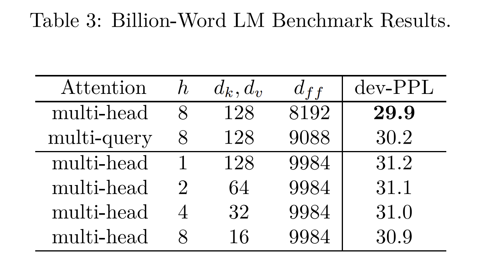
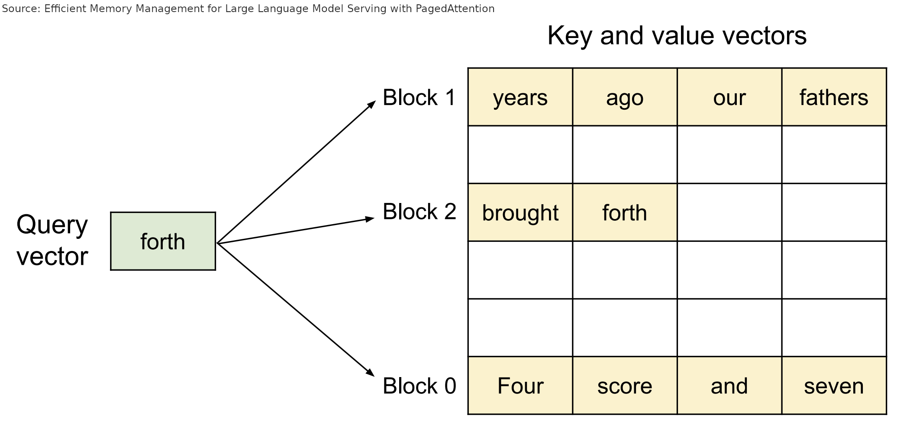
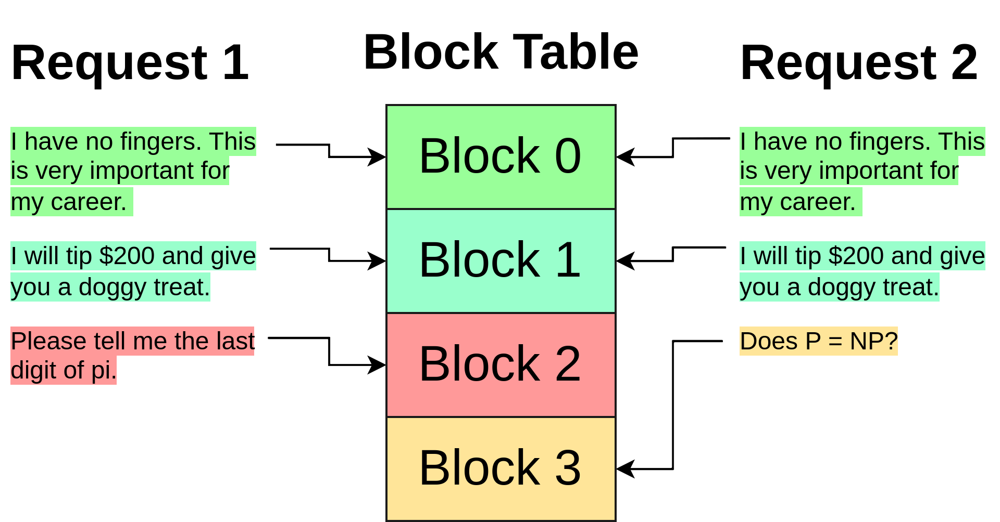
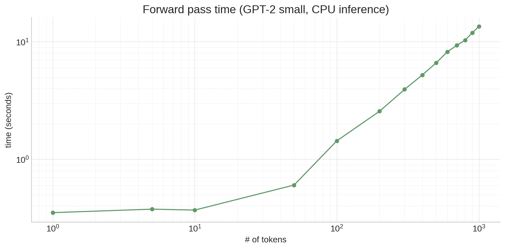
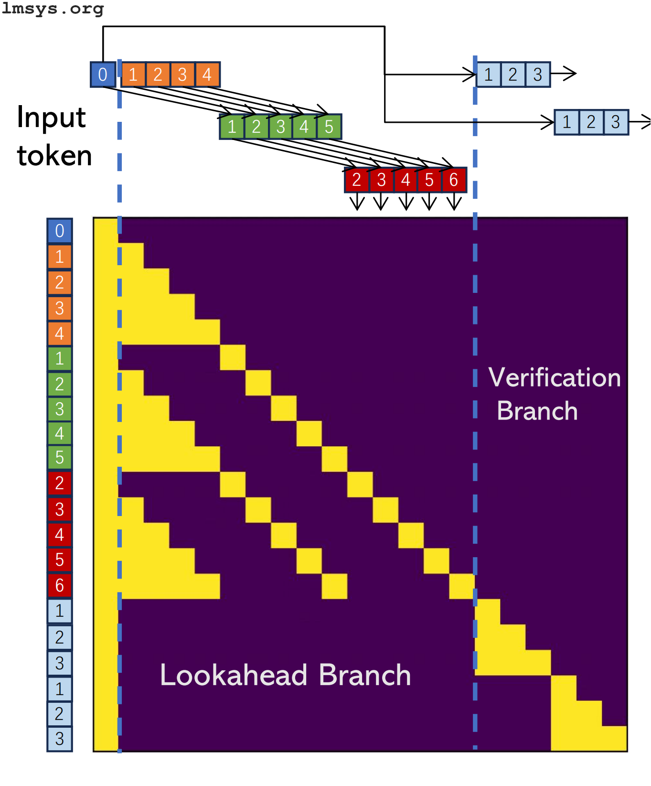

# How to make LLMs go fast
[How to make LLMs go fast](https://vgel.me/posts/faster-inference/) 

 In [my last post](https://vgel.me/posts/handmade-transformer), we made a transformer by hand. There, we used the classic autoregressive sampler, along the lines of:

This approach to inference is elegant and cuts to the heart of how LLMs work—they're _autoregressive_, consuming their own output. And for our toy model with merely thousands of parameters, it worked completely fine. Unfortunately, for real models it's far too slow[1](#generate-too-slow). Why is that, and how can we make it faster?

This post is a long and wide-ranging survey of a bunch of different ways to make LLMs go brrrr, from better hardware utilization to clever decoding tricks. It's not completely exhaustive, and isn't the most in-depth treatment of every topic—I'm not an expert on all these things! But hopefully you'll find the information here a useful jumping off point to learn more about the topics you're interested in. (I tried to include links to relevant papers and blog posts where applicable.)

There are two main reasons that inference with the plain autoregressive `generate` function is slow: an algorithmic one, and a hardware one.

Algorithmically, `generate` has to process an increasing number of tokens every cycle, because each cycle we append a new token to the context. That means to generate 100 tokens from a 10 token prompt, you don't need to run `model` on only 109 tokens. You need to run it on 10 + 11 + 12 + 13 + ... + 109 = 5,950 tokens! (The initial prompt can be processed in parallel, which is part of why prompt tokens are usually cheaper in inference APIs.) It also means that the model _slows down_ as it generates, since each successive token generation has a longer and longer prefix:

Attention, at least vanilla attention, is also a quadratic algorithm: all tokens attend to all tokens, leading to N² scaling, making everything worse.

So that's the algorithmic reason. What's the hardware reason? Well, it's simple: LLMs are just huge. Even a relatively small model like gpt2 (117M parameters) is hundreds of megabytes, and all that data has to live in RAM. RAM is really slow, and modern processors (both CPUs and GPUs) make up for that by having lots of cache close to the processor that's faster to access[2](#gpu-cache). The details of this differ based on type and model of processor, but the gist is that LLM weights do not fit in cache, so a lot of time is spent waiting to load weights from RAM. This has some unintuitive effects! For example, looking at the graph above, operating on 10 tokens isn't necessarily much slower than operating on a single token, even though the activation tensors are 10x larger, because the main time sink is moving the model weights around, not doing calculations!

As a sidebar, what do we mean exactly when we say _slow_? There's a whole zoo of metrics people talk about when it comes to LLM inference:

Different optimizations affect these metrics differently. For example, batching improves throughput and better utilizes the hardware, but can increase TtFT and generation latency.

A straightforward way to speed up inference (especially if you're VC funded :-)) is to just buy better hardware, or if you can't afford that, to take better advantage of the hardware you have.

If you're buying better hardware, most likely that would be some sort of accelerator—usually a GPU, or sometimes/if you're Google, a TPU.

Using an accelerator can produce dramatic speedups (hence the name), but keep in mind that there's a transfer bottleneck between the CPU and the accelerator. If your model doesn't fit in the accelerator's memory, it will need to be swapped out throughout the forward pass, which can slow things down dramatically. (This is one of the reasons Apple's M1/M2/M3 chips punch above their weight for inference—they have unified CPU and GPU memory.)

Another thing to keep in mind with both CPU and accelerator inference is whether you're taking full advantage of the hardware—a properly optimized program can squeeze more out of weaker hardware than a poorly optimized one can get out of the best hardware.

For example, you could write attention in PyTorch as `F.softmax(q @ k.T / sqrt(k.size(-1)) + mask) @ v`, which will give you correct results. But if you instead use `torch.nn.functional.scaled_dot_product_attention`, it will delegate the calculation to [FlashAttention](https://arxiv.org/abs/2205.14135) when available, which can produce 3x speedups using a handwritten kernel that better takes advantage of cache.

A more general version of this is compilers like `torch.compile`, TinyGrad, and ONNX, which can fuse naive Python code into kernels optimized for your hardware. For example, I could write the following function:

Each of these things is slow, and some of the steps require jumping the boundary between Python and native code, which doesn't help. So what if I compile this function using `torch.compile`?

If I go into that debug trace directory and open the `output_code.py` file there, `torch` has generated an optimized C++ kernel for my CPU that fuses `foo` into a single kernel. (If I had run this with a GPU available, `torch` would have generated a [CUDA kernel](https://developer.nvidia.com/blog/easy-introduction-cuda-c-and-c/) for the GPU instead.)

Note that `torch.compile` specialized the code above for the specific size of tensor we passed in (`(10,)`). If we passed in tensors of many different sizes, `torch.compile` would instead generate code generic over the size, but having a constant size can enable the compiler to generate better code in some cases (e.g. via loop unrolling or better vectorization).

This function has _data-dependent control flow_, meaning we do something different based on the runtime value of a variable. If we compile this in the same way we compiled `foo`, we get _two_ graphs (and thus two debug directories):

The first kernel implements the `torch.sin(x) + torch.cos(x)` and `r.sum() < 0` parts of the function:

And the second kernel implements the `return r - torch.tan(x)` branch, since this is the branch that was taken with the example input:

This is called a _graph break_, and it's not good! The compiled function is slower due to it, since we have to leave the optimized kernel and return to Python to evaluate the branch. On top of that, the other branch (`return r + torch.tan(x)`) hasn't been compiled yet, since it hasn't been taken! That means it will be compiled on the fly when needed, which could be bad if it happens at an inopportune time (such as in the middle of serving a user request).

Tools like `torch.compile` are a great way to optimize your code to get better performance out of your hardware, without dipping down to CUDA to write kernels the old-fashioned way.

(And if you're curious about the compilers work, [this post](https://bernsteinbear.com/blog/compiling-ml-models/) by [@tekknolagi](https://twitter.com/tekknolagi) explores compiling models written in [micrograd](https://github.com/karpathy/micrograd/) to C for a 1000-7500x speed increase!)

 [](#Batching) Batching
---------------------------------------------------------

In the unoptimized version of `generate`, we pass the model a single sequence at once, and at each step ask it to append a token:

llm(

| Mark | is | quick | . | He | moves |

)

=

⬇️

llm(

| Mark | is | quick | . | He | moves | quickly |

)

=

⬇️

llm(

| … | quick | . | He | moves | quickly | . |

)

=

To batch generation, we instead pass the model multiple sequences at once, generating a completion for each in the same forward pass.[3](#jax-vmap) This requires the sequences to be padded on either the left or right with filler tokens to equal length. The padding tokens (which can be anything, I'm using \[end\] here) are masked in the attention mask so that they don't influence generation.

llm(

| Mark | is | quick | . | He | moves |
| \[end\] | \[end\] | The | Eiffel | Tower | is |
| \[end\] | I | like | bananas | because | they |

)

=

⬇️

llm(

| Mark | is | quick | . | He | moves | quickly |
| \[end\] | \[end\] | The | Eiffel | Tower | is | in |
| \[end\] | I | like | bananas | because | they | have |

)

=

⬇️

llm(

| Mark | is | quick | . | He | moves | quickly | . |
| \[end\] | \[end\] | The | Eiffel | Tower | is | in | Paris |
| \[end\] | I | like | bananas | because | they | have | no |

)

=

⬇️

llm(

| … | quick | . | He | moves | quickly | . | \[end\] |
| … | The | Eiffel | Tower | is | in | Paris | , |
| … | like | bananas | because | they | have | no | bones |

)

=

Because batching sequences in this way allows the model weights to be used for multiple sequences at once, running the entire batch of sequences together takes less time than running each sequence separately. For example, on my machine, using GPT-2 to generate a next token for:

*   20 tokens x 1 sequence = ~70ms
*   20 tokens x 5 sequences = ~220ms (linear scaling would be ~350ms)
*   20 tokens x 10 sequences = ~400ms (linear scaling would be ~700ms)

###  [](#Continuous_Batching) Continuous Batching

Notice how in the example above, "Mark is quick. He moves quickly." finished before the other sequences, but because the batch as a whole wasn't done, we were forced to continue generating tokens for it ("Random"). This isn't a problem for correctness—we can simply clip the generated sequence to the `[end]` token—but it is unfortunate, since GPU resources are being used to generate tokens we will just throw away.

Continuous batching fixes this by inserting new sequences into the batch as other sequences complete, after their `[end]` tokens. Instead of generating random tokens after the `[end]` token, a new sequence can be inserted in that row of the batch, with attention masking to prevent the sequence from being influenced by the tokens from the previous sequence in the row. (Essentially, the prior sequence acts like additional padding.)

llm(

| 1 | 2 | 3 | 4 |  |  |
| \[end\] | \[end\] | a | b |  |  |
| \[end\] | A | B | C |  |  |

)

=

⬇️

llm(

| 1 | 2 | 3 | 4 | X |  |
| \[end\] | \[end\] | a | b | c |  |
| \[end\] | A | B | C | D |  |

)

=

⬇️

llm(

| 1 | 2 | 3 | 4 | X | Y |
| \[end\] | \[end\] | a | b | c | α |
| \[end\] | A | B | C | D | E |

)

=

 [](#Shrinking_model_weights) Shrinking model weights
---------------------------------------------------------------------------------------

Floating point numbers come in different sizes, and that matters for performance. Most of the time for regular software (e.g., Javascript numbers and Python floats), we use 64 bit (double precision) IEEE 754 floating point. Most ML, however, has traditionally used 32 bit (single precision) IEEE 754:

```
>>> gpt2.transformer.h[0].attn.c_attn.weight.dtype torch.float32 
```

Models train and infer fine with fp32, and this saves 4 bytes (50%) per parameter, which is huge—a 7B parameter model would take up 56Gb in fp64, and only 28 Gb in fp32. Remember that large amounts of time during training and inference are spent moving data from RAM to cache and registers—the less data there is to move, the better. So while fp32 is better than fp64, can we do _even better_?

###  [](#16_bit_floats) 16 bit floats

fp16, or half precision, is the obvious next step—another 50% savings! You have two main options here: fp16, and bfloat16 (short for brain float, since it was developed by Google Brain), which has better range but worse hardware support.

It's easiest to see the distinction with a diagram showing the size of each field:

| fp32 |
| --- |
| sign | exponent (8) | fraction (23) |
| 0 | 1 | 0 | 0 | 0 | 0 | 1 | 1 | 1 | 1 | 0 | 1 | 0 | 0 | 1 | 0 | 0 | 0 | 0 | 1 | 0 | 0 | 0 | 1 | 0 | 0 | 0 | 1 | 1 | 1 | 0 | 1 |

| fp16 (IEEE half) |
| sign | exponent (5) | fraction (10) |
| 0 | 1 | 0 | 0 | 0 | 0 | 1 | 0 | 1 | 0 | 0 | 1 | 0 | 0 | 0 | 0 |

| bfp16 (brainfloat) |
| sign | exponent (8) | fraction (7) |
| 0 | 1 | 0 | 0 | 0 | 0 | 1 | 1 | 1 | 1 | 0 | 1 | 0 | 0 | 1 | 0 |

When reducing the fields of a fp32, fp16 and bfloat16 made different tradeoffs: fp16 tried to balance between range and precision by shrinking both the exponent and fraction fields, whereas bfloat16 preserved the range of fp32 by keeping an 8-bit exponent, while sacrificing precision by shrinking the fraction field smaller than fp16. [The loss of range can sometimes be a problem for training in fp16](https://x.com/sytelus/status/1713462678226968973), but for inference either works, and fp16 is probably a better choice if your GPU doesn't support bfloat16.

###  [](#Even_smaller!) Even smaller!

Can we go even smaller? Of course!

One approach is to quantize a model trained in a larger format, like fp16. The llama.cpp project (and the associated ML library ggml) defines [a whole zoo of quantization formats](https://github.com/ggerganov/llama.cpp#quantization) (the README is currently out of date, so make sure to check the [k-quants PR](https://github.com/ggerganov/llama.cpp/pull/1684) as well), which can go down to less than 5 bits per weight from an fp32 or fp16 model.

These quantizations work a bit differently than fp16 / bfloat16—there isn't enough room to fit a whole number in that space, so instead the weights are quantized in _blocks_, where an fp16 acts as the block scale, and then the block of quantized weights are each multiplied against that scale. (In some formats, there's also a min value, and sometimes the scale and min are themselves quantized to still be smaller than fp16—it's complicated! See the k-quants PR for more details about how it's implemented in GGML, and [this post](https://timdettmers.com/2022/08/17/llm-int8-and-emergent-features/) for more details about why quantization is challenging.)

[bitsandbytes](https://github.com/TimDettmers/bitsandbytes) also implements quantization for non-llama.cpp projects. (I don't have much experience with it personally, though, besides dealing with it as a transitive dependency when it doesn't want to install on Lambda Labs instances :-))

However, the smaller you go with quantization of a model trained with wider parameters, the more it can start to affect the model's performance, reducing the quality of responses. It's best to go with the least amount of quantization that will give you acceptable inference speed.

However, it's also possible to finetune or train models with datatypes smaller than fp16. For example, you can train quantized low rank adapters with [qLoRA](https://github.com/artidoro/qlora), and [a 2022 paper](https://arxiv.org/abs/2209.05433) demonstrated training 175B parameter language models in (simulated) fp8, achieving very similar results to fp16.

Note that, as of 2023, GPUs don't natively support datatypes smaller than fp16, except int8 (8 bit integer). You can train and infer with int8 to some extent, but most quantization requires converting the weights from the quantized format to another type (like fp16) for calculation, and then back when they're no longer needed, which incurs some performance cost. This can pay for itself based on how much memory your GPU has and how fast that memory is, but it's worth being aware of—quantization isn't free.

 [](#KV_caching) KV caching
-------------------------------------------------------------

To explain this one, I'm going to borrow some diagrams from [my last post](https://vgel.me/posts/handmade-transformer) about how Transformers work. If this section feels too quick, please read that post for a (much) more in depth explanation! This explanation is also based on GPT-2, since it's the model I covered in that post. Other architectures work slightly differently—I'll explain the relevant differences, but most don't make too much of a difference for understanding KV caching.

Inside a Transformer, the activations run through a feed-forward layer to generate a `qkv` matrix, where each row corresponds to a token:

| token | q | q | q | q | q | q | q | q | k | k | k | k | k | k | k | k | v | v | v | v | v | v | v | v |
| --- | --- | --- | --- | --- | --- | --- | --- | --- | --- | --- | --- | --- | --- | --- | --- | --- | --- | --- | --- | --- | --- | --- | --- | --- |
| token 1 | 1024 | 0 | 0 | 0 | 0 | 0 | 0 | 0 | 1 | 0 | 0 | 0 | 0 | 0 | 0 | 0 | 0 | 0 | 0 | 0 | 0 | 0 | 0 | 1 |
| token 2 | 1024 | 1024 | 0 | 0 | 0 | 0 | 0 | 0 | 0 | 1 | 0 | 0 | 0 | 0 | 0 | 0 | 0 | 0 | 0 | 0 | 0 | 0 | 0 | 1 |
| token 3 | 0 | 1024 | 1024 | 0 | 0 | 0 | 0 | 0 | 0 | 0 | 1 | 0 | 0 | 0 | 0 | 0 | 0 | 0 | 0 | 0 | 0 | 0 | 0 | -1 |
| token 4 | 0 | 0 | 1024 | 1024 | 0 | 0 | 0 | 0 | 0 | 0 | 0 | 1 | 0 | 0 | 0 | 0 | 0 | 0 | 0 | 0 | 0 | 0 | 0 | 1 |
| token 5 | 0 | 0 | 0 | 1024 | 1024 | 0 | 0 | 0 | 0 | 0 | 0 | 0 | 1 | 0 | 0 | 0 | 0 | 0 | 0 | 0 | 0 | 0 | 0 | 1 |

Then, the `qkv` matrix is split into `q`, `k`, and `v`, which are combined with attention like this:

softmax(

| q |
| --- |
| 1024 | 0 | 0 | 0 | 0 | 0 | 0 | 0 |
| 1024 | 1024 | 0 | 0 | 0 | 0 | 0 | 0 |
| 0 | 1024 | 1024 | 0 | 0 | 0 | 0 | 0 |
| 0 | 0 | 1024 | 1024 | 0 | 0 | 0 | 0 |
| 0 | 0 | 0 | 1024 | 1024 | 0 | 0 | 0 |

@

| k.T |
| --- |
| 1 | 0 | 0 | 0 | 0 |
| 0 | 1 | 0 | 0 | 0 |
| 0 | 0 | 1 | 0 | 0 |
| 0 | 0 | 0 | 1 | 0 |
| 0 | 0 | 0 | 0 | 1 |
| 0 | 0 | 0 | 0 | 0 |
| 0 | 0 | 0 | 0 | 0 |
| 0 | 0 | 0 | 0 | 0 |

\+ mask)

@

| v |
| --- |
| 0 | 0 | 0 | 0 | 0 | 0 | 0 | 1 |
| 0 | 0 | 0 | 0 | 0 | 0 | 0 | 1 |
| 0 | 0 | 0 | 0 | 0 | 0 | 0 | -1 |
| 0 | 0 | 0 | 0 | 0 | 0 | 0 | 1 |
| 0 | 0 | 0 | 0 | 0 | 0 | 0 | 1 |

To produce a matrix like this:

| Result for token 1 | 0 | 0 | 0 | 0 | 0 | 0 | 0 | 1 | (1 * 1) |
| Result for token 2 | 0 | 0 | 0 | 0 | 0 | 0 | 0 | 1 | (0.5\*1 + 0.5\*1) |
| Result for token 3 | 0 | 0 | 0 | 0 | 0 | 0 | 0 | 0 | (0.5\*1 + 0.5\*(-1)) |
| Result for token 4 | 0 | 0 | 0 | 0 | 0 | 0 | 0 | 0 | (0.5*(-1) + 0.5*1) |
| Result for token 5 | 0 | 0 | 0 | 0 | 0 | 0 | 0 | 1 | (0.5\*1 + 0.5\*1) |

Now depending on where this layer is in the Transformer, these rows might be used (after passing through an MLP) as the input to the next Transformer block, or be the predictions for the next token—but note that there's a row for every token! That's because Transformers are trained to predict the next token for _every single token in the context window!_

```
# the gpt2 tokenizer produces 3 tokens for this string >>> tokens = tokenizer(" A B C").input_ids >>> tokens [317, 347, 327]   # if we put that into the model, we get 3 rows of logits >>> logits = gpt2(input_ids=torch.tensor(tokens)).logits.squeeze() >>> logits.shape torch.Size([3, 50257])   # and if we argmax those, we see the model is predicting a next token # for _every_ prompt token! >>> for i, y in enumerate(logits.argmax(-1)): ... print(f"{tokenizer.decode(tokens[:i+1])!r} -> {tokenizer.decode(y)!r}") ' A' -> '.' ' A B' -> ' C' ' A B C' -> ' D' 
```

During training, this behavior is desirable—it means more information is flowing into the Transformer since many tokens are being graded instead of just one. But usually during inference, all we care about is that bottom row, the prediction for the final token.

So how can we get just that out of a Transformer trained to predict the entire context? Well, let's go back to the attention calculation. What if `q` was only one row—the row corresponding to the last token?

softmax(

| q |
| --- |
| 0 | 0 | 0 | 1024 | 1024 | 0 | 0 | 0 |

@

| k.T |
| --- |
| 1 | 0 | 0 | 0 | 0 |
| 0 | 1 | 0 | 0 | 0 |
| 0 | 0 | 1 | 0 | 0 |
| 0 | 0 | 0 | 1 | 0 |
| 0 | 0 | 0 | 0 | 1 |
| 0 | 0 | 0 | 0 | 0 |
| 0 | 0 | 0 | 0 | 0 |
| 0 | 0 | 0 | 0 | 0 |

\+ mask)

@

| v |
| --- |
| 0 | 0 | 0 | 0 | 0 | 0 | 0 | 1 |
| 0 | 0 | 0 | 0 | 0 | 0 | 0 | 1 |
| 0 | 0 | 0 | 0 | 0 | 0 | 0 | -1 |
| 0 | 0 | 0 | 0 | 0 | 0 | 0 | 1 |
| 0 | 0 | 0 | 0 | 0 | 0 | 0 | 1 |

Then, we'd get this as the attention result—just the result for the last token, exactly like what we want.

| Result for token 5 | 0 | 0 | 0 | 0 | 0 | 0 | 0 | 1 | (0.5\*1 + 0.5\*1) |

So that's great, but to only generate the last row of `q`, that means we can only run the layer that generates the `qkv` matrix on a single row as well. So where do the rest of the rows of `k` and `v` come from, since we still need them? The answer is in the name—KV caching—we reuse them from the previous token generation step! Inside the model, we save the KV values calculated during attention in each Transformer block. Then on the next generation, only a single token will be passed in, and the cached KV rows will be stacked on top of the K and V row for the new token to produce the single row Q and multi-row K and V that we want.

Here's an example of KV caching with the HuggingFace `transformers` API, which actually returns the KV cache by default as part of the model forward pass. The cache is a tuple with a `(k, v)` tuple for each layer. The `k` and `v` tensors are each of shape `(batch_size, n_head, n_seq, head_size)`.

```
>>> tokens [317, 347, 327] # the " A B C" string from before >>> key_values = gpt2(input_ids=torch.tensor(tokens)).past_key_values >>> tuple(tuple(x.shape for x in t) for t in key_values) ((torch.Size([1, 12, 3, 64]), torch.Size([1, 12, 3, 64])),
 (torch.Size([1, 12, 3, 64]), torch.Size([1, 12, 3, 64])),
 (torch.Size([1, 12, 3, 64]), torch.Size([1, 12, 3, 64])),
 (torch.Size([1, 12, 3, 64]), torch.Size([1, 12, 3, 64])),
 (torch.Size([1, 12, 3, 64]), torch.Size([1, 12, 3, 64])),
 (torch.Size([1, 12, 3, 64]), torch.Size([1, 12, 3, 64])),
 (torch.Size([1, 12, 3, 64]), torch.Size([1, 12, 3, 64])),
 (torch.Size([1, 12, 3, 64]), torch.Size([1, 12, 3, 64])),
 (torch.Size([1, 12, 3, 64]), torch.Size([1, 12, 3, 64])),
 (torch.Size([1, 12, 3, 64]), torch.Size([1, 12, 3, 64])),
 (torch.Size([1, 12, 3, 64]), torch.Size([1, 12, 3, 64])),
 (torch.Size([1, 12, 3, 64]), torch.Size([1, 12, 3, 64]))) 
```

If we pass this returned KV cache to a model forward pass, the model will treat the tokens we passed in to generate the cache as present even though we don't provide them again. Note that we only pass a single token here, and only get a single row of logits back!

```
>>> new_token = tokenizer(" D").input_ids >>> new_token [360] >>> logits = gpt2(input_ids=torch.tensor(new_token), past_key_values=key_values).logits >>> logits.shape torch.Size([1, 50257]) >>> tokenizer.decode(logits.argmax(-1)) ' E' 
```

Compare that to if we only pass the single token _without_ passing `past_key_values`—we get a completion, but it's not conditioned on those previous tokens that the KV cache was generated from.

```
>>> tokenizer.decode(gpt2(input_ids=torch.tensor(new_token)).logits.argmax(-1)) '.' 
```

(Also note that e.g. lit-gpt has a nicer KV cache API that handles the cache for you, instead of needing to pass it around manually :-) )

KV caching helps with the algorithmic side of LLM slowness—since we're now only passing in a single token on each step, we don't have to redo _everything_ for each new token. However, it doesn't completely banish the problem, since the KV cache still grows in size each step, slowing down the attention calculation. The size of the KV cache can also pose its own, new problem—for example, with a 1,000 token KV cache, even with the smallest GPT-2 there are 18,432,000 values being cached. If each is an fp32, that's almost 74MB of cache, for a single generation, for a comparatively tiny model! With modern large models, especially running on a server that needs to handle many simultaneous clients, the KV cache can quickly become unmanageable, so a few techniques have popped up to make it better.

###  [](#Multi-Query_Attention) Multi-Query Attention

Multi-Query attention is a change to the model architecture that shrinks the size of the KV cache by assigning multiple heads to Q, and only a single head to K and V. It needs to be trained into the model from the beginning—it's not just an inference-time optimization—but it's worth being aware of if you're trying to choose a model, because models with MQA can support more tokens in the KV cache than models trained with normal attention. To understand that, first we need to understand multi-head attention, so let's digress into that for a second.

Modern LLMs don't usually perform attention on the entire QKV matrix at once like how I described above—instead, the KQV matrix is split into multiple smaller "heads". That means instead of how it's shown in the diagram above, it looks more like this:

| q |
| --- |
| 0.23 | 0.03 | 0.1 | 0.3 | 0.87 | 0.84 | 0.3 | 0.3 |
| 0.27 | 0.61 | 0.7 | 0.02 | 0.83 | 0.94 | 0.12 | 0.21 |
| 0.79 | 0.23 | 0.03 | 0.28 | 0.02 | 0.47 | 0.97 | 0.61 |
| 0.11 | 0.1 | 0.3 | 1.0 | 0.08 | 0.88 | 0.83 | 0.69 |
| 0.07 | 0.01 | 0.16 | 0.05 | 0.51 | 0.54 | 0.23 | 0.47 |

→

| q/0 |
| --- |
| 0.23 | 0.03 |
| 0.27 | 0.61 |
| 0.79 | 0.23 |
| 0.11 | 0.1 |
| 0.07 | 0.01 |
| q/1 |
| --- |
| 0.1 | 0.3 |
| 0.7 | 0.02 |
| 0.03 | 0.28 |
| 0.3 | 1.0 |
| 0.16 | 0.05 |
| q/2 |
| --- |
| 0.87 | 0.84 |
| 0.83 | 0.94 |
| 0.02 | 0.47 |
| 0.08 | 0.88 |
| 0.51 | 0.54 |
| q/3 |
| --- |
| 0.3 | 0.3 |
| 0.12 | 0.21 |
| 0.97 | 0.61 |
| 0.83 | 0.69 |
| 0.23 | 0.47 |

| k |
| --- |
| 0.08 | 0.41 | 0.36 | 0.1 | 0.15 | 0.03 | 0.95 | 0.16 |
| 0.7 | 0.77 | 0.57 | 0.9 | 0.65 | 0.36 | 0.58 | 0.32 |
| 0.77 | 0.29 | 0.42 | 0.58 | 0.16 | 0.49 | 0.17 | 0.73 |
| 0.94 | 0.36 | 0.16 | 0.03 | 0.31 | 0.67 | 0.81 | 0.94 |
| 0.76 | 1.0 | 0.45 | 0.94 | 0.6 | 0.49 | 0.68 | 0.54 |

→

| k/0 |
| --- |
| 0.08 | 0.41 |
| 0.7 | 0.77 |
| 0.77 | 0.29 |
| 0.94 | 0.36 |
| 0.76 | 1.0 |
| k/1 |
| --- |
| 0.36 | 0.1 |
| 0.57 | 0.9 |
| 0.42 | 0.58 |
| 0.16 | 0.03 |
| 0.45 | 0.94 |
| k/2 |
| --- |
| 0.15 | 0.03 |
| 0.65 | 0.36 |
| 0.16 | 0.49 |
| 0.31 | 0.67 |
| 0.6 | 0.49 |
| k/3 |
| --- |
| 0.95 | 0.16 |
| 0.58 | 0.32 |
| 0.17 | 0.73 |
| 0.81 | 0.94 |
| 0.68 | 0.54 |

| v |
| --- |
| 0.54 | 0.8 | 0.73 | 0.35 | 0.97 | 0.05 | 0.07 | 0.45 |
| 0.81 | 0.42 | 0.13 | 0.33 | 0.6 | 0.75 | 0.41 | 0.36 |
| 0.81 | 0.47 | 0.2 | 0.05 | 0.63 | 0.75 | 0.58 | 0.66 |
| 0.69 | 0.89 | 0.09 | 0.49 | 0.49 | 0.63 | 0.91 | 0.88 |
| 0.19 | 0.39 | 0.22 | 0.36 | 1.0 | 0.17 | 0.66 | 0.02 |

→

| v/0 |
| --- |
| 0.54 | 0.8 |
| 0.81 | 0.42 |
| 0.81 | 0.47 |
| 0.69 | 0.89 |
| 0.19 | 0.39 |
| v/1 |
| --- |
| 0.73 | 0.35 |
| 0.13 | 0.33 |
| 0.2 | 0.05 |
| 0.09 | 0.49 |
| 0.22 | 0.36 |
| v/2 |
| --- |
| 0.97 | 0.05 |
| 0.6 | 0.75 |
| 0.63 | 0.75 |
| 0.49 | 0.63 |
| 1.0 | 0.17 |
| v/3 |
| --- |
| 0.07 | 0.45 |
| 0.41 | 0.36 |
| 0.58 | 0.66 |
| 0.91 | 0.88 |
| 0.66 | 0.02 |

Then each head is combined in attention as before:

softmax(

| q/0 |
| --- |
| 0.23 | 0.03 |
| 0.27 | 0.61 |
| 0.79 | 0.23 |
| 0.11 | 0.1 |
| 0.07 | 0.01 |

@

| (k/0).T |
| --- |
| 0.08 | 0.7 | 0.77 | 0.94 | 0.76 |
| 0.41 | 0.77 | 0.29 | 0.36 | 1.0 |

\+ mask)

@

| v/0 |
| --- |
| 0.54 | 0.8 |
| 0.81 | 0.42 |
| 0.81 | 0.47 |
| 0.69 | 0.89 |
| 0.19 | 0.39 |

The individual small result matrices are then stuck back together to recreate a final result matrix of shape `(seq_len, embed_size)`, just like the result of vanilla attention. This process allows each head to be used for a different task (e.g., one head could handle punctuation in acronyms and another French articles), instead of wastefully dedicating an entire Transformer block to a single task.

So what is [Multi-Query Attention](https://arxiv.org/abs/1911.02150)? Instead of Q, K, and V all being split into separate heads, _only_ Q is split. K and V are smaller, the size of a single head, and that single K and V is shared among all the Q heads.

| q |
| --- |
| 0.23 | 0.03 | 0.1 | 0.3 | 0.87 | 0.84 | 0.3 | 0.3 |
| 0.27 | 0.61 | 0.7 | 0.02 | 0.83 | 0.94 | 0.12 | 0.21 |
| 0.79 | 0.23 | 0.03 | 0.28 | 0.02 | 0.47 | 0.97 | 0.61 |
| 0.11 | 0.1 | 0.3 | 1.0 | 0.08 | 0.88 | 0.83 | 0.69 |
| 0.07 | 0.01 | 0.16 | 0.05 | 0.51 | 0.54 | 0.23 | 0.47 |

→

| q/0 |
| --- |
| 0.23 | 0.03 |
| 0.27 | 0.61 |
| 0.79 | 0.23 |
| 0.11 | 0.1 |
| 0.07 | 0.01 |
| q/1 |
| --- |
| 0.1 | 0.3 |
| 0.7 | 0.02 |
| 0.03 | 0.28 |
| 0.3 | 1.0 |
| 0.16 | 0.05 |
| q/2 |
| --- |
| 0.87 | 0.84 |
| 0.83 | 0.94 |
| 0.02 | 0.47 |
| 0.08 | 0.88 |
| 0.51 | 0.54 |
| q/3 |
| --- |
| 0.3 | 0.3 |
| 0.12 | 0.21 |
| 0.97 | 0.61 |
| 0.83 | 0.69 |
| 0.23 | 0.47 |

| k |
| --- |
| 0.08 | 0.41 |
| 0.7 | 0.77 |
| 0.77 | 0.29 |
| 0.94 | 0.36 |
| 0.76 | 1.0 |
| v |
| --- |
| 0.54 | 0.8 |
| 0.81 | 0.42 |
| 0.81 | 0.47 |
| 0.69 | 0.89 |
| 0.19 | 0.39 |

You might think this would be a serious problem for the model, but it actually has only a small effect on perplexity. This table from the MQA paper shows slightly worse results than the Multi-Head Attention baseline, but better than alternatives involving shrinking all the dimensions of MHA.

[
](https://vgel.me/posts/faster-inference/multi_query_table3.png)

The benefit is, because K and V are so much smaller than in MHA, the KV cache is proportionally smaller as well. Both LLAMA-2 and Falcon use MQA, for this reason.

Mistral 7B uses a variant called [Grouped-Query Attention](https://arxiv.org/abs/2305.13245v2) which is a hybrid between MQA and MHA. If MHA is `Q_heads=K_heads=V_heads=N` and MQA is `Q_heads=N; K_heads=V_heads=1`, then GQA is `Q_heads=N; K_heads=V_heads=G` where `1 < G < N`. GQA claims less effect on perplexity and better training stability than MQA.

###  [](#PagedAttention) PagedAttention

The other issue with a large KV cache is that it often needs to be stored as in _contiguous_ tensors, regardless of whether all of the cache is currently in use. That leads to multiple problems:

*   More space than necessary needs to be allocated up front, since we need to anticipate the maximum size of the KV cache before it's needed.
*   That reserved space can't be used by other requests, even if it isn't needed _yet_.
*   Requests with the same prefix can't share KV cache for that prefix, since they may diverge later.

[PagedAttention](https://arxiv.org/abs/2309.06180) fixes these problems by taking inspiration from how operating systems handle a similar issue with userspace program memory.

Let's take a moment to explore OS paging, as a primer. Like tensors, programs want to see their memory as a contiguous linear space. (If I allocate a million-byte array `x`, I expect the address of `x[n + 1]` to exactly equal `x[n] + 1`, no more, no less! Much code depends on this.) However, physical memory isn't always so forgiving—operating systems have to worry about pesky things like "fragmentation" and ["hey you asked for a 1TiB allocation i cannot put this anywhere"](https://vgel.me/posts/mmap-arena-alloc/).

So the operating system collaborates with hardware, using the MMU to map virtual pages to physical pages in a page table. When you access an address in a userspace program, that address gets translated from your program's address space via the page table (and TLB cache) to a physical address before being read from or written to. Importantly, that physical address may not exist yet—it may be generated on-demand for a write. For example, let's map 16 pages of memory in C:

```
 uint8_t *pages = mmap(NULL, page_size * 16,
 PROT_READ | PROT_WRITE, MAP_PRIVATE | MAP_ANONYMOUS,  -1, 0); 
```

Now if we [pagemap-dump](https://stackoverflow.com/a/45500208/1159735) the running program, we get this list of page addresses and associated `pfn` physical addresses (along with other metadata):

```
# addr pfn soft-dirty file/shared swapped present library 7fbe0fe6a000 0 1 0 0 0 7fbe0fe6b000 0 1 0 0 0 7fbe0fe6c000 0 1 0 0 0 7fbe0fe6d000 0 1 0 0 0 7fbe0fe6e000 0 1 0 0 0 7fbe0fe6f000 0 1 0 0 0 7fbe0fe70000 0 1 0 0 0 7fbe0fe71000 0 1 0 0 0 7fbe0fe72000 0 1 0 0 0 7fbe0fe73000 0 1 0 0 0 7fbe0fe74000 0 1 0 0 0 7fbe0fe75000 0 1 0 0 0 7fbe0fe76000 0 1 0 0 0 7fbe0fe77000 0 1 0 0 0 7fbe0fe78000 0 1 0 0 0 7fbe0fe79000 0 1 0 0 0 
```

Notice that all the pages have a physical address of zero—they don't exist yet! This is called _memory overcommit_. The kernel doesn't know if we're going to use these pages, so it doesn't bother to set up mappings for them yet. Trying to read from them will just return an unspecified value (this is part of why reading uninitialized memory is UB in C).

However, if I then touch every page by writing to it...

```
// pages is our page_size * 16 map from earlier for (int i = 0; i < page_size * 16; i++) pages[i] = 1; 
```

...the dump looks different!

```
# addr pfn soft-dirty file/shared swapped present library 7fbe0fe6a000 14a009 1 0 0 1 7fbe0fe6b000 50eca5 1 0 0 1 7fbe0fe6c000 175a5d 1 0 0 1 7fbe0fe6d000 148d85 1 0 0 1 7fbe0fe6e000 2de86c 1 0 0 1 7fbe0fe6f000 13a300 1 0 0 1 7fbe0fe70000 8f25b4 1 0 0 1 7fbe0fe71000 15ae63 1 0 0 1 7fbe0fe72000 6e1d7f 1 0 0 1 7fbe0fe73000 13a307 1 0 0 1 7fbe0fe74000 14a074 1 0 0 1 7fbe0fe75000 14a0a7 1 0 0 1 7fbe0fe76000 7e2662 1 0 0 1 7fbe0fe77000 1ccdc2 1 0 0 1 7fbe0fe78000 2a4f06 1 0 0 1 7fbe0fe79000 2169ef 1 0 0 1 
```

Now all the pages have a physical address, because they've been written to. However, note that the physical addresses aren't contiguous like the virtual addresses! (The largest physical address is 0x7e2662, which is the mapping for virtual address 0x7fbe0fe76000, page #13.) They're scattered all over the place, wherever they can fit. And if our C program had only touched e.g. half the pages, only those pages would've been mapped, the others would have remained unmapped. This means that no physical memory is reserved until the exact moment that it's needed.

I could share only part of this memory with another process. Imagine I mapped 4 pages of shared memory:

```
7fbe0fe6a000 14a009 7fbe0fe6b000 50eca5 7fbe0fe6c000 175a5d 7fbe0fe6d000 148d85 
```

The other process might see these pages as:

```
5581627bb000 14a009 5581627bc000 50eca5 5581627bd000 175a5d 5581627be000 148d85 
```

The virtual addresses are different, but the physical addresses are identical! Each program might see these pages interleaved in different contexts, but the underlying data can be stored, deduplicated, in a single place in physical memory.

So how does this apply to PagedAttention? PagedAttention is the _exact same idea_—they say so in the paper.[4](#why-not-mmu)

Instead of pages, we have blocks of KV cache for tokens, and instead of processes accessing those pages, we have LLM requests accessing those blocks of tokens.

At startup, PagedAttention allocates a _block table_ for the request, analogous to the role of a hardware MMU. This block table starts out empty, with no blocks mapped, just like our C process.

Instead of associating requests with a large tensor of KV cache items, each request only has a comparatively small list of block indices, analogous to virtual addresses in OS paging. Those indices point at blocks stored in the global block table. Just like OS pages, they can be out of order, placed wherever they can fit:

[
](https://vgel.me/posts/faster-inference/pagedattention.png)

During the attention computation, the PagedAttention kernel walks the request's list of block indices, and goes and fetches those blocks from the global block table to compute attention as normal in the correct order.

Importantly, because the blocks have been decoupled from individual requests, they can be shared, just like the shared memory example in OS paging. If two requests use the same long prefix (such as k-shot examples for multiple parallel translation tasks, the newest Twitter prompt hack, the chain so far for self-consistency Chain of Thought, etc.), the KV cache blocks for that prefix can be shared by multiple requests, simply by placing the index of that block in the appropriate part of each request's list of block indices.

[
](https://vgel.me/posts/faster-inference/shared-prefix-pagedattention.drawio.png)

 [](#Speculative_Decoding) Speculative Decoding
---------------------------------------------------------------------------------

To understand speculative decoding, you need to remember three things.

First, running a small number of tokens through a model takes about the same amount of time as running a single token, thanks to memory access overhead:

[
](https://vgel.me/posts/faster-inference/timing_graph.png)

Second, LLMs generate a prediction for _every_ token in the context:

```
>>> for i, y in enumerate(logits.argmax(-1)): ... print(f"{tokenizer.decode(tokens[:i+1])!r} -> {tokenizer.decode(y)!r}") ' A' -> '.' ' A B' -> ' C' ' A B C' -> ' D' 
```

Finally third, some words are very easy to predict. For example, after the word "going", you don't need to be GPT-4 to know that the word "to" is an extremely likely next token.

We can take advantage of these facts to optimize generation! Imagine if, whenever the most recent token was " going", we optimistically tacked " to" onto the end as well before running generation. Then, after running the model forward, we check if the model's prediction after "going" was indeed "to". if so, we got a token ("to") for free! And if not, no sweat, we simply accept the token predicted for "going" instead, with no increased perplexity, since that token is the exact token the model would have generated without our trick.

```
def generate(prompt: str, tokens_to_generate: int) -> str:
 tokens: list[int] = tokenize(prompt)
 GOING, TO = tokenize(" going to")    for i in range(tokens_to_generate):
  if tokens[-1] == GOING:
  # do our speculative decoding trick
 logits = model.forward(tokens + [TO])
  # the token the model predicts will follow "... going"
 going_pred = argmax(logits[-2, :])
  # the token the model predicts will follow "... going to" 
 to_pred = argmax(logits[-1, :])
  if going_pred == TO:
  # if our guess was correct, accept "to" and the next token after
 tokens += [TO, to_pred]
  else:
  # otherwise, accept the real next token
  # (e.g. "for" if the true generation was "going for broke")
 tokens += [going_pred]
  else:
  # do normal single-token generation
 logits = model.forward(tokens)
 tokens += [argmax(logits[-1])]    return detokenize(tokens) 
```

This will absolutely work, and buy you a (minuscule) speed boost. To improve it, you could imagine making more heuristics: predict "and" after a comma, and "the" after "is". You could even make multi-word heuristics: if you see "The early bird", why not optimistically add "catches the worm"? Even if they're doing a twist on the phrase, you could still win "catches" and "the", the entire phrase doesn't need to be accepted.

But wait a second—why make these heuristics by hand? We're trying to come up with likely completions of a token... that's exactly what language models are good at! If we use a language model to generate our optimistic tokens, we could pick up even more complex patterns, even ones from the earlier context.

We just need to use a "draft" model that's small enough (and therefore quick enough to run) that it will pay for itself by avoiding passes through the larger "oracle" model. A good rule of thumb is for this model to be ~1/10 the size of the oracle model. It should also use the same tokenizer (to avoid needing to detokenize and retokenize the sequence over and over).

Here's what the generate loop looks like with a draft model:

```
def generate(prompt: str, tokens_to_generate: int, n_draft: int = 8) -> str:
 tokens: list[int] = tokenize(prompt)    for i in range(tokens_to_generate):
  # generate `n_draft` draft tokens in the usual autoregressive way
 draft = tokens[:]
  for _ in range(n_draft):
 logits = draft_model.forward(draft)
 draft.append(argmax(logits[-1]))    # run the draft tokens through the oracle model all at once
 logits = model.forward(draft)
 checked = logits[len(tokens) - 1 :].argmax(-1)    # find the index of the first draft/oracle mismatch—we'll accept every
  # token before it
  # (the index might be past the end of the draft, if every draft token
  # was correct)
 n_accepted = next(
 idx + 1
  for idx, (checked, draft) in enumerate(
  # we add None here because the oracle model generates one extra
  # token (the prediction for the last draft token)
  zip(checked, draft[len(tokens) :] + [None])
 )  if checked != draft
 ) tokens.extend(checked[:n_accepted])    return detokenize(tokens) 
```

Here, I used the above loop with GPT-2-XL (1558M parameters) as the oracle model, and GPT-2-small (124M parameters) as the draft model, with `n_draft=8`. The green tokens were generated by the draft model, and the blue tokens are where the draft model was incorrect and the oracle model's corrected token had to be used.

What is a tensor in machine learning?    
A tensor is a mathematical object that represents a set of data points. It is a mathematical object that can be used to represent a set of data points.

Note how the draft model is particularly good at quickly copying text from the question ("A tensor is a"), completing common N-grams ("It" -> "is a", "can" -> "can be"), and inserting stock phrases ("a set of data points"), so that the oracle model only needs to step in for a few key words.

Here's another example, with the same setup but a different prompt:

Index: A B C D E F G H I J K L M N O P Q R S T U V W X Y Z  The following table lists the number of times each of the following words appear in the text of the book.  Word Number of times in text

Here, the draft model does very well in the alphabet part, actually hitting the draft limit several times (the draft model would have correctly predicted "L", for example, but we limit it to 8 tokens at once). But once it got into the prose generation below, the draft model couldn't keep up as well.

Finally, here's a pathological case:

The digits of Pi are 3.141592653589793238462643383279502884197169399375105820

At first the models are in agreement, but fairly quickly they diverge as the draft model becomes inaccurate, and generation becomes unbearably slow. For every token, 8 draft tokens are generated and then immediately discarded.

This shows that speculative decoding performance can be very context dependent! If the draft model is well-correlated with the oracle model and the text is easy to predict, you'll get lots of drafted tokens and fast inference. But if the models aren't correlated, speculative decoding can actually make inference _slower_, because you're wasting time generating draft tokens that will just be rejected.

###  [](#Threshold_decoding?) Threshold decoding?

An approach I came up with to mitigate the issues with using a fixed number of draft tokens is _threshold decoding_.

Instead of always decoding up to the maximum number of draft tokens, we keep a moving probability threshold, calibrated based on how many tokens are being accepted right now. Draft tokens are generated until the cumulative probability of the draft so far (based on the draft model logits) falls below this threshold.

For example, if the threshold was 0.5, and the we generated a draft token " the" with a probability of 0.75, we'd keep going. If the next token, " next", had a probability of 0.5, the cumulative probability 0.375 would be lower than the threshold, so we'd stop and submit the two draft tokens to the oracle.

Then, based on how far into the draft is accepted, the threshold is adjusted up or down to try and calibrate the draft model's confidence with the actual acceptance rate. Right now this is just done by a simple moving average and some thresholding, but there's probably a more principled way to do it based on real statistics.

This is the code (using my homegrown framework, apologies):

```
def speculative_threshold(
  prompt: str,
  max_draft: int = 16,
  threshold: float = 0.4,
  threshold_all_correct_boost: float = 0.1, ):
 tokens = encoder.encode(prompt)    # homegrown KV cache setup has an `n_tokens` method that returns the length
  # of the cached sequence, and a `truncate` method to truncate that sequence
  # to a specific token
 model_kv = gpt2.KVCache()
 draft_kv = gpt2.KVCache()    while True:
  # generate up to `max_draft` draft tokens autoregressively, stopping
  # early if we fall below `threshold`
 draft = tokens[:]
 drafted_probs = []
  for _ in range(max_draft):
 logits = draft_model.forward(draft[draft_kv.n_tokens() :], draft_kv)
 next_id = np.argmax(logits[-1])
 next_prob = gpt2.softmax(logits[-1])[next_id]
  if not len(drafted_probs):
 drafted_probs.append(next_prob)  else:
 drafted_probs.append(next_prob * drafted_probs[-1])
 draft.append(int(next_id))
  if drafted_probs[-1] < threshold:
  break
 n_draft = len(draft) - len(tokens)    # run draft tokens through the oracle model
 logits = model.forward(draft[model_kv.n_tokens() :], model_kv)
 checked = logits[-n_draft - 1 :].argmax(-1)
 n_accepted = next(
 idx + 1
  for idx, (checked, draft) in enumerate(
  zip(checked, draft[len(tokens) :] + [None])
 )  if checked != draft
 )  yield from checked[:n_accepted]
 tokens.extend(checked[:n_accepted])    if n_accepted <= n_draft:
  # adjust threshold towards prob of last accepted token, if we
  # ignored any draft tokens
 threshold = (threshold + drafted_probs[n_accepted - 1]) / 2
  else:
  # otherwise, lower the threshold slightly, we're probably being
  # too conservative
 threshold -= threshold_all_correct_boost
  # clamp to avoid pathological thresholds
 threshold = min(max(threshold, 0.05), 0.95)    # don't include oracle token in kv cache
 model_kv.truncate(len(tokens) - 1)
 draft_kv.truncate(len(tokens) - 1) 
```

This table compares threshold decoding to regular speculative decoding with different fixed draft lengths (along with KV caching, to make the comparison fair), for the test prompts I showed earlier. The rightmost column is a sparkline showing how generation speed changes over time.

| What is a tensor in machine learning? |
| --- |
| threshold | 2.01 tok/s | ▁▂▄▅▄▅▅▆▅▄▅▅▅▅▅▆▅▅▅▅▆▅▆▆▅▆▅▆▆▆▅▆▆▆▆▇▆▆▇▇▇▆▆▆▇▇▇▇▇█ |
| n_draft=1 | 1.40 tok/s | ▁▃▃▅▅▆▆▇▆▆▆▆▇▆▇▇▇▇▆▇▆▆▆▆▆▇▆▇▇▇▇▇▇▇▇▇▇▇▇▇▇▇▇▇▇▇▇▇▇█ |
| n_draft=8 | 1.92 tok/s | ▁▂▃▄▅▆▇█▅▃▄▃▄▄▄▄▅▅▄▅▅▄▄▅▄▄▄▄▄▄▅▅▅▅▅▅▅▅▅▅▆▆▆▆▆▆▆▆▆▆ |
| n_draft=16 | 1.36 tok/s | ▁▂▃▄▅▆▇█▄▃▃▃▃▃▃▄▄▄▄▄▄▄▄▄▃▄▃▃▄▄▄▄▄▄▄▅▅▅▅▅▅▅▆▅▅▅▅▅▆▆ |
| Index: A B C |
| threshold | 1.90 tok/s | ▁▁▁▂▂▃▃▄▄▄▅▅▆▆▇▇█▅▅▅▆▆▆▇▆▆▆▆▆▅▅▅▅▅▅▅▅▅▅▄▄▄▄▄▄▄▄▄▄▄ |
| n_draft=1 | 1.32 tok/s | ▁▄▃▅▅▆▅▇▆▇▆▇▇▇▇▇▇█▇▇▇▇▇▇▇▇▇▇▇▇▇▇▇▇▇▇▇▇▇▆▇▇▆▆▆▆▆▆▆▆ |
| n_draft=8 | 1.49 tok/s | ▁▁▂▃▃▄▅▆▆▄▄▅▅▆▆▇▇█▆▆▆▆▇▇▆▆▆▆▇▇▇▆▆▆▆▆▆▆▅▅▅▅▅▄▄▄▄▄▄▄ |
| n_draft=16 | 0.97 tok/s | ▁▁▁▂▂▃▃▄▄▄▅▅▆▆▇▇█▅▅▅▅▆▆▆▄▅▅▅▅▅▆▄▅▅▄▄▄▄▄▃▃▃▃▃▂▂▂▂▂▂ |
| The digits of Pi are 3.14159 |
| threshold | 0.84 tok/s | ▁▄▇▅█▆▅▅▄▄▄▄▄▄▄▄▄▄▄▄▄▄▄▄▄▄▄▄▄▄▄▄▄▄▄▄▄▄▄▄▄▄▄▄▄▄▄▄▄▄ |
| n_draft=1 | 0.85 tok/s | ▁▅▅█▇▆▆▆▅▅▅▅▅▅▅▅▅▅▅▅▅▅▅▅▅▅▅▅▅▅▅▅▅▅▅▅▅▅▅▅▅▅▅▅▅▅▅▅▅▅ |
| n_draft=8 | 0.42 tok/s | ▁▂▄▆█▅▄▃▃▂▂▂▂▂▂▂▂▂▂▂▂▂▂▂▂▂▂▂▂▂▂▂▂▁▁▁▁▁▁▁▁▁▁▁▁▁▁▁▁▁ |
| n_draft=16 | 0.27 tok/s | ▁▂▄▆█▅▃▃▂▂▂▂▂▁▁▁▁▁▁▁▁▁▁▁▁▁▁▁▁▁▁▁▁▁▁▁▁▁▁▁▁▁▁▁▁▁▁▁▁▁ |

Note how, for example, n_draft=16 on the "Index: A B C" prompt has a strong start, but falls off hard in the later prose section as it overgenerates incorrect tokens. Threshold decoding, meanwhile, is able to ramp up to take advantage of the easy alphabet tokens, and then ramp back down to not overgenerate on the harder prose section:

Index: A B C D E F G H I J K L M N O P Q R S T U V W X Y Z  The following table lists the number of times each of the following words appear in the text of the book.  Word Number

###  [](#Staged_speculative_decoding) Staged speculative decoding

[Staged speculative decoding](https://arxiv.org/abs/2308.04623) adds two improvements to vanilla speculative decoding:

The first is to restructure the draft batch as a tree, instead of a single generation. This helps because longer draft batches on complex text can quickly diverge from the base model. It can instead make more sense to do multiple, shorter drafts, branching off from each other, and then verify them all against the oracle model using a specially-crafted attention mask. Generating multiple draft sequences lets you reuse prior tokens and sample the draft model in batches, further accelerating the process.

(You can think of regular speculative decoding as "deep" and using a tree as "wide", which begs the question of how you should prioritize deep v.s. wide for certain text. Maybe an adjustable parameter like in the threshold decoding section would be useful here as well?)

The second improvement is to speculatively decode the draft model as well—it's usually a Transformer after all. This could be a yet-smaller Transformer (they recommend 15-20x smaller than the oracle model), or even a simple N-gram model.

###  [](#Guided_generation) Guided generation

Grammar-guided generation lets you constrain a model's output to follow some grammar, giving you output that guaranteed to match some grammar—such as JSON. At first, this seems unrelated to speed—reliability is nice, but speed too? That can't be possible! But it is—let's dig into how it works to see why.

Imagine you're generating JSON with an LLM, and the generation so far is:

```
{
  "key": 
```

GPT-4 could generate any of 100k+ tokens here, but only a few are actually valid: whitespace, an open bracket, a quote, a digit, `null`, etc. During regular (non-guided) generation, you'd just hope the model had learned that properly and didn't generate syntactically invalid JSON. During guided generation, however, the sampler _only_ samples from those valid tokens, ignoring any others, even if the invalid tokens are more likely.[5](#openai-json-mode)

Even better, with libraries like [Outlines](https://github.com/outlines-dev/outlines) or [jsonformer](https://github.com/1rgs/jsonformer), you can give the guided generation sampler a schema, and it will sample _within that schema_! For example, if a key requires a digit, it will only sample digits after that key name. Note how the returned object in this example exactly matches the Pydantic schema:

```
...   class Weapon(str, Enum):
 sword = "sword"
 axe = "axe"
 mace = "mace"
 spear = "spear"
 bow = "bow"
 crossbow = "crossbow"     class Armor(str, Enum):
 leather = "leather"
 chainmail = "chainmail"
 plate = "plate"   class Character(BaseModel):
 name: constr(max_length=10)
 age: int
 armor: Armor weapon: Weapon strength: int   model = ... generator = outlines.generate.json(model, Character, max_tokens=100) print(generator("Give me a character description", rng=...)) # { #   "name": "clerame", #   "age": 7, #   "armor": "plate", #   "weapon": "mace", #   "strength": 4171 # } 
```

This is great for reliability, but what does it have to do with speed? Well, let's take a look at that response again. If we compare it to what's required by the schema, barely any tokens are actually ambiguous—for most of the response, the model would only have one possible token to pick from. In that case, the sampler can just pick that token, bypassing the model entirely! Only a small fraction of the tokens (the ones highlighted in green) actually required a model forward call:

{ "name": "clerame", (4 ambiguous tokens: cl er ame ",\\n) "age": 7, (2 ambiguous tokens: 7 ,\\n) "armor": "plate", (1 ambiguous token: plate) "weapon": "mace", (1 ambiguous token: m) "strength": 4171 (3 ambiguous tokens: 417 1 \\n) }

Between the JSON grammar and the schema, we already know the first 7 tokens are `{\n "name": "`, so we can automatically add those into the context before the first model call. Then after the model generates `clerame",\n`, we know the next tokens up until the model needs to actually generate the age ( `"age":` ), so we append those as well before calling the model again to generate `7,`. We can keep going that way all the way down. (We can even save a token by completing `m` as `"mace",` because no other weapon starts with `m`!)

The complete response was 41 tokens, but only 11 of them had to come from the model, the others were automatically inserted and only needed to be processed as prompt tokens, which are much faster. This is a nice speedup, _and_ more reliable to boot—a win-win. If you need to generate structured data with LLMs, especially OSS LLMs that can use custom samplers, you should definitely be using a library like Outlines.

###  [](#Lookahead_decoding) Lookahead decoding

[Lookahead decoding](https://lmsys.org/blog/2023-11-21-lookahead-decoding/) is a new approach to speculative decoding that doesn't require a draft model. Instead, the model itself is used in two branches: a lookahead branch, which predicts and extends candidate N-grams (short sequences of N tokens), and a verification branch, which verifies the candidates. The lookahead branch is similar to the draft model in regular speculative decoding, and the verification branch has the same role as the oracle model.

But unlike regular speculative decoding, this is all done not just in a single model, but in a single model _call_ using a specially-crafted attention mask:

[
](https://vgel.me/posts/faster-inference/lookahead.png)

I won't go too in depth because the [lmsys blog post](https://lmsys.org/blog/2023-11-21-lookahead-decoding/) announcing lookahead decoding already has some nice animations (even if the explanation is somewhat dense).

###  [](#Prompt_lookup_decoding) Prompt lookup decoding

[Prompt lookup decoding](https://twitter.com/apoorv_umang/status/1728831397153104255) is another technique, where the draft model is replaced by simple string matching over the context. They claim it works well for tasks like code editing or RAG where the output necessarily contains lots of verbatim copying from the input. I assume it'd also work well in staged speculative decoding, to speculatively decode a draft model.

 [](#Training_time_optimizations) Training time optimizations
-----------------------------------------------------------------------------------------------

There are a few optimizations that I'm going to speed through since they're not very relevant if you don't have the resources to pretrain a model with them from the start.

###  [](#Sparse_attention) Sparse attention

Attention is algorithmically slow because it's quadratic: as the sequence grows in length, each of the N tokens needs to attend to each of the N tokens. Sparse attention attempts to remedy this by calculating less attention. For example, Mistral 7B uses sliding window attention, where tokens in some layers can only attend to nearby tokens. [Longformer](https://arxiv.org/abs/2004.05150) also explored some interesting sparse attention patterns, like giving all tokens access to specific positions, dilating the sliding window, using different size windows on different layers, and other tricks. (Longformer predates Mistral, but as far as I can tell Mistral didn't use all the tricks Longformer did—I'm not sure why.)

Sometimes this kind of attention can be finetuned in or bolted on without tuning after the fact, but for the best performance it needs to be trained into the model from the start, like Mistral did.

###  [](#Non-Transformer_architectures) Non-Transformer architectures

Recently there's been a renewed surge of interest in non-Transformer LLMs. If you're new to the field you may not be familiar with RNNs/LSTMs, but they were the dominant sequence modeling architecture before Attention is All You Need was published and Transformers took off. Unlike Transformers where the whole context is available to the model at once, RNNs do a linear scan over the sequence, building up a hidden state that models what has come before. (There are also reversed and bidirectional RNNs, it's a whole thing.)

They were outmatched by Transformers due to difficulty scaling them and problems like forgetting, but some recent papers have tried to bring them back, or invent new sub-quadratic architectures that can finally dethrone Transformers. These include [RWKV](https://arxiv.org/abs/2305.13048) (new type of RNN), [Mamba](https://arxiv.org/abs/2312.00752) (state-space model), [Hyena](https://arxiv.org/abs/2302.10866) (convolutional), and [Recurrent Memory Transformers](https://proceedings.neurips.cc/paper_files/paper/2022/file/47e288629a6996a17ce50b90a056a0e1-Paper-Conference.pdf) (use a Transformer for segments, then special memory tokens for global context). So far the biggest and best models are still Transformers, but that might not be true in the future!

 [](#Conclusion) Conclusion
-------------------------------------------------------------

Thanks for reading!

Unfortunately I didn't get to cover everything I wanted to in this post, since it's already quite long—I didn't touch on structured sparsity, Mixture of Experts, activation quantization, static vs dynamic quantization, or lots of other great topics. However, I think the post is a good survey of different areas of LLM optimization. LLMs are currently slow and hard to run, but the situation is improving all the time—Lookahead Decoding was released while I was writing this post! It seems likely that in a few years, between better hardware, better training methods, better quantization, more inference optimizations, and the continuing hard work of the open source community, we could be running models than handily beat GPT-4 on consumer hardware, and these techniques and more will be instrumental to making that happen. (Of course, GPT-5 will probably be out by then... but always upwards!)

Hopefully you found the post useful and/or entertaining. If you enjoyed it, you may also enjoy:

*   [My other blog posts](https://vgel.me/posts), such as [I made a transformer by hand (no training!)](https://vgel.me/posts/handmade-transformer/), [GPT-3 will ignore tools when it disagrees with them](https://vgel.me/posts/tools-not-needed/), [Does GPT-4 think better in Javascript?](https://vgel.me/posts/gpt4-javascript) and [I'm worried about adversarial training data](https://vgel.me/posts/adversarial-training-data)
*   [My other projects and writing](https://vgel.me/)
*   My [Twitter](https://twitter.com/voooooogel/), where I post about new blog posts, smaller AI-related thoughts (e.g. [1](https://twitter.com/voooooogel/status/1730726744314069190), [2](https://twitter.com/voooooogel/status/1733590921605001677)), whatever fiction I've been reading, and other things.

If you have thoughts about this post, please feel free to [get in touch](https://vgel.me/contact)! I love hearing from people who read my posts.

###  [](#Thanks) Thanks

As always, thanks to everyone who contributed to and reviewed this post:

*   [@wjessup](https://twitter.com/wjessup) (http://willjessup.com/) for a _very_ thorough review of the draft.
*   [@tekknolagi](https://twitter.com/tekknolagi) (https://bernsteinbear.com/) for reviewing and commenting.
*   [@MF_FOOM](https://twitter.com/MF_FOOM) for reviewing and commenting (and helping me rent some GPUs for an experiment 🫡 even though the experiment didn't work rip)
*   @laikhtewari on Discord for great topic suggestions
*   Everyone on Twitter who liked and commented on the various posts I made while working on this! Really helps.

* * *

*   **Previous entry:** [I made a transformer by hand (no training!)](https://vgel.me/posts/handmade-transformer/)