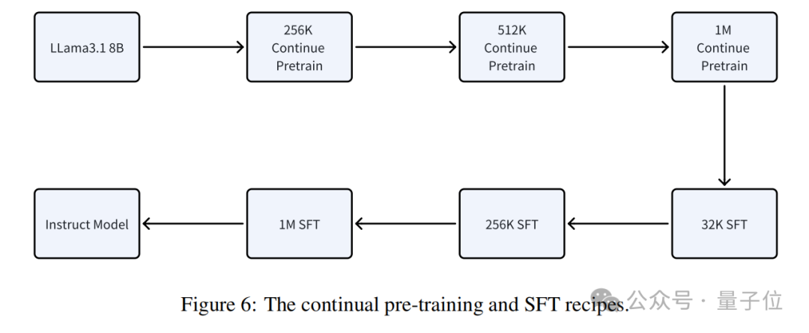

Title: Kimi新论文再次“撞车”DeepSeek，都谈到了长文注意力机制

URL Source: https://mp.weixin.qq.com/s/HUB8CAEcGve0cQdHu5YIkA

Markdown Content:
##### 一水 发自 凹非寺  
量子位 | 公众号 QbitAI

Kimi背后的长上下文处理机制曝光了！

这项名为**MoBA**的新型注意力机制，能将处理**1M**长文本的速度一下子提升**6.5倍**，而且还是经过Kimi平台实际验证的那种。

概括而言，这项耗时一年半的工作主要看点在：

*   把完整上下文划分成**块**，让每个查询token自动去关注最相关的KV块，这样就能高效处理长序列数据；
    
*   提出一种新的参数无关的top-k门控机制，它能给每个查询token挑选出最相关的块，保证模型只聚焦在最有用信息的块上；
    
*   支持在全注意力和稀疏注意力模式之间轻松切换；
    

一言以蔽之，MoBA将MoE（专家混合）应用于注意力机制，通过遵循一种“less structure” 原则，允许模型自主决定关注哪些区域或位置。

最终结果是，在保持模型性能不变的前提下，将处理**1M**和**10M**长文本的速度分别提升了**6.5倍**和**16倍**。

而且按照论文得出的结论：

> MoBA**开箱即用**，它能轻松融入现有模型，无需高昂训练成本。

另外，在深扒论文细节的同时，我们也在作者名单中发现了**杨植麟**本人的身影。

与此同时，再次令人感到戏剧的是，Kimi的这项研究又又又和DeepSeek撞车了？？

差不多只比Kimi早5个小时，DeepSeek也公开了自己的注意力机制NSA（量子位今日另一篇文章有详细介绍）。

好家伙，谁能想到这熟悉的一幕也才刚过去不久！（先卖个关子）

将MoE原理应用于注意力机制
--------------

还是先来看论文细节。

首先，团队回答了为什么要开展这项研究？

随着大语言模型（LLMs）向AGI发展，处理长文本的能力将更加关键。然而，**传统注意力机制的计算复杂度随着序列长度的增加而呈平方级增长**，这一特性严重阻碍了模型对长序列的高效处理。

而且，一些现有方法都存在或多或少的**局限性**：

*   像滑动窗口注意力机制，通过限制模型关注窗口内局部信息来减少计算量，但窗口设定依赖特定任务，缺乏通用性，严重限制模型泛化能力；
    
*   再如Quest、Minference和RetrievalAttention等动态稀疏注意力机制，推理时可减少计算量，但训练长上下文模型时，因仍需处理大量上下文信息，训练成本未实质降低，阻碍LLMs扩展到长上下文场景；
    
*   而以Mamba、RWKV和RetNet为代表的线性注意力模型，用线性近似降低长序列计算开销，但与传统Transformer模型差异大，转换成本高昂，甚至需重新训练模型，且在复杂推理任务中的性能缺乏足够验证，限制其实际应用。
    

基于以上种种因素，一种新型注意力机制——**MoBA架构**应运而生。

显而易见，不像传统那样关注全部键值（key），MoBA通过**仅关注部分键值**来提升效率。

它会把上下文按照一定规则分成n个块。这就像处理一篇长文章时，把文章按段落分成不同部分。

然后每个块都包含一部分键值信息。

之后，利用MoE的**top-k门控机制**来为每个查询token挑选相关块。

这就好比从所有段落中找出与当前问题最相关的几个段落。它会计算查询token和每个块之间的相关性分数，然后选择分数最高的k个块，这样查询token就能聚焦在最有用的信息上。

上述过程用公式表示如下：

此外，**为了保证基于前文预测下一个token的准确性**，MoBA还采用了两项关键设计：

*   不关注未来块：在语言生成任务中，为防止当前token依赖未来token信息，MoBA规定查询token只能关注之前或当前位置的块，不关注未来块，避免信息提前泄露。
    
*   当前块因果掩码处理：查询token所在当前块计算时可能涉及未来token信息，MoBA用因果掩码 “遮挡” 这些信息，计算注意力时只关注已出现的信息。
    

与此同时，论文还公开了其他关键设计选择。

比如**更细粒度的块分割**。研究发现，把上下文划分成更细的块，能让模型更好地捕捉信息。

再比如**MoBA与全注意力混合**。即让MoBA可以和全注意力模式相互切换，在刚开始训练或者处理复杂问题时，可以用全注意力模式，让模型全面了解信息；而在处理长文本，对效率要求高时，就切换到MoBA模式，节省计算资源。

到了具体实现上，MoBA还结合了Flash Attention（能让注意力计算更高效）和MoE的优化手段。

完整过程小结如下：

**第一步**：确定查询token到KV块的分配，就像是给每个问题分配对应的 “答案段落”；

**第二步**：排序查询token，比如把问相同主题问题的查询token放在一起，方便统一处理；

**第三步**：计算每个KV块的注意力输出，用Flash Attention技术，让模型去 “理解” 对应块里的信息，得出相关结果；

**第四步**：重排注意力输出并合并结果，把计算出的注意力输出按原来顺序重排，再用在线Softmax合并，将不同来源的结果整合得到综合结果。就像把不同 “答案段落” 的信息整合，最终得出一个结论。

经过Kimi 1M长上下文验证
---------------

实验阶段，研究还得出了几个值得关注的发现。

首先，对比全注意力（使用Flash Attention实现）和MoBA训练的语言模型，发现二者缩放趋势相似，MoBA在高达**75%稀疏度下**性能与全注意力相当。

在长上下文实验中，尽管MoBA最后块损失略高，**但差距逐渐缩小**，表明其长上下文可扩展性。

消融实验表明，**细粒度块分割确实对MoBA性能提升明显**。

其次，如果**将MoBA与全注意力混合训练**，其模型在位置LM损失上接近全注意力模型，证明该训练方法能平衡效率和性能。

在监督微调（SFT）中，**层混合策略**（部分层用全注意力，其余用MoBA）可显著降低SFT损失。

**以Llama 3.1 8B模型为基础**，对MoBA在多种长上下文基准测试中评估，结果显示其性能与全注意力模型相当，在RULER基准测试中二者得分接近，在1M上下文长度的 “大海捞针” 基准测试中也表现良好。

总之，MoBA的计算复杂度随着上下文长度增加而优势明显。

**在1M token的测试中，MoBA比全注意力快了6.5倍；到10M token时，则提速16倍。**

OMT：又和DeepSeek撞车了
-----------------

回到一开头提到的，事实上，Kimi这篇论文一发，就有网友在底下惋惜：

而且还有人当面提起了“伤心事”：

原来，就在上个月（1月20日），也是在DeepSeek发了号称比肩OpenAI-o1正式版的DeepSeek-R1之后，**前后仅相隔仅2小时**，Kimi才发布了追平OpenAI-o1满血版的多模态思考模型k1.5。

好家伙，连续两次“撞车”，妥妥的宿命感这不就来了！（doge）

参考链接：  
\[1\]https://github.com/MoonshotAI/MoBA?tab=readme-ov-file  
\[2\]https://x.com/Kimi\_Moonshot/status/1891825059599352259  
\[3\]https://x.com/deepseek\_ai/status/1891745487071609327

— **完** —

**评选报名**｜**2025年值得关注的****AIGC企业&产品**

下一个AI“国产之光”将会是谁？

本次评选结果将于4月中国AIGC产业峰会上公布，欢迎参与！

**一键关注 👇 点亮星标**

**科技前沿进展每日见**

**一键三连****「点赞」「转发」「小心心」**

**欢迎在评论区留下你的想法！**
