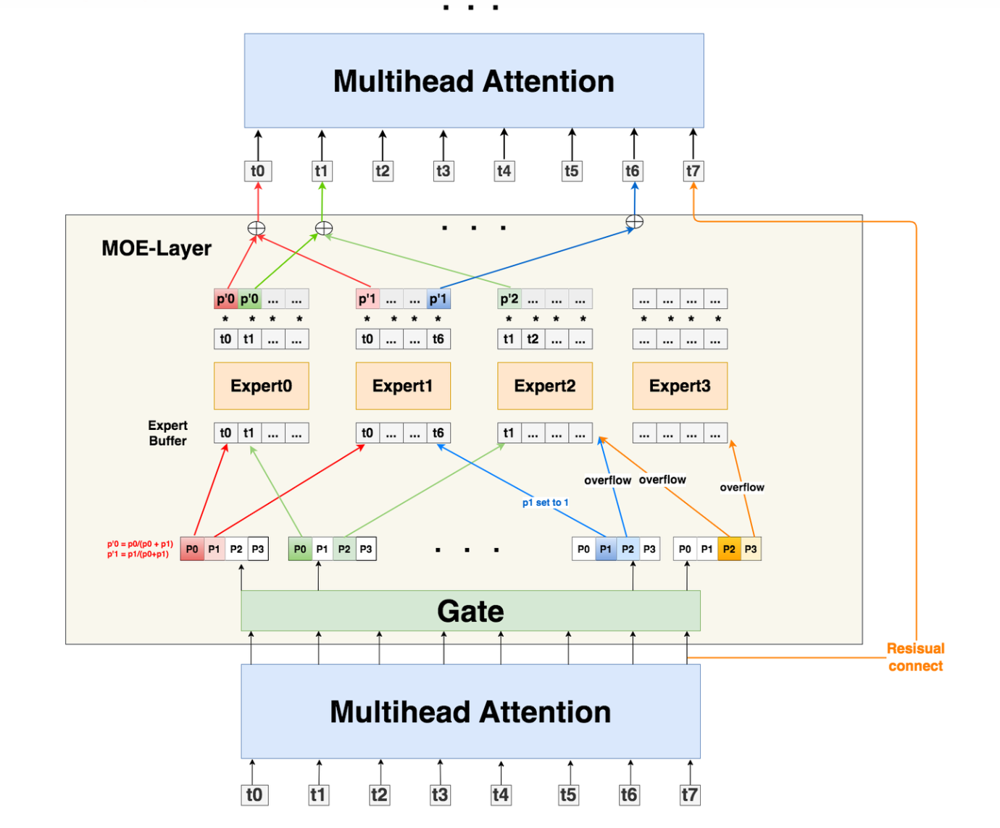
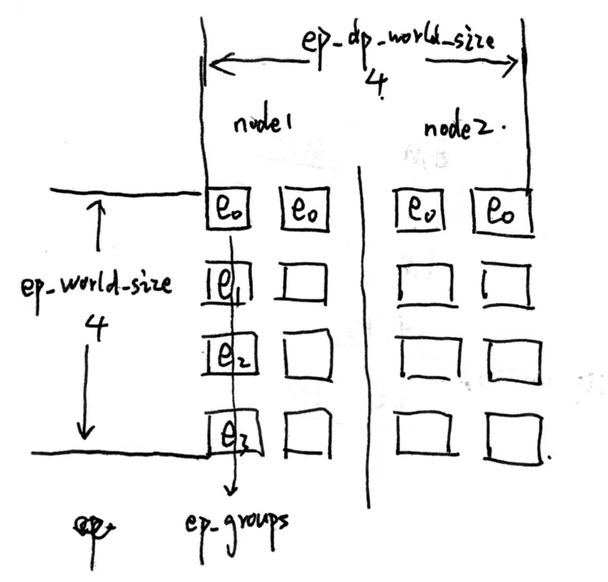
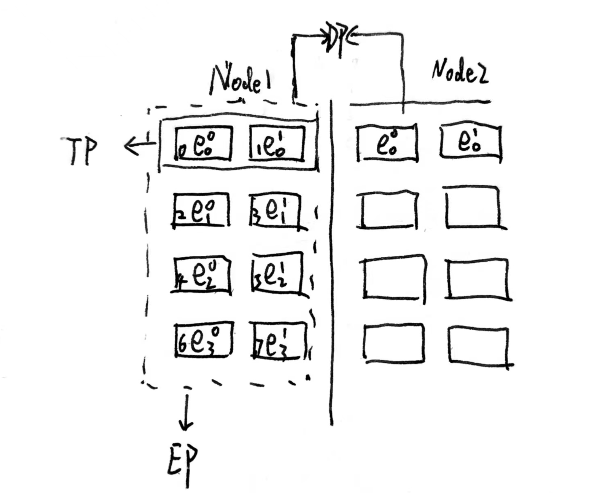
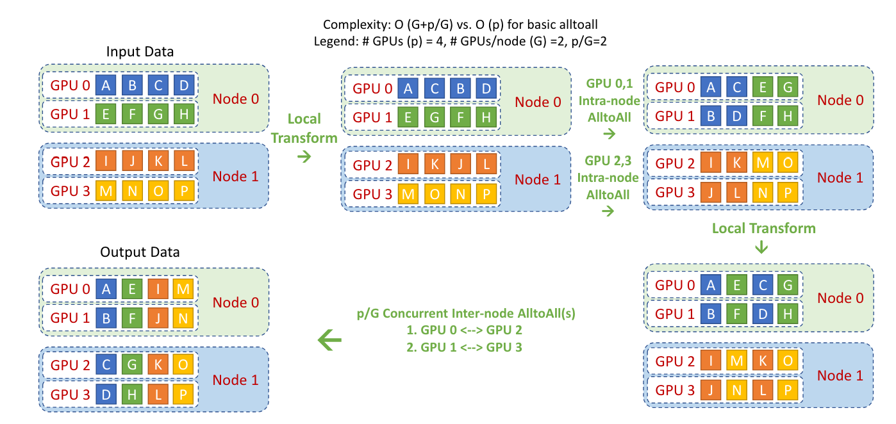
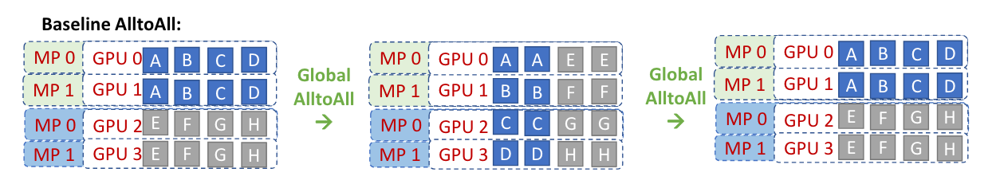
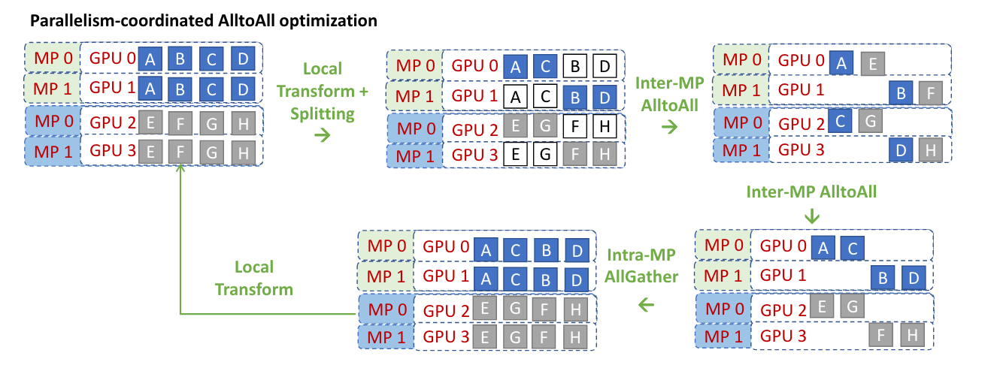

Title: LLM并行训练5-MoE并行

URL Source: https://www.cnblogs.com/sunstrikes/p/18310517

Published Time: 2024-07-20T12:48:00.0000000+08:00

Markdown Content:
前置知识
----

### MOE(MixerOfExpert)



moe的主要原理是替换attention层后的MLP层, 通过将不同类型的token按照门控单元计算出的概率分配给最大概率处理的专家网络处理, 对比单一MLP更适合处理复杂多样化的数据集. 主要思想和集成学习感觉很像, 而且扩展性(遇到新的目标任务可以新增专家网络)和可解释性(每个专家分开调整)都比较强. MOE前向步骤(以最简单的top2 Expert为例):

1.  门控网络, 输入是attention的输出, dim为(batch\_size, tokens, emb\_size), 输出dim为(batch\_size, tokens, experts\_num)

```
topkgate_linear = nn.Linear(n_embed, num_experts) # 从emb_size->专家个数的映射, 根据这个线性层计算每个token进入各个专家网络的概率
logits = topkgate_linear(mh_output)
top_k_logits, top_k_indices = logits.topk(top_k, dim=-1)  # 从4个专家网络里取top2,
zeros = torch.full_like(logits, float('-inf'))
sparse_logits = zeros.scatter(-1, top_k_indices, top_k_logits) #把除了top2剩余的位置置-inf
gating_output= F.softmax(sparse_logits, dim=-1)   #softmax计算进入各个专家网络的概率
```

2.  稀疏化Experts

这部分每个expert的网络结构都可以根据场景设计的不一样, 因为在fp/bp计算的时候, 每个token都是只进入了topk的网络进行计算, 剩余的网络没有计算. 大部分的参数都没参与更新, 所以也被称为稀疏化的dense. 因为这个特性也给moe网络的并行化改造提供了基础. 这块里使用了enisum(爱因斯坦求和)简化表达矩阵运算

```
#为了方便后面计算, 把gating_output reshape成(batch_size * tokens, experts_num)
reshaped_gating_emb = mh_output.reshape(-1, emb_size)
#使用如下简写表示dim S: batch_size * tokens E: experts_num  C: expert_buffer  M: emb_size
#这一步把token填充到experts的buffer里, 而且记录每个token在buffer里的填充位置, 以上图的token T0为例, 对应的(E,C)矩阵为:
#[[P0, 0, 0, 0],
#[[P1, 0, 0, 0],
#[[0, 0, 0, 0],
#[[0, 0, 0, 0]] mask用于表示buffer里的相关位置有没有被zero_padding.
combine_w, dispatch_mask = Top2Gating(gating_output) # combine_w: (S, E, C)  dispatch_mask:(S, E, C)
# 按顺序把emb填充到每个expert_buffer里, mask里为false的时候说明是padding, 跳过
dispatched_expert_input = einsum("SEC, SM -> ECM", dispatch_mask, reshaped_gating_emb)  #dispatched_expert_input: (E, C, M)
# 经过专家网络的FFN 前向计算
h = enisum("ECM, EMH -> ECH", dispatched_expert_input, Wi)  #experts的Wi层，尺寸为(E，M, H)，
h = relu(h)
expert_outputs = enisum("ECH, EHM -> ECM", h, Wo)  #experts的Wo层，尺寸为(E, H, M)

# 对token的top2概率进行加权求和
outputs = enisum("SEC, ECM -> SM", combine_w, expert_outputs)
outputs_reshape = outputs.reshape(input.shape) # 从(S, M)变成(seq_len, batch_size, emb_size)
```

### expert负载不均匀问题

因为expert的概率纯粹是训练出来的参数决定的, 没法用LALB类似的负载均衡策略强制使每个expert接收到的token是均匀的, 极有可能出现某几个expert接收到了很多, 其他的基本没啥token的问题..主要有以下这么几个解决办法:

**TokenBuffer**: 给每个expert设置固定容量, 容量设置公式如下, 当这个expert收满token后就不再接受token

\\\[𝑐𝑎𝑝𝑎𝑐𝑖𝑡𝑦=𝑚𝑎𝑥(\\frac{𝑆}{𝐸}∗𝐾∗𝑐𝑎𝑝𝑎𝑐𝑖𝑡𝑦\\\_𝑓𝑎𝑐𝑡𝑜𝑟,𝑚𝑖𝑛\\\_𝑐𝑎𝑝𝑎𝑐𝑖𝑡𝑦) \\\]

\\(E\\)：expert\_num \\(S\\) ：token数 \\(K\\): topK数

在deepspeed的实现里处理token溢出的方法:

*   这个token在top2的两个expert只溢出了一个, 那么把另一个没溢出的expert的softmax权重设成1放到那个expert里(这里有点像hash线性探测那种方法haha)
*   在两个expert里都溢出了, 那么把这个token直接跳过expert通过残差的方式直连到上层

**Random Routing**:

随机路由的方法主要针对的是2nd的expert, 1st的直接发出去. deepspeed的2nd随机选择策略:

1.  从随机分布中采样expert\_num个随机数作为噪声
2.  把噪声加到softmax的结果上, 另外把1st的mask掉(因为1st是必发的, 只需要再选一个最高的就够了)
3.  在剩下的里面找一个最高的作为2nd expert.
4.  因为随机后的不一定两个expert概率加和为1, 所以需要进行重新normalize \\(P\_0' = \\frac{P\_0}{P\_0 + P\_1}\\) \\(P\_1' = \\frac{P\_1}{P\_0 + P\_1}\\) 这里算的概率用于把经过2个对应expert后的token结果进行加权平均.

**辅助损失函数**:

\\\[l\_{\\text {aux }}=\\frac{1}{E} \\sum\_{e=1}^E \\frac{c\_e}{S} \* m\_e \\\]

*   \\(C\_e\\) ：某expert的buffer中已经存下的token数量（该expert作为1st时接收到的token数）
*   \\(m\_e\\) ：某expert的buffer中已经存下的token在该专家上的avg(weight)（token考虑范围也是那些将该专家作为1st专家的token）, 加这个参数主要是为了让这部分可导, 能够进行bp

把这个loss加到主loss后面, 目标也是最小化这个辅助loss. 因为我们最理想的情况是每个expert作为1/2的1st和1/2的2nd, 而如果某个expert溢出时他作为1st的概率远高于其他expert, 而溢出后根据上面处理溢出的方法会把2nd转成1st, 使得1st变多. 所以我们minimize 辅助loss的时候其实就是让网络学习时尽量避免溢出.

MOE并行(gshard)
-------------

### 1\. EP+DP

以2机16卡为例, 如果想使用4份数据并行(ep\_dp\_world\_size), 每套专家可以被平均分为4份为例(ep\_world\_size), 这里其实就是\\(e\_0+ e\_1+e\_2+e\_3\\), 那么切分结构如下图:



在切分的时候, 主要需要遵循几个原则:

1.  在数据并行的时候, 我们尽量使同一套专家切分后尽量分布在一台机器内, 这样在一个batch内对所有专家进行fp/bp时不需要跨机通信, 经过专家网络fp后需要进行一次卡间all2all, 把每张卡的expert里算的其他卡的token给传回去进行加权求和
2.  这张图里的\\(e\_0\\)不代表只有一个专家, 而是1/4的专家, 比如专家总量为32时, 就代表着有8个专家在一张卡里
3.  多套专家之间和传统的DP处理方式一样, 每套专家fp输入不同batch的数据, 在bp时allReduce梯度

### 2\. EP+DP+TP

对比上面的EP+DP, 其实就是多了\\(e\_0\\)专家的W全部进行了纵切, 使得卡1,2可以进行张量并行. 在这个场景下网络计算的主要逻辑如下(以Node1为例):

1.  在前面的attention层因为也采用了TP的方式, 而在同一个TP组内的两张卡\[g0, g1\]...输出在allReduce后是一致的.
2.  \[g0, g2, g4, g6\]和\[g1, g3, g5, g7\]内各自做1次all2all(这里其实是处理相同的2份输入token)，将token发给对应的expert进行fp计算。
3.  \[g0, g1\], \[g2, g3\], \[g4, g5\], \[g6, g7\]这几个tp组各自通过AllReduce取得完整的输出结果
4.  \[g0, g2, g4, g6\]和\[g1, g3, g5, g7\]进行ep\_group all2all，把expert fp计算完毕的emb发送回对应的卡用于加权求和，同时处理完成的emb可以直接输入下一个attention层不再需要集合通信.



一般上EP+DP+TP就能满足显存限制, 在MoE训练里不会再引入流水线并行.

### 3\. Deepspeed all2all优化

#### 分层(Hierarchical) all2all

这个优化其实zeropp里提过, 只是少了其中的量化反量化的环节. 通信量从\\(O(p) \\Rightarrow O(G+p/G)\\), p: 卡数 G: 机器数



#### 基于TP的all2all优化

基线的all2all在_EP+DP+TP_这节里简单讲过, 因为g0和g1是在同一个TP单元里, 当non-MoE的结果allReduce之后两张卡上的结果是完全一样的. 所以我们如果直接用all2all通信时其实有一半的通信是完全冗余的.



为了解决上面的冗余数据通信的问题, 优化后的all2all主要有以下几步:

1.  根据机器间的关系把数据切分重排序. 为啥这里g0要把B和C换位置呢? 可以观察下上面baseline是咋处理的, B传给了g1, C传给了g2, 而实际上g1自身就有一份一样的B并不需要通信. 只需要让g0把C传给g2就可以了. D由g1传给g3.
2.  对tp rank相同的卡组成一个新的all2all group, 比如\[g0, g2\], \[g1,g3\], 然后拿重排序的一半数据进行all2all通信.
3.  机器间的all2all完成后, 因为TP内部每个卡目前持有一半数据, allGather后再恢复顺序, 就能完成最终的计算
4.  通信量从\\(O(p) \\Rightarrow O(p/L) + O(L)\\) p:卡数 L:TP并行数

注意: deepspeed在实际实现时因为要把原来的4卡all2all改成2卡, 没法和EP切分数保持一致导致改动成本较大. 所以把gating\_output(E, C, M)的第二维切分成TP并行数. 然后还是正常进行4卡all2all, 就解决了冗余通信的同时还能减少改动成本.



参考
--

gshard论文: [https://arxiv.org/pdf/2006.16668](https://arxiv.org/pdf/2006.16668)

Deepspeed-moe代码: [https://github.com/microsoft/Megatron-DeepSpeed/blob/main/megatron/model/transformer.py](https://github.com/microsoft/Megatron-DeepSpeed/blob/main/megatron/model/transformer.py)

einsum简介: [https://zhuanlan.zhihu.com/p/542625230](https://zhuanlan.zhihu.com/p/542625230)

Deepspeed-moe论文: [https://arxiv.org/abs/2201.05596](https://arxiv.org/abs/2201.05596)

moe并行博客: [https://zhuanlan.zhihu.com/p/681154742](https://zhuanlan.zhihu.com/p/681154742)
