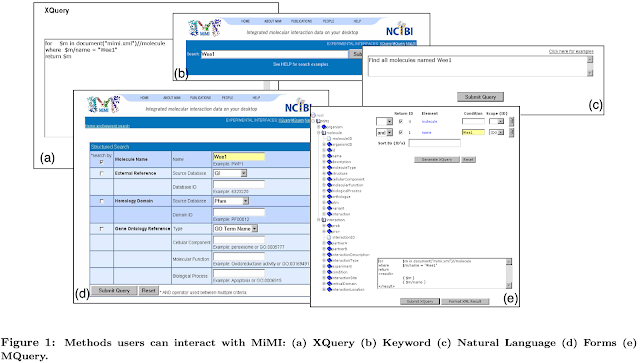
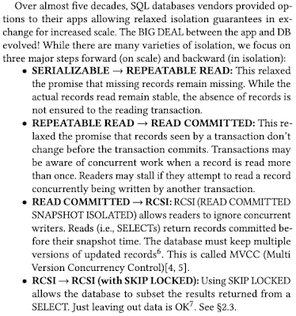
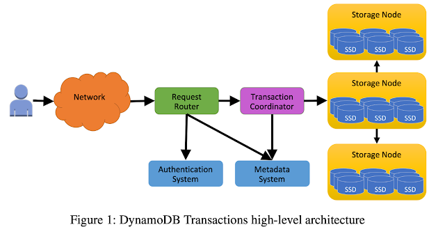
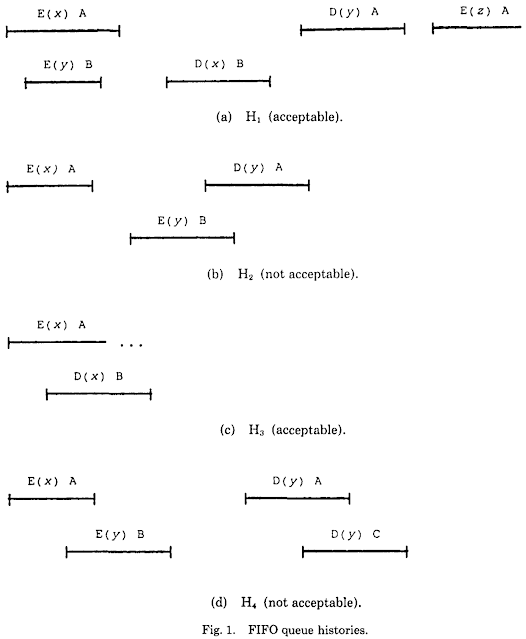

Title: My Time at MIT

URL Source: http://muratbuffalo.blogspot.com/2025/02/my-time-at-mit.html

Published Time: 2025-02-16T22:47:00-05:00

Markdown Content:
My Time at MIT
===============  

[Skip to main content](http://muratbuffalo.blogspot.com/2025/02/my-time-at-mit.html#main)

### Search This Blog

[Metadata](https://muratbuffalo.blogspot.com/)
==============================================

On distributed systems broadly defined and other curiosities. The opinions on this site are my own.

### My Time at MIT

*   Get link
*   Facebook
*   X
*   Pinterest
*   Email
*   Other Apps

\-  [February 16, 2025](https://muratbuffalo.blogspot.com/2025/02/my-time-at-mit.html "permanent link")

Twenty years ago, in 2004-2005, I spent a year at MIT’s Computer Science department as a postdoc working with Professor Nancy Lynch. It was an extraordinary experience. Life at MIT felt like paradise, and leaving felt like being cast out.

  

MIT Culture
-----------

MIT’s Stata Center was the best CS building in the world at the time. Designed by Frank Gehry, it was a striking abstract architecture masterpiece ([although like all abstractions it was a bit leaky](https://thetech.com/2010/03/19/statasuit-v130-n14)). Furniture from Herman Miller complemented this design. I remember seeing price tags of $400 on simple yellow chairs.

The building buzzed with activity.  Every two weeks, postdocs were invited to the faculty lunch on Thursdays, and alternating weeks we had group lunches. Free food seemed to materialize somewhere in the building almost daily, and the food trucks outside were also good. MIT thrived on constant research discussions, collaborations, and talks. Research talks were advertised on posters at the urinals, as a practical touch of MIT's hacker culture I guess.

Our research group occupied the 6th floor, which was home to theory and algorithms. From there, I would see Tim Berners-Lee meeting with colleagues on the floor below. The building’s open spaces and spiral staircases connected every pair of floors to foster interaction. The place radiated strong academic energy. One evening, I saw Piotr Indyk discussing something in front of one of the many whiteboards on the 6th floor. The next morning, he was still there, having spent the night working toward a paper deadline. Eric Demaine was on the same floor too. Once, I sent a long print job (a PhD thesis) accidentally to his office printer, and he was angry because of the wasted paper.

Nancy Lynch set a great example for us. She is a very detail-oriented person and she was able to find even the tiniest mistakes in the papers with ease. She once told me that her mind worked like a debugger when reading a paper, and these bugs jumped at her. The way she worked with students was that she would dedicate herself solely on a student/paper for the duration of an entire week. That week, she would avoid thinking or listening other works/students, even when she wanted to participate. [This is because, she wanted to immerse and keep every parameter about the paper she is working on in her mind, and grok it.](https://muratbuffalo.blogspot.com/2013/07/how-i-read-research-paper.html)

People in Nancy's group were also incredibly sharp—Seth Gilbert, Rui Fan, Gregory Chockler, Cal Newport, and many other students and visiting researchers. Yes, that Cal Newport of "Deep Work" fame was a fresh PhD student back then. Looking back, I regret not making more friends, and not forging deeper connections.

Lessons Learned
---------------

Reflecting on my time at MIT, I wish I had been more intentional, more present, and more engaged. The experience was a gift, but I see now how much more I could have made of it.

I was young, naive, and plagued by impostor syndrome. I held back instead of exploring more, engaging more deeply, and seeking out more challenges.  I allowed myself to be carried along by the current, rather than actively charting my own course. Youth is wasted on the young.

Why pretend to be smart and play it safe? True understanding is rare and hard-won, so why claim it before you are sure of it? Isn't it more advantageous to embrace your stupidity/ignorance and be underestimated?  In research and academia, success often goes not to the one who understands first, but to the one who understands best. Even when speed matters, the real advantage comes from the deep, foundational insights that lead there.

When you approach work with humility and curiosity, you learn more and participate more fully. Good collaborators value these qualities. A beginner’s mind is an asset. [Staying close to your authentic self helps you find your true calling.](https://muratbuffalo.blogspot.com/2020/07/the-great-work-of-your-life-by-stephen.html)

[misc](https://muratbuffalo.blogspot.com/search/label/misc) [my advice](https://muratbuffalo.blogspot.com/search/label/my%20advice) [research-advice](https://muratbuffalo.blogspot.com/search/label/research-advice)

*   Get link
*   Facebook
*   X
*   Pinterest
*   Email
*   Other Apps

### Comments

[Sreeram Venkitesh](https://www.blogger.com/profile/12808993258570461987) said…

\> Why pretend to be smart and play it safe? True understanding is rare and hard-won, so why claim it before you are sure of it? Isn't it more advantageous to embrace your stupidity/ignorance and be underestimated? In research and academia, success often goes not to the one who understands first, but to the one who understands best. Even when speed matters, the real advantage comes from the deep, foundational insights that lead there. When you approach work with humility and curiosity, you learn more and participate more fully. Good collaborators value these qualities. A beginner’s mind is an asset. Staying close to your authentic self helps you find your true calling.  
  
The last paragraph is really good, thanks for the post!

[February 20, 2025 at 9:18 AM](https://muratbuffalo.blogspot.com/2025/02/my-time-at-mit.html?showComment=1740061089528#c8426974837323938143 "comment permalink")  

[Post a Comment](https://www.blogger.com/comment/fullpage/post/8436330762136344379/1205669765698104829)

### Popular posts from this blog

### [Hints for Distributed Systems Design](https://muratbuffalo.blogspot.com/2023/10/hints-for-distributed-systems-design.html)

\-  [October 02, 2023](https://muratbuffalo.blogspot.com/2023/10/hints-for-distributed-systems-design.html "permanent link")

This is with apologies to Butler Lampson, who published the " Hints for computer system design " paper 40 years ago in SOSP'83. I don't claim to match that work of course. I just thought I could draft this post to organize my thinking about designing distributed systems and get feedback from others. I start with the same  disclaimer Lampson gave. These hints are not novel, not foolproof recipes, not laws of design, not precisely formulated, and not always appropriate. They are just hints.  They are context dependent, and some of them may be controversial. That being said, I have seen these hints successfully applied in distributed systems design throughout my 25 years in the field, starting from the theory of distributed systems (98-01), immersing into the practice of wireless sensor networks (01-11), and working on cloud computing systems both in the academia and industry ever since. These heuristic principles have been applied knowingly or unknowingly and has proven...

[Read more \>\>](https://muratbuffalo.blogspot.com/2023/10/hints-for-distributed-systems-design.html "Hints for Distributed Systems Design")

### [Learning about distributed systems: where to start?](https://muratbuffalo.blogspot.com/2020/06/learning-about-distributed-systems.html)

\-  [June 10, 2020](https://muratbuffalo.blogspot.com/2020/06/learning-about-distributed-systems.html "permanent link")

This is definitely not a "learn distributed systems in 21 days" post. I recommend a principled, from the foundations-up, studying of distributed systems, which will take a good three months in the first pass, and many more months to build competence after that. If you are practical and coding oriented you may not like my advice much. You may object saying, "Shouldn't I learn distributed systems with coding and hands on? Why can I not get started by deploying a Hadoop cluster, or studying the Raft code." I think that is the wrong way to go about learning distributed systems, because seeing similar code and programming language constructs will make you think this is familiar territory, and will give you a false sense of security. But, nothing can be further from the truth. Distributed systems need radically different software than centralized systems do.  --A. Tannenbaum This quotation is literally the first sentence in my distributed systems syllabus. Inst...

[Read more \>\>](https://muratbuffalo.blogspot.com/2020/06/learning-about-distributed-systems.html " Learning about distributed systems: where to start?")

### [Making database systems usable](https://muratbuffalo.blogspot.com/2024/08/making-database-systems-usable.html)

\-  [August 19, 2024](https://muratbuffalo.blogspot.com/2024/08/making-database-systems-usable.html "permanent link")

C. J. Date's Sigmod 1983 keynote, "Database Usability", was prescient. Usability is the most important thing to the customers. They care less about impressive benchmarks or clever algorithms, and more about whether they can operate and use a database efficiently to query, update, analyze, and persist their data with minimal headache. (BTW, does anyone have a link to the contents of this Sigmod'83 talk? There is no transcript around, except for this short abstract .) The paper we cover today is from Sigmod 2007. It takes on the database usability problem raised in that 1983 keynote head-on, and calls out that the king is still naked.  Let's give some context for the year 2007. Yes, XML format was still popular then. The use-case in the paper is XQuery. The paper does not contain any  reference to json. MongoDB would be released in 2009 with the document model; and that seems to be great timing for some of the usability pains mentioned in the paper! Web 2.0 was in ...

[Read more \>\>](https://muratbuffalo.blogspot.com/2024/08/making-database-systems-usable.html "Making database systems usable")

### [Looming Liability Machines (LLMs)](https://muratbuffalo.blogspot.com/2024/08/looming-liability-machines.html)

\-  [August 24, 2024](https://muratbuffalo.blogspot.com/2024/08/looming-liability-machines.html "permanent link")

As part of our zoom reading group ( wow, 4.5 years old now ), we discussed a paper that uses LLMs for automatic root cause analysis (RCA) for cloud incidents. This was a pretty straightforward application of LLMs. The proposed system employs an LLM to match incoming incidents to incident handlers based on their alert types, predicts the incident's root cause category, and provides an explanatory narrative. The only customization is through prompt-engineering. Since this is a custom domain, I think a more principled and custom-designed  machine learning system would be more appropriate rather than adopting LLMs. Anyways, the use of LLMs for RCAs spooked me vicerally. I couldn't find the exact words during the paper discussion, but I can articulate this better now. Let me explain. RCA is serious business Root cause analysis (RCA) is the process of identifying the underlying causes of a problem/incident, rather than just addressing its symptoms. One RCA heuristic is asking 5 Why...

[Read more \>\>](https://muratbuffalo.blogspot.com/2024/08/looming-liability-machines.html "Looming Liability Machines (LLMs)")

### [Scalable OLTP in the Cloud: What’s the BIG DEAL?](https://muratbuffalo.blogspot.com/2024/01/scalable-oltp-in-cloud-whats-big-deal.html)

\-  [January 17, 2024](https://muratbuffalo.blogspot.com/2024/01/scalable-oltp-in-cloud-whats-big-deal.html "permanent link")

This paper is from Pat Helland, the apostate philosopher of database systems, overall a superb person, and a good friend of mine. The paper appeared this week at CIDR'24. (Check out the program for other interesting papers). The motivating question behind this work is: " What are the asymptotic limits to scale for cloud OLTP (OnLine Transaction Processing) systems? " Pat says that the CIDR 2023 paper "Is Scalable OLTP in the Cloud a Solved Problem?" prompted this question.  The answer to the question? Pat says that the answer lies in the joint responsibility of database and the application. If you know of Pat's work, which I have summarized several in this blog , you would know that Pat has been advocating along these lines before. But this paper provides a very crisp, specific, concrete answer. Read on for my summary of the paper. Disclaimer: This is a wisdom and technical information/detail packed 13-page paper, so I will try my best to summarize the sa...

[Read more \>\>](https://muratbuffalo.blogspot.com/2024/01/scalable-oltp-in-cloud-whats-big-deal.html "Scalable OLTP in the Cloud: What’s the BIG DEAL?")

### [Advice to the young](https://muratbuffalo.blogspot.com/2024/07/advice-to-young.html)

\-  [July 30, 2024](https://muratbuffalo.blogspot.com/2024/07/advice-to-young.html "permanent link")

I notice I haven't written any advice posts recently. Here is a collection of my advice posts pre 2020. I've been feeling all this elderly wisdom pent up in me, ready to pour at any moment. So here it goes. Get ready to quench your thirst from my fount of wisdom. No man, think for yourself, only get what works for you. It is called foundations, not theory Foundations of computer science (or rather any field of study) are the most important topics you can learn. These lay down the frame of thinking/perspective for that area of study. Yet, I am saddened to hear these called as "theory", and labeled as "unpractical". This couldn't be farther from the truth. Take a look at how I recommend studying distributed systems . Don't you dare call this "theory" and "unpractical". This lays the bedrock that you build your practice on. Don't skimp on the foundations. Don't build your home on quicksand. Keep your hands dirty, your mind cl...

[Read more \>\>](https://muratbuffalo.blogspot.com/2024/07/advice-to-young.html "Advice to the young")

### [Foundational distributed systems papers](https://muratbuffalo.blogspot.com/2021/02/foundational-distributed-systems-papers.html)

\-  [February 27, 2021](https://muratbuffalo.blogspot.com/2021/02/foundational-distributed-systems-papers.html "permanent link")

I talked about the importance of reading foundational papers last week. To followup, here is my compilation of foundational papers in the distributed systems area. (I focused on the core distributed systems area, and did not cover networking, security, distributed ledgers, verification work etc. I even left out distributed transactions, I hope to cover them at a later date.)  I classified the papers by subject, and listed them in chronological order. I also listed expository papers and blog posts at the end of each section. Time and State in Distributed Systems Time, Clocks, and the Ordering of Events in a Distributed System. Leslie Lamport, Commn. of the ACM,  1978. Distributed Snapshots: Determining Global States of a Distributed System. K. Mani Chandy Leslie Lamport, ACM Transactions on Computer Systems, 1985. Virtual Time and Global States of Distributed Systems.  Mattern, F. 1988. Practical uses of synchronized clocks in distributed systems. B. Liskov, 1991. Exp...

[Read more \>\>](https://muratbuffalo.blogspot.com/2021/02/foundational-distributed-systems-papers.html " Foundational distributed systems papers")

### [Distributed Transactions at Scale in Amazon DynamoDB](https://muratbuffalo.blogspot.com/2023/08/distributed-transactions-at-scale-in.html)

\-  [August 17, 2023](https://muratbuffalo.blogspot.com/2023/08/distributed-transactions-at-scale-in.html "permanent link")

This paper appeared in July at USENIX ATC 2023. If you haven't read about the architecture and operation of DynamoDB, please first read my summary of the DynamoDB ATC 2022 paper . The big omission in that paper was discussion about transactions. This paper amends that. It is great to see DynamoDB, and AWS in general, is publishing/sharing more widely than before. Overview A killer feature of DynamoDB is predictability at any scale. Do read Marc Brooker's post to fully appreciate this feature. Aligned with this predictability tenet, when adding transactions to DynamoDB, the first and primary constraint was to preserve the predictable high performance of single-key reads/writes at any scale. The second big constraint was to implement transactions using update in-place operation without multi-version concurrency control. The reason for this was they didn't want to mock with the storage layer which did not support multi-versioning. Satisfying both of the above constraints may s...

[Read more \>\>](https://muratbuffalo.blogspot.com/2023/08/distributed-transactions-at-scale-in.html "Distributed Transactions at Scale in Amazon DynamoDB ")

### [Linearizability: A Correctness Condition for Concurrent Objects](https://muratbuffalo.blogspot.com/2024/08/linearizability-correctness-condition.html)

\-  [August 09, 2024](https://muratbuffalo.blogspot.com/2024/08/linearizability-correctness-condition.html "permanent link")

This paper is from Herlihy and Wing appeared in ACM Transactions on Programming Languages and Systems 1990. This is the canonical reference for the linearizability definition. I had not read this paper in detail before, so I thought it would be good to go to the source to see if there are additional delightful surprises in the original text. Hence, this post. I will dive into a technical analysis of the paper first, and then discuss some of my takes toward the end. I had written an accessible explanation of linearizability earlier; you may want to read that first. I will assume an understanding of linearizability to keep this review at reasonable length. Introduction I love how the old papers just barge in with the model, without bothered by pleasantries such as motivation of the problem. These are the first two sentences of the introduction. "A concurrent system consists of a collection of sequential processes that communicate through shared typed objects . This model encompass...

[Read more \>\>](https://muratbuffalo.blogspot.com/2024/08/linearizability-correctness-condition.html "Linearizability: A Correctness Condition for Concurrent Objects")

[Powered by Blogger](https://www.blogger.com/)

Theme images by [Michael Elkan](http://www.offset.com/photos/394244)

Murat Demirbas

[Murat](https://www.blogger.com/profile/07842046940394980130)

I am a principal research scientist at MongoDB Research. Ex-AWS. On leave as a [computer science and engineering professor at SUNY Buffalo](http://www.cse.buffalo.edu/~demirbas/). I work on distributed systems, distributed consensus, and cloud computing. You can follow me on [Mastodon](https://fediscience.org/@muratdemirbas) or [Twitter.](http://twitter.com/muratdemirbas)

[Visit profile](https://www.blogger.com/profile/07842046940394980130)

### Pageviews

### Recent Posts

*   [February3](https://muratbuffalo.blogspot.com/2025/02/)
*   [January5](https://muratbuffalo.blogspot.com/2025/01/)
*   [December8](https://muratbuffalo.blogspot.com/2024/12/)
*   [November5](https://muratbuffalo.blogspot.com/2024/11/)
*   [October8](https://muratbuffalo.blogspot.com/2024/10/)
*   [September10](https://muratbuffalo.blogspot.com/2024/09/)
*   [August9](https://muratbuffalo.blogspot.com/2024/08/)
*   [July3](https://muratbuffalo.blogspot.com/2024/07/)
*   [June5](https://muratbuffalo.blogspot.com/2024/06/)
*   [May2](https://muratbuffalo.blogspot.com/2024/05/)

*   [April6](https://muratbuffalo.blogspot.com/2024/04/)
*   [March6](https://muratbuffalo.blogspot.com/2024/03/)
*   [February9](https://muratbuffalo.blogspot.com/2024/02/)
*   [January7](https://muratbuffalo.blogspot.com/2024/01/)
*   [December3](https://muratbuffalo.blogspot.com/2023/12/)
*   [November4](https://muratbuffalo.blogspot.com/2023/11/)
*   [October4](https://muratbuffalo.blogspot.com/2023/10/)
*   [September4](https://muratbuffalo.blogspot.com/2023/09/)
*   [August4](https://muratbuffalo.blogspot.com/2023/08/)
*   [July5](https://muratbuffalo.blogspot.com/2023/07/)
*   [June2](https://muratbuffalo.blogspot.com/2023/06/)
*   [May3](https://muratbuffalo.blogspot.com/2023/05/)
*   [April3](https://muratbuffalo.blogspot.com/2023/04/)
*   [March3](https://muratbuffalo.blogspot.com/2023/03/)
*   [February5](https://muratbuffalo.blogspot.com/2023/02/)
*   [January3](https://muratbuffalo.blogspot.com/2023/01/)
*   [December4](https://muratbuffalo.blogspot.com/2022/12/)
*   [November4](https://muratbuffalo.blogspot.com/2022/11/)
*   [October1](https://muratbuffalo.blogspot.com/2022/10/)
*   [September4](https://muratbuffalo.blogspot.com/2022/09/)
*   [August5](https://muratbuffalo.blogspot.com/2022/08/)
*   [July6](https://muratbuffalo.blogspot.com/2022/07/)
*   [June3](https://muratbuffalo.blogspot.com/2022/06/)
*   [May3](https://muratbuffalo.blogspot.com/2022/05/)
*   [April4](https://muratbuffalo.blogspot.com/2022/04/)
*   [March3](https://muratbuffalo.blogspot.com/2022/03/)
*   [February3](https://muratbuffalo.blogspot.com/2022/02/)
*   [January3](https://muratbuffalo.blogspot.com/2022/01/)
*   [December5](https://muratbuffalo.blogspot.com/2021/12/)
*   [November3](https://muratbuffalo.blogspot.com/2021/11/)
*   [October6](https://muratbuffalo.blogspot.com/2021/10/)
*   [September1](https://muratbuffalo.blogspot.com/2021/09/)
*   [August4](https://muratbuffalo.blogspot.com/2021/08/)
*   [July2](https://muratbuffalo.blogspot.com/2021/07/)
*   [June12](https://muratbuffalo.blogspot.com/2021/06/)
*   [May1](https://muratbuffalo.blogspot.com/2021/05/)
*   [April1](https://muratbuffalo.blogspot.com/2021/04/)
*   [March4](https://muratbuffalo.blogspot.com/2021/03/)
*   [February4](https://muratbuffalo.blogspot.com/2021/02/)
*   [January4](https://muratbuffalo.blogspot.com/2021/01/)
*   [December3](https://muratbuffalo.blogspot.com/2020/12/)
*   [November7](https://muratbuffalo.blogspot.com/2020/11/)
*   [October4](https://muratbuffalo.blogspot.com/2020/10/)
*   [September1](https://muratbuffalo.blogspot.com/2020/09/)
*   [August3](https://muratbuffalo.blogspot.com/2020/08/)
*   [July6](https://muratbuffalo.blogspot.com/2020/07/)
*   [June11](https://muratbuffalo.blogspot.com/2020/06/)
*   [May9](https://muratbuffalo.blogspot.com/2020/05/)
*   [April8](https://muratbuffalo.blogspot.com/2020/04/)
*   [March8](https://muratbuffalo.blogspot.com/2020/03/)
*   [February7](https://muratbuffalo.blogspot.com/2020/02/)
*   [January9](https://muratbuffalo.blogspot.com/2020/01/)
*   [December10](https://muratbuffalo.blogspot.com/2019/12/)
*   [November14](https://muratbuffalo.blogspot.com/2019/11/)
*   [October6](https://muratbuffalo.blogspot.com/2019/10/)
*   [September13](https://muratbuffalo.blogspot.com/2019/09/)
*   [July3](https://muratbuffalo.blogspot.com/2019/07/)
*   [June3](https://muratbuffalo.blogspot.com/2019/06/)
*   [May4](https://muratbuffalo.blogspot.com/2019/05/)
*   [April6](https://muratbuffalo.blogspot.com/2019/04/)
*   [March2](https://muratbuffalo.blogspot.com/2019/03/)
*   [February1](https://muratbuffalo.blogspot.com/2019/02/)
*   [January3](https://muratbuffalo.blogspot.com/2019/01/)
*   [December4](https://muratbuffalo.blogspot.com/2018/12/)
*   [November7](https://muratbuffalo.blogspot.com/2018/11/)
*   [October2](https://muratbuffalo.blogspot.com/2018/10/)
*   [September2](https://muratbuffalo.blogspot.com/2018/09/)
*   [August8](https://muratbuffalo.blogspot.com/2018/08/)
*   [July2](https://muratbuffalo.blogspot.com/2018/07/)
*   [June4](https://muratbuffalo.blogspot.com/2018/06/)
*   [May9](https://muratbuffalo.blogspot.com/2018/05/)
*   [April6](https://muratbuffalo.blogspot.com/2018/04/)
*   [March9](https://muratbuffalo.blogspot.com/2018/03/)
*   [February5](https://muratbuffalo.blogspot.com/2018/02/)
*   [January13](https://muratbuffalo.blogspot.com/2018/01/)
*   [December15](https://muratbuffalo.blogspot.com/2017/12/)
*   [November15](https://muratbuffalo.blogspot.com/2017/11/)
*   [October5](https://muratbuffalo.blogspot.com/2017/10/)
*   [September8](https://muratbuffalo.blogspot.com/2017/09/)
*   [August10](https://muratbuffalo.blogspot.com/2017/08/)
*   [July3](https://muratbuffalo.blogspot.com/2017/07/)
*   [June3](https://muratbuffalo.blogspot.com/2017/06/)
*   [May3](https://muratbuffalo.blogspot.com/2017/05/)
*   [April4](https://muratbuffalo.blogspot.com/2017/04/)
*   [February4](https://muratbuffalo.blogspot.com/2017/02/)
*   [January7](https://muratbuffalo.blogspot.com/2017/01/)
*   [December7](https://muratbuffalo.blogspot.com/2016/12/)
*   [November9](https://muratbuffalo.blogspot.com/2016/11/)
*   [October3](https://muratbuffalo.blogspot.com/2016/10/)
*   [September1](https://muratbuffalo.blogspot.com/2016/09/)
*   [July4](https://muratbuffalo.blogspot.com/2016/07/)
*   [June5](https://muratbuffalo.blogspot.com/2016/06/)
*   [May1](https://muratbuffalo.blogspot.com/2016/05/)
*   [April4](https://muratbuffalo.blogspot.com/2016/04/)
*   [March2](https://muratbuffalo.blogspot.com/2016/03/)
*   [February2](https://muratbuffalo.blogspot.com/2016/02/)
*   [January4](https://muratbuffalo.blogspot.com/2016/01/)
*   [December3](https://muratbuffalo.blogspot.com/2015/12/)
*   [November2](https://muratbuffalo.blogspot.com/2015/11/)
*   [October3](https://muratbuffalo.blogspot.com/2015/10/)
*   [September2](https://muratbuffalo.blogspot.com/2015/09/)
*   [August3](https://muratbuffalo.blogspot.com/2015/08/)
*   [June1](https://muratbuffalo.blogspot.com/2015/06/)
*   [May1](https://muratbuffalo.blogspot.com/2015/05/)
*   [April6](https://muratbuffalo.blogspot.com/2015/04/)
*   [March6](https://muratbuffalo.blogspot.com/2015/03/)
*   [February4](https://muratbuffalo.blogspot.com/2015/02/)
*   [January3](https://muratbuffalo.blogspot.com/2015/01/)
*   [November4](https://muratbuffalo.blogspot.com/2014/11/)
*   [October4](https://muratbuffalo.blogspot.com/2014/10/)
*   [September6](https://muratbuffalo.blogspot.com/2014/09/)
*   [August2](https://muratbuffalo.blogspot.com/2014/08/)
*   [July2](https://muratbuffalo.blogspot.com/2014/07/)
*   [June3](https://muratbuffalo.blogspot.com/2014/06/)
*   [March3](https://muratbuffalo.blogspot.com/2014/03/)
*   [February4](https://muratbuffalo.blogspot.com/2014/02/)
*   [January1](https://muratbuffalo.blogspot.com/2014/01/)
*   [December1](https://muratbuffalo.blogspot.com/2013/12/)
*   [November2](https://muratbuffalo.blogspot.com/2013/11/)
*   [August2](https://muratbuffalo.blogspot.com/2013/08/)
*   [July4](https://muratbuffalo.blogspot.com/2013/07/)
*   [June2](https://muratbuffalo.blogspot.com/2013/06/)
*   [May5](https://muratbuffalo.blogspot.com/2013/05/)
*   [April8](https://muratbuffalo.blogspot.com/2013/04/)
*   [January1](https://muratbuffalo.blogspot.com/2013/01/)
*   [December1](https://muratbuffalo.blogspot.com/2012/12/)
*   [November7](https://muratbuffalo.blogspot.com/2012/11/)
*   [October1](https://muratbuffalo.blogspot.com/2012/10/)
*   [September2](https://muratbuffalo.blogspot.com/2012/09/)
*   [August1](https://muratbuffalo.blogspot.com/2012/08/)
*   [May2](https://muratbuffalo.blogspot.com/2012/05/)
*   [March1](https://muratbuffalo.blogspot.com/2012/03/)
*   [February1](https://muratbuffalo.blogspot.com/2012/02/)
*   [January2](https://muratbuffalo.blogspot.com/2012/01/)
*   [December3](https://muratbuffalo.blogspot.com/2011/12/)
*   [September5](https://muratbuffalo.blogspot.com/2011/09/)
*   [June1](https://muratbuffalo.blogspot.com/2011/06/)
*   [May5](https://muratbuffalo.blogspot.com/2011/05/)
*   [April5](https://muratbuffalo.blogspot.com/2011/04/)
*   [March5](https://muratbuffalo.blogspot.com/2011/03/)
*   [February9](https://muratbuffalo.blogspot.com/2011/02/)
*   [January5](https://muratbuffalo.blogspot.com/2011/01/)
*   [December6](https://muratbuffalo.blogspot.com/2010/12/)
*   [November9](https://muratbuffalo.blogspot.com/2010/11/)
*   [October9](https://muratbuffalo.blogspot.com/2010/10/)
*   [September7](https://muratbuffalo.blogspot.com/2010/09/)
*   [August1](https://muratbuffalo.blogspot.com/2007/08/)

Show more Show less

### Topics

[2PC1](https://muratbuffalo.blogspot.com/search/label/2PC) [abstraction4](https://muratbuffalo.blogspot.com/search/label/abstraction) [AI5](https://muratbuffalo.blogspot.com/search/label/AI) [analytics3](https://muratbuffalo.blogspot.com/search/label/analytics) [atomic storage2](https://muratbuffalo.blogspot.com/search/label/atomic%20storage) [auditability5](https://muratbuffalo.blogspot.com/search/label/auditability) [automated reasoning9](https://muratbuffalo.blogspot.com/search/label/automated%20reasoning) [aws5](https://muratbuffalo.blogspot.com/search/label/aws) [Azure11](https://muratbuffalo.blogspot.com/search/label/Azure) [benchmarks4](https://muratbuffalo.blogspot.com/search/label/benchmarks)

[bestof8](https://muratbuffalo.blogspot.com/search/label/bestof) [big-data30](https://muratbuffalo.blogspot.com/search/label/big-data) [Blockchain39](https://muratbuffalo.blogspot.com/search/label/Blockchain) [book-review54](https://muratbuffalo.blogspot.com/search/label/book-review) [calm5](https://muratbuffalo.blogspot.com/search/label/calm) [chaos2](https://muratbuffalo.blogspot.com/search/label/chaos) [cloud computing17](https://muratbuffalo.blogspot.com/search/label/cloud%20computing) [consistency32](https://muratbuffalo.blogspot.com/search/label/consistency) [Cosmos DB11](https://muratbuffalo.blogspot.com/search/label/Cosmos%20DB) [CosmosDB12](https://muratbuffalo.blogspot.com/search/label/CosmosDB) [crdts2](https://muratbuffalo.blogspot.com/search/label/crdts) [data warehouse2](https://muratbuffalo.blogspot.com/search/label/data%20warehouse) [databases56](https://muratbuffalo.blogspot.com/search/label/databases) [datacenter networking1](https://muratbuffalo.blogspot.com/search/label/datacenter%20networking) [dataflow11](https://muratbuffalo.blogspot.com/search/label/dataflow) [dbos1](https://muratbuffalo.blogspot.com/search/label/dbos) [DDIA15](https://muratbuffalo.blogspot.com/search/label/DDIA) [disaggregation2](https://muratbuffalo.blogspot.com/search/label/disaggregation) [distributed consensus49](https://muratbuffalo.blogspot.com/search/label/distributed%20consensus) [distributed transactions36](https://muratbuffalo.blogspot.com/search/label/distributed%20transactions) [distSQL8](https://muratbuffalo.blogspot.com/search/label/distSQL) [facebook16](https://muratbuffalo.blogspot.com/search/label/facebook) [failures18](https://muratbuffalo.blogspot.com/search/label/failures) [fault-tolerance46](https://muratbuffalo.blogspot.com/search/label/fault-tolerance) [formal methods12](https://muratbuffalo.blogspot.com/search/label/formal%20methods) [graph-processing1](https://muratbuffalo.blogspot.com/search/label/graph-processing) [hpts3](https://muratbuffalo.blogspot.com/search/label/hpts) [htap3](https://muratbuffalo.blogspot.com/search/label/htap) [humans10](https://muratbuffalo.blogspot.com/search/label/humans) [indexing3](https://muratbuffalo.blogspot.com/search/label/indexing) [isolation levels4](https://muratbuffalo.blogspot.com/search/label/isolation%20levels) [links2](https://muratbuffalo.blogspot.com/search/label/links) [mad-questions42](https://muratbuffalo.blogspot.com/search/label/mad-questions) [main-memory1](https://muratbuffalo.blogspot.com/search/label/main-memory) [measuring1](https://muratbuffalo.blogspot.com/search/label/measuring) [metastability2](https://muratbuffalo.blogspot.com/search/label/metastability) [microservices2](https://muratbuffalo.blogspot.com/search/label/microservices) [misc116](https://muratbuffalo.blogspot.com/search/label/misc) [ML1](https://muratbuffalo.blogspot.com/search/label/ML) [mlbegin7](https://muratbuffalo.blogspot.com/search/label/mlbegin) [mldl26](https://muratbuffalo.blogspot.com/search/label/mldl) [mobile2](https://muratbuffalo.blogspot.com/search/label/mobile) [mongodb8](https://muratbuffalo.blogspot.com/search/label/mongodb) [MVCC1](https://muratbuffalo.blogspot.com/search/label/MVCC) [my advice18](https://muratbuffalo.blogspot.com/search/label/my%20advice) [my-paper10](https://muratbuffalo.blogspot.com/search/label/my-paper) [networking1](https://muratbuffalo.blogspot.com/search/label/networking) [newsql3](https://muratbuffalo.blogspot.com/search/label/newsql) [NoSQL2](https://muratbuffalo.blogspot.com/search/label/NoSQL) [OLAP2](https://muratbuffalo.blogspot.com/search/label/OLAP) [OLTP7](https://muratbuffalo.blogspot.com/search/label/OLTP) [paper-review149](https://muratbuffalo.blogspot.com/search/label/paper-review) [paxos51](https://muratbuffalo.blogspot.com/search/label/paxos) [postgres1](https://muratbuffalo.blogspot.com/search/label/postgres) [presenting4](https://muratbuffalo.blogspot.com/search/label/presenting) [privacy1](https://muratbuffalo.blogspot.com/search/label/privacy) [programming7](https://muratbuffalo.blogspot.com/search/label/programming) [query-processing2](https://muratbuffalo.blogspot.com/search/label/query-processing) [raft1](https://muratbuffalo.blogspot.com/search/label/raft) [RDMA2](https://muratbuffalo.blogspot.com/search/label/RDMA) [reading-group23](https://muratbuffalo.blogspot.com/search/label/reading-group) [reconfiguration4](https://muratbuffalo.blogspot.com/search/label/reconfiguration) [research-advice52](https://muratbuffalo.blogspot.com/search/label/research-advice) [research-question44](https://muratbuffalo.blogspot.com/search/label/research-question) [Rust3](https://muratbuffalo.blogspot.com/search/label/Rust) [scheduling3](https://muratbuffalo.blogspot.com/search/label/scheduling) [security1](https://muratbuffalo.blogspot.com/search/label/security) [seminar9](https://muratbuffalo.blogspot.com/search/label/seminar) [serializability1](https://muratbuffalo.blogspot.com/search/label/serializability) [serverless1](https://muratbuffalo.blogspot.com/search/label/serverless) [smartphones2](https://muratbuffalo.blogspot.com/search/label/smartphones) [snapshot isolation5](https://muratbuffalo.blogspot.com/search/label/snapshot%20isolation) [sonification1](https://muratbuffalo.blogspot.com/search/label/sonification) [SQL6](https://muratbuffalo.blogspot.com/search/label/SQL) [stabilization6](https://muratbuffalo.blogspot.com/search/label/stabilization) [statistics3](https://muratbuffalo.blogspot.com/search/label/statistics) [stream-processing12](https://muratbuffalo.blogspot.com/search/label/stream-processing) [teaching31](https://muratbuffalo.blogspot.com/search/label/teaching) [tensorflow11](https://muratbuffalo.blogspot.com/search/label/tensorflow) [time19](https://muratbuffalo.blogspot.com/search/label/time) [time synchronization5](https://muratbuffalo.blogspot.com/search/label/time%20synchronization) [timeDB7](https://muratbuffalo.blogspot.com/search/label/timeDB) [tla51](https://muratbuffalo.blogspot.com/search/label/tla) [tpbook1](https://muratbuffalo.blogspot.com/search/label/tpbook) [transactions30](https://muratbuffalo.blogspot.com/search/label/transactions) [trip-report31](https://muratbuffalo.blogspot.com/search/label/trip-report) [wpaxos6](https://muratbuffalo.blogspot.com/search/label/wpaxos) [writing30](https://muratbuffalo.blogspot.com/search/label/writing)

Show more Show less
