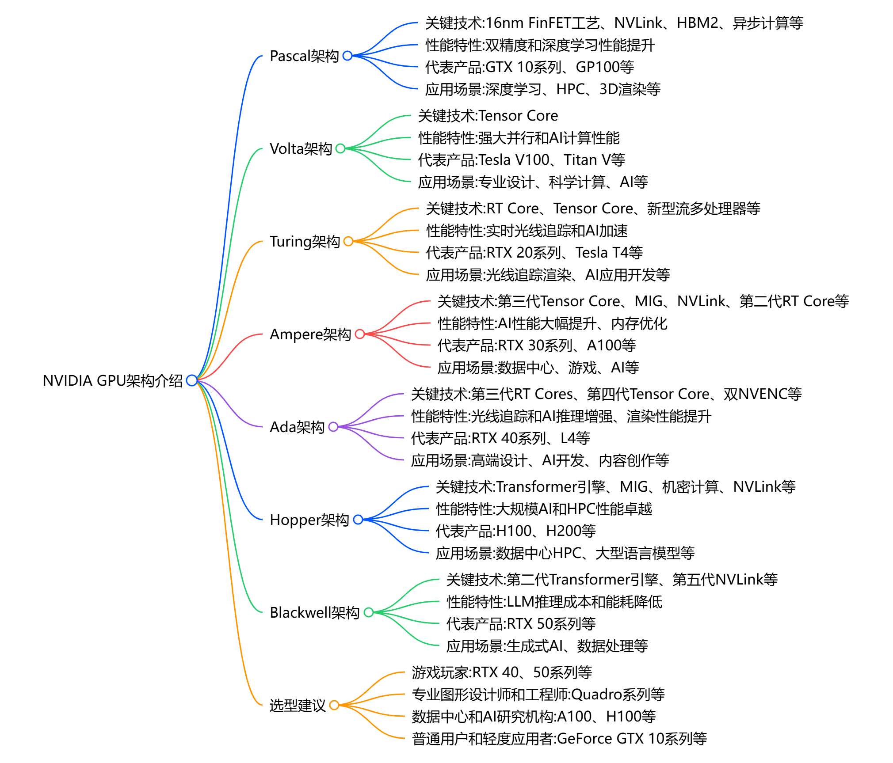

# NVIDIA GPU 架构详解：Pascal、Volta、Turing、Ampere、Ada、Hopper、Blackwell_英伟达架构命名-CSDN博客
[NVIDIA GPU 架构详解：Pascal、Volta、Turing、Ampere、Ada、Hopper、Blackwell_英伟达架构命名-CSDN博客](https://blog.csdn.net/asialee_bird/article/details/145998718) 

 
探模之翼 于 2025-03-03 20:44:50 发布

版权声明：本文为博主原创文章，遵循 [CC 4.0 BY-SA](http://creativecommons.org/licenses/by-sa/4.0/) 版权协议，转载请附上原文出处链接和本声明。

**NVIDIA GPU 架构详解：Pascal、Volta、Turing、Ampere、Ada、Hopper、Blackwell**

*   NVIDIA 的 GPU 架构持续演进，每一代都在计算能力、能效比和专用硬件加速方面取得突破。以下是主流架构的核心特性对比与应用场景分析。

* * *

### 1\. Pascal（帕斯卡）[架构](https://so.csdn.net/so/search?q=%E6%9E%B6%E6%9E%84&spm=1001.2101.3001.7020)（2016）

#### 关键技术

*   **16nm FinFET工艺**：首次采用16nm工艺，显著提升能效比。
*   **GDDR5X/GDDR5显存**：支持高带宽显存，提升数据传输速度。
*   **同步多重投影（SMP）**：优化VR渲染性能，减少重复计算。
*   **NVLink**：支持多GPU高速互联，提升并行计算能力。

#### 性能特性

*   高性能计算和图形渲染能力。
*   能效比显著提升，适合游戏和专业图形工作。
*   支持DirectX 12和Vulkan API。

#### 代表产品

*   **GeForce GTX 10系列**：GTX 1080 Ti、GTX 1070、GTX 1060。
*   **Titan Xp**：高端消费级显卡。
*   **Quadro P系列**：如Quadro P6000，用于专业图形工作站。

#### 应用场景

*   游戏、VR内容创作、专业图形设计、科学计算。

### 2\. Volta（伏特）架构（2017）

#### 关键技术

*   **12nm FinFET工艺**：进一步提升能效比。
*   **Tensor Core**：首次引入专为深度学习设计的Tensor Core，支持混合精度计算。
*   **HBM2显存**：部分型号采用高带宽显存，提升数据吞吐量。
*   **CUDA Core改进**：支持更高效的并行计算。

#### 性能特性

*   强大的AI计算能力，适合深度学习训练和推理。
*   高性能计算（HPC）和科学模拟。
*   支持NVLink 2.0，多GPU互联带宽更高。

#### 代表产品

*   **Titan V**：消费级高端显卡。
*   **Tesla V100**：面向数据中心的AI和HPC计算卡。
*   **Quadro GV100**：专业图形工作站显卡。

#### 应用场景

*   深度学习、AI训练、高性能计算、科学模拟。

### 3.Turing（图灵）架构（2018）

#### 关键技术

*   **12nm FinFET工艺**：继续优化能效比。
*   **RT Core**：首次引入实时光线追踪核心，支持实时光追渲染。
*   **Tensor Core**：继承Volta架构，第二代 Tensor Core（支持 FP16/INT8），支持加速深度学习推理。
*   **GDDR6显存**：带宽提升至 14 Gbps（RTX 2080 Ti 显存带宽 616 GB/s）。
*   **DLSS 1.0**：基于 AI 的超采样技术，提升游戏帧率。

#### 性能特性

*   实时光线追踪和AI驱动的图形渲染，光线追踪性能10 Giga Rays/sec。
*   支持DLSS（深度学习超采样），提升游戏性能。
*   强大的图形和计算性能，FP32 计算能力（RTX 2080 Ti 达 13.4 TFLOPS）。
*   AI 推理：T4 的 INT8 算力 130 TOPS。

#### 代表产品

*   **GeForce RTX 20系列**：RTX 2080 Ti、RTX 2070、RTX 2060。
*   **Titan RTX**：高端消费级显卡。
*   **Quadro RTX系列**：如Quadro RTX 8000，Tesla T4 用于专业图形工作站。

#### 应用场景

*   游戏、实时光追渲染、AI加速、专业图形设计。
*   游戏：实时光追游戏（如《赛博朋克 2077》）
*   边缘计算：T4 用于视频分析、推荐系统
*   专业图形：影视渲染与 3D 设计

* * *

### 4\. Ampere（安培）架构（2020）

#### 关键技术

*   **8nm工艺**：采用更先进的8nm工艺，性能和能效大幅提升。
*   **第二代RT Core**：光线追踪性能提升2倍。
*   **第三代Tensor Core**：支持更多AI计算任务，性能更强，支持 TF32、FP64、稀疏计算（Sparsity）。
*   **GDDR6X显存**：显存带宽进一步提升，带宽达 19 Gbps（RTX 3090 显存带宽 936 GB/s）。
*   **多实例 GPU（MIG）**：A100 可分割为 7 个独立实例。

#### 性能特性

*   **FP32 计算能力**：RTX 3090 达 35.6 TFLOPS，A100 达 19.5 TFLOPS（FP64 9.7 TFLOPS）
*   **光线追踪性能**：RTX 3090 达 28 Giga Rays/sec
*   **AI 训练**：A100 的 FP16 算力 312 TFLOPS

#### 代表产品

*   **GeForce RTX 30系列**：消费级显卡（RTX 3090、RTX 3080、RTX 3070）。
*   **A100 Tensor Core GPU**：面向数据中心的AI和HPC计算卡。
*   **Quadro RTX A系列**：如Quadro RTX A6000，用于专业图形工作站。

#### 应用场景

*   大规模 AI 训练（BERT/GPT-3）
*   科学计算：气候模拟、分子动力学
*   云游戏与虚拟化（MIG 技术支持多租户）

* * *

### 5\. Ada Lovelace（阿达·洛芙莱斯）架构（2022）

#### 关键技术

*   **4nm工艺**：采用更先进的4nm工艺，性能和能效进一步提升。
*   **第三代RT Core**：新增 **Opacity Micromap Engine**，光追效率提升 2 倍。
*   **第四代Tensor Core**：支持更复杂的AI计算任务，支持 FP8 精度，AI 推理效率提升 4 倍。。
*   **DLSS 3**：引入AI驱动的帧生成技术，大幅提升游戏性能。
*   **TSMC 4N 制程**：晶体管密度提升 2 倍，能效比优化。

#### 性能特性

*   **FP32 计算能力**：RTX 4090 达 82.6 TFLOPS
*   **光线追踪性能**：191 Giga Rays/sec
*   **AI 推理**：FP8 算力 1.32 PetaOPS

#### 代表产品

*   **GeForce RTX 40系列**：RTX 4090、RTX 4080、RTX 4070 Ti。
*   **RTX 6000 Ada Generation**：专业图形工作站显卡。

#### 应用场景

*   8K 游戏与 VR
*   实时 3D 内容创作（Unreal Engine 5）
*   生成式 AI（Stable Diffusion 等）

* * *

### 6\. Hopper（赫柏）架构（2022）

#### 关键技术

*   **4nm工艺**：专为数据中心设计，性能和能效进一步提升。
*   **Transformer Engine**：专为AI训练和推理优化，支持大规模模型训练，动态切换 FP8/FP16，专为 LLM（大语言模型）优化。
*   **HBM3显存**：支持高带宽显存，提升数据吞吐量，带宽达 3 TB/s（H100 SXM5）。
*   **第四代 NVLink**（**NVLink 4.0**）：支持多GPU高速互联，互联带宽 900 GB/s（是 A100 的 1.5 倍）。
*   **DPX 指令集**：加速动态规划算法（如基因组学、机器人路径规划）。

#### 性能特性

*   **FP8 计算能力**：H100 达 4 PetaOPS
*   **FP64 计算能力**：34 TFLOPS（科学计算场景）
*   **AI 训练速度**：比 A100 快 6 倍（GPT-3 训练）

#### 代表产品

*   **H100 Tensor Core GPU**：面向数据中心的AI和HPC计算卡。

#### 应用场景

*   超大规模 AI 模型训练（如 GPT-4）
*   量子模拟与核能研究
*   实时大数据分析（金融风控、自动驾驶）

### 7\. Blackwell（布莱克韦尔）架构（2024）

#### 关键技术

*   **3nm工艺**：采用更先进的3nm工艺，性能和能效进一步提升。
*   **第四代RT Core**：光线追踪性能进一步提升。
*   **第五代Tensor Core**：支持更复杂的AI计算任务。
*   **GDDR7显存**：显存带宽进一步提升。

#### 性能特性

*   实时光追和AI计算性能达到新高度。
*   高能效比，适合高性能计算和图形渲染。
*   支持下一代AI和图形技术。

#### 代表产品

*   **GeForce RTX 50系列**：预计将推出基于Blackwell架构的消费级显卡。
*   **B100 Tensor Core GPU**：面向数据中心的AI和HPC计算卡。

#### 应用场景

*   游戏、AI加速、实时光追渲染、专业图形设计。

* * *

### [GPU](https://so.csdn.net/so/search?q=GPU&spm=1001.2101.3001.7020)架构对比分析

| 架构名称 | 关键技术 | 性能特性 | 代表产品 | 应用场景 |
| --- | --- | --- | --- | --- |
| Pascal | CUDA 核心优化、GDDR5X/HBM2 显存、NVLink | 性能与能效提升、支持 VR | GeForce GTX 10 系列、Quadro P 系列、Tesla P 系列 | 游戏、VR 开发、初级 AI |
| Volta | Tensor Core、HBM2 显存、NVLink 2.0 | AI 加速、FP16/INT8 运算优化 | Titan V、Tesla V100 | 深度学习、HPC |
| Turing | RT Core、第二代 Tensor Core、DLSS | 实时光线追踪、混合渲染 | GeForce RTX 20 系列、Quadro RTX 系列、Tesla T4 | 游戏、视觉效果制作、AI 推理 |
| Ampere | 第三代 Tensor Core、第二代 RT Core、MIG、PCIe Gen 4 | 高效 AI 和光线追踪性能、稀疏矩阵运算 | GeForce RTX 30 系列、NVIDIA A 系列、A100 | 游戏、AI 训练和推理、数据中心 |
| Ada | 第四代 Tensor Core、第三代 RT Core、DLSS 3 | 极致光线追踪、高效 AI 加速 | GeForce RTX 40 系列、L40 | 高端游戏、内容创作、AI 推理 |
| Hopper | Transformer Engine、第四代 NVLink、HBM3 显存 | 针对大模型优化、更高互联带宽 | H100 | 大规模 AI、科学计算 |
| Blackwell | 第五代 Tensor Core、第四代 RT Core、新一代显存 | 更强 AI 和光线追踪性能、更高能效比 | GeForce RTX 50 系列（预计）、B 系列（预计）、下一代数据中心 GPU（预计） | 下一代游戏、高级 AI、数据中心 |

* * *

### 选型建议

1.  **游戏玩家**：
    *   预算有限：选择 **Pascal**（GTX 10系列）或 **Turing**（RTX 20系列）。
    *   高性能需求：选择 **Ampere**（RTX 30系列）或 **Ada**（RTX 40系列）。
2.  **AI开发者**：
    *   入门级：选择 **Turing**（RTX 20系列）。
    *   高性能需求：选择 **Ampere**（A100）或 **Hopper**（H100）。
3.  **专业图形设计师和工程师**：
    *   预算有限：对于 3D 建模、渲染、视频编辑等专业图形工作，选择 Quadro P系列专业显卡较为合适。
    *   高性能需求：选择 **Ampere**（Quadro RTX A系列）或 **Ada**（RTX 6000 Ada）。
4.  **数据中心和 AI 研究机构**：
    *   高性能计算：进行大规模 AI 训练和推理、数据分析、高性能计算等任务时，Ampere 架构的 A100、Hopper 架构的 H100 和 H200
    *   未来需求：选择 **Blackwell**（B100）。
5.  **普通用户和轻度应用者**：日常办公、轻度游戏和一般图形处理，GeForce GTX 10 系列（Pascal 架构）或更入门级的显卡即可满足需求。

### NVIDIA GPU脑图

