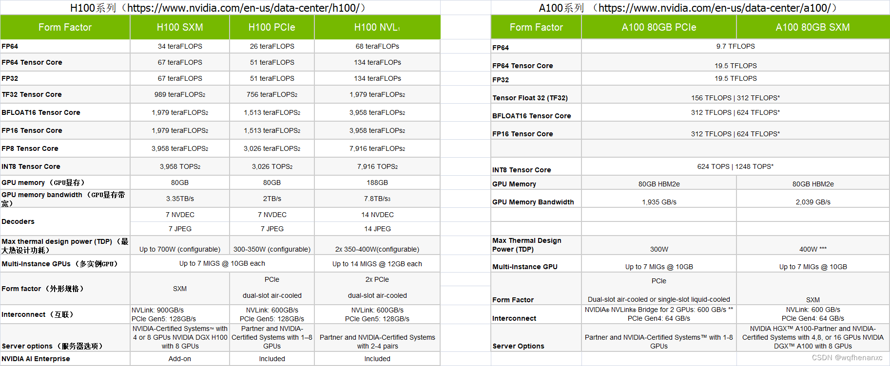

# Nvidia显卡基础概念介绍_pcie sxm-CSDN博客
[Nvidia显卡基础概念介绍_pcie sxm-CSDN博客](https://blog.csdn.net/wqfhenanxc/article/details/133980216) 

 一、PCIe与SXM
----------

### 1.1 Nvidia GPU PCIe

PCIe(peripheral component interconnect express)是一种高速串行计算机扩展总线标准，是[英特尔公司](https://so.csdn.net/so/search?q=%E8%8B%B1%E7%89%B9%E5%B0%94%E5%85%AC%E5%8F%B8&spm=1001.2101.3001.7020)在2001年提出来的，它的出现主要是为了取代AGP接口，优点就是兼容性比较好，数据传输速率高、潜力大。

把PCIe GPU卡插到PCIe插槽上，然后和CPU、同一个服务器上其他的GPU卡进行通信，也可以通过网卡与其他的服务器节点上的设备进行通信，这种就是PCIe的通信方式，但是这种传输速度不快。

如果想要和SXM一样，有很快的传输速度，可以使用NVlink桥接器实现GPU和CPU之间的通信，但是和SXM不一样的地方就是它只能实现2块GPU卡之间的通信。

### 1.2 Nvidia GPU SXM

SXM是英伟达公司设计出来的，它的出现主要是为高性能计算和数据中心提高更强的计算能力和传输速度。

SXM版本的GPU 发布的时候Nvidia配置了标准的HGX平台， 相当于把8张或者4张GPU在HGX平台做成一个模块，按照模块出售， OEM主机制造商相对比较容易的就把HGX一个模块集成到主机箱里面了。当然， 一个模块上的这8张或者4张显卡还是可以独立插拔的。  
PCIe版本的GPU， 发布的时候Nvidia是一张一张独立出售的， OEM主机制造商需要在主机箱设计时候考虑更多的细节，一个机器里面可以随意的插1张、2张、3张、…、最多8张GPU。

SXM版本的显卡功耗更高，机箱的体积、散热的要求都更高。

NvLink和SXM其实说的都是一个东西，只是从不同的角度说的。 NvLink是从互联的角度说的， SXM是从板子上面接口的角度说的。 SXM接口也在不断升级版本。

二、DGX与HGX
---------

Nvidia制造出来显卡之后， 有三种方式出售。

### 2.1 单独的显卡

Nvidia将显卡卖给服务器制造商，然后每个服务器制造商都会为 GPU 构建自己的底板，然后服务器制造商将 GPU 安装到服务器中。  
对于PCIe的GPU来说这个还好做，但是对于SXM的GPU来说就太麻烦了。 所以Nvidia后来将SXM的GPU在卖给服务器制造商之前先标准化一下，加上了NVSwitch 底板，考虑了NVLink、散热、IB连接等各种因素，这就产生了Nvidia HGX平台。

### 2.2 NVIDIA HGX

NVIDIA HGX 是一个计算平台，通过NVLink 和 NVSwitch将多个GPU串连起来，提供强大的AI运算能力。  
有了Nvidia HGX平台，服务器制造商对SXM版的GPU的组装工作就相对简单了一些，他们根据需要给HGX周边配置 RAM、CPU、存储即可。  
HGX 主要面向需要灵活且可扩展的平台来满足高性能计算需求的研究人员和开发人员。适用于云数据中心、高性能计算、大规模人工智能研发、可定制基础设施等应用。

### 2.3 NVIDIA DGX

NVIDIA DGX是基于HGX规范设计的具体产品，是一台预装了NVIDIA GPU和软件堆栈的高性能计算服务器。这些系统被设计为开箱即用的解决方案，专门用于深度学习模型的训练和推理。DGX系统结合了NVIDIA的GPU技术和优化的软件，旨在提供出色的深度学习性能和效率。  
NVIDIA DGX是 AI 超级计算机。硬件方面包含：GPU、CPU、内存、硬盘、散热系统、软件、操作系统等等，也就是说，除了显示器、键盘、鼠标，它全都有。

三、H100与A100系列、PCIe与SXM版本对比
--------------------------

参考资料
----

【1】https://www.bilibili.com/read/cv24855760/ 出处：bilibili  
【2】https://zhuanlan.zhihu.com/p/657075125 出处：知乎  
【3】https://www.nvidia.com/en-us/data-center/h100/ 出处：Nvidia官网  
【3】https://www.nvidia.com/en-us/data-center/a100/ 出处：Nvidia官网