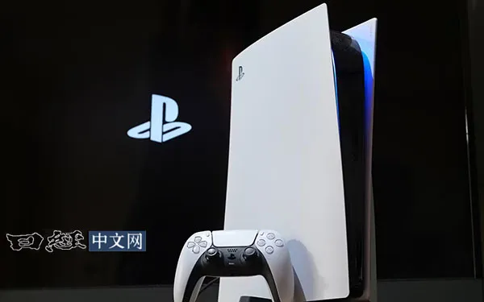
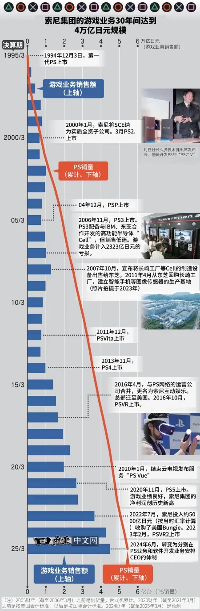
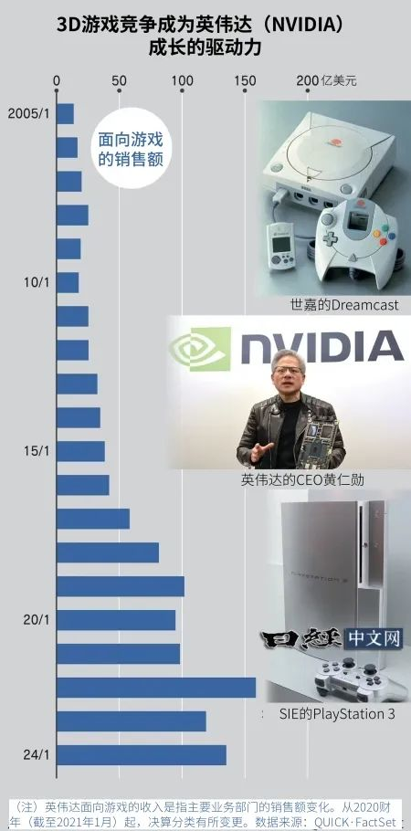
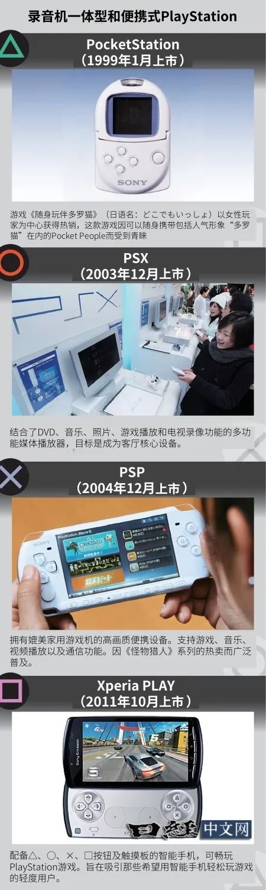

Title: PS30年，没有它或许没有英伟达今天

URL Source: https://mp.weixin.qq.com/s/6tpjgY_kZfjXN9Tu_C-s-Q

Markdown Content:

家用游戏机“PlayStation（PS）”诞生至今已30年。除了游戏之外，PS也让娱乐领域焕然一新。不仅如此，PS还掀起了在3D图形性能上的激烈竞争，后来英伟达开发出了为游戏设计的“GPU”图像处理半导体，这成为如今AI半导体的基础……

索尼电脑娱乐（SCE，现为索尼互动娱乐（SIE））于1994年12月3日上市家用游戏机“PlayStation（PS）”，至今已30年。除了游戏之外，PS也让娱乐领域焕然一新。PS的30年历程是一部活生生的创新与商业教科书。

“想创造出将电脑和娱乐融合在一起的全新品类”，PS的开发始于SCE的领导人、后来被称为“PS之父”的工程师久多良木健所怀揣的这一梦想。第一代PS采用了索尼信息处理研究所拥有的名为“System G”的CG（计算机图形）尖端技术，实现了实时3D的CG绘图。

具有划时代意义的不只是技术。SCE还自己充当批发商，从游戏软件制造商那里采购软件，然后再销售给零售店。构建起了实质上的SCE直销模式。SCE承担起了原本可能对游戏软件公司造成沉重负担的库存调整风险。零售店在无需准备过多库存的同时还可降低为缺货而烦恼的风险。针对任天堂当时构建的游戏批发流通体系，SCE可谓开辟出了新的天地。

与便携式音乐播放器“Walkman”一样成为索尼标志性产品的PS已累计销售5.3亿台以上。游戏业务为索尼集团贡献了30％的合并销售额以及20％的营业利润。

运用音乐领域的经验

“20世纪我们通过Walkman及彩电传递了感动。21世纪将为创造感动做出贡献”，索尼集团会长吉田宪一郎在12月5月的经营方针说明会上表示，将通过支持创作者来谋求发展。索尼的1.2088万亿日元营业利润（2023财年/截至2024年3月）中有70％以上来自娱乐业务以及支撑该业务的技术。

在构建“创作者经济圈”的战略方面，目前美国苹果在全球范围内显示出了存在感，但索尼集团曾先于苹果构建起与创作者齐心协力共同发展的业务模式。

“一起来制作游戏吧！”1995年，为了扩充游戏软件，SCE开始举办类似主题的游戏创作者选拔活动。向合格者提供用于制作游戏软件的工作室、制作费用及生活费等资金以及开发设备等支持。

设计通过选拔来挖掘人才这一方法的是与索尼共同出资成立SCE的索尼音乐娱乐（SME）。音乐公司的“艺术家就是上帝”的想法被移植到了游戏领域。

音乐公司为追求不确定的“爆款”一直在多品种少量生产的行业领域参与激烈的竞争，这种情况下培育出的思维方式刷新了游戏行业的流通结构。“创新来自于边缘”的格言在这里得到了真实的体现。源自PS的知识产权（IP）如今已经超越了游戏的范畴，通过与电影、音乐、动画等结合的“媒体组合（MediaMix）”被推广到全世界。

美国半导体厂商英伟达在人工智能（AI）半导体领域独占鳌头。如果PS没有诞生，3D游戏的竞争没有变的如此激烈的话，或许也不会有英伟达现在的崛起。

SCE、世嘉（SEGA）、任天堂等2000年代在3D图形性能上展开了竞争。后来英伟达开发出了被称为“GPU”的图像处理半导体。

1995年，英伟达为世嘉的家用游戏机“世嘉土星”推出了GPU“NV1”。“PS3”上配备了英伟达与索尼共同开发的GPU。从“PS4”开始则更换成了AMD的产品，但2017年任天堂发布的“任天堂Switch”却采用了英伟达的产品。

专为游戏设计、并行处理多种数据的GPU的特性被认为能够提升AI的性能。虽然英伟达当前的主力业务是AI半导体，但其原点却在游戏机。

接下来的10年

“PS本身就是一种体验，是一个分享感动的平台”，SIE的PS业务CEO西野秀明强调PS指的并不仅仅是游戏机。SIE现在正在构建“PS Plus”等以持续收费为基础的盈利模式。

SIE的2023财年（截至2024年3月）的网络服务收入达5455亿日元，占到游戏业务收入的13%。在游戏公司因有无热门作品而业绩大幅波动的背景下，SIE确保了稳定的收益。

要想增加持续收费的收入，扩大PS的销量必不可少。SIE于11月推出了可以通过AI转换为高质量图像的PS5高端机型“Pro”，吸引更多游戏玩家。

软件方面，SIE注重开发用户在线互动的直播游戏。索尼集团的十时裕树社长认为：“自家开发的直播游戏将成为增加（PS服务）活跃用户的有效手段”。

在过去的30年中，诸如轻松玩的手机游戏崛起等，PS所处的环境发生了巨变。制作Xbox的微软则在扩展也可以在电脑和智能手机上玩的包月（持续收费）服务“Game Pass”。

将PS培育成视频流媒体等娱乐平台的构想遭遇挫折，而云游戏和VR（虚拟现实）也欠缺热度。如今PS5的建议零售价已超过7万日元（中国官方建议零售价人民币2999元起），已经不再像以前那样能轻松出手购买。在接下来的10年里，要想在游戏与娱乐的界限消失的新竞争环境中胜出，重拾创业时颠覆常识的挑战精神将再次变得至关重要。

日本经济新闻（中文版：日经中文网）佐藤谅、铃木卓郎

版权声明：日本经济新闻社版权所有，未经授权不得转载或部分复制，违者必究。  
日经中文网 https://cn.nikkei.com

视频号推荐内容：
