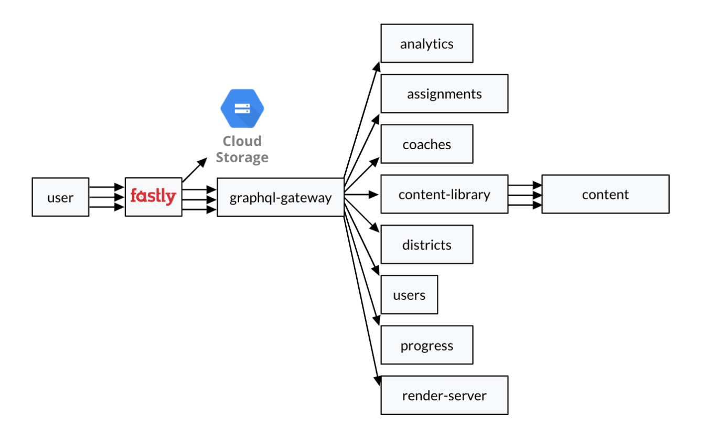
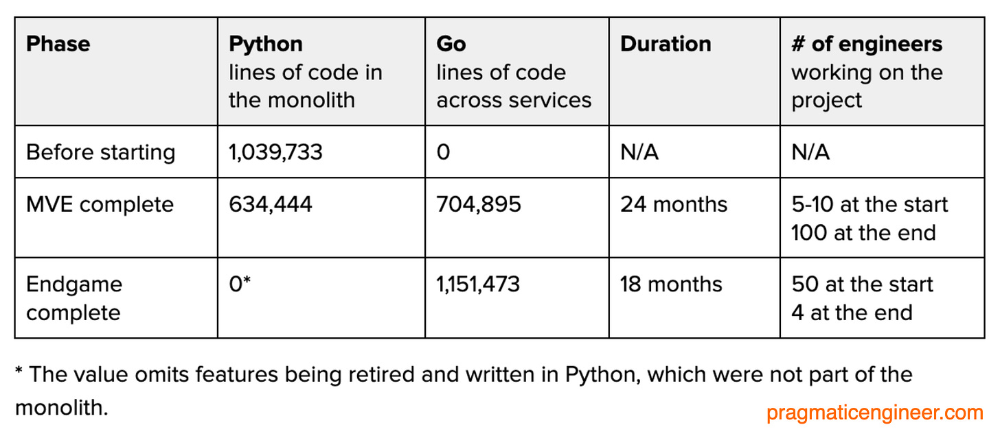
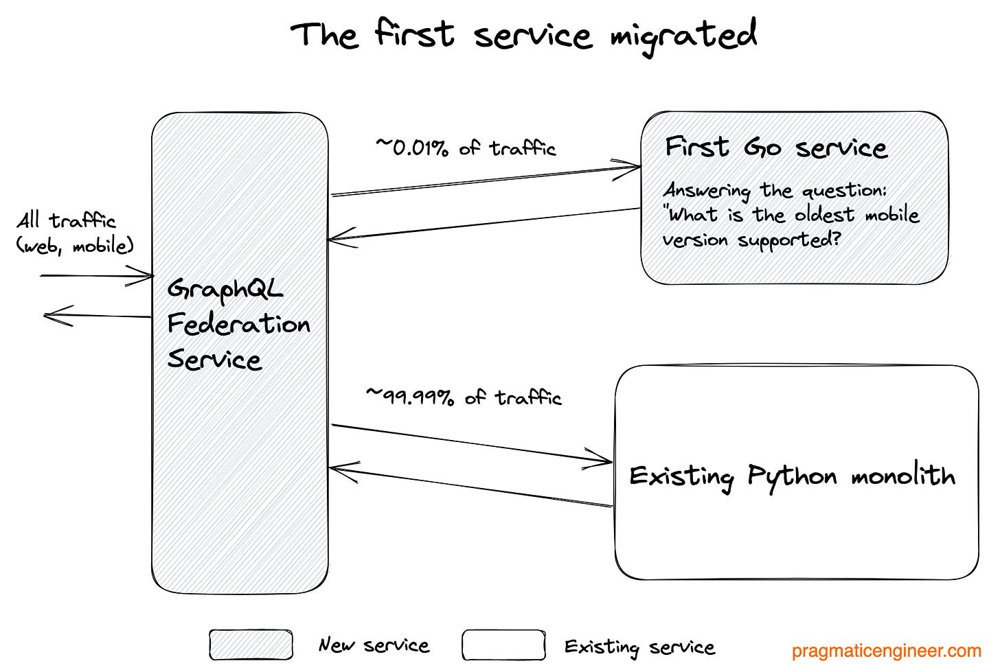
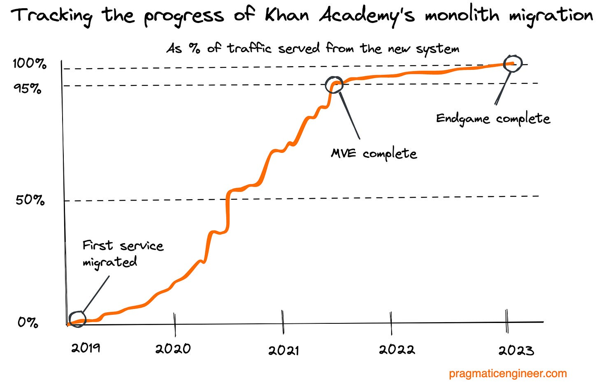
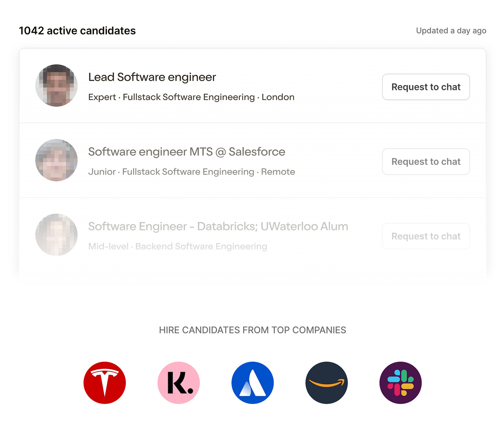

# Real-world Engineering Challenges #8: Breaking up a Monolith
[Real-world Engineering Challenges #8: Breaking up a Monolith](https://newsletter.pragmaticengineer.com/p/real-world-eng-8) 

 _👋 Hi, this is [Gergely](https://twitter.com/gergelyorosz) with a free, full issue of the Pragmatic Engineer Newsletter. In every issue, I cover challenges at Big Tech and high-growth startups through the lens of engineering managers and senior engineers._

_If you’re not a subscriber, here are a few recent issues you missed:_

*   _[What is a Staff+ engineer?](https://newsletter.pragmaticengineer.com/p/what-is-a-staff-engineer)_
    
*   Code deployment freezes: [Part 1](https://newsletter.pragmaticengineer.com/p/code-freezes) and [Part 2](https://newsletter.pragmaticengineer.com/p/code-freezes-part-2).
    
*   [Compensation increases in 2023](https://newsletter.pragmaticengineer.com/p/compensation-increases-2023)
    
*   _[The Scoop: emerging trends across the industry](https://newsletter.pragmaticengineer.com/p/the-scoop-37)_
    

_Subscribe to get two full issues every week. Many subscribers expense this newsletter to their learning and development budget. If you have such a budget, here’s [an email you could send to your manager](https://docs.google.com/document/d/1BTgvFmpxNsJX6m9T6duRfZy4jD4CfcySVqoOGSe343I/edit?usp=sharing).👇_

_**‘Real world engineering challenges’** is a series in which I interpret interesting software engineering and engineering management case studies by tech companies. You might learn something new in these articles, as we dive into the concepts they contain._

In most real-world engineering challenges articles, we look at several interesting case studies from tech companies, but today’s issue is different. We’re covering a single case study, but in more detail than previously in this series.

Specifically, we’re diving into a massive migration project by Khan Academy, involving moving one million lines of Python code and splitting them across more than 40 services, mostly in Go, as part of a migration that took 3.5 years and involved around 100 software engineers. 

Khan Academy has an interesting [engineering blog](https://blog.khanacademy.org/tag/infrastructure/) where I came across several posts with details about how this migration progressed. I got interested in learning more about this journey and so reached out to engineering manager [Brian Genisio](https://www.linkedin.com/in/briangenisio/) and former principal software architect [Kevin Dangoor](https://www.linkedin.com/in/kdangoor/). Both Brian and Kevin played key roles in this migration and they have generously shared their inside takes on how the migration played out.

In today’s issue, we reveal new details about this migration, covering:

1.  **Context and motivation.** Why decide to migrate a very large monolith that is powering a site with heavy traffic? The trigger was the end of Python 2, but there were other reasons, too.
    
2.  **Kickoff and phase.** Additionally, the concept of MVE (minimum viable experience.)
    
3.  **The migration phase**. The migration approach to each of the fields and APIs.
    
4.  **Things that worked well.** Incremental shipping, the side-by-side migration approach, and treating the project as fixed scope, fixed timeline. 
    
5.  **Choices worth reconsidering.** Was Go the best choice? It’s one of the questions the team still thinks about.
    
6.  **Learnings from working on a 3.5 year-long migration.** The extra motivation which hard deadlines provide.
    

_As with all case studies, I write about a given company because I find the topic interesting. I have no financial motivation for this: I don’t get paid, directly or indirectly. In the very rare case when there’s a potential conflict of interest – like being an investor – I always disclose my interest. There is no such conflict here, I strive to be independent in my viewpoints. For more details, see [my ethics statement](https://blog.pragmaticengineer.com/ethics-statement/)._

[Khan Academy](https://www.khanacademy.org/) is a US-based non-profit education provider, which teaches students about math, art, computing and many other topics for free, with videos and interactive learning guides. Courses are aimed at middle school to high school students, and also college students. The site is one of the most popular free education sites, with millions of users.

Khan Academy stands out from many other non-profits not just for its strong funding; for example, grants from the Bill and Melinda Gates Foundation and other philanthropic organizations, but also its strong engineering team. [John Resig](https://twitter.com/jeresig), creator of JQuery, is its chief software architect. 

Back in 2017, an idea to come up with a better architecture started being raised more often within the engineering team. Back then, Khan Academy’s backend consisted of a Python monolith exposing [REST](https://en.wikipedia.org/wiki/Representational_state_transfer) endpoints. It was during that year that the team started experimenting with [GraphQL](https://en.wikipedia.org/wiki/GraphQL) for their API. By the end of 2017, the team realized that GraphQL had many benefits and decided to deprecate the REST interface and migrate existing endpoints to GraphQL.

It was also around then that the team started to feel the pain of maintaining a monolith with Python, whose performance was not great and resulted in more hardware resources being needed to run the monolith.

**Python 2’s end-of-life announcement was the final spur to start the project.** In 2019, Python Software Foundation announced Python 2’s end of life date as January 2020. It was this which kicked off the rewrite project because it meant several goals needed to be achieved:

1.  Get off Python 2 as soon as possible. With Python 2 reaching end of life, delay was not an option.
    
2.  Replace the REST API with GraphQL.
    
3.  Break the Python monolith into services.
    

The rewrite project got underway in June 2019. The team started by choosing which language to move over to; Python 3? Kotlin? Go? They considered all options and settled on Go, largely for its first-class support in the Google App Engine, and the simplicity and consistency of its language and performance. As Kevin Dangoor [summarized](https://blog.khanacademy.org/go-services-one-goliath-project/):

> “Moving to Kotlin was an appealing alternative. While we were at it, we decided to dig deeper into other options. Looking at the languages with first-class support in the Google App Engine, another serious contender appeared: Go. Kotlin is a very expressive language with an impressive set of features. Go, on the other hand, offers simplicity and consistency. The Go team is focused on making a language which helps teams reliably ship software over the long term.
> 
> As individuals writing code, we can iterate faster due to Go’s lightning quick compile times. Also, members of our team have years of experience and muscle memory built around many different editors. Go is better supported than Kotlin by a broad range of editors.
> 
> Finally, we ran a bunch of tests around performance and found that Go and Kotlin (on the Java Virtual Machine) perform similarly, with Kotlin being perhaps a few percent ahead. Go, however, uses a lot less memory, which means that it can scale down to smaller instances.
> 
> We still like Python, but the dramatic performance difference which Go brings us is too big to ignore, and we think we’ll be able to better support a system running on Go over the years. Moving to Go will undeniably be more effort than moving to Python 3, but the performance win alone makes it worth it.”

The scope of the project was very clear from the start. Migrate 100% of Python 2 code to Go, have only GraphQL endpoints, and use GraphQL federation. The biggest task was agreeing on architectural strategies.

The team ended up converging on a federated GraphQL hub. The main difference between a REST-based “API gateway” is that with REST, a request is often directed to a single service. With GraphQL gateways, a query plan is generated that includes data from multiple backend services.

The proposed architecture looked like this, at a high-level:

_A high-level overview of the new architecture at Khan Academy, based on federated GraphQL. The actual number of services is a lot higher at around 40, but the architecture is very similar. Diagram source: [Khan Academy’s engineering blog](https://blog.khanacademy.org/incremental-rewrites-with-graphql/)._

**How do you estimate how long it takes to migrate 1 million lines of code?** I asked Brian, who said they used pretty straightforward heuristics and refined it later.

> “As far as estimates go, we started by estimating the project using heuristics. We estimated the lines of code the average developer would likely port per day. We then used that with the number of lines of Python we had, in order to figure out how much work each service would take.
> 
> This was a good first pass, but when we got started working on APIs in the services, we had to break it down further. Some things were a lot more complex than that heuristic could manage. So the estimates changed when we dissected the work into smaller parts.”

The project was split into two parts:

**Phase 1: Minimum Viable Experience.** It’s common to call the first phase an MVP (Minimum Viable Product,) referring to a barebones but usable milestone. However, the team did not want to call this phase an MVP, because they already had a product. MVE answered the question of what the key features were, which if removed, would materially alter Khan Academy’s identity. The MVE scope was mostly defined by product managers looking at the experience from a product point of view.

These MVE features were things like content publishing, content delivery, progress tracking, user management, and more.

This phase alone took about 2 years to complete, completing in August 2021. At this point, about 95% of traffic was flowing through the new code and 32 services were built.

**Phase 2: endgame.** The second phase was everything else. Although it might have seemed like the project was largely complete, with 95% of traffic going through the new services; in fact there was much to do. On top of rewriting the remainder of the Python monolith still serving traffic, all internal tools needed to be rebuilt from Python to Go, which was a sizable undertaking in itself.

This second phase took another 1.5 years to complete. Part of why it took so long was because Phase 2 was less staffed with engineers than with Phase 1 had been. Also, in this phase, new features were built, as well as existing ones being migrated. In this phase, another 5 new services were created and a few developer-only services were added, bringing the services count to just over 40.

A big part of the endgame phase was adding non-MVE behaviors to existing services.

Here’s some statistics on how each phase went:

The team wanted to avoid a “big bang” migration in which everything is rewritten at once. Instead, they chose a “field by field” approach. As Brian shared:

> “We knew a ‘big bang’ rewrite would be fraught with pain, so we chose the opposite: not at the service level, the feature level, or the model level, but at the field level. Literally, we'd move User.FirstName over to the Go-based User Service while User.LastName was still in the Python Monolith. We did this with GraphQL federation and some side-by-side testing magic which we added to our federation service.”

Before doing any migrating, the team needed to build basic infrastructure for the new service. This meant putting the GraphQL federation service in place.

The first migrated service was the simplest; a service hosting a single field. This service was one which answered the question of what was the oldest version of the mobile client that could be supported. When this first service migration was complete, the GraphQL federation service was built, and one Go service was built which served real – if very low – levels of traffic, while the majority of traffic flowed through the existing monolith.

_Khan Academy’s system after migrating the first and smallest service_

**The migration strategy** applied a similar side-by-side testing approach to all services.

*   Step 1: optional shadowing of traffic on the new Go service. The Python result is returned. The Go service only gets the request if developers set a parameter to also direct traffic to their new service. If no parameter was set, then no traffic was sent to the new service. Playing with this parameter allowed engineers to test the new service as they built it, without any risks to the production system.
    
*   Step 2: side-by-side testing of GraphQL services. Both the Python and Go services are called and any differences in responses logged, and the Python service’s result is returned.
    
*   Step 2.5: canary. A configurable percentage of traffic starts to return responses from the Go service, while still in a side-by-side testing phase. While side-by-side testing can be used for GraphQL queries (fetching data); for GraphQL mutations (modifying server-side data,) it is not a good option. It was GraphQL mutation use cases when a canary was used. Learn more about [GraphQL queries vs mutations](https://graphql.org/learn/queries/).
    
*   Step 3: migration. Only the Go service gets the traffic, but the Python service is still present, in case it needs to return as the primary.
    
*   Step 4: remove the Python code and service. Migration complete!
    

**The automated testing approach was interesting.** With any big rewrite and migration, having a robust automated tests suite can be an additional safety net. At the same time, porting over the unit or integration test suite can also be lots of work. So how did Khan Academy proceed? Brian explains:

> “Our unit test coverage in Python varied: some areas were well-covered, while others were not. When it made sense, we ported over our Python tests to Go, and used them to build out the Go behavior. That worked well for simple, stateless functions. But in reality, most of the code was structured differently in Go, so the python tests didn't help too much.
> 
> We wrote a LOT of tests in Go, however. Our test coverage is much better today because of it. We also took a more “behavioral” approach to testing. We wanted the APIs to be ported identically. In doing so, we knew that for any input in the Python and Go code, we'd want the Go code to be exactly the same as the Python implementation. This is where "side-by-side" testing came in as part of the migration.”

**The fact the migration took a long time was tough on the team.** I’ve experienced first-hand how draining year-long migrations can be, so I asked Brian how he and the team handled their migration, in which just the first phase took more than two years. Brian was candid. He shared that it was rough:

> “Most people who come to work at a non-profit like Khan Academy do so for the mission, not for the technology. People want to push forward our feature sets, expose more content to our learners/teachers. The technology tends to be second.
> 
> Engineers saw this migration as an existential imperative that they could contribute to, so this viewpoint helped. We also had some REALLY interesting technical problems to solve during the migration and these challenges resonated with many of them. However, each and every one of us were ready to finish the migration after it had been going on for 3.5 years.
> 
> Such a long migration was more challenging to stomach from the wider organization's perspective. There were big time frames during this project during which engineering did not build any new features because the migration took up all our time! On one end, this gave product managers and designers time to make plans for what features we’d build in a post-Goliath Khan Academy. Still, during the migration, both Product and Design faced a lot of pushback from engineering, and unfortunately we saw a lot of attrition in these functions, perhaps also as a result of less progress in building new things during this time.
> 
> By the end of the project, all of us: engineering, product, design and the rest of the business, just wanted the migration to be over so we could move into the post-Goliath world. Now finally we’ve arrived and the renewed sense of energy and excitement is very clear. We did it, and we’re ready to get back to building!”

**The engineering team warmed to Go during the project.** Khan Academy started the rewrite with around 5-10 engineers. As the MVE phase progressed, more engineers joined in and at the end of the MVE phase, the whole engineering organization of about 100 people worked on it. For the endgame, the project started with around 50 engineers and gradually ramped down to 4 engineers in the final days of the project. 

Before the rewrite, few engineers had used Go in production, so it was interesting to hear the team’s impressions of it. Kevin Dangoor collected learnings two years into the project, after half a million lines had been migrated. He [shared these learnings in a blog post](https://blog.khanacademy.org/half-a-million-lines-of-go/):

*   _Engineers liked Go. Some liked the ease of reading and writing, others praised the documentation, while the tooling and compiler speed all scored points with the team. A software engineer who came from the .NET world initially found it strange that Go doesn’t do exception-like error handling. Later, this engineer said of the fact that [Go’s errors are values](https://go.dev/blog/errors-are-values): “Being able to call a function that doesn’t return an error and know for sure that it must succeed, is really nice.”_
    
*   _Performance was excellent._ Compared to Python, Go’s runtime performance was much faster. Talking with the team, I’m told they compared the service hour cost of operating the same code on Python and Go. The difference was an order of magnitude in favor of Go, which was up to x10 cheaper for certain types of requests.
    
*   _The lack of generics was the biggest complaint. [Generics](https://en.wikipedia.org/wiki/Generic_programming) refers to the ability to write a function that could work with a variety of data types and have the compiler automatically create versions for more specific types at compile time. This is a language feature that’s widespread in many modern languages like TypeScript, Java, C#, Python and Swift, which all support generics at some level. After years of planning, Go added generics in March 2022, in Go version 1.18. Google App Engine only added support for this version of Go in December last year, so the team has not yet embraced this feature, but will do soon!_
    

**Keep shipping incrementally.** Kevin thought that setting the rhythm of shipping to be incremental but continuous was the difference between success and failure. The team very quickly shipped their first migrated service – even though it was a tiny one! – and then kept up the pace of always shipping and always migrating as well.

Kevin wrote about how taking small steps was harder at first but became easier as the project progressed:

> “At the beginning of the project, we stressed the importance of working on small slices as much as possible. In those days, this was tricky because the goal might be to switch over one GraphQL field, but that field might depend on a variety of other machinery running inside the monolith. As time progressed, more of the other required parts had been ported, making further porting for the same service smoother.”

**One service to “own” a piece of data.** Kevin shared an early decision they took which made the migration much clearer: only one service would “own” a piece of data. 

The team put a firm rule in place that only one service could write a given piece of data. All other services had to call this “owner” service via the API in order to make changes to the data. Kevin suggested that without this rule, figuring out how and why data changes happened would have been extremely difficult.

**The side-by-side migration approach worked extremely well.** When I asked Brian for an approach he’d use again for similar migrations, he selected the side-by-side migration approach as one. This was because the project felt like re-building an airplane while in mid-air.

With the side-by-side approach in place, the team got to scrutinize the differences and problems that showed up across thousands of individual fields. They got a very real sense of progress by inspecting the level of traffic their services received. Day by day, this traffic grew from 0% up to 100%.

One benefit of a side-by-side migration is that you can track the percentage of traffic served from the new system. Above is a rough illustration of the migration’s progress, as pieced together from talking with Brian and Kevin.

**Treating this migration as a fixed scope, fixed timeline project was the right choice, in hindsight.** When talking about the project management approach, Brian revealed something that initially surprised me: they did not follow an “agile” approach on this project like as usual:

> “Although I have been a proponent of agile development practices for most of my career, we mostly treated this project migration as a waterfall one. The only "agile" bits had to do with borderless engineering, and how we prioritized the work. “Borderless engineering” is what we call the practice of individuals floating from team to team for short periods of time – a few days to a few months – to help out on work when it’s the sensible thing to do.
> 
> The migration was a fixed-scope, fixed-timeline project. We had a massive burndown chart that always gave us a good understanding of how we were doing. When a team fell behind, we moved engineers around. In the end, we finished 4 days before our fixed deadline (January 31, 2023.)
> 
> Looking back, treating this type of work as a fixed scope, fixed timeline project was exactly what we needed.”

My initial surprise derived from my experience of treating most projects as “agile”: build something quickly, get feedback, then reassess your plan and build whatever makes the most sense. This agile approach works well when you’re innovating or discovering a problem space. However, with this migration the problem space was a given and the scope of the work was well understood. So, it’s no wonder that sticking to the original plan worked well.

I asked both Brian and Kevin which choices they might reconsider with the benefit of hindsight.

**Switching to a brand-new language for the rewrite.** Brian ran me through his reflections:

> “Was switching to Go worth it in the end? Go is demonstrably faster than Python, therefore it is cheaper to run, which affects our bottom line. 
> 
> However, don’t forget that nobody on the team knew Go in-depth when we started this project. So we had approximately 100 developers who all needed to ramp up on the technology. And, sure enough, we made mistakes along the way and those mistakes slowed us down.
> 
> Here’s something I don’t yet know: how long it will take for us to “reclaim” the cost of the ramp-up to Go: the time the team spent mastering this technology versus cheaper cloud costs. In hindsight, I would likely do an analysis of this tradeoff. Looking back, there is a possibility that Python 3 would have been more prudent for getting the project done, faster.”

**The team played loose with the “port things exactly as they are” approach when it came to internal tools.** Brian says:

> “We also had a general rule for this project: we move the behavior over exactly. If there's a bug in the python code, we port the bug (most times.)
> 
> However, for our internal tools, we were looser with this rule. Instead of porting these tools one-on-one from Python to Go, we wrote new tools. This meant we couldn't easily use the side-by-side system. Building these new tools likely slowed us down compared to porting them. I'd revisit that as well.”

I’m glad Brian shared these learnings, as neither are ones that we engineers talk about much, even though we should. The reality of moving to a new language is that there will be a lot of time _wasted_ on learning the new technology and on mistakes.

However, looking at the other side of the coin; this is time _invested_ in engineers learning a new and interesting technology, and it’s motivating to work at places which support such investment. Also, companies that budget for engineers to invest in learning and using modern tools tend to have an easier time recruiting curious devs.

The same goes for internal tools. Sure, the prudent approach would have been to port the tools one-on-one. It would have been faster because little thinking is required.

But then again, what is the point of porting internal tools if they won’t be improved upon? This is just speculation, but it’s probable the migration was “dry” enough for engineers to channel their creativity and desire to play around with Go into internal tools, like many engineers do.

Both the decision on whether to change languages, and whether to stick strictly to the scope for developer tooling, are common challenges on many projects. The project might have been completed faster by being stricter about technology choices and sticking to the original scope (even with internal tools.) However, such strictness could have harmed the company’s engineering culture. 

Would a stricter approach have resulted in a less fun and interesting place to work, and perhaps higher engineering attrition? These is a question I can’t answer, but as an engineering leader it’s worth considering, alongside the budget and timeline of a project.

Kevin Dangoor was part of the leadership team for the vast majority of the rewrite. Responding to my question about his learnings from it, he shared a few things.

**Defining the “minimum viable experience” paid off handsomely.** Even though there was no “minimum viable product” to discuss, defining what a “minimum” port looked like helped the team to focus and prioritize the right things.

**Doing “as direct a port as possible” meant estimates slipped very little.** At the kickoff of the project in summer 2019, the team estimated the MVE phase would take about 2 years, based on the number of fields to port and lines of code to move. In August 2021, the team completed the MVE, almost exactly as per their original estimate two years previously.

If you build software, you’ll know it’s hard enough to estimate for even a month ahead, so accurately doing this on a timescale of years was an impressive feat. Kevin said he thinks the estimate was accurate because they tried to do as direct a port as possible for the new system, not expanding its scope.

**A project that “only” goes from monolith to microservices would likely have less complexity.** Kevin said he thinks their migration added complexity in several ways:

*   Changing languages from Python to Go. For instance, this meant Python libraries could not be used in Go, so the team needed to find the best replacements they could.
    
*   Moving to new versions of Google Cloud APIs. The Google Cloud APIs evolved shortly before the migration started, and so moving to the newer Google Cloud APIs were part of it.
    
*   Moving to services meant splitting control of the data. In a monolith, all data was in one place. With lots of services, workflows became more complex and data flows changed.
    

**A sense of dedication to finish the work and feeling pride when it was done.** Kevin has been in the tech industry for 20+ years, at places like Mozilla, Adobe, and currently GitHub. Nonetheless, when I asked him how he feels about this project, he shared:

> “The migration was a huge undertaking. I’m proud of having had a part to play in it. It was unlike anything I worked in my career, so far. Of course, I worked with great engineers and seeing their dedication to this project was very important.”

Brian took over leading Part 2 of the project, the Endgame phase. I asked him about his learnings. Here’s what he shared.

**Hard deadlines can be motivational.** Brian was working on the migration project at first as a software engineer. For the final phase, he took on the role of managing and coordinating the whole project. He shared an interesting observation about hard deadlines:

> “It’s interesting to see how a hard deadline can be both motivating, and help people to organize around it. Our directive was clear: we will not slip in completing the migration by our date. If we need extra people, we'll get extra people.
> 
> Coordinating all the teams to get to that deadline was complicated; if they all finished their work by the deadline, the org wouldn't make the deadline because so many teams would be blocked by other teams. Having a hard deadline forced us to align in creative ways to ensure a ‘critical path.’ To make sure we finished in time, we had mini-deadlines for the last 6 months of the project. If X didn't happen by Y date, the project was at risk.”

**Just because you have services, you cannot ignore the broader ecosystem.** Another learning comes from Brian, that just because you move to services, you aren’t free to ignore the “monolith” or how the services work holistically. If you take a few steps back, the collection of services also appears as a “monolith,” although a loosely coupled one.

However, these services use shared resources. For example, if one service makes heavy use of Redis, other services that use Redis will be affected unless multiple instances of Redis are created to mitigate this, which is what Khan Academy ended up doing. Caching of data between co-dependent services can cause [thundering herds](https://en.wikipedia.org/wiki/Thundering_herd_problem) when caches expire. "Smarter" cache expiry is necessary to maintain a system that can truly scale.

Many thanks to [Brian](https://www.linkedin.com/in/briangenisio/) and [Kevin](https://www.linkedin.com/in/kdangoor/) for candidly sharing their experience of a long and challenging migration. They’ve each been generous in giving their observations and I recommend following them on LinkedIn. _In a comment below, Brian mentioned how [Khan Academy is hiring](https://www.khanacademy.org/careers) for those who are interested in joining the company after this migration._

I’ve read plenty of engineering blog posts on teams celebrating the hitting of a milestone in a migration, or announcing a migration is done, which often are triumphant in tone. However, having been close to a multi-year migration at Uber, my experience is these projects certainly don’t feel like triumphs while they’re taking place!

**Long-running migrations often feel thankless, never-ending and frustrating.** Both Brian and Kevin were good sports in sharing the positives and I appreciate Brian being candid about _how_ rough the project felt at times; not just for the engineering team, but also for product and design.

Even though Khan Academy has what feels like a strong engineering culture, Brian mentioned that people at the company “want to push forward our feature sets, expose more content to our learners/teachers; the technology tends to be second.”

In any company where most engineers are builders, migrations will feel like a drag. However, the more a company builds and the bigger it grows, so the need arises to migrate over to new systems. Although counter-intuitive, I suggest that to be a great product engineer, it’s worth familiarizing yourself on how to do migrations, so you can do them more efficiently and reliably. 

Additionally, there’s fewer better ways to learn this than by working on and helping out with challenging migrations.

I hope this deep dive has painted a realistic picture of what a complex, multi-year migration looks like, and offer approaches that are useful, should you embark on a similarly challenging project.

This case study has touched on several concepts we’ve covered in-depth before. You might find the articles below relevant for further learning.

*   [Migrations done well](https://newsletter.pragmaticengineer.com/p/migrations). This deep dive covers the approach the Khan Academy team ended up choosing, as well as a host of other considerations.
    
*   [Real-world engineering challenges: migrations.](https://newsletter.pragmaticengineer.com/p/real-world-engineering-challenges) A case study of 6 migrations, most involving data migrations.
    
*   [Real-world engineering challenges: choosing technologies](https://newsletter.pragmaticengineer.com/p/real-world-engineering-challenges-55d). Four examples of how companies decided which new technology to use.
    
*   Tangentially related, [Consolidating technologies](https://newsletter.pragmaticengineer.com/p/consolidating-technologies). What do you do when you have several technologies in use at a company? How do you cut this down? At the Khan Academy, they avoided the problem by not even keeping two programming languages on the backend.
    

The engineering team at Khan Academy documented their progress as they went; it was how I discovered their story. In this article we’ve summarized the migration, the articles below go into more depth than I have written about, on several topics. Check them out:

*   [The Goliath rewrite: kickoff](https://blog.khanacademy.org/go-services-one-goliath-project/) by Kevin Dangoor (Dec 2019.) A summary of why to do the rewrite, and the approach the team chose.
    
*   [Migrating to Go services: step by step](https://blog.khanacademy.org/incremental-rewrites-with-graphql/) by Kevin Dangoor (2020.) A summary of the steps taken to move from the Python monolith and REST services, to the Go services and GraphQL.
    
*   [Reflecting on two years of Go](https://blog.khanacademy.org/half-a-million-lines-of-go/) by Kevin Dangoor (2021.) As the migration of moving half a million of lines of Go finished, the team reflected on progress.
    
*   [Engineering learnings midway through the project](https://blog.khanacademy.org/technical-choices-behind-a-successful-rewrite-project/) by Kevin Dangoor (2021.) Thoughts on prioritizing, tooling and incremental rewrites.
    
*   [Reaching the MVE milestone](https://blog.khanacademy.org/beating-the-odds-khan-academys-successful-monolith%e2%86%92services-rewrite/) by Marta Kosarchyn (2021.) Reflecting on the project when ~95% of the traffic was migrated to the new services, and the MVE phase completed. This was 2 years into the 3.5 year-long project.
    

1.  [Founding Engineer, Front End and API](https://pragmatic-engineer.pallet.com/jobs/8ce9f426-1323-4da4-93b6-8e089a7674e7) at Causal. **$175-225K** + equity. Boston.
    
2.  [Software Engineer - Service Mesh & Networking](https://pragmatic-engineer.pallet.com/jobs/6f867847-1640-468d-887d-801cac7839d1) at Koyeb. **€75-105K** + equity. Remote (EU).
    
3.  [Software Engineer - Infrastructure & SRE](https://pragmatic-engineer.pallet.com/jobs/4d5adfdb-9633-43cd-bce2-794751ddef19) at Koyeb. **€71-105K** + equity. Remote (Global).
    
4.  [Senior Software Engineer](https://pragmatic-engineer.pallet.com/jobs/46f63163-1fd2-4cbf-9f8d-9fb9cd15e2fb) at Portchain. Coppenhagen or Remote (EU).
    
5.  [Engineering Team Lead](https://pragmatic-engineer.pallet.com/jobs/86ba267b-fb57-4381-8df3-627d65ca3eea) at Portchain. Coppenhagen or Remote (EU).
    
6.  [Security Lead](https://pragmatic-engineer.pallet.com/jobs/36918cfe-c66a-4150-8f6b-2ffda7cb7bcb) at Conjecture. **£85-210K**. London.
    
7.  [Senior Software Engineer](https://pragmatic-engineer.pallet.com/jobs/70971a38-1888-4372-830e-a9ee1da1b6fc) at Consensus. Boston, MA or Remote (US).
    
8.  [Senior Frontend Engineer](https://pragmatic-engineer.pallet.com/jobs/cbde1b5c-b402-4b3d-b973-dafa086adcef) at Plain. **£75-110K**. Remote (Europe / 2 hours within GMT).
    
9.  [Lead iOS Engineer](https://pragmatic-engineer.pallet.com/jobs/ca11f2d5-c0a1-4c58-a09a-58ad81ca8c17) at Polarsteps. Amsterdam or the Netherlands.
    
10.  [Distributed Systems Staff Engineer](https://pragmatic-engineer.pallet.com/jobs/82ce46c2-ab1b-4191-9e0b-0cd3468c977e) at Reframe Technologies. Remote (Global).
    
11.  [Senior Software Engineer](https://pragmatic-engineer.pallet.com/jobs/d466aa9a-f383-4906-8e8a-b66ea7a2df2a) at Karat Financial. **$160-225K**. Remote (US time zones).
    
12.  [Senior Backend Engineer - Ruby](https://pragmatic-engineer.pallet.com/jobs/4557e9e7-89d3-42ad-a9d0-eae5717c9497) at Rise Calendar. **€80-120K** + equity. Remote (Europe). [I'm an investor.](https://blog.pragmaticengineer.com/investing)
    
13.  [Senior DevOps Engineer](https://pragmatic-engineer.pallet.com/jobs/92ebbb09-bc98-49b1-8ca8-a280434c490a) at Droit. **$170-205K**. New York.
    
14.  [Senior DevOps Engineer](https://pragmatic-engineer.pallet.com/jobs/227a06a0-801c-4bd9-a6c1-03b7f82e384c) at Droit. London.
    

_See more senior engineer and leadership roles with great engineering cultures on [The Pragmatic Engineer Job board](https://pallet.xyz/list/pragmatic-engineer/jobs) - or post your own._

If you’re hiring, join [The Pragmatic Engineer Talent Collective](https://pragmatic-engineer.pallet.com/talent) to start getting regular drops of outstanding software engineers and engineering leaders who are open to new opportunities. It’s a great place to hire developers - from backend, through fullstack to mobile - and engineering leaders.

If you’re open for a new opportunity, join to get reachouts from vetted companies. You can join anonymously and leave anytime

[Apply Now](https://pragmatic-engineer.pallet.com/talent)