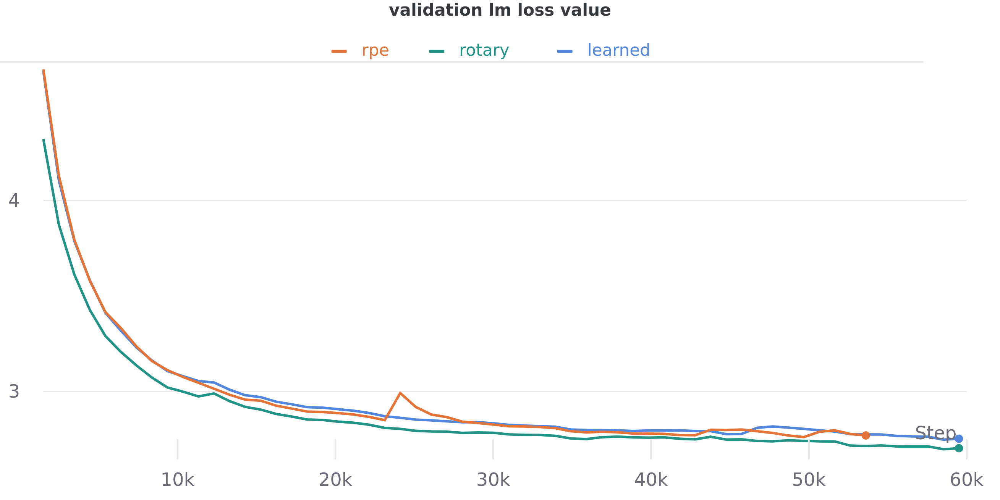
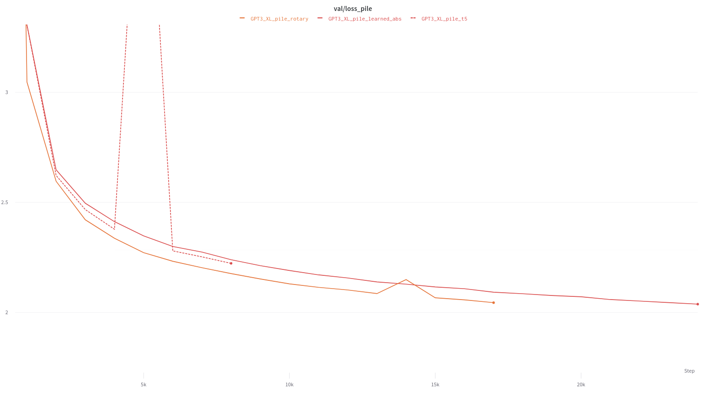
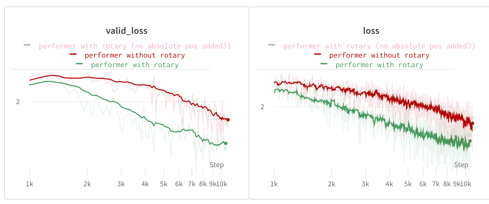

# Rotary Embeddings: A Relative Revolution | EleutherAI Blog
[Rotary Embeddings: A Relative Revolution | EleutherAI Blog](https://blog.eleuther.ai/rotary-embeddings/) 

 TL;DR:
------

Rotary Positional Embedding (RoPE) is a new type of position encoding that unifies absolute and relative approaches. Developed by Jianlin Su in a series of blog posts earlier this year \[12, 13\] and in a new preprint \[14\], it has already garnered widespread interest in some Chinese NLP circles. This post walks through the method as we understand it, with the goal of bringing it to the attention of the wider academic community. In general we have found that across a large suite of setups including regular, linear, and local self-attention, it **either matches or surpasses all other methods currently available for injecting positional information into transformers.**

What's the Problem?
-------------------

Since Vaswani et al., 2017 \[16\] there have been many schemes introduced for encoding positional information in transformers. When applying self-attention to a given domain, the choice of position encoding typically involves tradeoffs between simplicity, flexibility, and efficiency. For example, learned absolute positional encoding is very simple, but may not generalize and are not always particularly meaningful due to the common practices \[1, 3, 9, 15\] of packing short sentences and phrases together in a single context and breaking up sentences across contexts.

Another major limitation of existing methods is that they do not work with efficient transformers. Methods like T5's relative positional bias \[10\] require constructing the full attention matrix between positions, which is not possible when using many of the efficient alternatives to softmax attention, including kernelized variants like FAVOR+ \[2\].

A principled, easy to implement, and generally-applicable method for relative position encoding---one that works for both vanilla and “efficient” attention---is of great interest. Rotary Positional Embedding (RoPE) is designed to address this need.

What's the Solution?
--------------------

In this section we introduce and derive the rotary positional embedding. We begin with discussing the intuition, before presenting a full derivation.

### Intuition

We would like to find a positional encoding function for an item and its position such that, for two items and at positions and , the inner product between and is sensitive only to the values of , , and their relative position . This is related in spirit to the kernel trick: we are searching for a feature map such that its kernel has certain properties. A key piece of information is the geometric definition of the dot product between Euclidean vectors:

In plain English, the dot product between two vectors is a function of the magnitude of individual vectors and the angle between them. With this in mind, the intuition behind RoPE is that we can represent the token embeddings as complex numbers and their positions as pure rotations that we apply to them. If we shift both the query and key by the same amount, changing absolute position but not relative position, this will lead both representations to be additionally rotated in the same manner---as we will see in the derivation---thus the angle between them will remain unchanged and thus the dot product will also remain unchanged. By exploiting the nature of rotations, the dot product used in self-attention will have the property we are looking for, preserving relative positional information while discarding absolute position.

The following is an example illustrating the core idea of RoPE—a more rigorous derivation is presented in a subsequent section. Some arbitrary is chosen, where is the maximum sequence length. When viewed elementwise on and , with as the element index, RoPE can be viewed as follows:

### Visual Intuition

A quarter-waveplate can change the polarization of an electromagnetic wave. (This figure is interactive, try dragging the cube!)

To see how relative position might be preserved in this transformation, we can look to an analogous situation in classical electrodynamics.

We imagine a linearly polarized electromagnetic wave that is sent through a quarter-wave plate at an angle of 45 degrees. This takes the incoming wave and shifts its phase on only one principal dimension as it travels. When the wave emerges from the waveplate, the polarization is no longer linear---it has become circular through a shift equal to quarter of a period.

As the wave travels through the waveplate, we can see how the magnitude of the wave is preserved. We can also better see how the relative position may be encoded as the angle between subsequent timesteps: the angle between timesteps, and therefore distance along the axis of travel, is constant. This means the positional information must be orthogonal to the amplitude in the modulated wave.

### Derivation

We begin with absolute positional information: for each token, we know where it is in the sequence. However, dot products (and therefore attention) do not preserve absolute positional information, so if we encode that positional information in the absolute position of the embeddings, we will lose a significant amount of information. On the other hand, dot products do preserve relative position, so if we can encode the absolute positional information into the token embeddings in a way that only leverages relative positional information, that will be preserved by the attention function.

While it is common in machine learning to restrict our attention to the real numbers, for rotary embeddings it is mathematically more convenient to use the complex numbers as the base field for our space. Instead of working in the usual , we will work in by considering consecutive pairs of elements of the query and key vectors to be a single complex number. Specifically, instead of viewing as a -dimensional real vector we view it as . As we will see, casting it in this fashion will make discussing the rotary embeddings easier. If is odd, we can pad it with a dummy coordinate to ensure things line up correctly. Alternatively, we can simply increase by one.

Let and be query and key vectors respectively and let and be the absolute positions of the corresponding tokens. Let be the function that takes the token embedding in position and outputs a new embedding that contains (in some fashion) the relative positional information. Our goal is to find a "nice" function that does this. Once the positional information is encoded, we need to compute the inner product like so:

where now represents the pre-softmax logit of the usual attention equation. Writing these three functions in exponential form gives

Computing the inner product and equating corresponding components yields

Substituting and applying the initial condition gives

As the prior equation is valid for all , it means that is independent of the value of , so we can set . Similarly, if we denote we obtain which implies that for all . This allows us to decompose as . Examining the case of reveals that

Since the right-hand side does not depend on , the left hand side must not either and so is an arithmetic progression. Setting the initial values and , we have .

Putting all of these pieces together, we get the final formula for the rotary positional embedding:

and likewise for . Since computers tend to like real numbers and matrices more than complex numbers, its convenient to convert this expression into the matrix equation

where , is the block diagonal rotation matrix, is the learned query weights, and is the embedding of the token. Again, we also have the corresponding equation for .

### Extension to multiple dimensions

With relative ease RoPE can be extended into the multidimensional case. To represent two dimensions, two independent 1-dimensional rotary embeddings can be used. To implement this, we can split each of and in half and apply rotary piece-wise as follows:

This formulation can also be further extended to data of an arbitrary number of dimensions. This sort of multi-dimensional relative coding would let us, for example, implement relative timing and relative pitch embeddings similar to Music Transformer \[4\] in a drastically simpler manner. More generally, we believe there is potentially a large class of invariances that first-principles positional codes like RoPE may enable us to capture.

### How is this different from the sinusoidal embeddings used in "Attention is All You Need"?

A response many of us at EleutherAI had when first coming across this was "how does this differ from sinusoidal embeddings," so we feel it is worth discussing this comparison. There are two ways that rotary embeddings are different from sinusoidal embeddings:

1.  Sinusoidal embeddings apply to each coordinate individually, while rotary embeddings mix pairs of coordinates
2.  Sinusoidal embeddings add a or term, while rotary embeddings use a multiplicative factor.

Okay, what About in Practice?
-----------------------------

After reading Jianlin Su's original blog posts \[12, 13\], we were curious how well such a first-principles approach to positional encoding would stack up against existing methods. Despite a tremendous number of papers that have come out claiming to improve the transformer architecture, very few approaches generalize well across codebases and tasks. However, we have found that rotary positional embeddings perform as well or better than other positional techniques in every architecture we have tried.

### Implementation

A naive implementation of rotary positional embeddings would use the block diagonal matrix form shown earlier. In practice, implementing rotary positional embeddings this way is highly inefficient, and more optimized forms are readily available. The original implementations of RoPE are available in [roformer](https://github.com/ZhuiyiTechnology/roformer) and [bert4keras](https://github.com/bojone/bert4keras).

Additionally, we have implemented rotary positional embeddings in [x-transformers](https://github.com/lucidrains/x-transformers), [GPT-Neo](https://github.com/EleutherAI/gpt-neo), [GPT-NeoX](https://github.com/EleutherAI/gpt-neox), and [Mesh Transformer JAX](https://github.com/kingoflolz/mesh-transformer-jax). Below are implimentations for PyTorch and JAX pulled from these codebases.

GPT-NeoX (PyTorch)

```python
import torch


class Rotary(torch.nn.Module):
    def __init__(self, dim, base=10000):
        super().__init__()
        inv_freq = 1.0 / (base ** (torch.arange(0, dim, 2).float() / dim))
        self.register_buffer("inv_freq", inv_freq)
        self.seq_len_cached = None
        self.cos_cached = None
        self.sin_cached = None

    def forward(self, x, seq_dim=1):
        seq_len = x.shape[seq_dim]
        if seq_len != self.seq_len_cached:
            self.seq_len_cached = seq_len
            t = torch.arange(x.shape[seq_dim], device=x.device).type_as(self.inv_freq)
            freqs = torch.einsum("i,j->ij", t, self.inv_freq)
            emb = torch.cat((freqs, freqs), dim=-1).to(x.device)
            self.cos_cached = emb.cos()[:, None, None, :]
            self.sin_cached = emb.sin()[:, None, None, :]
        return self.cos_cached, self.sin_cached


# rotary pos emb helpers:

def rotate_half(x):
    x1, x2 = x[..., : x.shape[-1] // 2], x[..., x.shape[-1] // 2 :]
    return torch.cat(
        (-x2, x1), dim=x1.ndim - 1
    )  # dim=-1 triggers a bug in torch < 1.8.0


@torch.jit.script
def apply_rotary_pos_emb(q, k, cos, sin):
    return (q * cos) + (rotate_half(q) * sin), (k * cos) + (rotate_half(k) * sin)

```

**N.B:** The layout of the queries and keys in GPT-NeoX, following Megatron, is `[seq, batch, heads, hdim]`, in order to avoid memory-intensive transpose operations. The code will need to be modified to work with the conventional layout of `[batch, seq, heads, hdim]`.

Mesh Transformer JAX (JAX)

```python
import jax.numpy as jnp
import numpy as np
from einops import rearrange, repeat


def fixed_pos_embedding(x, seq_dim=0):
    dim = x.shape[-1]
    inv_freq = 1.0 / (10000 ** (np.arange(0, dim, 2) / dim))

    sinusoid_inp = np.einsum("i , j -> i j", np.arange(x.shape[seq_dim]), inv_freq)

    return np.sin(sinusoid_inp), np.cos(sinusoid_inp)


def rotate_every_two(x):
    x1 = x[:, :, ::2]
    x2 = x[:, :, 1::2]

    x = jnp.stack((-x2, x1), axis=-1)

    return rearrange(x, "... d j -> ... (d j)")


def apply_rotary_pos_emb(x, sincos):
    sin, cos = map(lambda t: repeat(t, "b n -> b (n j)", j=2)[:, None, :], sincos)
    return (x * cos) + (rotate_every_two(x) * sin)

```

**N.B:** The layout of the queries and keys in Mesh Transformer JAX is `[seq, n_head, d_head]` (no batch dim).

### Experiments

We have found rotary embeddings to be effective for many varieties of attention.

#### Comparison against other PEs for Global attention

We conducted [comparisons](https://wandb.ai/eleutherai/neox/reports/Rotary-Test-3--Vmlldzo2MTIwMDM) of rotary embeddings with learned absolute positional embeddings, used in GPT-3 \[1\], and the learned relative positional embeddings (henceforth RPE) used in T5 \[10\] using our GPT-Neox codebase. Comparisons were done using 125M parameter models with the same hyperparameters as the equally-sized model from \[1\]. Models were trained on [OpenWebText2](https://www.eleuther.ai/projects/open-web-text2/), a large and diverse dataset of online text. We see faster convergence of training and validation curves and a lower overall validation loss with a minimal decrease in throughput.



OWT2 validation loss with 150M parameter models in GPT-NeoX

| Type | OWT2 Loss | OWT2 Ppl. |
| --- | --- | --- |
| Learned Absolute | 2.809 | 16.59 |
| T5 RPE | 2.801 | 16.46 |
| Rotary | 2.759 | 15.78 |

Final validation loss / ppl scores on OWT2 validation set at 55k steps (~30B tokens)

#### Billion+ parameter models

We additionally conducted additional larger scale experiments with the [mesh-transformer-jax](https://github.com/kingoflolz/mesh-transformer-jax) codebase and 1.4B parameter models, against baselines of learned absolute position embeddings and T5 RPE. Hyperparameters similar to GPT3's 1.3B model were used, with the dataset being the Pile \[3\]. A similar increase in convergence speed was observed as seen over learned absolute (~30%), and a smaller improvement (10-20%) was still seen over the T5 relative position encoding, demonstrating scalability into the billion parameter regimen. For full details, see [here](https://wandb.ai/eleutherai/mesh-transformer-jax/reports/Position-encoding-shootout--Vmlldzo2MTg2MzY).



Pile validation loss with 1.5B parameter models

| Type | Pile Loss | Pile Ppl. |
| --- | --- | --- |
| Learned Absolute | 2.240 | 9.393 |
| T5 RPE | 2.223 | 9.234 |
| Rotary | 2.173 | 8.784 |

Final validation loss / ppl scores on Pile validation set at 8k steps (~8B tokens)

#### Comparison against learned absolute for Performer

Performer \[2\] is an example of an alternative attention mechanism designed to avoid quadratic bottlenecks with respect to sequence lengths. We ran small scale tests of Performer on enwiki8, for 8 layer char-based transformers with 512 dimensions and 8 heads. [These tests indicated](https://wandb.ai/lucidrains/eleuther-blogpost/reports/performer-rotary--Vmlldzo2MTgyNDg) that substituting rotary embeddings into the Performer leads to stark decreases in validation loss and to rapid convergence. Though these improvements do not close the gap between efficient and quadratic attention mechanisms, such a significant improvement makes mechanisms like Performer more attractive.

In smaller scale tests, we have also put RoPE head to head against other alternatives including the relative position method of Shaw et al. \[11\], TUPE \[5\], and position-infused attention \[8\], seeing positive results across the board.



Enwik8 validation/train loss with performer

### Runtime

In general, we find that the runtime cost of rotary embeddings is fairly negligible. With the above implementation, we find that applying the rotary embeddings is naively about 4-5x the cost of applying additive positional embeddings. With the addition of a fusing optimizer like Torchscript, the runtime can be reduced to about 2-2.5x the runtime of additive positional embeddings. Concretely, for query and key tensors of shape , applying rotary embeddings take 5.3 milliseconds, while applying additive positional embeddings takes 2.1 milliseconds.

Unlike standard positional embeddings, however, rotary embeddings must be applied at every layer. As large transformer models are typically dominated by matrix multiplies, we find that the overall overhead remains negligible. With fusion, we find that rotary embeddings impose a 1-3% overhead across a range of transformer sizes.

Conclusion
----------

Rotary embeddings make it possible to implement relative attention in a straightforward and efficient manner, and we look forward to the work it inspires. Simple improvements to the transformer architecture that carry over robustly between different types of self-attention are few and far between \[6\].

### Citation Information

To cite the RoPE methodology, please use:

```bibtex
@article{rope-paper,
  title={RoFormer: Enhanced Transformer with Rotary Position Embedding},
  author={Su, Jianlin and Lu, Yu and Pan, Shengfeng and Wen, Bo and Liu, Yunfeng},
  journal={arXiv preprint arXiv:2104.09864},
  year={2021}
}

```

To cite this blog post, please use:

```bibtex
@misc{rope-eleutherai,
  title = {Rotary Embeddings: A Relative Revolution},
  author = {Biderman, Stella and Black, Sid and Foster, Charles and Gao, Leo and Hallahan, Eric and He, Horace and Wang, Ben and Wang, Phil},
  howpublished = \url{blog.eleuther.ai/},
  note = {[Online; accessed ]},
  year = {2021}
}

```

References
----------

\[1\] Tom B Brown, Benjamin Mann, Nick Ryder, Melanie Subbiah, Jared Kaplan, Prafulla Dhariwal, Arvind Neelakantan, Pranav Shyam, Girish Sastry, Amanda Askell, et al. Language Models are Few-Shot Learners. _arXiv preprint [arXiv:2005.14165](https://arxiv.org/abs/2005.14165)_, 2020.

\[2\] Krzysztof Choromanski, Valerii Likhosherstov, David Dohan, Xingyou Song, Andreea Gane, Tamas Sarlos, Peter Hawkins, Jared Davis, Afroz Mohiuddin, Lukasz Kaiser, et al. Rethinking Attention with Performers. _arXiv preprint [arXiv:2009.14794](https://arxiv.org/abs/2009.14794)_, 2020.

\[3\] Leo Gao, Stella Biderman, Sid Black, Laurence Golding, Travis Hoppe, Charles Foster, Jason Phang, Horace He, Anish Thite, Noa Nabeshima, et al. The Pile: An 800GB Dataset of Diverse Text for Language Modeling. _arXiv preprint [arXiv:2101.00027](https://arxiv.org/abs/2101.00027)_, 2021.

\[4\] Cheng-Zhi Anna Huang, Ashish Vaswani, Jakob Uszkoreit, Noam Shazeer, Ian Simon, Curtis Hawthorne, Andrew M Dai, Matthew D Hoffman, Monica Dinculescu, and Douglas Eck. Music Transformer. _arXiv preprint [arXiv:1809.04281](https://arxiv.org/abs/1809.04281)_, 2018.

\[5\] Guolin Ke, Di He, and Tie-Yan Liu. Rethinking Positional Encoding in Language Pre-training. _arXiv preprint [arXiv:2006.15595](https://arxiv.org/abs/2006.15595)_, 2020.

\[6\] Sharan Narang, Hyung Won Chung, Yi Tay, William Fedus, Thibault Fevry, Michael Matena, Karishma Malkan, Noah Fiedel, Noam Shazeer, Zhenzhong Lan, et al. Do Transformer Modifications Transfer Across Implementations and Applications? _arXiv preprint [arXiv:2102.11972](https://arxiv.org/abs/2102.11972)_, 2021.

\[7\] Deepak Narayanan, Mohammad Shoeybi, Jared Casper, Patrick LeGresley, Mostofa Patwary, Vijay Korthikanti, Dmitri Vainbrand, Prethvi Kashinkunti, Julie Bernauer, Bryan Catanzaro, et al. Efficient Large-Scale Language Model Training on GPU Clusters. _arXiv preprint [arXiv:2104.04473](https://arxiv.org/abs/2104.04473)_, 2021.

\[8\] Ofir Press, Noah A Smith, and Mike Lewis. Shortformer: Better Language Modeling using Shorter Inputs. _arXiv preprint [arXiv:2012.15832](https://arxiv.org/abs/2012.15832)_, 2020.

\[9\] Alec Radford, Jong Wook Kim, Chris Hallacy, Aditya Ramesh, Gabriel Goh, Sandhini Agarwal, Girish Sastry, Amanda Askell, Pamela Mishkin, Jack Clark, et al. Learning Transferable Visual Models From Natural Language Supervision. _arXiv preprint [arXiv:2103.00020](https://arxiv.org/abs/2103.00020)_, 2021.

\[10\] Colin Raffel, Noam Shazeer, Adam Roberts, Katherine Lee, Sharan Narang, Michael Matena, Yanqi Zhou, Wei Li, and Peter J Liu. Exploring the Limits of Transfer Learning with a Unified Text-to-Text Transformer. _arXiv preprint [arXiv:1910.10683](https://arxiv.org/abs/1910.10683)_, 2019.

\[11\] Peter Shaw, Jakob Uszkoreit, and Ashish Vaswani. Self-Attention with Relative Position Representations. _arXiv preprint [arXiv:1803.02155](https://arxiv.org/abs/1803.02155)_, 2018.

\[12\] Jianlin Su. 让研究人员绞尽脑汁的 Transformer 位置编码. [https://kexue.fm/archives/8130](https://kexue.fm/archives/8130), 2021. \[Online; accessed 18-April-2021\].

\[13\] Jianlin Su. Transformer 升级之路：2、博采众长的旋转式位置编码. [https://kexue.fm/archives/8265](https://kexue.fm/archives/8265), 2021. \[Online; accessed 18-April-2021\].

\[14\] Jianlin Su, Yu Lu, Shengfeng Pan, Bo Wen, and Yunfeng Liu. RoFormer: Enhanced Transformer with Rotary Position Embedding. _arXiv preprint [arXiv:2104.09864](https://arxiv.org/abs/2104.09864)_, 2021.

\[15\] Hao Tan and Mohit Bansal. Vokenization: Improving Language Understanding with Contextualized, Visual-Grounded Supervision. _arXiv preprint [arXiv:2010.06775](https://arxiv.org/abs/2010.06775)_, 2020.

\[16\] Ashish Vaswani, Noam Shazeer, Niki Parmar, Jakob Uszkoreit, Llion Jones, Aidan N Gomez, Lukasz Kaiser, and Illia Polosukhin. Attention Is All You Need. _arXiv preprint [arXiv:1706.03762](https://arxiv.org/abs/1706.03762)_, 2017.