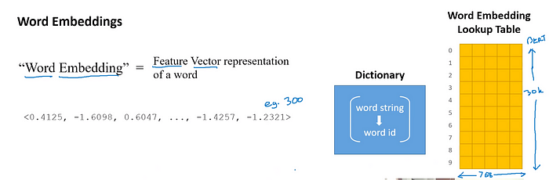
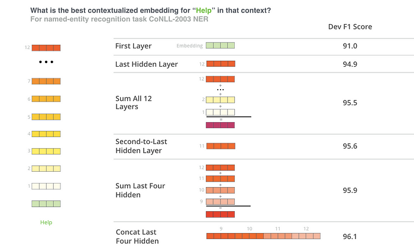

# Understanding BERT — Word Embeddings | by Dharti Dhami | Medium
[Understanding BERT — Word Embeddings | by Dharti Dhami | Medium](https://medium.com/@dhartidhami/understanding-bert-word-embeddings-7dc4d2ea54ca) 

 [


](https://medium.com/@dhartidhami?source=post_page-----7dc4d2ea54ca--------------------------------)

BERT can take as input either **one or two sentences**, and uses the special token `[SEP]` to differentiate them. The `[CLS]` token always appears at the start of the text, and is specific to classification tasks.

Both tokens are _always required_, even if we only have one sentence, and even if we are not using BERT for classification. That’s how BERT was pre-trained, and so that’s what BERT expects to see.

**2 Sentence Input**:

`[CLS] The man went to the store. [SEP] He bought a gallon of milk.`

**1 Sentence Input**:

`[CLS] The man went to the store. [SEP]`

Tokenization and Word Embedding
-------------------------------

Next let’s take a look at how we convert the words into numerical representations.



We first take the sentence and tokenize it.

```
text = "Here is the sentence I want embeddings for."  
marked_text = "\[CLS\] " + text + " \[SEP\]"\# Tokenize our sentence with the BERT tokenizer.  
tokenized\_text = tokenizer.tokenize(marked\_text)\# Print out the tokens.  
print (tokenized_text)\['\[CLS\]', 'here', 'is', 'the', 'sentence', 'i', 'want', 'em', '##bed', '##ding', '##s', 'for', '.', '\[SEP\]'\]
```

Notice how the word “embeddings” is represented:

`['em', '##bed', '##ding', '##s']`

The original word has been split into smaller subwords and characters. This is because Bert Vocabulary is fixed with a size of ~30K tokens. Words that are not part of vocabulary are represented as subwords and characters.

Tokenizer takes the input sentence and will decide to keep every word as a whole word, split it into sub words(with special representation of first sub-word and subsequent subwords — see ## symbol in the example above) or as a last resort decompose the word into individual characters. Because of this, we can always represent a word as, at the very least, the collection of its individual characters.

Here are some examples of the tokens contained in the vocabulary.

`list(tokenizer.vocab.keys())[5000:5020]`

```
\['knight',  
 'lap',  
 'survey',  
 'ma',  
 '##ow',  
 'noise',  
 'billy',  
 '##ium',  
 'shooting',  
 'guide',  
 'bedroom',  
 'priest',  
 'resistance',  
 'motor',  
 'homes',  
 'sounded',  
 'giant',  
 '##mer',  
 '150',  
 'scenes'\]
```

After breaking the text into tokens, we then convert the sentence from a list of strings to a list of vocabulary indices.

From here on, we’ll use the below example sentence, which contains two instances of the word “bank” with different meanings.

```
\# Define a new example sentence with multiple meanings of the word "bank"  
text = "After stealing money from the bank vault, the bank robber was seen " \  
       "fishing on the Mississippi river bank."\# Add the special tokens.  
marked_text = "\[CLS\] " + text + " \[SEP\]"\# Split the sentence into tokens.  
tokenized\_text = tokenizer.tokenize(marked\_text)\# Map the token strings to their vocabulary indeces.  
indexed\_tokens = tokenizer.convert\_tokens\_to\_ids(tokenized_text)\# Display the words with their indeces.  
for tup in zip(tokenized\_text, indexed\_tokens):  
    print('{:<12} {:>6,}'.format(tup\[0\], tup\[1\]))\[CLS\]           101  
after         2,044  
stealing     11,065  
money         2,769  
from          2,013  
the           1,996  
bank          2,924  
vault        11,632  
,             1,010  
the           1,996  
bank          2,924  
robber       27,307  
was           2,001  
seen          2,464  
fishing       5,645  
on            2,006  
the           1,996  
mississippi   5,900  
river         2,314  
bank          2,924  
.             1,012  
\[SEP\]           102
```

Segment ID

BERT is trained on and expects sentence pairs, using 1s and 0s to distinguish between the two sentences. That is, for each token in “tokenized_text,” we must specify which sentence it belongs to: sentence 0 (a series of 0s) or sentence 1 (a series of 1s). For our purposes, single-sentence inputs only require a series of 1s, so we will create a vector of 1s for each token in our input sentence.

If you want to process two sentences, assign each word in the first sentence plus the ‘\[SEP\]’ token a 0, and all tokens of the second sentence a 1.

```
\# Mark each of the 22 tokens as belonging to sentence "1".  
segments\_ids = \[1\] * len(tokenized\_text)print (segments_ids)\[1, 1, 1, 1, 1, 1, 1, 1, 1, 1, 1, 1, 1, 1, 1, 1, 1, 1, 1, 1, 1, 1\]tokens\_tensor = torch.tensor(\[indexed\_tokens\])  
segments\_tensors = torch.tensor(\[segments\_ids\])
```

Extracting Embeddings
---------------------

Next we need to convert our data to tensors(input format for the model) and call the BERT model. We are ignoring details of how to create tensors here but you can find it in the huggingface transformers library.

Example below uses a pretrained model and sets it up in eval mode(as opposed to training mode) which turns off dropout regularization.

```
\# Load pre-trained model (weights)  
model = BertModel.from_pretrained('bert-base-uncased',  
                                  output\_hidden\_states = True, # Whether the model returns all hidden-states.  
                                  )\# Put the model in "evaluation" mode, meaning feed-forward operation.  
model.eval()
```

Next, we evaluate BERT on our example text, and fetch the hidden states of the network!

```
\# Run the text through BERT, and collect all of the hidden states produced  
\# from all 12 layers.   
with torch.no_grad():outputs = model(tokens\_tensor, segments\_tensors)\# Evaluating the model will return a different number of objects based on   
    # how it's  configured in the \`from_pretrained\` call earlier. In this case,   
    # becase we set \`output\_hidden\_states = True\`, the third item will be the   
    # hidden states from all layers. See the documentation for more details:  
    # [https://huggingface.co/transformers/model_doc/bert.html#bertmodel](https://huggingface.co/transformers/model_doc/bert.html#bertmodel)  
    hidden_states = outputs\[2\]
```

Understanding the Output
------------------------

`hidden_states` has four dimensions, in the following order:

1.  The layer number (13 layers) : 13 because the first element is the input embeddings, the rest is the outputs of each of BERT’s 12 layers.
2.  The batch number (1 sentence)
3.  The word / token number (22 tokens in our sentence)
4.  The hidden unit / feature number (768 features)

That’s 219,648 unique values just to represent our one sentence!

```
print ("Number of layers:", len(hidden_states), "  (initial embeddings + 12 BERT layers)")  
layer_i = 0print ("Number of batches:", len(hidden\_states\[layer\_i\]))  
batch_i = 0print ("Number of tokens:", len(hidden\_states\[layer\_i\]\[batch_i\]))  
token_i = 0print ("Number of hidden units:", len(hidden\_states\[layer\_i\]\[batch\_i\]\[token\_i\]))Number of layers: 13   (initial embeddings + 12 BERT layers)  
Number of batches: 1  
Number of tokens: 22  
Number of hidden units: 768
```

Creating word and sentence vectors\[aka embeddings\] from hidden states
-----------------------------------------------------------------------

We would like to get individual vectors for each of our tokens, or perhaps a single vector representation of the whole sentence, but for each token of our input we have 13 separate vectors each of length 768.

In order to get the individual vectors we will need to combine some of the layer vectors…but which layer or combination of layers provides the best representation?

Let’s create word vectors two ways.

First, let’s **concatenate** the last four layers, giving us a single word vector per token. Each vector will have length `4 x 768 = 3,072`.

```
\# Stores the token vectors, with shape \[22 x 3,072\]  
token\_vecs\_cat = \[\]\# \`token_embeddings\` is a \[22 x 12 x 768\] tensor.\# For each token in the sentence...  
for token in token_embeddings:

        # \`token\` is a \[12 x 768\] tensor

\# Concatenate the vectors (that is, append them together) from the last   
    # four layers.  
    # Each layer vector is 768 values, so \`cat_vec\` is length 3,072.  
    cat_vec = torch.cat((token\[-1\], token\[-2\], token\[-3\], token\[-4\]), dim=0)

        # Use \`cat_vec\` to represent \`token\`.  
    token\_vecs\_cat.append(cat_vec)

print ('Shape is: %d x %d' % (len(token\_vecs\_cat), len(token\_vecs\_cat\[0\])))Shape is: 22 x 3072
```

As an alternative method, let’s try creating the word vectors by **summing** together the last four layers.

```
\# Stores the token vectors, with shape \[22 x 768\]  
token\_vecs\_sum = \[\]\# \`token_embeddings\` is a \[22 x 12 x 768\] tensor.\# For each token in the sentence...  
for token in token_embeddings:\# \`token\` is a \[12 x 768\] tensor\# Sum the vectors from the last four layers.  
    sum_vec = torch.sum(token\[-4:\], dim=0)

        # Use \`sum_vec\` to represent \`token\`.  
    token\_vecs\_sum.append(sum_vec)

print ('Shape is: %d x %d' % (len(token\_vecs\_sum), len(token\_vecs\_sum\[0\])))Shape is: 22 x 768
```

Sentence Vectors
----------------

To get a single vector for our entire sentence we have multiple application-dependent strategies, but a simple approach is to average the second to last hidden layer of each token producing a single 768 length vector.

```
\# \`hidden_states\` has shape \[13 x 1 x 22 x 768\]\# \`token_vecs\` is a tensor with shape \[22 x 768\]  
token\_vecs = hidden\_states\[-2\]\[0\]\# Calculate the average of all 22 token vectors.  
sentence\_embedding = torch.mean(token\_vecs, dim=0)print ("Our final sentence embedding vector of shape:", sentence_embedding.size())Our final sentence embedding vector of shape: torch.Size(\[768\])
```

Contextually dependent vectors
------------------------------

To confirm that the value of these vectors are in fact contextually dependent, let’s look at the different instances of the word “bank” in our example sentence:

“After stealing money from the **bank vault**, the **bank robber** was seen fishing on the Mississippi **river bank**.”

Let’s find the index of those three instances of the word “bank” in the example sentence.

```
for i, token\_str in enumerate(tokenized\_text):  
  print (i, token_str)0 \[CLS\]  
1 after  
2 stealing  
3 money  
4 from  
5 the  
6 bank  
7 vault  
8 ,  
9 the  
10 bank  
11 robber  
12 was  
13 seen  
14 fishing  
15 on  
16 the  
17 mississippi  
18 river  
19 bank  
20 .  
21 \[SEP\]
```

They are at 6, 10, and 19.

For this analysis, we’ll use the word vectors that we created by summing the last four layers.

We can try printing out their vectors to compare them.

```
print('First 5 vector values for each instance of "bank".')  
print('')  
print("bank vault   ", str(token\_vecs\_sum\[6\]\[:5\]))  
print("bank robber  ", str(token\_vecs\_sum\[10\]\[:5\]))  
print("river bank   ", str(token\_vecs\_sum\[19\]\[:5\]))First 5 vector values for each instance of "bank".bank vault    tensor(\[ 3.3596, -2.9805, -1.5421,  0.7065,  2.0031\])  
bank robber   tensor(\[ 2.7359, -2.5577, -1.3094,  0.6797,  1.6633\])  
river bank    tensor(\[ 1.5266, -0.8895, -0.5152, -0.9298,  2.8334\])
```

We can see that the values differ, but let’s calculate the cosine similarity between the vectors to make a more precise comparison.

```
from scipy.spatial.distance import cosine\# Calculate the cosine similarity between the word bank   
\# in "bank robber" vs "river bank" (different meanings).  
diff\_bank = 1 - cosine(token\_vecs\_sum\[10\], token\_vecs_sum\[19\])\# Calculate the cosine similarity between the word bank  
\# in "bank robber" vs "bank vault" (same meaning).  
same\_bank = 1 - cosine(token\_vecs\_sum\[10\], token\_vecs_sum\[6\])print('Vector similarity for  \*similar\*  meanings:  %.2f' % same_bank)  
print('Vector similarity for \*different\* meanings:  %.2f' % diff_bank)Vector similarity for  \*similar\*  meanings:  0.94  
Vector similarity for \*different\* meanings:  0.69
```

Going back to our use case of customer service with known answers and new questions. We can create embeddings of each of the known answers and then also create an embedding of the query/question. By either calculating similarity of the past queries for the answer to the new query or by jointly training query and answers, one can retrieve or rank the answers.

Pooling Strategy & Layer Choice
-------------------------------

Below are a couple additional resources for exploring this topic.

**BERT Authors**

The BERT authors tested word-embedding strategies by feeding different vector combinations as input features to a BiLSTM used on a named entity recognition task and observing the resulting F1 scores.

(Image from [Jay Allamar](http://jalammar.github.io/illustrated-bert/)’s blog)



While concatenation of the last four layers produced the best results on this specific task, many of the other methods come in a close second and in general it is advisable to test different versions for your specific application: results may vary.

This is partially demonstrated by noting that the different layers of BERT encode very different kinds of information, so the appropriate pooling strategy will change depending on the application because different layers encode different kinds of information.

**Han Xiao’s BERT-as-service**

Han Xiao created an open-source project named [bert-as-service](https://github.com/hanxiao/bert-as-service) on GitHub which is intended to create word embeddings for your text using BERT. Han experimented with different approaches to combining these embeddings, and shared some conclusions and rationale on the [FAQ page](https://github.com/hanxiao/bert-as-service#speech_balloon-faq) of the project.

`bert-as-service`, by default, uses the outputs from the **second-to-last layer** of the model.

This is the summary of Han’s perspective :

1.  The embeddings start out in the first layer as having no contextual information (i.e., the meaning of the initial ‘bank’ embedding isn’t specific to river bank or financial bank).
2.  As the embeddings move deeper into the network, they pick up more and more contextual information with each layer.
3.  As you approach the final layer, however, you start picking up information that is specific to BERT’s pre-training tasks (the “Masked Language Model” (MLM) and “Next Sentence Prediction” (NSP)).

*   What we want is embeddings that encode the word meaning well…
*   BERT is motivated to do this, but it is also motivated to encode anything else that would help it determine what a missing word is (MLM), or whether the second sentence came after the first (NSP).

4\. The second-to-last layer is what Han settled on as a reasonable sweet-spot.