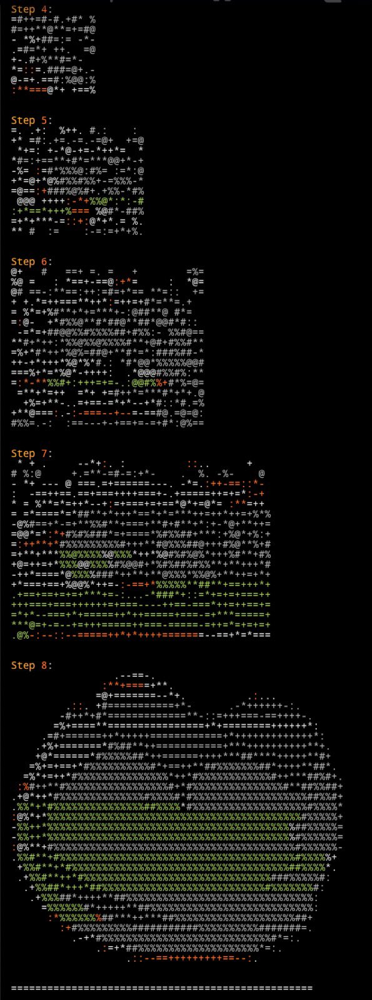

Title: Understanding Transformers... (beyond the Math)

URL Source: https://kalomaze.bearblog.dev/understanding-transformers-beyond-the-math/

Markdown Content:
_09 Mar, 2025_

This is an experimental piece - I recorded an hour long voice memo while on a walk, talking to myself out loud, stream of consciousness style.

Some things are probably worded quite messily, but it's 3 times longer compared to what I've written before, and I've found that cleaning up the transcriptions is a significantly faster process compared to writing from scratch (what I've done here took me less than ~4 hours total)

I figure that this style of writing might capture more insights. A much more "raw" recording of my mental framework, as messy as it is on the surface, probably has richer detail compared to writing things by hand - feel free to let me know what you think.

Introduction
------------

Maybe you don't want to attempt the conventional approaches for understanding the transformer architecture for language models. If you're anything like me, an informal approach is what you'd prefer - one that helps you reason about what's happening with these models in the abstract, without requiring mastery on the technical level to begin with.

Over time, I've learned those technical details myself, but I don't think I would have learned them as efficiently in the time that I have in the past year by trying to take a more academic approach where it's like, "this is how self-attention works, this is how the whole linear algebra form of just trying to understand every mechanical operation" works.

What I like to do when reasoning about these systems and trying to understand them is:

I'll take one part of this broader system that's complex that I cannot hope to understand in a single day. Then I focus on one piece and try to understand what its role in the broader system is. And when I say that, I don't mean the broader system in the sense of "this is what it's supposed to do." I try to understand what happens when you take this out - what can the system not do without this?

You're not going to be able to fit all the individual parts in your head at once, and if you do it in order of operations, it's not going to make that much sense because you're just focusing on each individual local operation. You're not thinking about the intuition for why that operation is there. You're not thinking about why it's there. You're just learning the mechanical flow and structure of the operation, not learning the true utility of whatever that thing is doing.

Transformers as State Simulators
--------------------------------

One thing I've come to understand is that transformers are essentially state simulators. Each individual prediction has its own separated state - it's not carried over from the previous one. This is important because language isn't like a linear causal left-to-right progression where state progresses at a linear rate.

The state can change dramatically depending on new information. There might be a point earlier in the context where a token halfway through is very important for predicting the next couple hundred tokens. But then maybe in the distant future, a couple hundred tokens afterwards, those tokens are not as useful or they're invalidated by some new future context that says "this isn't relevant" or "this is wrong" or something like that.

It's not like a linear causal, left-to-right type of thing where the state progresses at a linear rate, because the state can change dramatically depending on new information.

I'm struggling to come up with a good example, but imagine a chain of Reddit comments where someone is breaking down an explanation of how to do something. Then at the very end of the chain, they say "Actually, I was wrong about all this. So this is how you actually do it." The model needs to be able to disambiguate and isolate things to create a different state for each token prediction as what those prior positions actually mean changes, depending on the context.

So each individual prediction has its own state, and it's not carried over from the previous. The information beforehand informs the state, obviously, but transformers can learn to represent basically arbitrary state based off the past information without actually producing that past information. So they're very good at being spontaneous and doing in-context learning, and generalizing from your examples without necessarily being trained on those examples, because they're forced to build a state that represents the evolution of that prior information into the future.

The Output Layer: Distributions, Not "Most Likely" Tokens
---------------------------------------------------------

My mental model for what was happening at the output layer was very wrong at first. I originally thought that whenever you use temperature settings (like in ChatGPT or an API), higher temperature was basically injecting randomization somehow, like there was noise of some kind. I think the reason I believed that was because I had a vague idea of how diffusion models worked at the time.

To understand it better, I probed the code in llama.cpp (which is an inference software, not a model) - I think I was working with ChatGPT 3.5 Turbo or something like that at the time. I tried to figure out: where is temperature actually inside this giant hunk of C++ code? Let me try to understand one component and then work my way from what I understand there and see how I can generalize that to other things.

What I found is that temperature is essentially just a linear division over the scores. So what are the scores? Some people actually have told me that they thought it only generates like a handful of next tokens at a time, which is not true.

Whenever you do a text prediction objective (likelihood maximization), what's happening isn't just "predict the most likely next token" or "predict the most likely token." At each individual point in the context window, the next token that you predict needs to represent the distribution of all the next possible words or tokens that can come next that actually align, on average, the best to reducing the cross-entropy loss.

So you can't just get better at predicting the single most likely next token or a subset. You need to learn to weigh the distribution of chances such that it matches, on average, the best. An optimization objective like this is not trying to do the most likely next token - it's trying to fit a distribution of possible states according to individual word choices or token choices, trying to fit that distribution so that on average it matches the most across a bunch of different positions.

Some of those positions are gonna be more deterministic than others, especially when you're working in programming languages where you have these formal rules and contracts of how things are supposed to be handled, compared to the more responsive and spontaneous natural language like English.

You have to cover more than just what's most likely to come next. You need to be able to weigh the chance of what comes next in a way that is fine and precise, because there's going to be contexts where you want to have a lot of variety. That gets you the best chance of meeting, on average, a lower loss without fitting to that data point so hard that you end up with a very skewed and unrealistic distribution of next choices compared to what the data actually implies.

When you fit to the data this way, you're not really fitting to the most likely next token. It's more like the most likely next distribution of tokens, or at least the most accurate distribution implied by the data. And that distribution is inevitably going to learn a structure around the data that enables spontaneity and enables learning from things in context. Because it's easier to build circuits internally in the network through optimization via gradient descent to learn to abstract around what came before, compared to just memorizing what came before or finding shallower patterns.

What Temperature Actually Does
------------------------------

Once I figured out that the whole distribution was being represented at each individual next token point, I wondered how the temperature division comes into play.

Whenever you're just normally optimizing for these cross-entropy loss objectives in pretraining or just supervised fine-tuning, you're using 1.0 temperature - just the stock distribution of next token choices. It doesn't change. The reason why it's a division is because you have these individual token scores, and they're not normalized to get a probability distribution where everything has a percentage chance. You have these raw scores, which are normalized by the softmax function so that everything adds up to 100%. And you exponentiate so that it's sharper towards the top of the distribution, which is just good for learning dynamics.

When you divide by a smaller number (like temperature 0.5), you're essentially doing the same thing as multiplying the scores. So if you have a logit score of 20 for one of the top tokens, and you use a temperature of 0.5, that score will become 40. So the relative difference between each of the logits scores is going to become larger when you divide the logit score by a number that's lower than one.

There is no noise going on here, as I figured out. The importance of this is that it helped build my intuition: you're not doing most likely optimization. You're optimizing for the general chance - having the most accurate frame of general chance for each token in the vocabulary and learning a distribution around discrete individual tokens.

In your dataset, whatever tokens you have in a particular position are not actually the most likely possible choice, but we still train as if they were. Because on average, this sort of evens out or cancels out to learning more generalizable distribution of chances. If you have a distribution where there's a bunch of variable outcomes that could happen in the same possible position that are realistically plausible, your most likely option might not be so much more likely than the others to the point where it makes sense to overfit to 99% or some really large number that skews the distribution.

You're gonna get a more accurate, on average, lower cross-entropy loss for prediction by representing a distribution that hedges its bets through what will come next. And that hedging emerges from the training process of trying to fit to the assumption that the next token is the most likely one (which it's not). On average, you'll learn a distribution that doesn't favor this - you'll learn a distribution that learns variability in different contexts.

Another interesting thing happens when you take a base language model and use 0.01 temperature. It will make the top most likely token really sharp. What happens in that instance is interesting because you'll notice that it may start off coherently, but then it'll just get into these modes of repetition - not even just repeating individual tokens, but repeating structures or composition. It gets hyper-focused on the fact that the context so far has implied basically a "lowest entropy collapse."

This confuses people sometimes: "If we're just picking the most likely token each time, then why would it be something that's so repetitive or nonsensical?" Well, it's because the distribution the model actually learned implies more variety and chaos in what could come next. There's a lot of inherent variability to how we express ourselves, to how you can express something in a programming language, and a whole bunch of other things. But there's still structure.

It's about weighing and hedging the structure versus variety in such a way that has the most generalizable outcome. The model obviously learns, to some extent, to profile the variability of what is happening and structures the internal state according to that. That's because the objective is forcing a generalizable solution to understanding what could come next, not necessarily being trained on what came before. And that enables spontaneity, that enables in-context learning, and in my opinion, it enables the type of scaffolding that will be necessary for these models at scale solving truly hard problems in the future and becoming legitimately agentic, because they build heuristics that are generalizable enough to transfer to things that are arguably very out of distribution.

Testing Generalization: ASCII Art Diffusion Experiment
------------------------------------------------------

One thing I remember working on as a little toy experiment was with ASCII art. You know those websites where you take an actual image and convert it to ASCII text representation? What I wanted to try was: can we do something where I get a bunch of random ASCII characters first, and then it slowly adapts into a larger image?

What I was doing is: I had this tiny square canvas with a bunch of random ASCII symbols. Then we expand the canvas for each iteration, and we just have that all in the context sequentially. So it's sort of like a diffusion process - it's similar to a diffusion process in the sense that you're imitating the generalized process of starting from noise and becoming an actual structurally sound image.

I used some character renders from a game - like there's a Captain Falcon one that I used to demonstrate the idea, for example.

I wanted to assess: can in-context learning, without the model being trained on things like this, produce a process similar to what was seen in the examples? Remember, these examples I'm making of ASCII art from real images - I'm constructing them programmatically so that I have data points where it starts randomly, and then the canvas gets bigger each time, but the canvas also becomes clearer each time. The context implies that whatever comes next follows this abstract meta-pattern where you start from noise, and then you iterate forwards and explore what will eventually become the whole image from that process - noise into a full canvas.

Those programmatic examples - remember, the models are not trained on these examples whatsoever. I'm just working with Claude API. Claude 3.5 Sonnet is available at the time of this recording, but Claude Opus 3.5 is not out yet.

What I did was prefill the context with examples of this process. I used Anthropic's option to prefill what the model's assistant response starts off with, which is very useful when you want to probe in-context learning.

There's an abstract difference between telling a model to do something in the assistant context versus the model trying to produce an outcome in response to what it thinks it already wrote. The assistant models are aligned to that "helpful assistant" mold, but there's still the original base model's prediction capabilities beneath the assistant training. When you give it a context that looks like a completion context, sure, it'll be subtly biased by the assistant reinforcement learning in ways that aren't obvious, but you can still get it to output things that are close to a base model's predictions while still technically being an assistant-aligned model.

What happens with in-context learning for these programmatically constructed diffusion examples? I noticed some really interesting things happening for Claude 3.5 Sonnet especially. It'll start the same way - it'll start with the diffusion process and eventually iterate and expand that canvas into a consistent shape.

This is a very interesting and difficult problem to do by in-context learning because:

1.  The model has to transform the state while adding controlled noise to it, without getting lost in that noise
2.  It has to make the canvas larger each time, which changes the actual shape of the canvas
3.  The shape, size, and noise of the image being produced by predicting just individual next tokens are all changing

So it has to abstract a state representation that borrows from what came before, but also transforms it slightly in both the dimensions of size and how much noise exists in the image. And then finally, it has to end that process with the complete image. It has to do that whole process just using in-context learning - it has literally never seen ASCII art diffusion before in its training/pretraining whatsoever.

I'm pretty confident on that because it's a very weirdly, wildly out-of-distribution thing for language models to naturally be good at. I mean, there's ASCII art that exists on the Internet, but it's never iteratively evolved or increased in size like this. So the model has to understand the meta-pattern of the context and information as more than just the literal symbols, but also what they imply for the state that comes next.

Claude 3.5 Sonnet passes this test with flying colors, in my opinion. It was able to increase the size of the canvas while maintaining what came before in terms of structure, while simultaneously adapting that structure and keeping a controlled level of noise.

But the other models failed in different ways:

*   Claude 3.0 Sonnet (the first Sonnet) latched onto the fact that the canvas is supposed to get bigger each time. While making the canvas larger, it had trouble controlling the level of noise. There was some vague structural resemblance and similarity in the symbols, but by the end, you don't have any coherent image or shape that looks like it could have belonged to those examples. So it's like a partial success, partial failure.

*   Claude 3.0 Haiku (the smallest model) does this thing where, if I remember correctly, it does correctly for the first couple steps, and then it gets stuck. It just keeps copying the former step that it did before. It hasn't latched onto the meta-patterns in the context window of getting larger or controlling the noise. It gets really caught up in just copying the prior step that it did, and it can't make the canvas larger beyond a certain point - it has trouble maintaining an expanded version of that state.

So to summarize:

*   Claude 3.0 Sonnet successfully increases the size of the canvas but doesn't end with a coherent shape like Claude 3.5 Sonnet can from in-context learning examples.
*   Claude 3.0 Haiku fails to increase the size of the canvas and gets stuck - it can't even explore the space of noise/structure to go beyond the first couple steps. It gets stuck in both size and noise, and it's even noisier than Claude 3.0 Sonnet.

Claude 3.0 Opus was the only other model that was able to create something that looked like an image by the end of the process.

I think an experiment like this proves that Transformers are obviously abstracting beyond the literal symbols they've been provided. They're doing more than memorization - they're actually learning generalizable states and distributions.

Another thing I noticed about this process is that if you turn down the temperature below 1.0, even the models that produced a coherent image by the end of it didn't copy - they just got stuck. This happens because the entropy is now lower than what the model expects when producing the outcome. So they all collapse like Claude 3.0 Haiku whenever you lower that temperature - they cannot create a coherent image by the end of it, because there was a regular distribution that my examples implied.

Without training on this wildly specific example, a larger model with the best in-context learning capability was able to represent that process and represent a new state for each iterative transformation that followed the abstract patterns that my examples provided, even though the actual outcome shape is something that the models are not very good at recognizing (since these models are primarily trained on one-dimensional text sequences and not ASCII art).

The Academic Reality: Papers Don't Tell the Whole Story
-------------------------------------------------------

My approach to understanding these systems has been shaped by experiences with academic papers that don't always tell the complete story. For example, there's a famous paper about "the redundancy of the deeper layers" or something like that. They prune like the latter half of Llama 70B or just an 80-layer model, and they prune it in such a way where it still has like 78% MMLU or something like that - it still has most of the MMLU score, which is one of the conventional industry benchmarks that has sort of been saturated by the larger models.

Someone else I know, Charles Goddard (he works at Arcee AI), reproduced this. He pruned Llama 70B to 40-ish B the way the paper did. The MMLU results reproduced, but you know what was really goofy? It had worse cross-entropy loss than the Llama 8b model. So it has a higher MMLU score, but it's significantly worse at actually predicting compared to the 8b model, which is nearly 10x smaller.

And whenever you actually try to use the model, you can see that whatever it does to help represent those states - even after fine-tuning, even after you try to feed a billion tokens to it (which Charles Goddard attempted) - it barely moved the prediction in a useful way. It was still worse than the 8b model at the end of that run. Its ability to handle and track state had completely disappeared - it just sucks now at tracking and handling and composing things.

Those results - they didn't lie about the benchmarks, they just left out a pretty huge detail in my opinion. It's way worse than the original model now on the things that your metrics failed to capture. Things like that exist everywhere in academia, everywhere in these papers.

Different Approaches to Generalization: Anthropic vs. OpenAI
------------------------------------------------------------

I think we're still far from exhausting the generalized capability of even moderately sized models (like 70B parameters). The differences in capability between Claude models on the ASCII art experiment suggest that scaling helps with generalization, but there's still a lot to explore in how these models build and transform states.

Sonnet 3.5 seems to have a better diversity in pretraining because Anthropic is very careful about that. They're very careful about what they actually want to feed to the model to have it understand the world more generally. They don't want to focus on just Stack Overflow and Reddit from the past ten years - they want really diverse coverage, and I think they do a good job of that.

OpenAI seems to focus less on honing this specific capability of state representation and deep abstractions, perhaps because they have a commitment to a product that people actually want to use for real-world cases. It happens to be that the current state of language models, in terms of performing useful real-world work, is primarily programming, math, and code-related.

You can really tell from how OpenAI is offering things - they're branding a fairly specialized model (o3-mini) as a general reasoning model, but are they really optimizing for things like writing or other areas where these models can theoretically learn higher-order abstractions, even the smaller ones? And by smaller, I don't mean 0.5B or 3B, I'm talking about the midrange of 32B to 70B or so - things that are still feasible to run at home on ~2x3090s or ~2x4090s.

Building Your Own Understanding Without Formal ML Training
----------------------------------------------------------

So if you want to build a stronger intuition, you don't have to take a strong theory approach in terms of math, at least not from the get go. It's good to learn some of it, obviously - there are going to be core principles that matter. But there's also a lot of room to explore and think and question your assumptions, then try things and see if your assumptions match reality.

That's how I built such a strong mental model, and that's how I keep getting these offers from companies who are really interested in what I'm finding and posting about. I've built a niche following on Twitter (@kalomaze) of about 8,000 followers, including a bunch of PhDs, Harvard people, ML researchers - all these really high-profile individuals or companies that are interested in poaching me. I got hired for an internship for a year from a Reddit post when I knew a lot less compared to how much I know now. And I know there's still a lot more that I have to learn, especially in terms of optimization and making things go fast - I'm not very good at that.

I am very generalized in how I think about and approach these things mainly because I built my model around understanding the system at large instead of trying to approach it mechanically and rigidly. All these structures are artificially imposed, so for me it was easier to understand the abstract purpose of individual elements in the architecture before getting lost in the technical details.

It's just a matter of getting enough taste and intuition around these systems and how they work - what parts are useful versus what parts are not. Eventually, this gets you to a place where you understand what parts of the system are there because they need to be, and what parts are there because they just happen to be an arbitrary decision that someone chose at some point that happens to work well enough, but maybe can be improved upon or maybe causes some limitation or edge cases that they weren't considering.

I've never watched a Karpathy tutorial, I've never taken a machine learning course, and I built my mental model this way. I didn't just read papers - I tried to implement the parts that were interesting, and then I discovered all the fancy ways that researchers can hide results and findings that contradict their main claims.

My approach has been to:

1.  Question my assumptions about how components worked
2.  Dig into code to see what was actually happening
3.  Run experiments to test my understanding
4.  Build mental models and iteratively refine them

This approach has helped me develop insights that aren't always emphasized in formal treatments. While mathematical understanding is valuable and I've since learned many of those details, approaching transformers as systems that model distributions and represent states provides a complementary mental model that can be just as powerful.

All these structures are artificially imposed, and they could be almost anything really. It's just a matter of getting enough taste and intuition around these systems and how they work - what parts are useful versus what parts are not.

Conclusion
----------

Transformers are doing state simulation, and they're completely stateless in their architecture. They're learning generalizable distributions over what comes next. You want to build your mental model in a way that's adaptable enough where you can actually understand what is missing.

The argument gravitates towards: these aren't just memorizing patterns - they're learning generalizable states and building different states for each prediction, which may or may not have some degree of overlap, or might be completely distinct from each other.

That's probably my approach to thinking about transformers and trying to understand them from an intuition perspective over a mathematical perspective. It takes time to absorb them this way instead of trying to go through a tutorial and building from scratch. I'm not saying you can't do that approach - I want to reiterate again that I've never watched a Karpathy tutorial, I've never taken a machine learning course, and I built my mental model this way. I didn't just read papers - I tried to implement the parts that were interesting, and then I discovered all the fancy ways that researchers can hide results and findings that contradict their main claims.

If you want to organically build understanding without having to be told or taught something - if you want to be self-taught like I am - that's the approach I would recommend. But not everyone wants to take that approach, obviously. Still, I think it can be among the highest-leverage approaches to truly understanding these systems.
