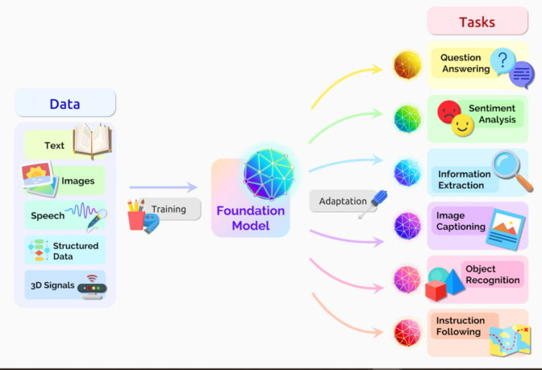
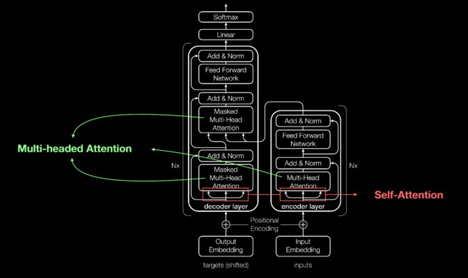
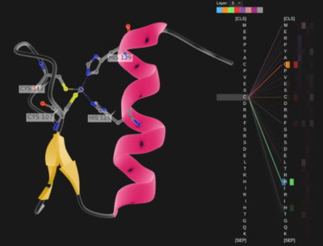
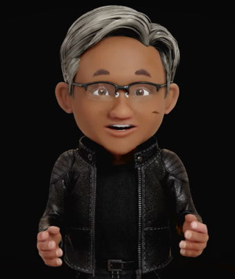
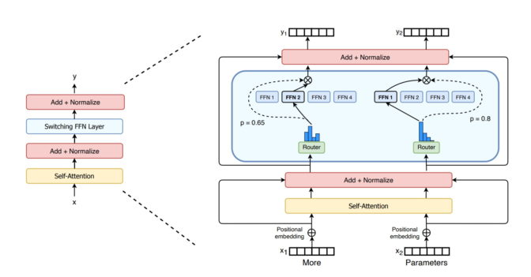
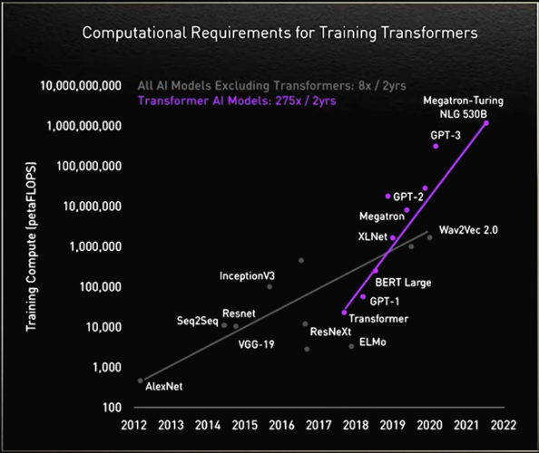
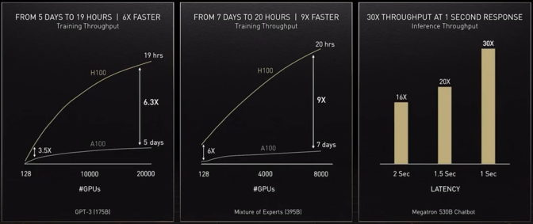

# What Is a Transformer Model? | NVIDIA Blogs
If you want to ride the next big wave in AI, grab a transformer.

They’re not the shape-shifting toy robots on TV or the trash-can-sized tubs on telephone poles.

**So, What’s a Transformer Model?**
-----------------------------------

A transformer model is a neural network that learns context and thus meaning by tracking relationships in sequential data like the words in this sentence.

Transformer models apply an evolving set of mathematical techniques, called attention or self-attention, to detect subtle ways even distant data elements in a series influence and depend on each other.

First described in [a 2017 paper](https://arxiv.org/abs/1706.03762) from Google, transformers are among the newest and one of the most powerful classes of models invented to date. They’re driving a wave of advances in machine learning some have dubbed transformer AI.

Stanford researchers called transformers “foundation models” in an [August 2021 paper](https://arxiv.org/pdf/2108.07258.pdf) because they see them driving a paradigm shift in AI. The “sheer scale and scope of foundation models over the last few years have stretched our imagination of what is possible,” they wrote.

**What Can Transformer Models Do?**
-----------------------------------

Transformers are translating text and speech in near real-time, opening meetings and classrooms to diverse and hearing-impaired attendees.

They’re helping researchers understand the chains of genes in DNA and amino acids in proteins in ways that can speed drug design.

  

Transformers, sometimes called foundation models, are already being used with many data sources for a host of applications.

Transformers can detect trends and anomalies to prevent fraud, streamline manufacturing, make online recommendations or improve healthcare.

People use transformers every time they search on Google or Microsoft Bing.

**The Virtuous Cycle of Transformer AI**
----------------------------------------

Any application using sequential text, image or video data is a candidate for transformer models.

That enables these models to ride a virtuous cycle in transformer AI. Created with large datasets, transformers make accurate predictions that drive their wider use, generating more data that can be used to create even better models.

  

Stanford researchers say transformers mark the next stage of AI’s development, what some call the era of transformer AI.

“Transformers made self-supervised learning possible, and AI jumped to warp speed,” said NVIDIA founder and CEO Jensen Huang in his [keynote address this week](https://youtu.be/39ubNuxnrK8?t=771) at GTC.

**Transformers Replace CNNs, RNNs**
-----------------------------------

Transformers are in many cases replacing convolutional and recurrent neural networks (CNNs and RNNs), the most popular types of deep learning models just five years ago.

Indeed, 70 percent of [arXiv](https://arxiv.org/) papers on AI posted in the last two years mention transformers. That’s a radical shift from [a 2017 IEEE study](https://www.researchgate.net/publication/336267803_Comprehensive_Review_of_Artificial_Neural_Network_Applications_to_Pattern_Recognition) that reported RNNs and CNNs were the most popular models for pattern recognition.

**No Labels, More Performance**
-------------------------------

Before transformers arrived, users had to train neural networks with large, labeled datasets that were costly and time-consuming to produce. By finding patterns between elements mathematically, transformers eliminate that need, making available the trillions of images and petabytes of text data on the web and in corporate databases.

In addition, the math that transformers use lends itself to parallel processing, so these models can run fast.

Transformers now dominate popular performance leaderboards like [SuperGLUE](https://super.gluebenchmark.com/leaderboard/), a benchmark [developed in 2019](https://arxiv.org/abs/1905.00537) for language-processing systems.

**How Transformers Pay Attention**
----------------------------------

Like most neural networks, transformer models are basically large encoder/decoder blocks that process data.

Small but strategic additions to these blocks (shown in the diagram below) make transformers uniquely powerful.

  

A look under the hood from a presentation by Aidan Gomez, one of eight co-authors of the 2017 paper that defined transformers.

Transformers use positional encoders to tag data elements coming in and out of the network. Attention units follow these tags, calculating a kind of algebraic map of how each element relates to the others.

Attention queries are typically executed in parallel by calculating a matrix of equations in what’s called multi-headed attention.

With these tools, computers can see the same patterns humans see.

**Self-Attention Finds Meaning**
--------------------------------

For example, in the sentence:

_She poured water from the pitcher to the cup until it was full. _

We know “it” refers to the cup, while in the sentence:

_She poured water from the pitcher to the cup until it was empty._

We know “it” refers to the pitcher.

“Meaning is a result of relationships between things, and self-attention is a general way of learning relationships,” said Ashish Vaswani, a former senior staff research scientist at Google Brain who led work on the seminal 2017 paper.

“Machine translation was a good vehicle to validate self-attention because you needed short- and long-distance relationships among words,” said Vaswani.

“Now we see self-attention is a powerful, flexible tool for learning,” he added.

**How Transformers Got Their Name**
-----------------------------------

Attention is so key to transformers the Google researchers almost used the term as the name for their 2017 model. Almost.

“Attention Net didn’t sound very exciting,” said Vaswani, who started working with neural nets in 2011.

.Jakob Uszkoreit, a senior software engineer on the team, came up with the name Transformer.

“I argued we were transforming representations, but that was just playing semantics,” Vaswani said.

**The Birth of Transformers**
-----------------------------

In the paper for the 2017 NeurIPS conference, the Google team described their transformer and the accuracy records it set for machine translation.

Thanks to a basket of techniques, they trained their model in just 3.5 days on eight NVIDIA GPUs, a small fraction of the time and cost of training prior models. They trained it on datasets with up to a billion pairs of words.

“It was an intense three-month sprint to the paper submission date,” recalled Aidan Gomez, a Google intern in 2017 who contributed to the work.

“The night we were submitting, Ashish and I pulled an all-nighter at Google,” he said. “I caught a couple hours sleep in one of the small conference rooms, and I woke up just in time for the submission when someone coming in early to work opened the door and hit my head.”

It was a wakeup call in more ways than one.

“Ashish told me that night he was convinced this was going to be a huge deal, something game changing. I wasn’t convinced, I thought it would be a modest gain on a benchmark, but it turned out he was very right,” said Gomez, now CEO of startup [Cohere](https://cohere.ai/) that’s providing a language processing service based on transformers.

**A Moment for Machine Learning**
---------------------------------

Vaswani recalls the excitement of seeing the results surpass similar work published by a Facebook team using CNNs.

“I could see this would likely be an important moment in machine learning,” he said.

A year later, another Google team tried processing text sequences both forward and backward with a transformer. That helped capture more relationships among words, improving the model’s ability to understand the meaning of a sentence.

Their Bidirectional Encoder Representations from Transformers ([BERT](https://arxiv.org/pdf/1810.04805.pdf)) model set 11 new records and became part of the algorithm behind Google search.

Within weeks, researchers around the world were [adapting BERT](https://blogs.nvidia.com/blog/2019/12/23/bert-ai-german-swedish/) for use cases across many languages and industries “because text is one of the most common data types companies have,” said Anders Arpteg, a 20-year veteran of machine learning research.

**Putting Transformers to Work**
--------------------------------

Soon transformer models were being adapted for science and healthcare.

DeepMind, in London, advanced the understanding of proteins, the building blocks of life, using a transformer called AlphaFold2, described in a [recent Nature article](https://www.nature.com/articles/s41586-021-03819-2). It processed amino acid chains like text strings to set a new watermark for describing how proteins fold, work that could speed drug discovery.

AstraZeneca and NVIDIA developed [MegaMolBART](https://catalog.ngc.nvidia.com/orgs/nvidia/teams/clara/models/megamolbart), a transformer tailored for drug discovery. It’s a version of the pharmaceutical company’s MolBART transformer, trained on a large, unlabeled database of chemical compounds using the NVIDIA [Megatron](https://github.com/NVIDIA/Megatron-LM) framework for building large-scale transformer models.

**Reading Molecules, Medical Records**
--------------------------------------

“Just as AI language models can learn the relationships between words in a sentence, our aim is that neural networks trained on molecular structure data will be able to learn the relationships between atoms in real-world molecules,” said Ola Engkvist, head of molecular AI, discovery sciences and R&D at AstraZeneca, when the work was [announced last year](https://blogs.nvidia.com/blog/2021/04/12/ai-drug-discovery-astrazeneca-university-florida-health/).

Separately, the [University of Florida](http://www.ufl.edu/)’s academic health center collaborated with [NVIDIA](https://www.nvidia.com/en-us/) researchers to create [GatorTron](https://ufhealth.org/news/2021/university-florida-health-nvidia-develop-artificial-intelligence-model-hasten-clinical). The transformer model aims to extract insights from massive volumes of clinical data to accelerate medical research.

**Transformers Grow Up**
------------------------

Along the way, researchers found larger transformers performed better.

For example, researchers from [the Rostlab](https://www.rostlab.org/) at the Technical University of Munich, which helped pioneer work at the intersection of AI and biology, used [natural-language processing to understand proteins](https://blogs.nvidia.com/blog/2020/07/16/ai-reads-proteins-covid/). In 18 months, they graduated from using RNNs with 90 million parameters to transformer models with 567 million parameters.

  

Rostlab researchers show language models trained without labeled samples picking up the signal of a protein sequence.

The OpenAI lab showed bigger is better with its Generative Pretrained Transformer (GPT). The latest version, [GPT-3](https://openai.com/api/)**,** has 175 billion parameters, up from 1.5 billion for GPT-2.

With the extra heft, GPT-3 can respond to a user’s query even on tasks it was not specifically trained to handle. It’s already being used by companies including Cisco, IBM and Salesforce.

**Tale of a Mega Transformer**
------------------------------

NVIDIA and Microsoft hit a high watermark in November, announcing the [Megatron-Turing Natural Language Generation model](https://nvidianews.nvidia.com/news/nvidia-brings-large-language-ai-models-to-enterprises-worldwide) ([MT-NLG](https://developer.nvidia.com/blog/using-deepspeed-and-megatron-to-train-megatron-turing-nlg-530b-the-worlds-largest-and-most-powerful-generative-language-model/)) with 530 billion parameters. It debuted along with a new framework, [NVIDIA NeMo Megatron](https://developer.nvidia.com/nvidia-nemo), that aims to let any business create its own billion- or trillion-parameter transformers to power custom chatbots, personal assistants and other AI applications that understand language.

MT-NLG had its public debut as the brain for TJ, the Toy Jensen avatar that gave part of the keynote at NVIDIA’s November 2021 GTC.

“When we saw TJ answer questions — the power of our work demonstrated by our CEO — that was exciting,” said Mostofa Patwary, who led the NVIDIA team that trained the model.

  

“Megatron helps me answer all those tough questions Jensen throws at me,” TJ said at GTC 2022.

Creating such models is not for the faint of heart. MT-NLG was trained using hundreds of billions of data elements, a process that required thousands of GPUs running for weeks.

“Training large transformer models is expensive and time-consuming, so if you’re not successful the first or second time, projects might be canceled,” said Patwary.

**Trillion-Parameter Transformers**
-----------------------------------

Today, many AI engineers are working on trillion-parameter transformers and applications for them.

“We’re constantly exploring how these big models can deliver better applications. We also investigate in what aspects they fail, so we can build even better and bigger ones,” Patwary said.

To provide the computing muscle those models need, our latest accelerator — the [NVIDIA H100 Tensor Core GPU](https://www.nvidia.com/en-us/data-center/h100/) — packs a [Transformer Engine](https://blogs.nvidia.com/blog/2022/03/22/h100-transformer-engine/) and supports a new FP8 format. That speeds training while preserving accuracy.

With those and other advances, “transformer model training can be reduced from weeks to days” said Huang at GTC.

**MoE Means More for Transformers**

Last year, Google researchers described the [Switch Transformer](https://arxiv.org/pdf/2101.03961.pdf), one of the first trillion-parameter models. It uses AI sparsity, a complex mixture-of experts (MoE) architecture and other advances to drive performance gains in language processing and up to 7x increases in pre-training speed.

  

The encoder for the Switch Transformer, the first model to have up to a trillion parameters.

For its part, Microsoft Azure [worked with NVIDIA](https://blogs.nvidia.com/blog/2022/03/22/microsoft-translator-triton-inference/) to implement an MoE transformer for its [Translator](https://translator.microsoft.com/) service.

**Tackling Transformers’ Challenges**
-------------------------------------

Now some researchers aim to develop simpler transformers with fewer parameters that deliver performance similar to the largest models.

“I see promise in retrieval-based models that I’m super excited about because they could bend the curve,” said Gomez, of Cohere, noting the [Retro model](https://deepmind.com/research/publications/2021/improving-language-models-by-retrieving-from-trillions-of-tokens) from DeepMind as an example.

Retrieval-based models learn by submitting queries to a database. “It’s cool because you can be choosy about what you put in that knowledge base,” he said.

  

In the race for higher performance, transformer models have grown larger.

The ultimate goal is to “make these models learn like humans do from context in the real world with very little data,” said Vaswani, now co-founder of a stealth AI startup.

He imagines future models that do more computation upfront so they need less data and sport better ways users can give them feedback.

“Our goal is to build models that will help people in their everyday lives,” he said of his new venture.

**Safe, Responsible Models**
----------------------------

Other researchers are studying ways to eliminate bias or toxicity if models amplify wrong or harmful language. For example, Stanford created the [Center for Research on Foundation Models](https://crfm.stanford.edu/) to explore these issues.

“These are important problems that need to be solved for safe deployment of models,” said Shrimai Prabhumoye, a research scientist at NVIDIA who’s among many across the industry working in the area.

“Today, most models look for certain words or phrases, but in real life these issues may come out subtly, so we have to consider the whole context,” added Prabhumoye.

“That’s a primary concern for Cohere, too,” said Gomez. “No one is going to use these models if they hurt people, so it’s table stakes to make the safest and most responsible models.”

**Beyond the Horizon**
----------------------

Vaswani imagines a future where self-learning, attention-powered transformers approach the holy grail of AI.

“We have a chance of achieving some of the goals people talked about when they coined the term ‘general artificial intelligence’ and I find that north star very inspiring,” he said.

“We are in a time where simple methods like neural networks are giving us an explosion of new capabilities.”

  

Transformer training and inference will get significantly accelerated with the NVIDIA H100 GPU.

_Learn more about transformers on the [NVIDIA Technical Blog](https://developer.nvidia.com/blog/tag/transformers/)._