Title: a16z全球AI产品Top100：中国14款产品上榜，DeepSeek第2，Monica第41

URL Source: https://mp.weixin.qq.com/s/MS3a8xjxe7N0JJgmILW55Q

Markdown Content:
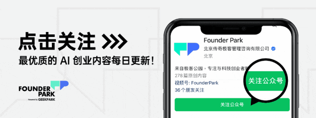

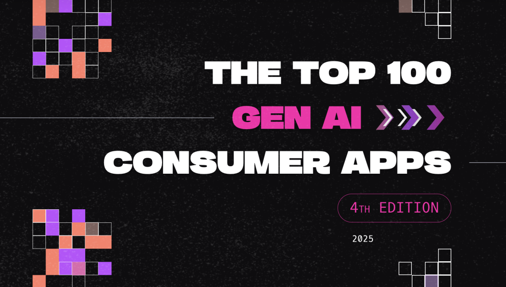

编译版本转载自「FishAI」

短短六个月，面向消费者的生成式 AI 市场已发生翻天覆地的变化。一些产品迅速崭露头角，另一些却止步不前，还有意外的黑马一跃成为行业领跑者。例如，DeepSeek 从鲜为人知迅速崛起，成为 ChatGPT 的强劲对手；AI 视频模型从实验性工具逐步进化到可用于制作短片；而“vibe coding”的兴起则重新定义了谁能创造 AI 内容，而非仅仅停留在使用层面。竞争日趋激烈，市场规模持续扩大，胜者不再仅靠“推出产品”取胜，更需赢得用户的长期青睐。

通过数据分析，我们尝试解答几个关键问题：人们真正在用哪些 AI 应用？哪些产品不仅吸引了流量，还能转化为实际收入？哪些工具正从好奇驱动的“尝鲜”阶段，转变为用户的日常必需品？

这是我们第四次发布「Top 100 Gen AI Consumer Apps」榜单（每半年更新一次），涵盖全球50 大 AI 原生 Web 产品（数据来源：Similarweb，按月独立访客数排名）和50 大 AI 原生移动应用（数据来源：Sensor Tower，按月活跃用户数排名）。自 2024 年 8 月上一份报告发布以来，17 家新公司首次跻身 Web 产品榜单。

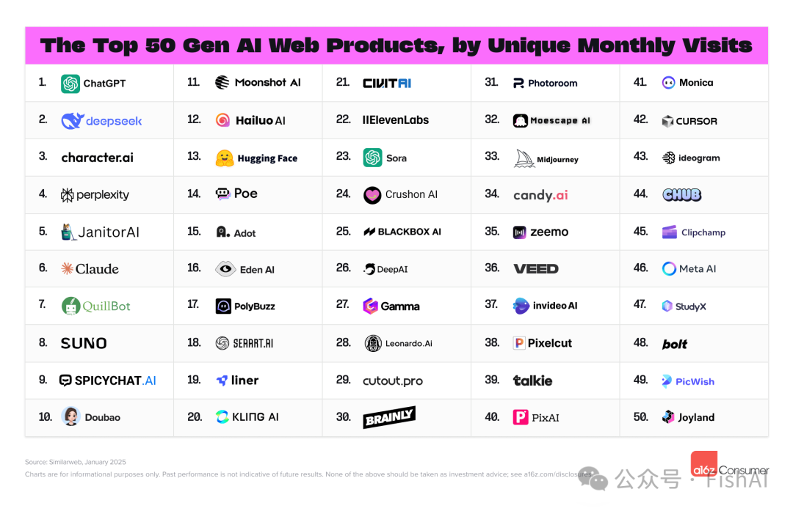

Web 榜单

> 网页端中国AI公司的全球排名
> 
> DeepSeek：#2
> 
> 字节豆包：#10
> 
> 月之暗面Kimi：#11
> 
> MiniMax 海螺AI：#12
> 
> 快手可灵：#20
> 
> MiniMax Talkie：#39
> 
> Monica（与Manus是同一家）：#41

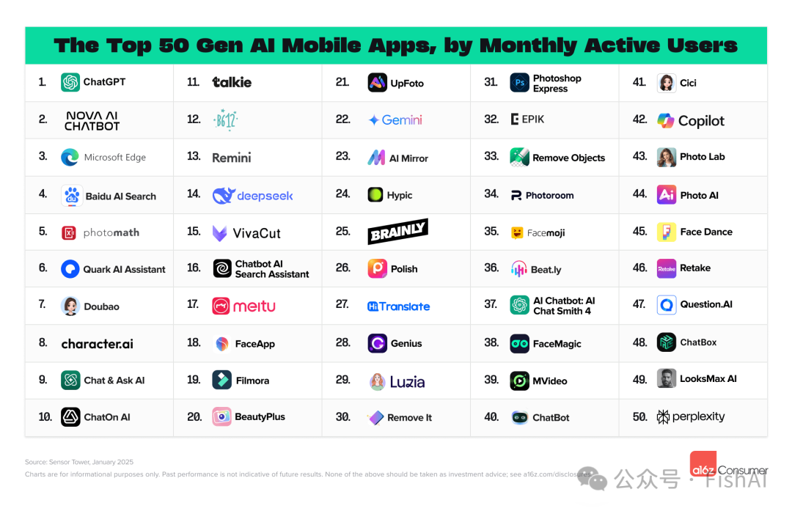

移动应用榜单

> App端中国AI公司的全球排名：
> 
> 百度AI搜索：#4
> 
> 夸克AI助手：#6
> 
> 豆包：#7
> 
> MiniMax Talkie：#11
> 
> DeepSeek：#14
> 
> 美图：#17
> 
> Cici（豆包国际版）：#41

方法论说明：本榜单仅包括 AI 原生产品，像 Canva、Notion 这样虽新增重要 AI 功能但非 AI 原生的产品未被纳入。与以往榜单相比，我们剔除了 Pixlr、Fotor、PicsArt 等传统图片编辑工具。

此外，本次新增了“Brink List”榜单，列出10 家最有潜力冲击前 100 的产品（5 家 Web 产品，5 家移动应用）。在 AI 领域瞬息万变的背景下，我们期待观察这些后起之秀能否在下次榜单中脱颖而出。

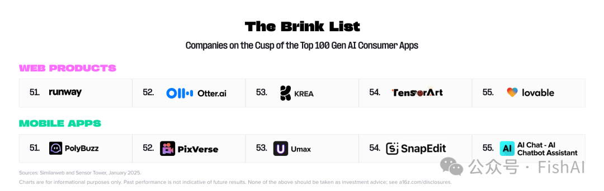

Brink List

除了排名数据，我们还分析了行业趋势和消费者行为的新变化，提炼出几个值得关注的洞察。

**Founder Park 正在搭建开发者社群，邀请积极尝试、测试新模型、新技术的开发者、创业者们加入，请扫码详细填写你的产品/项目信息，通过审核后工作人员会拉你入群～**

进群之后，你有机会得到：

*   高浓度的主流模型（如 DeepSeek 等）开发交流；
    
*   资源对接，与 API、云厂商、模型厂商直接交流反馈的机会；
    
*   好用、有趣的产品/案例，Founder Park 会主动做宣传。
    

* * *

**01** 
-------

**ChatGPT 强势复苏：**
-----------------

**从增速放缓到再创新高**
--------------

ChatGPT 自 2022 年 11 月以“研究预览”形式推出，仅用两个月就收获 1 亿用户，成为增长最快的消费级应用。然而，随后其流量增速有所放缓，从 2023 年 3 月至 2024 年 4 月，全球月访问量基本持平。

最近，ChatGPT 的用户增长却迎来强劲反弹。从 2023 年 11 月的 1 亿周活跃用户，到 2024 年 8 月的 2 亿，用了 9 个月；而从 2 亿到 2025 年 2 月中旬的 4 亿，仅耗时不到 6 个月，增长速度令人瞩目。

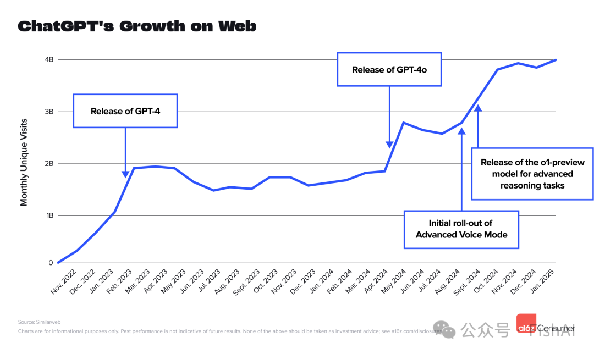

ChatGPT Web 增长

早期增速放缓的原因，可能是新奇感吸引了大量用户，但缺乏明确的日常使用场景。随着 OpenAI 不断推出更强大的模型和功能，用户活跃度显著提升，老用户使用频率增加，新用户也源源不断加入。

具体来看，每次流量激增都与产品升级密切相关：

*   2024 年 4-5 月：GPT-4o 发布，带来多模态能力，支持实时语音交互、图像识别等功能，例如拍下数学题即可获得解答，或用 AI 头脑风暴创意。
    
*   2024 年 7-8 月：Advanced Voice Mode 上线，大幅提升对话流畅度。
    
*   2024 年 9-10 月：o1 系列模型推出，强化推理和问题解决能力。
    

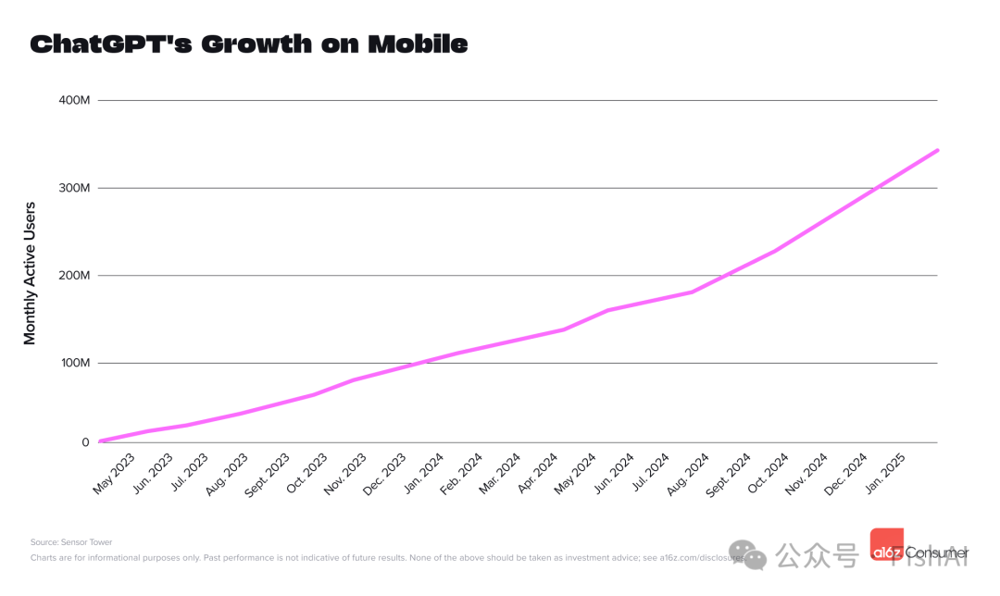

ChatGPT 移动端增长

移动端表现更为稳定。自 2023 年 5 月推出移动版以来，ChatGPT 用户规模每月稳步增长 5%-15%。据 Sensor Tower 估算，其 4 亿周活跃用户中，约 1.75 亿来自移动端。

**02**
------

**DeepSeek 异军突起：**
------------------

**中国市场爆发，全球影响力初显**
------------------

DeepSeek 近期备受瞩目。其聊天机器人功能于 2025 年 1 月 20 日上线，仅 10 天就跃升至全球 AI 产品月访问量榜第二名。

DeepSeek 由中国对冲基金 High-Flyer 开发，2025 年 1 月流量中 21% 来自中国（ChatGPT 在中国被封禁），美国和印度分别占 9% 和 8%。不过，韩国、澳大利亚、台湾等地及部分美国州政府设备已对其施加限制或封禁。

相较其他通用大语言模型，DeepSeek 增长迅猛。官方数据显示，上线 14 天即达 100 万用户，虽不及 ChatGPT 的 5 天纪录，但随后仅用 20 天突破 1000 万用户，超越 ChatGPT 的 40 天里程碑。

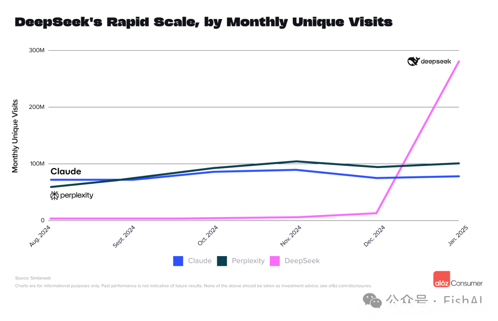

DeepSeek 月访问量增长

在移动端，DeepSeek 于 2025 年 1 月 25 日上线，5 天内跻身月活跃用户榜第 14 名，到 2 月跃升至第二名，占 ChatGPT 移动端用户基数的 15%。Sensor Tower 数据显示，其用户单周使用时长和会话次数略高于 Perplexity 和 Claude，但仍低于 ChatGPT。

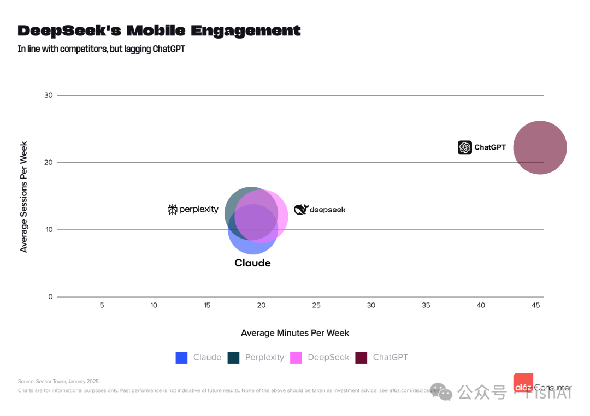

DeepSeek 移动端参与度

DeepSeek 能在技术圈迅速走红，离不开其在推理性能测试中的优异表现，以及仅用 560 万美元完成训练的宣传——这一成本远低于竞品。其低成本训练被视为一次“Sputnik moment”（“人造卫星时刻”），引发广泛讨论。2025 年 1 月 27 日，Google Trends 显示其全球搜索热度追平 ChatGPT，在美国甚至短暂超过。

**03** 
-------

**AI 视频升温：**
------------

**从实验走向实用，短视频领域尤为活跃**
---------------------

过去 18 个月，AI 视频技术在“接近实用”和“仍不稳定”间摇摆。但近半年，其质量与可控性显著提升。本次 Web 榜单中，三家新公司进入前 50：

*   Hailuo（第 12 名）
    
*   Kling AI（第 17 名）
    
*   Sora（第 23 名）
    

此外，老牌产品 InVideo 位列第 37 名，Runway 和 Krea（聚合多种视频生成模型）则进入 Brink List。

Hailuo（基于 MiniMax 模型）和 Kling AI 均来自中国，分别于 2024 年 9 月和 6 月上线，2025 年 1 月访问量超过 Sora。Sora 虽于 2024 年 2 月开启小范围预览，但直到 12 月才正式推出。各家服务商的功能和风格逐渐分化：

*   Sora：输出风格较通用。
    
*   Hailuo：更精准理解和执行提示词。
    
*   Kling AI：提供镜头运动控制和口型对齐等特色。
    

AI 视频编辑仍是消费级核心场景，可一键完成智能剪辑、自动字幕等繁琐任务。例如，Veed（第 36 名）和 Clipchamp（第 45 名）跻身 Web 榜单。移动端则有融合照片与视频处理的应用表现突出，如 B612（第 12 名）、VivaCut（第 15 名）和 Filmora（第 19 名）。收入方面，Splice、Captions 和 Videoleap 在移动端付费表现尤佳（详见后文）。

未来，Google 的 Veo 2 等新模型或将带来更多创新。但其定价为每秒 0.50 美元，更偏商业用途，可能难以满足大规模消费级需求。

**04** 
-------

**“Vibecoding” 兴起：**
--------------------

**赋能开发者和普通用户，****AI 重塑产品创造者**
-----------------------------

当前，两个细分方向发展迅猛，面向不同人群：

1.  Agentic IDE：面向开发者的智能集成开发环境，如 Cursor，支持漏洞检测、代码补全和生成，堪称“开发者的 AI 助手”。
    
2.  Text-to-Web App 平台：通过文本提示快速生成网站或应用，适合非技术用户，被 Andrej Karpathy 称为“vibecoding”的代表。
    

本次榜单中，Cursor 首次进入 Web 榜单（第 41 名），官方称已拥有数十万开发者用户。Text-to-Web App 则让普通人无需编程技能，仅通过文本提示即可生成网站或应用，宛如“魔法”。这类产品近期大规模涌现，得益于大模型生成可执行代码的能力、Web 框架成熟，以及 Resend、Clerk、Supabase 等生态组件的便捷接入。

增长数据亮眼：Bolt（第 48 名）上线两月实现 2000 万美元 年化收入和 200 万注册用户；Lovable 三月内达 1700 万美元 年化收入，进入 Brink List。

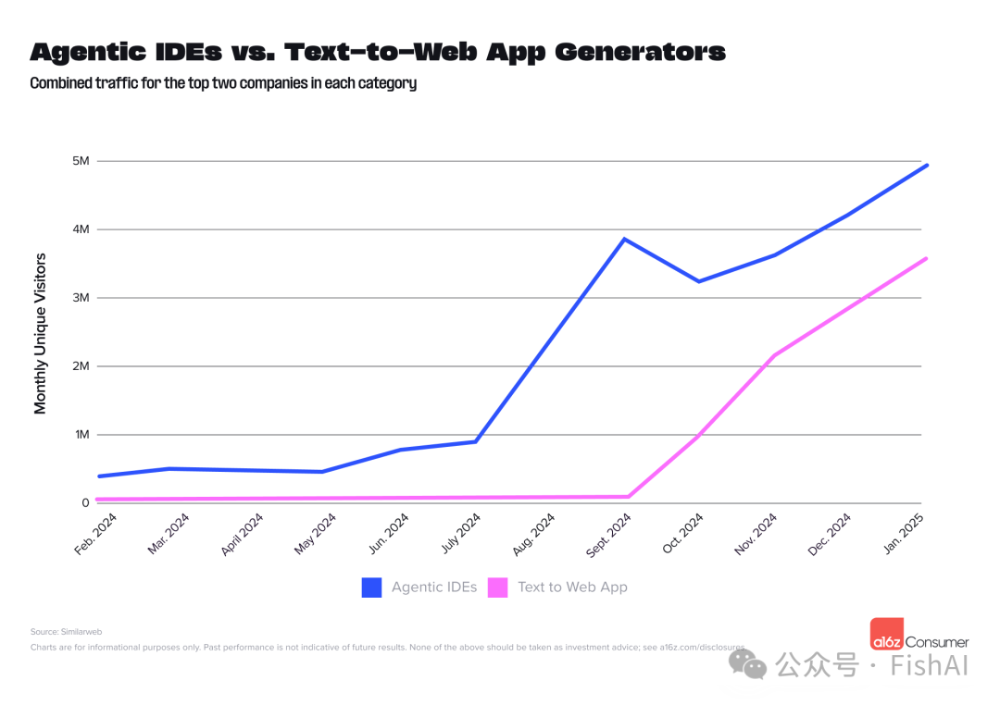

Agentic IDE vs. Text-to-Web App

从月独立访客数看，前两名 Agentic IDE 的用户规模略高于 Text-to-Web App，但两者增长速度相近。Agentic IDE 面向开发者，群体虽小却使用频次高；Text-to-Web App 适用面广，但需用户有明确需求驱动。

两类用户有一定重叠。技术背景用户可能先用 Text-to-Web App 快速原型，再用 IDE 完善。Similarweb 数据显示，2025 年 1 月，Bolt 23% 的用户也访问了 Cursor。

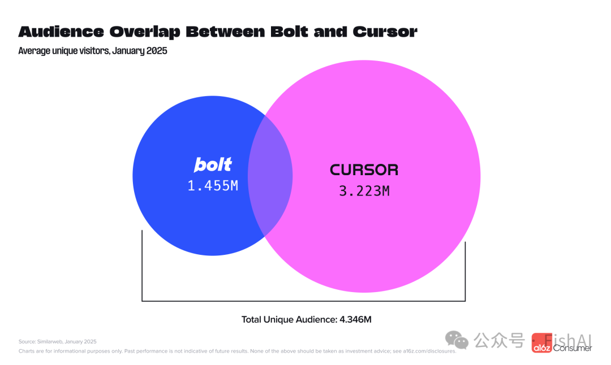

Bolt 与 Cursor 用户重叠

**05** 
-------

**专注型应用深度变现：**
--------------

**用户规模不等于收入**
-------------

移动端榜单基于 Sensor Tower 的月活跃用户（MAU）排名，入榜门槛为 800 万 MAU。但 MAU 高并不意味着收入强。一些 MAU 较低的应用凭借高付费转化率和每用户收入，营收超过许多“流量大户”。ChatGPT 在 MAU 和收入上均领先，但 50 大活跃应用与 50 大收入应用的榜单重叠率仅 40%。

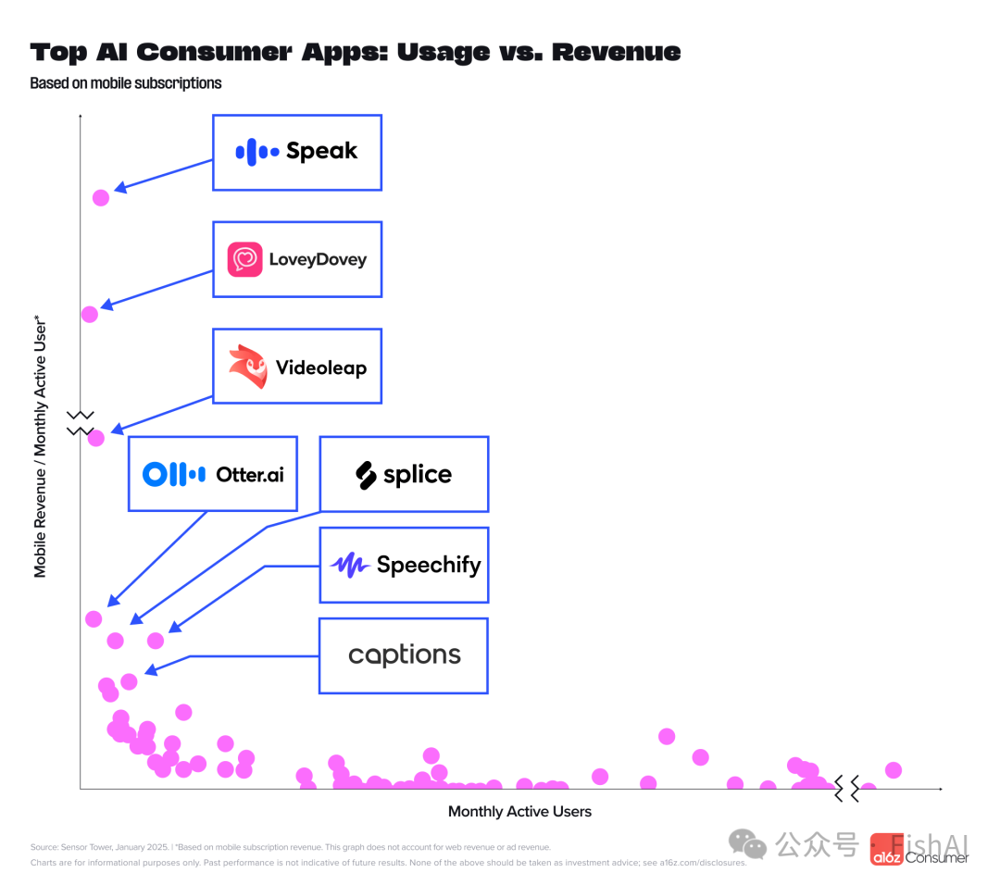

使用量 vs. 收入

某些赛道在两榜均有表现，但排名差异明显。AI 视频/图片编辑类占两榜 20% 以上，用户榜前三为 VivaCut、Filmora、Beat.ly，而收入榜前三为 Splice、Captions、Videoleap。大众化应用用户多，专业化应用更易激发付费意愿。

部分类别仅现于收入榜：

*   植物识别：如 PictureThis、PlantID
    
*   营养/饮食：如 Cal AI、Fastic
    
*   语言学习：如 Speak、Learna、Loora
    
*   音乐：如 Moises、Suno
    
*   语音转写：如 Otter、PLAUD
    

这些小众场景需求明确，用户付费意愿强，订阅收入表现突出。

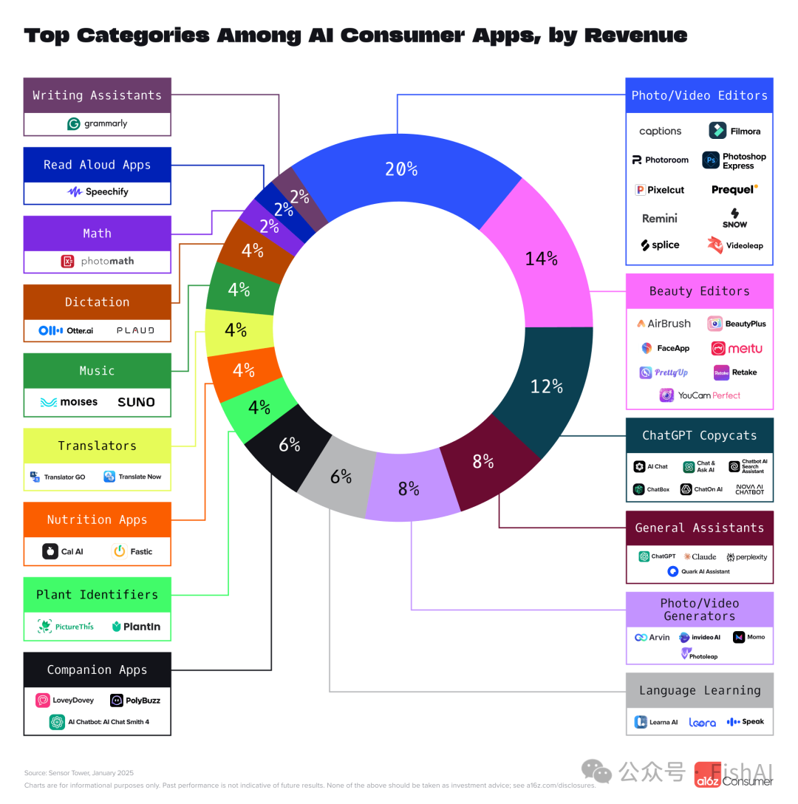

收入榜主要类别

值得一提的是，ChatGPT“克隆”类应用占两榜 12%，通过模仿名称和图标、低价吸引用户，并不断调整应用商店信息以规避版权问题，保持一定下载量。

**06** 
-------

**结语**
------

AI 原生产品正以前所未有的速度增长，用户粘性不断增强。然而，这一领域仍有巨大潜力待挖掘。未来几年，AI 将催生一批定义行业的领军企业。而眼下，竞争已进入白热化阶段，技术突破层出不穷，用户接受度日益提高，甚至愿意为之付费的趋势也愈发明显。
-----------------------------------------------------------------------------------------------------------------------

原文：https://a16z.com/100-gen-ai-apps-4/

作者：  
Olivia Moore 是 Andreessen Horowitz 消费者投资团队的合伙人，主要负责人工智能领域。  
Daisy Zhao 是 Andreessen Horowitz 的投资人，她专注于下一代人工智能应用，尤其是那些能丰富日常生活的应用。

* * *

[

* * *

**更多阅读**

[Manus产品负责人张涛万字解析：DeepSeek R1是怎么炼成的？](https://mp.weixin.qq.com/s?__biz=Mzg5NTc0MjgwMw==&mid=2247514792&idx=1&sn=3f022f24274168106fb87a764278219e&scene=21#wechat_redirect)  

[实测Manus：Monica团队新产品，全球首个通用性Agent（附50个用例拆解）](https://mp.weixin.qq.com/s?__biz=Mzg5NTc0MjgwMw==&mid=2247514772&idx=1&sn=aef54d534612029c0565cbc790c31fd1&scene=21#wechat_redirect)  

[Anthropic CPO 万字专访：不再只做模型！后悔没有更早做第一方产品](https://mp.weixin.qq.com/s?__biz=Mzg5NTc0MjgwMw==&mid=2247514742&idx=1&sn=1768a63f28acdf3fc37651a0e5191b29&scene=21#wechat_redirect)  

[对话像素绽放PixelBloom赵充：一年内用户超千万，而且挣到钱，AiPPT.cn是怎么做到的？](https://mp.weixin.qq.com/s?__biz=Mzg5NTc0MjgwMw==&mid=2247514758&idx=1&sn=31d809b9fe155ca2b8ad2cb11d64ba09&scene=21#wechat_redirect)

转载原创文章请添加微信：founderparker
