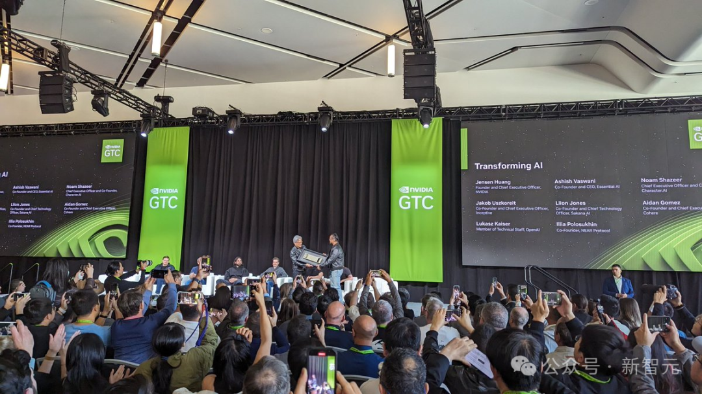

# mp.weixin.qq.com/s/2OVdLJm7llWvZSoxnolziA?poc_token=HGwSAWajBpquo_sBNNhVoqY6BRBuRz6q5SBsxh8U
### 

### 

* * *

**新智元报道**

编辑：编辑部

##### **【新智元导读】** Transformer奠基之作拯救了现在的AI。就在GTC大会上，老黄聚齐了其中的七位作者，开启了一场深度访谈。

GTC大会上，老黄与Transformer八位作者一场最新访谈，简直火爆了！  

演讲前一个半小时，现场门外就挤满了人。许多人早早排起了长队，期待着这场别致的访谈。

就连老黄也提前到场，在人群中合影。

老黄主旨演讲当天，现场虚无坐席，网友戏称他为AI届的「霉霉」

在场的7位作者现在的身份分别是：

*   Noam Shazeer：Character AI联合创始人兼首席执行官
    
*   Aidan Gomez：Cohery联合创始人兼首席执行官
    
*   Ashish Vaswani：Essential AI联合创始人兼首席执行官
    
*   Llion Jones：Sakana AI联合创始人兼首席技术官
    
*   Illia Polosukhin：Near Protocol联合创始人
    
*   Jakob Uskhoreit：Inceptive联合创始人兼首席执行官
    
*   Lukasz Kaiser：OpenAI技术员
    

八位作者中，只有Niki Parmar（Essential AI的联合创始人）没有亲临现场。

访谈中的亮点满满，他们纷纷认为现在急需一个能够替代Trasformer的架构出现。

*   Llion Jones想出了「Attention is All You Need」论文名。当时，他们在架构中添加了如「卷积」一些东西，但性能反而变差了，因此得名。
    
*   Jakob Uszkoreit想出了「Transformer」一名。
    
*   Noam Shazeer的另一个名字是「CargoNet」。
    
*   推理是下一件大事。推理和从小数据中学习是密切相关的。
    

值得一提的是，采访结束后，老黄亲自为Transformer作者颁发了，一台亲笔签名的DGX-1。  

Transformerer八子背后秘密

同在今天，Wired的一篇独家专访，报道了Transformerer八子背后那些不为人知的故事。

### **颠覆式论文署名**

2017年春，Transformer奠基之作「Attention Is All You Need」横空出世。

当时，资历最深的Noam Shazeer看到提交的版本时，对自己名列首位满脸震惊。这也暗示了他对这项工作做出的巨大贡献。

Noam表示，「自己当时并没有想太多」。

论文地址：https://arxiv.org/pdf/1706.03762.pdf

决定论文作者署名顺序——谁位列榜首，谁被放在最后，总是需要精心衡量的。

特别是在，每个参与者都在这项集体工作中，贡献了自己独一份努力的情况下。

在紧张完成论文的过程中，他们最终选择了「颠覆」传统贡献者排名方式。

8位作者决定在每个名字旁加上了一个星号∗，并在首页做了脚注：

> 每位作者贡献相等，名单排列顺序随机。

在截止日期之前，他们将论文提交给第31届国际神经信息处理系统大会NIPS，由此引发的一场AI革命正式开启。

「Attention Is All You Need」这篇传奇论文，即将迎来第七个诞生日。现在，全网被引数已超11万，前前后后提交了87个版本。

8位作者从神级网络出发，提出了全新的Transformer架构——成为了ChatGPT、DALL-E、Midjourney等令人瞩目AI产品背后的核心技术。

Noam开玩笑表示，「如果自己当时早知道这篇论文会如此出名，可能会更加关心作者排序」。

现在，这八位作者已然成为了人们熟知的AI网红。

Llion Jones称，「有人因为我参与了那篇论文而向我索要合影」！

就连AI教父Geoffrey Hinton对这篇开山之作赞不绝口，「如果没有Transformer，我认为我们现在不会走到今天」。

### **没有Jakob，没有Transformer**

说来，Transformer技术的故事起源于八位重要人物之一：Jakob Uszkoreit。

Jakob的父亲计算语言学领域知名学者Hans Uszkoreit。

上世纪60年代末，正读高中的Hans逃亡至西德，在柏林开始学习计算机科学和语言学。当Hans在加州门洛帕克的SRI人工智能研究所工作时，Jakob出生了。

Jakob在德国接受了大学教育。

虽然他最初没有打算深入研究语言学，但在开始研究生学习的过程中，他在谷歌的Mountain View办公室实习，偶然加入了公司的翻译团队。

显然，他又回到了父亲专注的领域，沿着父亲的道路继续向前。

Jakob他放弃了攻读博士的计划，并于2012年决定加入谷歌的一个项目团队——致力于开发一个能够在搜索页面直接回答用户问题的系统，避免用户跳转到其他网站。

当时，苹果刚推出了Siri——一个承诺能够在日常对话中提供即时答案的虚拟助手，这让谷歌高层感到了极大的竞争压力：Siri有可能抢走他们的搜索流量。

因此，谷歌更加重视Jakob领导的新团队。Jakob回忆道，「其实那只是虚惊一场，Siri并没有对谷歌构成真正的威胁」。

但这次经历，让他有机会深入研究那些能够与人类进行交互对话的计算机系统。

当时，曾经是学术界冷门的循环神经网络（RNN），突然开始超越其他人工智能工程方法。

这种网络由许多层组成，信息在各层之间反复传递，以找到最佳的回应方式。与此同时，神经网络在图像识别等领域大获全胜，AI复兴突然开始了。

谷歌疯狂地调整人力资源配置，以采纳最新技术，并希望开发出能够生成类人回应的系统。

然而，这个领域遇到了一些挑战——RNN难以处理较长文本。

比如，对于「Joe是一个棒球运动员，吃过一顿丰盛的早餐后，他去了公园接住两次击球」这样的句子。

模型为了理解「两个击球」，语言模型必须记得之前提到的棒球相关内容。

换句话说，它需要保持「注意力」。

当时的解决方案是引入了「长短期记忆」（Long Short-Term Memory, LSTM），这种创新让语言模型能够处理更大、更复杂的文本序列。

但计算机仍然是按照字面意思，一个接一个token处理文本，这样就错过了可能在文本后面出现的上下文线索。

Jakob认为，「我们当时采用的方法基本上是临时应对措施，没能在大参数模型上有效运作」。

大约在2014年，Jakob开始探索一种名为自注意力（self-attention）的全新方法。

这种方法使得网络能够通过参考文段中的其他部分，来翻译某个词，这些参考部分可以帮助阐明词语的意图，从而帮助系统生成准确的翻译。

Jakob当时认为，自注意力机制在某种程度上与人类处理语言的方式相似。

他相信，与RNN相比，自注意力模型可能更快、更有效。它处理信息的方式非常适合当时，大量生产的用于支持ML热潮的强大并行处理芯片。

与其线性地逐字检查（查看每个词），不如采用一种更为并行的方法（同时查看多个词）。

对此，他怀疑，如果操作得当，完全可以只用自注意力模型来获得更好的效果。

然而，当时，包括Jakob的父亲在内，不是每个人都看好这个想法：

> 人们对此表示深度怀疑，因为这意味着将放弃所有现有的神经网络架构。放弃RNN？这在当时几乎等同于异端！

随后，Jakob说服了几位同事，对自注意力进行了实验。

最初的研究成果，给出了一些希望，作者们并在2016年发表了相关的论文。并在当时，这项研究在个谷歌搜索和广告中，得到了应用。

接下来，Jakob希望进一步推动研究，但其合著者没有人对此感兴趣。

Jakob深信，自注意力的能力远不仅于此。他向那些不论是愿意，还是不愿意倾听的人阐述自己的观点。

他还在经常在谷歌办公楼北侧的Charleston Road 1945号楼内的白板上，勾勒自己的想法。

2016年某天，在谷歌的一家咖啡厅里，Jakob和一位供职谷歌3年的科学家Illia Polosukhin（Transformer最后一位作者）一起吃午饭。

聊天中，Illia谈到了自己负责「回答搜索栏直接提出的问题」的项目进展不是很顺利，因为若在谷歌搜索上快速回答用户问题，需要的解决方案必须既经济又高效。

Jakob当时提出了一种解决方案，「为何不考虑使用自注意力技术呢」？

Illia偶尔会和一位名叫Ashish Vaswani的同事打交道。

Vaswani出生在印度，在中东长大，后来他去南加州大学攻读博士学位，加入了该校顶尖的机器翻译小组。

完成学业后，他搬到Mountain View，加入了Google Brain。

他听说了自注意力的概念就主动加入这个项目。

这三位研究者共同撰写了一份名为「Transformers: Iterative Self-Attention and Processing for Various Tasks」的设计文档。

Jakob表示，他们从项目一开始就确定了「Transformer」这一名称。这个机制的构想是，它能够转换处理的信息，让系统能够像人类一样提取尽可能多的理解，或者至少给人一种这样的感觉。

此外，Jakob还怀念他童年时期玩耍的Hasbro变形金刚玩具。所以这份文档以一张描绘六个变形金刚在山地中互射激光的卡通图片作为结尾。

2017年初，Polosukhin离开Google，开始了自己的创业之旅。与此同时，新的合作伙伴也陆续加入。

Niki Parmar是其中之一，这位印度工程师曾在印度为一家美国软件公司工作，后来移民美国。

2015年，她从南加州大学获得了硕士学位，并受到了所有大型科技公司的青睐，最终她选择了Google。

加入Google后，她与Uszkoreit合作，专注于开发新的模型变体以提升Google搜索的性能。

Llion Jones也是新成员之一，他在威尔士出生并长大。

在伯明翰大学，他选修了一门AI课程，对被介绍为历史趣事的神经网络产生了浓厚兴趣。2009年7月，他获得了硕士学位，但由于经济衰退难以找到工作，几个月都靠救济金生活。

后来，他在一家当地公司找到了工作，并抱着试一试的心态申请了Google。成功进入Google后，他最终加入了Google Research团队，其时的经理正是Polosukhin。

有一天，Jones从同事Mat Kelcey那里了解到了自注意力的概念，之后他加入了Transformer项目团队。

（之后，当Jones向Kelcey介绍Transformer项目时，Kelcey并不看好。「我告诉他，‘我不确定这能成功’，这恐怕是我一生中最大的误判。」Kelcey现在回忆道。）

Transformer项目吸引了其他试图改进大型语言模型的Google Brain研究者。第三波成员中有来自波兰的理论计算机科学家Łukasz Kaiser和他的实习生Aidan Gomez。

Gomez在加拿大安大略的一个小农村长大，每年春天，他的家人都会采集枫树汁制作糖浆。

在多伦多大学读大三时，他对AI产生了浓厚兴趣，并加入了Geoffrey Hinton领导的机器学习小组。

他开始联系Google发表论文的作者，希望能继续他们的研究。

Kaiser对他的提议感兴趣，邀请他来实习。直到几个月后，Gomez才意识到这些实习机会原本是为博士生准备的，而他只是一名本科生。

Kaiser和Gomez很快意识到，自注意力似乎是一个充满希望且更为激进的解决方案。「我们经过深思熟虑地讨论了是否要合并这两个项目，」Gomez说。他们决定合并。

Transformer团队着手构建一个自注意力模型，用于文本翻译。

他们采用一个名为BLEU的标准来评估模型性能，该标准将机器翻译的结果与人类翻译者的工作进行对比。

他们的新模型从一开始就表现出色。「我们从零开始，很快就达到了与当时最佳替代方案LSTMs相当的水平，」

Uszkoreit说。但与长短期记忆相比，它并没有显示出更优的性能。

一直到2017年某天，Noam Shazeer偶然间了解到了他们的项目，情况才发生了转变。

Shazeer是谷歌的资深员工，自2000年加入以来，因其在公司早期广告系统上的工作而成为传奇人物。

他已经在深度学习领域工作了五年，最近对大语言模型产生了兴趣。但他认为，这些模型还远未能实现流畅对话的可能性。

### Transformer论文在NeuraIPS截止日期5分钟前才完成

Shazeer回忆说，他正走在1965号楼的走廊上，经过Kaiser的工作区时，听到了一场激烈的讨论。

「我听到Ashish在讨论使用自注意力的想法，Niki对此非常兴奋。我想，哇，这听起来是个好主意。这是一群正在做有前途工作的聪明人。」

Shazeer对现有的循环神经网络感到「不满」，他想：「让我们来替换它们吧」！

Shazeer的加入对项目至关重要。「像自注意力这样的理论或直观机制，往往需要经验丰富的‘魔术师’的精心实现，才能显示出任何成效，」Uszkoreit说。

Shazeer立即开始施展他的「魔法」。他决定重写Transformer团队的代码。「我更具第一性原理，自己动手实现了，」他说。虽然偶尔会向Kaiser请教问题，但大多数时间他都是独立工作，最后他回来说：「看，它真的有效了。」

通过使用被团队成员后来形容为「魔法」、「炼金术」和「花里胡哨的东西」的方法，他将系统提升到了新的高度。

「这之后我们就开始了一场全力冲刺，」Gomez说。

他们被激励了，也想赶在5月19日——NeuraIPS提交论文的截止日期前完成论文。

当来到第二年春天时，实验的进度加快了。他们测试了两种Transformer模型：一个是经过12小时训练的基础模型，另一个是经过三天半训练的更强大版本，名为Big。他们将这两个模型用于英德翻译。

基础模型超越了所有竞争对手——而Big版本则以一项决定性的高BLEU分数打破了之前的记录，同时在计算效率上也更胜一筹。

「我们用比其他任何人都少的时间做到了这一点，」Parmar说。「这只是开始，因为分数还在不断提高。」当Uszkoreit听到这个消息时，他从他的山地探险车里拿出了一瓶旧香槟庆祝。

截止日期前的最后两周异常忙碌。尽管有些团队成员在1945号楼有自己的工位，但他们更多时候选择在1965号楼工作，因为那里有更好的浓缩咖啡机。

Gomez回忆道：「大家几乎没怎么休息。」作为实习生，他不仅要不停地调试代码，还要为论文制作图表和可视化内容。

在此类项目中，通过移除某些部分来观察剩余部分是否能够独立完成任务（即进行消融实验）是很常见的做法。

Gomez说：「我们尝试了各种技巧和模块的组合，看看哪些有效，哪些无效。我们问自己，为什么模型的表现出乎意料？哦，是因为我们忘记正确实现遮掩了。现在能正常工作了吗？可以的，那就继续下一步。所有这些，现在我们称之为Transformer的组件，都是这场高强度迭代试错过程的产物。」

在Shazeer的帮助下进行的消融实验最终呈现了「一种极简主义的成果」，正如Jones所说，「Noam就像个魔术师。」

Vaswani有一次在写论文的夜晚，在办公室的沙发上睡着了。他被沙发旁的窗帘图案吸引，那图案在他看来像是神经元和突触。

Gomez也在场，Vaswani对他说，他们的工作将超越机器翻译的范畴。

「最终，就像人脑一样，你需要将语音、音频、视觉等多种模态融合到一个统一的架构中，」他说。「我强烈感觉到，我们正在接触到某种更广泛适用的东西。」

然而，在谷歌的高层看来，这项工作不过是又一个有趣的AI项目。当被问及他们的上司是否曾经召集他们了解项目进展时，回答并不多。

但Uszkoreit表示：「我们意识到这可能是件大事。这也是为什么我们在论文末尾特别强调了一句话，讨论未来的工作。」

那句话预示着接下来可能发生的事情——Transformer模型将应用于几乎所有形式的人类表达。

「我们对基于注意力的模型的未来感到兴奋，」他们写道。「我们计划将Transformer扩展到文本之外的输入和输出模态，包括图像、音频和视频。」

在截止日期前的几个晚上，Uszkoreit意识到他们需要一个标题。Jones指出，团队已经决定放弃了长短期记忆（LSTMs）等公认的最佳实践，转而采用一种技术：注意力。他回忆起披头士乐队的一首歌《All You Need Is Love》，于是提议将论文命名为《Attention Is All You Need》。

「我是英国人，」Jones解释说。「这个主意只是一时兴起。我没想到他们真的会采纳。」

他们一直在收集实验结果，直到最后一刻。「英法翻译的数据在我们提交论文前五分钟才到手，」Parmar说。「我当时正坐在1965号楼的微厨房里，拼命整理最后一组数据。」最终，在截止时间前不到两分钟，他们提交了论文。

谷歌和许多科技公司一样，迅速对这项工作申请了临时专利。这主要是为了建立专利库进行防御，并非阻止他人使用这些创新。（谷歌坚信，只要技术进步，自己就能从中受益。）

Transformer团队从会议的同行评审中得到了混合反馈。「有的评审持积极态度，还有一个评审觉得很棒，另外一个觉得只是还行」，Parmar回忆道。最终，论文被接受在一个晚间的海报展示环节中展出。

到了12月，这篇论文引起了广泛关注。12月6日，他们的四小时展示吸引了众多科学家前来了解具体内容。

几个作者们讲到声音沙哑。会议在晚上10:30结束时，仍有许多人围观不散。

「最后是安保让我们离开的，」Uszkoreit说。

对他来说，最骄傲的一刻是计算机科学家Sepp Hochreiter的赞赏——考虑到Hochreiter是LSTMs的共同发明者，这份赞赏意义非凡，因为Transformer正是取代了LSTMs，成为了AI领域的新宠。

### **Transformer并没有一夜之间改变世界，甚至引起谷歌立即的重视**

Kaiser回忆，当时Shazeer向谷歌高层提议，应该放弃现有的搜索索引，转而使用Transformer训练一个庞大的网络，彻底改变谷歌的信息组织方式。

即便是Kaiser也曾认为这个想法不切实际。但现在，人们普遍认为这只是时间问题。

OpenAI对此反应更为迅速。

论文发表后不久，曾在谷歌与Transformer团队共事的OpenAI首席研究员Ilya Sutskever便建议其科学家Alex Radford探索这一想法，随后诞生了首批GPT产品。

OpenAI的CEO Sam Altman去年对我说：「Transformer论文发布时，我认为谷歌内部没有人真正理解它的意义。」

但实际情况更加复杂。「我们很清楚Transformer能做很多神奇的事情，」

Uszkoreit说。「你可能会问，为什么谷歌在2018年没有推出像ChatGPT这样的产品？实际上，我们在2019年或2020年就完全有可能推出GPT-3甚至3.5。真正的问题不是我们是否看到了它的潜力，而是为什么我们没有利用这一点做出成果？这个问题的答案很复杂。」

很多技术评论家认为，谷歌已经从一个注重创新的乐土变成了一个只看重盈利的官僚机构。

正如Gomez向《金融时报》所述：「他们停止了现代化改革，也没有接受这项技术。」

但对于一个长期引领行业并且获得巨额利润的巨头公司来说，采取这样大胆的举措确实需要勇气。

从2018年开始，谷歌确实将Transformer技术融入到了其产品中，首先是翻译工具。同年，谷歌还推出了一款基于Transformer的新语言模型BERT，并在隔年开始用于搜索功能。

然而，与OpenAI的突破性进展和微软将基于Transformer的系统大胆整合进产品线的举措相比，谷歌的这些内部改进显得较为保守。

去年我询问谷歌CEO Sundar Pichai为何谷歌没有成为首个推出类似ChatGPT这样的大型语言模型的公司时，他认为在这种情况下观望他人先行是有益的。

「我不完全确定如果是我们先行会不会同样成功。事实上，人们在看到它的工作方式后，我们能做得更多，」他表示。

这八位作者之后都已离开谷歌。像成千上万的其他人一样，他们现在正以某种方式与他们在2017年创造的、由系统驱动的系统共事。我采访了这八位Transformer的创造者，试图拼凑出这一突破性成就的全貌，这是一次人类智慧的集结，创造了一台可能最终会自行发声的机器。

参考资料：

https://www.wired.com/story/eight-google-employees-invented-modern-ai-transformers-paper/

