# “Writing is Thinking”—an annotated twitter thread | by Steven Sinofsky | Learning By Shipping

Source: clipart

“Writing is thinking” is my favorite expression for how to work in a company. This annotated thread explores the value of writing.
----------------------------------------------------------------------------------------------------------------------------------

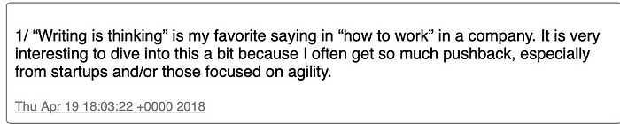

The first I heard the expression “writing is thinking” was from Peter Pathe, who not-so-coincidentally was the VP of the Word team in the major growth era. I learned a lot from him (“the best competitive feature I have against WordPerfect is Excel”).

It is really incredible the amount of pushback I see from companies, startups to big, about writing. In particular around the notion that writing is the antithesis of agile. Writing ossifies and cements decision or plans that should change, it is said. My view is that agility comes from planning. Without plans, activities are just _brownian_ motion. And you can’t have plans, especially shared plans, without writing.

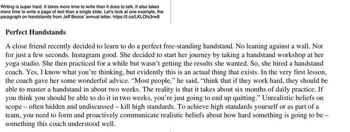

I love this excerpt from this year’s [Amazon letter](https://www.sec.gov/Archives/edgar/data/1018724/000119312518121161/d456916dex991.htm) on both levels. First, I still can’t do a handstand well after 15 years. Second, using this to illustrate the value of writing is great.

One thing that is super important to note (more later) is that Amazon is doing super well right now. That means every process or method inside Amazon is revealed and honored as being a causal factor for that success (inside and outside Amazon). That is a very risky thing to do.

All processes, no matter how innovative, positive, or even causal to success, will run their course. In particular as a company matures, processes \*always\* have a tendency to cease to function as a tool and become the result themselves. This is always a mess.

For example, it is likely that people are treating 6 page memos as “goals” unto themselves. Managers are likely evaluating employees on the memos as much as the results. And of course, you won’t find a lot of successful employees who can’t memo. This is not negative about Amazon, but literally every process becomes corrupt this way.

The second way processes become corrupt is how they are “gamed”. Several noted in follow up tweets that memos are no longer 6 readable pages. Fonts have shrunk to 10pt or less. Margins are .25". And no one would waste space on bullets, charts, or images. That gaming of a system, or the constraints that force positive creativity, is also always a side effect. Look at twitter—_restricting char cnt casued ppl 2 write diffrntly_.

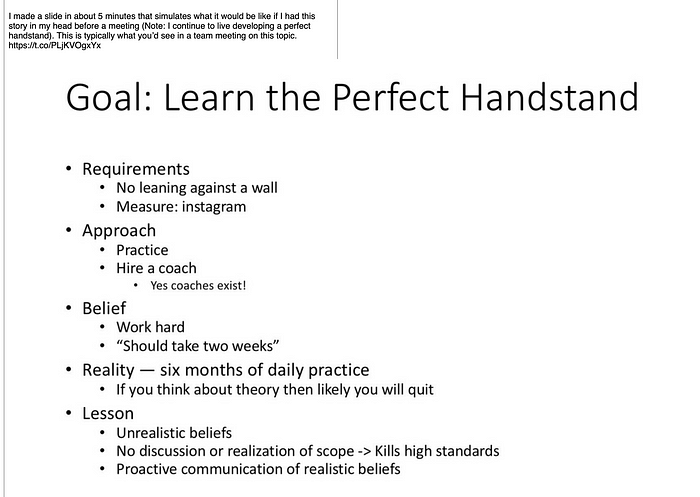

I love PowerPoint, more than I would love to do a handstand. The challenge I outlined here is that most “decks” are created hours before an important meeting and look like this. Most business decks outlining a strategy are woefully inadequate for evaluating a strategy based on depth of alternatives considered, side effects, costs, and above all rationale. Decks focus on the take-aways and tactics, and importantly are designed to sell.

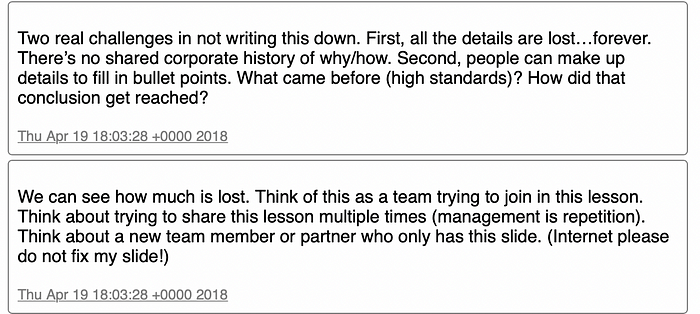

The biggest challenge with decks to communicate strategy is the ability for people, managers or individuals, to make up their own ground truth about what a bullet, lone graphic, or slide title implies. If you ever want to see this play out, watch something like a big org change roll out where the “tool” provided by exec management is deck with some moderate slide notes. The game of telephone would show how poor a transfer of information decks can be. Or another test is to consider the new employee just weeks later — how can they get up to speed looking at bullet points?

The biggest thing about writing down strategic choices is that they serve to build a corporate history (over a year or two, not really thinking about decades). Why decisions are made is rather important because companies, like people, can make the same mistakes over time without history.

If you sit down to write out a plan to a difficult situation, you might think you know the answer. This can be product, code, positioning, pricing anything. You can probably do a great job with the final “slide” and even have a quippy way of stating the result “good, better, best” or “lesser of two evils”, or “land and expand”. But why will that work? What in your experience led to concluding this can solve the problem?

Plus writing something for an audience is a way of making you consult representatives of that audience before publishing. What will marketing think? Will sales people be able to sell? Whether you consider those perspectives before or not does not change that they will react. This isn’t “buy-in” or “heads-up” but actually consulting the real stakeholders of a decision.

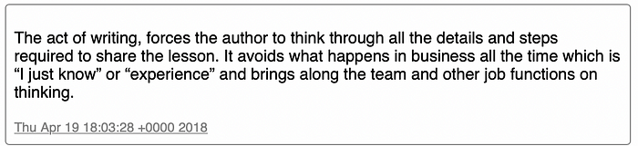

From the minute execution begins on a product (or decision or GTM or…) the divergence from the plan begins. If the plan is a deck or a speech, divergence is instant and rapid. With a detailed plan because people making all the “micr-decisions” day in and day out have the context for the plan—the framework, rationale, logic behind the decision—the organization is far more likely to make consistent tradeoffs.

Founders might spend too much time externally writing about venture, funding, being a founder, etc. when writing internally could help the company scale more effectively (to be fair, founders that write about those topics are probably more likely to be writing internally as well).

This is a much more effective tool than a slide listing 5 priorities in numerical order for a project only because the first decision to test the plan is almost always one that arises due to choices that question such a terse view of the world.

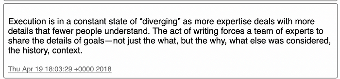

By far the biggest pushback over writing is that it takes time. Even for the best writers it is difficult to do well. There is a tradeoff no doubt. People tweeted Amazon six pagers that took months to write, which seems crazy to me (is the goal the memo or the work to be done?)

In particular, writing does not lend itself to an MVP. If you need to decide something you can only talk to people so much and certainly only a few people will be able or willing to give critical readings of memos before you are finished.

The most importantly memos I wrote at Microsoft were 15–20 pages. I had a few people who would go through them, but it took several to really get depth coverage across the memo that helped **enormously**. But I could really only count on one draft reading.

That means I had to really take responsibility and spend the time to do this well. But I agree with the ROI and that’s why I am writing this.

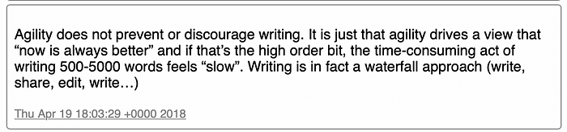

I believe that the fastest execution happens with a plan. I do not believe you can iterate your way to a robust execution at any scale beyond 3 or 4 people for 6–12 months. Beyond that level of scale, not only will individual efforts diverge from what was originally thought, the further out in time you go the less likely there will be a robust path to get there without a plan, even for a small group.

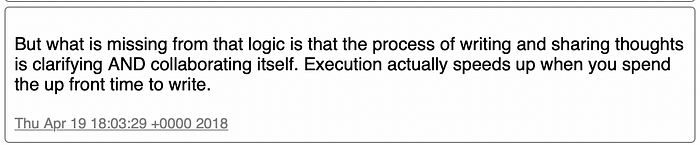

Writing (reading) really helps people if they are remote, if there is not a shared native language, or both. Writing can be difficult for some, for sure. That is why it is important to focus on the function, not the form. Don’t be afraid to help people (especially as a manager) through the process on the “basics” of writing.

My biggest pet peeve of “decks” is how there are people who will bang out a deck and use that skill to “own a meeting” or “own a strategy”. To me that is like the person that tries to take over a meeting by commanding a whiteboard. A deck is not a plan and should not be treated by one, even if the story it tells seems to work.

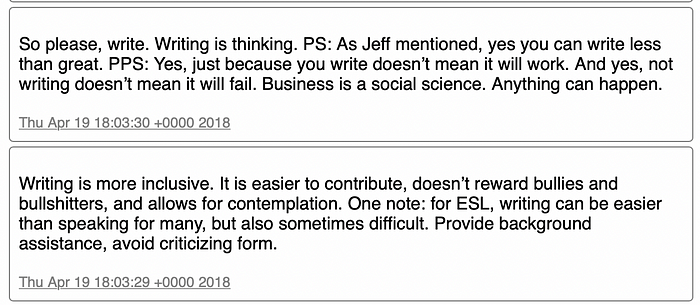

Are you creating a writing culture? Said in a way that I think makes more sense, is writing a core value of the company (team)? I hope so because I think it really matters and can help.

Writing is risky. So what culture doesn’t value risk taking? If you want to be sustainable the easiest risk to take is sharing ideas through writing.

The first people to stop writing in a company are often those that were there the longest or the execs. Writing is important for everyone. Execs need to write, and do their own writing. Don’t farm out to others to fill in the details from an outline. Having others do your writing for you is for when you’re a head of state making speeches every day and for when every word matters, not for business writing even for the largest of companies.

Writing takes practice. The only way to get more comfortable and more efficient art writing is to write more.

So get started.

—Steven

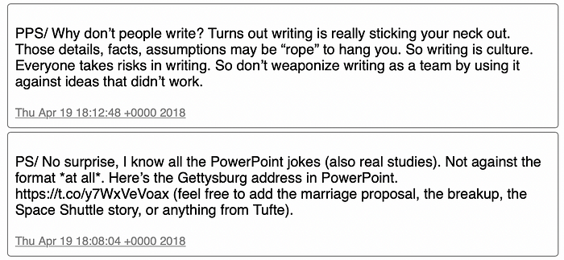

Below is the original thread from twitter:
------------------------------------------

1/ “Writing is thinking” is my favorite saying in “how to work” in a company. It is very interesting to dive into this a bit because I often get so much pushback, especially from startups and/or those focused on agility.

Writing is super hard. It takes more time to write than it does to talk. It also takes more time to write a page of text than a single slide. Let’s look at one example, the paragraph on handstands from Jeff Bezos’ annual letter.

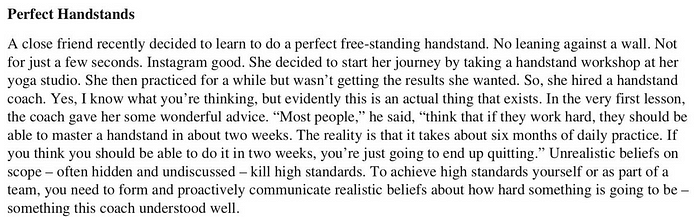

I made a slide in about 5 minutes that simulates what it would be like if I had this story in my head before a meeting (Note: I continue to live developing a perfect handstand). This is typically what you’d see in a team meeting on this topic.

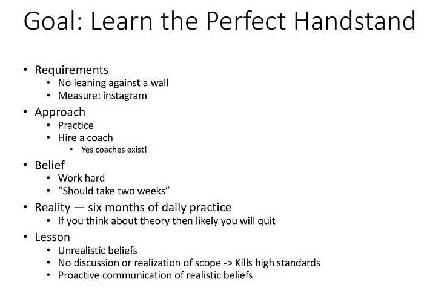

We can see how much is lost. Think of this as a team trying to join in this lesson. Think about trying to share this lesson multiple times (management is repetition). Think about a new team member or partner who only has this slide. (Internet please do not fix my slide!)

Two real challenges in not writing this down. First, all the details are lost…forever. There’s no shared corporate history of why/how. Second, people can make up details to fill in bullet points. What came before (high standards)? How did that conclusion get reached?

The act of writing, forces the author to think through all the details and steps required to share the lesson. It avoids what happens in business all the time which is “I just know” or “experience” and brings along the team and other job functions on thinking.

Execution is in a constant state of “diverging” as more expertise deals with more details that fewer people understand. The act of writing forces a team of experts to share the details of goals — not just the what, but the why, what else was considered, the history, context.

Agility does not prevent or discourage writing. It is just that agility drives a view that “now is always better” and if that’s the high order bit, the time-consuming act of writing 500–5000 words feels “slow”. Writing is in fact a waterfall approach (write, share, edit, write…)

But what is missing from that logic is that the process of writing and sharing thoughts is clarifying AND collaborating itself. Execution actually speeds up when you spend the up front time to write.

Writing is more inclusive. It is easier to contribute, doesn’t reward bullies and bullshitters, and allows for contemplation. One note: for ESL, writing can be easier than speaking for many, but also sometimes difficult. Provide background assistance, avoid criticizing form.

So please, write. Writing is thinking. PS: As Jeff mentioned, yes you can write less than great. PPS: Yes, just because you write doesn’t mean it will work. And yes, not writing doesn’t mean it will fail. Business is a social science. Anything can happen.

PS/ No surprise, I know all the PowerPoint jokes (also real studies). Not against the format \*at all\*. Here’s the Gettysburg address in PowerPoint. [https://t.co/y7WxVeVoax](https://t.co/y7WxVeVoax) (feel free to add the marriage proposal, the breakup, the Space Shuttle story, or anything from Tufte).

PPS/ Why don’t people write? Turns out writing is really sticking your neck out. Those details, facts, assumptions may be “rope” to hang you. So writing is culture. Everyone takes risks in writing. So don’t weaponize writing as a team by using it against ideas that didn’t work.