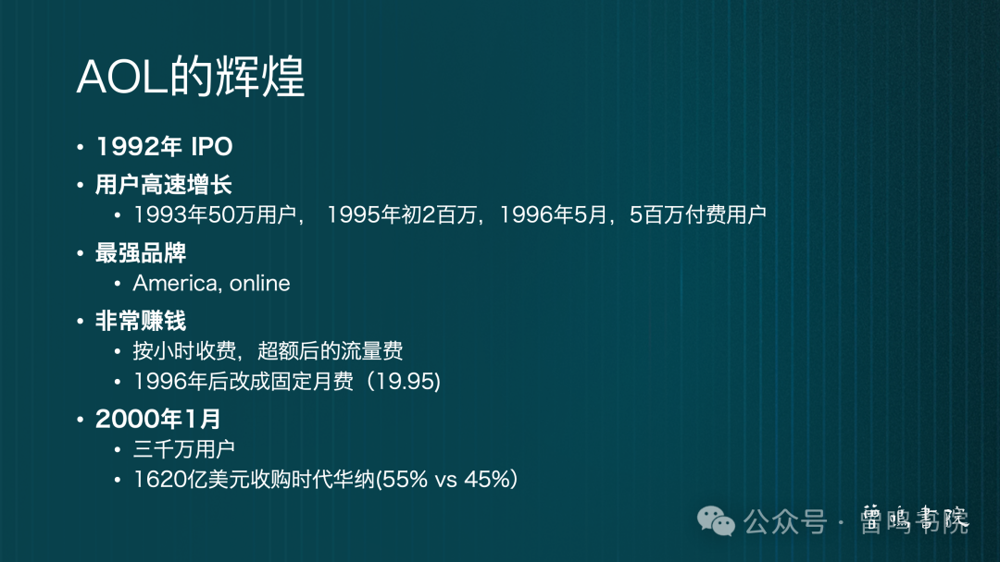
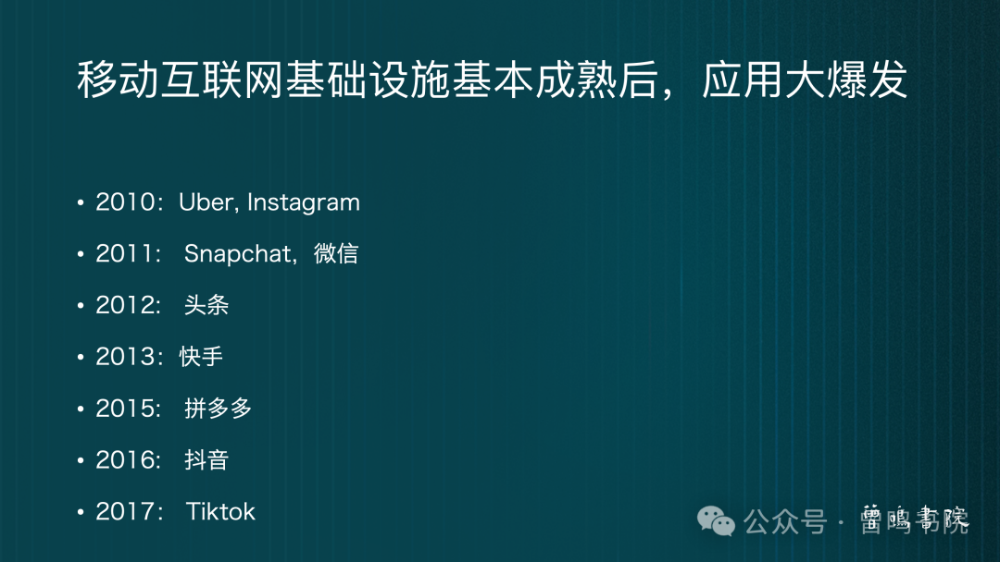
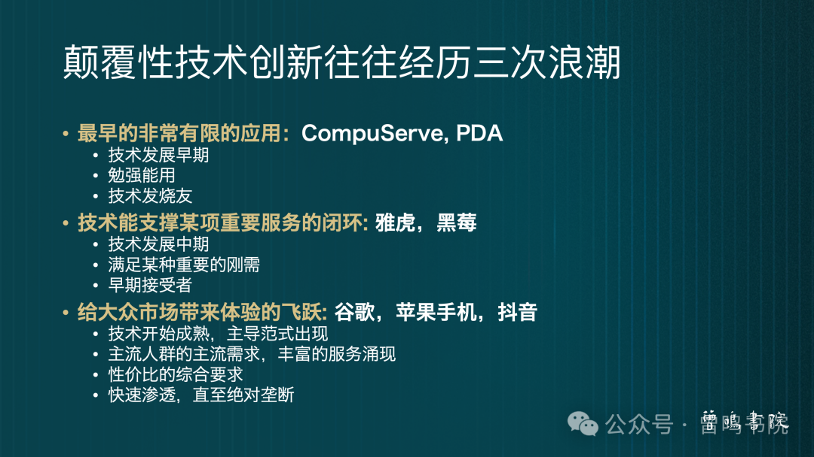
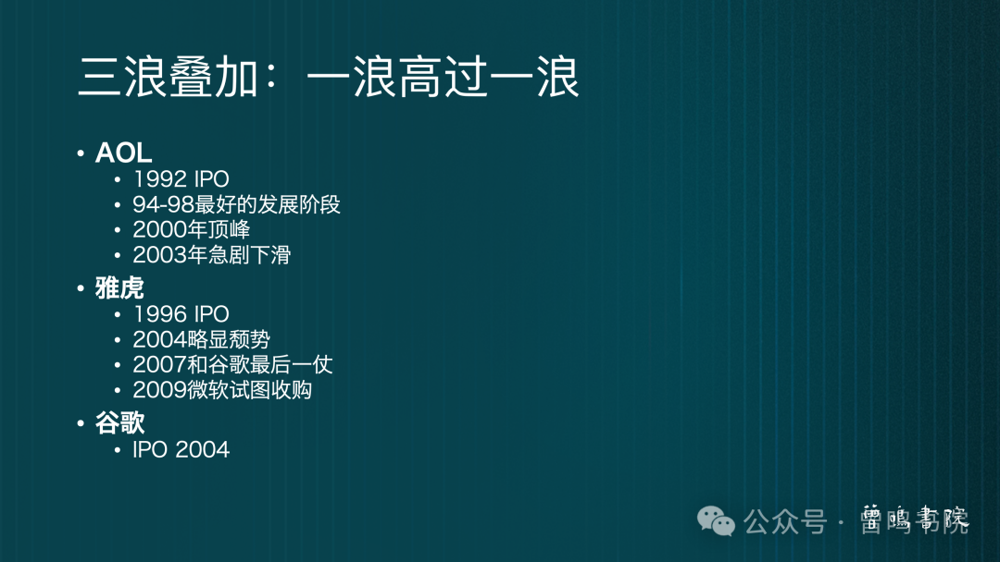

Title: 【曾鸣演讲全文】我们正迎来AGI的雅虎时刻

URL Source: https://mp.weixin.qq.com/s/0VTyOPwZaXVpCsj0IeyDVw

Markdown Content:

昨天下午，曾鸣教授以“原生应用的爆发和演进”为主题，与大家分享了颠覆性技术驱动商业变革背后的思考过程及框架，以下是文字整理稿。

全文10000字，阅读时间较长，或者你也可以点击右上角“…”选择“听全文”的方式，让AI为你朗读全文。

  

**0****1**

****AGI商业化的初始问题****

今天分享的是过去一年我对几个问题的思考：

*   _AGI今天处于什么样的发展阶段？怎么判断？_
    
*   _怎么理解ChatGPT的成功，它未来会怎么发展？_
    
*   _会不会出现比ChatGPT更成功的2C的服务，如果是，大概长什么样？什么时候？_
    

以前我更多讲某个理论，今天的分享更多是整个思考和推演过程，希望给大家带来一些规律性的启发。‍‍‍‍‍‍‍‍

过去两年发生最重要的事情就是ChatGPT，从2022年11月份到今天，彻底开启大众对于这一轮AGI（通用人工智能）的认知，这是历史上最快达到一个亿用户的服务，用了不到两个月的时间，而且引起全球24小时不休不眠的讨论——人类社会是不是正在用最快的速度进入人工智能阶段？

但ChatGPT在经历不到一年高速增长以后，就进入很长时间的横盘，大家可以看到上图，差不多从2023年的5月份开始，月用户数一直下降，到2024年初，其开放免费注册等一系列动作，有一个极具上涨，但很快又下滑下来。

所以这个现象带来一个非常有意思的困惑，为什么一个看起来这么有吸引力的产品，并没有出现我们期待的指数级增长，到底怎么判断ChatGPT，它到底是一个怎么样性质的产品？

另外跟ChatGPT同时出现的几个2C应用——Character.AI、Perplexity和POE发展得也不好。Character.AI基本上卖掉了，主要核心团队又回到了谷歌，用户数在千万级横盘了很久；Perplexity的用户数增长碰到很大的挑战。同时在国内类似的2C应用也没有真正起飞，虽然这半年豆包起步更快，让人看到了一点更有意思的未来，但至少到目前为止，这也不算是指数级增长的2C大应用。

回到刚才的初始问题，要回答清楚这几个问题，要先解释原生应用的定义。

首先，原生应用一定是充分利用了新技术的技术优势；第二，它一定是用户体验的巨大创新；另外，它一定是探索出了新的商业模式，而且是很赚钱的商业模式，只有达到这一点，企业才能够自己造血养活自己，持续投入去做研发，让技术进入下一个阶段不断优化发展。如果不能够有很好的商业模式，就赚不到钱，用户数也不能真正高速增长。所以这里说的原生应用，特指有海量用户、指数级增长的国民级应用，因为它们开启了一个新的时代。

讲了这个概念以后，我也给出初步结论——我们正在迎来AGI时代的第一个原生应用，或者说，我们正在迎来AGI的雅虎时刻。

为什么是雅虎时刻？第一，我给ChatGPT的定义，它是一个垂直整合的超级应用，就像历史上PC互联网早期的美国在线（AOL），和iPhone手机之前的黑莓手机；第二，这是一个对未来技术发展的趋势判断，一方面大语言模型还在高速发展，同时产业化的进程也开始产生非常大的作用，大模型的使用成本（Token的成本）正在急剧的下降。

基于这两个判断，我们很可能在未来一两年看到改变我们生活的、AGI领域的第一个原生应用。

**02**

**过去四十年的商业大变革**

接下来开始我的推演过程，很遗憾没有海量数据，我们只能从历史发展过程中试图找出一些规律性的东西。回顾过往40年，大概从1980年开始，这场技术大变革其实就是三个核心词：计算、连接、机器决策。计算是从个人电脑开始；PC互联网时代是电脑既可以计算又可以上网，通讯跟计算第一次合而为一；然后到了google时代开始有算法，算法开始做各种各样的决策，今天AGI其实就是机器做决策的时代。

**个人电脑的发展史**

这场四十年革命的起点，是1977年的苹果电脑。但是真正GUI图形界面，个人电脑的交互界面，是Macintosh在1984年真正推出的，上图这几家公司各自火了5到6年，定义了PC时代一个接一个的王者。

大家非常熟悉的英特尔CPU和微软的操作系统，其实是到1995年才真正开始起飞，那一年英特尔终于从486升级到奔腾，Windows经过1.0、2.0、3.0,到Win95终于有质的飞跃。

所以个人电脑真正发展起点是1995年，加速的原因之一是因为有了互联网应用，大家发现电脑其实能起更多的作用，不仅仅是一个工具。

**最早的互联网服务：拨号上网（ISP）**

美国在线（AOL），在2000年互联网泡沫破裂的时候，是全球估值最高的一家互联网公司。但这其实是第一浪里出现的巨无霸公司。这一浪里第一家公司是Compuserve，1969年成立，做计算算力，提供分时主机计算服务，到1989年转型成为第一家提供互联网上网服务的公司，最简单的服务就是论坛（Forum），后面叫BBS，也叫Chatroom。

1990年，当时最牛的计算机公司IBM，和当时最牛的零售企业Sears，高举高打，他们商业模式就是广告式购物，提供最好的内容。美国在线1983年就成立了，提供私有的上网服务，1989年开始全力聚焦在互联网上。

**AOL(美国在线)的辉煌**

简单讲一下AOL（美国在线），作为那个时代的辉煌，1992年就IPO了，在当时的标准用户增长非常快——1993年50万用户，1995年200万用户，1996年到了500万用户。当时是最强的品牌，那时候大家都知道，上线就是AOL。当时拨号上网，通过“猫”拨号就是他们做的事情。2000年1月是它的高峰，将近3000万的用户，1600多亿的估值。

**互联网服务的第二阶段：从封闭到开放**

但真正进入互联网时代，前面三家其实都相对封闭，没有开放互联网服务，直到1993年出现Netscape浏览器，能够读任何网页，确立了网页的标准，让生产网页的门槛急剧下降，也让用户能够触达网页的壁垒急剧下降。所以Netscape出现，是第一个互联网技术领先的成功案例。但它还是延续了软件思维，收每个软件拷贝的费用，按软件公司的模式上市。

**雅虎的辉煌**

1994年，海量内容开始涌现，出现了纯互联网公司。第一家就是雅虎，这个故事大家很熟悉了，杨致远和David Filo在读博士的时候无聊，两个人开始比赛，比谁编的网站更新更多更酷，编着编着就编成互联网第一个目录，然后变成一个导航网站，由于内容不断涌现，当时出现了最早的搜索，有些技术专家认为搜索应该是未来，不应该是编辑。因为前期内容并没有那么多，搜索技术又差，早期雅虎完全压住所谓的搜索派。1996年互联网开始出现各种各样的服务：新闻、股票、邮件、社交，进入了门户时代。

往前，AOL等企业是自营内容，包括IBM这类都是自己编辑的最好内容，但到了雅虎时代全网原生内容，不管什么样的网页都有人在做，才出现了百万级甚至千万级的网页，这个时候会员费不再存在。

前面提及1994、1995年为什么重要，其实是Win95PC渗透率开始急剧加强，但是PC加强的原因之一也是因为有了雅虎这样的应用，PC的渗透率上去以后，雅虎的渗透率直接跟着一起同步上升，90年代雅虎就是互联网。

雅虎当时做了非常大的传统广告投入，建立非常强大的品牌，又是最早引入新闻、体育、金融等各种各样的频道，变成一个强大的媒体矩阵，后续又引入邮件、聊天、购物、游戏等等，它就是一个门户，无所不包一个互联网入口。

那个时候大家意识到，流量入口的概念是一个胜负手，因为所有的互联网服务都从这个入口进来。刚才讲到原生应用都会创造原生的商业模式，它的商业模式就是Banner广告，Banner是第一次相对精准的广告，可以根据实际的点击才产生费用，点击意味着看广告的人真的对你感兴趣，就是有效用户，创造了一个全新的广告模式。

雅虎之后大家知道，广告就是一个标配的互联网模式，所以到2000年，互联网第一次大泡沫的时候，刚才讲到AOL市值最高1620亿，雅虎大概在1400亿，也成为非常强大的一家互联网公司，这是原生应用第一个典型的案例。

**搜索的激烈竞争**

在雅虎一骑绝尘，从最早的Directory到门户，再到全媒体矩阵的过程中间，搜索也在平行时空进行着激烈的竞争，1994年开始，有了基于最原始爬虫的搜索技术，1995年的Excite、 Lycos、 AltaVista已经是现代搜索的早期，AItaVista到2000年的时候，仅次于雅虎，是少数几个大的流量入口，有17%的互联网用户，Google那时候才7%。

**谷歌：互联网原生应用2.0**

Google是1996年在斯坦福的校友网上线，也就是说PageRank算法的雏形1996年就上线了，虽然他们到1998年才决定创业，可以看到1994年到1998年，搜索是一个相当热门的领域。只是门户是一个主线是明线，搜索是一个暗线，在雅虎如日中天的时候，搜索外包给了Google，因为不觉得它重要。

Google是我们看到的另外一个原生应用的典型，甚至可以把它叫做雅虎的升级版，是原生应用的2.0，在互联网更加成熟之后，有了更丰富的内容，检索已经没有办法处理好这样的信息匹配，效率非常低。这种情形像2007年，在淘宝当时感受也非常明显，涌上来的几千万用户想要找到他们想要的商品，原来的技术使得匹配效率急剧下降，这个时候只有用上基于相关性很复杂的PageRank这样的算法，用户才能够跟合适的内容、合适的商品匹配上。

Google是互联网原生应用2.0，刚才定义里面的几点在它身上都有非常鲜明的体现。第一，原来中国的门户网站，都是密密麻麻大大小小的字体，而Google就是一个搜索框，打入几个关键字，出来一个搜索结果页，从第一名排到第十几名，相关性排序，非常清楚简洁，目标就是让你找到想要的赶快走，时间越短越好，完全是一个用户体验的颠覆。

只有技术到了这个阶段，内容丰富到这个程度，才能产生这样的用户体验。可以看到技术的两个方面：一个是刚才讲到PageRank算法的突破，带来了复杂计算的可能。但是这么海量的技术和复杂的计算，能在这么短的时间，用这么低的成本完成，是因为基础设施也进入一个全新的阶段。

今天所熟悉的云计算，其实是Google最早发明的，也就是分布式计算。我们今天讲3万台GPU联网，变成了现代数据中心，那个时候就是一万台的PC服务器能不能够联网做并行计算，变成一个云计算的Cluster(云计算集群）。只有在那种情况下才能用越来越低的成本，服务越来越多的客户。

同时还有一点，广告模式的创新，刚才讲到雅虎创造的Banner广告，已经是一次精准化方向的很大突破，相对于传统广告，效果付费的广告模式是一个更大的创新，因为它连价格都是由市场实时竞价产生的，任何一个广告位在这个时间点搜什么价格是由供给跟需求同时决定的，也是由算法直接决定的。

真正的精准营销把广告完全从一个不可估判的效果，变成了可以完全精准的可变成本的使用。因为知道广告投下去能带来什么效果，可以把它变成一个精准营销的工具，企业之间的竞争就发生了很大的变化，所以在Google出现了以后，就出现了全世界的广告都向Google不断流去的过程，基于这样的基础才有了Google做到多维度的集成创新，但是它也实现了长期高增长跟持续垄断，这是一个互联网时代原生应用2.0的经典例子。

**P****C互联网的发展与爆发**

我们快速回顾一下，刚才讲到原生服务演进的几个要求。

第一，充分发挥新技术的优势，创造新颖的用户体验和新的商业模式，按照这个标准，美国在线（AOL）还不是严格意义上的原生服务，但是它推动了各种基础设施的完善，完成某些简单服务的闭环，它自己是一个完全封闭的垂直应用。

第二，到底哪些服务在上面能完成，AOL之所以成为王者是因为当时找到了一个新的应用——在线聊天，聊天技术可以支持图片发送，大家可以想象很多图片是擦边图片，这样的聊天内容当时占了他们50%以上的比例，迎来了第一次应用的大爆发，它完成了简单服务的闭环，但是当时的技术不太成熟。

雅虎就是一个比较纯粹的互联网原生服务，基于一个开放的互联网网络，第一次出现UGC的概念，用户自己创造海量内容，它只是做了编辑跟导航的动作，但带来了越来越精准、越来越丰富的信息跟服务，开启了互联网时代，然后有Banner广告创新。由于互联网技术的进一步发展，内容进一步爆发，有Google集大成的技术创新，用户体验和商业模式的创新，带来了原生服务2.0，这大概是互联网15年的发展历程。

当Google原生服务2.0爆发以后，就自然出现了脸书、YouTube、推特等同一时代的原生服务，占据了几个主要的应用领域。

原生应用需要时间来孕育，但是它能够真正带来大众用户，然后成为新商业范式的领导者，最后原生服务2.0的企业都比较成功完成了移动互联网的转型。PC互联网原生服务1.0的第一波企业，除了亚马逊活到今天，其他企业基本都是非常小的存在，这是一个非常有意思的现象，值得大家留意。

**T****he PDAs（个人数字助理）**

上述是第一个完整的案例，再看第二个案例，大家自然而然想到移动互联网。

大家一讲到移动互联网就会想到iPhone，但实际上iPhone是很后面的事情，最早iPhone或者说智能手机的前身是PDA，有人还听过Newton这个产品，是1993年推出来的，太早推出了，完全失败了，产品一直迭代到第三代才稍微可用，但用户那时候已经对这个产品失去了兴趣。

这时候出现一家很有意思的公司Palm，它理解了技术的局限，做出了一个最简单的产品，一个Digital Calendar（数码日历），把你原来手写的记事本变成数字化的记事本，把功能建到最小化闭环，然后用户有时间再跟PC同步一下，大部分时候就带着一个巴掌大的电子记事本，这是第一代产品。

这时候出现了一个很火的公司，也是黑莓的前身，最早做拨号上网的“猫”，1996年、1998年、1999年做了比较成功的PDA，核心就是它上网比较可靠，因为做通信起家，这也是对于Smartphone这个概念早期的尝试。

**IPhone的出现**

Smartphone这个概念，是爱立信1997年正式提出的。而第一个真正做智能手机的，其实是PC厂家，PC厂家把PC移动化相当于智能手机的前身。当时IBM做了第一台智能手机，1994年样机出来以后，几乎有了后面智能手机所有的功能，但技术太早，产品太贵，太不好用，卖了几万台就停掉，没有再继续开发下去。

当时手机巨头诺基亚也做了这个，手机翻盖以后弹出一个全键盘，是一款很火的智能手机，而真正那个时代的王者是黑莓，这也是一家在不到十年时间达到1000亿美金市值的公司，它实际上击穿了一个小众市场，就是财富500强公司的管理人员，实现了一个核心功能，即邮件可以随时在线，让它轰动一时事件就是911爆发，当时只有黑莓的手机传出第一个完整的信息，即使在2010年iPhone4都已经发布，黑莓在美国还有43%的市场，而iPhone那一年只有10%多一些的市场。

2007年，新款iPhone发布，触摸屏加原生的操作系统，让用户体验有了一个质的飞跃，让互联网上网体验在触摸屏上变得非常丝滑，这才有了所谓原生用户体验的提升。

2008年，iPhone3G让随时在线的体验有了很大的改善，Appstore也是一个非常天才的想法，让整个应用开始有了爆发性的增长，今天所熟悉的App应用都是基于2008年苹果的原创，也是一个原创的商业模式。App应用收费是一个非常赚钱的业务，实际上是在分发移动互联网时代的服务，也是流量入口，又回到上面的基本逻辑，原生服务就是流量入口，分发这个时代最原生的内容或者服务。

**移动互联网应用大爆发**

2010年是一个标志性的时间点。一方面，iPhone本身的渗透率开始大幅度提升，产品达到新的性能高度，另外一方面，屏幕的分辨率大幅度提升，原来很多优势开始发挥出来。比如屏幕分辨率低的时候，拍照没有很大的意义，第三iPhone4的摄像头相机达到500万像素，其实已经跟大部分单反的数字相机很接近了，这个时候所谓图文的图就变成一个非常核心的应用，所以2010年是硬件跟生态底层基础设施成熟的一个标志性年份。

然后超级应用开始井喷，指数级的增长。比如像Uber肯定是一个原生的应用，没有手机不能随时定位，不能当场做算法的匹配，Uber完全就不可能存在；微信最早的一个功能大家感觉不那么震撼，到群聊功能后就很有原生的感觉，等到朋友圈出来，这个功能就是刚才讲的原生全新的超出预期的体验；再到后面，头条跟推荐结合起来，快手出现，开始推动视频发展，到2016年视频跟推荐算法的结合，开始出现抖音跟TikTok。大家可以看到，移动互联网的超级应用是怎么随着基础设施开始产生原生应用的一系列大爆发。

**03**

 **颠覆性技术创新的三次浪潮**

**

**三次浪潮**  

**

**三次浪潮**

刚才讲的都是我能梳理出来的历史发展，但是基于这些历史发展看到了一些很有意思的规律，颠覆性技术创新往往经历三次浪潮。

最早的非常有限的应用：拨号上网时代，PDA时代。这是技术发展的早期，产品勉强能用，只有最简单的功能，产品只有发烧友才会用。

第二阶段，技术能够支撑某项重要业务的闭环。雅虎最早就是看海量信息、新闻、各种各样的内容，所以它是一个媒体公司，这时候往往进入技术发展的中期，能够满足某种重要的刚需，这个刚需应该足够覆盖相当的人群，至少是早期的接受者，黑莓是非常典型的，打穿了商务用户的办公需求，典型的场景就是邮件来往。

第三阶段，给大众市场带来体验的飞跃。Google、苹果手机、抖音、微信等等。当技术开始逐步成熟，主导范式出现，主流人群的主流需求和丰富的服务涌现。各个领域都开始出现不同但同样精彩的原生应用，性价比的综合要求越来越高，因为只有性价比达到新的高度，普通用户才能够接受。这个时候由于使用的门槛，一般的用户很容易就能上手，也能够实现快速渗透，最后到占领主流市场形成持续的垄断。

这是颠覆性技术创新的三次浪潮。

这三次浪潮背后，我们讲的原生应用的概念，实际上对应了两个鸿沟：《跨越鸿沟》那本书只讲了第二个鸿沟，这次梳理发现，第一个鸿沟其实也是一个很大的鸿沟。从黑莓到苹果，从AOL到雅虎，其实都是很难跨过去的鸿沟，因为早期产品就是给技术人员和发烧友用的，他们对于客户价值的需求是完全不一样的。

《跨越鸿沟》那张图也可以用上面这幅图来表现，来源于颠覆性创新，讲技术怎么从边缘去突破客户价值。

实际上，技术创新也经历了三个阶段。阶段一，就是发烧友的阶段，他们对产品的需求性能要求不高，就是尝鲜，觉得技术应该要突破做成某个事情，能做成就很嗨，所以对产品或者事情本身没有那么高的期望值。

第二阶段，技术经过长期的积累，终于能够跨过这批用户的门槛，这是第一次小众用户的突破。但是AOL的突破峰值3000万用户，和雅虎的峰值是5000万日活，是两个完全不同的概念。雅虎已经进入相当大的主流市场，技术必须成熟到更高的阶段，它才能够提供足够丰富的内容，足够好的体验，足够低的成本，雅虎通过广告的收入，能够覆盖海量用户各类服务的所有成本，还能赚钱。

这时候可以看到，对应的是完全不同的目标人群，完全不同的客户价值和客户预期。这要求技术上一个全新的台阶，当然技术也有一个演化的轨迹，再去实现用户价值的某种突破，才能够打开市场。黑莓也是一个非常典型的例子，把办公的用户需求打穿，就能有几千万用户，它的高峰一年大概能卖5000万台，是一个相当大的数字。

第三阶段，原生应用2.0的阶段，Google的时代，用户数要达到日活1亿、2亿、3亿的时候，就是国民级的应用，肯定是零使用门槛，各种各样的服务都能满足，才能服务多元用户不同的需求，成本还得再有一个指数级的下降，才能够得着剩下百分之六七十的用户，他们的核心需求。

所以当你从这个角度看，就能看到三个不同的用户人群，和他们完全不同的用户需求，对应了完全不同的技术要求和技术发展的轨迹，最重要的这不是一个线性的过程，基本都是跳跃式阶梯发展的过程。

而这个阶梯跳跃就是跨越鸿沟的过程。第一阶段的王者往往会被第二阶段的王者给灭掉，直到第三阶段的王者把大众市场的50%吃掉，逐渐形成绝对垄断，前面的先行优势最后都不会是特别大的持续优势。

这两张图是相对的理论框架，帮助大家理解颠覆性创新的三浪，三个不同的用户人群，从革新者到早期使用者到主流的大众人群，以及跨越鸿沟所需要的难度。

我们通过过去发生的这几个市场，以及PC时代、PC互联网时代、智能手机时代跟移动应用时代，这四个历史阶段的发展，大致验证了这两个理论框架。这就是我想讲的最核心内容，整个思考过程、两个分析框架和一些初步的结论。

****

****我们来看这个中间的过程，三浪叠加，一浪高过一浪。****

刚才讲AOL1992年IPO，1989年转型做拨号上网，1994-1998年是非常漂亮的增长曲线，2000年巅峰是市值最高的互联网公司，但在2002年开始下滑，2004年是悬崖式的下滑。

雅虎在1995年成立，18个月不到就IPO创造了历史，2004年开始已经不行了，但当时公司的市值还很高，影响力还非常大，因为它的品牌一直到2007年可能都还比google强。我2007年还参与了雅虎和Google的最后一战——巴拿马之战，雅虎把自己所有的广告竞价系统做了技术升级，那仗输掉了，雅虎就缴枪了。那时候微软还是愿意以一千多亿到两千多亿买雅虎的，雅虎抛开阿里巴巴40%的股权价值以后，最后以不到50亿美金卖掉。

Google2004年才IPO，1998年的，想以100万美元卖给雅虎或者AItaVista，但这两家公司都不肯买。2003年，雅虎当时初步谈30亿美金买google，董事会回复再考虑一下，两个月再回去说愿意买的时候，Google说我们现在要50亿美金，最后双方没谈成。

大家可以看到，上图用户数的交叉，1996年雅虎开始加速，到1998年开始赶超AOL，一直到2002年用户数才真正超过AOL，超过以后，AOL就急剧下降。实际上二浪一起来，一浪彻底崩掉了，三浪一起来二浪也就崩掉了，只是下一浪起来的那个孕育时间可能需要3-4年的时间，这时间包括把商业模式打磨出来。

新的就孕育在旧的之中，回到最早讲战略的时候，经常提到——看不见，看不起，看不懂，学不会，挡不住，基本上是这样一个过程。第二浪压过来，第三浪再盖过去。

特别有意思的是，每一浪里，又有三个基本上按这个顺序出来的三家很牛的公司。第一家公司基本上是技术人员创业，因为技术太难了，搞定技术make it work，让技术终于能干点再蠢也能干成的事情，最早拨号上网终于能拨上去了，恨不得把家里电话线给拔了，做出来就是一个工具，这时候只有技术，别的不用说。

第二阶段，像雅虎的出现，技术真正开始被人用了，开始出现内容，比如像苹果时代出现各种各样的APP，这个时候开始有入口的概念，大家开始看这些服务，要触达这些服务，开始进入内容跟用户的匹配阶段。

第三阶段，这时候已经有海量内容，用户真正要的是体验——体验的丰富度、体验的原创，成本是不是够低，能不能够支撑得住海量用户的持续增长。  

把今天讲的公司全部放在上图，好多浪叠加，描绘了过去40年技术的进步。

今天讲的所有内容，都是我在思考怎么看未来。我经常讲新时代的战略就是看十年、想三年，干一年。我其实就是在告诉大家怎么看十年，这是我自己看十年思考的推演，重要的不是这个结论，而是这样的思考和推理框架，希望帮助大家以后重新审视自己的业务。

从产业演化的大浪来说，只有突破大众市场以后，技术创新者才有机会获得真正长期的巨大商业价值，也就是说要跨越那个鸿沟，真正打穿大众市场，才是原生应用，才有机会获得至少雅虎那样的辉煌。

创业者的视角看，有两个问题是特别关键的问题，一是我们处在产业发展的第几浪，第一浪的打法跟第二浪打法不一样，第二浪跟第三浪不一样，如果在第一浪尾部又想打第二浪，怎么跨越鸿沟？你的目标是做第三浪的王者，但是今天产业还在第一浪，该怎么办？是给别人打工还是自己创业积累经验，还是要先等到第二浪出来再琢磨第三浪的事情？在这中间其实是一个非常重要的长周期判断，决定了你今天该取一个什么样的定位。

第二个问题，是你该定位做哪一类的选手，是技术领先的选手，还是内容领先的选手，还是体验领先的选手，这三个都一样，体验领先对产品经理有很高要求，如果是前期技术领先就是技术牛到，让一个看起来不可能完成的任务完成第一次闭环。

**04**

****AGI商业化初步判断：我们正迎来“雅虎时刻”****

****AGI的前奏****

回到AGI，我今天讲的所有AGI都有特定含义，都是ChatGPT引导大家谈论的AGI这一轮。在这个意义上，2012年Alex Net第一次用GPU完成了视觉图形识别的一次突破，这在AI历史上是一个标志性的事件。实际上也引起第一轮AI创业，这些都算是AGI的前奏。

****AGI的第一浪：AIGC****

AGI的第一浪，其实是以ChatGPT爆火带出来的AIGC（生成式AI），大家也能看到一浪的味道。2014年在Computer vision最火的时候，2015年这帮最有愿景的人已经站出来说我们要做更加通用的AGI，但未来的AGI是什么？他们其实并不知道，所以各种方向都试了一遍，像AlphaGo一样，也做过游戏，但是到2017年Transformer那篇文章发表以后，open AI所有的精力开始聚焦在Transformer的方向上，开始做大语言模型。

2020年，ChatGPT3.0开始有智能涌现的时候，前沿这批人就知道这已经是一个新时代的开启，只有到ChatGPT这个应用被发布的时候，用户或者大众才感知到这原来真的是一个不同的东西，它真的是有智商的，这是AIGC的第一浪。

****AGI商业化的初步判断****

如果确认这是第一浪，结合上述对各个公司的讨论，大家再来看一开始给到的初步结论，为什么说这是AGI的雅虎时刻？

首先我并不认为ChatGPT是一个雅虎级别的原生应用，ChatGPT其实是一个垂直整合的超级应用，Open AI从最底下数据中心到大语言模型再到上面的应用，其实是封闭体系，跟AOL其实很像。

第二，其实ChatGPT的使用门槛很高，它最主要的用户两类：一类是调用API的，其实算是专业级开发者；一类是普通用户，普通用户又分两类：一类是简单的问问话，发现挺好玩的，它能够补充一些搜索可能回答不那么好的问题，偶尔用用，好奇心过了，可能也就忘了。一类是相对用的比较好，把它当做Copilot（个人助手），这批人现在是ChatGPT的核心用户，在这个意义上其实很像黑莓，他们是对生产力要求很高的专业用户。

但是大家想讲的GPT未来会成为一个OS，这个事情其实并没有真实的发生，或者说正在开始发生。所以这次讲的ChatGPT，特别是最近O1的发布，表明大语言模型其实还在高速发展，人工智能的通用程度、智能水平还在往上升，但是我们同时看到AGI正在快速全面的产业化，推理的成本在下降，infrastructure的成本也在急剧的下降，实际上将来应用、调用大模型的使用成本也在急剧的下降。也就是说支撑越来越多的应用发生的前提条件正越来越成熟。所以在这个意义上，我们可能正在迎来一个雅虎时刻，类似雅虎这样的第一个AGI原生应用，正在某个人的脑子里，或正在某一个小团队的潜伏期里面。

原因是大语言模型的智能程度已经达到了一定的高度，同时它的应用成本在急剧下降，加上整个生态在快速的做垂直分层，其实它越来越变成水平分工的一个生态，水平分工的生态出现以后，是更容易做集成创新的，而且每一个水平层面自己的性能会加快提升，成本会加速下降，整个大模型的生态是在越来越健康的发展。

基于这两个判断，我觉得能够产生全新用户体验、带来巨大客户价值、同时能有创新商业模式的第一个AGI的原生应用正在被孵化，很可能在未来两三年会破茧而出，我们会看到一个用户指数级增长的全新应用。
