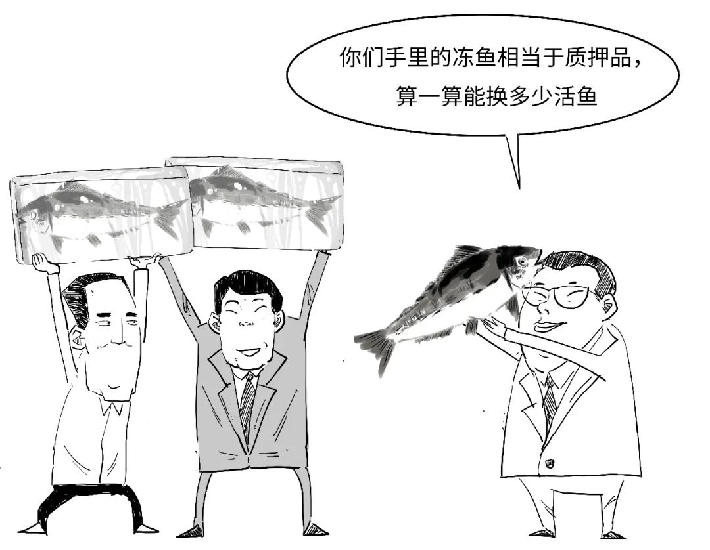

Title: 一口气搞懂SFISF是给股市送子弹吗？

URL Source: https://mp.weixin.qq.com/s/kwqjqkW3TXuttuhenfwc8g

Markdown Content:
公众号修改了**推送规则**，**不想错过**我们的文章，烦请把本号**设为星标：**

点击本文题目下方的**第2个**蓝色字体“**三折人生**”，再点击右上角的“**···**”，在跳出的选择框中，选择“设为星标”或者“置顶公众号”即可。

* * *

2024年10月21日，

央行发布了**SFISF**首次操作结果公告，金额**500亿元**！

我们今天来简单聊两句SFISF到底啥意思。

大家知道，**金融机构**除了**银行**以外，还有证券公司、基金公司、保险公司这类**非银金融机构**。

银行如果缺钱了，

是可以向**央行**申请贷款的。

但**非银金融机构**缺钱了，

央行是不能直接向其提供贷款的。  

那该咋办呢？

**SFISF**全称是Securities, Funds and Insurance companies Swap Facility，也就是证券、基金、保险公司**互换便利**的意思。

互换会存在期限，

双方需要**到期偿还**互换的债券。

这是一种“**以券换券**”的方式，

符合条件的证券、基金、保险公司可以用债券、股票ETF、沪深300成份股、公募REITs等**资产**，从**央行**换入国债、央票等**高等级流动性资产**。

在SFISF流程中，

央行会委托**特定**的**公开市场业务一级交易商**来代理操作。

这里找的特定的代理人就是**中债增**，全称是**中债信用增进投资股份有限公司**。

该公司是我国首家专业债券信用增进机构。

我们来简单看看业务流程。

央行通过公开招标确定SFISF的**互换费率**和**中标结果**。  

互换费率是采用**荷兰式招标**确定的。

啥是荷兰式招标？

所有中标者，以所有**中标价格**中的**最低价格**成交。

然后，央行交由**中债增**以债券**借贷**的方式，

将国债或央票换出给**中标**的机构。

但问题又来了，

“冻鱼”可以换多少“活鱼”呢？

质押率原则上不超过**90%**，

也就是一般最多只能按照“冻鱼”价值的90%来换相应“活鱼”。

可见，非银金融机构相当于把手中流动性不强的资产作为**抵押**，换来国债和央票。

中标机构通过SFISF获得的国债或央票，

只能通过**银行间市场**以**回购**方式融资。

这样，这些非银金融机构就获得了资金，

可这些通过SFISF获得的**资金**却不能乱用，只能投资于**资本市场**，包括股票、股票ETF的投资和做市。

但对于公募基金而言，通过互换获得的资金，除了可以投资股票，还可以应对投资者**赎回**。

也即是说，基金公司遇到投资者**大量赎回**的时候，也不再用**贱卖**股票等证券了，

可以用**换券**的方式来筹资应对赎回压力。  

不管怎么说，通过SFISF，大幅提升了非银金融机构的**资金获取能力**和**股票增持能力**，有利于更好发挥证券、基金、保险公司的**稳定市场**作用，也为股市带来活“水”。

而且，SFISF具有**逆周期调节**的特性，

当遇到股市超跌、股价被低估的时候，非银金融机构买入股票意愿就很强，SFISF**用量**就会比较大，为资本市场输入资金。  

而当股市好转、股票恢复流动性的时候，

非银金融机构换券来**融资**的意愿又会下降。

因此，SFISF就能很好起到**市场稳定器**的作用，增强资本市场稳定性，也有助于提振**市场信心**。

总之，SFISF提高了非银金融机构的**融资能力**，而且采用“**以券换券**”，央行不是直接给钱，所以不会扩大**基础货币规模**，不是“大水漫灌”的宽松刺激。

最后，我们总结下今天的内容。

对了，SFISF互换的国债等证券会产生利息，

这**利息**该归谁呢？

在互换期间，国债和央票产生的利息仍归属**央行；**而非银金融机构换出去的债券等产生的利息，还是归**非银金融机构**。

此外，本次互换的国债或央票实施专项额度管理，不占用存量额度，**放宽**相关经营指标。

好了，今天就说到这吧。

       

