万卡十万卡大模型网络拓扑都是什么样的？
===============
                                                                          

             

  

万卡十万卡大模型网络拓扑都是什么样的？
===================

西贝吹风 [SDNLAB](javascript:void(0);)

SDNLAB

江苏致网科技有限公司

SDNLAB是专注网络创新技术的先锋媒体社区和实践应用平台，涵盖AI 网络、DPU/智能网卡、SD-WAN/SASE、Web3.0、零信任、云网融合等相关领域，提供新闻资讯、技术交流、在线实验、行业分析、求职招聘、教育培训等多元服务。

1241篇原创内容

_2025年03月14日 07:02_

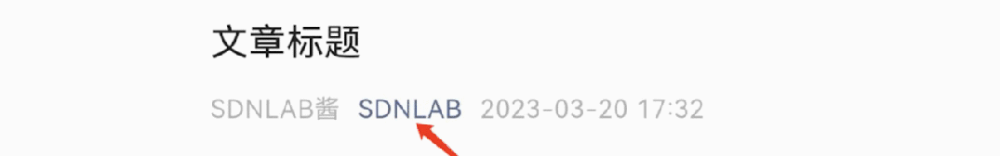

\*来源：西贝吹风

  

在AI大模型训练场景中，智算集群内网络架构的优劣对GPU服务器内外的集合通信存在极大影响，智算集群需支持万卡及以上的并行能力，因此，设计大规模、高可靠、低成本、易运维的优质网络架构，对于满足大模型训练的大算力、低时延和高吞吐需求具有重要意义。  

  

本文我们就重点看一下业内的万卡、十万卡的组网方案，本文不做过多的技术方面的详细阐述，重点呈现给读者各厂家的大模型组网拓扑，满满的干货，下面的组网模型，基本都是各厂家公开信息中提及的，小编进行了细化，个别地方可能与实际情况略有出入，仅供参考！

  

**多级CLOS架构组网**

  

之前的文章中我们提到过基于叶脊交换机胖树架构，两层架构无法满足规模扩展时，可以采用类似Facebook的三层组网架构，增加一层Super-Spine来进行扩展。

  

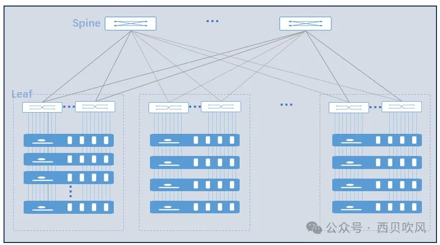

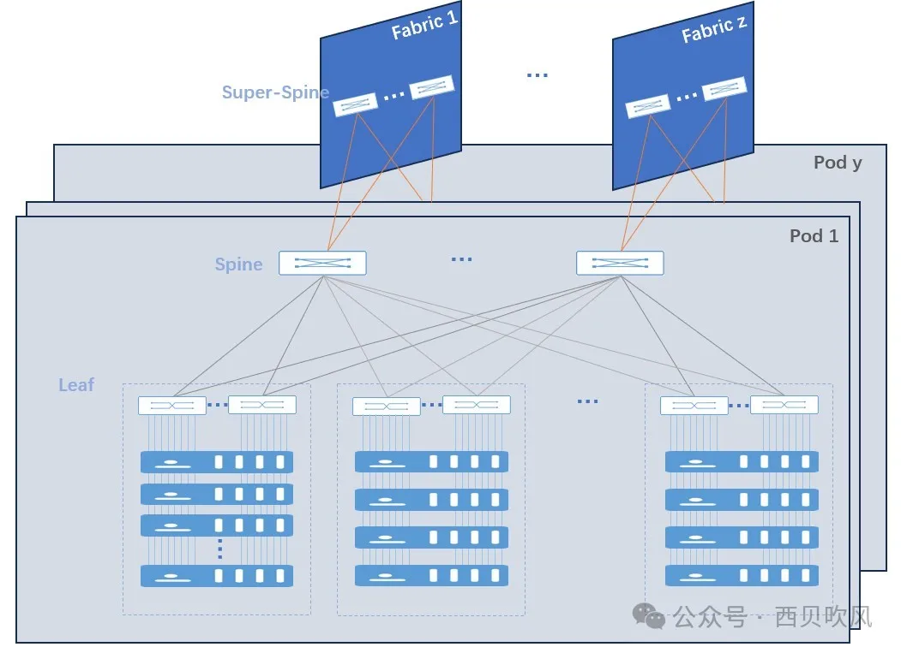

  

这种架构采用1:1无收敛设计，可以通过扩展网络层次提升接入的GPU节点数量，该架构的本质是多级CLOS架构网络，也是目前采用的比较多的智算网络架构。

  

具体到不同的客户在进行CLOS架构组网时，又会根据实际的情况，对网络结构进行调整，GPU服务器的接入也会区分为多轨接入和单轨接入，我们在后面的案例中，会看到两种接入形式的区别，其中，多轨接入是指GPU 服务器上的8张网卡依次接入8台Leaf交换机，多轨接入方式集群通信效率高，大部分流量经一级Leaf传输或者先走本地GPU服务器机内代理再经一级Leaf传输（如：不同服务器的同轨GPU直接通过直连的Leaf进行传输；不同服务器的不同轨GPU进行通信，先在服务器内转换成同轨通信，再通过直连的Leaf进行传输）；单轨接入方式是指GPU服务器上的8张网卡全部接入同一台Leaf交换机，该方式集群通信效率偏低，但在机房实施布线中有优势，若Leaf 交换机发生故障，多轨接入方式所影响的GPU服务器数量多于单轨接入方式。

  

在组建大规模网络时，除了要考虑网络拓扑以外，还需要综合考虑并行计算模式、功耗、可靠性与故障恢复、成本等多方面的因素，本文重点是聚焦在网络拓扑方面，下面我们来具体看一下业内主要大模型的组网架构。

**HW****大模型组网**

  

HW昇腾GPU建议采用的是单轨接入模式：

  

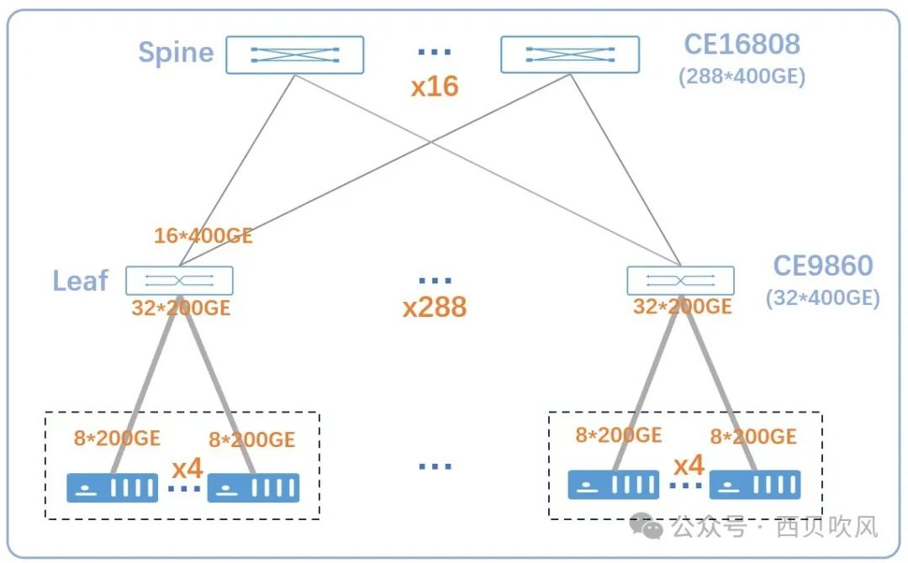

  

*   Spine（CE16808，8槽位，最多提供288\*400GE）：16台
    
*   Leaf（CE9860，32\*400GE）：288台
    
*   昇腾910B服务器：288\*4=1152台
    
*   昇腾910B网卡（200GE）：1152\*8=9216卡（接近万卡集群）
    

通过更换更大容量的Spine、Leaf设备，可以进一步扩展至十万卡集群：

  

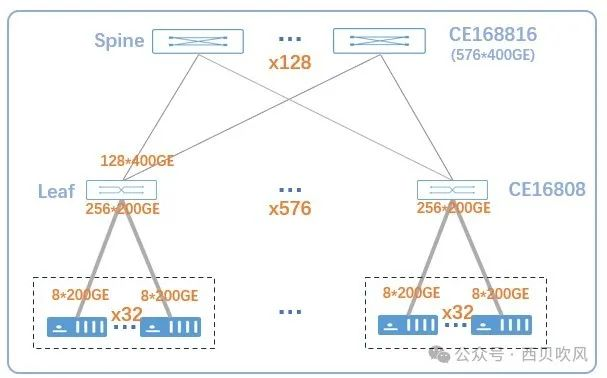

  

*   Spine（CE16816，16槽位，最多提供576\*400GE）：128台
    
*   Leaf（CE16808，288\*400GE）：576台
    
*   昇腾910B服务器：576\*32=18432台
    
*   昇腾910B网卡（200GE）：18432\*8=147456卡（10万卡集群）
    
      
    

**腾讯星脉2.0组网**

  

腾讯星脉2.0组网采用的是多轨接入模式，两级Spine-Leaf组网下的网络架构如下，接入和汇聚均采用51.2T交换机：

  

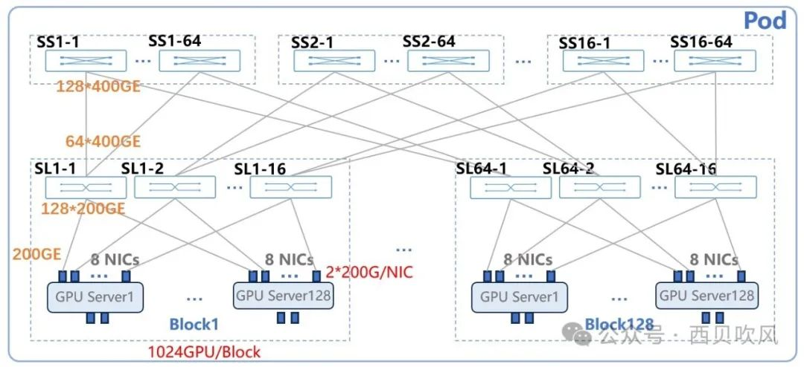

  

*   胖树结构，无收敛，多轨架构
    
*   汇聚交换机：SS（128\*400GE），64\*16=1,024台
    
*   接入交换机：SL（128\*400GE，其中上行64\*400GE，下行128\*200GE），16\*128=2048台
    
*   GPU服务器：128\*128=16384台
    
*   GPU卡：16,384\*8=131072卡（最大理论值）
    

*   每个Block：1024卡
    
*   两层Spine-Leaf组网理论值：131072卡
    

在更大规模组网下，可以使用多Pod的3层组网架构，如下图：

  

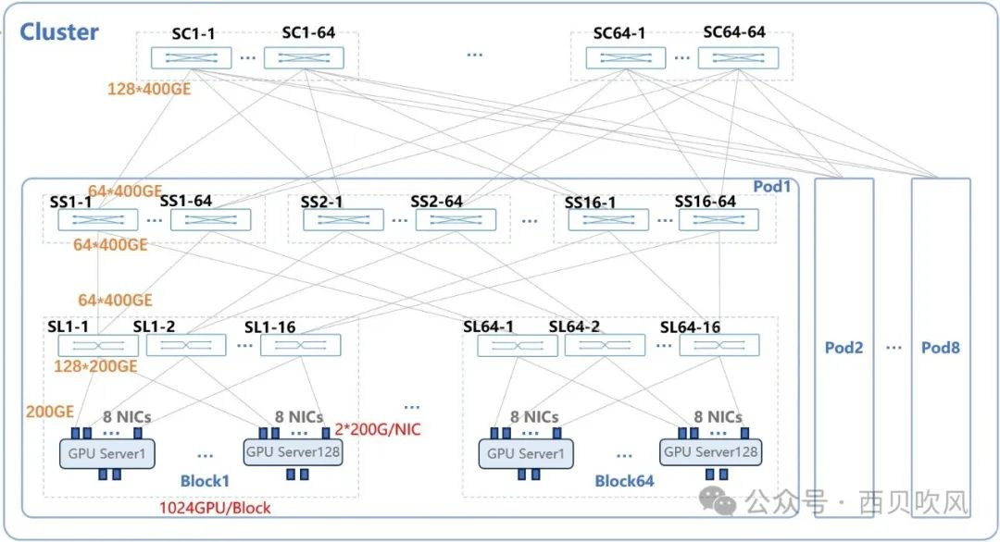

  

*   胖树结构，无收敛，多轨架构
    
*   核心交换机：SC（128\*400GE），64\*64=4096台
    
*   汇聚交换机：SS（128\*400GE），64\*16\*8=8192台
    
*   接入交换机：SL（128\*400GE，其中上行64\*400GE，下行128\*200GE），16\*64\*8=8192台
    
*   GPU服务器：128\*64\*8=65536台
    
*   GPU卡：65536\*8=524288卡（最大理论值）
    

*   每个Block：1024卡
    
*   每个Pod：65536卡
    
*   最大组网理论值：524288卡
    

**百度大模型组网**

百度基于IB的多轨接入组网模式如下：

  

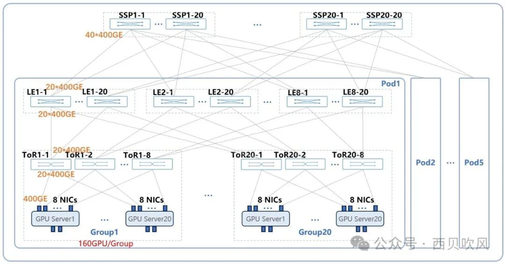

  

*   胖树结构，无收敛，多轨架构
    
*   核心交换机：SSP（40\*400GE），20\*20=400台
    
*   汇聚交换机：LE（40\*400GE），20\*8\*5=800台
    
*   接入交换机：ToR（40\*400GE），8\*20\*5=800台
    
*   GPU服务器：20\*20\*5=2000台
    
*   GPU卡：2000\*8=16000卡
    

  

*   每个Group：160卡
    
*   每个Pod：3200卡
    
*   最大组网理论值：16000卡
    

百度基于RoCE的多轨接入组网模式如下：

  

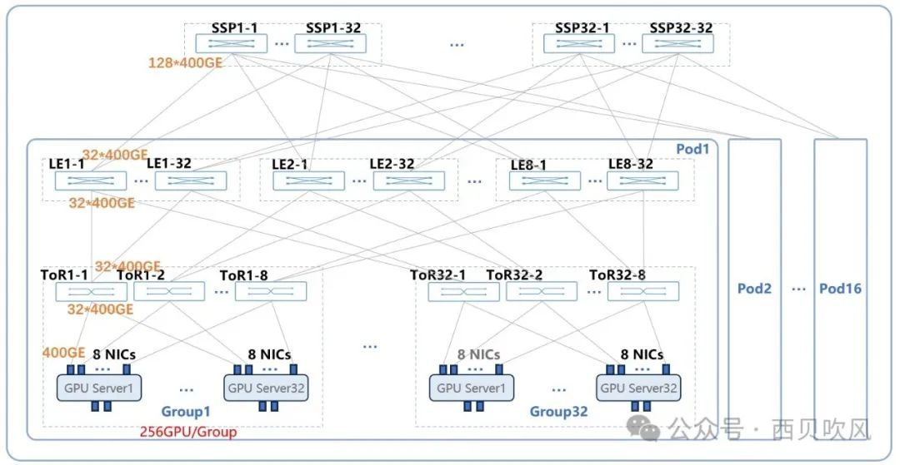

  

*   胖树结构，无收敛，多轨架构
    
*   核心交换机：SSP（128\*400GE），32\*32=1024台
    
*   汇聚交换机：LE（64\*400GE），32\*8\*16=4096台
    
*   接入交换机：ToR（64\*400GE），8\*32\*16=4096台
    
*   GPU服务器：32\*32\*16=16384台
    
*   GPU卡：2000\*8=131072卡
    

*   每个Group：256卡
    
*   每个Pod：8192卡
    
*   最大组网理论值：131072卡
    

**字节大模型组网**

  

字节大模型组网采用多轨接入模式，之前交换机采用B4020，可以提供64\*400GE；最新的51.2Tbps交换机B5020，可以提供64\*800GE。

  

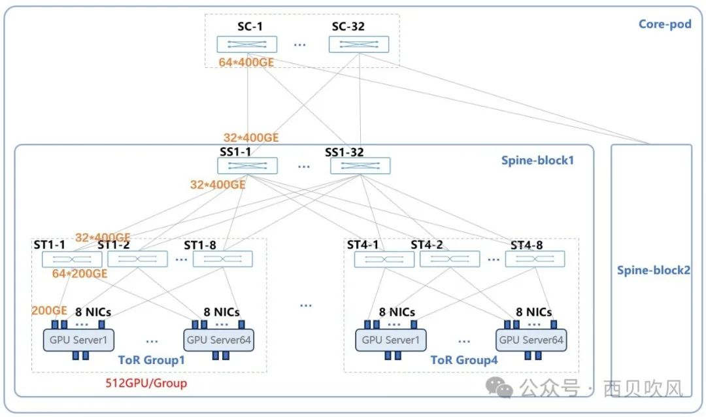

  

*   胖树结构，无收敛，多轨接入
    
*   核心交换机：SC（64\*400GE），32台
    
*   汇聚交换机：SS（64\*400GE），32\*2=64台
    
*   接入交换机：ToR（64\*400GE），8\*4\*2=64台
    
*   GPU服务器：64\*4\*2=512台
    
*   GPU卡：512\*8=4096卡
    

  

单个Core-pod，含2个Spine-block，每个Spine-block含4个ToR-group每个ToR-group含512卡，单个Core-pod含4096卡

多轨接入情况下，按8轨组网模式，可以接入8个Core-pod（ Core-pod数量可以根据情况进行扩展）。

  

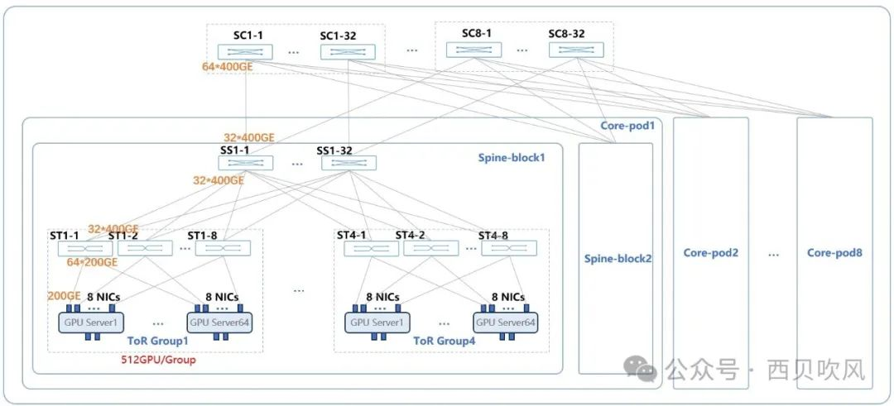

  

*   胖树结构，无收敛，多轨接入
    
*   核心交换机：SC（64\*400GE），32\*8=256台
    
*   汇聚交换机：SS（64\*400GE），32\*2\*8=512台
    
*   接入交换机：ToR（64\*400GE），8\*4\*2\*8=512台
    
*   GPU服务器：64\*4\*2\*8=4096台
    
*   GPU卡：4,096\*8=32768卡（交换机使用51.2Tbps的B5020，即64\*800GE以后，可以扩展至10万卡集群）
    

**阿里云HPN-7.0大模型组网**

组网采用的是多轨接入模式，两级Spine-Leaf组网下的网络架构如下：

  

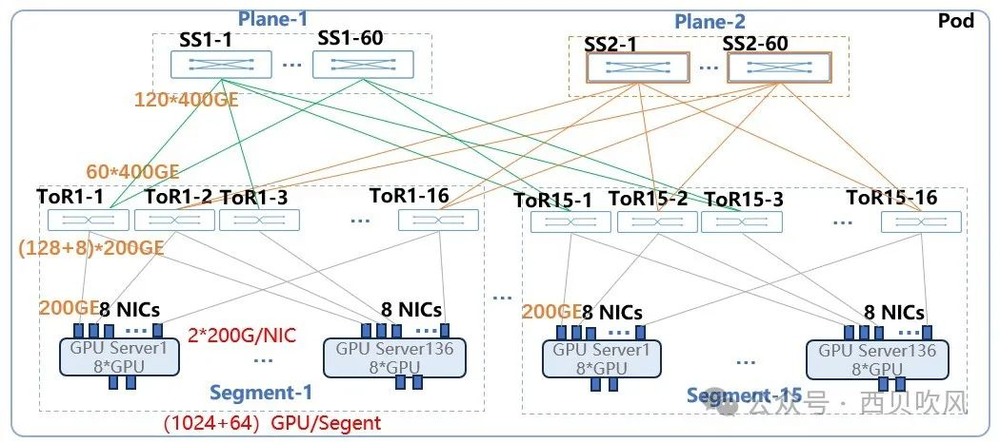

  

*   接入层收敛比：1.067:1（64/60，备用端口不考虑）
    
*   汇聚交换机：SS（128\*400GE），60\*2=120台
    
*   接入交换机：ToR（128\*400GE），16\*16=256台
    

  

单Pod中包含15个Segment，每个Segment包含1024个主GPU卡+64个备GPU卡，合计单Pod包含15360主GPU卡+960个备GPU卡

通过扩展Pod，可以将集群规模提升到十万卡集群，甚至更高。

  

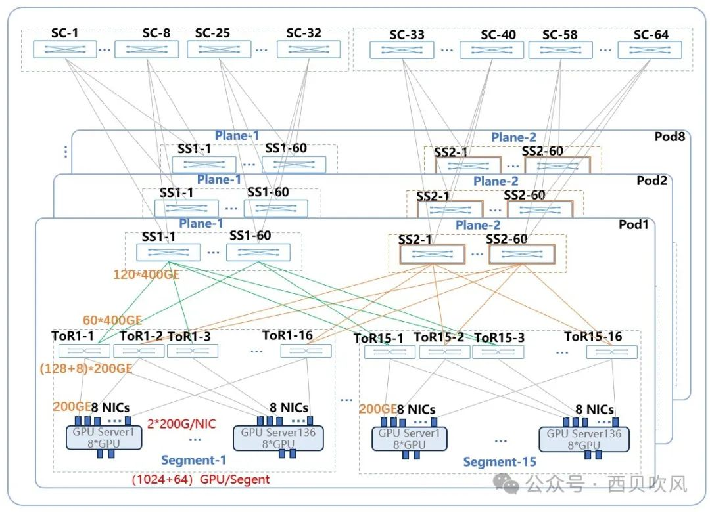

  

*   阿里根据其训练任务流量特性，选择Spine-Core之间采用15:1（120:8）的收敛比设计
    
*   核心交换机：SC（128\*400GE），64\*2=128台
    
*   汇聚交换机：SS（128\*400GE），120\*16=1920台
    
*   接入交换机：ToR（128\*400GE），16\*15\*16=3840台
    

单Pod中包含15个Segment，每个Segment包含1,024个主GPU卡+64个备GPU卡，合计单Pod包含15360主GPU卡+960个备GPU卡。16个Pod最多可以接入245760个GPU卡

**小结**

  

上面概要介绍了BBATH常见的万卡十万卡大模型组网拓扑结构，具体组网情况，会依据实际条件进行综合考虑，万卡十万卡大模型的网络拓扑不仅仅受限于网络设备本身，也要综合考虑并行计算模式、功耗、可靠性与故障恢复、成本等多方面的因素。

  

\- END -

  

* * *

  

【投稿】：[**SDNLAB原创文章奖励计划**](https://mp.weixin.qq.com/s?__biz=Mzg5NzY3NDUyMw==&mid=2247535856&idx=1&sn=62cc3fa2d19887c749c278fe55136ad8&scene=21#wechat_redirect)

【有奖】：[**常读文章有奖活动进行中**](https://mp.weixin.qq.com/s?__biz=Mzg5NzY3NDUyMw==&mid=2247536415&idx=1&sn=fcf766a4e7cd6f7f7a8ffeed1acd250e&scene=21#wechat_redirect)

预览时标签不可点

Close

更多

Name cleared

**微信扫一扫赞赏作者**

Like the Author[Other Amount](javascript:;)

Articles

No articles

Like the Author

Other Amount

¥

最低赞赏 ¥0

OK

Back

**Other Amount**

更多

赞赏金额

¥

最低赞赏 ¥0

1

2

3

4

5

6

7

8

9

0

.

Close

更多

搜索「」网络结果

​

暂无留言

已无更多数据

[Send Message](javascript:;)

  写留言:

Close

**Comment**

Submit更多

[表情](javascript:;)

Scan to Follow

继续滑动看下一个

轻触阅读原文

SDNLAB

向上滑动看下一个

当前内容可能存在未经审核的第三方商业营销信息，请确认是否继续访问。

[继续访问](javascript:)[Cancel](javascript:)

[微信公众平台广告规范指引](javacript:;)

[Got It](javascript:;)

 

 Scan with Weixin to  
use this Mini Program

[Cancel](javascript:void(0);) [Allow](javascript:void(0);)

[Cancel](javascript:void(0);) [Allow](javascript:void(0);)

× 分析

 : ， ， ， ， ， ， ， ， ， ， ， ， .   Video Mini Program Like ，轻点两下取消赞 Wow ，轻点两下取消在看 Share Comment Favorite 听过            

**SDNLAB**

万卡十万卡大模型网络拓扑都是什么样的？

,

,

选择留言身份
