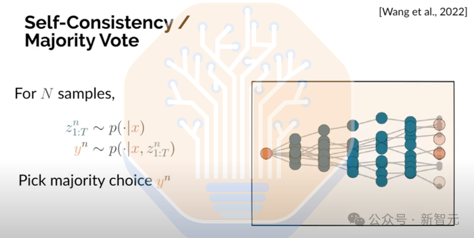

Title: 万字独家爆光，首揭o1 pro架构！惊人反转，Claude 3.5 Opus没失败？

URL Source: https://mp.weixin.qq.com/s/LozJEE1sAAYAOrEFDVb6mg

Markdown Content:
### 

### 

* * *

**新智元报道**

编辑：编辑部 HYZ

##### **【新智元导读】**全网独一份o1 pro架构爆料来了！首创自洽性机制打破推理极限，「草莓训练」系统首次揭秘。更令人震惊的是，OpenAI和Anthropic自留Orion、Claude 3.5超大杯，并不是内部失败了，而是它们成为数据生成的秘密武器。

大模型Scaling Law终结，前段时间曾被吵得沸沸扬扬。

面对诸多的质疑，硅谷巨头们用行动给出了截然不同的答案。

谷歌祭出最强下一代新模型Gemini 2.0 Flash，并带着多个智能体一同亮相；OpenAI「满血版」o1和o1 pro mode向所有人证明了模型的能力还远没有触及到天花板。

最近，外媒SemiAnalysis一篇深度报道再次指明了方向——Scale的维度远不止预训练，Scaling Law仍将继续下去。

据爆料，Claude 3.5 Opus并非如传言所说，内部已经失败了。

相反，它是Anthropic精心打造的一件「战略武器」。一直以来并未公开发布的原因是，3.5 Opus被秘密应用在两个关键领域：「内部数据合成」和「强化学习奖励建模」。

令人震撼的是，通过这种创新训练方法，Anthropic不仅没有增加推理成本，反而显著提升了模型性能。

SemiAnalysis分析称，相比直接对外开放这款超大杯模型，Anthropic更愿意将其用于训练优化，发布Claude 3.5 Sonnet就已足够！

不仅如此，这份最新报告中，三位行业分析师独家揭秘了o1和o1 pro的架构，深入探究了Orion未来规划。

o1穿越「草莓田」，只有单一CoT

众所周知，o1在推理阶段采用了一种思维链（Chain of Thought）的方法，将推理过程分解为多个离散的步骤。

o1能够规划其推理步骤，评估中间结果，并在步骤出错或陷入僵局时进行回溯。

坊间，研究员们曾提出许多关于o1推理方式的观点，比如它在推理阶段会探索一种潜在推理路径或思维链树。

然而，事实并非如此。

o1在推理过程中，实际上在推理过程中只会沿着单一CoT前进，直至给出答案。

而且， o1在测试阶段并不依赖搜索，因此在推理过程中放弃了对潜在推理路径树的探索。

这也意味着，它在推理时仅能使用pass@1方法。

而o1 Pro则采用了自洽性（self-consistency），或多数投票（majority vote）的方法。（注：如下token经济学的部分中，会有更很多介绍）

关于o1如何生成其单一的思维链，有几种理论。

其中一种广为接受的理论是，在强化学习过程中，o1使用了一种「过程奖励模型」（Process Reward Model）来驱动推理步骤。

PRM类似于一种奖励机制，可以在验证和生成之间进行切换。

通过使用同一个模型同时作为生成器和验证器，模型能够在两者之间高效切换，并不断迭代其思维过程。

### **回溯：是涌现现象还是训练结果？**

如前所述，o1的另一个核心能力是其在单一思维链上进行自我纠正和回溯的能力。

值得注意的是，这种能力并非是刻意设计，而是推理阶段计算量scale的自然结果。

也就意味着，o1就像一个不断学习的学生，能够意识到并纠正自己的错误。

不过，这种能力并非对所有问题，都同样有效。

具体还要取决于问题的类型。

比如，对于像「x的首都是哪里」这样简单的问题，延长思考时间并无太大的帮助。

而对于复杂的数学或编程问题，延长思考时间则可能显著提升结果。

此外，与验证英语作文相比，验证数学和编程问题相对更容易。

目前，分析师称也尚不清楚OpenAI是如何具体利用额外的测试时计算资源。

他们只知道，「OpenAI的后台有某种设置可以控制这一点」。

从以下按主题划分的胜率图表可以看出，o1和推理模型在那些相对容易验证，但生成答案较难的学科中表现优于非推理模型，而在验证和生成答案都困难的领域中表现较差。

这主要是因为o1的训练过程在很大程度上，依赖功能验证器（functional verifiers）在训练期间为模型提供反馈。

OpenAI打造「草莓训练」，生成合成数据

为了训练o1，OpenAI为此生成了海量数据。

他们打造了一个名为草莓训练（Berry Training）的复杂系统，专为训练推理模型。

这些合成数据，通过蒙特卡洛树（Monte Carlo tree）生成，伴随着许多并发的回合（rollouts）。

然后，模型会基于过程奖励模型（PRM），针对约1000万个问题生成许多不同的变体，并在多个不同点进行分支。

这些问题会生成数千条不同的答案「轨迹」（trajectories）。

由于部分答案在分支时共享前缀，因此某些轨迹可能有着相同的开头。

之所以称其为「轨迹」，是因为单独来看，它是一条通向答案思维链。

这些轨迹中的每一条都包含数千个token。训练像o1这样的草莓模型需要生成数百万亿个token。

随后，这些轨迹会通过功能验证器（functional verifiers）和优化奖励模型（ORM）进行修剪。

由于PRM的效率较低，大多数数据选择是通过ORM实现的，因此每个问题会有许多并发的回合完成，并且直到最终才会被修剪。

如果PRM的表现更好，那么生成的轨迹与保留的优质轨迹的比例会更高。但遗憾的是，ORM的生成占主导地位，并会筛除大部分数据。

这些功能验证器在许多方面有所不同，但可以将它们视为独立的「沙盒」，用来检查数学计算或运行代码以验证生成的数据是否正确。

同时运行所有这些模型并正确地并行化，是一个极其复杂的系统和基础设施问题。

比如，不同模型必须在各种 GPU 上运行，计算结果需要精确路由到下一个处理阶段，同时更新多个模型权重，并确保工作负载均衡。

此外，功能验证器「沙盒」通常在GPU上运行效果不佳，因此经常被转移到CPU上。

一个有趣的现象是，当前标准的英伟达系统通常配备8个GPU和2个x86 CPU，也就是4:1的比例，而英伟达下一代GPU系统GB200 NVL72配备了72个GPU和36个CPU，是2:1的比例。

另一方面，Anthropic背后金主爸爸亚马逊下一代系统（代号Project Rainier）配备了16个Trainium2，但只有2个CPU，是8:1的比例。

可见，下一代训练系统的CPU与GPU资源之间存在巨大差异，英伟达系统能够让OpenAI运行更复杂的功能验证器，而Anthropic在每FLOP成本和内存带宽/容量成本方面具有优势。

然而，Anthropic更少的CPU资源可能会使运行复杂功能验证系统变得更加困难。

### **训练期间的大量前向传播**

现在，或许就不难理解，推理训练是极其计算密集型的原因了。

仅针对1000万个推理问题，就可能生成数百亿条轨迹，包含了数百万亿token。

想象一下，随着问题集的继续扩展并涵盖更多领域，会发生什么？

数据量只会呈指数级增长。

而且这些数据并不完全与客户请求重叠，因此推理部分生成的token数量将超过预训练数据集。

此外，由于PPO（近端策略优化算法）和 PRN（过程奖励网络）的工作方式，必须在每次反向传播（更新模型）之前运行多次前向传播（运行模型）。

这是因为，除了极其密集的生成器模型之外，还有策略模型、多种奖励模型以及其他基于模型的验证器，它们在后训练阶段的每次反向传播中都会运行以验证数据。

在许多情况下，这些模型每次反向传播会运行多次，具体取决于需要修剪或拒绝的数据量。

这导致后训练阶段的前向传播与反向传播的比例极高，而在预训练阶段，这一比例通常为1:1。

这种变化，对训练的基础设施需求产生了巨大影响。比如，过去可能需要单一的大型全连接扩展架构，而现在这种需求可能不再必要。

不过，它带来的一个显著的优势是，跨地理分布的数据中心进行训练变得更加容易。

### **后训练FLOPS超过预训练**

以往，推理模型的后训练阶段，运行几乎需要与预训练相同的计算量。

当前，在许多情况下，目前的后训练FLOPS（每秒浮点运算次数）已经超过了预训练。

这是因为后训练通常需要在生成器、奖励模型、策略模型以及各种验证器的前向传播阶段使用多个副本的最大或最优模型。

以OpenAI的下一代模型为例。

他们目前正在训练一个在预训练规模上介于GPT-4o和Orion之间的模型。

他们会先预训练一个「基础模型」，然后从中派生出两个模型：一个是传统的聊天模型，另一个是真正的推理模型。

从基础模型转变为推理模型的过程，所需的后训练FLOPs将超过预训练所需的计算量。

这是因为Orion将被用于生成大量的「草莓训练」数据，并且还会被广泛应用于各种验证器和奖励模型中。

预训练的规模将继续扩大，这得益于新架构的研发、对日益增长的合成数据以及视频数据的处理需求。

更重要的是，推理训练的兴起意味着，后训练不再局限于简单的微调，而且需要更多的计算量。

训练的计算scaing law依然有效，并充满活力。

### **快速迭代：另一种形式的Scaling**

业内高度发展，让模型迭代速度不断提升，大幅缩短了训练时间。

当前，算法的进步使得模型每年所需的物理计算量减少约三分之一。同时，其他架构的改进也允许开发出更优质的模型。

因此，训练运行时间很少超过3个月，大多数主要的预训练运行通常在发布时仅需1-2个月。

然而，OpenAI的Orion却打破了这一常规，其训练时间超过了3个月。

由于推理模型的「反馈循环」机制，使得这种情况发生了变化。

OpenAI现在专注于更快的训练运行反馈循环，并尝试通过更大的集群不断迭代模型。

像Orion这样超大规模的训练，在构建小模型时仍然很关键。不过在英伟达Blackwell出现之前，这样的模型由于本身的巨大成本和资源需求，难以实现经济化部署。

o1推理架构：token经济学

即使是较小的推理模型，使用Blackwell后也能显著提升服务效率。

尽管GPT-4o和o1的架构、规模相同，但每个token的定价差异高达6倍。同样地，GPT-4o mini和o1 mini的每个token定价差异更大，高达20倍。

部分原因不排除OpenAI是为了盈利，因其具有独特的功能，收取更高的费用。

但主要原因在于，成本本身更高。

接下来，可以通过一个简单的实验，从基本原理出发快速说明推理模型在token定价上的巨大差异。

使用最近Qwen QwQ最近博客中，展示的第一个逻辑推理提示词示例，并将其输入到几个模型中：

请在以下错误的等式中添加一对括号使其成立：1 + 2 \* 3 + 4 \* 5 + 6 \* 7 + 8 \* 9 = 479

从Qwen发布博客中可以看到，这个问题需要生成约2166个词才能得出答案

正如预期的那样，推理模型（如o1-preview和o1-mini）比同等规模的非推理模型，生成更多的输出token。

需要注意的是，即使推理token并未显示或提供给用户，它们也包含在可计费的输出token中。

由于推理模型的每个token成本显著更高，查询成本在o1-mini的情况下高出24倍，而在o1-preview的情况下高出57倍。

这种查询成本的差异，足以令人震惊，但需要关注的重要部分是序列长度和KV缓存（KVCache）。

假设对o1-preview的7661个输出token运行一个查询，并使其在Llama 3.1 405B模型上，产生相同的7661个token序列长度。

在上述条件下，如果想要达到每秒每用户30个token的交互性，最大批大小将限制为72。

也就是说，序列越长，为了维持一定的交互速度，就必须减少一次性并行处理的批大小。

这是根据「Roofline模型」进行计算得出的纯理论值。

在此简化分析中，还未考虑不同批大小对内存带宽利用率或模型FLOPs利用率的影响

相同的问题在GPT-4o上运行时仅生成了775个token的序列长度。

如果在Llama 3.1 405B上运行相同数量的token，并以每秒每用户30个token的交互性为目标，最大批大小可达368。

由于较长的序列长度查询，限制了最大批大小，推理模型的成本无法在更多用户之间分摊，这意味着每个token的成本因KV缓存限制而高出5倍以上。

这仅是一个基于基本原理的框架，但它可以帮助我们了解上下文长度如何影响成本的方向性。

除此此外，还有其他因素导致了这种巨大的定价差异。

那么，是什么导致推理模型计算密度增加和内存需求更高，从而导致批大小减少和每GPU吞吐量降低？

答案有两个方面。

首先，内存需求增加的主要驱动因素是，处理更长序列长度所需的更大KV缓存。使用全局查询注意力（GQA）时，总KV缓存大小可以按以下公式计算：

> 总GQA KV缓存大小（字节）=批大小×序列长度×2×层数×（隐藏层大小/头数×KV头数）×精度（字节）

KV缓存大小随序列长度线性增长，但也随着批大小线性增长，因此同时拥有大量用户生成长序列长度会导致巨大的KV缓存需求。

下图中展示了对于Llama 3.1 405B，一个39,000 token的序列长度，将完全占满8xH100节点的640GB总HBM容量，而分析师尚未考虑加载模型参数所需的405GB。

如果将参数考虑在内，用于KV缓存的可用内存将减少到 235GB（下图中的红线），实际上在序列长度约为16k token时就已达到内存限制。

由于KV缓存大小的增加直接导致更大的内存容量和带宽需求。当批大小保持恒定时，这也降低了交互性，或者限制了最大批大小至16，从而提供最低的交互性。

另一个关键因素是FLOP需求如何随着序列长度的增加而扩展：

> 每个token所需的缩放点积注意力（SDPA）FLOP=4×头数×层数×头维度×序列长度token

每个token所需的FLOP随序列长度线性增长，但由于这是每个token的FLOP，总FLOP随给定序列的序列长度平方增长。这意味着FLOP需求相对于序列长度呈二次方增长。

在下图中可以看到，随着上下文长度的增加，推理系统很快达到FLOPS的限制——在下例中，约为4096 的序列长度。

序列长度的增加极大地线性增加了内存和FLOP需求，并分别呈现线性和二次方增长，这导致批大小显著缩小，从而难以分摊集群总拥有成本。

这反过来使每个token的服务成本显著提高。

需要注意的是，OpenAI广泛使用了诸如局部全局注意力（local-global attention）等注意力机制改进，这些改进有助于缓解这些问题，但仅仅改变了Transformer注意力中的常数，减缓了二次方增长，而未能解决它。

需要能够在保持质量的同时解决这些问题的长上下文架构，否则推理模型的每token成本将始终显著更高，同时生成的token数量也会更多。

### **推理模型挑战：可靠性问题**

推理时带来了内存的显著增加，和FLOPS需求外，序列长度的增加还带来了另一个挑战：可靠性问题。

前面已经讨论过容错性，以及它如何实现跨数据中心的训练，这也是超大规模基础设施工具集中所有应用的关键部分。

在训练运行过程中进行检查点保存（Checkpointing）已被AI实验室广泛采用，以便在发生故障后快速重启训练，从而显著减少这些故障带来的中断。

然而，在推理过程中，静默数据损坏错误和其他故障仍然可能发生。

尽管这些故障的发生率较低，但由于超大规模服务商需要服务庞大的用户群体，以及用于推理的大量加速器设备，这些问题必须得到解决。

在Transformer架构中，每生成一个新的token，该token 都会被附加到之前生成的所有token上，并再次通过模型。如果在生成某个token时发生错误，这个已损坏的token就会成为对话上下文的一部分，可能导致语法、语境或格式上的错误。

这一问题对所有长上下文模型都适用，但对推理模型尤其明显，因为长序列长度会导致错误的累积。

此外，许多错误可能是模型本身固有的，或者由于推理过程中思维链（Chain of Thought）从一开始就走上了错误的轨迹所致。

**o1 pro破解推理难题，首采自洽性机制**
------------------------

基于上述原因，o1 pro在推理阶段采用了自洽性（Self-Consistency）/多数投票（Majority Vote）机制。

它与普通的o1模型使用完全相同的模型和权重。

从表面上看，自洽性/多数投票的成本似乎非常高，因为如果有5个投票流，那么需要生成5倍的token。

这也为OpenAI将ChatGPT Pro订阅价格从20美元提高到200美元提供了合理的依据。

但实际上，OpenAI的成本增加远低于价格上涨的幅度。

这是因为在运行更长的平均序列长度，并增加解码token与预填充token的比例时，推理系统通常更多受到带宽和容量的限制，而不是FLOPs的限制。系统虽然有多余的 FLOPs，但无法有效利用。

另一方面，由于自洽性/多数投票在大部分序列长度上使用了共享的前缀，因此无需在KV缓存上花费额外的带宽或内存。

摩尔定律：计算领域最重要的Scaling Law

OpenAI o1已向世界证明了推理模型的巨大潜力，为AI开辟了全新的探索空间——计算时推理。

随着计算能力的提升，合成数据生成、PPO、功能验证器（Functional Verifiers），以及其他推理训练基础设施，都将为Scaling Law续命。

现在大家热议的AI「Scaling Law」之争，其实和过去几十年对计算能力扩展和摩尔定律的争论如出一辙。

在2000年代末Dennard Scaling失效之前，有些人总是固守着CPU主频这一个指标。按这种算法，这些年确实没有多大进展。

但事实是，计算能力一直在稳步提升。

当CPU主频遇到瓶颈后，业界迅速转向多核架构等新方向。虽然功耗和散热始终是个挑战，但创新从未停止。

摩尔定律走向终结的讨论曾经十分热闹，但最近声音也小了很多。主要是因为像英伟达这样的AI领军企业找到了全新的扩展维度，带来了显著的算力提升。

比如，先进封装技术不仅提升了I/O能力，还突破了传统光罩尺寸的限制，用上了更大的硅片面积。

芯片内外的并行计算，再加上更大规模的高带宽网络，让这些芯片在大规模部署时能够更好地协同工作——尤其是在AI推理方面。

这种情况和2004年很相似：某些传统增长曲线确实在放缓，但得益于新技术范式的出现和扩展，整个行业依然在快速发展。

因此，就像过去50多年的摩尔定律一样，AI领域的「Scaling Law」也会持续扩展下去。

Scaling不只预训练

在关于Scaling Law的讨论中，预训练往往是关注的焦点，因为它易于理解，但这只是AI生命周期的一部分。模型完成预训练后，仍需进行大量工作，准备好实际使用。

预训练的目标非常单一，即「正确预测下一个 token」。然而，实现这一目标仍然远未达到LLM开发的最终目标，即「回答用户的提示词」或「完成任务」。

### **推理模型与思维链**

由于训练模型缺乏足够复杂、高难度的提示词，数学成为微调模型的重点领域之一。

方法之一，是聘请高技能的人类专家来设计提示词，或者在内部生成这些提示词。通过推理有效解决数学问题，需要清晰表达且正确的思维链，模型可以从中学习。

尽管某些数学能力可以通过代码解释器等工具得到提升，后者允许模型生成并执行Python之类语言的代码，从而帮助解决部分数学问题，但代码并不足以解决所有问题，尤其是最复杂的数学问题。

因此，训练推理模型解决复杂数学问题，是目前研究者付诸大量努力的方向。

模型可以通过提示词直接生成思维链，但结果可能不可靠，因为CoT中某一步出错，就会导致错误累积到最终的错误答案。不过，为了防止这种情况，o1 Pro引入了多重保障机制。

另一个挑战在于，即使是最新的模型，在面对不确定性时也可能生成虚假信息，这容易导致推理步骤中的错误进一步累积。

通过CoT推理的对齐训练，可以解决这些挑战。其中，强化学习用于将模型行为对齐到CoT推理，并通过多个独立模型提高其准确性。

第一个独立的LLM是生成器（Generator），训练后，它可以跨多个步骤生成经过推理的解决方案。生成器通常与基础LLM分开，因为它专门针对生成这些推理步骤的任务进行微调，而基础LLM通常针对通用任务进行微调。

第二个是验证器模型（Verifier Model），职责是评估生成器生成的解决方案是否正确，提供相应奖励。

验证器模型可以通过人工注释、自动过程注释或自动验证器进行训练。

在OpenAI论文「Let’s Verify Step by Step」中，研究人员介绍了PRM800K过程监督数据集，其中人工数据标注员对来自MATH数据集12,000个问题的75,000个解决方案中的800,000个过程步骤进行了注释，这些方案就是由生成器生成的。

收集这些注释的成本不可忽视。在原始数学论文中，一些大学生被要求在一小时内完成20个问题，其得分在40%到90%之间，90%的得分者，是一位三次获得IMO金牌的选手。

OpenAI论文指出，由于成本原因，建立一个足够大的人工注释PRM数据集，以匹配数量级更大的ORM数据集进行公平比较，是不现实的。

替代方法，就是使用自动过程注释，或寻找自动验证器。

自动验证器是一个可以快速、轻松验证给定问题方案是否正确的系统或模型。

对于代码，可能是通过执行或测试代码；对于数学，则可能是评估给定函数，或使用像LEAN这样的证明工具来检查正确性。然而，使用自动验证器可能并不会那么「自动化」——依赖外部系统会增加开销，影响训练性能，还可能需要长时间运行。

另一个则是完成器（Completer）。与让人类评估中间步骤不同，它用于创建多条不同的推理步骤路径。

「Math-Shepherd」论文使用了自动过程注释——生成多条路径，然后通过以下两种方式评估这些路径：如果路径导致正确的最终答案，则将其标记为一个好的推理步骤（即硬估计）；或者根据该步骤导致正确解决方案的频率分配一个分数（即软估计）。

第四个模型是奖励模型（Reward Model），从过程注释标签中训练而来。

RM有两种类型：一种是基于结果提供奖励的结果奖励模型（ORM），另一种是基于过程提供奖励的过程奖励模型（PRM）。

ORM通常对模型提供的多种答案进行排序，选择排名最高的答案。而PRM为推理思维链的每一步分配一个分数，并基于该分数提供奖励。因此，在训练思维链模型时，PRM通常更受青睐。

「Let’s Verify Step by Step」论文展示了PRM相较于ORM的更强表现。尽管如此，OpenAI仍然更多依赖于ORM。

在「Math-Shepherd」中，就是通过一步一步近端策略优化（PPO）进行强化学习，从而训练最终的LLM，使其掌握期望的CoT推理行为。

### **推理时Scaling**

o1-preview的发布引起了业界对全新Scaling Law的关注——即测试时计算（推理时计算）越多，答案越好，而利用这一scaling维度的努力正处于一个重要的转折点。

测试时scaling并不是一个新概念。在棋类游戏和扑克中，scaling测试时计算的理念已经存在了一段时间。比如，AlphaGo在测试时使用蒙特卡洛树搜索来决定下一步棋。

通过更强大的计算力，推理模型可以思考更多步骤，从而增加得出正确答案的可能性。

然而，目前推理能力受限于推理系统的性能，因为推理模型所需的长上下文长度显著增加了内存和计算需求。

这意味着，为了保持上下文长度和价格的合理性，同时为一定数量的用户提供性价比服务，推理模型开发者限制了CoT的长度和复杂度。

因此，当前的推理模型相当于「表现受限」，它们的性能可以随着更强大的推理系统（如GB200 NVL72）的上市而显著scaling。

一旦具备经济可行性，允许o1调整CoT的长度和计算资源的使用，将成为利用测试时计算scaling的关键技术。

从评估结果和下方图表中可以看出，即使只尝试一次，GPT-4o也能击败其他模型。

scaling测试时计算最简单的方式是同时增加运行的样本数量，这实际上类似于「无限猴子定理」。

论文「Large Language Monkeys」表明，简单的重复采样可以scaling推理时计算，并产生更好的结果。

这可以说是最基本的搜索方法之一。

生成更多样本可以实现更大的覆盖率，覆盖率定义为任何一个样本得出正确答案的概率（即pass@k）。

有人可能会认为，仅仅让这些较小的模型多次思考一个问题可能会更准确且更便宜，但我们需要一个有效的验证器来判断是否成功生成了「莎士比亚全集」式的答案。

「这是最好的时代，也是最糟的时代」

### **通过搜索，Scaling推理计算**

搜索是Scaling推理计算的另一个维度，这在o1中未被利用，但在o1 Pro中得到了应用。

o1在测试时（即推理阶段）并未评估多条推理路径，也没有进行任何搜索。

Sasha Rush在其关于测试时scaling的推测（o1）的演讲视频中，对搜索以及与推理模型相关的其他主题进行了深入讨论和说明。

自洽性/多数投票是一种搜索方法。

在这种方法中，多次将提示词输入模型，以生成多个响应，然后通过选择在一定数量的样本中出现次数最多的响应来确定正确答案。

Best-of-N采样是另一种方法。

在这种方法中，为特定提示词生成N个解决方案，然后使用验证器模型识别出导致正确答案的思维链。

蒙特卡洛展开是一种基于Best-of-N的技术。在这种方法中，通过从某个中间步骤出发生成多个路径来完成思维链，从而对该中间步骤进行评估。

这种评估可以决定是否继续当前步骤，或者转向未来可能更优的步骤，从而改进整体的思维链。

Scaling训练比Scaling推理计算更便宜

推理模型高昂的成本特性，加上其使用了大量token，使得推理成本显著上升。

如果科技企业希望以更高性价比的部署这些推理模型，那么控制部署成本的上升趋势至关重要。

目前，主要实验室并没有足够的能力。以他们期望的规模服务这些模型。

微软仍然无法全面推出其Copilot功能集；Sora无法广泛使用，为此，奥特曼甚至关闭了注册入口。

无论是在预训练还是推理阶段，计算能力依然非常有限。

为此，scaling预训练仍然可以在降低成本方面产生巨大影响。

具体而言，通过使用比Chinchilla最优点多两个数量级的FLOPs进行过度训练，可以实现与Chinchilla最优点相同的性能，同时将推理成本降低一个数量级。

scaling预训练两个数量级所需的成本将比以往任何时候都更高，但这仍然是合理的。

超大规模计算提供商也在继续建设更大的集群，比如马斯克计划建立一个拥有100万块GPU的集群。

鉴于OpenAI和微软目前大约在数十万块GPU上运行GPT的推理，对预训练进行scaling似乎仍然能够提供所需的成本节约。

参考资料：

https://semianalysis.com/2024/12/11/scaling-laws-o1-pro-architecture-reasoning-infrastructure-orion-and-claude-3-5-opus-failures/#scaling-training-is-cheaper-than-scaling-inference-time-compute

