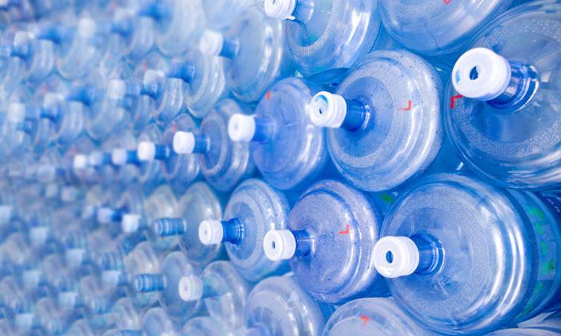
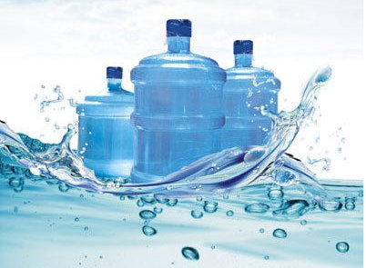
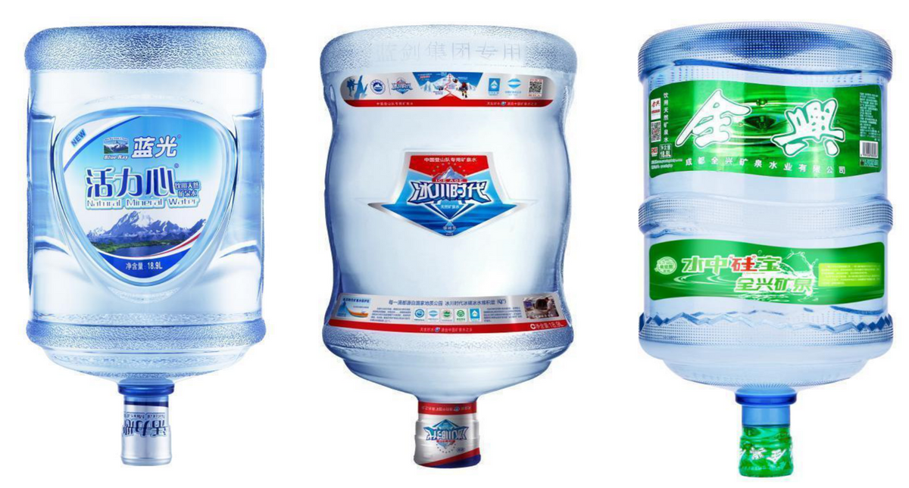

# 专家支招：辨别山泉、天然水与矿泉水，关键看水源和执行标准
[专家支招：辨别山泉、天然水与矿泉水，关键看水源和执行标准](https://m.thepaper.cn/newsDetail_forward_12782375) 

 近日，有很多市民打进本报热线，反映市场上桶装水名称众多，有山泉水、纯净水、天然水、矿泉水、包装饮用水等，到底这些水有什么区别？该怎么辨别呢？喝哪种水更有利于健康呢？

为了充分满足消费者的知情权，也为了提振消费信心，让消费者愿消费、敢消费，充分发挥消费对经济发展的支撑作用。近日，记者围绕消费者关心的问题，开展了广泛的市场调查，走访了数十家桶装水站，采访了多位行业专家，查询了相关国家标准和细则……

桶装水名称繁多不易辨清

在市场走访中，记者发现市场上的桶装水名称种类确实繁多，主要有纯净水、山泉水、天然水、矿泉水等。这些不同名称的桶装水有什么区别呢？记者随机采访了部分市民，很多都直言不懂。

市场上的桶装水为什么有这么多名称呢？记者调查发现，目前桶装水有2个食品安全国家标准，一个是GB 8537-2018《食品安全国家标准 饮用天然矿泉水》，另一个是GB 19298-2014《食品安全国家标准 包装饮用水》。执行GB 8537-2018的桶装水标识为“饮用天然矿泉水”，执行GB 19298-2014的桶装水标识较为复杂。GB 19298-2014中的包装饮用水分为饮用纯净水和其他饮用水，饮用纯净水的标识已经明确，但对于执行该标准的其他饮用水如何标示，该标准没有进一步细化。

其他饮用水该如何标示呢？记者调查发现，GB/T 10789-2015《饮料通则》对包装饮用水的其他类饮用水进行了明确分类，主要分为饮用天然泉水、饮用天然水、其他饮用水。

不同种类桶装水主要是水源不同

记者调查发现，不同名称的桶装水的主要差别就是水源。《饮料通则》明确指出，饮用天然泉水是以地下自然涌出的泉水或经钻井采集的地下泉水，且未经公共供水系统的自然来源的水为水源，制成的制品；饮用天然水是以水井、山泉、水库、湖泊或高山冰川等，且未经公共供水系统的自然来源的水为水源，制成的制品。

什么是矿泉水呢？《饮料通则》明确指出，饮用天然矿泉水是指从地下深处自然涌出的或经钻井采集的，含有一定量的矿物质、微量元素或其他成分，在一定区域未受污染并采取预防措施避免污染的水；在通常情况下，其化学成分、流量、水温等动态指标在天然周期波动范围内相对稳定。

饮用天然泉水、饮用天然水和饮用天然矿泉水还有什么区别呢？专家认为，相比天然泉水、天然水而言，天然矿泉水的资源少、审核严、质量有保障。GB 8537-2018《食品安全国家标准 饮用天然矿泉水》明确要求饮用天然矿泉水中含有的矿物质必须达到界限指标中的一项或一项以上，同时设置了18项限量指标和4项微生物限量指标。其他种类桶装水执行的GB 19298-2014《食品安全国家标准 包装饮用水》中，没有矿物质界限指标要求，仅有10项理化指标和2项微生物限量指标。

专家表示，饮用天然矿泉水、饮用天然泉水、饮用天然水的水源开采需经相关管理部门的批准；同时饮用天然矿泉水其水源还必须有水源评价报告、《采矿许可证》、水源水质跟踪监测报告。

在市场走访中，记者发现，多家水站都将天然泉水、天然饮用水当做天然矿泉水推荐销售给消费者，很多消费者也确实不清楚天然矿泉水和天然泉水、天然饮用水的区别。

辨别矿泉水要看执行标准

在市场调查中，记者发现，很多水站内摆放的桶装水品牌都很多，但部分水站往往会有意或无意的推荐山泉水、天然水。比如，当消费者要求购买矿泉水时，部分水站往往会推荐山泉、天然水，甚至个别水站会说天然水、山泉就是矿泉水；当消费者明确要求购买活力心、冰川时代、全兴等品牌桶装矿泉水时，部分水站往往会说山泉、天然水的质量和他们差不多，而且价格还便宜。

对于这种情形，业内人士表示，水站作为运营机构，应该懂得矿泉水的常识，不懂或是有意，因为矿泉水水源相对稀缺，生产成本高，水站利润相对较少。水站有意或无意推荐山泉水、天然水，背后原因或是利益。

如何辨别真假矿泉水呢？专家表示，消费者可以简单从水桶包装上辨识，饮用天然矿泉水标识的执行标准为GB 8537-2018《食品安全国家标准 饮用天然矿泉水》，其他种类桶装水标示的执行标准则为GB 19298-2014《食品安全国家标准 包装饮用水》或企业标准。但如果企业乱标示，或标示不清，不仅普通消费者无法辨别，就算是业内专家或许也难以辨别了，因此建议消费者购买蓝光、蓝剑、全兴等品牌厂家的桶装矿泉水。

很多人都说喝矿泉水有利于健康，有科学依据吗？记者调查发现，2019年6月，中国健康传媒集团和中国医药科技出版社联合出版了北京公众健康饮用水研究所编著的《中国居民饮水指南》（第2版）。《指南》明确指出，天然矿泉水在水源选择与开采、水质与生产管理方面均有国家相关标准的制约，质量更有保障；矿泉水经过数千年的地质岩层的净化、矿化、活化的作用，相对污染小，并含有对人体有益的天然矿物元素；实验显示，饮用优质的矿泉水对人的生长发育、身体健康都有一定的益处。

杨柳 消费质量报记者 杨文