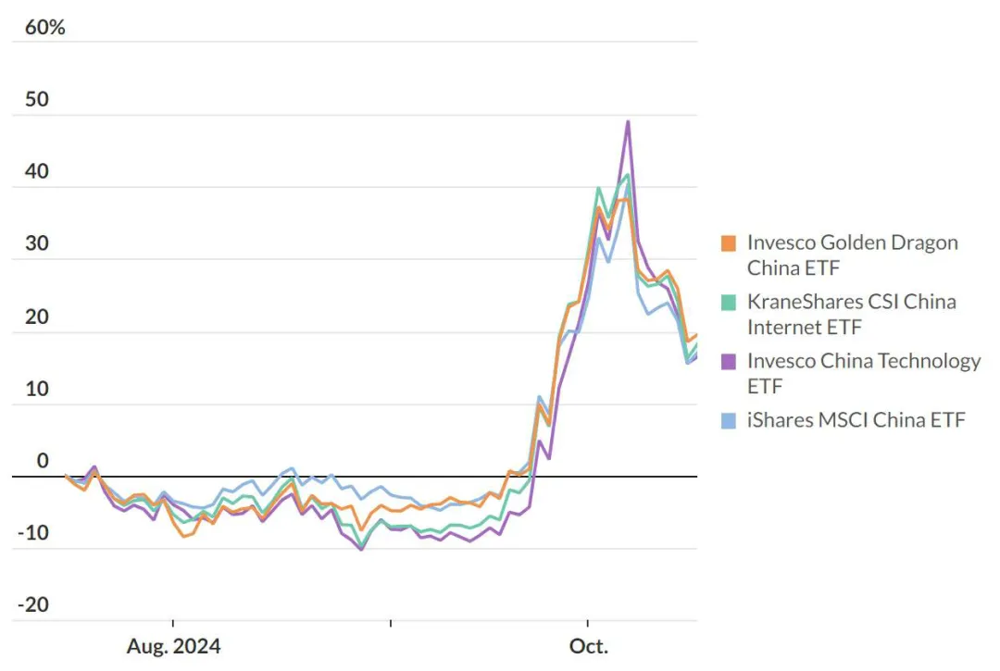
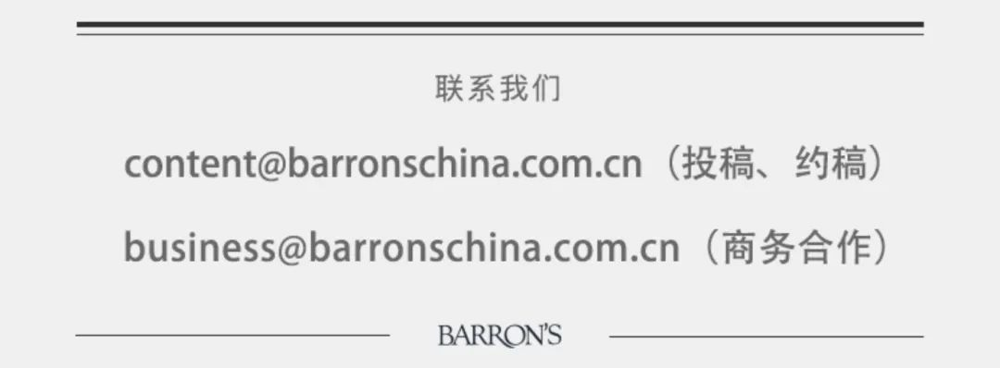

Title: 中国股市反弹将进入第二阶段

URL Source: https://mp.weixin.qq.com/s/LXW0jyJAokdwhxw9-5g9UA

Markdown Content:
这个阶段的特点是上涨速度放慢，波动性加大，投资者将重新把关注焦点放在盈利和估值上。

为防止经济和股市进一步下滑，中国政府从9月份开始推出了一系列刺激措施，后续发布的每一份公告和召开的每一场新闻发布会受到密切关注，重新评估中国资产的投资者掀起了一轮“买入一切和中国有关的东西”的热潮。

不过，这种不加区分的买入往往无法一直持续下去。投资于中国股票的ETF在最近大幅上涨后有所回落。FactSet数据显示，截至周三（10月16日），iShares MSCI China（MCHI）本周累计下跌5.6%，Invesco China Technology （CQQQ）和KraneShares CSI China Internet（KWEB）均下跌7.5%，Invesco Golden Dragon China（PGJ）下跌7%。

截至周三，10月迄今为止，KraneShares CSI China Internet下跌近5%，Invesco China Technology和nvesco Golden Dragon China均下跌近4%，iShares MSCI China跌超2%。

资深中国观察人士在中国股市因政策转变而大幅上涨时曾指出，即将出台的重大举措的细节对于投资者情绪持续转好和扭转经济形势至关重要。目前投资者仍在等待这些细节。

**中国股票ETF在大幅上涨后回落**

来源：FactSet

凯投宏观（Capital Economics）的分析师认为，10月12日财政部会议提出的增加政府债务和支持房地产市场的计划同样重要，但没有提到“大规模补贴消费者”的举措。一些经济学家认为，建立安全网，或直接向消费者发放补贴，是鼓励中国家庭将资金从储蓄中释放出来的一种方式。

凯投宏观的分析师说：“此外，由于缺乏对明年预算赤字规模的前瞻性指引，仍然难以判断财政刺激措施的规模和持续时间。”

TS Lombard预计，在接下来的几个月里，北京将通过地方政府债务重组、银行资本重组和重振消费的措施，推出3万亿元（约合4200亿美元）的刺激计划。

下一个关注焦点将是全国人大会议，任何预算计划都须经过全国人大常委会审批，投资者可能会从此次会议中得到“刺激计划的规模究竟有多大？”这个问题的答案。预计全国人大会议将于10月晚些时候召开，一些分析人士认为会议可能会推迟到11月，届时北京将根据美国大选结果来进行“再校准”。

IG Group市场策略师Yeap Jun Rong认为，下一任美国总统将决定中美贸易关系，此外，9月宣布的政策的成效如何需要一段时间才会反映在经济数据上。

过去几周中国股市的走势强化了这样一种观点：投资者要为大涨之后的震荡走势做好准备。

瑞士宝盛(Julius Baer)中国策略师Richard Tang近日指出，中国股市的反弹将进入第二阶段，特点是上涨速度放慢，波动性加大，投资者将重新把关注焦点放在盈利和估值上。他认为，投资者将通过卖出基本面较弱的股票、增持优质股票来巩固他们对中国的敞口。

Tang建议投资者关注潜在的政策受益者和估值有吸引力的股票，他还建议投资者减持地产股，因为无论政策力度如何，该行业都需要更长的时间才能复苏。

**文 | 巴伦周刊**

**编辑 | 郭力群**

版权声明：

《巴伦周刊》（barronschina）原创文章，未经许可，不得转载。

（本文内容仅供参考，不构成任何形式的投资和金融建议；市场有风险，投资须谨慎。）

