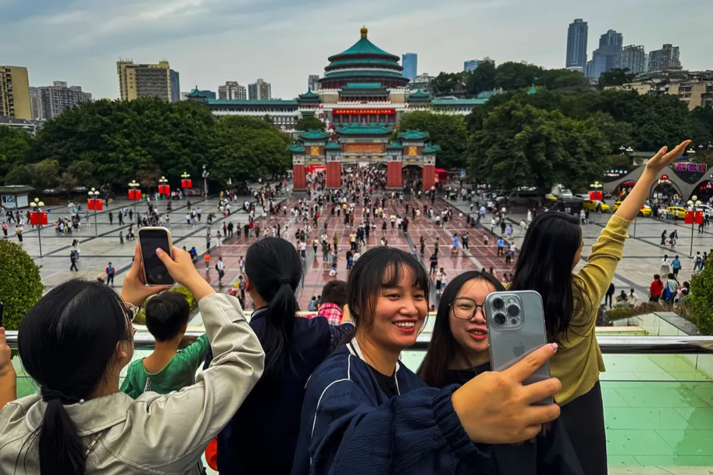
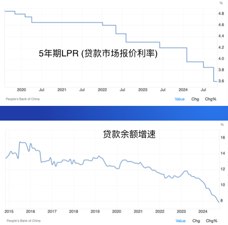
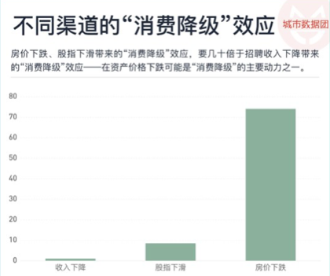

Title: 中央经济工作会议：消费！消费！消费！

URL Source: https://mp.weixin.qq.com/s/T6w7RLgdHL8tffnopG52dA

Markdown Content:
作者：刘胜军

来源：  刘胜军经济学大局观文章已获授权

12月11日至12日，中央经济工作会议在京举行。这次会议传递出清晰信号，那就是必须抓住消费这个“牛鼻子”，促进经济回稳。

一、消费需求不足是核心挑战

会议指出，“当前外部环境变化带来的不利影响加深，我国经济运行仍面临不少困难和挑战，主要是国内需求不足，部分企业生产经营困难，群众就业增收面临压力，风险隐患仍然较多”。  

内需不足是一切问题的源头。内需不足，意味着企业经营困难，企业困难意味着就业压力、风险隐患以及税收萎缩。

魔鬼藏在细节之中：内需分为投资需求和消费需求。我们真正需要提振的是消费需求而非投资需求。扩大投资需求短期内可以拉动总需求，但中长期看必然会进一步扩大供给，加剧供大于求的矛盾。因此，会议下面这句话很重要，“要紧抓关键环节完成好明年经济工作重点任务，针对需求不足的突出症结，着力提振内需特别是居民消费需求”。

诺奖得主克鲁格曼提醒说：  

——“中国消费者支出在国民收入中所占的比例非常低，而随着劳动年龄人口的减少和技术进步的放缓，导致回报递减，过去推动经济增长的高水平投资支出已经变得不可持续。显而易见的解决办法是将更多收入转移到家庭，从而增强消费需求”。

如何扩大消费需求？  

从逻辑上推算，扩大消费需求无非以下几个办法：

1、增加居民收入：短期内消费券是值得尝试的刺激方法。中期看，要靠提高居民收入占GDP比重。

2、提高居民消费意愿：制约消费意愿的因素有三个：1）后顾之忧：教育、养老、医疗、住房“四座大山”；2）对未来收入稳定性的预期。如果担心未来收入难以保障，预防性储蓄就会上升；3）对物价的预期。如果出现物价下跌，消费者就会推迟消费。这就是防通缩的重要性。

至于消费场景，并非宏观政策值得担心的瓶颈。市场机制的创新会自动解决这一问题。

二、2025年促消费战役

促消费，是一项系统工程，必须综合施策、多点发力。

1、财政政策：会议提出“要实施更加积极的财政政策。提高财政赤字率，确保财政政策持续用力、更加给力...增加发行超长期特别国债，持续支持“两重”项目和“两新”政策实施。增加地方政府专项债券发行使用，扩大投向领域和用作项目资本金范围。优化财政支出结构，提高资金使用效益，更加注重惠民生、促消费、增后劲，兜牢基层“三保”底线。”  截止目前，财政支出的扩大主要用于地方政府化债，这有助于保障公务员收入及消费能力、减少“远洋捕捞”等现象，但要促进总体消费的回升，仍需进一步加码。笔者认为，以10万亿规模发放消费券是值得考虑的政策选项。

_[以10万亿消费券重启经济](https://mp.weixin.qq.com/s?__biz=Mzg4MTUzNTE1Mw==&mid=2247496702&idx=1&sn=f09a4344c4ff9f2594c08ddc25306e73&scene=21#wechat_redirect)  
_

_[关于发消费券，所有顾虑都是多余的](https://mp.weixin.qq.com/s?__biz=Mzg4MTUzNTE1Mw==&mid=2247496699&idx=1&sn=73391f08183b0814c2f36bd0daa3ece8&scene=21#wechat_redirect)_  

_[“稳经济”这一仗必须打好，每一粒子弹都不应浪费](https://mp.weixin.qq.com/s?__biz=Mzg4MTUzNTE1Mw==&mid=2247496715&idx=1&sn=76cb79acb102e737182b413608d801d7&scene=21#wechat_redirect)  
_

2、货币政策：会议提出，“要实施适度宽松的货币政策。发挥好货币政策工具总量和结构双重功能，适时降准降息，保持流动性充裕，使社会融资规模、货币供应量增长同经济增长、价格总水平预期目标相匹配。” 这是中央时隔14年重提“适度宽松的货币政策”。货币政策宽松，对资本市场会起到提振作用，也有助于进一步降低房贷利息负担。不过，降息对提升消费的作用是有限的，因为眼下已经出现“主动去杠杆”现象，类似于日本的“资产负债表衰退”。由于就业压力、房价下跌等因素，居民开始主动压减负债以确保资产负债表安全。数据也表明这一点，过去两年，利率一路下行，但并未扭转贷款增速下滑趋势。因此，拉动消费主要不能通过货币政策，而且设法改变消费者的未来预期。

3、大力提振消费：会议将“大力提振消费、提高投资效益，全方位扩大国内需求”列为2025年重点任务的第一条，凸显对消费的重视。会议要求，“实施提振消费专项行动，推动中低收入群体增收减负，提升消费能力、意愿和层级。适当提高退休人员基本养老金，提高城乡居民基础养老金，提高城乡居民医保财政补助标准。” 期待2025年推出有力度的提振消费专项行动。

4、会议提出“综合整治“内卷式”竞争，规范地方政府和企业行为”。这一点也很重要。以拼多多为代表的内卷式竞争，不仅加大了物价下行的压力，也冲击大量中小微供应商的生存能力，企业利润率的下降会抑制投资意愿。以“远洋捕捞”为典型的杀鸡取卵做法，也会对营商环境带来难以弥补的伤害——“一朝被蛇咬，十年怕井绳”。今年1-10月，民间投资增速下降0.3%，这对稳定就业和消费预期是非常不利的。

推荐阅读：_报告两件值得高兴的事儿_

5、稳定房地产对稳消费至关重要：由于房地产一度占居民资产的70%，房价下跌会对居民收入预期和消费意愿带来显著影响。由于房地产高峰时对经济增长贡献率达30%，稳定房地产也是稳增长稳就业的关键一环。会议提出，“持续用力推动房地产市场止跌回稳，加力实施城中村和危旧房改造，充分释放刚性和改善性住房需求潜力。合理控制新增房地产用地供应，盘活存量用地和商办用房，推进处置存量商品房工作。推动构建房地产发展新模式，有序搭建相关基础性制度”。

来源：财新网

消费稳，则经济稳。2023年，最终消费对经济增长贡献率高达82.5%。期待2025年稳消费、促消费能取得重大突破。

