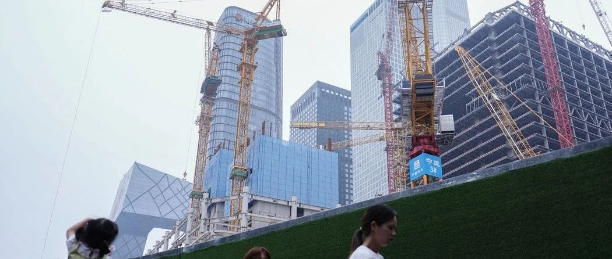
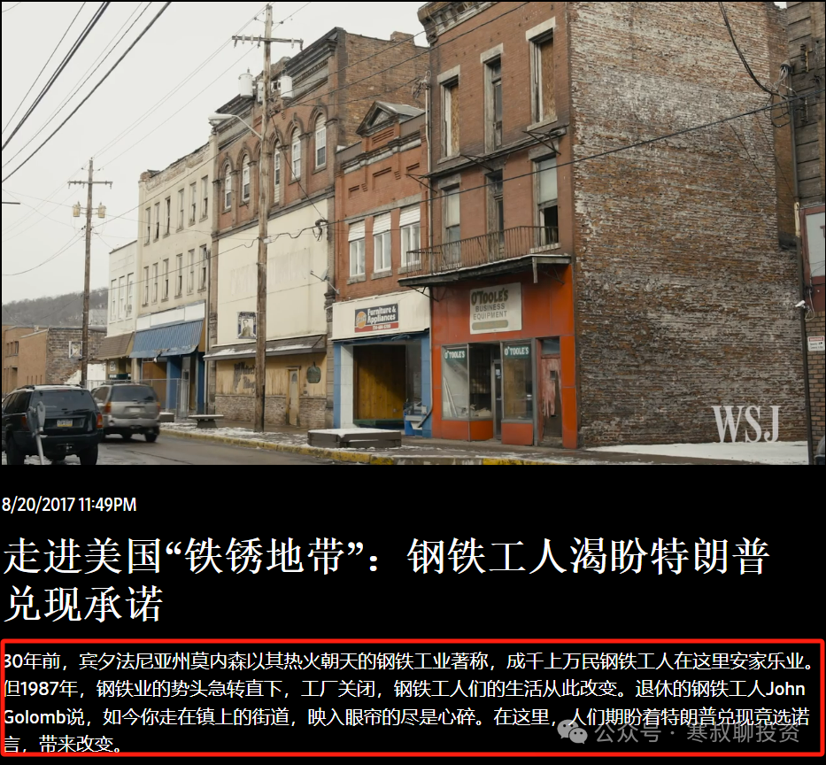
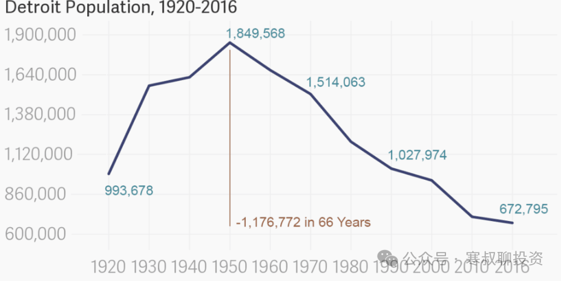
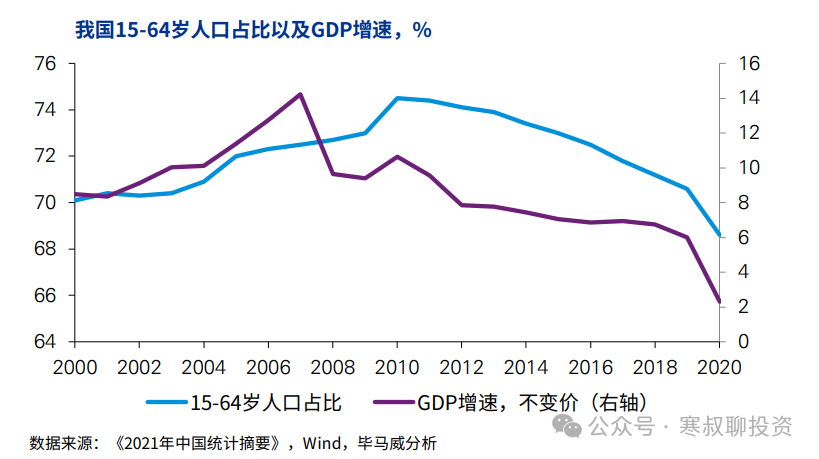
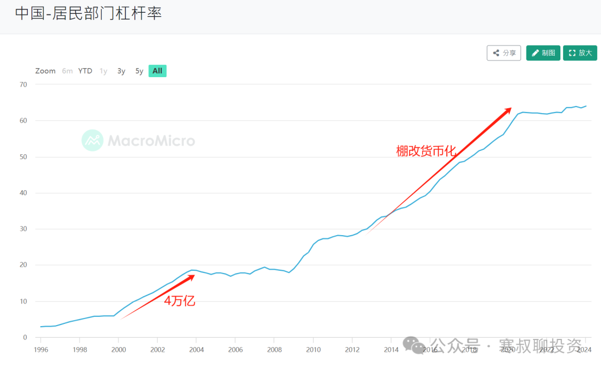
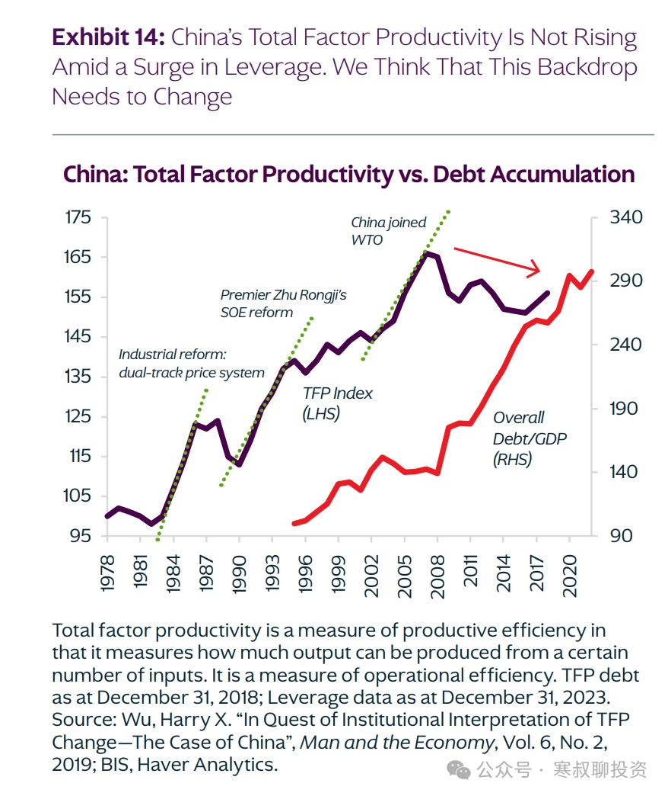
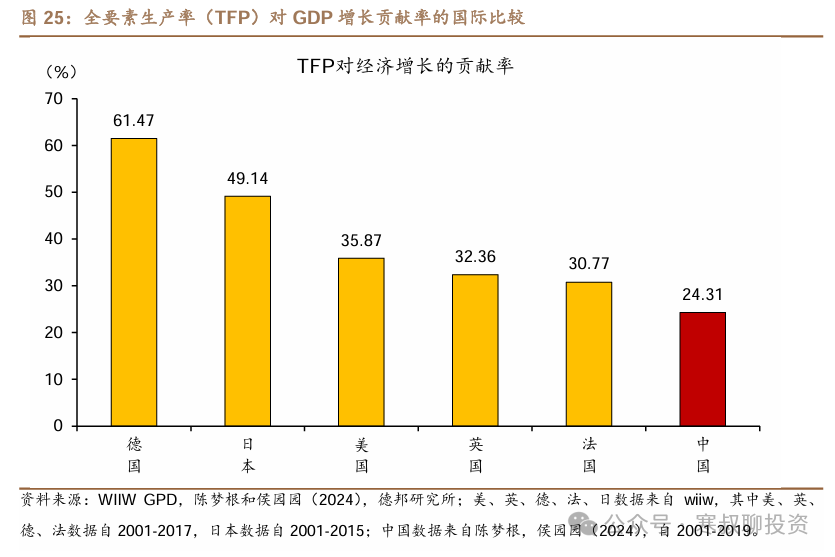
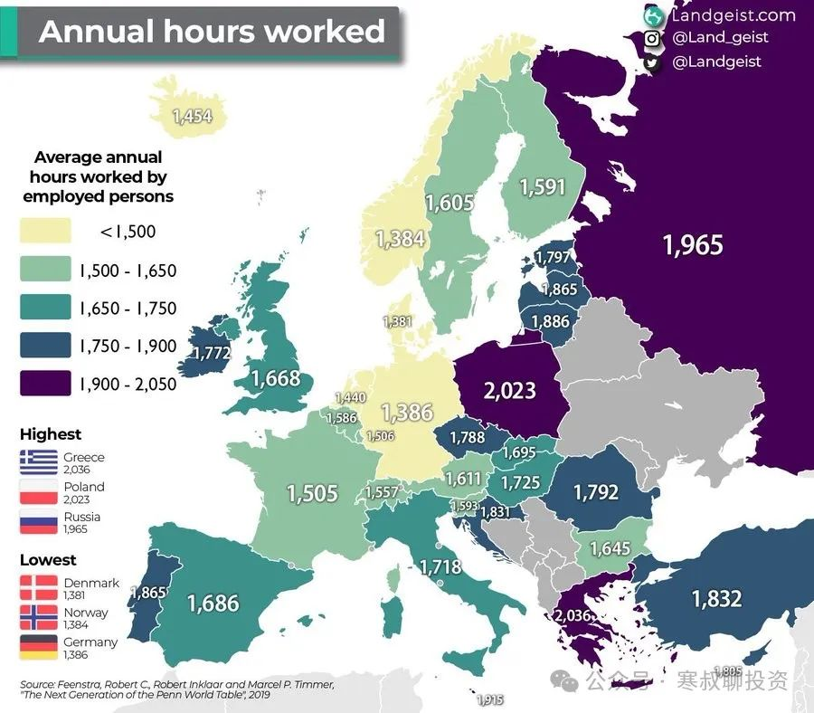
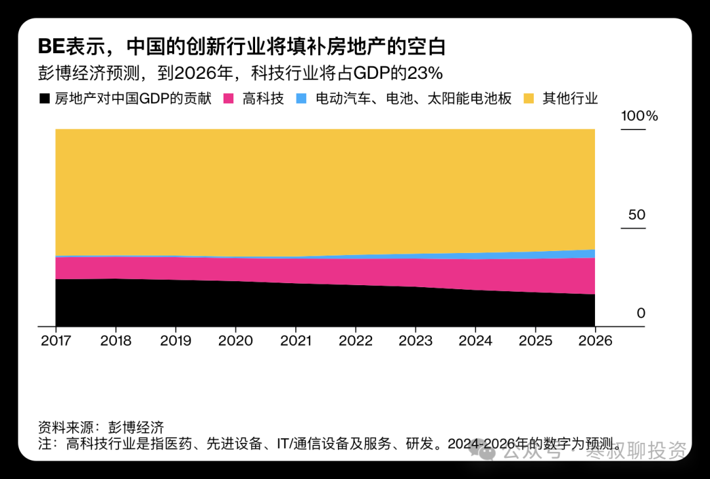
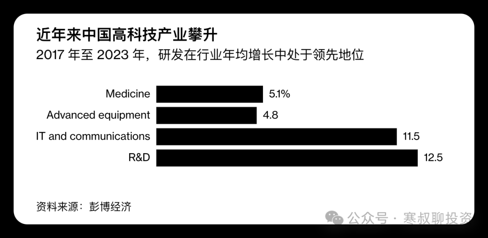

# 为什么我们承受阵痛
                            为什么我们承受阵痛                                                                  

为什么我们承受阵痛
=========

寒叔 [寒叔聊投资](javascript:void(0);)

寒叔聊投资

多年证券、数字货币、黄金投资经验/穿越牛熊、核心城市持续置业/理论+实操，浙江大学

77篇原创内容

_2024年07月18日 13:49_ _中国香港_

我们现在为什么承受阵痛？  

特朗普为什么能在8年前获胜？现在又离获胜近在咫尺？从刚刚他任命的副总统万斯身上可以看出些端倪；

万斯是底层逆袭的楷模，幼年家境贫穷，高中毕业即投入军旅，参加过伊拉克战争，退役返乡就读当地大学，再进入耶鲁大学法学院，毕业后进入入创投界；

作为回忆录《绝望者之歌：一个美国白人家族的悲剧与重生》，这本2016年出版的畅销书中，万斯介绍了自己在俄亥俄州，工人阶级城市米德尔敦的成长经历，书中探讨了工人阶级问题和锈带州衰落现象，引发美国工人阶级的广泛共鸣。

他同意特朗普的观点：自由贸易摧毁了美国制造业，掏空了美国中部地区。

特朗普8年前的胜出出乎意料，一部分原因是，他制造业回流政策，对没落的工业城市，比如宾夕法尼亚和密歇根州中失落的制造业工人-“沉默的大多数”有很大的吸引力，他们期待特朗普上台，并实现承诺；

WSJ中的视频：

我们从中可以看到，任何事情都有代价：“所有命运馈赠，早已在暗中标好了价格”。

铁锈地带的居民，1990年前的几十年，享受了美国制造业繁荣的收益；  

而过去几十年美国廉价的商品，得益于制造业的外迁，从东南亚、到日韩、到中国，到印度和越南，代价就那些失落的制造业工人；

科技和金融的高速发展，让纽约、洛杉矶这些城市更加光鲜亮丽，人口也不断增加，城市也更加繁华，房价节节攀升：

而工业城市不断衰落，比如曾经汽车工业时代风光无限的底特律，因为美国汽车业的衰落而一蹶不振，现在人口为高峰时的1/3，黑人比例从1920年的7.75%，到现在的80%，并在2013年宣布破产；

底特律人口，从高峰时的180万到现在的60万：  

  

社会的发展，总是一部分人会付出代价，比如1998-2000年国企改革中每年700-900万下岗工人，他们曾经享受到“从摇篮到坟墓的”的福利，受到人们的羡慕；但他们完成了历史的使命后，成为历史的包袱，退出了历史的舞台；

又比如曾经的“共和国长子”东北重工业区，在改g春风中成为了“铁锈地带'；

现在类似的故事仍在发生：

2014年是一个重要的拐点，劳动力人口比例开始下降，同时GDP增速也开始下降（这也是经济规律，在其他很多国家都发生）  

本来应该在那时去杠杆调结构的，反而开始了棚改货币化，让全社会加杠杆保持资产价格上涨，但到2020年达到顶点，杠杆就再也加不上去了；

社会和经济的发展主要靠两种力量（达里奥，债务危机）：生产力提升，或债务扩张；

下图我们清楚看到，黑线是全要素生产率（近似可以理解为生产力，计算方式是，产出除以资金、技术、人口的总投入，越高代表生产力越发达)；

生产力在1981年（改开），1990年（南xun），2001年（入世贸）阶段都发生了快速的提升，但2008年之后生产力提升就停滞了；

红色线是债务占gdp比例，我们可以看到2008年之后加速上升，也就是说2008年之后的经济增长，主要来自债务的扩张（地产、基建、金融）；而债务的扩张，是无法持续的，无节制基建也带来了大量的浪费；

如果没有生产力的提升，高负债的结果，要么全社会节衣缩食还债造成通缩，体验一种阵痛，要么是大通胀让债务一笔勾销带来更大阵痛；  

而我们全要素生产率，2008年之后一直停留在美国的 40% 左右，而韩国和日本分别达到了美国的 60% 和 80%。

对经济的贡献在主要国家中偏低。  

所以去杠杆、三道红线，不是地产和经济低迷的核心原因，核心原因是，三道红线晚了几年。  

08年的4万亿，和16年的棚改货币化，是用明天换今天，延缓了阵痛，也延缓了经济结构调整的进度；  

三道红线、高质量发展，是用今天换明天，不再把阵痛往后推；

债务推升资产价格和经济的时候，地产、金融、基建、原材料、家装等行业赚得盆满钵满，但是不管是私人、企业、zf借钱，本质不是向银行借钱，而是向未来的自己借钱；当这些借款大量浪费在低收益项目中，无法在未来创造足够多的收益时候，就会在未来难以支付债务及利息，这就发生了“债务危机”。

土地财政本身并不推动经济发展，而是土地财政、地产是货币扩张的手段和通道，土地和房产作为抵押物，让大量资金进入全社会的各个毛细血管；现代货币体系中，印钱是通过大家借钱的方式发生的；现在地产低迷，M1、M2社融快速下滑，大家都不借钱了，钱“印”不出来，就发生了通缩。

现在这些过去赚得盆满钵满的行业，也像美国铁锈地带的工人、1998年国企下岗员工一样，承受经济转型的代价。

当然地产衰落本身也不会推动经济发展，反而会阻断资金的流动，只有新的增长点出现，居民、企业和zf，开始借债投资、消费，我们才能走出通缩；

只有科技发展，推动生产力提升，经济增速才能真正提升。

“高质量发展”战略的提出，除了增强国力以外，还有3个重要因素  

1、通过转型的阵痛，避免经济失速

地产、基建、低端制造业，吃的是劳动人口红利，就是人多体力不值钱；建筑工人、流水线工人他们吃的是青春饭，一旦老龄化加快、人口红利消失，这些工人无法投入生产，不仅他们收入都下降、消费下降，这些行业用人成本也快速上升，企业利润下降；

只有向产业链上游进军，获取超额收益，才能减少老龄化对社会的影响，保持经济的发展，才能发挥“老龄人口”的劳动力优势；50岁很难去工地搬砖或富士康干活，但可以通过成为掌握专业工程师，在高端制造领域发光发热，这才能提高全社会整体的生活水平；

高科技、制造业发达的地方，不仅人均生活水平更高，而且工作时长越短；和我们直觉相反，拿欧洲来说，平均工作时长最短的国家是丹麦、挪威和德国，接下去是英国、法国、瑞士；印象中休闲散漫的西班牙、意大利、土耳其工作时长远高于德国、瑞士；工作时长最长的是制造业落后、经济相对落后的希腊、波兰和俄罗斯；  

2、杠杆率高企，无法大幅加杠杆

可能有人会有疑问，杠杆率提升，来一轮大通胀，抹除企业、个人、地方的所有债务，不就解决所有问题了？但大通胀对社会的负面影响，远大于通缩，并且会让落后产能苟延残喘，推迟经济转型的时间；  

3、改善分配

地产和基建不能出口，就算赚钱，也是国内一部分人赚另一部分人的钱，只是分蛋糕，并不会把蛋糕变大；

并且通胀，也是财富的重新分配（相关内容：[通胀通缩、房价涨跌、都是财富的重新分配](http://mp.weixin.qq.com/s?__biz=MzkxODMyNTg0Mg==&mid=2247486553&idx=1&sn=93f3bb3a97c4de0be3ea5163743e1cef&chksm=c1b25364f6c5da722e5d8ed87e03e4cf8d587b9f42ec81d7648737e050d70785e581a3b98553&scene=21#wechat_redirect)）。

出口贸易，高端制造，是赚老外的钱，是把蛋糕做大；

彭博最新文章标题是《中国对高质量发展的长远布局,为经济放缓提供了缓冲》

文章中彭博经济公司的经济学家Chang Shu和Eric，认为大家可能过度悲观，未来经济可能“再平衡”，并预计创新行业的发展会填补地产的空白；  

与高科技产业（包括医药、先进设备、信息技术和通信设备与服务以及研发）相关的 GDP 在 2018 年至 2023 年期间平均增长 12%，明显快于 7% 的名义 GDP 增长率。

目前经济冷热不均

总体来说目前还在低谷，经济增速不及预期，房地产塌缩，投资和销售还在持续下滑，融资快速下滑，拖累广义货币增速破7%，狭义货币增速连续几个月为负数，PPI两年半多为负，CPI持续疲软，消费低迷；

另一方面工业生产持续强劲，进出口总额也保持增长，贸易顺差创历史新高；

各项数据显示经济还在底部徘徊。

6月25日出席夏季达沃斯论坛致词时提到的“固本培元”，意思就是不会像08年、16年那样大规模刺激，调整经济结构的“战略定力”要保持。

地产救的前提是触发“金融风险”，救的目标也类似：“不触发金融风险”，而不是大涨。还指望放水楼市大涨的可以醒醒了。  

央行行长6月在陆家嘴论坛上的发言也表达了类似的意思：

加大对科技创新和设备更新改造的金融支持

"规模情节"不合理，宏观金融总量规模已经很大。金融总量增速有所下降也是自然的，要逐步淡化对数量目标的关注；

货币政策结构比总量更加重要。

  

结语  

二战后跨越“中等收入陷阱”进入发达国家行列的国家，占比大约是1/10，  

其中大部分是承接了美国的产业链，比如韩国、新加坡以色列，无一例外都有发达的制造业；其他虽然数据上进入发达国家行列，但是深陷债务危机，居民生活水平停留在20年前，比如西班牙、希腊、捷克；  

还有些产业升级不成功，有进入发达国家的机会，但是还停留在发展中国家，比如泰国、马来西亚；

还有不少，成功从发达国家成为发展中国家，比如阿根廷、巴西、土耳其、希腊、委内瑞拉，无一例外都是产业升级失败，用负债推动经济发展，“借明天”来保证目前生活水平不下降，最后深陷债务危机，恶行通胀发生，生活水平回到解放前。

  

  

其他内容：  

[历史有垃圾时间，你没有](http://mp.weixin.qq.com/s?__biz=MzkxODMyNTg0Mg==&mid=2247486846&idx=1&sn=e3c15bf9480e1feba1d00e3107a8492f&chksm=c1b25243f6c5db55ca449b22f02f5110d0bec6366787a25a9a62ba9b33839d8cff0a0f4dd861&scene=21#wechat_redirect)  

[为什么经济总量增长这么多，但A股常年3000点？（被封修改后重发）](http://mp.weixin.qq.com/s?__biz=MzkxODMyNTg0Mg==&mid=2247486752&idx=1&sn=6a0b756b74693a0d02b4ed799f4af86b&chksm=c1b2521df6c5db0b1dffc195f7f5864ec6dfeb32b690df0d9cb32b633d8f8c169846876a0814&scene=21#wechat_redirect)  

[钱到底是怎么印出来的？](http://mp.weixin.qq.com/s?__biz=MzkxODMyNTg0Mg==&mid=2247486578&idx=1&sn=80e7ee7be335ab11c1d48106bf7abd3d&chksm=c1b2534ff6c5da59de0c479f5a0ba495e91a63d40240de3de0be943f778a3224ac83285414b8&scene=21#wechat_redirect)  

[超长期国债](http://mp.weixin.qq.com/s?__biz=MzkxODMyNTg0Mg==&mid=2247486625&idx=1&sn=a8e9e18abacd9c2f42662357c59836e7&chksm=c1b2539cf6c5da8aa8ffdbc53eb976d12dd5a02746ff9ea9c2ac9b262d3d766edf1bd60e618f&scene=21#wechat_redirect)  

[M1和社融历史新低的背后，可能是利好](http://mp.weixin.qq.com/s?__biz=MzkxODMyNTg0Mg==&mid=2247486648&idx=1&sn=4545666000c3485d3357431c3f884306&chksm=c1b25385f6c5da93b28011b5ab1aced9356a776eb6a6c405ecf3ec0176e22760a5ccf894a155&scene=21#wechat_redirect)  

[超长期国债](http://mp.weixin.qq.com/s?__biz=MzkxODMyNTg0Mg==&mid=2247486625&idx=1&sn=a8e9e18abacd9c2f42662357c59836e7&chksm=c1b2539cf6c5da8aa8ffdbc53eb976d12dd5a02746ff9ea9c2ac9b262d3d766edf1bd60e618f&scene=21#wechat_redirect)  

[所有现在造成通缩的力量，未来都会推升通胀](http://mp.weixin.qq.com/s?__biz=MzkxODMyNTg0Mg==&mid=2247486439&idx=1&sn=8623e549abf5f2ff67e9a93a72feb71d&chksm=c1b254daf6c5ddccb5a436e67ad1cfee5253e64dbc5a340c5c0b9faf6632fc68e53f54803988&scene=21#wechat_redirect)

[大跌之后，房产应该抛售还是抄底？](http://mp.weixin.qq.com/s?__biz=MzkxODMyNTg0Mg==&mid=2247486383&idx=1&sn=a5c5055ec43d80f9219a1313c9fc423e&chksm=c1b25492f6c5dd84531b517b8c89317c12e4c74dd3695df8fbb2939244415e348d4f6cfe5582&scene=21#wechat_redirect)  

[和日本当年这么多惊人的相似，我们是否也会“失去20年”？](http://mp.weixin.qq.com/s?__biz=MzkxODMyNTg0Mg==&mid=2247486017&idx=1&sn=8036d5217522a499a58e75199a1498a4&chksm=c1b2557cf6c5dc6a197dd292fbc086766463232e2d0ecfc15f4c12637f1b15c945e51bee98ad&scene=21#wechat_redirect)  

[2024年展望，会好起来吗？（被封修改后重发）](http://mp.weixin.qq.com/s?__biz=MzkxODMyNTg0Mg==&mid=2247485652&idx=1&sn=d2254376bc2b429aef104eb83f4c7023&chksm=c1b257e9f6c5deffd1b2cef2ef2ceb544bcaa592be0d503f888d107550994198bb4b1205ce87&scene=21#wechat_redirect)

[决定股价、房价上涨的关键因素](http://mp.weixin.qq.com/s?__biz=MzkxODMyNTg0Mg==&mid=2247485079&idx=1&sn=7e0b0dd3e9ba77ac917b9ca6bbf60b07&chksm=c1b259aaf6c5d0bcca94de5947d505181ea52612b85f47e8186b278d2b5f759da3627bef1db1&scene=21#wechat_redirect)  

[货币大放水，物价、股价、房价持续下跌，钱去哪里了？](http://mp.weixin.qq.com/s?__biz=MzkxODMyNTg0Mg==&mid=2247485385&idx=1&sn=5eda1f6c69e4cee65557c4c44e0b690c&chksm=c1b258f4f6c5d1e24f48ab572891db2bce530e21989072090e2e954a6f6c5b40d409b9225212&scene=21#wechat_redirect)

[为什么持续印钞，房价股价还在跌？-预判房价股价的3个指标](http://mp.weixin.qq.com/s?__biz=MzkxODMyNTg0Mg==&mid=2247484798&idx=1&sn=eea423f0f78dc5f11e8c0cfd928f8b7a&chksm=c1b25a43f6c5d355acb2a6830f185aada584bcd83eac1e459c3c8ec3054e2f8be279b6ecdc7f&scene=21#wechat_redirect)

[房价什么时候反弹？](http://mp.weixin.qq.com/s?__biz=MzkxODMyNTg0Mg==&mid=2247484550&idx=1&sn=e003685c1a29252d7895c2033ebe1343&chksm=c1b25bbbf6c5d2ad1237af0830f9d45751232030acff558f98a1346351896436291bda3030df&scene=21#wechat_redirect)

  

  

预览时标签不可点

​

暂无留言

已无更多数据

[发消息](javascript:;)

写留言

关闭

**写留言**

提交更多

[表情](javascript:;)

微信扫一扫  
关注该公众号

继续滑动看下一个

轻触阅读原文

  

寒叔聊投资

向上滑动看下一个

当前内容可能存在未经审核的第三方商业营销信息，请确认是否继续访问。

[继续访问](javascript:)[取消](javascript:)

[微信公众平台广告规范指引](javacript:;)

[知道了](javascript:;)

 微信扫一扫  
使用小程序

[取消](javascript:void(0);) [允许](javascript:void(0);)

[取消](javascript:void(0);) [允许](javascript:void(0);)

： ， 。  视频 小程序 赞 ，轻点两下取消赞 在看 ，轻点两下取消在看 分享 留言 收藏

**寒叔聊投资**

为什么我们承受阵痛

人划线

,

选择留言身份