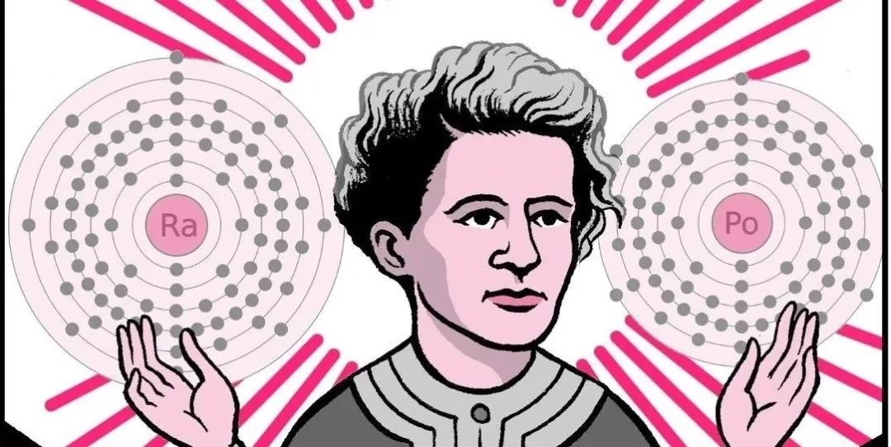
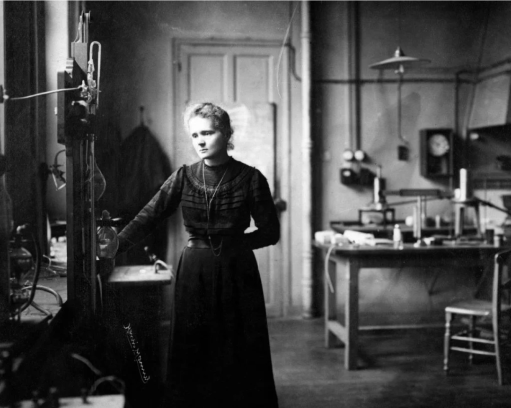
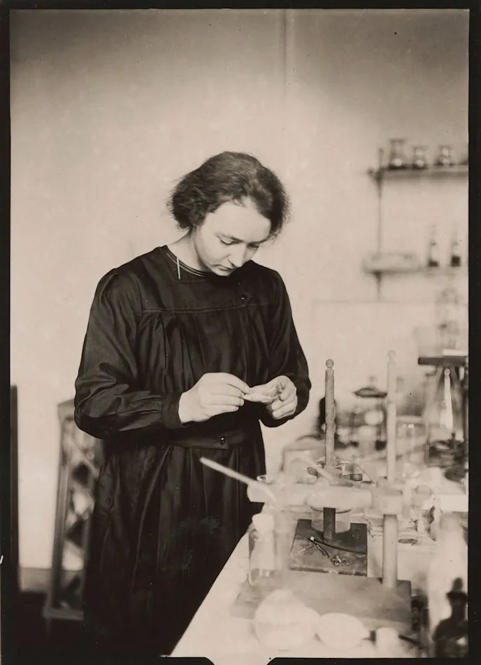
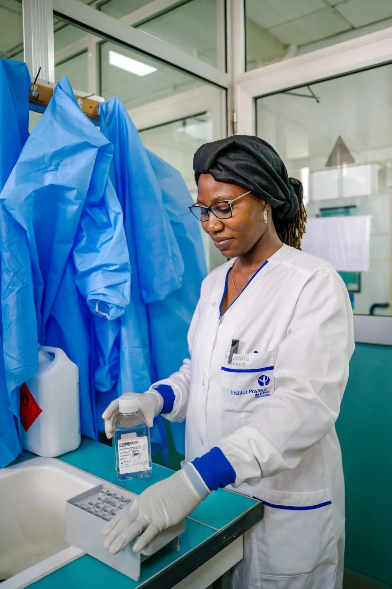
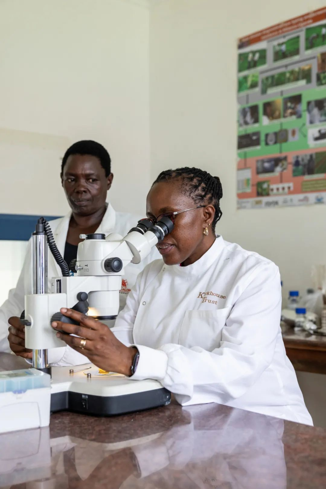
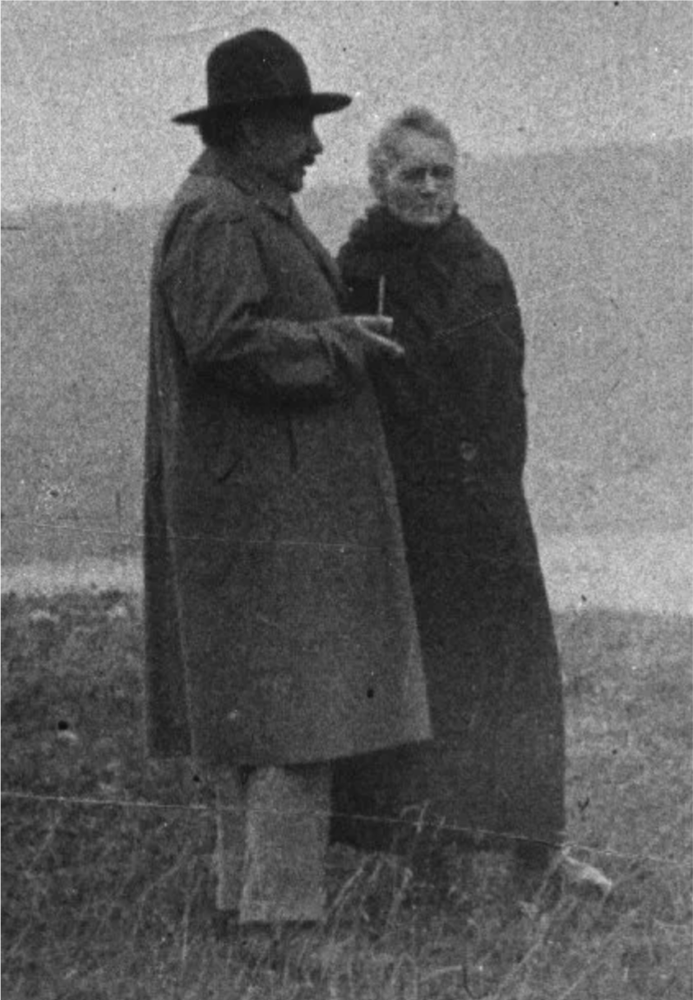
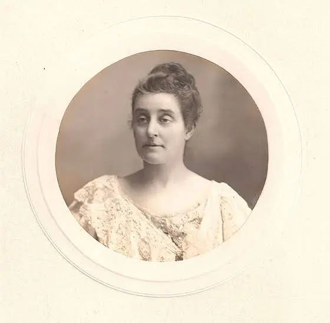
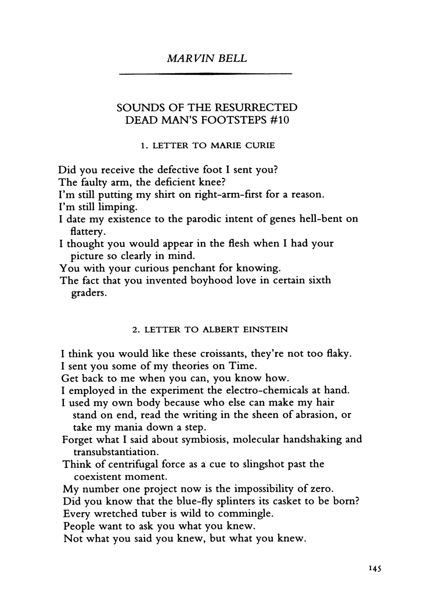
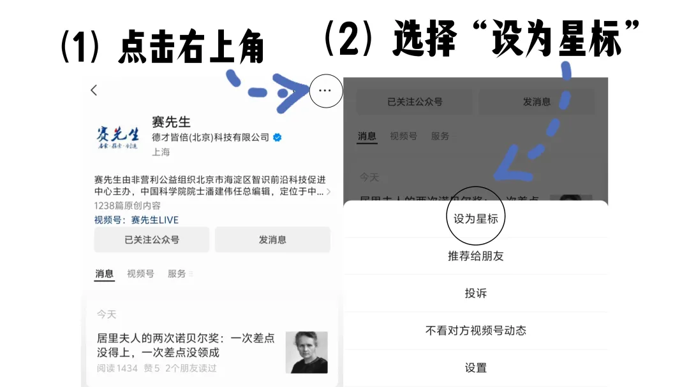

Title: 人们对居里夫人最大的误解

URL Source: https://mp.weixin.qq.com/s/Y-rLrjbNHpHyt-FrTOXSHA

Markdown Content:

《乐天行动派》封面图

**导读：**

       在科学的历史长河中，女性的身影常常被忽视，但她们的贡献却如星辰般闪耀，指引着人类探索未知的方向。从居里夫人在放射性领域的开创性研究，到无数后来者在实验室中孜孜不倦的探索，女性科学家不仅突破了科学的边界，也在性别偏见的壁垒上凿开了一个个缺口。她们的故事提醒我们，创新从来不只是男性的专属领域，女性同样能够以独特的视角和坚韧的力量推动世界的进步。

**Clara Moskowitz |** **撰****文**

****乐天行动派 | 译文来源****

玛丽·居里（居里夫人）出生于150多年前，但她的名字至今仍是许多人提到女性科学家时首先想到的。**这位两度摘得诺贝尔奖桂冠的传奇人物，以发现放射性现象及镭和钋两种放射性元素而闻名于世。然而，鲜为人知的是，她还鼓舞了一代又一代在她实验室中工作的女性。在她的引领下，这些女性投身科研，继续探索未知。**虽然像居里夫人那样声名远扬、影响深远的女性科学家为数不多，但她们依然从居里夫人的奋斗与成就中汲取力量，在科学的道路上不断前行。

■ 图源：Shideh Ghandeharizadeh

戴瓦·索贝尔（Dava Sobel）在她的新书《玛丽·居里的元素：镭的光芒如何为女性在科学领域开辟道路》（_The Elements of Marie Curie：How the Glow of Radium Lit a Path for Women in Science_）中，不仅详细记录了居里夫人的一生与科研成就，还描绘了多位曾与她共事的女性科学家的故事。作为一名资深作家，索贝尔还担任《科学美国人》的诗歌编辑。她注意到，人们对居里夫人的了解往往仅限于她的名字，而对她培养的研究人员网络以及她生命中的许多其他侧面却知之甚少。

“每个人都知道她的名字，但几乎没人真正了解她的故事。”索贝尔感慨道。1934年，居里夫人因长期接触辐射引发的疾病去世。

围绕居里夫人在科学、历史以及性别平等方面的深远影响，《科学美国人》与索贝尔展开了一场深入而富有启发性的对话。

**_问：您是如何了解到与居里共事的那些女性科学家的？_**

**答：**2020年，我受邀为一本名为《女性与她们的元素》的书撰写评论，这本书是一部关于女性化学家的论文集。最初，我只认得其中两个名字：玛丽·居里和她的女儿伊雷娜·约里奥-居里。然而，当我深入阅读时，我惊讶地发现，有许多女性曾跟随她学习或在她的实验室工作过。读到第五、第六位女性时，我逐渐意识到，这些科学家人彼此联结，构成了一个紧密的社群。**通过巴黎的居里博物馆，我进一步了解到，至少有45位女性曾在她的实验室中工作过。作为索邦大学历史上第一位女性教师，她的开创性地位自然吸引了许多渴望追随她脚步的女性**。再加上她在1903年和1911年两次获得诺贝尔奖，早已声名远扬，这更让她的实验室成为无数女性科学家向往的地方。于是我想，这或许是大多数人对居里夫人的认知中所缺失的一部分，而这也正是我研究的起点。

■ 法国籍波兰裔物理学家玛丽·居里（居里夫人）在实验室工作，照片摄于约1905年 / 图源：H. Armstrong Roberts/ClassicStock/Getty Images

**_问：居里夫人是如何取得那些重大发现的？_**

**答：****她拥有非凡的决心和毅力，从华沙走向巴黎，只为追寻接受高等教育的机会。在当时科学界对女性充满偏见的环境下，她依然坚信自己的能力，并全身心投入到艰苦的实验工作中。**而她的婚姻为她的科研事业提供了重要的支持。在她开始博士研究时，她与丈夫皮埃尔·居里携手合作，共同探索物理学家亨利·贝克勒尔发现的铀射线（后来被称为放射性现象）。

铀衰变会释放出辐射，这是一个全新的发现。然而，当时科学界的目光都聚焦在X射线上，对这一现象并未给予太多关注。1896年，关于X射线的研究论文已有上千篇，而铀射线却几乎无人涉足。居里夫人选择了一个较少被研究的方向，这为她的探索提供了一个独特的机会。

令我感到惊讶的是，她在踏入这一领域不久后，便在1897年迎来了第一个孩子的诞生。在此之前，我曾以为她的孩子是在她确立了科学家身份之后才出生的。

■ 1922年3月，居里夫人的长女伊雷娜·约里奥-居里在镭研究所居里实验室工作 / 图源：Association Curie Joliot-Curie

这是一个充满女性特质的故事。她养育了两个孩子，经历过流产和哺乳的种种艰辛。一些曾来到她实验室工作的女性，在结婚生子后便选择了退出科研。即便一百多年过去了，许多女性科学家中依然存在类似的情况。正因如此，我希望通过这本书直面这些问题。**我认为，让年轻女性了解其他女性科学家如何在事业与家庭之间找到平衡，看到她们如何克服困难、坚持梦想，这一点至关重要。**

_**问：居里夫人是否主动致力于招募更多女性投身科学事业？**_

**答：**她或许并未刻意去招募女性，但与众不同的是，她对女性的加入毫无偏见。这一点在当时显得尤为难得。再加上她的卓越地位和声望，自然吸引了许多女性前来，并深深激励了她们。书中提到几位比她年轻的女性，她们从小听着居里夫人的故事长大，心中便埋下了这样的种子：“原来，我也能成为一名科学家。”更令人感慨的是，即使在近一个世纪后的今天，她的影响力依然未减。**居里夫人虽已辞世近百年，但她的精神仍然熠熠生辉——不仅鼓舞着投身科学的女性，也为各行各业的女性点燃了前行的火炬。**

■ 在塞内加尔达喀尔的巴斯德研究所实验室，一位女性科研人员正在做实验 / 图源：盖茨基金会

_**问：您认为人们对居里夫人最大的误解是什么？**_

**答：**有一种常见的说法是，她并没有真正做出什么贡献，所有的工作都是皮埃尔完成的，而她只是他的助手。然而，皮埃尔本人曾明确反驳过这种观点，可惜几乎无人理会。

还有一种批评认为：“她只是动手能力强，头脑却不够出色。她的工作不过是专注于那些复杂而繁琐的化学提取过程，这些工作需要反复操作多个步骤，而这正是她擅长的部分。”**这种说法其实反映了科学界对女性的一种刻板印象：女性只能从事枯燥的基础性工作，而男性则被赋予了随时随地迸发灵感的“天才”形象。这种偏见至今仍未完全消失。**

■ 在乌干达卡万达的卡万达研究所实验室，两位女性科研人员克莱尔·穆吉沙博士和凯瑟琳·阿坎正在合作检查豆类植物疾病 / 图源：盖茨基金会

_**问：这些偏见只是居里夫人面对的种种阻力中的一个缩影。那么，当时的科学界对女性而言究竟是怎样的环境呢？**_

答：她身处的是一个性别歧视根深蒂固的时代。法国科学院曾将她拒之门外。尽管她得到了许多支持，但最终还是未能当选为院士。而要在这个科学院的周刊上发表研究成果或展示工作，必须具备院士身份。因此，她不得不多次请朋友代为汇报自己和实验室成员的研究成果，这对她来说无疑是一种深深的无奈和尴尬。作为放射性研究领域的绝对权威，她在专业圈中却始终未能获得应有的认可。

后来，她的女儿也多次尝试进入科学院，即便她同样是诺贝尔奖得主，却依然被拒之门外。**可以说，当时的科学界充满了性别偏见与人为设置的壁垒。然而，在这样的环境中，居里夫人依然凭借自己的坚韧与才华，突破了其中的大多数障碍。**

■ 1929年，阿尔伯特·爱因斯坦与玛丽·居里（居里夫人）站在一起交谈 / 图源：British Society for the History of Radiology

_**问：除了支持和鼓励特定女性在科学领域的发展，您认为居里夫人如何改变了后世女性在科学中的地位？**_

**答：**我们谈论的是20世纪初，那是物理学发展的一个关键转折点。而在那些具有里程碑意义的索尔维会议上（这一开创性的物理学大会始于1911年），整整三十年间，她始终是会议室中唯一的女性。正因如此，她与当时几乎所有顶尖物理学家都有所交集：欧内斯特·卢瑟福、阿尔伯特·爱因斯坦、恩里科·费米、尼尔斯·玻尔，以及其他科学巨擘。她不仅与他们建立了深厚的私人关系，更通过自己的存在，潜移默化地改变了他们的观念。“**原来女性也可以做这些。”这种想法或许从未在他们脑海中出现过，但她的出现让这一切显得再自然不过。可以说，仅仅通过她的存在，她就为同时代的科学家带来了深远的影响。**

■ 与居里夫人同时代的英国女性科学家赫莎·艾尔顿 / 图源：Physics World

**_问：您是《科学美国人》的诗歌专栏编辑。居里夫人与诗歌之间有什么联系吗？_**

**答：**作为波兰人，她成长于一个极具民族自豪感的家庭，家人对波兰的文化传统深感骄傲。在这样的环境中，她从小就浸润在三位波兰文学巨匠的作品中：亚当·密茨凯维奇、齐格蒙特·克拉辛斯基和尤利乌什·斯沃瓦茨基。她的家族还有在各种场合创作诗歌的传统，她自己也尝试过写诗。比如，在初到巴黎求学时，她曾写下一些记录学生生活的诗句。**她的诗作更多聚焦于个人生活，而非科研事业。尽管如此，她的传奇人生却激发了无数诗人创作灵感。例如，著名诗人艾德丽安·里奇就曾以居里夫人为题，写下了一首动人的诗篇。******

■ 诗人马文·贝尔致玛丽·居里（居里夫人）与阿尔伯特·爱因斯坦的信 / Poetry Foundation

本文译自Scientific American官网文章：The Untold Story of Marie Curie’s Network of Female Scientists；于2025年2月26日首发于公众号《乐天行动派》。

原文链接：https://www.scientificamerican.com/article/how-marie-curie-helped-a-generation-of-women-break-into-science/

**星标《赛先生》**公众号，

不要错过我们每日为您精心准备的高质量文章！

**欢迎关注我们，投稿、授权等请联系**

**saixiansheng@zhishifenzi.com**

**合作请添加微信SxsLive2022**
