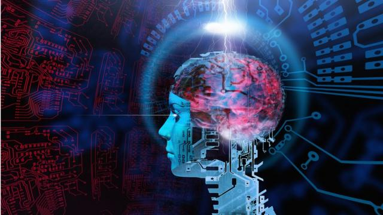
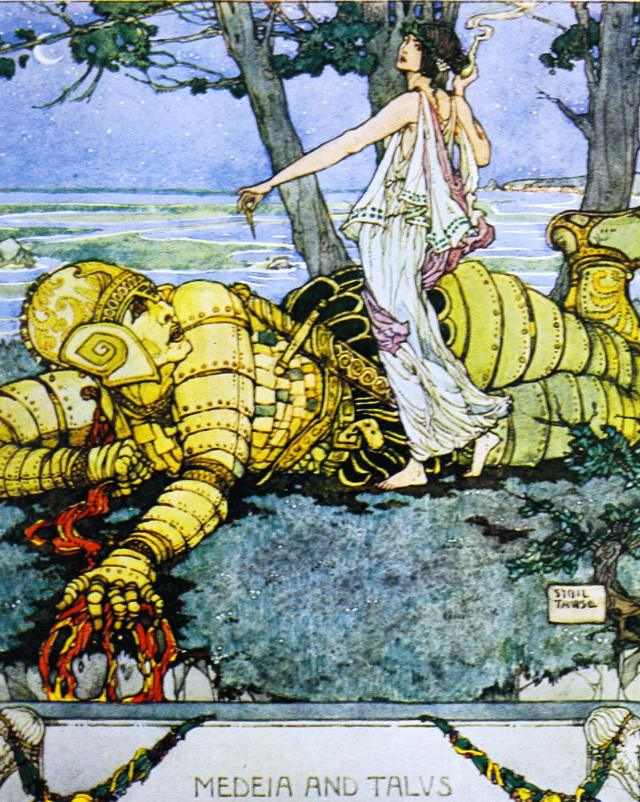
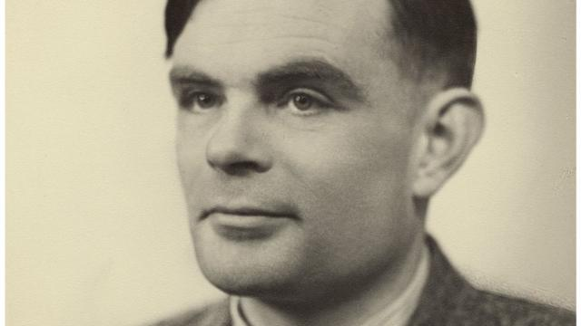
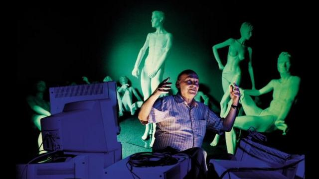
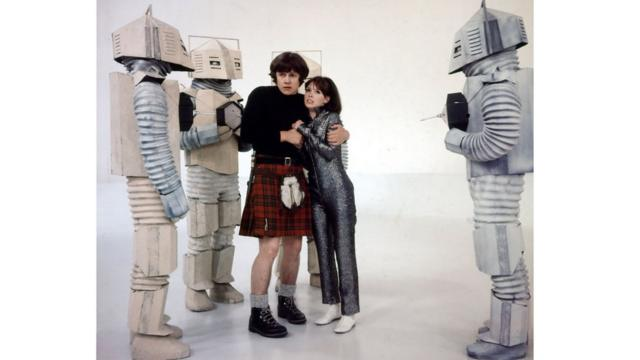
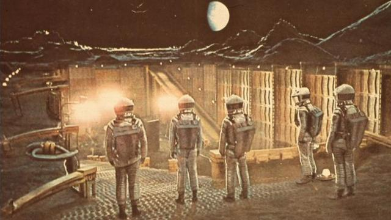
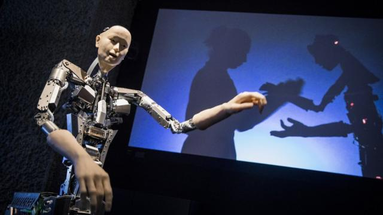
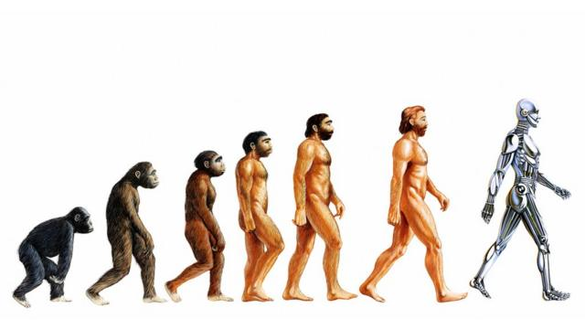

# 人工智能70年：科幻和现实的交融 - BBC 英伦网
2019年6月11日

图像来源, MEHAU KULYK/SCIENCE PHOTO LIBRARY

图像加注文字, 人工智能学科的奠基石之一是1940年代美国神经科学家和逻辑学家联合提出的神经元数学模型

**人类****飞跑着****进入****人工智能（****AI****）****时代。** **粗略估算现在人们日常生活中有20多种寻常的****AI****，从垃圾邮件过滤器到叫车软件。** 

AI被分为两类，这些执行具体任务的AI属于“弱人工智能”；另一类“强人工智能”，又称“通用人工智能”（AGI） ，能够模仿人类思维、决策，有自我意识，自主行动。这一类目前主要出现在科幻作品中，还没有成为科学现实。

人工智能的起源可以追溯到哲学、虚构和想象。

作为计算机科学的一个分支，人工智能学科只有大约70年历史，不乏跌宕和学术门派之争，定义含混和因此造成的困惑、迷思仿佛层峦叠嶂，科幻和现实经常相互越界。

AI研发史上经历过两次“寒冬”，2018年人们又开始谈论第三个AI寒冬将至的可能性。

人工智能正在如何改变我们的生活？它将把我们带向何方？人类和机器的关系如何界定？看懂现在，展望未来，或许可以从回顾历史开始。

图像来源, AFP

图像加注文字, 古希腊荷马史诗中的铜制机器人塔洛斯据信是世界上第一个拟人机器人。托马斯·布尔芬奇一本关于希腊神话中的神祗和英雄故事的书（1920）中塔洛斯的彩色插图，插图作者是西贝尔· 陶斯（Sybil Tawse）

古老的梦
----

地球上第一个行走的机器人叫塔洛斯，是个铜制的巨人，大约2500多年前在希腊克里特岛降生在匠神赫菲斯托的工棚。据荷马史诗《伊利亚特》描述，塔洛斯当年在特洛伊战争中负责守卫克里特。诸神饮宴时有会动的机械三足鼎伺候。

埃德利安·梅耶（Adrienne Mayor）在《诸神与机器人》（Gods and Robots）甚至把希腊古城亚历山大港称为最初的硅谷，因为那里曾经是无数机器人的家园。

除了古希腊、罗马，其他古文明也不乏人类对“复制自己”的探索。犹太人传说中有生命的泥人，印度传说中，守卫佛祖舍利子的机器人武士（模仿古希腊罗马自动人形机的设计）；佛教传入前日本的神照神社，中国的兵马俑，后来又有了达芬奇的机器人武士、会下象棋的木头人“土耳其”，等等。虽然跟现在一般理解的人工智能似乎风马牛不相干，但这些尝试都体现了人类复制、模拟自身的梦想。

不过，法国索邦大学计算机学教授让-加布里埃尔·加纳西亚（Jean-Gabriel Ganascia）认为，古代神话中人形物体被赋予生命，与今天人们想象和担忧的“通用人工智能”，即具有超级智能的机器，都更多属于想象而不是科学现实，至少目前如此。

在开创人工智能学科的先驱者心目中，AI的初衷是用机器来模拟人类、动植物和物种种群的演变，这个学科立足于这样一种猜想：所有认知功能都可以被精确描述，从而有可能在计算机上复制。

作为现代科技学科的AI历史很短，但不乏跌宕坎坷。

图像来源, ktsimage/Getty Images

1940年代——奠基
----------

1943年，美国神经科学家麦卡洛克（Warren McCulloch）和逻辑学家皮茨（Water Pitts）提出神经元的数学模型。后来有人说现代AI梦就诞生在那个时候。

那个梦是一篇题目绕口的论文，《神经活动中内在思想的逻辑演算》（A Logical Calculus of Ideas Immanent in Nervous Activity）。这篇论文被视为人工智能学科的奠基石。现在大热的“深度学习”，前身是人工神经网络，而其基础就是神经元的数学模型。

这篇论文的发表也标志着人工智能学科三大派之一的仿生学派诞生。这个学派从神经网络的连接机制着手来发展人工智能，被称为连接主义派，后来符号逻辑派占上风几十年，神经仿生派一直到二十世纪八、九十年代才翻身，以新连接主义面目复兴。

AI的另一块基石是加拿大神经心理学家赫布（Donald Hebb）1949年提出“赫布规则”，简单说就是两个细胞如果总是同时被激活，那么它们之间就有某种关联，关联度与同时激活概率成正比关系。这个规则今天用在机器自动学习算法中。

图像加注文字, 英国数学和密码奇才图灵曾设想是否可能让机器模仿人脑的学习过程

1950年代——起步
----------

现在人们普遍把1956年叫做AI元年。人工智能作为一门学科，在这个时期起步并取得了早期成功。

英国电脑奇才、密码学家、逻辑学家、计算机与人工智能之父图灵（Alan Turing）曾想，机器能不能模仿人类的认知、学习过程，用逻辑推理和已有的信息来解决问题，作出决定？他1936年提出图灵机的设想，就是一种抽象计算模型，实质上是一种数学逻辑机。

1950年，图灵发表《计算机与智能》（Computing Machineray and Intelligence）论文，文中阐述了“模仿游戏”的设想和测试方式，就是后来大家熟知的图灵测试。这篇文章是对机器模仿人类智能的深度思考和系统论述。

人工智能（artificial intelligence）这个词1955年首次亮相。当时4位AI鼻祖写了一份提案，申请开一个研讨会研究人工智能。他们估计两个月，10个人参加，就足以取得重大突破。他们是麦卡锡（John McCarthy）、明斯基（Marvin Minsky）、罗切斯特（Nathaniel Rochester）和香农（Claude Shannon）。

申请获准，暑期研讨会于1956年8月31日在新罕布什尔州达特茅斯学院召开。

研讨会被普遍 视为人工智能作为一门学科的创立，所以这一年算AI元年。

图像来源, PETER MENZEL/SCIENCE PHOTO LIBRARY

图像加注文字, 明斯基是人工智能先驱之一。他1951年与同事一起设计制作了世界上第一台神经网络学习机，模仿的是人类脑细胞。他后来推动设立了MIT人工智能实验室，1985年又发起并成立了MIT的媒体实验室。明斯基毕业于哈佛大学。

AI元年后，喜讯不断。1957年，GPS（通用问题解决器）设想问世。这个设想的原理是任何形式化的符号问题都可以用这个电脑程序来解决。提出设想的是美国卡内基梅隆大学教授、认知心理学和计算机专家纽厄尔（Allen Newell）、西蒙（Herbert A. Simon）和肖。这个设想属于逻辑、符号派。在短短60年时间里也经历了冷暖。

1959年，麦卡锡提出世界上第一个完整的AI系统。那是他在《具备常识的程序》中提出的能像人类一样学习的假想程序，“Advice Taker”。同年，他和明斯基牵头在MIT成立了人工智能实验室。

也是在这一年，塞缪尔首创了机器学习这个概念。他1956年写的跳棋程序具有自学能力，是世界第一个。

图像加注文字, BBC科幻电视剧《神秘博士》里的盗梦故事

1960年——伊莉莎
----------

1961年，世界第一款工业机器人Unimate在美国新泽西的通用电气工厂上岗试用。1966年，第一台能移动的机器人Shakey问世，就是那个会抽烟的机器人。跟Shakey同年出生的还有伊莉莎。

1966年问世的伊莉莎（Eliza）可以算作今天亚马逊语音助手Alexa、谷歌助理和苹果语音助手Siri们的祖母，可以跟人进行书面交流。

“她”没有人形，没有声音，就是一个简单的机器人程序，通过人工编写的DOCTOR脚本跟人类进行类似心理咨询的交谈。Eliza的“父亲”，后来成为MIT教授的维森鲍姆（Joseph Weizenbaum）解释说，用这个名字，是因为人们可以教这个程序学习掌握新的语言技能，谈吐越来越优雅，就像《窈窕淑女》里被调教得十分出色的卖花姑娘伊莉莎。

伊莉莎问世时，机器解决问题和释义语音语言的苗头已经初露端倪。但是，抽象思维、自我认知和自然语言处理功能等人类智能对机器来说还遥不可及。

半个多世纪后的今天，机器人索菲亚仍需依靠事先输入的内容才能与人交流，但能说能笑能哭，而且是美女形象。

图像加注文字, 《窈窕淑女》中的伊莉莎出身贫穷，但在希金斯教授的调教下成了谈吐优雅的“窈窕淑女”。

批评声鹊起
-----

这个时期出现了对人工智能的尖锐批评。

《炼金术与人工智能》发表于1965年，作者德雷弗斯把这篇著名的檄文跟后来陆续写的文章集成《计算机不能干什么》一书，后人凡批评AI必提此书。

另一个刺耳的声音来自古德（I. J. Good）。他1965年发表了一篇对人工智能未来可能对人类构成威胁的文章，可以算“AI威胁论”的先驱。他认为机器的超级智能和无法避免的智能爆炸最终将超出人类可控范畴。后来著名科学家霍金、发明家和实业家马斯克对人工智能的恐怖预言跟古德半个世界前的警告遥相呼应。

法国计算机学家加纳西亚把这段时间称为AI发展史上的“预言者时期”，因为学科初创并取得早期成果令人欣喜，难免说些头脑发热的话。

流传较广的包括美国经济学家西蒙（Herbert Simon司马贺）1958年预言，再过10年机器就能问鼎国际象棋世界冠军；结果是1997年才成真。另外，AI鼻祖明斯基在1968年《2001太空漫游》记者会上说机器智能30年内可赶超人类 ，现在只是设想。

1968年，科幻大片《2001太空漫游》上映，导演库布里克对人类心灵深处那个古老的渴望做了太空时代的演绎。

图像来源, EMI

图像加注文字, 库布里克的《2001太空漫游》1968年上映

1970年代－机器人问诊
------------

1970年，世界第一个拟人机器人WABOT-1在日本早稻田大学诞生。

除此之外，这段时间AI领域基本上是埋头科研，主要侧重研究机器模拟记忆心理学和理解机制、知识和推理。因此，这个阶段AI语义知识表示技术有长足进展，进而推动了专家系统的研发。

专家系统利用一流专家的知识来再现他们的思维过程；从1980年代早期开始在医疗诊断和其他一些领域广泛应用。

1972年，针对细菌感染的医疗诊断系统MYCIN问世，准确率69%，专科医生是80%。1978年 ，用于电脑销售过程中为顾客自动配置零部件的专家系统XCON诞生。XCON是第一个投入商用的AI专家，也是当时最成功的一款。

1979年，斯坦福大学开始研发自动驾驶技术，但世界上第一次无人驾驶汽车完成首秀是在1986年；那是一辆奔驰面包车，德国联邦大学研制，车上有摄像机和感应装置。它在无人的街道上行驶速度达55mph。

1980年代——《终结者》
-------------

数据和知识积累推动计算机学习算法发展，使机器能够利用自己的经验自动调整编程，AI的应用突飞猛进，如指纹、语音识别等。人工智能、计算机和人造生命开始和其他学科交融，生出混合系统。

1984年，美国普林斯顿大学教授、物理学家、分子生物学家和神经学家霍普菲尔德用模拟集成电路实现了自己两年前提出的神经网络模型，这个模型带动了神经网络学派的复兴。深度学习大热并取得突破。

同年，深度学习“三巨头”辛顿（Geoffrey Hinton）、本吉奥（Yoshua Bengio）和杨立昆（Yann LeCun）发表反向传播算法论文，开启深度学习潮流。

那年，卡梅隆大片《终结者》上映，作家布鲁克斯（Rodney Allen Brooks）发表《大象不下棋》，提出更高层次的AI系统设想：在与环境互动的基础上打造人工智能。

人工智能三大源头之一，哲学，又站到聚光灯下。1981年，美国哲学家、数学家与计算机科学家普特南（Hilary W. Putnam）发表《理性、真理与历史》，提出著名的“缸中脑”假象试验。

这本身是一个哲学命题，缸中靠营养液存活、通过电脑接收各种刺激而产生感知的大脑，实际上就是虚拟现实。这个假想为人工智能提供了启示，也引发了对人工智能的哲学思考，也催生了许多科幻作品，比如《盗梦空间》、《源代码》和《阿凡达》。

图像来源, Tristan Fewings/Getty Images

图像加注文字, 来自日本的拟人机器人Alter会学跳舞。图为伦敦巴比肯中心“AI：超越人类”展览上的Alter。

AI的两个冬季
-------

1974-1980年，1987-1993年，AI遭遇两次寒冬。

第一次是因为两份学术报告发表，导致AI领域研究经费锐减。一份是1966年在美国自动语言处理顾问委员会（ALPAC）的《语言与机器：翻译和语言学中的计算机》（Language and Machines: Computers in Translation and Linguistics），另一份是英国莱特希尔教授（Sir James Lighthill）1973年发表的《人工智能普查报告》。这两份报告都表达了对先前的投资未能产生预期受益的失望，结论是不应该继续往AI这个无底洞砸钱。

不过，一线的科研仍在继续，但直接说AI的少了，诸如机器学习、信息数学、基于知识的系统和模式识别之类新词开始涌现。

出现第二个冬季则是因为桌面电脑迅速普及，AI系统的金主，包括美国国防部，觉得投资AI性价比不高，兴趣大减。但到20世纪末，AI领域再度春暖花开。标志性事件是1997年IBM深蓝大胜世界象棋冠军卡斯帕洛夫。

历史上这两次“钱荒”，跟AI研究资金来源较单一，主要来自政府给学术机构的科研拨款。随着AI产业化加深，越来越多研发资金来自企业。但AI领域内部的混乱、门派纷争、各自为政的问题依然存在。

1990年代——聊天机器人
-------------

1990年代后期，人工智能与机器人和人机界面结合，产生了具有情感和情绪的智能代理，情绪／情感计算（即评估情绪的变化然后在机器上再现）得以迅速发展，尤其是对话代理（聊天机器人）。

1993年，维诺尔·温奇发表《即将来临的技术奇点》（The Coming Technological Singularity）一文，预言30年后人类将能够创造具有超级智慧的机器，由此走上人类终结之路。这个时刻就是后来很多人说的“奇点”。数学家霍金和企业家马斯克都是机器终结人类说法的信众。

但对于这个奇点究竟是否存在目前仍有不同看法。

1997年，IBM的深蓝超级电脑击败世界象棋冠军卡斯帕洛夫，西蒙1958年的预言算是实现了，尽管晚了近40年。

21世纪——深度学习
----------

进入21世纪，许多人工智能的能力已经超越人类，比如围棋、德州扑克，比如证明数学定理，比如学习从海量数据中自动构建知识，识别语音、面孔、指纹，驾驶汽车，处理海量的文件、物流和制造业的自动化操作。

机器人可以识别和模拟人类情绪，可以充当陪伴和护理员了。AI的应用也因此遍地开花，很快进入人类生活的各个领域。

深度学习和强化学习成了时代强音。

一个普遍认同的说法是，2012年的ImageNet年度挑战开启了这一轮AI复兴浪潮，把深度学习和大数据推到前台，大量投资资金涌入。ImageNet是为视觉认知软件研究而设计建立的大型视觉数据库，由华裔AI科学家李飞飞2007年发起；她当时是普林斯顿大学教授。

ImageNet挑战是每年一度的全行业比武，比谁家的电脑视觉算法最强。2012年夺冠的多伦多大学团队的图像识别软件AlexNet错误率比第二名低10.8%。观察人士总结秘密武器有3个：大数据、更强的电脑、更聪明的算法。

李飞飞现为美国斯坦福大学教授、斯坦福大学人工智能实验室与视觉实验室负责人、谷歌云人工智能和机器学习首席科学家，斯坦福以人为本人工智能研究院共同院长。

另一个值得一提的名字是樊麾，生于中国，围棋手，职业二段，现任法国围棋队总教练。他2015年10月与谷歌人工智能AlphaGO较量0:5败于对方。他对BBC中文网表示，输给机器的感觉终身难忘。

音频加注文字, 职业围棋手樊麾败给阿尔法狗之后的感悟

过去10年中，人工智能开始写新闻、抢独家，经过海量数据训练学会了识别猫，IBM超级电脑沃森战胜了智力竞赛两任冠军，谷歌阿尔法狗战胜了围棋世界冠军，波士顿动力的机器人Atlas学会了三级障碍跳。沃森和阿尔法狗的秘诀都是强化学习。

这个领域的镇海宝典《深度学习》2015年发表，作者辛顿、本吉奥和杨立昆1980年代就合写了同样开行业先河的经典论文，阐述反向传播算法，2019年获图灵奖。

不得不提的是索菲亚。2017年这个拟人机器人亮相时艳惊天下，与人交谈语言生动、深刻，沙特抢先给“她”发公民证，后来被杨立昆揭露是个骗局。

因为，索菲亚虽然具备不少先进的技术，包括仿生材料做的皮肤和逼真的面部表情，与人互动时的共情反应，但她只会说事先输入和设置的话，不具备人们以为她拥有的应用语言智能和思想意识。很快，索菲亚销声匿迹。

图像来源, Science Photo Library

图像加注文字, 进化论更新版？

現代科学诞生前，世界上有迷信，有工匠。然后科学和技术融合，科技和迷信并存；科技和迷信之间有一片宽阔地带，繁茂地生长着科幻，小说、影视和艺术。

深度学习似乎表明人类向复制自己的原始意愿又迈进了一步；人工智能的发展将继续跌宕起伏，而人与机器的关系、人工智能带来的伦理挑战日益成为AI领域的焦点话题。

有人预言，几百年后，世界上的智慧智能将由3部分组成：人类智能（AI）+人类可控的人工智能+人类不可控的机器智能。

这一切又都离不开人类文明曙光初现时一个古老的梦想。

想象和现实从来不可能一刀两断切割，科技和商业更是如影随形，但区分人工智能（AI）和通用人工智能（AGI），或许有助于减缓第三次“AI寒冬”将至的担忧和焦虑。

**.**