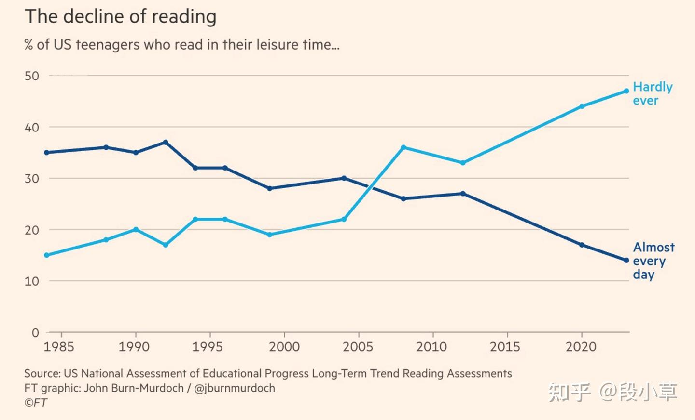

# 人类是否已度过大脑能力的巅峰？ - 知乎
[人类是否已度过大脑能力的巅峰？ - 知乎](https://zhuanlan.zhihu.com/p/30421202960) 

 > 原文 | [Have humans passed peak brain power?](https://link.zhihu.com/?target=https%3A//www.ft.com/content/a8016c64-63b7-458b-a371-e0e1c54a13fc)  
> 编译 | 段小草+Grok3

各国和各年龄段的数据显示，人们集中注意力、语言推理和数字推理能力正在日益下降

什么是智力？这看似是一个简单的问题，答案也看似直接——[《牛津英语词典》](https://zhida.zhihu.com/search?content_id=255106532&content_type=Article&match_order=1&q=%E3%80%8A%E7%89%9B%E6%B4%A5%E8%8B%B1%E8%AF%AD%E8%AF%8D%E5%85%B8%E3%80%8B&zhida_source=entity)将其定义为“[理解的能力](https://link.zhihu.com/?target=https%3A//www.oed.com/dictionary/intelligence_n%3Ftl%3Dtrue)”——但这一定义本身在现代世界中提出了一个日益相关的问题。如果我们实际运用这种能力的能力正在减弱，会发生什么？越来越多的证据表明，在过去十年左右的时间里，人类的智力正是经历了这样的情况。

没有人会认为在如此短暂的时间跨度内，人类大脑的基础生物学发生了变化。然而，通过一系列测试，普通人在推理和解决新问题方面的能力似乎在2010年代初达到顶峰，此后一直在下降。

当OECD的国际基准测试[PISA](https://zhida.zhihu.com/search?content_id=255106532&content_type=Article&match_order=1&q=PISA&zhida_source=entity)（针对15岁学生在阅读、数学和科学方面的表现）发布了最新一轮分析结果时，人们的关注点自然落在了新冠疫情对教育中断的影响上。但这掩盖了一个更长期、更广泛的恶化趋势。

所谓更长期，是指所有三个学科的成绩在2012年左右达到顶峰。在许多情况下，2012年至2018年间的成绩下降幅度超过了疫情影响期间的下降。而所谓更广泛，是指这种推理和问题解决能力的下降不仅仅局限于青少年。成年人也表现出类似的[模式](https://link.zhihu.com/?target=https%3A//eaea.org/2024/12/11/new-piaac-results-show-declining-literacy-and-increasing-inequality-in-many-european-countries-better-adult-learning-is-necessary/)，去年OECD对成人技能趋势的旗舰评估更新显示，所有年龄段的下降趋势均可见。

考虑到其重要性，关于人类注意力或心理能力的长期一致性[研究](https://link.zhihu.com/?target=https%3A//www.lesswrong.com/posts/Pweg9xpKknkNwN8Fx/have-attention-spans-been-declining)惊人地少。但有一个罕见的例外：自1980年代以来，每年[《Monitoring the Future》](https://zhida.zhihu.com/search?content_id=255106532&content_type=Article&match_order=1&q=%E3%80%8AMonitoring+the+Future%E3%80%8B&zhida_source=entity)研究都会询问18岁的高中生，他们是否在思考、集中注意力或学习新事物时感到困难。在1990年代和2000年代，报告有困难的高中最后一年学生的比例保持稳定，但在2010年代中期开始迅速上升。

这一转折点值得注意，不仅因为它与智力和推理测试的表现相似，还因为它与另一个更广泛的发展趋势同步：我们与信息的不断在线获取的关系发生了变化。

我们所看到的这种情况，部分原因可能是从文本向[视觉](https://link.zhihu.com/?target=https%3A//www.ft.com/content/2262f82e-fb65-445b-b99c-b039c1b32ce9)媒体的持续过渡——向一个“[后文字](https://link.zhihu.com/?target=https%3A//www.ft.com/content/e2ddd496-4f07-4dc8-a47c-314354da8d46)”社会的转变，人们痴迷于屏幕。

阅读的下降确实是真实的——2022年，报告称在过去一年读过一本书的美国人比例跌至[一半](https://link.zhihu.com/?target=https%3A//www.arts.gov/stories/blog/2024/federal-data-reading-pleasure-all-signs-show-slump%2523%3A~%3Atext%3DLast%2520fall%2C%2520the%2520NEA%2520reported%2C54.6%2520percent%2520ten%2520years%2520earlier)以下。

然而，特别引人注目的是，我们看到这一现象的同时，大多数国家的数字应用和其他问题解决能力的表现也在下降。

一个尤其令人瞩目的统计数据显示，在高收入国家中，平均有25%的成年人无法“在审查和评估陈述有效性时使用数学推理”，在美国这一比例高达35%。

因此，我们似乎看到的不仅仅是阅读本身的下降，而是一种更广泛的人类心理专注和应用能力的侵蚀。

关于数字媒体对社会影响的大多数讨论都集中在智能手机和社交媒体的兴起上。但人类专注思考能力的变化与一个更根本的转变相吻合：我们与信息的关系发生了改变。

我们已经从有限的网页转向了无限的、不断刷新的信息流和持续的通知轰炸。我们不再像过去那样花时间主动浏览网页并与熟人互动，而是面对内容的洪流。这代表着从自我导向行为向被动消费和不断切换转变的内容情景。

研究发现，主动、有意地使用数字技术往往是无害的，甚至是有益的。而近年来激增的行为已被证明会影响我们处理语言信息的[能力](https://link.zhihu.com/?target=https%3A//www.frontiersin.org/journals/education/articles/10.3389/feduc.2021.600687/full)、[注意力](https://link.zhihu.com/?target=https%3A//educationaltechnologyjournal.springeropen.com/articles/10.1186/s41239-018-0096-z)、工作记忆和自我调节。

好消息是，人类潜在的智力能力无疑并未减弱。但结果是潜能与执行力的共同作用。对我们中的大多人来说，数字环境正在阻碍后者的发挥。