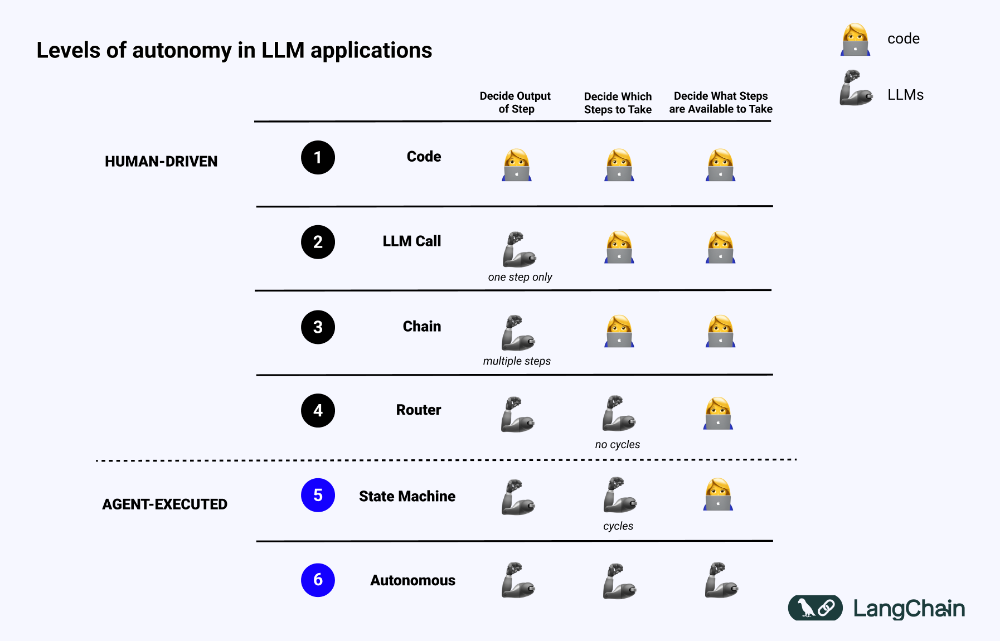

# 什么是“认知架构”？[译] | 宝玉的分享
这是我们“In the Loop”系列的第二篇文章，重点讨论“认知架构”的含义。

> **_更新：一些读者指出，“认知架构”一词在神经科学和计算认知科学中有着_** [**_悠久的历史_**](https://en.wikipedia.org/wiki/Cognitive_architecture?ref=blog.langchain.dev) **_。根据维基百科的定义，“认知架构”既指关于人类思维结构的理论，也指该理论的计算实现。这一定义（以及相关的研究和文章）比我在此提出的定义更全面，本篇博文应被视为我在过去一年中构建和帮助构建基于大语言模型（LLM）的应用程序经验与该研究领域的映射。_**

在过去的六个月里，我经常使用的一个短语是“认知架构”，并且未来可能会更频繁地使用。这个词我最早是从[Flo Crivello](https://x.com/Altimor?ref_src=twsrc%5Egoogle%7Ctwcamp%5Eserp%7Ctwgr%5Eauthor&ref=blog.langchain.dev)那里听到的——这个词的提出归功于他，我认为它是个极好的术语。那么我的意思是什么呢？

我所说的认知架构是指\_系统如何“思考”\_——也就是说，从接收用户输入，到执行操作或生成响应的代码/提示词/LLM调用流程。

我喜欢“认知”这个词，因为具备智能体特性的系统依赖LLM进行推理来决定该做什么。

我也喜欢“架构”这个词，因为这些具有智能体特性的系统仍然涉及大量类似于传统系统架构的工程设计工作。

将自主性级别映射到认知架构
-------------

如果我们回顾这张幻灯片（最早出现在[我的TED演讲](https://www.ted.com/talks/harrison_chase_the_magical_ai_assistants_of_the_future_and_the_engineering_behind_them?ref=blog.langchain.dev)中），我们可以看到不同自主性级别的认知架构示例。

首先是代码——所有内容都是硬编码的。这甚至还不能称作真正的认知架构。

接下来是单次LLM调用。在调用前或调用后可能会进行一些数据预处理，但单次LLM调用构成了应用程序的主要部分。简单的聊天机器人可能属于这一类别。

接下来是LLM调用链。这种序列可能将问题分解为多个步骤，或是为了不同的功能服务。更复杂的RAG（检索增强生成）管道属于这一类别：首先使用LLM生成搜索查询，然后通过第二次LLM调用生成答案。

再接下来是路由器。在这之前，应用程序的所有步骤都是预先确定的。现在不再如此，LLM会决定要采取的操作。这增加了一定的随机性和不可预测性。

再往上是我称为状态机的架构。它将LLM的路由与循环结合起来。这更加不可预测，因为结合了路由和循环，系统理论上可以无限次调用LLM。

最高级别的自主性是我称为“智能体”的层次，或者说是真正的“自主智能体”。在状态机中，依然存在某些限制，决定哪些操作可以执行，执行后会采取哪些流程。而在自主智能体中，这些防护栏被移除了。系统本身开始决定哪些步骤是可用的，指令是什么：这可以通过更新提示词、工具或代码来实现。

**选择认知架构**
----------

当我谈论“选择认知架构”时，我指的是选择你想要采用的架构类型。它们没有绝对的优劣之分——每种架构都有其适用的任务。

在构建LLM应用时，你可能会像尝试不同提示词一样频繁地尝试不同的认知架构。我们构建了[LangChain](https://www.langchain.com/langchain?ref=blog.langchain.dev)和[LangGraph](https://www.langchain.com/langgraph?ref=blog.langchain.dev)来支持这一点。在过去一年中，我们的大部分开发工作都集中在构建低级别、高度可控的编排框架（LCEL和LangGraph）上。

这与早期LangChain的设计方向有所不同，早期LangChain主要关注易于使用的现成链条。这些链条非常适合入门，但在定制和实验方面较为局限。在早期阶段，这样的设计尚可接受，因为大家只是想快速入门，但随着领域的发展，这种设计很快达到了瓶颈。

我对我们在过去一年中为LangChain和LangGraph增加灵活性和定制化所做的努力感到非常自豪。如果你只使用过LangChain的高级包装器，建议你查看一下低级部分。它们更加灵活，真正能够让你控制应用程序的认知架构。

_如果你正在构建简单的链条和检索流程，请查看_ [_Python中的LangChain_](https://python.langchain.com/v0.2/docs/introduction/?ref=blog.langchain.dev) _和_ [_JavaScript中的LangChain_](https://js.langchain.com/v0.2/docs/introduction/?ref=blog.langchain.dev)_。如果你在构建更复杂的_智能体_工作流，请试试_ [_Python中的LangGraph_](https://langchain-ai.github.io/langgraph/tutorials/introduction/?ref=blog.langchain.dev) _和_ [_JavaScript中的LangGraph_](https://langchain-ai.github.io/langgraphjs/tutorials/quickstart/?ref=blog.langchain.dev)\_。

在选择认知架构时，重要的是要记住，不同的任务可能需要不同的架构。较为简单的任务可能只需要单次LLM调用，而更复杂的任务可能需要LLM调用链甚至状态机。对于完全自主的应用，你可能需要构建自主智能体架构。

此外，认知架构不仅影响系统的运行方式，还影响其灵活性、可控性以及可解释性。较简单的架构通常更易于理解和调试，而复杂的架构则可能提供更强的功能，但也伴随着更大的系统复杂性和不确定性。

无论你选择哪种架构，关键是要根据你的任务需求找到最佳平衡。我们正在为[LangChain](https://www.langchain.com/langchain?ref=blog.langchain.dev)和[LangGraph](https://www.langchain.com/langgraph?ref=blog.langchain.dev)构建工具，帮助开发者在设计和实现LLM应用时灵活探索不同的架构选择。

_如果你对此感兴趣，请查看我们提供的详细教程和文档，涵盖Python和JavaScript版本的LangChain和LangGraph。_