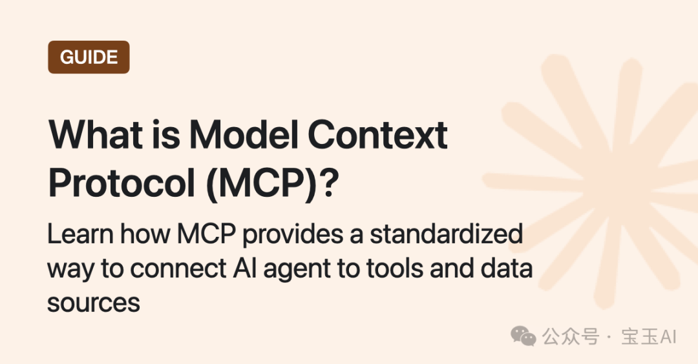
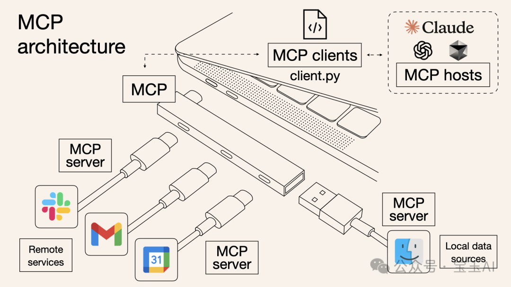
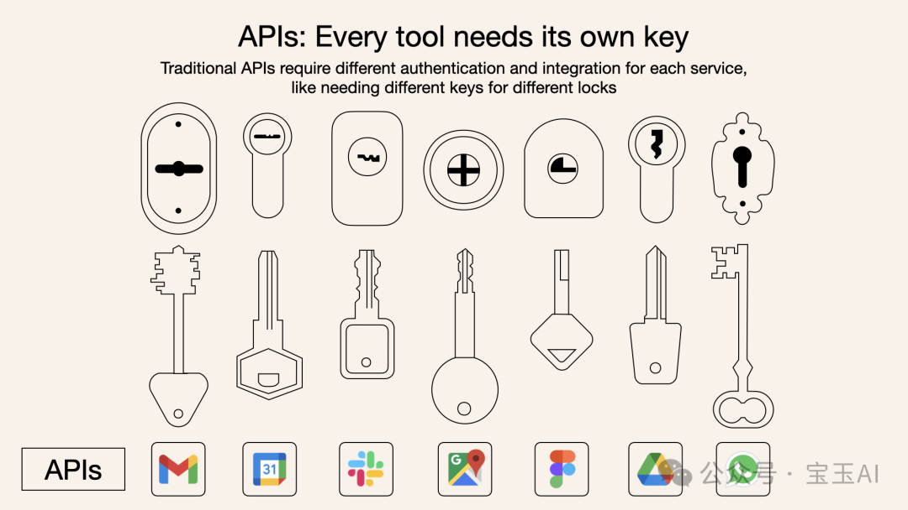

Title: 什么是模型上下文协议（MCP）？它如何比传统API更简单地集成AI？

URL Source: https://mp.weixin.qq.com/s/oyewbUXalcfjjKo6R6YOdA

Markdown Content:

什么是模型上下文协议（MCP）？它如何比传统API更简单地集成AI？

**模型上下文协议（Model Context Protocol，简称MCP）** 是一种全新的开放协议，专门用于标准化地为大语言模型（LLMs）提供应用场景和数据背景。

你可以把MCP想象成AI领域的“USB-C接口”，它能让不同的AI模型与外部工具和数据源轻松连接。

本文将清晰地解释MCP的价值、工作原理，以及它与传统API的关键区别。

什么是MCP？
-------

**模型上下文协议（MCP）** 就像是为AI模型量身定制的“USB-C接口”，可以标准化地连接AI系统与各类外部工具和数据源。

什么是MCP？

就像USB-C接口让你的电脑更容易连接各种设备一样，MCP让AI模型更简单地获取数据、工具与服务。

为什么要用MCP，而不是传统的API？
-------------------

通常，AI系统想连接外部工具时，需要单独整合多个不同的API。每个API都有独立的代码、文档、认证方式、错误处理和后续维护，极大地增加了开发复杂度。

### 为什么说传统API就像每扇门都有一把不同的钥匙？

**打个比方：** API就像不同的门，每扇门都需要自己的钥匙和特定的规则。

为什么使用MCP而非传统API？

传统的API要求开发者为每个服务或数据源单独编写代码和整合方案。

MCP背后是谁？
--------

MCP最早由Anthropic ↗\[1\]公司开发，目的是帮助AI模型（如Claude）更容易地连接工具和数据源。

但现在，MCP已经成为一个开放协议，越来越多的企业和开发者开始采用它，这也让它逐渐成为AI与工具互动的新标准。

> 📌 想深入了解？可以访问官方的MCP规格文档 ↗\[2\]。

MCP与API快速对比
-----------

| 
功能

 | 

MCP

 | 

传统API

 |
| --- | --- | --- |
| **整合难度** | 

一次标准化整合

 | 

每个API单独整合

 |
| **实时双向通信** | 

✅ 支持

 | 

❌ 不支持

 |
| **动态发现工具** | 

✅ 支持

 | 

❌ 不支持

 |
| **扩展性** | 

即插即用

 | 

需要额外开发

 |
| **安全性与控制** | 

所有工具统一标准

 | 

每个API单独定义

 |

### MCP与传统API关键区别：

*   • **单一协议：** MCP像一个统一接口，只要一次整合，就能连接多个服务。
    
*   • **动态发现：** AI模型能自动识别并使用可用的工具，不用提前写死每个接口。
    
*   • **双向通信：** MCP支持类似WebSockets的实时双向通信，模型不仅能查询数据，还能主动触发操作。
    

为什么要有双向通信？

MCP提供实时互动，模型能：

*   • **拉取数据：** 模型实时查询数据，如查看你的**日历**。
    
*   • **触发操作：** 模型主动向服务器发出指令，如**重新安排会议**或**发送邮件**。
    

MCP如何工作：架构原理
------------

MCP采用简单的客户端-服务器架构：

MCP的工作架构

*   • **MCP主机（Host）：** 如Claude桌面应用或智能开发环境（IDE），需要访问外部数据或工具。
    
*   • **MCP客户端（Client）：** 与MCP服务器建立一对一的稳定连接。
    
*   • **MCP服务器（Server）：** 提供特定功能，连接本地或远程的数据源。
    
*   • **本地数据源：** 文件、数据库或服务。
    
*   • **远程服务：** 外部API或互联网服务。
    

**简单说，MCP像一座桥梁：** 它本身不处理复杂逻辑，只负责协调AI模型与工具之间的信息流动。

### 实际中的MCP客户端案例

比如，一个Python脚本（`client.py`）作为MCP客户端，可以轻松连接MCP服务器，以控制Gmail、Slack或日历应用，无需每个工具单独编写代码。

MCP应用案例：什么时候用它？
---------------

设想下面几个场景：

### 1\. 旅行规划助手

*   • **使用 API 时：** 分别为谷歌日历、邮件、机票预订写代码，繁琐而复杂。
    
*   • **使用 MCP 时：** AI助手直接通过MCP统一协议，查看**日历**、**订机票**、**发邮件确认**，无须单独整合每个工具。
    

### 2\. 智能IDE（代码编辑器）

*   • **使用 API 时：** 手动连接文件系统、版本管理、包管理和文档，耗时费力。
    
*   • **使用 MCP 时：** IDE 通过 MCP 一次连接所有功能，带来更丰富的上下文支持，更强大的智能建议。
    

### 3\. 复杂的数据分析

*   • **使用 API 时：** 人工管理与每个数据库、数据可视化工具的连接。
    
*   • **使用 MCP 时：** AI自动发现并连接多个数据库和可视化工具，通过统一的MCP接口轻松完成分析任务。
    

MCP 的好处
-------

*   • **简化开发：** 一次整合，多次复用，不再重复开发。
    
*   • **灵活性强：** 轻松切换AI模型或工具，无需复杂的重新配置。
    
*   • **实时互动：** 长连接保证数据实时更新。
    
*   • **安全可靠：** 内置标准化安全和权限控制。
    
*   • **扩展性强：** AI系统扩展时，只需连接新的MCP服务器。
    

什么时候传统 API 更适合？
---------------

如果你的应用场景需要精准且严格受控的交互方式，那么传统API可能更合适。MCP提供广泛而灵活的动态能力，更适合需要上下文理解的场景，但不一定适用于严格受控的场合。

### 传统API更合适的场景：

*   • 需要细粒度控制、功能严格限制；
    
*   • 更偏好紧耦合以提升性能；
    
*   • 希望最大化交互的可预测性。
    

如何开始使用MCP？
----------

快速集成MCP的步骤：

1.  1. **定义能力：** 明确你的MCP服务器提供哪些功能。
    
2.  2. **实现MCP层：** 按照协议标准进行开发。
    
3.  3. **选择通信方式：** 本地连接（标准输入输出）或远程连接（如WebSockets）。
    
4.  4. **创建资源/工具：** 开发或连接你的数据源和服务。
    
5.  5. **建立客户端连接：** 与MCP服务器建立安全稳定的连接。
    

总结
--

### 再次回顾什么是MCP：

*   • **MCP：** 为AI模型统一连接数据与工具的标准接口。
    
*   • **API：** 传统的方式，每个服务单独连接，开发更复杂。
    

什么是MCP？

MCP让AI与外部数据、工具的连接变得更加标准化和高效。

结论
--

MCP不仅仅是另一种API，而是一个强大的连接框架，让AI应用能更智能、更动态地融入丰富的上下文环境，快速实现复杂的功能互动。

#### 引用链接

`[1]` Anthropic ↗: _https://www.anthropic.com/news/model-context-protocol_  
`[2]` MCP规格文档 ↗: _https://modelcontextprotocol.io/_
