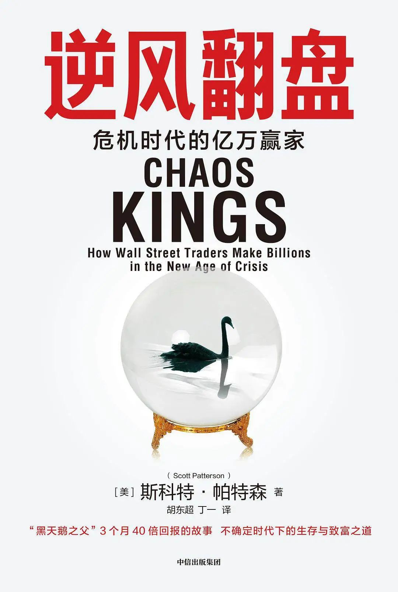
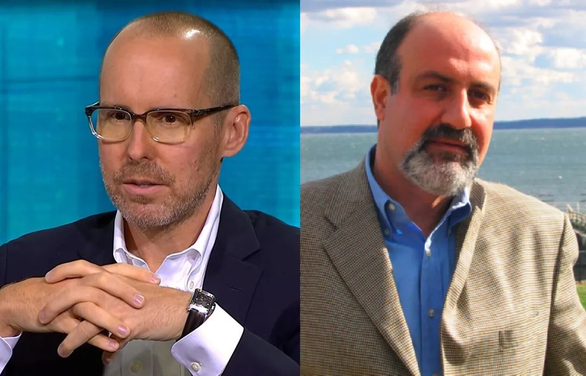
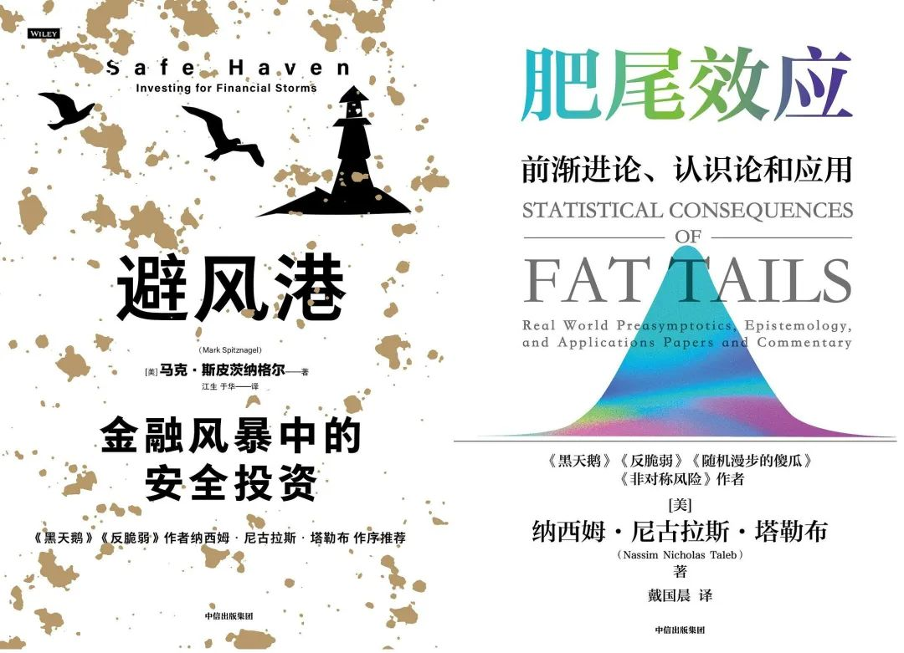
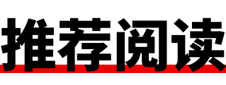

Title: 从危机中赚钱的人，相信全球金融系统是个纸牌屋丨晚点周末

URL Source: https://mp.weixin.qq.com/s/DnwIiBtPiUyi35YTmQOhYQ

Markdown Content:

投资者需要保护好自己的资产，始终警惕市场发生崩盘的风险。

**文丨曾梦龙**

**编辑丨钱杨**

2020 年 2 月到 3 月，新冠疫情的全球蔓延造成投资者的恐慌。他们不计成本、争先恐后地抛售各类资产，全球资本市场暴跌。比如 10 天之内，美股熔断 4 次，让当时 89 岁的沃伦·巴菲特都感叹 “没见过这种场面”。标普 500 指数仅用 22 个交易日，就从 2 月高点下跌 35%，这也是历史上最快一次超过 30% 的下跌幅度。就连平常被认为能对冲股票风险的债券、黄金、比特币，都未能幸免，均遭遇下跌，其中比特币的单日最大跌幅达 47%。

新冠疫情成为又一只史诗级的 “黑天鹅”。它的严重程度不亚于 2008 年全球金融危机、1997 年亚洲金融风暴、1987 年 “黑色星期一”、1930 年代大萧条。而且，由于现代金融市场的高关联性和计算机化，危机发生速度比过去要快得多。不过，在大多数投资者损失惨重、哀鸿遍野之际，一小撮人却因此赚得盆满钵满。

报道金融市场近 20 年的《华尔街日报》记者斯科特·帕特森（Scott Patterson）得知，对冲基金环宇资本（Universa Investments）的创始人马克·斯皮茨纳格尔（Mark Spitznagel）用约 5000 万美元的筹码，转眼间就产生了近 30 亿美元的利润。他管理的 “黑天鹅保护协议” 基金，3 个月的回报率超过了 4144%。

斯皮茨纳格尔不是孤例。对冲基金潘兴广场资本管理（Pershing Square Capital Management）的创始人比尔·阿克曼（Bill Ackman），在这场灾难中赚得更多。他下注 2600 万美元，最终获得 36 亿美元的收益，回报达 138 倍。《巴伦周刊》评价说，“这是有史以来最伟大的交易之一”。

这两件事激发了帕特森的兴趣，老记者的敏锐和直觉让他觉得金融投资可能已经出现新的变化。此前，他捕捉到了量化金融的崛起，写了著作《宽客》（The Quants），里面的人物包括文艺复兴科技的创始人詹姆斯·西蒙斯（James Simons）等。在另一本书《暗池》（Dark Pools）中，他较早地揭露了高频交易和 AI 可能给金融市场带来的风险。

经过 3 年的调查研究和采访写作后，帕特森在 2023 年出版著作 Chaos Kings: How Wall Street Traders Make Billions In The New Age Of Crisis。中文版最近推出，书名译为《逆风翻盘：危机时代的亿万赢家》。书的主角是阿克曼、斯皮茨纳格尔、纳西姆·尼古拉斯·塔勒布（Nassim Nicholas Taleb）等在危机中赚钱的人，帕特森称他们为 “乱世之王”（英文原书名 Chaos Kings）。

塔勒布是环宇资本的高级科学顾问，曾和斯皮茨纳格尔在 1990 年代创立安皮里卡资本公司，制定了环宇资本的最初策略。但他并不认同自己交易员的身份，更想成为一位知识分子，称乔治·索罗斯也是如此。塔勒布后来逐渐远离金融实操，专注写作，并在社交媒体上针砭时弊，著有《黑天鹅》《反脆弱》《随机漫步的傻瓜》等畅销作品。

“塔勒布和斯皮茨纳格尔从数十年的交易中学到的是，从长远来看，成功投资的关键是避免损失很多钱。投资者需要警惕市场发生重大崩盘的风险。” 帕特森说。

**人可以预测市场崩盘的风险吗？**

如果以人能否预测市场崩盘的风险为标准，《逆风翻盘》里的人物可以分为两派：一派认为可以预测，以阿克曼为代表；另一派认为不可预测，以塔勒布、斯皮茨纳格尔为代表。两派虽然都能从危机中赚钱，但底层投资思想和具体交易策略截然不同。

2020 年 1 月开始，阿克曼就对新冠病毒指数级扩散的未来感到焦虑。但他与众多全球顶级金融机构的高管交流后，发现没人和他有着类似担忧。即使是 “奥马哈先知” 巴菲特，也不能理解阿克曼为何由于 “即将来临的疫情”，要取消原定 5 月参加的伯克希尔·哈撒韦年度股东大会。

2 月初，在会见了一位咳嗽的客户后，阿克曼决定采取行动，通知员工远程办公。2 月 23 日，他找到了债券市场的机会，认为市场远没有反映他看到的风险，投资者还沉醉在一直上升的趋势中。阿克曼购买了 2600 万美元的信用违约互换（CDS）合约。这些合约与 710 亿美元的公司债挂钩，包括 420 亿美元的投资级债券、超过 200 亿美元的欧洲债券指数以及 30 亿美元的垃圾债券。CDS 的原理类似保险，如果债券指数大跌，阿克曼将获得巨额回报。

3 月，投资者们终于意识到了疫情的危险，市场暴跌，阿克曼狂赚，像 3 月 12 日美股熔断那天，他就赚了 7.8 亿美元。在通过做空债券市场积累 26 亿美元的利润后，阿克曼将这笔利润投入股市，购买希尔顿、伯克希尔·哈撒韦、星巴克、劳氏等公司的股票。在美国政府救市政策的刺激下，阿克曼的股票投资又赚了 10 亿美元。一个来回，他靠 2600 万美元赚了 36 亿美元的收益。

阿克曼的成功和他的眼光、嗅觉和敏锐密不可分。他最早出名是因为高调投资星巴克、温蒂汉堡等公司。2008 年次贷危机中，他曾大举做空因美国房屋抵押贷款濒临破产的房利美、房地美等公司。但阿克曼的做空并非全胜，比如他曾说保健品公司康宝莱是个传销组织，押注 10 亿美元做空。结果遇到了对手卡尔·伊坎（电影《华尔街》主角戈登·盖柯的原型之一），伊坎反向做多康宝莱，将阿克曼逼入绝境，被迫清仓输钱。

帕特森提及，类似阿克曼 2020 年年初的交易过往至少有两笔：高盛的对冲基金经理约翰·保尔森在 2007 年通过与房地产有关的投机赚取了 150 亿美元；电影《大空头》里克里斯蒂安·贝尔饰演的基金经理原型迈克尔·贝瑞，通过做空与美国房地产相关的衍生产品，实现了近 500% 的收益率。他们和阿克曼一样，逆共识、一次性、大额押注。

这种方式虽能获得巨额利润，但无法保证重复成功。帕特森说，保尔森和贝瑞后来都没能复制神话，保尔森还遭遇过重大亏损。阿克曼之前也在康宝莱的交易中做空失败。“相较之下，环宇资本则能不断下注，永无止境。”

由于认为市场崩盘不可预测，环宇资本每天都会购买看跌期权，比如市场在一个月内下跌 20%。期权是赋予其所有者在特定时间内以特定价格买卖股票的合约。这意味着，在大多数交易日，它们每天都会遭受小幅损失，持续 “出血”。不过，市场一旦崩盘，这些看跌期权能带来不对称的巨额收益，远超之前累积的损失。斯皮茨纳格尔将其类比为 “保险”，如果发生重大意外，保险赔偿金将远超每天支付累积的保费。

身材修长、头顶明亮的斯皮茨纳格尔称自己的衍生品交易团队为 “海盗”，而非 “海军”（借用乔布斯 “成为海盗比加入海军更有意思” 的名言）。2020 年 3 月，这群海盗忙到几乎没时间休息。许多人每天只在办公室的沙发上或者家里的办公桌上打个盹儿，然后起身，大口喝下咖啡，默不作声地赚上一笔。办公室里回荡着巴赫的和弦。

帕特森解释，环宇资本和华尔街主流的投资方法截然相反。主流交易员的投资期望是平均每天都能获得小额增量的收益，岁末年初拿到丰厚奖金。即使市场崩盘造成损失，那他们也是大多数，不会受到苛责惩罚。

通常情况下，基金经理的业绩好坏并非取决于他们为投资者赚取了多少利润，而是与同类基金经理的基准表现相比如何。他在《逆风翻盘》中举例：如果一位基金经理亏损 10%，但基准下跌 12%，他将获得不错的奖金——因为他少跌了 2%！“对投资者而言，不利之处在于，基金经理往往倾向于模仿彼此，呈现出羊群般一致的从众行为。”

不从众的环宇资本收获了成功。这家 2007 年成立的对冲基金，管理资金最初不到 5 亿美元，但在每次危机导致市场剧烈波动时（如 2008 年全球金融危机、2010 年美股闪崩、2011 年美债降级、2015 年 8 月美股暴跌、2018 年所谓 “末日浩劫”），都赚了钱，规模随之扩大。

2020 年疫情全球扩散前，它的管理规模已达 43 亿美元。据《机构投资者》（Institutional Investor），到 2022 年年底，这家仅有 15 年历史的公司已经在为约 200 亿美元的资产提供崩盘保护，跻身全球第 24 大对冲基金。而且，这家公司仅有 21 名员工，意味着平均每名员工管理近 10 亿美元。

会计师事务所安永审计过黑天鹅保护协议基金从 2008 年上市交易到 2019 年 12 月的年均资本回报率，发现达到 105%。这还没算上 2020 年年初的暴利，但已经可与世界上最好的对冲基金媲美。

帕特森提到，斯皮茨纳格尔现在常与全球顶级投资者交流，其中包括一些主权财富基金和养老基金，比如中国投资有限责任公司、中东政府的大型基金、美国各地的养老基金。这表明保守和稳健的投资机构渐渐认可非主流的投资思想。

环宇资本的成功引来了同行模仿，比如有公司也搭建了崩盘策略，还有的甚至推出黑天鹅 ETF。媒体的关注袭来，像《华尔街日报》评论道：“曾经，市场一度由预期股市上涨的多头和预期股市下跌的空头主导。如今，另一个派别正在崛起。这些投资者关注的是波动率，即价格在一段时间内的变动幅度。近年来，关注波动率已从衍生品交易者的专长变成一种独立的交易工具。”

但斯皮茨纳格尔和塔勒布对这些模仿和关注没什么好感，觉得它们并不了解实际情况。金融业一直存在从众、慕强和嫉妒心理，盲目跟从适得其反。

**黑天鹅投资思想是如何诞生的？**

帕特森将斯皮茨纳格尔和塔勒布交易策略背后的指导思想总结为三个方面：

第一，未来由有重大影响力的事件主导，很难甚至不可预测。任何事情都有可能发生（黑天鹅）。就像谚语所说，即使是坏掉的钟，一天也准两次。

第二，极端事件比许多人想象的更具破坏性，因为正态分布曲线等标准风险指标无法捕捉极端事件。这意味着，在金融市场上，极端事件通常被低估：这是一个赚钱的机会。这也意味着大多数其他投资者承担的风险比他们意识到的要大。

尽管我们周围有种种变化迹象，但我们还是会假设明天的世界将和今天一样，这是人类普遍的弱点。人们关注的是正态分布曲线中心的普通凸起，而不是曲线尾部的疯狂爆炸。形象地说，现在尾部事件成了核心，是尾巴让狗摆动，而不是狗摇动尾巴。

第三，回撤率比胜率更重要。斯皮茨纳格尔多年前就意识到一个对任何押注未来结果的人来说都至关重要的真理：控制单次大幅亏损远比取得一系列小额盈利重要。假设投资的股票下跌 50%，那为了回本，股票需要上涨 100%，而非 50%。

帕特森在采访中回忆，自己是在 2001 年左右认识塔勒布的。因为当时他发现周围华尔街的人都在阅读一本名叫《随机漫步的傻瓜》的书，作者正是塔勒布。也许出于这样的交情，《逆风翻盘》是第一本深入描绘环宇资本、塔勒布和斯皮茨纳格尔故事和思想的著作。

斯皮茨纳格尔（左）和塔勒布（右）

塔勒布 1960 年出生于黎巴嫩，外祖父是黎巴嫩前副总理。1975 年，黎巴嫩爆发内战，塔勒布家族的土地和宅邸被毁，整个家族也开始逃亡。他在法国巴黎大学学习数学和经济学后，移居美国，进入宾夕法尼亚大学沃顿商学院读 MBA，后又去巴黎第九大学念了数学博士。

回头来看，塔勒布觉得自己在早年生活就建立了朴素的黑天鹅价值观（人生和世事无常，难以预测）。当时，他最喜爱《第三帝国的兴亡》作者威廉·夏伊勒写的《柏林日记：二战驻徳记者见闻 (1934—1941)》。夏伊勒的日记极具现场感，但根本没有体现对 “二战” 爆发的预见性。

这和塔勒布的经历类似，没人预料到黎巴嫩内战即将爆发。尽管战火肆虐，但大多数人认为内战很快就会结束，结果持续了 15 年。十几岁时，他的一个朋友就在俄罗斯轮盘赌中丧命，一个同学在一次混乱中被枪杀。

“这个年轻的怀疑论者得到的教训是，人们对于未来的事态发展一无所知。只有在事后回顾时，他们才会声称自己早已预见一切。” 帕特森写道。

在沃顿商学院，塔勒布延续了年少时的叛逆（如 15 岁时因用水泥块袭警入狱）。他在接触一些世界上最大公司的 CEO 后，震惊于他们的肤浅、徒有其表，甚至装腔作势。他最大的收获是接触到了当时的新鲜事物 “期权”。塔勒布着迷于极不可能发生事件的期权，它们非常便宜，但事件发生会带来非对称性的巨额回报。

1987 年，美国股市处于火热中，塔勒布已经收集了几个月的欧元和美元的廉价期权。10 月 19 日，“黑色星期一” 出现，道琼斯工业平均指数单日下跌约 23%。第二天，美联储宣布大量注入现金。27 岁的塔勒布以 2 美元或 3 美元购买的合约售价飙升至 300 美元、400 美元、500 美元，实现了财务自由。

这一年，16 岁的斯皮茨纳格尔在参观芝加哥期货交易所后，放弃进入纽约茱莉亚音乐学院，准备投身交易员事业。他从图书馆借了本《谷物交易商：芝加哥期货交易所的故事》（The Grain Traders）阅读，跟随资深交易员埃弗里特·克里普学习。

克里普对他产生了深刻影响。类似 “尽早恐慌，立即止损。”“你必须喜欢亏损，不喜盈利。这违反了人性，但这就是你必须克服的。”“你必须表现得像个愚者，内心更要有一种愚者的觉悟”。种种告诫，刻进了斯皮茨纳格尔的内心。

“克里普的独特见解在于，交易的实质并非市场运行机制。他重视的是交易纪律，这也是我初涉交易领域时所领悟的第一课”，斯皮茨纳格尔回忆道，“实际上，整个交易业务均建立在交易纪律这一基石之上，其余皆为细枝末节。交易者须克服舒适心理，将自己置于不适之中。若能战胜此心境，成功的机会便触手可及，也意味着财富增值的契机。”

1994 年美国债券市场出现大波动，他秉持纪律活了下来，但许多自信的交易员因此破产。1997 年年初，斯皮茨纳格尔看到电子交易的趋势，放弃了场内交易员的工作，转型为自营商。当年 10 月，亚洲金融危机爆发，他靠做空股市赚了一大笔钱。第二年，从对冲基金长期资本管理公司（LTCM）的崩溃中，他又收获颇丰。

接连的成功让斯皮茨纳格尔有机会 “学术休假”，他去了纽约大学柯朗数学科学研究所。这是世界顶尖的应用数学学院，也是华尔街量化人才的聚集地。而且，这所学校刚引进了一位金融学教授塔勒布，讲授 “量化金融中的模型失败”。

“不当的风险模型被过度加杠杆的对冲基金和投资银行使用，导致金融体系变得愈加脆弱，如同在沙堆上（或炸药上）建立城堡。这预示着更多崩溃、剧烈波动和金融危机。” 塔勒布说。

斯皮茨纳格尔读过塔勒布的著作《动态对冲：管理普通期权与奇异期权》。他觉得这本书让自己从单纯、凭直觉的场内交易领域，进入了复杂的衍生品数学世界。两人在纽约大学见面后，一拍即合，决定合作。一个月后，环宇资本的前身安皮里卡资本公司诞生。

斯皮茨纳格尔和塔勒布一样擅长数学，具有叛逆气质。他的父亲是牧师，父母信仰嬉皮士式的自由主义，而他少年时着迷于保守派的议员、杂志和著作。后来，斯皮茨纳格尔成为芝加哥学派和奥地利学派的忠实信徒，并以此指导自己投资，反对美联储的量化宽松干预政策。有段时间，他喜欢系上代表自由市场的经济学家亚当·斯密头像的领带。

和塔勒布不同，斯皮茨纳格尔更认同自己交易员的身份。虽然基金几乎每日都在亏损，但他能坚守纪律、承受压力。为了克服人性中对风险的厌恶，他以从事滑翔等高危运动为乐。他会驱车前往沙漠，跳上一架没有引擎的滑翔机。一架飞机会拖着滑翔机飞向天空。被释放后，滑翔机在气流中摆动，编织出不同轨迹。

“斯皮茨纳格尔喜欢那种在似乎完全失控的情况下仍能控制局面的感觉。” 帕特森说。

塔勒布 33 岁时得过喉癌，虽然痊愈，但他觉得交易压力有损健康。每日亏损给他带来无尽折磨，等待崩盘又显得遥遥无期。在担忧癌症复发的焦虑下，塔勒布在 5 年后退出了安皮里卡资本公司，专心写作，不久出版卖了几百万册的《黑天鹅》。此时，两人打造的黑天鹅投资思想和交易策略也已基本成型，环宇资本成立。

**准备好迎接下一场危机了吗？**

如果要更深入理解斯皮茨纳格尔和塔勒布的投资思想，需要具备一定的数学基础。这也是《逆风翻盘》一书的缺憾，省略了不少相关的数学内容。不过，这些数学知识和论证在塔勒布的著作（如《肥尾效应》《非对称风险》）和斯皮茨纳格尔的著作（如《避风港》）中，都有呈现。斯皮茨纳格尔甚至为普通读者推荐了参考读物，来自畅销书作家威廉·庞德斯通的《赌神数学家》（Fortune's Formula）。

简单来说，他们强调投资要多用几何或者非线性思维，不要低估极端事件的发生。投资计算的应该是几何平均收益率，而非算术平均收益率。随机结果往往不是标准的正态分布，更有可能是正偏态分布。

在《避风港》中，斯皮茨纳格尔言辞犀利地抨击了资产配置行业的 “多元化” 教条。“现代投资组合理论” 的开创者、诺奖经济学家哈里·马科维茨有句名言：“分散配置，比如构建一个被动的全市场投资组合，是投资中唯一 ‘免费的午餐’。”

斯皮茨纳格尔觉得这根本不是免费的午餐，“多元化要么意味着以较低的潜在风险换取较低的收益率，要么意味着从系统性风险或集中性风险转向杠杆型风险”。

比如基金经理在投资组合中加入了黄金和债券，这样虽然降低了组合的波动率，但也牺牲了组合长期的复合收益率。“从根本上说，多元化是对风险的稀释，而非风险的解决方案。它是一种风险逃避。此外，对波动性的估计被混同为风险。”

更让人震惊的是，斯皮茨纳格尔通过数学证明（此处省略论证过程），基金经理可以在降低投资组合的风险下，还能提高其复合收益率。这违反了 “高风险、高收益”“低风险、低收益” 的常识认知。

数据表明，“3% 的黑天鹅保护协议基金 +97% 标普 500 指数” 的投资组合年化复合收益率要高于 “100% 标普 500 指数” 投资组合 3% 左右。而 “100% 标普 500 指数” 的年化复合收益率要高于黄金、债券、对冲基金和标普 500 指数各种比例混搭的组合（如 25% 的黄金 +75% 的标普 500、25% 的债券 +75% 的标普 500、25% 的对冲基金 +75% 的标普 500）。

此外，他测算了约 40 种资产对投资组合风险缓释的效果，包括黄金，商品，10 年期美国国债，瑞士法郎、日元、美元等货币，私人股本，价值策略，动量策略，风险平价，低波动率策略和波动率管理策略，做多波动率，各种对冲基金策略，等等。

斯皮茨纳格尔发现，只有黄金和黑天鹅策略能达到降低风险并提高收益的效果。而且，黑天鹅策略具有战略效果，任何时期都有效。相比之下，黄金不是战略性避风港，只在通货膨胀加剧期起到战术对冲作用。如果不是 1970 年代那样的高通胀，黄金无法既降低组合风险又提高收益。

他指出，1973 年以来，每当股票在特定年份下跌 15% 以上时，黄金收益率在 5%~70% 之间，平均略高于 40%。在其他年份，黄金的收益率在 -30%~125% 之间，平均不到 7%。斯皮纳茨格尔认为黄金收益率的范围太广，而且需要占到组合 20% 的比重，远没有黑天鹅策略性价比高。黑天鹅策略只需购买占组合 3% 左右的看跌期权，就能起到比黄金更好的效果。

至于加密货币，斯皮茨纳格尔觉得数据太少、噪声太大，现在无法准确评估。塔勒布说话更直接。他称，比特币无法作为投资的避风港，因为它与市场高度相关。只需想想 2020 年 3 月的危机中，比特币的跌幅超过市场平均。这就表明它作为对冲市场崩盘风险的工具毫无价值。

有意思的是，虽然斯皮茨纳格尔几乎看不起市面所有基金的风险缓释策略，但有一个例外，那就是价值投资。他告诉帕特森：“这个价值取向和我所做的事情非常相似。我买的是人们视为垃圾的东西，大多数时候它们的确是垃圾。”

价格之外，价值投资倡导的逆向投资、长期投资、安全边际等说法和黑天鹅投资思想不谋而合。比如巴菲特的名言：“投资的第一条原则：永远不要亏钱。第二条原则：永远不要忘记第一条。” 塞斯·卡拉曼（Seth Klarman）举过的例子：一个连续 10 年年均收益率为 16% 的投资者（净值 4.411），最终积累的财富要超过连续 9 年年均 20% 收益、但第 10 年亏损 15% 的投资者（净值 4.386）。

这也是斯皮茨纳格尔强调的几何思维、避免损失。《福布斯》评价道：“斯皮茨纳格尔的数学世界观在某些方面与资本主义世界的终极乐观主义者巴菲特相似。毕竟，他放弃了即时满足，以换取远期的巨额回报，在崩溃中变现和获利。”

在《逆风翻盘》中，法国物理学家迪迪埃·索内特（Didier Sornette）是另一位坚持市场崩盘风险可预测的人物。他通过分析动态过程的变化，认为聚焦临界点，某种程度上的预测是可以实现的。索内特不满《黑天鹅》的说法，觉得这会导致人们放弃努力，不再试图弄清未来或了解过去。

“黑天鹅的概念是危险的，这让我们回到了科学出现之前的时代，那时候闪电和风暴都是众神愤怒的表现。” 他说。

塔勒布觉得，即使索内特在理论上正确，但交易员无法依靠它做出精确预测、指导操作。他认为问题的关键在于如何交易，用什么交易，以及如何管理对市场的风险敞口。“我做了 21 年的交易员，刚开始的时候我还有头发。作为一名交易员，要学会一件事，那就是让你赚钱或让你破产的并不是你的观点，而是你如何表达自己的观点。”

他继续解释道，金融工具或策略远比人能否猜对重要得多。例如，如果交易员使用的期权凸性大，即使在 99% 的时间里都猜错了，也不会有什么问题。凸性大意味着能从大波动中受益。因此，做预测是在浪费时间。真正的诀窍在于找出一种不依赖预测的交易策略。

“当你预测错误时仅承担较小损失，预测正确时会获得丰厚利润，你便可以将自己从相关资产的统计属性中剥离出来，这才是更重要的”，塔勒布说，“而那些随便看看统计数据并认为这些数据直接与业绩挂钩的人并不会认识到这一点。”

巴菲特曾说，“金融衍生品是大规模杀伤性武器”。帕特森借此提醒普通投资者不要轻易模仿和尝试塔勒布、阿克曼等人的投资策略。虽然黄金、债券等传统资产不能像衍生品那样起到高性价比的保护作用，但这对普通投资者已经足够。即使牺牲了收益率，至少保证了本金不会遭受重大损失。

塔勒布的建议则是 “杠铃策略”，即在杠铃的一边是约 80% 的安全资产（如短期国债），另一边是约 20% 的高风险资产（如初创科技公司、生物技术公司或新上市的清洁能源股票）。虽然大多数股票不会获得回报，但成功的会有着巨额收益，可能远超之前的亏损（如投中了未来的苹果）。这属于一种变形的黑天鹅策略。

他说，普通投资者在自己的投资组合中，应该专注于保护自己的资产，保护其免受黑天鹅事件的影响，而不是押注股市将在长期内持续上涨。

帕特森分析，斯皮茨纳格尔和塔勒布的交易策略建立在整个金融系统的弱点之上。它们包括衍生品的广泛应用、风险价值等风险管理工具的误用、杠杆激增、美联储宽松的货币政策，以及投资银行转变为野蛮的对冲基金赌场等。

“这些使得全球金融系统宛如一座纸牌屋，一触即溃。” 所以只要这些弱点还在，下一场危机迟早会发生，他们的交易策略仍有效。

下一场危机不限于金融市场。帕特森说很多读者只注意到了自己书名前半部分的 “赚取数十亿美元”（Make Billions），却忽视了后半部分的 “新危机时代”（New Age Of Crisis）。

他认为，受到极端气候变化、地缘政治不稳定、大流行病、民主危机、AI 快速发展等影响，索内特 20 多年前的预测似乎非常准确，即人类正在经历一场文明的阶段性变革。

如今类似的状态描述则是，人类正处于 “长久危机”（permacrisis）或 “多重危机”（polycrisis）之中。

本文不构成投资建议。

题图来源：《大空头》

**\-** **FIN \-**

《晚点 LatePost》推出周末版，希望把视线扩展到各种各样的创造者。简单来说，我们想知道谁在创造，并以之影响周边；我们既注视当下，也回顾过去，寻找形塑今日世界的源头；我们关注技术、商业，也关注历史、人文，打量这些领域的交汇处的涌现。

让我们关注的可能是一款产品、一家店铺、一种包装的设计思路，也可能是某种工作哲学、产品理念、管理方法，可能是一种有趣新颖的生活方式，甚至是在今天仍然焕发光彩的古老思想。

“已经创造出来的东西相比有待创造出来的东西，是微不足道的。” 这是维克多·雨果的话——我们希望《晚点》周末印证这句话。

[

[

